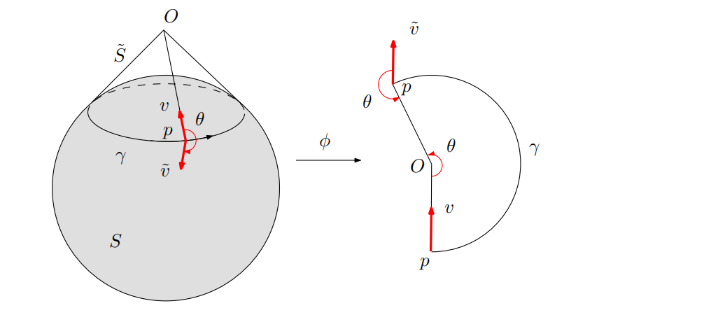

## 向量场的平行移动(Parallel Transport)与联络(Connection)

**平行移动(Parallel Transport)**即向量场中的向量从一个点到另外一个点的移动同时保持与某个标准参考系的角度，在平面上的平行移动是简单的，直接将一个向量从一个点滑向另外一个点即可。而对于曲面的情况就复杂了，因为我们根本无法定义一个全局一致的参考系，向量的方向会随着移动地进行发生完全的偏转。

可以想象一个人在地球表面上沿着某条经线向北走，当过了北极点后其前进的方向就完全相反了。

从更加本质的角度进行思考，我们可以用映射的方式来推广"平行"的概念，定义一个特殊的映射"平行移动映射"$P_{p \to q}$,从 $p$ 的切空间 $T_pM$ 到 $q$ 的切空间 $T_qM$，如果两个向量 $X \in T_pM$ 与 $Y \in T_qM$ 是"平行的"，当且仅当 $Y = P_{p \to q}(X)$。这样从逻辑上解决了没有全局一致坐标系的问题，虽然看起来要建立这样一个映射会很繁琐。

由于相邻点(如图中的p,q)上的向量是定义在各自切空间上的有各自的坐标系，所以要比较这两个向量需要先**将两个切空间对齐**(即建立平行移动映射)，然后再进行对比确定向量场的向量如何进行传播即**"联络(Connections)"**。联络就是规定向量从一个切空间移动到相邻切空间时如何对齐。给定联络后，就可以沿路径平行移动向量。

**联络决定平行移动**，同一个曲面(比如球面 $S^2$)可以配备不同的联络（如 Levi-Civita 联络、平坦联络等)导致完全不同的平行移动行为。

### 离散化

对于离散三角网格上的向量场这个过程可以是简单直观的，先将相邻三角面展开到一个平面上然后**平移**向量，再将**平移后的向量再旋转**一个小角度 $\theta_{ij}$，最后再沿着公共边折回去。

如果是**"只移动不旋转(just translate;don't rotate)"**，即旋转角度 $\theta_{ij} = 0$ 移动过程中LC联络尽可能不扭转(twist)向量的方向，这种特殊联络称为**LC联络(The Levi-Civita Connection)**

### 联络的和乐性(holonomy)

对一条闭合环路 \(\gamma\)，把向量沿 \(\gamma\) 平行移动一圈后，通常不会完全回到原来的方向。这个累计旋转就是该联络在 

\(\gamma\) 上的 holonomy：

$$
\operatorname{Hol}_{\gamma}=\text{沿 }\gamma\text{ 平行移动一圈后的累计变换}.
$$

假设有某个联络每跨过一条边时向量逆时针旋转18°，那么转过一圈图中的环路(跨过5条边)后将逆时针旋转5x18°=90°，这样向量场中的方向就出现了二义性，所以定义**和乐(holonomy)**为绕环路旋转一周后角度的偏移值。

### Levi-Civita 联络与高斯曲率的关系

考虑单位球面 $S^2$，配备 Levi-Civita 联络（由标准度量诱导）。

- 沿赤道走一圈，一个向量平行移动后会回到自身（因为赤道是测地线）。
- 但若沿一个纬度圈（非赤道）走一圈，向量会**旋转一个角度**（与所围球面面积有关）。

上述现象并非巧合——在 Levi-Civita 联络下，holonomy 由曲面的高斯曲率精确决定。

**连续 Gauss-Bonnet 定理**：对单连通区域 $\Omega$，边界闭曲线 $\gamma = \partial\Omega$，沿 $\gamma$ 平行移动一圈的 holonomy 等于 $\Omega$ 上高斯曲率的面积分：
$$
\boxed{\operatorname{Hol}_{\text{LC}}(\gamma) \equiv \iint_\Omega K\, dA \pmod{2\pi}}
$$

其中 $K$ 为高斯曲率，$dA$ 为面积元。

**几何直观**：在平坦区域（$K = 0$，如平面），绕任意环路平行移动后向量方向不变；在弯曲区域（$K \neq 0$），曲率越大、包围面积越大，向量偏转就越显著。高斯曲率本质上是切空间沿闭曲线"扭转的速率"。

**Riemann 曲率 2-形式**：更形式化地，在曲面上 Levi-Civita 联络的曲率 2-形式 $\Omega$ 满足 $\Omega = K\,dA$，而 holonomy 是曲率沿曲面的积分：

$$
\operatorname{Hol}_{\text{LC}}(\gamma) = \exp\!\left(\iint_\Omega \Omega\right) = \exp\!\left(\iint_\Omega K\, dA\right)
$$

由于 SO(2) 是交换群，$\exp$ 退化为角度求和，即 $(K\,dA \bmod 2\pi)$。

**回到球面 $S^2$ 的例子**（$K = 1$ 处处为正）：

- **赤道**（纬度 $\phi_0 = 0$）：包围半球，面积 $2\pi$，$K$ 积分 $= 2\pi \equiv 0 \pmod{2\pi}$ → holonomy 为零，向量回到自身
- **北纬 30°**（$\phi_0 = \pi/6$）：包围球冠面积 $2\pi(1 - \sin\phi_0) = \pi$，$K$ 积分 $= \pi$ → 向量旋转 $180^\circ$ 反向

这就解释了为什么球面上不同纬度圈的 holonomy 不同——它们包围的曲面面积（因而曲率积分）不同。

> **推论**：Levi-Civita 联络平凡的充要条件是高斯曲率处处为零（$K \equiv 0$）。因此一般曲面上无法用 LC 联络获得路径无关的平行移动。

**离散 Gauss-Bonnet**：在三角网格上，高斯曲率集中在顶点。顶点 $v$ 的离散高斯曲率（角亏）为

$$
K_v = 2\pi - \sum_{f \ni v} \theta_f(v)
$$

离散 LC 联络沿 $v$ 的对偶环路的 holonomy **精确等于**该顶点的角亏：

$$
\operatorname{Hol}_{\text{LC}}(v) = K_v
$$

且所有顶点的角亏之和满足离散 Gauss-Bonnet 定理：

$$
\sum_v K_v = 2\pi\,\chi(M)
$$

其中 $\chi(M)$ 为欧拉示性数。这正是后文设计连接修正 $\varphi$ 时约束 $\sum_v s_v = \chi(M)$ 的根源——我们只能**重新分配**总曲率到奇异点上，而不能凭空创造或消灭曲率。

### 平凡联络(Trivial Connection)

**平凡联络**的定义为**曲面上任意闭合环路的和乐（holonomy）都为零**，从而确保了平行移动的路径无关性(Path Independent )。**路径无关性**的含义是：从点 $A$ 到点 $B$ 的平行移动结果，不依赖于你选择的具体路径。如果平行移动路径无关，我们就可以**"从一点生成全局向量场"**。

1. **选择一个基点** $p \in M$ 和该点的一个向量 $v \in T_pM$
2. **对任意点 $q \in M$**：任选一条路径 $\gamma: [0,1] \to M$，使得 $\gamma(0) = p, \gamma(1) = q$；将 $v$ 沿 $\gamma$ **平行移动**到 $q$，得到向量 $v_q \in T_qM$
3. **由于路径无关性**，步骤2的结果**不依赖于 $\gamma$ 的选择**，因此 $v_q$ 是**良定义的（well-defined）**
4. 这样就在整个曲面 $M$ 上定义了一个**全局平行向量场** $X: M \to TM, X(q) = v_q$

我们可以用平凡联络来定义向量场，但如何找到一个平凡联络呢？你首先可能会尝试 Levi-Civita 联络——毕竟，它的定义简单直观。遗憾的是，Levi-Civita 联络一般**不是**平凡的(存在和乐不为零的环路)。

在离散三角网格上，离散 Levi-Civita 联络沿**任意对偶单元边界**的**和乐（holonomy）**等于所包围顶点的**角亏（angle defect）**。
$$
K_v = 2\pi-\sum_{f\ni v}\theta_f(v).
$$

### 构造"带奇异的平坦联络"

然而在四边形网格化中，我们实际上**不需要真正的全局平凡联络**。我们需要的是一种**带奇异的平坦联络（flat connection with singularities）**：

- 在所有**不包围奇异点的环路**上，holonomy = 0（局部平凡，路径无关）；
- 在**包围奇异点 $v$ 的环路**上，holonomy = $2\pi s_v$（允许指定旋转）。

其中 $s_v$ 是 N-RoSy 方向场的**奇异点指标（singularity index）**。以 4-RoSy 为例，$s_v = \pm 1/4$ 分别对应 valence-3 和 valence-5 的奇异点。指标 $s_v$ 的物理含义是：绕奇异点一圈，方向场转过 $2\pi s_v$ 弧度。

> **通俗理解**：我们想把一张皱巴巴的"高斯曲率"分布，重新包装成若干离散的"尖点"（奇异点），其余区域全部熨平（holonomy = 0）。Gauss-Bonnet 定理保证总曲率守恒——我们只能重新分配，不能消灭。

**总曲率守恒**：所有奇异点的指标之和必须满足：

$$
\sum_v s_v = \chi(M)
$$
其中 $\chi(M)$ 是欧拉示性数（球面 $\chi = 2$，环面 $\chi = 0$，双环面 $\chi = -2$，以此类推）。这是全局一致性的必要条件。

### 连接修正的计算

目标：从 LC 联络出发，通过加一个修正 $\varphi$（每条边一个旋转角，即离散 1-form），使得新联络在每个顶点对偶环上的 holonomy 从 $K_v$ 变为目标 $2\pi s_v$。

设离散外微分算子 $d$ 将边上的 1-form 映射为对偶环上的积分，则条件为：

$$
\boxed{(d\varphi)_v = 2\pi s_v - K_v, \quad \forall v}
$$
即修正量 $\varphi$ 需要"填补"当前 holonomy $K_v$ 与目标 $2\pi s_v$ 之间的差距。

**离散 LC 联络的跨面旋转角 $\omega_{ij}^{\text{LC}}$**：对于离散三角网格，跨边 $e_{ij}$ 从面 $T_i$ 传播向量到面 $T_j$ 时：

1. 将 $T_i$ 和 $T_j$ 沿公共边展开到同一平面；
2. 在平面上向量不做任何旋转变换（"just translate, don't rotate"）；
3. 折叠回 3D 后，$\omega_{ij}^{\text{LC}}$ 即为 $T_i$ 与 $T_j$ 局部坐标系在公共边上的相对夹角。

注意这个 $\omega_{ij}^{\text{LC}}$ 本身**不使用**离散 1-form $\varphi$，而是由网格的纯几何（三角形形状与二面角）决定的。绕顶点 $v$ 一圈，所有 $\omega^{\text{LC}}$ 之和恰好等于高斯曲率 $K_v$。

**求解 $\varphi$**：在满足 holonomy 约束的前提下尽量少修改 LC 联络：

$$
\min_{\varphi}\ \frac12\sum_{e} \varphi_e^2
\quad\text{s.t.}\quad
B\varphi = 2\pi s - K,
$$

其中 $B$ 是"边 → 顶点对偶环"的离散关联矩阵（$B_{v,e} = \pm 1$，取决于边 $e$ 在对偶环中的定向）。$\min\|\varphi\|^2$ 的含义是：新联络应尽量接近"自然"的 LC 联络，只在必要时做最小扭转。

求得 $\varphi$ 后，新联络在跨面传播时的旋转增量为：

$$
\omega_{ij}^{\text{new}} = \omega_{ij}^{\text{LC}} + \varphi_{ij}.
$$

### 从修正联络到全局参数化

得到带奇异的平坦联络后，一个最有代表性的应用是生成**全局无缝 N-RoSy 方向场**（进而由 PGP 做参数化和四边形网格化）：

1. 在某个面上选一个方向作为初始向量；
2. 沿任意路径用 $\omega^{\text{new}}$ 平行移动到其他面；
3. 因为 $\omega^{\text{new}}$ 的 holonomy 在所有无奇异环路上为零，移动结果**路径无关**——在整个曲面上得到良定义的方向场；
4. 仅在穿越奇异点时发生设计好的分数圈旋转（$2\pi s_v$）。

用连接修正把高斯曲率"吸收"到少数奇异点上，其余区域变成平坦区，从而可以稳定地生成全局一致的方向场和参数化。

