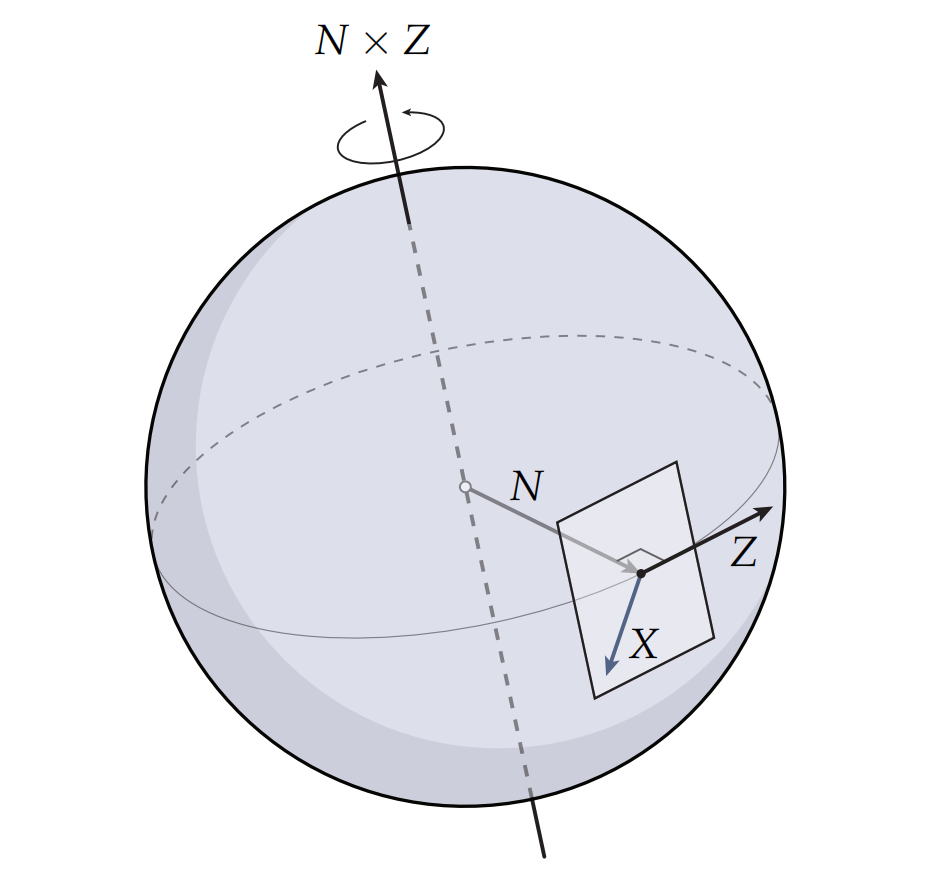

向量场的**联络**及**奇异点**决定了整个向量场，向量场的联络描述了给定初始向量后，如何在曲面上进行扩散。向量场的描述了**奇异点**向量场在某个无法定义区域的情况

## 向量场的平行移动(Parallel Transport)与联络(Connection)

**平行移动(Parallel Transport)**即向量场中的向量从一个点到另外一个点的移动同时保持与某个标准参考系的角度，在平面上的平行移动是简单的，直接将一个向量从一个点滑向另外一个点即可。而对于曲面的情况就复杂了，因为我们根本无法定义一个全局一致的参考系，向量的方向会随着移动地进行发生完全的偏转。

可以想象一个人在地球表面上沿着某条经线向北走，当过了北极点后其前进的方向就完全相反了。

从更加本质的角度进行思考，我们可以用映射的方式来推广"平行"的概念，定义一个特殊的映射"平行移动映射"$P_{p \to q}$,从 $p$ 的切空间 $T_pM$ 到 $q$ 的切空间 $T_qM$，如果两个向量 $X \in T_pM$ 与 $Y \in T_qM$ 是"平行的"，当且仅当 $Y = P_{p \to q}(X)$。这样从逻辑上解决了没有全局一致坐标系的问题，虽然看起来要建立这样一个映射会很繁琐。

由于相邻点(如图中的p,q)上的向量是定义在各自切空间上的有各自的坐标系，所以要比较这两个向量需要先**将两个切空间对齐**(即建立平行移动映射)，然后再进行对比确定向量场的向量如何进行传播即**"联络(Connections)"**。联络就是规定向量从一个切空间移动到相邻切空间时如何对齐。给定联络后，就可以沿路径平行移动向量。

**联络决定平行移动**，同一个曲面(比如球面 $S^2$)可以配备不同的联络（如 Levi-Civita 联络、平坦联络等)导致完全不同的平行移动行为。

### 联络的和乐性 (holonomy)

对一条闭合环路 $\gamma$，把向量沿 $\gamma$ 平行移动一圈后，通常不会完全回到原来的方向。这个累计旋转就是该联络在 $\gamma$ 上的 **holonomy**：

$$
\operatorname{Hol}_{\gamma}=\text{沿 }\gamma\text{ 平行移动一圈后的累计变换}.
$$

假设有某个联络每跨过一条边时向量逆时针旋转 $18°$，那么转过图中环路（跨过 5 条边）后将旋转 $5\times 18°=90°$，向量场方向出现二义性。**和乐**即绕环路一周后角度的净偏移。

### 离散联络

三角网格上，任意离散联络都可归结为跨共享边 $e_{ij}$ 的四步操作：

1. **展开**：将 $f_i,f_j$ 绕公共边 $e_{ij}$ 旋转到同一平面；
2. **平移**：在展开平面上把向量从一面滑到另一面；
3. **旋转**：在展开平面上将向量额外旋转角度 $\theta_{ij}$（**人为扭转**，可自由指定）；
4. **折回**：再绕 $e_{ij}$ 折回三维，得到 $T_{f_j}$ 中的向量。

跨边总旋转角为

$$
\omega_{ij}=\omega_{ij}^{\mathrm{LC}}+\theta_{ij},
$$

其中 $\omega_{ij}^{\mathrm{LC}}$ 来自展开/折回本身（**嵌入几何**诱导的对齐差，不是人为加的），$\theta_{ij}$ 是第 3 步的额外旋转。

### 离散 Levi-Civita 联络

$\theta_{ij}=0$，即展开平面上**只平移、不额外旋转**。

此时跨边角度完全由度量决定：$\omega_{ij}=\omega_{ij}^{\mathrm{LC}}$。展开后两面局部标架在公共边上一般仍有一个相对夹角 $\omega_{ij}^{\mathrm{LC}}$——这是嵌入带来的几何扭转，而非联络的自由参数；$\theta_{ij}=0$ 说明尽可能没有人为扭转。

**为何绕顶点累加 LC 角等于角亏？**

取顶点 $v$ 的一环邻域（star）：所有含 $v$ 的三角形。对偶一环 $\gamma_v^*$ 依次穿过这些三角形，每跨过一条从 $v$ 出发的边 $e$，就做一次 LC 平行移动（展开—平移—折回），累计旋转角为 $\sum_{e\ni v}\omega_e^{\mathrm{LC}}$。

换个看法：把 star **沿一条边剪开、全部展到平面**。得到一个平面扇形，扇形顶角是各面在 $v$ 处内角之和

$$
\sum_{f\ni v}\theta_f(v).
$$

- 若曲面在 $v$ 处**平坦**，扇形刚好拼满一周：$ \sum\theta_f(v)=2\pi$，剪口两边重合，绕 $\gamma_v^*$ 平行移动一圈后向量方向不变。
- 若曲面在 $v$ 处**弯曲**，扇形拼不满（或叠出）一周，剪口两边留下缺口

$$
K_v=2\pi-\sum_{f\ni v}\theta_f(v)
$$

——这就是**角亏**（离散高斯曲率）。把剪口重新粘合时，必须把一侧相对另一侧旋转 $K_v$；因此沿对偶一环做 LC 平行移动一圈，向量恰好偏转 $K_v$：

$$
\sum_{e\ni v}\omega_e^{\mathrm{LC}}=K_v=2\pi-\sum_{f\ni v}\theta_f(v).
$$

直观上：每条边上的 $\omega_e^{\mathrm{LC}}$ 是「相邻两面展平后标架差」；绕 $v$ 走一圈把这些差加起来，正是「整圈 $2\pi$ 与内角和之差」。

#### LC联络与高斯曲率的关系

对单连通区域 $\Omega$，边界闭曲线 $\gamma = \partial\Omega$，沿 $\gamma$ 平行移动一圈的 holonomy 等于 $\Omega$ 上高斯曲率的面积分：
$$
\operatorname{Hol}_{\text{LC}}(\gamma) \equiv \iint_\Omega K\, dA \pmod{2\pi}
$$

其中 $K$ 为高斯曲率，$dA$ 为面积元。

考虑单位球面 $S^2$（$K = 1$ 处处为正），配备 Levi-Civita 联络（由标准度量诱导）。

- 沿赤道走一圈，一个向量平行移动后会回到自身（因为赤道是测地线）。
- 但若沿一个纬度圈（非赤道）走一圈，向量会**旋转一个角度**（与所围球面面积有关）。

- **赤道**（纬度 $\phi_0 = 0$）：包围半球，面积 $2\pi$，$K$ 积分 $= 2\pi \equiv 0 \pmod{2\pi}$ → holonomy 为零，向量回到自身
- **北纬 30°**（$\phi_0 = \pi/6$）：包围球冠面积 $2\pi(1 - \sin\phi_0) = \pi$，$K$ 积分 $= \pi$ → 向量旋转 $180^\circ$ 反向

这就解释了为什么球面上不同纬度圈的 holonomy 不同——它们包围的曲面面积（因而曲率积分）不同。

## 联络修正法（Trivial Connection）

**核心思想**：保持曲面原始嵌入（边长不变），在 LC 联络的每**边旋转角上叠加一个修正量 $\varphi$**，把连续分布的曲率 holonomy "推"到指定的少数奇异点上。

绕顶点 $v$ 的对偶环路一圈，累积的 LC 平行移动旋转等于该顶点的**离散高斯曲率**（角亏）：

$$
K_v = 2\pi - \sum_{f \ni v} \theta_f(v), \qquad \sum_v K_v = 2\pi\,\chi(M)
$$

直观理解：在平面上三角形顶点一周的角度和是 $2\pi$，曲面上少了的那个缺口就是曲率。

**LC 联络的跨面旋转角** $\omega_{ij}^{\text{LC}}$：展开两面到平面、平移向量不做旋转、折叠回 3D 后，两局部坐标系在公共边上有相对夹角 $\omega_{ij}^{\text{LC}}$。绕顶点 $v$ 一圈 $\sum_{e\ni v} \omega_e^{\text{LC}} = K_v$。

**连接修正** $\varphi$（每条边一个旋转角，即**离散 1-form**）。目标：新联络绕 $v$ 的 holonomy 从 $K_v$ 变为 $2\pi s_v$（$s_v$ 为指定的 N-RoSy 奇异指标）：
$$
(d\varphi)_v = 2\pi s_v - K_v
$$

其中 $(d\varphi)_v$ 是 $\varphi$ 沿 $v$ 的对偶环路的离散外微分（各边 $\varphi_e$ 按环路定向带符号求和）。

修正后的跨面旋转角：
$$
\omega_{ij}^{\text{new}} = \omega_{ij}^{\text{LC}} + \varphi_{ij}
$$

**最小二乘求解**：在所有满足约束的 $\varphi$ 中选"扭得最少"的——即保持尽量接近自然的 LC 联络：

$$
\min_\varphi \frac12\|\varphi\|^2 \quad \text{s.t.} \quad B\varphi = 2\pi s - K
$$

$B$ 是边→对偶环路的关联矩阵（$B_{v,e}=\pm1$ 取决于边在对偶环中的定向）。

这是**稀疏线性系统 + 等式约束**，求解后 $\varphi$ 将曲率重新分配：

- 不含奇异点的顶点：$\varphi$ 对 $\omega^{\text{LC}}$ 的调整恰好抵消 $K_v$，使绕该顶点 holonomy = 0（路径无关）
- 含奇异点的顶点：$\varphi$ 只部分抵消，保留目标 $2\pi s_v$

**生成全局场**：在 $\omega^{\text{new}}$ 联络下选初始方向 → 沿任意不包围奇异点的路径平行移动（holonomy=0，路径无关）→ 穿越奇异点时方向转过 $2\pi s_v$ → 得到全局一致 N-RoSy 场。

## 附录

### Kobayashi：LC 联络是高斯映射的拉回

**(Kobayashi, 1956)** 光滑曲面 $M\subset\mathbb{R}^3$ 上的 Levi-Civita 联络，等于**高斯映射** $N:M\to S^2$ 下，单位球面 $S^2$ 上 Levi-Civita 联络的**拉回**。

曲面 $M$ 上沿 $\tilde{Z}$ 平行移动 $\tilde{X}$，等价于：

1. 用高斯映射把 $p$ 送到球面，$\tilde{X},\tilde{Z}$ 视为图中同名向量 $X,Z$；
2. 保持 $X$ 在切平面内，让整个标架绕轴 $N\times Z$ 旋转——这是球面 LC 沿 $Z$ 方向的「最少扭转」运动（沿大圆弧滚动切平面）；
3. 旋转后的 $X$ 再视为 $M$ 上的切向量。

一般离散联络的四步操作，是 Kobayashi 拉回在三角网格上的直接离散化，关键是**把「展开」看成一次旋转**。设相邻三角形 $f_i,f_j$ 共享边 $e$，法向分别为 $N_i,N_j$。

1. **展开 = 球面大圆弧上的旋转。** 两法向 $N_i,N_j\in S^2$。由 Kobayashi，从 $f_i$ 到 $f_j$ 的 LC 平行移动，应等于球面上沿连接 $N_i$ 与 $N_j$ 的大圆弧做最少扭转的旋转，转轴恰为
   $$
   N_i\times N_j.
   $$
   但 $N_i\perp e$、$N_j\perp e$，故 $N_i\times N_j\parallel e$。因此该旋转**就是绕公共边 $e$ 把一面转到另一面所在平面**。
   
2. **平移 = 共面后的零扭转。** 展开后两面共面，对应球面上 $N_i$ 与 $N_j$ 已重合。在同一切平面内，球面 LC 的「最少扭转」退化为**纯平移**。故在展开平面上把向量从一面滑到另一面。
   
3. **旋转 = 人为扭转（LC 时跳过）。** 一般联络可再旋转 $\theta_{ij}$；**LC 取 $\theta_{ij}=0$**，不做此步。
   
4. **折回 = 把结果送回嵌入。** 再绕 $e$ 折回三维，得到 $T_{f_j}$ 中的向量。

## 参考文献

Keenan Crane.,Trivial Connection 2010
