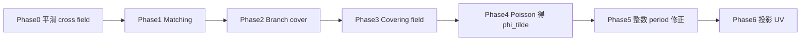
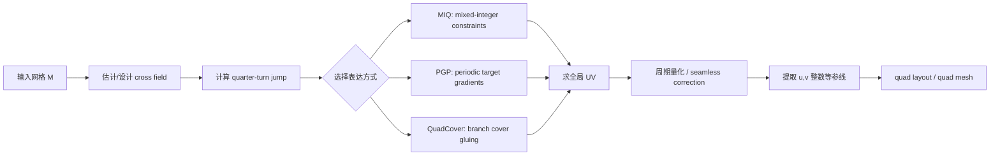

> 参考论文：Bommes et al. (2009) *Mixed-Integer Quadrangulation*；Ray et al. (2006) *Periodic Global Parameterization*

### **构建平滑的正交向量场(cross fields)**

一个正交方向场可以由**每个三角形上的角度 $\theta$** 和相邻三角形之间的**整数 jump** 共同表示：

 **Cross Field 的混合整数表示**：在每个三角形 $$t$$ 上定义一个参考角度 $$\theta_t \in [0, 2\pi/4)$$（等价类 $$[\theta_t] = \{\theta_t + k\frac{\pi}{2} \mid k \in \mathbb{Z}\}$$），相邻三角形之间通过整数变量 $$p_{ij} \in \mathbb{Z}$$ 编码 quarter-turn 跳变：
$$
 \theta_j \equiv \theta_i + \frac{\pi}{2} p_{ij} \pmod{2\pi}
$$


在三角网格 \(M=(V,E,F)\) 上，一个 cross field 可以用两个离散量描述：

$$
\theta:F\rightarrow \mathbb{R}, p:E\rightarrow \mathbb{Z}.
$$

其中 \(\theta\) 给每个三角面赋一个角度，表示该面上 cross field 的一个代表方向；\(p_{ij}\) 是 period jump，记录相邻面之间需要跳过几个 \(90^\circ\) 分支才能对齐。

普通的平滑能量可先写成相邻三角形角度差的平方和：

$$
E_{\text{smooth}}=\sum_{e_{ij}\in E}(\theta_i-\theta_j)^2.
$$

这个能量本质上是在惩罚相邻面片之间的方向不连续，但由于方向有 $$90^\circ$$ 等价关系，所以必须允许整数 jump 的存在。

但 cross field 跨边比较时，需要考虑坐标系转换和 \(\pi/2\) 对称性。若 \(\kappa_{ij}\) 表示从 frame \(j\) 到 frame \(i\) 的坐标变换角，则平滑能量应写为：
$$
E_{\text{smooth}}
=\sum_{e_{ij}\in E}
\left(\theta_i-\theta_j+\kappa_{ij}+\frac{\pi}{2}p_{ij}\right)^2.
$$


 **Cross Field 平滑能量**（MIQ Phase 1 的混合整数二次规划 MIQP）：
$$
\min_{\theta, \, p \in \mathbb{Z}} \sum_{(i,j) \in E} \left\| \theta_i - \theta_j + \kappa_{ij}+\frac{\pi}{2} p_{ij} \right\|^2
$$
 其中 $$\theta_i$$ 是面 $$i$$ 的参考角度（连续），$$p_{ij}$$ 是**整数**跳变变量。连续变量承担平滑，整数变量承担跳变("跨过一条边时其实应该加上一个 quarter-turn 才算真正对齐")。

## 向量场到全局参数化

有了标架场后要进一步构造参数化，方法就是将映射的 Jacobian 尽可能对齐前面得到的方向场。


设定 cross field 已给出每个面的目标方向向量 $$\mathbf{u}_t, \mathbf{v}_t$$（正交），要求全局参数化 $$(U,V)$$ 各面的梯度尽可能贴合：
$$
\min_{U,V} \sum_{t \in T} \left( \|\nabla U_t - \mathbf{u}_t\|^2 + \|\nabla V_t - \mathbf{v}_t\|^2 \right)
$$
 结合接缝处的整数平移约束 $$U' = U + j,\; V' = V + k$$（$$j,k \in \mathbb{Z}$$），同样构成混合整数二次规划。

### 一个核心困难

> cross field 是一个带 $\mathbb Z_4$ 对称性的多值对象；全局参数化则需要把这个多值对象变成可积、可拼接、可量化的 $(u,v)$ 坐标。


## MIQ：混合整数四边形化

Bommes 等人的 **MIQ** 是四边形网格化中最具代表性的 mixed-integer 框架。与 PGP 把整数跳变"藏"在目标梯度里不同，MIQ 把离散决策**显式写在边上**——每条内部边都是一个带旋转与平移的拼接接口。

### MIQ 整体流程

| 阶段 | 操作 | 核心变量 |
|:---|:---|:---|
| **Phase 1** | 优化平滑 cross field | 面角 $\theta_f$（连续），边跳变 $p_e \in \mathbb{Z}$ |
| **Phase 2** | 求对齐方向场的无缝参数化 | 顶点 $(u,v)$（连续），边旋转 $r_e$、平移 $\mathbf{t}_e$（整数） |
| **后处理** | 从参数域提取 quad layout | 等参线 $u \in \mathbb{Z},\, v \in \mathbb{Z}$ 取整 |

---

### 1. Phase 1：Cross Field 的 MIQP

上文给出的 cross field 平滑能量正是 MIQ 的第一阶段。在每个三角面 $f$ 上定义参考角 $\theta_f \in [0, \pi/2)$，在内部边 $e=(f_1,f_2)$ 上定义整数跳变 $p_e \in \mathbb{Z}$，最小化

$$
\boxed{
\min_{\boldsymbol{\theta},\, \boldsymbol{p}}
\sum_{e=(f_1,f_2)}
\Big(\theta_{f_1}-\theta_{f_2}+\kappa_e+\frac{\pi}{2}\,p_e\Big)^2,
\qquad p_e\in\mathbb{Z}
}
$$

其中 $\kappa_e$ 是相邻面局部坐标系之间的基准旋转角（由面法向与公共边方向决定）。$\theta_f$ 连续、$p_e$ 整数——标准 **MIQP**。

直接调用通用 MIQP 求解器可行，但边数可达 $10^4$ 量级，MIQ 利用目标的可分离二次结构做**块坐标下降**：

**固定 $\boldsymbol{p}$**：关于 $\boldsymbol{\theta}$ 为无约束凸二次型，令梯度为零得面邻接图上的 Laplace 系统

$$
\boldsymbol{L}\boldsymbol{\theta}=\boldsymbol{b}(\boldsymbol{p})
\qquad (1)
$$

$\boldsymbol{L}$ 为图 Laplacian（每面度数作对角元，邻接面之间 $-1$），$\boldsymbol{b}$ 由 $\{p_e\}$ 线性组装——每步一次稀疏 Cholesky/LDLT 即可。

**固定 $\boldsymbol{\theta}$**：每条边的 $p_e$ 仅出现在一项中，最优整数解为闭式取整

$$
\boxed{
p_e^*=\operatorname{round}\!\left(\frac{\theta_{f_2}-\theta_{f_1}-\kappa_e}{\pi/2}\right)
}
\qquad (2)
$$

交替执行 (1)(2) 通常 **5–12 轮**即收敛。之后可对 $p_e$ 做**坐标下降精化**：固定其余边，在候选集 $\{p_{\min},\ldots,p_{\max}\}$ 中枚举当前边，每换一个候选就重解 (1)，接受降能变动。

> **注**：Phase 1 的 $p_e$ 与 QuadCover 的 matching $r_{ij} \in \{0,1,2,3\}$ 编码同一信息——相邻面之间需要旋转几个 quarter-turn 才能对齐。

### 2. Phase 2：整数约束的全局参数化

已知 cross field 后，MIQ 在**顶点**上求标量函数 $(u, v)$，同时在对偶边上引入整数变量，强制参数化在全局上**无缝拼接**。

#### 2.1 边的整数过渡约束

对每条内部边 $e$（连接相邻两面 $T_i, T_j$），定义：

- **旋转匹配** $r_e \in \{0,1,2,3\}$：跨边时局部 $(u,v)$ 坐标系需旋转 $r_e \cdot \frac{\pi}{2}$；
- **整数平移** $\mathbf{t}_e = (t_e^u, t_e^v) \in \mathbb{Z}^2$：跨边时参数值差一个整格点。

边两侧的参数值满足

$$
\boxed{
\begin{bmatrix} u_j \\ v_j \end{bmatrix}
= R\!\left(r_e\frac{\pi}{2}\right)
\begin{bmatrix} u_i \\ v_i \end{bmatrix}
+ \mathbf{t}_e,
\quad
R(\alpha)=\begin{pmatrix}\cos\alpha & -\sin\alpha \\ \sin\alpha & \cos\alpha\end{pmatrix}
}
$$

这正是 MIQ 与 PGP 的核心差异：PGP 把整数偏移加到**目标梯度**上（$g_T + p_T$），不直接约束顶点值之差；MIQ 把每条边都写成**显式拼接方程**，chart 边界就是 $r_e$ 或 $\mathbf{t}_e$ 非平凡的边。

此外，每个面 $T$ 还有一个离散旋转指标 $\delta_T \in \{0,1,2,3\}$，处理 4-RoSy 方向场的 $\frac{\pi}{2}$ 歧义——同一面上的 $\mathbf{u}_T, \mathbf{v}_T$ 可以整体旋转 $k\cdot\frac{\pi}{2}$ 而不改变 cross field。

设 Phase 1 给出每面的目标正交方向 $\mathbf{d}_T^u, \mathbf{d}_T^v$，MIQ 最小化 Jacobian 对齐残差：

$$
E(u,v,\delta,\lambda)
= \sum_{T\in\mathcal{T}} A_T\Big[
\|\nabla u_T - \lambda_T\, R(\delta_T\pi/2)\,\mathbf{d}_T^u\|^2
+ \|\nabla v_T - \lambda_T\, R(\delta_T\pi/2)\,\mathbf{d}_T^v\|^2
\Big]
$$

其中 $A_T$ 为面积，$\lambda_T > 0$ 为每面缩放因子（控制四边形目标尺寸）。$\lambda_T$ 的最优值可解析消去，能量退化为关于 $u,v$ 和整数变量 $\delta_T, r_e, \mathbf{t}_e$ 的二次型。


#### 2.4 简化实现：Poisson 对齐

完整 Phase 2 的 MIQP 求解代价高。工程上常用**简化版**：固定 Phase 1 的 cross field 后，忽略 $\delta, r, \mathbf{t}$ 的整数优化，直接解 Poisson 型对齐问题

$$
L\,\mathbf{u} = \mathrm{div}(\mathbf{d}^u),
\qquad
L\,\mathbf{v} = \mathrm{div}(\mathbf{d}^v),
$$

其中 $L$ 为 cotangent Laplacian，$\mathbf{d}^u, \mathbf{d}^v$ 为 cross field 方向（面→顶点面积加权插值后取散度）。这给出视觉上合理的 UV，但**不保证**等参线在接缝处精确对齐为整数格点——完整四边形提取仍需对 Phase 2 做整数舍入，或接 libigl 的 `miq` 全流程。

---

### 3. Phase 2 的求解策略

与 Phase 1 类似，MIQ 对 Phase 2 也采用"**固定整数 → 解连续子问题 → 更新整数**"的交替框架：

| 步骤 | 操作 |
|:---|:---|
| ① 连续松弛 | 忽略 $\delta, r, \mathbf{t}$ 的整数约束，解连续 QP 得初值 |
| ② 舍入 $\delta_T$ | 逐面将 $\delta_T$ 舍入到 $\{0,1,2,3\}$，选使能量增量最小的面先舍入 |
| ③ 舍入 $r_e, \mathbf{t}_e$ | 对每条边，在候选整数中搜索使边约束残差 + 对齐能量最小的组合 |
| ④ 回代 | 固定整数变量，解稀疏线性系统得 $(u,v)$ |
| ⑤ 局部搜索 | 对 $\mathbf{t}_e$ 做 $\pm 1$ 扰动，接受降能变动 |
| ⑥ 迭代 | 重复 ④–⑤ 至收敛 |

Phase 1 的 $p_e$ 通常直接初始化 Phase 2 的 $r_e$（二者语义相同）。平移 $\mathbf{t}_e$ 的初值可由绕闭环的 period jump 累积估计。


## PGP

> **参考论文（PGP）**：Ray, N., Li, W. C., Lévy, B., Sheffer, A., & Alliez, P. (2006). *Periodic Global Parameterization*. ACM Transactions on Graphics (TOG), 25(4), 1460–1485.

PGP（Periodic Global Parameterization）是四边形网格化里经典的一条路线：先设计一个尽量平滑、尽量可积的 N-RoSy 方向场，再求一个与该方向场对齐、并且满足周期一致性的全局参数化 $(u,v)$。

它的关键点不在"把网格展开"，而在"把**周期跳变量和整数量化约束一起纳入优化**"，从而让后续等值线天然形成接近四边形结构。

---

## PGP：周期全局参数化

#### 1.1 参数化表示与梯度算子

在三角网格曲面 $\mathcal{M}$ 上，参数化是顶点上的两个标量函数 $u, v : V \to \mathbb{R}$，在每个三角形 $T$ 上用重心坐标做分段线性插值。

对三角形 $T = (v_1, v_2, v_3)$，$u$ 的梯度 $\nabla u_T$ 是常向量，可由顶点值线性表达（FEM 梯度算子）：

$$
\nabla u_T = G_T \cdot \begin{bmatrix} u_1 \\ u_2 \\ u_3 \end{bmatrix}
$$

其中 $G_T \in \mathbb{R}^{2\times 3}$ 由三角形几何决定（用边向量旋转 $90^\circ$ 后除以两倍面积）。$v$ 同理。$G_T$ 将顶点参数值线性映射为每面上的常值梯度。

#### 1.2 方向场对齐能量

**输入**：每面 $T$ 上一对正交单位向量（来自 N-RoSy 方向场），记作 $\mathbf{d}_T^u, \mathbf{d}_T^v$。

参数化梯度的目标是与方向场对齐（考虑 4-RoSy 的 $k \cdot \frac{\pi}{2}$ 旋转不确定性，$k = 0,1,2,3$），并允许每面有独立缩放因子 $\lambda_T > 0$：

$$
\nabla u_T \approx \lambda_T \cdot R(k_T \pi/2)\,\mathbf{d}_T^u,
\qquad
\nabla v_T \approx \lambda_T \cdot R(k_T \pi/2)\,\mathbf{d}_T^v
$$

PGP 的核心能量函数为最小二乘形式：

$$
\boxed{E(u,v,\lambda,k) = \sum_{T\in\mathcal{T}} A_T\Big[\,\|\nabla u_T - \lambda_T\,R(k_T\pi/2)\,\mathbf{d}_T^u\|^2 + \|\nabla v_T - \lambda_T\,R(k_T\pi/2)\,\mathbf{d}_T^v\|^2\Big]}
$$

其中 $A_T$ 为面 $T$ 的面积。该能量关于顶点值 $u_i,v_i$ 是二次型；$k_T \in \{0,1,2,3\}$ 为每面离散旋转指标；$\lambda_T$ 为每面连续缩放因子。

> **注**：关于 $\lambda_T$ 的最优值可解析求得，代入后能量退化为仅含 $u,v$ 和整数变量 $k_T$ 的形式。

#### 1.3 周期跳变变量（Period Jump Variables）

以上能量若直接求解，梯度方向会对齐，但全局拼接时存在整数不一致——跨面边界处参数值"差一个周期"。

PGP 的关键创新：在**每面**引入一个整数平移向量 $\mathbf{p}_T \in \mathbb{Z}^2$，将目标梯度修正为：

$$
\mathbf{g}_T' = \lambda_T\,R(k_T\pi/2)\begin{bmatrix} \mathbf{d}_T^u & \mathbf{d}_T^v \end{bmatrix} + \begin{bmatrix} p_T^u & p_T^v \end{bmatrix}
$$

其中 $p_T^u, p_T^v \in \mathbb{Z}$ 分别是 $u$ 和 $v$ 分量上的整数平移。

能量变为：

$$
\boxed{
E(u,v,k,p) = \sum_T A_T\Big[\,\|\nabla u_T - \big(\lambda_T R(k_T\pi/2)\mathbf{d}_T^u + p_T^u\big)\|^2 + \|\nabla v_T - \big(\lambda_T R(k_T\pi/2)\mathbf{d}_T^v + p_T^v\big)\|^2\Big]
}
$$

**直观解释**：$p_T^u$ 表示面 $T$ 上 $u$ 的"整周期偏移"。若两相邻面 $T_1,T_2$ 的 $p_T$ 取值不同，跨越它们之间的边就发生"周期跳跃"。这种跳跃将拓扑不一致显式编码为整数变量，而非隐藏在连续残差中。

**周期一致性（Cycle Consistency）**：由于 $u,v$ 是顶点上的单值函数，绕任意闭回路积分时，$\nabla u$ 的累积必须与各面上的 $p_T$ 解释一致。换言之，$p_T$ 并未破坏 $u$ 的整体单值性——能量驱动 $\nabla u_T$ 去逼近偏移后的目标 $g_T' + p_T^u$，但 $u$ 的顶点值在整个网格上仍是协调的。

#### 1.4 完整混合整数优化问题

$$
\boxed{
\begin{aligned}
\min_{u,v,k,\lambda,p} \quad & E(u,v,k,\lambda,p) = \sum_T A_T\Big[\,\|\nabla u_T - \lambda_T R(k_T\pi/2)\mathbf{d}_T^u - p_T^u\|^2 \\
& \qquad\qquad\qquad\quad\; + \|\nabla v_T - \lambda_T R(k_T\pi/2)\mathbf{d}_T^v - p_T^v\|^2\Big] \\[4pt]
\text{s.t.}\quad & k_T \in \{0,1,2,3\},\quad p_T^u, p_T^v \in \mathbb{Z},\quad \lambda_T > 0
\end{aligned}
}
$$

这是一个 **混合整数二次优化问题（MIQP）**：$u,v,\lambda$ 是连续变量，$k_T, p_T$ 是整数变量。

---

### 2. 求解策略

#### 2.1 消除连续变量 → 纯整数问题

PGP 求解的核心技巧：**对固定的整数变量 $k_T$ 和 $p_T$，最优的 $u,v$ 是线性方程组 $\nabla_{u,v} E = 0$ 的解**。

将 $\nabla u_T = G_T \mathbf{u}$ 代入能量（其中 $\mathbf{u}$ 为所有 $u_i$ 的向量），能量可写成关于 $\mathbf{u}$ 的二次型：

$$
E_u = \mathbf{u}^T M \mathbf{u} - 2\mathbf{b}(k,p)^T \mathbf{u} + c(k,p)
$$

其中 $M$ 为仅依赖网格几何的正定稀疏矩阵（组装自 $G_T^T G_T$），$\mathbf{b}$ 依赖于整数变量。最优解 $\mathbf{u}^* = M^{-1}\mathbf{b}(k,p)$ 代回能量，得：

$$
\boxed{E(k,p) = -\mathbf{b}(k,p)^T M^{-1} \mathbf{b}(k,p) + \text{const}}
$$

**问题约化为纯整数二次优化**：

$$
\min_{k_T\in\{0,1,2,3\},\, p_T\in\mathbb{Z}^2} \; E(k,p)
$$

#### 2.2 贪心整数决策

虽然纯整数二次规划是 NP-hard，PGP 采用贪心策略（在实践中效果良好）：

1. **连续松弛**：忽略 $k_T$ 和 $p_T$ 的整数约束，求解连续优化得初值 $\tilde{k}_T, \tilde{p}_T$
2. **逐面舍入**：对面逐一做舍入决策 $k_T \leftarrow \text{round}(\tilde{k}_T) \bmod 4$，$p_T \leftarrow \text{round}(\tilde{p}_T)$，每次选择使能量增加最小的面先舍入
3. **局部扰动**：尝试将 $p_T^u$ 或 $p_T^v$ 变动 $\pm 1$，若能量下降则接受（爬山搜索）

#### 2.3 回代得最终参数化

确定 $k_T$ 和 $p_T$ 后，求解稀疏线性系统 $M\mathbf{u} = \mathbf{b}(k,p)$ 即得最终全局参数化 $(u,v)$。

#### 2.4 整体流程

| 阶段 | 操作 |
|:---|:---|
| ① 连续松弛 | 忽略整数约束，解连续二次优化得初值 |
| ② 舍入 | 贪心舍入 $k_T$ 和 $p_T$ 至整数 |
| ③ 回代 | 固定整数变量，解稀疏正定线性系统得 $(u,v)$ |
| ④ 局部搜索 | 对 $p_T$ 做 $\pm1$ 扰动，接受降能变动 |
| ⑤ (可选)迭代 | 重复 ③-④ 至能量收敛 |

---


---

### 4. 奇异点、period jumps 与 chart layout 的关系

你在前面的联络文章里已经讲了 holonomy / trivial connection。在 PGP 语境下，可以把奇异点看成"period jumps 在闭环上的净和不为零"的位置。

- 若某个顶点邻域绕一圈后累计旋转是 $q\cdot\frac{\pi}{2}$，该点就是 cross-field 奇异点（index = $q/4$）；
- 这些奇异点不是后处理"检测出来的噪声"，而是拓扑一致性必需的离散缺陷；
- chart 边界通常沿 jump 不连续线或高误差线生成，因此 chart layout 实际上由"全局一致性 + 奇异结构"共同决定。

PGP 的典型流程：

1. 先解出全局参数和跳变量；
2. 再从跳结构与奇异点反推出 chart 分割；
3. 最后每个 chart 内做局部重参数化和边界对齐。

这正是"layout 从结果中长出来"的意思。

---

### 5. "Periodic" 周期性的含义

初读 PGP 时一个常见的困惑是：标题里的 **"Periodic"** 究竟体现在哪里？它并非指三角函数那样的波动，而是指参数域 $\mathbb{R}^2$ 上 $\mathbb{Z}^2$ 平移群的周期性——**$(u,v)$ 整平移对应参数空间的同一格点**。

#### 5.1 参数域的周期结构

PGP 的目标是构建一个从曲面到平面的连续映射 $(u,v) : \mathcal{M} \to \mathbb{R}^2$，但这个映射的"值域"具有周期性等价关系：

$$
(u, v) \equiv (u + m, v + n), \quad m, n \in \mathbb{Z}
$$

直观类比：纹理坐标在 $[0,1]^2$ 范围内的平铺（tiling）——跨出 $[0,1]^2$ 后自动"绕回"到另一侧，就像球面经纬度在 $360^\circ$ 处归零。

#### 5.2 周期跳变的几何意义

公式 $ \nabla u_T \approx g_T^u + p_T^u $ 中，$p_T^u \in \mathbb{Z}$ 意味着：

- **连续部分** $\nabla u_T$ 描述参数在面上的局部变化率（由顶点值 $u_i$ 生成）；
- **整数部分** $p_T^u$ 是面 $T$ 已经"绕了多少整圈"的记录。

穿越相邻面 $T_1 \to T_2$ 时，若 $p_{T_1} \neq p_{T_2}$，参数空间中发生了整周期跳跃——这正是"Periodic"的来源：参数化不是绝对单值的，而是**模 $\mathbb{Z}^2$ 单值的**。这允许参数化在非平凡拓扑的曲面上保持梯度对齐，同时不必撕裂出显式的 cut。

因为参数域是周期的（$u$ 和 $v$ 的整平移等价），等值线 $u = \text{const}$ 和 $v = \text{const}$ 天然形成全局一致的四边形栅格，且可以光滑地跨越周期跳跃边界。这就是为什么"周期性"是 PGP 能做四边形网格化的本质原因。


## QuadCover：分支覆盖上的全局参数化

> **参考论文**：Kälberer, F., Nieser, M., & Polthier, K. (2007). *QuadCover - Surface Parameterization using Branched Coverings*. Computer Graphics Forum.

QuadCover 的出发点是：与其在原曲面上直接处理带奇异点的多值 cross field，不如把曲面提升到一个 **4-sheet branch cover**。在覆盖空间上，原来的 $\mathbb Z_4$ 多值方向被展开为单值向量场，于是“求全局参数化”重新变成一个更标准的“求可积势函数”问题。

从统一视角看，QuadCover 与 MIQ / PGP 的区别主要在处理四重对称带来的离散跳变：

- **MIQ** 把 jump 放进 mixed-integer 优化器；
- **PGP** 把周期跳变放进目标梯度和参数域周期结构；
- **QuadCover** 把 matching 当作粘接规则，用它构造覆盖空间。

因此三者可以看成同一问题的三种表达：优化表达、周期表达、拓扑表达。

### 1. 分支覆盖（branch cover）介绍

黎曼面(Riemann Surface)是为了让多值复函数,如 $\sqrt z,log(z)$,在其上成为单值全纯函数而构造的“自然定义域”。它是一个**一维复流形(Complex Manifold)**

设 $M$ 是一个曲面,我们定义 $M$ 的一个**分支覆盖(branch cover)$M'$**是一个这样的黎曼面:

其与 $M$ 存在局部存在同胚映射 $\pi:M' \to M$，对任意一个 $M'$ 上的点 $p' \in M'$,存在一个 $p'$ 的领域 $U'$,在其上可以定义局部坐标 $z':U' \to \mathbb{C}$,并且以点 $p'$ 为坐标架的中心,即 $z'(p') = 0$。

同样也可以在像点的领域 $U(\pi(p') \in U)$,定义局部坐标 $z: U \to \mathbb{C},z(\pi(p'))=0$,存在一个整数 $n_p > 0$,在 $p$ 的局部有如下坐标变换关系成立 $z = (z')^{n_p}$，如果 $n_p > 1$,那么 $p$ 点即为 $M$ 的一个分支点。


在普通点附近，覆盖映射就像把几张完全一样的小纸片平铺在一起，每一层都局部等同于原曲面；  

而在分支点附近，多张 sheet 会像螺旋一样缠绕到同一个点上。局部模型 $z=(z')^{n_p}$ 正是在描述这种"绕一圈会跨 layer"的行为。

分支覆盖把原曲面上难以处理的奇异点，转写成覆盖空间里局部可控的分支结构。


### 2. QuadCover 算法

有了**标架场(cross field)**之后，我们要基于它来构造全局参数化，那么就需要解决它的**多值性**和**不可积性**。 

原曲面上的标架场往往带有奇异点，沿着这些奇异点绕一圈之后，方向会发生非平凡的旋转，导致参数函数无法直接作为一个普通单值函数定义在原曲面上。  

将原曲面上**带奇异点的标架场**提升到一个更大的无奇异点的**覆盖空间(covering space)**上,在这个覆盖空间上，原来绕一圈产生的多值展开到不同的叶片(sheet)上，于是**标架场可以被看成一个简单的向量场**，参数化问题也就重新变回了一个更熟悉的**求可积向量场/求标量势函数**的问题。

大致实施思路如下：先用**匹配(matching)** 构造覆盖空间，再把 **标架场提升为覆盖空间**，随后通过 **Hodge 分解**得到局部可积、全局无缝的参数化。


#### 2.1 匹配（matching）

设光滑的2维流形 $M$,有局部图集(charts)$\{U_i,\phi_i\}$
$$
\phi_i:U_i \subset M \to \Omega_i \subset \mathbb{R}^2
$$

在离散实现中，我们取每个三角面片 $T_i$ 作为一个 chart，通过重心坐标建立到 $\mathbb{R}^2$ 的仿射映射 $\phi_i: T_i \to \Omega_i \subset \mathbb{R}^2$。这是计算机图形学中离散微分几何的标准做法——将连续流形上的局部同胚替换为网格上的逐片线性映射。

$M$ 上的**参数化栅格**定义为单位栅格线 $\mathbb{Z} \times \mathbb{R}$ 以及 $\mathbb{R} \times \mathbb{Z}$ 在映射 $\phi_i$ 下的原像**（拉回，pullback）**。

这个变换不能是任意旋转，而只能来自正方格的对称群，也就是 $90^\circ$ 的整数倍旋转加上整数平移。matching 就是在离散网格上记录这种关系的量。

全局连续的参数化，即找到这样连续一致的图集 $\{U_i,\phi_i\}$,相邻两个区域 $U_i$ 与 $U_j$ 重合的地方，有如下的转移函数

$$
D\phi_i(p) = J^{r_{ij}} D\phi_j(p), \quad J := \begin{pmatrix} 0 & 1 \\ -1 & 0 \end{pmatrix}, \quad p \in U_i \cap U_j
$$

进一步定义 **匹配(matching)** 就是离散曲面 $M$ 上的一个如下的映射
$$
r: \{ \text{edges } e_{ij} \mid T_i \cap T_j = e_{ij} \} \to \{0,1,2,3\}
$$

这里 $r_{ij} \in \{0,1,2,3\}$ 定义为两个区域间的匹配(matching),对于离散三角网格,我们定义所有局部的图卡(chart)是三角面片,区域重合的地方就是三角面片的公共边，所以匹配是定义在边 $E$ 上的。

可以把 $r_{ij}$ 直观理解为:当我们从 $U_i$ 走到 $U_j$ 时，局部坐标系需要额外旋转多少个四分之一圈，才能让两边的网格方向重新对齐。$r_{ij}=0$ 表示方向一致；$r_{ij}=1$ 表示逆时针转 $90^\circ$；其余情况类似。

如图,两个chart之间的匹配 $r_{ij}$ = 3


对于如下的正方体展开,$r_{01}=r_{12} = 0,r_{20} = 1$


这样一来，每个三角形携带一个局部坐标系，而每条边告诉我们相邻两个三角形的坐标系之间差了多少个 quarter-turn。后面构造 covering space 时，正是把这些边上的 matching 当作"粘接规则"来使用。

具体计算步骤如下：

1. **估计局部方向**：在每个三角形上估计局部主方向（principal curvature directions）或其他满足 4-RoSy 对称性的 cross/frame field，每个三角形 $T_i$ 得到一组正交参考方向 $\vec{d}_i$。

2. **Quarter-turn 对齐**：对于共享边 $e_{ij}$ 的相邻三角形 $T_i, T_j$，由于 cross field 具有 4 重对称性，$\vec{d}_j$ 有 4 个等价表示 $\{\vec{d}_i,\; J\vec{d}_i,\; J^2\vec{d}_i,\; J^3\vec{d}_i\}$（$J$ 为 $90^\circ$ 旋转矩阵）。计算 $\vec{d}_i$ 与这 4 个方向的偏差，选择最小偏差对应的旋转次数：

$$r_{ij} = \arg\min_{k \in \{0,1,2,3\}} \angle(\vec{d}_i,\; J^k \vec{d}_j)$$

直观含义：$r_{ij}=0$ 表示方向一致；$r_{ij}=1$ 表示 $T_j$ 需逆时针转 $90^\circ$ 才与 $T_i$ 对齐，其余类推。

#### 2.2 由匹配诱导覆盖空间

对 $M$ 的每个局部子集(图卡chart)$U$，可以定义其平凡覆盖 $U'$,其由多个层(layer)构成。(在这里是4层的覆盖，4-layer sheets cover)

 

通过定义一致的转移函数 $\rho$，将流形M的相邻两个部分 $U_i,U_j$ 粘合在一起(glue together),而这里我们可以由三角网格的匹配(matching )来定义这个转移函数。这称为**由匹配诱导覆盖**


匹配告诉我们跨边时**应该跳到哪一层 sheet、旋转多少**；把所有边都按这个规则粘起来以后，就得到一个能"展开"标架场多值性的覆盖空间 ,可以把它理解成：先有离散的旋转不一致信息，再由这些不一致信息反推出一个全局一致的提升空间。


#### 顶点的**层偏移(layer shift)$ls(v)$**

对于一个顶点v，设其相邻三角形为T0,T1...Tn,Tn=T0对于边的matching有rij


显然ls=0就意味着一个普通的四边形点，而对于非零的情况layer shift 可以理解为"沿着顶点绕一圈以后，总共跨了多少层"。  如果绕一圈回来层号没有变化，那么局部上是平凡的，没有奇异性。否则就说明在该顶点周围发生了净旋转，这正对应了参数化中的奇异点。


#### 分支覆盖的核心作用：消除 Holonomy

分支覆盖的根本作用是**将"多值的场 + 带奇点的拓扑"转化为"单值的场 + 分支覆盖空间"**。具体而言有三大作用：

**1. 消去 Holonomy（和乐 / 平行移动绕行效应）**

离散 setting 中，matching $r_{ij}$ 本质上编码了一个 $\mathbb{Z}_4$-值 1-cocycle（赋值群为四分之一旋转）。顶点 $v$ 的 layer shift 应取**沿顶点一环的面环 holonomy**，而不是简单地把所有关联边的 $r$ 直接相加：

1. 将 $v$ 的邻接三角形按绕 $v$ 的角序排列为 $T_0,T_1,\ldots,T_n,T_{n+1}=T_0$；
2. 对相邻面 $T_i\to T_{i+1}$，取有向 matching $r_i\in\{0,1,2,3\}$（跨边方向与 $T_i\to T_{i+1}$ 一致时为 $+r$，反向时为 $-r$）；
3. 累加 holonomy 并归一化到 $(-\tfrac12,\tfrac12]$：

$$
h(v)=\Big(\sum_{i=0}^{n} r_i\Big)\bmod 4, ls(v)=\frac{h(v)}{4}.
$$

当 $h(v)=0$ 时 $ls(v)=0$，对应普通四边形点；$h(v)\neq 0$ 时对应奇异点/分支点。上式与"沿顶点绕一圈的净 quarter-turn"一致，等价于闭合环路 $\gamma$ 周围的 **holonomy** 除以 $\pi/2$。在覆盖空间上，holonomy 循环被"展开"到不同的 sheet 上，原本有 holonomy 的环路在覆盖空间中变成开路径——也就是说，holonomy 被消除了。

**2. 将多值场提升为单值场**

cross field 的 4-RoSy 对称性使得它在基空间上是"多值"的（绕一圈可能旋转 $k \cdot 90^\circ$）。覆盖空间中的提升将每个可能的"分支值"展开到独立的 sheet 上，使其成为一个普通的（单值）向量场。

在离散实现中，对每个三角形 $T_i$ 复制 4 份（sheet $s=0,1,2,3$），在共享边 $e_{ij}$ 上按 matching 粘接：sheet $s$ 上的角点与相邻面 sheet $(s+r_{ij})\bmod 4$ 上的对应角点合并。合并后的三角网格即为显式 **branch cover**；普通顶点保留 4 个独立 preimage，$ls(v)\neq 0$ 的顶点处 sheet 环不闭合，形成分支点。

**3. 将 Singularities 转化为分支点**

$ls(v) \neq 0$ 的顶点成为分支点，其 geometry 对应锥奇异点（锥角为 $ls(v) \cdot \pi/2$）。在分支覆盖空间中，这些奇点不再是场的奇点，而是空间的拓扑特征（分支点）。

**总结关系链**：

$$
\text{matching} \;\longrightarrow\; \text{covering} \;\longrightarrow\; \text{holonomy elimination} \;\longrightarrow\; \text{single-valued field}
$$

> 举个具体例子：对于立方体的展开（上文图示 $r_{01}=r_{12}=0, r_{20}=1$），基空间上沿闭合环路 $T_0 \to T_1 \to T_2 \to T_0$ 绕一圈，方向旋转了 $1 \times 90^\circ$。在 4-sheet 分支覆盖中，$T_0, T_1, T_2$ 被展开到不同的 sheet 上，环路由闭合变为开路径，方向旋转的"累计效果"被编码为 sheet 编号的跳变——于是向量场在覆盖空间中是单值的。

#### 2.3 覆盖空间中的标量函数空间

一旦在覆盖空间上找到了满足对称约束的标量函数 $f$，其梯度 $\nabla f$ 就会自动给出一个与 frame field 对齐、并且具有全局一致性的方向场。 只有当一个向量场是某个标量函数的梯度时，我们才能把它解释成参数坐标的微分，也就是
$$
\hat X = \nabla u \quad \text{或} \quad \hat X = \nabla v.
$$
如果场里还残留旋度，那么沿不同路径积分会得到不同结果，参数值就会依赖路径，最终不可能形成单值且全局一致的 UV 参数化。


从对称covering函数中可以引导出二维参数化


下面对这个空间进行研究，求得这个空间的基

 
满足约束的函数空间实际上是可计算的、有限维的，并且可以用一组基函数来表示。  一旦拿到了这组基，后面的优化就从"在无限维函数空间里找解"变成了"在有限个系数上做线性/二次优化"。


### 3. 算法流程

#### 3.1 算法输入

QuadCover 的输入有两项：

| 输入                 | 含义                                                         | 代码中的来源                                                 |
| -------------------- | ------------------------------------------------------------ | ------------------------------------------------------------ |
| **三角网格**         | 三角化曲面 $M$，每个面 $T_i$ 为一张 chart                    | 构造函数 `QuadCover(Mesh& mesh)`；`mesh` 由 OBJ 等读入       |
| **初始 cross field** | 每个三角形上一个 4-RoSy 参考方向 $\vec d_i$（切平面内单位向量） | `setCrossField(dirs)`，`dirs` 为 `nFaces × 3`；未设置时由主曲率方向自动估计 |

主曲率方向是最常用、也最自然的 cross field 来源：它与几何特征对齐，生成的四边形网格往往更贴合形状。算法本身**不强制**方向场必须来自主曲率——只要提供满足四重旋转对称的 frame field（例如 MIQ 优化结果、用户手绘方向、曲率场等），都可以作为目标场去构造参数化。


典型调用方式：

```cpp
Mesh mesh;
mesh.read("model.obj");

// 方式 A：外部 cross field（如 libigl 主曲率、MIQ 结果等）
Eigen::MatrixXd crossField = ...;  // nFaces x 3, 每行是面内单位方向
QuadCover qc(mesh);
qc.setCrossField(crossField);

// 方式 B：不显式传入 —— 内部用 Weingarten 算子估计主曲率方向
QuadCover qc(mesh);

qc.setSmoothIterations(3);
qc.parameterize();   // 输出写入 mesh.vertices[i].uv
```

#### **算法预处理（Phase 0）**：对输入 cross field 做平滑

脐点区域附近，两个主曲率趋于相等，主方向会失去稳定定义，数值上非常容易抖动。  如果直接把这些不稳定方向送进后续优化，会把大量高频噪声误认为真实几何信号。  因此 Phase 0 在**已有初始 cross field 之上**做 matching 感知平滑，目的是得到拓扑结构更合理、奇异点更可控的方向场。

**离散实现（Phase 0）** 分三步：

1. **读入方向场**：使用 `setCrossField()` 传入的 $\vec d_i$；若未设置，则对每个三角形用 Weingarten 算子 $W=I^{-1}\cdot II$ 的特征分解估计主曲率方向。将 $\vec d_i$ 转为局部角 $\theta_i\in[0,\pi/2)$。
2. **首次 matching**：按上文 quarter-turn 对齐公式计算每条内部边的 $r_{ij}$。
3. **matching 感知平滑**：迭代更新

$$
\theta_i \leftarrow \text{normalize}\Big(\tfrac12\,\theta_i + \tfrac12\big(\theta_j + \tfrac{\pi}{2}\,r_{ij}\big)\Big),
$$

其中 $T_i,T_j$ 共享边且 $r_{ij}$ 为从 $T_i$ 到 $T_j$ 的 matching。默认迭代 3 次。平滑后重建 $\vec d_i$，并**重新计算 matching**，再进入 layer shift 与 branch cover 构造。

#### 3.2 主要流程

完整离散流水线（对应 `QuadCover::runFullPipeline()`）如下：

| Phase | 名称                       | 主要操作                                                     |
| ----- | -------------------------- | ------------------------------------------------------------ |
| 0     | 预处理                     | 输入 cross field → $\theta_i$；matching；matching 感知平滑   |
| 1     | Matching                   | 4-RoSy quarter-turn 对齐，得 $r_{ij}\in\{0,1,2,3\}$          |
| 2     | Layer shift & Branch cover | 面环 holonomy 得 $ls(v)$；4-sheet DSU 粘接构造 branch cover  |
| 3     | Covering field             | 每个 $(T_i,s)$ 上旋转 $\vec d_i$ 得正交方向场 $(\vec X,\vec Y)$ |
| 4     | Hodge / Poisson            | 在 cover 上解 $L\tilde u=\mathrm{div}(\vec X),\;L\tilde v=\mathrm{div}(\vec Y)$，得 $\tilde\phi=(\tilde u,\tilde v)$ |
| 5     | 全局连续性                 | 构造 cut paths；舍入 $\mu_j$ 到 $2\mathbb Z$；加 harmonic 修正 $\psi$ |
| 6     | 投影输出                   | branch 顶点取 sheet 平均；归一化 UV 写回网格                 |



#### Phase 2–3：Branch cover 与方向场提升

对每个三角形 $T_i$ 取参考方向 $\vec d_i$，其正交补为 $\vec d_i^\perp=\vec n_i\times \vec d_i$。在 sheet $s$ 上令

$$
\vec X_{i,s}=\cos(s\pi/2)\,\vec d_i+\sin(s\pi/2)\,\vec d_i^\perp,
\vec Y_{i,s}=-\sin(s\pi/2)\,\vec d_i+\cos(s\pi/2)\,\vec d_i^\perp.
$$

这样在 cover 上得到单值正交标架场，供 Phase 4 积分。

#### 求最优化


通过对K进行**Hodge分解**可以解上面的最优化。

$$
K = P_K + C_K+ H_K
$$
Curl 导致不可积；为了让 $K$ 可积，需要去掉含旋度的部分，所以 $\hat X = P_K + H_K$ 是（9）式积分的最小化解。

这里的想法可以理解成"把原始场中妨碍积分的部分剔除掉"。  $C_K$ 是带来旋度的那一部分，它会让路径积分产生不一致；  $P_K + H_K$ 则保留了最接近原场、同时又满足可积性的部分，因此是一个很自然的最优修正结果。  

通过 Hodge 分解变为可积。

Hodge 分解在这里把"**尽量贴近输入方向场"**和**"必须能积分成参数函数"**这两个目标统一起来的工具。


**离散 Poisson 求解（Phase 4）**：在 branch cover 三角网格上构造 cotangent Laplacian $L$，对 $\vec X,\vec Y$ 用离散散度算子得右端项，分别求解

$$
L\,\tilde u = \mathrm{div}(\vec X), L\,\tilde v = \mathrm{div}(\vec Y).
$$

每个连通分量固定一个 anchor 顶点（$\tilde u=\tilde v=0$）以消除常数零空间。解 $(\tilde u,\tilde v)$ 即为 Hodge 分解中去掉旋度部分后的最优可积逼近 $\tilde\phi=(\tilde u,\tilde v)$。


#### 全局连续性的处理


关键是 $\mu_j(\phi)$ 落在整数格上。这一步把"局部上能积分"进一步提升为"全局上能无缝拼接"：仅仅 curl-free 还不够，还必须保证沿拓扑环路走一圈后，参数 period 落在允许的整数格结构中；只有这样，最终 UV 才对应真正的 seamless parameterization。

**Step 1：构造 cut graph 与同调路径**

- 欧拉示性数 $\chi=V-E+F$，边界分量数 $n_b$，亏格 $g=(2-\chi-n_b)/2$；
- 在面邻接图上做 spanning tree，每条 **cotree 边**对应一条同调生成环 $\gamma_j$；
- 有多个边界分量时，还需连接各边界分量的路径。路径数 $n_p=2g+n_b-1$（闭曲面 $n_b=0$ 时 $n_p=2g$）。

**Step 2：计算 period 系数 $\mu_j$**

将 $\tilde\phi$ 在 cover 上的值沿有向路径 $\gamma_j$ 积分（离散为边差分之和）：

$$
\mu_j^u(\tilde\phi)=\sum_{e\in\gamma_j}\big(\tilde u(v_b)-\tilde u(v_a)\big),
\mu_j^v(\tilde\phi)=\sum_{e\in\gamma_j}\big(\tilde v(v_b)-\tilde v(v_a)\big).
$$

全局连续要求 $\mu_j(\phi)\in\mathbb Z$；若要求**纯四边形网格**（分支点落在格点而非格心），则需 $\mu_j(\phi)\in 2\mathbb Z$。

**Step 3：harmonic 修正 $\psi$**

令目标 period 为舍入值

$$
\Delta\mu_j = \mathrm{round}_{2\mathbb Z}\big(\mu_j(\tilde\phi)\big)-\mu_j(\tilde\phi),
$$

在 cover 上构造 harmonic 基 $\{h_j\}$，满足 $\mu_k(h_j)=\delta_{kj}$（通过 KKT 系统：$\Delta h_j=0$ 且 period 约束）。令

$$
\psi=\sum_j \Delta\mu_j\, h_j, \phi=\tilde\phi+\psi.
$$

对 $u,v$ 分量分别做上述修正，则修正后 period 落入 $2\mathbb Z$，参数线全局无缝。

**Step 4：投影回原曲面（Phase 6）**

- 普通顶点（$ls=0$）：取 sheet $0$ 上的 cover UV；
- 分支顶点（$ls\neq 0$）：对所有 sheet preimage 的 UV 取平均；
- 最后将 $(u,v)$ 线性归一化到 $[0,1]^2$。


### 4. 代码实现

C++ 完整实现位于 `cpp/conformal-parameterization/uv_unwrap_field/QuadCover.cpp` 与 `QuadCover.h`，主要接口：

```cpp
Mesh mesh;
mesh.read("model.obj");

QuadCover qc(mesh);              // 输入 1：三角网格
qc.setCrossField(crossField);    // 输入 2：每面一个 4-RoSy 方向（nFaces×3）；可省略，则用主曲率
qc.setSmoothIterations(3);       // Phase 0：对 cross field 平滑
qc.setRequirePureQuads(true);    // μ_j 舍入到 2Z（纯四边形）
qc.parameterize();               // 完整 Phase 0–6，UV 写入 mesh.vertices[i].uv
```

| 论文章节               | 代码函数                                                     |
| ---------------------- | ------------------------------------------------------------ |
| 输入 cross field       | `setCrossField` / `setFaceDirections`；缺省则 `estimatePrincipalCurvature` |
| Phase 0 平滑           | `smoothCrossField`                                           |
| Phase 1 Matching       | `computeMatching`                                            |
| Phase 2 Layer shift    | `computeLayerShift`                                          |
| Phase 2 Branch cover   | `buildBranchCover`                                           |
| Phase 3 Covering field | `buildBranchCover` 内 per-sheet 旋转                         |
| Phase 4 Poisson        | `integrateOnCover` / `solveCoverPoisson`                     |
| Phase 5 全局连续性     | `buildCutGraphAndPaths`, `enforceGlobalContinuity`           |
| Phase 6 投影           | `projectCoverUVToMesh`                                       |

独立演示程序 `cpp/conformal-parameterization/uv_unwrap_field/quad_cover_complete.cpp` 为 libigl 简化版（无 branch cover 与 Phase 5）；生产路径应使用 `QuadCover` 类。

### 5. QuadCover 中使用分支覆盖的具体作用

在离散 setting 中，matching $r_{ij}$ 本质上编码了一个 $\mathbb{Z}_4$-值 1-cocycle（赋值群为四分之一旋转）。顶点 $v$ 的 layer shift：

$$
ls(v) = \frac{1}{4} \sum_{e \ni v} r_e
$$

**等价于**闭合环路 $\gamma$ 周围的 holonomy 除以 $\pi/2$。分支覆盖的关键作用有三点：

1. **消去 holonomy**：在覆盖空间上，holonomy 循环被"展开"到不同的 sheet 上，原本有 holonomy 的环路在覆盖空间中变成开路径
2. **将多值场提升为单值场**：cross field 的 4-RoSy 对称性使得它在基空间上是"多值"的，覆盖空间中的提升使其成为普通向量场
3. **将 singularities 转化为分支点**：$ls(v) \neq 0$ 的顶点成为分支点，其 geometry 对应锥奇异点

**总结关系链**：matching → covering → holonomy elimination，三步将"多值的场 + 带奇点的拓扑"转化为"单值的场 + 分支覆盖空间"。

参数线不能全局拆成独立的两组曲线——frame field 本质上是带 $\mathbb{Z}_4$ 对称性的对象，跨 chart 时发生 quarter-turn 跳变。QuadCover 的分支覆盖正是把多值 cross field 展开为覆盖空间上的单值场：

$$
\text{matching} \;\to\; \text{covering} \;\to\; \text{holonomy elimination} \;\to\; \text{single-valued field}.
$$

---

## 三种路线的统一对比

现在可以把 MIQ、PGP、QuadCover 放在同一张图里看。它们都从 cross field 出发，目标都是得到能提取整数等参线的全局参数化；不同之处在于：离散跳变是在优化器里、参数域里，还是覆盖空间里被处理。

### 1. 同一个离散结构的三种名字

| 统一对象 | MIQ | PGP | QuadCover |
|:---|:---|:---|:---|
| 相邻面方向差 | $p_e$ / $r_e$ | $k_T$ 与周期跳变 $p_T$ | matching $r_{ij}$ |
| 数学类型 | $\mathbb Z_4$ 边变量 + $\mathbb Z^2$ 平移 | 每面离散旋转 + 每面整周期偏移 | $\mathbb Z_4$-valued 1-cocycle |
| 拓扑含义 | 跨边拼接变换 | 参数域周期跳跃 | sheet 粘接规则 |
| 绕顶点累计 | cross-field singularity | period jump 不闭合 | layer shift / branch point |

这说明三种方法并不是三套彼此无关的算法，而是在不同层面编码同一件事：

$$
\text{quarter-turn jump}
\;\equiv\;
\text{matching}
\;\equiv\;
\text{local monodromy}
\;\equiv\;
\text{branch-cover gluing rule}.
$$

### 2. 求解空间不同

| 方法 | 在哪里求解 | 如何处理多值性 | 如何保证全局一致 |
|:---|:---|:---|:---|
| **MIQ** | 原曲面 $M$ | 跨边显式施加 $90^\circ$ 旋转 + 整数平移 | MIQP / 舍入后的边约束 |
| **PGP** | 原曲面 $M$ 的周期参数域 | 参数值按 $\mathbb Z^2$ 平移等价 | 周期跳变量 + 单值顶点函数 |
| **QuadCover** | 覆盖空间 $\hat M$ | 把 4-RoSy 分支展开到不同 sheet | cover 上积分 + period 修正 |

直观上：

- **MIQ** 是“在原曲面上硬约束拼接”；
- **PGP** 是“在参数域里允许周期绕回”；
- **QuadCover** 是“换一个空间，让多值对象变单值”。

### 3. 求解器视角

| 方法 | 主要计算 | 优点 | 代价 |
|:---|:---|:---|:---|
| **MIQ** | 交替 MIQP + Poisson / seamless solve | 约束明确，适合直接控制 quad layout | 整数变量多，完整 Phase 2 较重 |
| **PGP** | 消除连续变量后的整数舍入 | 变量少，周期结构简洁 | chart layout 更依赖后处理解释 |
| **QuadCover** | branch cover + Hodge/Poisson + harmonic period correction | 拓扑解释清晰，天然处理 holonomy | 需要构造 cover、cut paths、period 基 |

### 4. 从向量场到全局参数化的一条主线

把前文所有内容合起来，可以得到统一流程：



这条主线也解释了为什么前几篇文章会自然连在一起：

1. **向量场的拓扑**：说明 singularity / index / holonomy 是不可避免的；
2. **向量场的平行移动**：说明跨面比较方向必须考虑 connection；
3. **向量场的计算**：给出 N-RoSy / trivial connection / period jumps；
4. **本文**：把这些离散跳变进一步变成全局参数化中的整数周期结构。

---

## 实现备注

本仓库里三条路线对应的实现层次可以这样理解：

| 路线 | 代码位置 | 当前实现重点 |
|:---|:---|:---|
| **MIQ** | `cpp/conformal-parameterization/Parameterization/uv_unwrap_field/MIQQuad.cpp` | Cross-field MIQP surrogate + Poisson UV |
| **QuadCover** | `cpp/conformal-parameterization/Parameterization/QuadCover/QuadCover.cpp` | matching、branch cover、cover 上积分 |
| **PGP** | 可由现有 N-RoSy / jump / Poisson 管线原型化 | 周期跳变量与整数舍入 |

若已经有每面 N-RoSy 角度（`face_nrosy_field.csv`）和边跳变量（`edge_jumps.csv`），三条路线的入口其实是同一个：

1. 用 $\theta_f$ 和 $p_e$ 得到对齐后的目标方向；
2. 选择在原曲面上优化（MIQ / PGP），或先构造 covering space（QuadCover）；
3. 解 Poisson / Hodge 得到可积参数函数；
4. 对周期做整数修正；
5. 从 $u,v$ 的整数等值线提取四边形结构。

---

## 小结

从统一视角看，**从向量场到全局参数化**的核心不是某个单独公式，而是把一个带 $\mathbb Z_4$ 对称性的方向场变成满足整数周期条件的参数函数。

**MIQ** 把跳变显式写成 mixed-integer 约束；**PGP** 把跳变解释为参数域中的周期结构；**QuadCover** 则把跳变提升为覆盖空间的粘接规则。三者最终都在做同一件事：消除 cross field 的多值性，修正不可积部分，并让参数线能在全局上落到整数网格中。