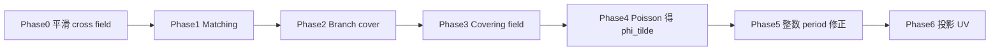

黎曼面（Riemann Surface）可以理解为多值函数的自然定义域。例如 $\sqrt z$、$\log z$ 在复平面上是多值的，但提升到合适的覆盖空间后，就可以看成单值函数。

设 $M$ 是一个曲面，$M'$ 是它的一个**分支覆盖（branch cover）**。覆盖映射记为

$$
\pi:M'\to M.
$$

在普通点附近，$\pi$ 是局部同胚；在分支点附近，可以取局部坐标 $z'$ 和 $z$，使得

$$
z=(z')^{n_p}.
$$

当 $n_p>1$ 时，$p=\pi(p')$ 就是分支点。这个公式表达的是：在覆盖空间中绕一圈，投影到原曲面后可能只走过了某个“分支角度”的一部分。


直观上，普通点附近的覆盖像几张完全一样的小纸片平铺在一起；分支点附近，多张 sheet 像螺旋一样缠绕到同一个点上。分支覆盖的作用，就是把原曲面上难以处理的多值性与奇异点，转写成覆盖空间中可控的 sheet 结构。


## 构造覆盖空间


原曲面上的标架场往往带有奇异点，沿着这些奇异点绕一圈之后，方向会发生非平凡的旋转，导致参数函数无法直接作为一个普通单值函数定义在原曲面上。  

QuadCover 的核心思路是：把原曲面上带奇异点的标架场提升到一个 **4-sheet covering space**。在覆盖空间中，原来绕奇异点一圈产生的多值方向会展开到不同的 sheet 上，于是 cross field 可以被看成普通的单值向量场。

算法主线很简单：先用 **matching** 构造覆盖空间，再把标架场提升到覆盖空间，最后通过 **Hodge/Poisson** 求解和 period 修正得到全局无缝参数化。


### 匹配（matching）

设光滑二维流形 $M$ 有局部图集 $\{U_i,\phi_i\}$：
$$
\phi_i:U_i \subset M \to \Omega_i \subset \mathbb{R}^2
$$

离散实现中，每个三角面 $T_i$ 都是一张 chart，通过重心坐标建立到 $\mathbb{R}^2$ 的仿射映射。也就是说，连续流形上的局部同胚在网格上被替换为逐片线性映射。

$M$ 上的**参数化栅格**定义为单位栅格线 $\mathbb{Z} \times \mathbb{R}$ 以及 $\mathbb{R} \times \mathbb{Z}$ 在映射 $\phi_i$ 下的原像**（拉回，pullback）**。

相邻 chart 之间不能任意旋转，否则整数格线无法拼成四边形网格。允许的变化来自正方格的对称群：$90^\circ$ 的整数倍旋转，加上整数平移。matching 就是在边上记录这个旋转部分。

相邻区域 $U_i$ 与 $U_j$ 重合处，Jacobian 的转移关系写成

$$
D\phi_i(p) = J^{r_{ij}} D\phi_j(p), \quad J := \begin{pmatrix} 0 & 1 \\ -1 & 0 \end{pmatrix}, \quad p \in U_i \cap U_j
$$

因此，离散曲面上的 matching 是一个边到 quarter-turn 编号的映射：
$$
r: \{ \text{edges } e_{ij} \mid T_i \cap T_j = e_{ij} \} \to \{0,1,2,3\}
$$

可以把 $r_{ij}$ 理解为：从 $T_i$ 走到 $T_j$ 时，局部坐标系需要额外旋转多少个四分之一圈才能对齐。$r_{ij}=0$ 表示方向一致，$r_{ij}=1$ 表示旋转 $90^\circ$，其余类推。

如图，两个 chart 之间的匹配为 $r_{ij}=3$。


对于如下的正方体展开，$r_{01}=r_{12}=0,\ r_{20}=1$。


matching 的计算只需要两步：

1. **估计局部方向**：每个三角形 $T_i$ 得到一个满足 4-RoSy 对称性的参考方向 $\vec d_i$。
2. **Quarter-turn 对齐**：对于共享边 $e_{ij}$ 的相邻三角形 $T_i,T_j$，枚举 $\vec d_j$ 的四个等价方向，选择与 $\vec d_i$ 最接近的旋转次数：

$$
r_{ij} = \arg\min_{k \in \{0,1,2,3\}} \angle(\vec{d}_i,\; J^k \vec{d}_j)
$$

这样一来，每个三角形携带一个局部坐标系，而**每条边告诉我们相邻两个三角形的坐标系之间差了多少个 quarter-turn**。

后面构造覆盖空间时，正是把这些边上的 matching 当作"粘接规则"来使用。

### 由匹配诱导覆盖空间

对每个三角面 $T_i$ 复制 4 份，记为 $(T_i,s)$，其中 $s=0,1,2,3$ 是 sheet 编号。

 

如果 $T_i$ 与 $T_j$ 共享边 $e_{ij}$，并且 matching 为 $r_{ij}$，则覆盖空间中的粘接规则为

$$
(T_i,s)\sim (T_j,(s+r_{ij})\bmod 4).
$$

这就是图中“由 matching 诱导 covering”的核心公式：跨边时不仅从一个三角形走到另一个三角形，还可能跳到另一个 sheet。


把所有边都按这个规则粘起来，就得到能展开 cross field 多值性的覆盖空间。


#### 顶点的层偏移（layer shift）

对顶点 $v$，将它的一环邻接三角形按顺序写成 $T_0,T_1,\ldots,T_n,T_{n+1}=T_0$。沿这一圈累加有向 matching：


$$
h(v)=\Big(\sum_{i=0}^{n} r_{i,i+1}\Big)\bmod 4,\qquad ls(v)=\frac{h(v)}{4}.
$$

$ls(v)=0$ 表示绕顶点一圈后回到原 sheet，是普通点；$ls(v)\neq 0$ 表示绕一圈后发生净 quarter-turn，顶点成为分支点，也对应参数化中的奇异点。


#### 分支覆盖的核心作用：消除 Holonomy

分支覆盖的根本作用是将“多值的场 + 带奇点的拓扑”转化为“单值的场 + 分支覆盖空间”。这里有三层含义：

1. **消去 holonomy**：matching $r_{ij}$ 编码了一个 $\mathbb Z_4$-值 1-cocycle。绕顶点一圈的累计 matching 就是局部 holonomy；在覆盖空间上，这个闭环会展开到不同 sheet 中。
2. **将多值场提升为单值场**：cross field 的 4-RoSy 对称性在基空间上表现为多值，在 cover 上则对应四个 sheet 中的普通向量场。
3. **将 singularities 转化为分支点**：$ls(v)\neq 0$ 的顶点不再只是场的奇异性，而成为覆盖空间的分支结构。

关系链可以写成：

$$
\text{matching} \;\longrightarrow\; \text{covering} \;\longrightarrow\; \text{holonomy elimination} \;\longrightarrow\; \text{single-valued field}
$$

例如立方体展开中若 $r_{01}=r_{12}=0, r_{20}=1$，则基空间上闭合环路 $T_0\to T_1\to T_2\to T_0$ 会累计一个 $90^\circ$ 旋转；在 4-sheet cover 中，它被展开成跨 sheet 的路径，累计旋转由 sheet 编号记录。

## 覆盖空间中的标量函数空间

覆盖空间构造完成后，参数化问题归结为：在 $\hat M$ 上找一个标量函数，使其梯度尽量贴近已提升的 covering field。只有当一个向量场是某个标量函数的梯度时，才能把它解释成参数坐标的微分：

$$
\hat X = \nabla u \quad \text{或} \quad \hat X = \nabla v.
$$

如果场里残留旋度，沿不同路径积分会得到不同结果，参数值依赖路径，最终无法形成单值且全局一致的 UV 参数化。

frame field 先提升为 cover 上的单值向量场 $\hat K$；右半部分说明参数化就是找 $\phi$，使 $\nabla\phi$ 逼近 $\hat K$。若 $\hat K$ 不可积，则通过 Hodge 分解去掉旋度部分：

$$
\hat K = P_{\hat K} + C_{\hat K} + H_{\hat K},
\qquad
\tilde{\hat X} = P_{\hat K} + H_{\hat K}.
$$

$\tilde{\hat X}$ 是最接近原场、同时又可积的部分，存在 $\phi$ 使 $\nabla\phi=\tilde{\hat X}$。

### 对称覆盖函数与二维参数化

参数化函数是定义在覆盖空间上的标量函数，允许在 cut graph 处不连续，但跨边跳变只能是整数平移。设 $G$ 是 $M$ 的 cut graph，定义函数空间

$$
\hat S_r(\hat M)=\{\text{在 }\hat M\text{ 上分段线性、除 }G\text{ 外连续的函数}\}.
$$

$f\in\hat S_r(\hat M)$ 称为**对称覆盖函数**，若对每个 chart $U$ 和点 $p\in U$，其在四个 sheet 上的取值满足

$$
f(\tau_U^0(p))=-f(\tau_U^2(p)),\qquad
f(\tau_U^1(p))=-f(\tau_U^3(p)).
$$

二维参数化由两个对称覆盖函数组成：

$$
\phi'=(u',v'),\qquad \nabla\phi'=(\nabla u',\nabla v').
$$

投影回基曲面 $M$ 时，只取 layer $0,1$ 上的值：

$$
\phi_i(p)=
\begin{bmatrix} u_i(p)\\ v_i(p) \end{bmatrix}
=
\begin{bmatrix} u'(\tau_U^0(p))\\ v'(\tau_U^1(p)) \end{bmatrix}.
$$

离散实现中，每个三角形 $T$ 的每个角点 $p$ 存储二维向量 $\phi|_T(p)=(u_{T,p},v_{T,p})$。相邻 chart $U_i,U_j$ 在公共边上的转移关系为

$$
\begin{bmatrix} u_i\\ v_i \end{bmatrix}
= J^{-r_{ij}}
\begin{bmatrix} u_j\\ v_j \end{bmatrix}
-\mathbf t_{ij},
\qquad
\mathbf t_{ij}\in\mathbb Z^2.
$$

若进一步要求全局参数线连续，则只允许在 cut graph 上出现非零平移 $\mathbf t_{ij}$。满足整数平移约束的函数构成子空间 $S_r(\hat M)\subset\hat S_r(\hat M)$。

### 函数空间的基

$\hat S_r(\hat M)$ 是有限维的。记 $S_h(\hat M)$ 为 cover 上连续的分段线性函数空间，其基为 $\{\Phi_i\}$；再取 $np$ 条 cut path $\{\gamma_j\subset G\}$，对每条路径定义不连续基函数 $\hat\Phi_j$：路径右侧顶点取值 $1$，左侧取值 $0$，其余为 $0$。则

$$
\{\Phi_i\}\cup\{\hat\Phi_j\}
$$

构成 $\hat S_r(\hat M)$ 的一组基。任意 $f\in\hat S_r(\hat M)$ 可写成

$$
f=\sum_i \lambda_i(f)\,\Phi_i+\sum_j \mu_j(f)\,\hat\Phi_j.
$$

对称性要求系数满足

$$
\lambda_{2i}=-\lambda_{2i+1},\qquad
\mu_{2j}=-\mu_{2j+1}.
$$

$\mu_j(f)$ 正是沿 cut path $\gamma_j$ 的 period 系数：$\nabla\hat\Phi_j$ 是 curl-free 的，且沿 $\gamma_j$ 的积分非零。因此全局连续条件可写成

$$
\mu_j(\phi)\in\mathbb Z;
$$

若要求纯四边形网格，则需 $\mu_j(\phi)\in 2\mathbb Z$。

### 在基上求解

在固定 matching 后，最优参数化 $\tilde\phi$ 最小化能量

$$
E(\phi)=\int_{\hat M}\|\nabla\phi-\hat K\|^2\,dA,
\qquad
\phi\in\hat S_r(\hat M).
$$

离散上这等价于在 cover 上解 Poisson 方程得到 $\tilde\phi$。但 $\tilde\phi$ 在 cut graph 处可能仍有 period 误差。令

$$
\Delta\mu_j=\mathrm{round}(\mu_j(\tilde\phi))-\mu_j(\tilde\phi),
$$

再构造 harmonic 函数 $\psi$，使 $\mu_j(\psi)=\Delta\mu_j$ 且 $\Delta\psi=0$，最终取

$$
\phi=\tilde\phi+\psi.
$$

这样就把“在函数空间中找解”变成“先 Poisson 积分，再用有限个 period 系数做 harmonic 修正”。


## 算法流程

### 算法输入

QuadCover 的输入有两项：

| 输入                 | 含义                                                         | 代码中的来源                                                 |
| -------------------- | ------------------------------------------------------------ | ------------------------------------------------------------ |
| **三角网格**         | 三角化曲面 $M$，每个面 $T_i$ 为一张 chart                    | 构造函数 `QuadCover(Mesh& mesh)`；`mesh` 由 OBJ 等读入       |
| **初始 cross field** | 每个三角形上一个 4-RoSy 参考方向 $\vec d_i$（切平面内单位向量） | `setCrossField(dirs)`，`dirs` 为 `nFaces × 3`；未设置时由主曲率方向自动估计 |

主曲率方向是最常用、也最自然的 cross field 来源：它与几何特征对齐，生成的四边形网格往往更贴合形状。算法本身**不强制**方向场必须来自主曲率——只要提供满足四重旋转对称的 frame field（例如 MIQ 优化结果、用户手绘方向、曲率场等），都可以作为目标场去构造参数化。


典型调用方式：

```cpp
Mesh mesh;
mesh.read("model.obj");

// 方式 A：外部 cross field（如 libigl 主曲率、MIQ 结果等）
Eigen::MatrixXd crossField = ...;  // nFaces x 3, 每行是面内单位方向
QuadCover qc(mesh);
qc.setCrossField(crossField);

// 方式 B：不显式传入 —— 内部用 Weingarten 算子估计主曲率方向
QuadCover qc(mesh);

qc.setSmoothIterations(3);
qc.parameterize();   // 输出写入 mesh.vertices[i].uv
```

#### 算法预处理（Phase 0）：对输入 cross field 做平滑

脐点区域附近，两个主曲率趋于相等，主方向会失去稳定定义，数值上非常容易抖动。  如果直接把这些不稳定方向送进后续优化，会把大量高频噪声误认为真实几何信号。  因此 Phase 0 在**已有初始 cross field 之上**做 matching 感知平滑，目的是得到拓扑结构更合理、奇异点更可控的方向场。

**离散实现（Phase 0）** 分三步：

1. **读入方向场**：使用 `setCrossField()` 传入的 $\vec d_i$；若未设置，则对每个三角形用 Weingarten 算子 $W=I^{-1}\cdot II$ 的特征分解估计主曲率方向。将 $\vec d_i$ 转为局部角 $\theta_i\in[0,\pi/2)$。
2. **首次 matching**：按上文 quarter-turn 对齐公式计算每条内部边的 $r_{ij}$。
3. **matching 感知平滑**：迭代更新

$$
\theta_i \leftarrow \text{normalize}\Big(\tfrac12\,\theta_i + \tfrac12\big(\theta_j + \tfrac{\pi}{2}\,r_{ij}\big)\Big),
$$

其中 $T_i,T_j$ 共享边且 $r_{ij}$ 为从 $T_i$ 到 $T_j$ 的 matching。默认迭代 3 次。平滑后重建 $\vec d_i$，并**重新计算 matching**，再进入 layer shift 与 branch cover 构造。

### 主要流程

完整离散流水线（对应 `QuadCover::runFullPipeline()`）如下：

| Phase | 名称                       | 主要操作                                                     |
| ----- | -------------------------- | ------------------------------------------------------------ |
| 0     | 预处理                     | 输入 cross field → $\theta_i$；matching；matching 感知平滑   |
| 1     | Matching                   | 4-RoSy quarter-turn 对齐，得 $r_{ij}\in\{0,1,2,3\}$          |
| 2     | Layer shift & Branch cover | 面环 holonomy 得 $ls(v)$；4-sheet DSU 粘接构造 branch cover  |
| 3     | Covering field             | 每个 $(T_i,s)$ 上旋转 $\vec d_i$ 得正交方向场 $(\vec X,\vec Y)$ |
| 4     | Hodge / Poisson            | 在 cover 上解 $L\tilde u=\mathrm{div}(\vec X),\;L\tilde v=\mathrm{div}(\vec Y)$，得 $\tilde\phi=(\tilde u,\tilde v)$ |
| 5     | 全局连续性                 | 构造 cut paths；舍入 $\mu_j$ 到 $2\mathbb Z$；加 harmonic 修正 $\psi$ |
| 6     | 投影输出                   | branch 顶点取 sheet 平均；归一化 UV 写回网格                 |



#### Phase 2–3：Branch cover 与方向场提升

对每个三角形 $T_i$ 取参考方向 $\vec d_i$，其正交补为 $\vec d_i^\perp=\vec n_i\times \vec d_i$。在 sheet $s$ 上令

$$
\vec X_{i,s}=\cos(s\pi/2)\,\vec d_i+\sin(s\pi/2)\,\vec d_i^\perp,
\vec Y_{i,s}=-\sin(s\pi/2)\,\vec d_i+\cos(s\pi/2)\,\vec d_i^\perp.
$$

这样在 cover 上得到单值正交标架场，供 Phase 4 积分。

#### 求最优化

在 cover 上已经有目标向量场 $K$，希望找到一个参数函数 $\phi$，使得 $\nabla\phi$ 尽量接近 $K$：

$$
\min_{\phi}\int_{\hat M}\|\nabla\phi-K\|^2\,dA.
$$

如果 $K$ 本身不可积，就不能直接写成某个函数的梯度。通过对 $K$ 做 Hodge 分解：

$$
K = P_K + C_K + H_K,
$$

其中 $C_K$ 是带来旋度、妨碍积分的部分。去掉 $C_K$ 后，$P_K+H_K$ 就是最接近原始场、同时又可积的部分。Hodge 分解在这里把“尽量贴近输入方向场”和“必须能积分成参数函数”统一到同一个最小二乘问题里。

**离散 Poisson 求解（Phase 4）**：在 branch cover 三角网格上构造 cotangent Laplacian $L$，对 $\vec X,\vec Y$ 用离散散度算子得右端项，分别求解

$$
L\,\tilde u = \mathrm{div}(\vec X), L\,\tilde v = \mathrm{div}(\vec Y).
$$

每个连通分量固定一个 anchor 顶点（$\tilde u=\tilde v=0$）以消除常数零空间。解 $(\tilde u,\tilde v)$ 即为 Hodge 分解中去掉旋度部分后的最优可积逼近 $\tilde\phi=(\tilde u,\tilde v)$。


#### 全局连续性的处理

关键是 $\mu_j(\phi)$ 落在整数格上。这一步把"局部上能积分"进一步提升为"全局上能无缝拼接"：仅仅 curl-free 还不够，还必须保证沿拓扑环路走一圈后，参数 period 落在允许的整数格结构中；只有这样，最终 UV 才对应真正的 seamless parameterization。

**Step 1：构造 cut graph 与同调路径**

- 欧拉示性数 $\chi=V-E+F$，边界分量数 $n_b$，亏格 $g=(2-\chi-n_b)/2$；
- 在面邻接图上做 spanning tree，每条 **cotree 边**对应一条同调生成环 $\gamma_j$；
- 有多个边界分量时，还需连接各边界分量的路径。路径数 $n_p=2g+n_b-1$（闭曲面 $n_b=0$ 时 $n_p=2g$）。

**Step 2：计算 period 系数 $\mu_j$**

将 $\tilde\phi$ 在 cover 上的值沿有向路径 $\gamma_j$ 积分（离散为边差分之和）：

$$
\mu_j^u(\tilde\phi)=\sum_{e\in\gamma_j}\big(\tilde u(v_b)-\tilde u(v_a)\big),
\mu_j^v(\tilde\phi)=\sum_{e\in\gamma_j}\big(\tilde v(v_b)-\tilde v(v_a)\big).
$$

全局连续要求 $\mu_j(\phi)\in\mathbb Z$；若要求**纯四边形网格**（分支点落在格点而非格心），则需 $\mu_j(\phi)\in 2\mathbb Z$。

**Step 3：harmonic 修正 $\psi$**

令目标 period 为舍入值

$$
\Delta\mu_j = \mathrm{round}_{2\mathbb Z}\big(\mu_j(\tilde\phi)\big)-\mu_j(\tilde\phi),
$$

在 cover 上构造 harmonic 基 $\{h_j\}$，满足 $\mu_k(h_j)=\delta_{kj}$（通过 KKT 系统：$\Delta h_j=0$ 且 period 约束）。令

$$
\psi=\sum_j \Delta\mu_j\, h_j, \phi=\tilde\phi+\psi.
$$

对 $u,v$ 分量分别做上述修正，则修正后 period 落入 $2\mathbb Z$，参数线全局无缝。

**Step 4：投影回原曲面（Phase 6）**

- 普通顶点（$ls=0$）：取 sheet $0$ 上的 cover UV；
- 分支顶点（$ls\neq 0$）：对所有 sheet preimage 的 UV 取平均；
- 最后将 $(u,v)$ 线性归一化到 $[0,1]^2$。


