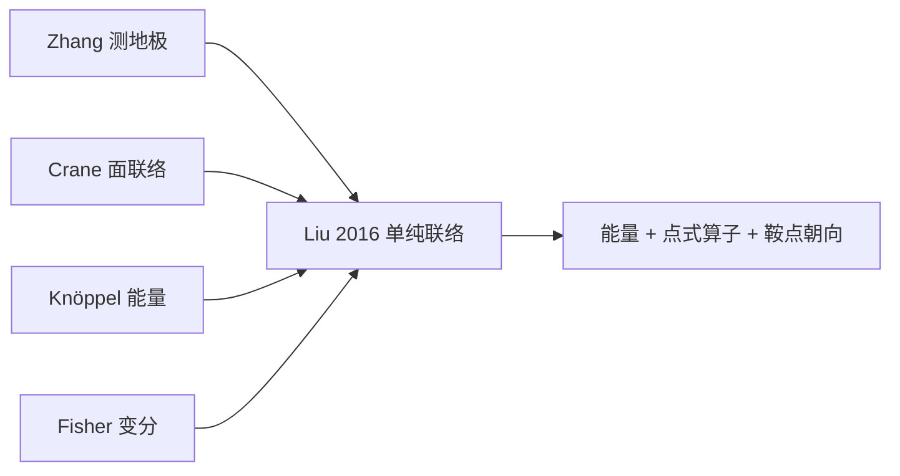

主文：[Liu et al., TOG 2016](https://dl.acm.org/doi/10.1145/2898350)；讲义补充：同目录 SIGGRAPH 2016 Course Notes Part III。建议先读 [向量场的联络](/2017/09/01/向量场的联络/)。

写法约定：每节先给直觉，再给完整公式与推导。

## 0. 一句话

在三角网格**顶点**上存切向量，用一套离散单纯联络把它连续地铺到整张曲面，并由此得到：

- 点式 / 局部积分的一阶算子（div、curl、$\bar\partial$）
- 全局 $L^2$ 能量（Dirichlet / Bochner）

之前的方法往往两者不可兼得；本文用**同一套联络参数**统一二者。

---

## 1. 为什么需要联络？（连续预备）

### 1.1 直觉

平面上比较向量：平移对齐再相减。曲面上每个点有自己的切平面，没有全局“朝北”，所以必须先规定：

> 从 $p$ 走到邻近 $q$ 时，向量该怎么转？

这套规定叫**联络**；有了它才能定义平行移动，进而定义协变导数 $\nabla$。

### 1.2 度量联络与联络 1-形式

在正交标架 $(e,e^\perp)$ 下，度量仿射联络由单个实值 1-形式 $\omega$ 刻画：

$$
\Omega=\omega J,\qquad
J=\begin{pmatrix}0&-1\\1&0\end{pmatrix}.
$$

$\omega(w)$ = 沿方向 $w$ 把局部标架对齐到邻近标架的无穷小角速度。向量场 $u=u^1 e+u^2 e^\perp$ 的协变导数：

$$
\nabla_w u
=(e\ e^\perp)\left(
\begin{pmatrix}du^1(w)\\ du^2(w)\end{pmatrix}
+\Omega(w)\begin{pmatrix}u^1\\ u^2\end{pmatrix}
\right).
$$

**推导要点**：对 $u=\sum_i u^i e_i$ 用 Leibniz 法则

$$
\nabla_w u=\sum_i\bigl(du^i(w)\,e_i+u^i\nabla_w e_i\bigr),
$$

再令 $\nabla_{e_j}e_i=\sum_k\omega^k_{ji}e_k$，把系数收成矩阵值 1-形式 $\Omega$。度量相容 + 正交标架 ⇒ $\Omega$ 必反对称，故只剩一个自由度 $\omega$。

等价的复数写法（课程讲义）：$u=(u^1+iu^2)e$，则

$$
\nabla_w u=du(w)\,e+u\,i\,\omega(w)\,e
=(e\otimes du+u\,ie\otimes\omega)(w).
$$

### 1.3 平行移动

沿曲线 $c$，要求 $\nabla_{c'}u=0$，解得

$$
\begin{pmatrix}u^1(s)\\ u^2(s)\end{pmatrix}
=\exp\!\Bigl(-J\int_0^s\omega(c'(\alpha))\,d\alpha\Bigr)
\begin{pmatrix}u^1(0)\\ u^2(0)\end{pmatrix}.
$$

因为 $\exp(\theta J)=\cos\theta\,I+\sin\theta\,J$ 正是旋转矩阵。复数版：乘 $e^{-i\int\omega}$。

### 1.4 曲率与 holonomy

联络曲率 $K=-d\omega$。对 Levi-Civita 联络，$K$ 即高斯曲率 2-形式。绕闭路 $\partial R$ 平行移动一周的 holonomy $=-\int_{\partial R}\omega=\iint_R K$（Stokes）。

### 1.5 $\nabla u$ 的几何分解与能量

用反射 $F=\operatorname{diag}(1,-1)$，把 $2\times2$ 矩阵 $\nabla u$ 拆成：

$$
\nabla u=\frac12\bigl[
I\,\nabla\!\cdot u+J\,\nabla\!\times u+F\,\nabla\!\cdot(Fu)+JF\,\nabla\!\times(Fu)
\bigr]
=\partial u+F\,\bar\partial u,
$$

其中

$$
\partial=\tfrac12\bigl(I\nabla\!\cdot+J\nabla\!\times\bigr),\qquad
\bar\partial=\tfrac12\bigl(I\nabla\!\cdot(F\cdot)+J\nabla\!\times(F\cdot)\bigr).
$$

- $\partial$：含 div、curl，与标架无关  
- $\bar\partial$：Cauchy–Riemann / 反全纯部分；$\bar\partial u$ 行为像 2-RoSy 场  

Dirichlet 能量：

$$
E_D(u)=\tfrac12\int_M|\nabla u|^2\,dA=\tfrac12\bigl(E_A(u)+E_H(u)\bigr),
$$

$$
E_A=\tfrac12\int\bigl((\nabla\!\cdot u)^2+(\nabla\!\times u)^2\bigr),\qquad
E_H=\int|\bar\partial u|^2.
$$

二者之差（Knöppel et al. 2013）：

$$
E_A-E_H=\int_{\partial M}u\times(\nabla u)+\int_M K|u|^2.
$$

闭曲面、单位向量场时 $E_A-E_H=\int K=2\pi\chi(M)$——数值检验金标准。

---

## 2. 网格上的矛盾与三种表示

### 2.1 尴尬事实

PL 网格：面内平坦（真 LC 的 $\omega\equiv0$），高斯曲率全堆在顶点（角亏 $\kappa_i=2\pi-\sum\theta$）。坚持真 LC ⇒ 顶点处 $\nabla$ 发散，做不出连续有限的顶点插值场；人为摊曲率 ⇒ 偏离嵌入 LC。本文：造有限维离散联络，**量化并最小化**对 LC 的偏差。

### 2.2 三种存法

| 表示 | 存哪儿 | 擅长 | 不擅长 |
|---|---|---|---|
| Face | 每面常向量 | 简单；Hodge；Crane 联络 | 不连续 |
| Edge | 每边一个数 | DEC 干净 | 法向可不连续 |
| **Vertex** | 每顶点切向量 | **连续**；点式 $\nabla$；$n$-RoSy | 要联络；无现成 Hodge |

记号：$T=(V,E,F)$，边 $e_{ij}$ 定向固定，面逆时针；$\kappa_i=2\pi-\sum_{t\ni v_i}\theta_{kij}$。Whitney 基见 §4。

---

## 3. 前身：测地极坐标插值（Zhang 2006）

### 3.1 直觉

把顶点一环像北极地图展平，沿从顶点出发的直线平行移动向量，再用 hat 衰减——自然，但各顶点地图接缝对不齐。

### 3.2 公式

缩放因子（展平后角和为 $2\pi$）：

$$
s_i=r_i=\frac{2\pi}{\sum_{t_{ijk}}\alpha_{kij}}=\frac{2\pi}{2\pi-\kappa_i}.
$$

测地极映射 $P:p\mapsto(s,t)$，$s$ 轴可对齐某入射边。对 $p\in t_{ijk}$，设 $P(p_ip)$ 与 $s$ 轴夹角 $\alpha$，$u_i$ 与 $s$ 轴夹角 $\theta$、模长 $|u_i|$，则平行移动

$$
T_{p_i\to p}(u_i)=\text{把 }\frac{|u_i|}{|p_ip|}\,p_ip\text{ 绕面法向旋转 }\theta-\alpha.
$$

插值（$\varphi_i$ 为 hat）：

$$
u(p)=u^s\,T_{p_i\to p}(e_s)\,\varphi_i(p)+u^t\,T_{p_i\to p}(e_t)\,\varphi_i(p),
$$

$$
\Psi_i(p)=\bigl(T_{p_i\to p}(e_s)\varphi_i,\ T_{p_i\to p}(e_t)\varphi_i\bigr),\qquad
u(p)=\sum_i\Psi_i(p)\,u_i.
$$

单位分解 ⇒ 精确插值各顶点向量。

### 3.3 缺陷

- 逐顶点图册 ⇒ **场不连续** ⇒ $\nabla$ 可发散  
- Zhang：削掉顶点小三角当梯形——与连续极限仍不一致  
- Knöppel 2013：能摊曲率算 $L^2$ 能量，但**无**场的闭式 ⇒ 无点式 div/curl  
- Liu 2016：仍用 $\varphi_i$ 混合，靠**单纯联络**把图册缝成合法 atlas  

---

## 4. Whitney 1-形式（完整）

### 4.1 直觉

离散 1-形式 = 每条边一个数。Whitney = 把这些数插成面内连续 1-形式，且边积分不变。

### 4.2 定义

Whitney 0-形式即 hat：$\varphi_i(v_j)=\delta_{ij}$，$\sum\varphi=1$。

Whitney 1-形式基：

$$
\varphi_{ij}:=\varphi_i\,d\varphi_j-\varphi_j\,d\varphi_i.
$$

在边 $e_{ij}$ 上 $\varphi_i+\varphi_j=1$，故 $\varphi_{ij}=d\varphi_j$。对偶性：

$$
\int_{e_{kl}}\varphi_{ij}=\delta_{(ij),(kl)}.
$$

因而边系数 $=$ 边积分。反对称 $\varphi_{ji}=-\varphi_{ij}$。与外微分交换：若 $u=\sum u_i\varphi_i$，则

$$
du=\sum_{ij}(u_j-u_i)\varphi_{ij}.
$$

Whitney 2-形式：$\varphi_{ijk}=2\,d\varphi_i\wedge d\varphi_j$，$\int_t\varphi_{ijk}=1$。

---

## 5. 离散单纯联络（完整构造）

### 5.1 直觉

拿箭头在网格上走：

1. **单纯形内部**：连续转 → Whitney 1-形式 $\omega$  
2. **跨单纯形**：坐标系不一致 → 有限转移角 $\rho$  

总转角 $=$ $\int\omega$ $+$ 跨界 $\rho$。

### 5.2 各单纯形标架（实现）

- **顶点** $v$：一环面积加权法向定切平面；入射边投影得 $e_v$，再取 $e_v^\perp$  
- **边** $e$：$e_e$ 沿边；两邻面平均法向 $\times e_e$ 得 $e_e^\perp$  
- **面** $t$：任取 $e_t$ 与面内 $e_t^\perp$  

复数：$u=(u^1+iu^2)e$，旋转 $\theta$ 乘 $e^{i\theta}$（等价于矩阵 $\exp(\theta J)$）。

### 5.3 光滑单纯联络与路径公式

单纯图册（Grimm & Hughes）：每单纯形 $\sigma$ 一张图 + 标架 $e_\sigma$。转移角 $\rho_{\sigma_1\to\sigma_2}(p)$ = 在 $p\in\sigma_1\cap\sigma_2$ 把 $e_{\sigma_1}$ 转到 $e_{\sigma_2}$ 的角。

路径穿单纯形 $\sigma_1,\ldots,\sigma_k$，段 $P_i\subset\sigma_i$，则平行移动总转角

$$
\theta=-\Biggl(
\sum_{i=1}^k\int_{P_i}\omega_{\sigma_i}
+\sum_{i=1}^{k-1}\rho_{\sigma_i\to\sigma_{i+1}}
\Biggr).
$$

**Definition**：光滑单纯联络 $=$ $\{\omega_\sigma\}$ $+$ $\{\rho_{\sigma_1\to\sigma_2}\}$。

### 5.4 一致性条件（Prop. 1）及理由

$$
\begin{aligned}
&(1)\quad \rho_{\sigma_1\to\sigma_2}(p)=-\rho_{\sigma_2\to\sigma_1}(p),\\
&(2)\quad \rho_{v_i\to e_{ij}}+\rho_{e_{ij}\to t}(p_i)=\rho_{v_i\to t},\\
&(3)\quad \rho_{v_i\to e_{ji}}=\pi+\rho_{v_i\to e_{ij}}+2\pi n_{ij},\\
&(4)\quad
\rho_{v_i\to e}+\int_e\omega_e+\rho_{e\to v_j}
=\rho_{v_i\to t}+\int_e\omega_t+\rho_{t\to v_j}.
\end{aligned}
$$

**理由简述**：

1. 来回走不应净转  
2. 顶点→面有两条路（经边或直接），在覆盖一环的图上必须一致；否则顶点处零面积区域有曲率 ⇒ $\nabla$ 发散  
3. $e_{ij}$ 与 $e_{ji}$ 反向，差 $\pi$（mod $2\pi$）；整数 $n_{ij}$ 仅依赖标架选取  
4. 沿同一条边、经边联络或经面联络，平行移动结果必须相同（否则边周围零面积有曲率）

由 (2) 与角关系还可推

$$
\rho_{v_i\to e_{ik}}=\rho_{v_i\to e_{ij}}+\angle(e_{ij},e_{ik})-2\pi m_{ik},
$$

$m_{ik},n_{ik}$ 由环绕顺序与面标架选取决定（详见原文 Prop.1 证明）。

### 5.5 有限维离散化

**面内 / 边上 Whitney**：

$$
\omega_{e_{ij}}=\varepsilon_{ij}\,\varphi_{ij}=\varepsilon_{ij}\,d\varphi_j,
$$

$$
\omega_{t_{ijk}}=\tau_{ij,k}\varphi_{ij}+\tau_{jk,i}\varphi_{jk}+\tau_{ki,j}\varphi_{ki}.
$$

$\varepsilon_{ij}$：沿整边总转角；$\tau_{ij,k}$：在 $t_{ijk}$ 内沿半边 $e_{ij}$ 的累积转角。反对称：$\varepsilon_{ij}=-\varepsilon_{ji}$，$\tau_{ji,k}=-\tau_{ij,k}$。

转移限制为关于 $\varphi_i$ 的线性函数，并强制 Prop.1。特别地由 (4) 得离散版：

$$
\rho_{v_i\to e}+\varepsilon_{ij}+\rho_{e\to v_j}
=\rho_{v_i\to t}+\tau_{ij,k}+\rho_{t\to v_j}. \tag{7}
$$

### 5.6 约化参数（Prop. 2）及推导

**Claim**：给定标架后，联络完全由

$$
\rho=\bigl(\{\rho_{ij}\},\ \{\rho_{v_i\to e_{ij}}\},\ \{\rho_{v_i\to t_{ijk}}\}\bigr)
$$

决定（$|E|+2|E|+3|F|$ 个量，再减规范）。

**推导**：

- $\rho_{\sigma_2\to\sigma_1}=-\rho_{\sigma_1\to\sigma_2}$（只存“低维→高维”）  
- 由 (7) 反解 Whitney 系数：

$$
\varepsilon_{ij}=-\rho_{v_i\to e}+\rho_{ij}+\rho_{v_j\to e},
$$

$$
\tau_{ij,k}=-\rho_{v_i\to t}+\rho_{ij}+\rho_{v_j\to t}. \tag{25}
$$

其中 $\rho_{ij}$ 定义为沿边从 $v_i$ 到 $v_j$ 的平行移动角。  
- 边上线性变化的边→面转移：

$$
\rho_{e\to t}(p)
=\varphi_i(p)(\rho_{v_i\to t}-\rho_{v_i\to e})
+\varphi_j(p)(\rho_{v_j\to t}-\rho_{v_j\to e}).
$$

- 由 (3)：$\rho_{ij}+\rho_{ji}+2\pi(n_{ij}+n_{ji}+1)=0$，故每边只需一个 $\rho_{ij}$。

### 5.7 面曲率

绕三角形内部闭路，holonomy 仅由三个顶点→顶点角决定：

$$
-K_{ijk}=\rho_{ij}+\rho_{jk}+\rho_{ki}.
$$

**含义**：顶点 Dirac 曲率被摊成面内有限曲率——连续场的代价，也是相对真 LC 的偏差来源。

---

## 6. 插值基函数

### 6.1 构造

顶点 $v_i$ 的标架先经 $-\rho_{v_i\to t}$ 转到面标架，再沿面内直路径按 $\omega_t$ 平行移动到 $p$：

$$
\Phi_i\big|_t(p)
=(e_t,e_t^\perp)
\exp\!\Bigl[-J\Bigl(\rho_{v_i\to t}+\int_{v_i\to p}\omega_t\Bigr)\Bigr].
$$

复数版：$\Phi_i|_t(p)=e_t\exp\bigl[-i(\rho_{v_i\to t}+\int\omega_t)\bigr]$。

用 $\varphi_i$ 混合：

$$
\Psi_i\big|_{t_{ijk}}(p)
=\varphi_i(p)\,(e_t,e_t^\perp)
\exp\!\bigl[-J(\rho_{v_i\to t}+\tau_{ij,k}\varphi_j+\tau_{ik,j}\varphi_k)\bigr].
$$

（因 $\omega_t$ 线性，路径积分化为 $\tau$ 与重心坐标的线性式。）整场

$$
u(p)=\sum_i\Psi_i(p)\begin{pmatrix}u_i^1\\ u_i^2\end{pmatrix}
=\sum_i\Psi_i(p)(u_i^1+iu_i^2).
$$

### 6.2 连续性

- **几何向量** $u(p)$ 处处连续；在 $v_i$ 插值 $u_i$；一环外 $\Psi_i=0$  
- **分量** $(u^1,u^2)$ 相对各单纯形标架时跨边可不连续——标架在跳；$\rho$ 提供换到公共标架后的坐标变换  

---

## 7. 如何选取 $\rho$（三种方案 + 完整能量）

真 LC：面内 $\omega\equiv0$，边→面转移为常数

$$
\bar\rho_{e\to t}(p)=\angle(e_e,e_t)\quad(\text{嵌入度量}).
$$

离散联络无法完全等同（否则曲率缩回顶点），只能逼近。

### 7.1 方案 A：测地极（Knöppel 同源）

$$
\rho_{v_i\to e_{ik}}=\rho_{v_i\to e_{ij}}+s_i\theta_{kij},\qquad
\rho_{ij}=\rho_{v_i\to e}-\rho_{v_j\to e}
$$

（⇒ $\varepsilon_{ij}=0$）。面曲率

$$
K_{ijk}=(s_i-1)\theta_{kij}+(s_j-1)\theta_{ijk}+(s_k-1)\theta_{jki}.
$$

仅 $\rho_{ij}$ 即可算 $E_D$；点式算子还需 $\rho_{v\to t}$。一种无偏取法：面内点 $c$（内心/重心），

$$
\rho_{v_i\to c}=\tfrac12(\rho_{v_i\to e_{ij}}+\rho_{v_i\to e_{ik}}+2\pi n_{ik}),
$$

$$
\rho_{v_i\to t}=\rho_{v_i\to c}+\angle(c-p_i,\,e_t).
$$

### 7.2 方案 B：局部最优 $\rho_{v\to t}$

固定 $\rho_{ij}$，每面最小化 $\|\omega_t\|_{L^2}$。因 $\|\omega_t\|^2$ 是 $\tau$ 的二次型（Whitney 质量阵），驻点为

$$
\tau_{ij,k}=-\frac{K_{ijk}}{3},
$$

且

$$
\int_t\omega_t\wedge\star\omega_t
=\frac1{36}\bigl(\cot\theta_{ijk}+\cot\theta_{jki}+\cot\theta_{kij}\bigr)K_{ijk}^2.
$$

实现：对三个角分别用

$$
\rho_{v_q\to t}=\rho_{v_i\to t}+\rho_{qi}+\tau_{iq}
\quad(q\in\{j,k\})
$$

得到三组解再平均，减少偏置。

### 7.3 方案 C：全局 as-LC-as-possible（核心）

$$
D_T(\rho)=\sum_t\int_t\omega_t\wedge\star\omega_t,
$$

$$
D_E(\rho)=\sum_{e\subset t}w_{e,t}\int_e\bigl(\rho_{e\to t}(p)-\bar\rho_{e\to t}\bigr)^2\,dl,
$$

$w_{e,t}=\tan\theta_{\text{对顶角}}$（cotan Hodge 倒数；钝角取大常数）。最小化 $D_T+D_E$ ⇒ 关于 $\rho$ 的**线性系统**。核维 $|V|$（每顶点标架整体旋转），对每 $v_i$ 固定一个 $\rho_{v_i\to t}=0$。$D_E$ 不依赖 $\rho_{ij}$（边上 $\omega_t$ 与 $\omega_e$ 贡献相消）。

### 7.4 Trivial connection 推广

目标边转移改为 $\tilde\rho_{e\to t}=\bar\rho_{e\to t}+\alpha_{e,t}$，使非奇异顶点联络曲率 $K_i=0$、奇异点为处方值（Crane 2010 搬到顶点设定）。$D_E$ 中 $\bar\rho\leftarrow\tilde\rho$ 即可。

---

## 8. 算子与能量（完整推导）

### 8.1 基函数的协变导数

在 $t_{ijk}$ 内（标架省略，矩阵版用 $J$，复数版用 $i$）：

$$
\begin{aligned}
\nabla\Psi_i
&=\nabla(\varphi_i\Phi_i)
=\Phi_i\otimes d\varphi_i+\varphi_i\nabla\Phi_i\\
&=\Phi_i\otimes d\varphi_i+J\Psi_i\otimes\bigl(\omega_t-\tau_{ij,k}d\varphi_j-\tau_{ik,j}d\varphi_k\bigr).
\end{aligned}
$$

因 $\omega_t=\tau_{ij,k}\varphi_{ij}+\cdots$，且 $\varphi_{ij}=-\varphi_{ji}$ 等，中间项整理后只剩曲率贡献：

$$
\nabla\Psi_i=\Phi_i\otimes d\varphi_i-K_{ijk}\,J\Psi_i\otimes\varphi_{jk},
$$

其中 $K_{ijk}=-d\omega_t$ 在面上的积分（$=\rho_{ij}+\rho_{jk}+\rho_{ki}$ 带符号约定下的面曲率）。

**几何读法**：第一项 = hat 梯度；第二项 = 面内摊开的曲率让场额外旋转。

### 8.2 四个一阶算子

$$
\begin{aligned}
\operatorname{div}\Psi_i&=e\cdot\nabla_e\Psi_i+e^\perp\cdot\nabla_{e^\perp}\Psi_i,\\
\operatorname{curl}\Psi_i&=e\cdot\nabla_{e^\perp}\Psi_i-e^\perp\cdot\nabla_e\Psi_i,\\
\widetilde{\operatorname{div}}\Psi_i&=e\cdot\nabla_e\Psi_i-e^\perp\cdot\nabla_{e^\perp}\Psi_i,\\
\widetilde{\operatorname{curl}}\Psi_i&=e\cdot\nabla_{e^\perp}\Psi_i+e^\perp\cdot\nabla_e\Psi_i.
\end{aligned}
$$

div、curl 与标架无关；反射版依赖 $e$，但

$$
\bar\partial=\tfrac12(\widetilde{\operatorname{div}},\widetilde{\operatorname{curl}})
$$

作用在 $u$ 上给出良定义的 **2-向量场**。

**标架变换**：面标架转 $\theta$ ⇒ div/curl 不变，$\bar\partial\mapsto\exp(J2\theta)\bar\partial$；$\rho_{v\to t}$ 改 $\theta$ ⇒ $(\operatorname{div},\operatorname{curl})$ 与 $\bar\partial$ 同乘 $\exp(J\theta)$，但 $E_A,E_H$ 不变。

### 8.3 面积分版 vs 边积分版（Stokes）

面积分（稳健局部平均）：

$$
\operatorname{div}_t\Psi_i=\int_t\operatorname{div}\Psi_i,\quad
\operatorname{curl}_t\Psi_i=\int_t\operatorname{curl}\Psi_i,\quad
\bar\partial_t\Psi_i=\int_t\bar\partial\Psi_i.
$$

可用符号积分；曲率小时 Taylor，大时 Chebyshev。注意：半边属面不属边 ⇒ 简单把面积分相加**不严格**满足 Stokes；另一误差源是 $\omega_t$ 相对真 LC。优化 $D_T+D_E$ 正惩罚这两类偏差。

边积分（严格 Stokes）：

$$
\operatorname{div}_t\Psi_i=\int_{\partial t}\Psi_i\times dl,\qquad
\operatorname{curl}_t\Psi_i=\int_{\partial t}\Psi_i\cdot dl,
$$

$$
\Psi_i\big|_{e_{ij}}(p)=\varphi_i(p)\exp[-J(\varepsilon_{ij}\varphi_j+\rho_{v_i\to e})].
$$

$$
\bar\partial_t\Psi_i=\tfrac12\int_{\partial t}\bigl((F\Psi_i)\times dl,\ (F\Psi_i)\cdot dl\bigr)^T,
$$

$F((u^1+iu^2)e)=(u^1-iu^2)e$。

沿边积分闭式（原文 App. A.2）：

$$
\int_{e_{ij}}\Psi_i\,dl
=\frac{|e_{ij}|}{\varepsilon^2}\exp(-J\rho)\bigl[I-J\varepsilon-\exp(-J\varepsilon)\bigr],
$$

$$
I(\rho,\varepsilon)=\frac{|e_{ij}|}{\varepsilon^2|t|}\bigl[\cos\rho-\cos(\rho+\varepsilon)-\varepsilon\sin\rho\bigr].
$$

$n$-场时把角换成 $n\rho+(n\pm1)\theta$ 等（见 §9）。

### 8.4 质量阵、刚度阵、Bochner Laplacian

$$
M_{ij}=\int_T\Psi_i\cdot\Psi_j,\qquad
K_{ij}=\int_T\nabla\Psi_i:\nabla\Psi_j.
$$

**关键代数事实**：被积函数**不依赖** $\rho_{v\to t}$，例如

$$
\Psi_i\cdot\Psi_j=\varphi_i\varphi_j\exp\bigl[J(K_{ijk}\varphi_k+\rho_{ij})\bigr].
$$

故 $E_D$ 只需优化后的 $\rho_{ij}$；点式算子才要 $\rho_{v\to t}$。边/顶点积分为 0（零测度且 $\nabla$ 有限）。

Hodge Laplacian（1-form 路线）对应偏 $E_A$ 的能量；由 $|\nabla u|_F^2$ 诱导的是 **Bochner Laplacian**：

$$
\begin{aligned}
\langle\Delta_B u,v\rangle
&=\tfrac12\bigl(
\langle\operatorname{div}u,\operatorname{div}v\rangle+\langle\operatorname{curl}u,\operatorname{curl}v\rangle
+\langle\widetilde{\operatorname{div}}u,\widetilde{\operatorname{div}}v\rangle+\langle\widetilde{\operatorname{curl}}u,\widetilde{\operatorname{curl}}v\rangle
\bigr)\\
&=\langle\nabla_e u,\nabla_e v\rangle+\langle\nabla_{e^\perp}u,\nabla_{e^\perp}v\rangle.
\end{aligned}
$$

本征设计里的“最光滑”通常相对 $\Delta_B$。

---

## 9. $n$-向量场变换律（完整）

代表向量 $v$，邻域标架同转 $-\alpha$ 后 $v'=\exp(Jn\alpha)v$。则

$$
\exp(Jn\alpha)(\nabla v)w=(\nabla v')\exp(J\alpha)w,
$$

$$
\nabla v'=\exp(Jn\alpha)(\nabla v)\exp(-J\alpha).
$$

代入 $\nabla v=\partial v+F\bar\partial v$，并用 $F\exp(J\alpha)=\exp(-J\alpha)F$：

$$
\nabla v'=\tfrac12\exp\bigl(J(n-1)\alpha\bigr)\partial v
+\tfrac12\exp\bigl(J(n+1)\alpha\bigr)F\bar\partial v.
$$

故 $\partial v$ 为 $(n-1)$-向量场，$\bar\partial v$ 为 $(n+1)$-向量场。

**设计推论**：

- 指数 $\pm1/n$ 的基本奇异由非零 $\partial$ / $\bar\partial$ 局部处方产生  
- 奇异旋转 $\theta$：$\partial$ 乘 $e^{i(n-1)\theta}$，$\bar\partial$ 乘 $e^{i(n+1)\theta}$  
- 实践：联络角全部 $\times n$ 当普通向量场做，结果角度 $/n$  

---

## 10. 向量场设计

### 10.1 变分（扩展 Fisher 2007）

$$
P(u)=\tfrac12\int_T\Bigl[
(\operatorname{div}u-d)^2+(\operatorname{curl}u-c)^2+|\bar\partial u-s|^2+w|u-u_0|^2
\Bigr].
$$

⇒ Poisson 型 $AU=b$，$A=-2\Delta_\omega+wI$（联络 Laplacian）。  
$(d,c)$ 控源/涡；$s$ 控鞍点朝向（相对旧方法的关键新增）；$u_0$ 对齐笔画/引导场。

### 10.2 本征设计（扩展 Knöppel 2013）

$$
Au=\lambda Bu
$$

（$A\sim E_D$，$B\sim$ 质量阵）。笔画写入：

$$
A\leftarrow\int|\nabla u|^2+w\int_c\bigl|\nabla_{\dot c}\bigl(u-(u\cdot\dot c)\dot c\bigr)\bigr|^2,
$$

$$
B\leftarrow\int|u|^2+w\int_c|u\cdot\dot c|^2.
$$

奇异约束按 §10.1 的投影项加入；也可用 trivial connection 指定奇异位置。

---

## 11. 数值与选型

**精度（球谐真解）**：全局 as-LC 相对测地极，细网格上 div/curl 误差可低 1–2 数量级；$E_A-E_H$ 用边积分 + 全局最优几乎精确给 $2\pi\chi$。

**Pros / Cons**

| Pros | Cons |
|---|---|
| 连续顶点切向量 | 每单纯形要标架 |
| 点式 + 积分一阶算子 | 要预计算联络 |
| $n$-RoSy 几乎零成本 | 无现成 Hodge 分解 |

需要 Helmholtz–Hodge → face/edge；可顶点设计再转面做 Poisson（有转换误差）。

**实现顺序**

1. 选 $v/e/t$ 标架（§5.2）  
2. 解 $\min D_T+D_E$（或 trivial 目标）；固定 $|V|$ 个规范自由度  
3. 由 $\rho$ 得 $\varepsilon,\tau$，构造 $\Psi_i,\nabla\Psi_i$  
4. 组装 $M,K$ 与 div/curl/$\bar\partial$（面或边积分）  
5. 变分或本征；$n$-场先 $\times n$ 再 $/n$  

---

## 12. 与系列笔记

- [向量场的联络](/2017/09/01/向量场的联络/)：跨面一个角——本文的面常数亲戚  
- [复数法](/2017/10/01/复数法计算向量场/)：能量侧方向场——缺点式 $\nabla$  
- **本文**：Whitney 联络 + 转移角，局部与全局同一套 $\rho$  
