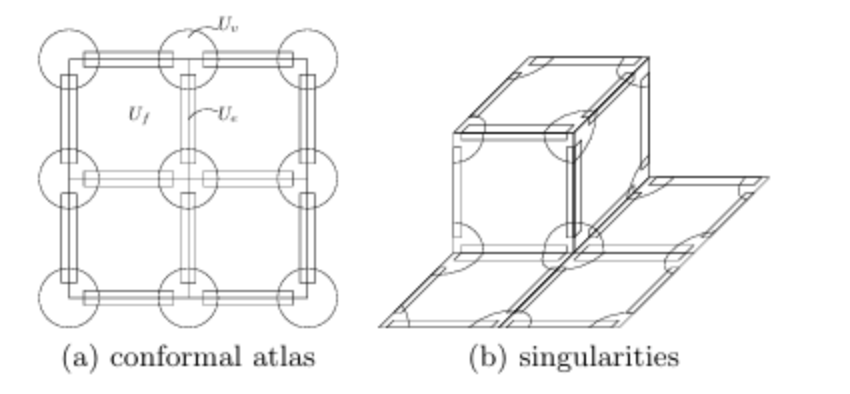

## 用数学棱镜看四边形网格

带着这样一个问题思考，四边形网格化是否存在？如何进行判定？奇异点度数凑齐满足Gauss-Bonet是否就充分？

### 1.四边形网格与除子

#### 四边形网格诱导共形结构

顾险峰指出，**任何一个四边形网格都可以诱导出一个共形结构（conformal structure）**。具体来说：

- 四边形网格的每个面可以映射为单位正方形 $[0,1] \times [0,1]$，面与面之间的转移函数是平移 + 旋转 $90^\circ$ 的整数倍
- 这种转移函数自然是全纯（复解析）的——因为平移和旋转都是共形变换
- 因此，四边形网格的图册（atlas）本身就是一个共形图册，曲面被赋予了共形结构

反过来，给定一个共形结构，是否总能找到一个"好"的四边形网格？答案是否定的——这是一个受全局拓扑约束的问题。

#### 四边形网格 ↔ 平展锥度量

四边形网格与共形结构的关系是**双向**的：

- **四边形网格 → 共形结构**：每个面映射到 $[0,1]^2$，转移函数为整数平移 + $90^\circ$ 旋转，图册天然共形。
- **四边形网格 → 平展锥度量（flat cone metric）**：理想四边形网格在普通 4-价顶点附近曲率为零，曲率集中在 extraordinary vertex 上。若顶点价数为 $n$，局部锥角为

$$
\Theta_v = n \cdot \frac{\pi}{2}, \qquad K_v = 2\pi - \Theta_v = \left(4 - n\right)\frac{\pi}{2}.
$$

这正是 Poincaré-Hopf 指数 $I(v) = 1 - n/4$ 的几何含义——奇异点 index 以 $\frac{1}{4}$ 为单位，来自 $2\pi$ 与 $\frac{\pi}{2}$ 对称性的比例关系。

- **共形结构 → 四边形网格**：需要额外满足 Abel 约束与周期整数化，不是自动成立的。

### 2.奇异点的拓扑约束

#### Poincaré-Hopf 与 Riemann-Roch

四边形网格的奇异点配置不是任意的，它受到深刻的拓扑约束。设四边形网格中价数为 $k$ 的顶点数量为 $n_k$，则：

- 奇异点指数之和必须等于曲面的欧拉示性数：

$$
\sum_{k \neq 4} (4 - k) \, n_k = 4\chi(M)
$$

这是 **Poincaré-Hopf 定理** 的直接推论——四边形网格的指数可以定义为 $I(v) = 1 - k/4$。

- 然而，Poincaré-Hopf 只是**必要条件**，不是充分条件。顾险峰进一步用 **Riemann-Roch 定理** 揭示了更精细的约束：

设 $D$ 是奇异点的除子（divisor），即每个奇异点的"度数"（degree = 4 - 价数）构成一个形式线性组合。四边形网格的存在性等价于：存在一个亚纯二次微分（meromorphic quadratic differential）$\omega$ 使得 $(\omega)$（$\omega$ 的除子）恰好是 $D$。

根据 Riemann-Roch，这要求：

$$
\ell(D) - \ell(K - D) = \deg(D) + 1 - g
$$

其中 $K$ 是典范除子，$g$ 是亏格。这个公式限制了**在给定亏格下能配置多少以及何种奇异点**。

#### 奇异点与除子的对应

对四边形网格，价数为 $k$ 的顶点 $v$ 对应除子中的点 $p_v$，其**度数**（degree）为

$$
d_v = 4 - k.
$$

3-价顶点为度 $+1$（零点），5-价顶点为度 $-1$（极点）。除子 $D = \sum_v d_v \cdot p_v$ 记录了所有奇异点的带符号重数。参数化中，同一顶点对应锥角 $k\pi/2$ 的锥奇异点；Gauss-Bonnet 给出

$$
\sum_v K_v = 2\pi\chi(M) \quad \Longleftrightarrow \quad \sum_{k \neq 4} (4-k)\, n_k = 4\chi(M),
$$

两种表述通过整数等值线的拓扑结构完全同构。

### 3.周期矩阵与Holonomy双线性关系

四边形网格对接缝两侧的对齐要求引入了**周期（period）约束**。在 $2g$ 个同调基底 $\{a_1, \ldots, a_g, b_1, \ldots, b_g\}$ 上对 1-form 积分，得到 $2g$ 个周期向量：

$$
\text{Period}(a_i) = \int_{a_i} \omega \in \mathbb{C}^g, \quad
\text{Period}(b_i) = \int_{b_i} \omega \in \mathbb{C}^g
$$

这些周期组成了曲面的**周期矩阵（Period Matrix）**。要让接缝两侧的参数坐标完美拼接，所有周期必须是**整数**（或至少是高斯整数 $\mathbb{Z} + i\mathbb{Z}$）。周期矩阵的整数化是四边形网格化的核心困难——它既是一个优化问题（如 MIQ 的混合整数规划），也有着深刻的复几何解释（周期矩阵的列张成了 $\mathbb{C}^g$ 中的格点 $\Gamma$）。

另外，设 $\{\varphi_1, \cdots, \varphi_g\}$ 为 $\Omega^1$（$\mathbb{C}$ 上全纯微分构成的线性空间）的正规基（canonical basis），满足

$$
\int_{a_i} \varphi_j = \delta_{ij}, \quad i, j = 1, \cdots, g,
$$

其中 $\delta_{ij}$ 为 Kronecker 符号。

对于每一条闭曲线 $\gamma$，沿 $\gamma$ 对各个全纯微分基积分，得到 $\mathbb{C}^g$ 中的向量

$$
\lambda_\gamma = \left(\int_{\gamma} \varphi_1, \cdots, \int_{\gamma} \varphi_g\right).
$$

$\mathbb{C}^g$ 中的 $g$ 维复格点 $\Gamma$ 定义为

$$
\Gamma = \left\{ \sum_{k=1}^g (s_k \lambda_{a_k} + t_k \lambda_{b_k}) : s_k, t_k \in \mathbb{Z} \right\}.
$$

#### Holonomy 与周期整数化

周期约束与 seamless 参数化的转移函数直接对应。设割缝两侧参数坐标为 $u$ 和 $u'$，无缝对齐要求

$$
u' = R_{90}^i\, u + (j, k)^{\mathsf T}, \qquad i, j, k \in \mathbb{Z},
$$

其中 $R_{90}$ 为 $90^\circ$ 旋转矩阵。跨 seam 时 Jacobian 在公共边方向上只相差 quarter-turn：

$$
J_j e_{ij} = r_{ij}\, J_i e_{ij}, \qquad \omega_{ij} = \angle(r_{ij}) \in \left\{0, \frac{\pi}{2}, \pi, \frac{3\pi}{2}\right\}.
$$

在向量场路线中，跨边的 $r_{ij}$ 编码了 $\mathbb{Z}_4$ 对称下的 matching；绕闭环累计 matching，就得到离散 holonomy $\operatorname{Hol}_\gamma \in \frac{\pi}{2}\mathbb{Z}$。

从联络角度看，**可收缩环路**上的 holonomy 为零（联络局部平凡），**不可收缩环路**上的 holonomy 可能非零——即使曲率处处为零（平坦），联络仍可能不是平凡的：

> **平凡 $\Rightarrow$ 平坦，但平坦 $\nRightarrow$ 平凡。**

环面上的 handle 环路就是典型例子。四边形网格化要求亚纯 1-形式沿 $H_1(M,\mathbb{Z})$ 生成元的周期落在 $\mathbb{Z} + i\mathbb{Z}$ 中，这正是 MIQ、PGP 中混合整数规划与 period jump 的复几何来源。工程上，PGP 把跨边残差显式拆成连续部分 + 整数旋转 $k_{ij}$ + 整数平移 $\mathbf{n}_{ij}$：

$$
\Delta \mathbf{p}_{ij}^{(L)} \approx R\!\left(k_{ij}\frac{\pi}{2}\right)\Delta \mathbf{p}_{ij}^{(R)} + \mathbf{n}_{ij}, \quad k_{ij} \in \mathbb{Z},\ \mathbf{n}_{ij} \in \mathbb{Z}^2.
$$

### 4.Abel定理与Abel-Jacobian映射

**Abel 定理**（19世纪）给出了一个除子能否成为亚纯函数零极点的充要条件：除子 $D$ 在 Abel-Jacobi 映射下的像必须属于 Jacobi 簇的格点 $\Gamma$：
$$
\mu(D) \equiv 0 \pmod{\Gamma}
$$

对于四边形网格化，这转化为：**给定一组候选奇异点 $\{p_1, \ldots, p_n\}$ 及其度数 $\{d_1, \ldots, d_n\}$，它们能成为一个全局四边形网格的奇异点当且仅当**：

1. 总度数满足 $\sum d_i = 4\chi(M)$（Poincaré-Hopf）
2. 在 Abel-Jacobi 映射下，$\sum d_i \cdot \mu(p_i) \equiv 0 \pmod{\Gamma}$

对除子 $D = \sum_i d_i p_i$，Abel-Jacobi 映射线性延拓为

$$
\mu(D) = \sum_i d_i \,\mu(p_i).
$$

Abel 定理的完整表述是：**$D$ 是主除子（某个亚纯函数的除子）当且仅当 $\mu(D) \equiv 0 \pmod{\Gamma}$**。Poincaré-Hopf 只保证度数总和正确；Abel 约束进一步排除像环面 5,7-三角化那样"度数相容但全局不可能"的配置。

雅可比簇 **Jacobian Variety $J(S)$** 定义在黎曼面 $S$ 上，是紧商空间

$$
J(S) = \mathbb{C}^g / \Gamma.
$$

**Abel–Jacobi 映射**是将**几何对象**（点、除子、代数圈）转化为**复环面上的点**的桥梁。以某个固定基点 $p_0 \in S$ 为原点，Abel-Jacobian 映射 $\mu : S \to J(S)$ 定义为：对任意 $p \in S$，

$$
\mu(p) = \left( \int_{p_0}^p \varphi_1, \dots, \int_{p_0}^p \varphi_g \right) \pmod \Gamma,
$$

其中积分沿任意路径进行。

亚纯函数除子 $(f)$ 通过 Abel-Jacobian 映射后满足 **Abel-Jacobi 定理**：

$$
\mu((f)) = \sum_{p \in S} \nu_p(f) \mu(p) = 0.
$$

### 5.不存在只有一个度为5的奇异点和一个度为7奇异点的三角化

**Theorem 2.3 (Jendrol and Jucovic)**：环面上不存在 5,7-三角化，即不存在恰有两个异常顶点、价数分别为 5 和 7 的三角化。

证明思路：将 5,7-三角化 $\mathcal{T}$ 的每个面视为欧氏等边三角形，可构造共形结构 $\mathcal{A}$。在面 $f$、边 $e$、顶点 $v$ 上分别取局部坐标 $z_f, z_e, z_v$；对价数为 $k$ 的奇异顶点，局部坐标与等距嵌入 $w_v$ 的关系为

$$
z_v = w_v^{\frac{6}{k}}.
$$

面、边与正则顶点之间的转移映射的旋转分量为 $e^{i \frac{n\pi}{3}}$（$n \in \mathbb{Z}$）的形式。在局部坐标上定义全纯微分

$$
\omega = (dz_f)^6 = (dz_e)^6 = (dz_v)^6.
$$

$\omega$ 全局良定义，但在奇异顶点处需延拓。由上式得

$$
dw_v = \frac{k}{6} (z_v)^{\frac{k-6}{6}} dz_v, \qquad
(dw_v)^6 = \left(\frac{k}{6}\right)^6 (z_v)^{k-6} (dz_v)^6.
$$

因此 $\omega$ 是全局亚纯微分：5-价顶点 $q$ 为 $\omega$ 的极点（阶 $k-6=-1$），7-价顶点 $p$ 为零点（阶 $+1$）。

取典范全纯 1-形式 $\omega_0$（无零极点），定义亚纯函数

$$
f = \frac{\omega}{(\omega_0)^6}, \qquad (f) = (\omega) - 6(\omega_0) = p - q.
$$

由 Abel-Jacobi 定理，

$$
\mu((f)) = \mu(p) - \mu(q) = \int_{p_0}^p \omega_0 - \int_{p_0}^q \omega_0 = 0.
$$

这意味着在基本域内 $p$ 与 $q$ 必须重合，与 $p \neq q$ 矛盾。故环面上不存在 5,7-三角化。$\square$

该论证可以推广：对任意亏格，若奇异点除子 $D$ 在主除子意义下不可能（$\mu(D) \not\equiv 0 \pmod{\Gamma}$），则不存在以这些点为奇异点的四边形网格——即使 Poincaré-Hopf 和 Riemann-Roch 的必要条件都已满足。

### 6.理论链条与工程方法的对应

顾险峰的计算共形理论将四边形网格化从"工程技巧"提升为可判定的数学问题。完整链条为：

$$
\text{共形结构} \;\to\; \text{亚纯微分} \;\to\; \text{奇异点除子} \;\to\; \text{Abel 约束} \;\to\; \text{周期整数化} \;\to\; \text{四边形网格}.
$$

> 一个给定拓扑的曲面能否被四边形网格化？能——当且仅当存在一组满足 Poincaré-Hopf + Abel-Jacobi 条件的奇异点配置，且这些奇异点对应的亚纯二次微分的所有周期可以同时整数化。

| 理论对象 | 几何含义 | 工程对应 |
| -------- | -------- | -------- |
| 共形结构 / 全纯 1-形式 $\varphi_i$ | 正交参数线方向 | Hodge 分解求调和基（§3.4） |
| 奇异点除子 $D$ | 允许出现的零极点配置 | 方向场 singularities / MIQ 指标 |
| Abel 约束 $\mu(D) \equiv 0$ | 除子能否成为主除子 | 奇异点位置的 global compatibility |
| 格点 $\Gamma$ / 周期矩阵 | 同调环路上的积分格 | period jumps / 混合整数变量 |
| 整数等值线 $u,v \in \mathbb{Z}$ | 参数域栅格 | 最终 quad layout 提取 |

**全局参数化 vs 四边形网格化**：前者输出连续 UV 坐标（除锥点外 $C^\infty$），后者输出离散四边形面片。参数化是"因"，四边形网格是"果"——沿 $u \in \mathbb{Z}, v \in \mathbb{Z}$ 提取等值线即可得到网格骨架。实践中典型流水线为：设计 cross field（第4章）→ 构建全局无缝参数化（MIQ / QuadCover / PGP）→ 提取整数等值线（本章理论保证）。

参数线不能全局拆成独立的两组曲线——frame field 本质上是带 $\mathbb{Z}_4$ 对称性的对象，跨 chart 时发生 quarter-turn 跳变。QuadCover 的分支覆盖正是把多值 cross field 展开为覆盖空间上的单值场：

$$
\text{matching} \;\to\; \text{covering} \;\to\; \text{holonomy elimination} \;\to\; \text{single-valued field}.
$$

## 算法步骤

Abel-Jacobi 路线将曲面视为**黎曼曲面**，通过复分析工具实现全局参数化。四边形网格本质上是在曲面上寻找一对正交、具有整数坐标的参数线纹理。

#### 第一步：计算同调基与全纯微分

首先识别曲面的拓扑结构（Tree-Cotree 分解 handle / tunnel，见 §4.3.2）。

- 计算第一同调群 $H_1(M, \mathbb{Z})$ 的基底 $\{a_1,\ldots,a_g,b_1,\ldots,b_g\}$。
- 利用 Hodge 分解或 FEM 求解调和方程，得到基底全纯 1-形式 $\omega_i = du_i + i\, dv_i$（§3.4）。这些 1-形式的等值线就是潜在线条。

#### 第二步：确定奇异点

四边形网格在曲率集中处必须有奇异点（3-价或 5-价顶点）。除 Poincaré-Hopf 外，还需满足 Abel-Jacobi 约束：候选奇异点除子 $D = \sum d_i p_i$ 必须满足 $\mu(D) \equiv 0 \pmod{\Gamma}$。这意味着可以通过调整奇异点位置，使它们在全局范围内"相容"。

#### 第三步：全局参数化与周期整数化

将曲面沿同调基切开为拓扑圆盘，在平面上展开。

- 利用 Abel-Jacobi 映射 $\mu(p)$ 将点 $P$ 转换为参数坐标。
- **格点对齐（Quantization）**：切口两端坐标差须为整数。调整 1-形式的线性组合 $\omega = \sum c_i \omega_i$，使沿所有同调生成元的周期 $\int_\gamma \omega$ 落在 $\mathbb{Z} + i\mathbb{Z}$ 中——这与 PGP/MIQ 中对 period jump 的整数优化本质相同。

#### 第四步：提取网格

得到全局连续（除奇异点外）、周期为整数的参数化场后：

1. 在 $(u,v)$ 平面绘制整数栅格 $u \in \mathbb{Z}, v \in \mathbb{Z}$；
2. 将栅格逆映射回曲面 $M$；
3. 通过线段求交提取四边形单元。方向场奇异点对应 quad layout 中的 extraordinary vertices。
