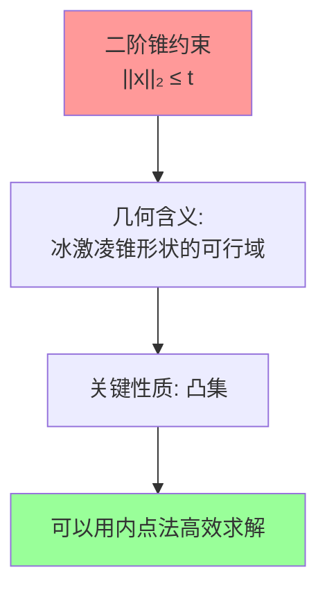

### 6.1.3 二次规划与二阶锥规划

#### 6.1.3.1 二次规划 (Quadratic Programming, QP)

##### A. QP 的标准形式

二次规划是优化问题中最基本的一类，其目标函数是二次的，约束条件是线性的。标准形式为：

$$
\min_{x \in \mathbb{R}^n} \quad \frac{1}{2} x^T H x + c^T x

\\\text{s.t.} \quad A_{eq} x = b_{eq}

\\\quad A_{ineq} x \leq b_{ineq}

\\\quad l \leq x \leq u
$$

其中 $H \in \mathbb{R}^{n \times n}$ 是对称**正定或半正定**矩阵（当 $H \succ 0$ 时为严格凸 QP，有唯一全局最优解），$c \in \mathbb{R}^n$，$A_{eq} \in \mathbb{R}^{m \times n}$，$A_{ineq} \in \mathbb{R}^{p \times n}$

##### B. KKT 条件

QP 问题的 Karush-Kuhn-Tucker (KKT) 最优性条件为：

$$H x^* + c + A_{eq}^T \lambda_{eq} + A_{ineq}^T \lambda_{ineq} = 0 \quad \text{(平稳性)}$$

$$A_{eq} x^* = b_{eq} \quad \text{(等式约束)}$$

$$A_{ineq} x^* \leq b_{ineq} \quad \text{(不等式约束)}$$

$$\lambda_{ineq} \geq 0 \quad \text{(对偶可行性)}$$

$$\lambda_{ineq}^T (A_{ineq} x^* - b_{ineq}) = 0 \quad \text{(互补松弛)}$$

##### C. 活动集法 (Active Set Method)

活动集法是求解 QP 问题的一种经典方法，特别适用于中小规模的问题。其核心思想是：在最优解处，部分不等式约束取等号（即"活跃"的），其余约束严格不等号（即"非活跃"的）。如果知道哪些约束是活跃的，就可以将不等式约束问题转化为等式约束问题来求解。

**活跃约束 (Active Constraint)**：在点 $x$ 处，如果某个不等式约束取等号，即 $a_i^T x = b_i$，则称该约束在 $x$ 处是活跃的。

**活动集 (Active Set)**：在点 $x$ 处所有活跃约束的索引集合：

$$\mathcal{A}(x) = \{i : a_i^T x = b_i\}$$

**算法流程**：

**初始化**：找到一个可行点 $x_0$，确定初始工作集 $W_0 \subseteq \mathcal{A}(x_0)$

**迭代**（第 $k$ 步）：

**Step 1**：求解等式约束 QP 子问题。在当前工作集 $W_k$ 下，求解搜索方向 $p_k$：

$$\min_{p} \quad \frac{1}{2} p^T H p + g_k^T p$$

$$\text{s.t.} \quad a_i^T p = 0, \quad \forall i \in W_k$$

其中 $g_k = H x_k + c$ 是在 $x_k$ 处的梯度。

**Step 2**：判断搜索方向

- 若 $p_k = 0$（已在当前工作集的约束面上取得最优）：
  - 计算对应的 Lagrange 乘子 $\lambda_i, i \in W_k$
  - 若所有 $\lambda_i \geq 0$，则 $x_k$ 是最优解，**算法终止**
  - 否则，找到最负的乘子 $\lambda_q = \min_{i \in W_k} \lambda_i < 0$，将约束 $q$ 从工作集中移除：$W_{k+1} = W_k \setminus \{q\}$

- 若 $p_k \neq 0$：
  - 计算最大步长 $\alpha_k$，使得 $x_k + \alpha_k p_k$ 不违反任何约束：
  
  $$\alpha_k = \min\left(1, \min_{i \notin W_k, a_i^T p_k > 0} \frac{b_i - a_i^T x_k}{a_i^T p_k}\right)$$
  
  - 更新 $x_{k+1} = x_k + \alpha_k p_k$
  - 若 $\alpha_k < 1$（存在阻拦约束），将阻拦约束 $j$ 加入工作集：$W_{k+1} = W_k \cup \{j\}$
  - 若 $\alpha_k = 1$，工作集不变：$W_{k+1} = W_k$

**Step 3**：$k \leftarrow k+1$，返回 Step 1

**算法特点**：

1. **有限步终止**：对于严格凸 QP，活动集法在有限步内终止
2. **热启动**：可以利用上一次的解和工作集作为初始点，加速后续求解
3. **与参数化的关联**：BDHM 中的 Active Set 方法正是这种策略的应用——在迭代过程中，只有违反扭曲约束的采样点才被激活，加入约束集合 $\mathcal{A}$ 和 $\mathcal{B}$

---

#### 6.1.3.2 二阶锥规划 (Second-Order Cone Programming, SOCP)

##### A. SOCP 的标准形式

二阶锥规划是一类重要的凸优化问题，它推广了线性规划(LP)和二次规划(QP)，能够处理包含二阶锥约束的问题。标准形式为：

$$\min_{x \in \mathbb{R}^n} \quad f^T x$$

$$\text{s.t.} \quad \|A_i x + b_i\|_2 \leq c_i^T x + d_i, \quad i = 1, \ldots, N$$

$$\quad F x = g$$

其中 $\|\cdot\|_2$ 是欧几里得范数，每个不等式约束称为一个**二阶锥约束 (SOC约束)**。

##### B. 二阶锥的几何含义

二阶锥（也叫 Lorentz 锥或冰激凌锥）定义为：

$$\mathcal{Q}^n = \{(x, t) \in \mathbb{R}^{n} \times \mathbb{R} : \|x\|_2 \leq t\}$$

即向量 $(x, t)$ 满足 $x$ 的模长不超过 $t$，这在几何上形成了一个以原点为顶点、$t$ 轴为中心轴的锥体。

##### C. SOCP 与 LP/QP 的关系

SOCP 是一个比 LP 和 QP 更一般的优化框架：

| 优化类型 | 约束形式 | 关系 |
|---|---|---|
| LP（线性规划） | $Ax \leq b$ | LP 是 SOCP 的特例（$A_i$ 为零矩阵时 SOC 退化为线性不等式） |
| QP（二次规划） | $x^T P x + q^T x \leq r$ | 凸 QP 可以转化为 SOCP |
| QCQP（二次约束QP） | $x^T P_i x + q_i^T x \leq r_i$ | 凸 QCQP 可以转化为 SOCP |
| SOCP | $\|A_i x + b_i\|_2 \leq c_i^T x + d_i$ | 包含上述所有 |

**QP 转化为 SOCP 的示例**：

凸二次不等式 $x^T P x + q^T x \leq r$（$P \succeq 0$）可以等价写为 SOC 约束。设 $P = L^T L$（Cholesky 分解），则：

$$x^T P x + q^T x \leq r \iff \left\| \begin{pmatrix} 2Lx \\ 1 - (r - q^T x) \end{pmatrix} \right\|_2 \leq 1 + (r - q^T x)$$

##### D. 在参数化中的应用

在 Lipman 和 BDHM 的方法中，SOCP 扮演了核心角色。关键是将**非凸的扭曲约束**转化为**凸的 SOC 约束**：

**1. 保向性约束（正定性）**

原始约束：$|f_z|^2 - |f_{\bar{z}}|^2 \geq \varepsilon > 0$

SOC 形式：

$$\left\| \begin{pmatrix} 2\,\text{Re}(f_z) \\ 2\,\text{Im}(f_z) \end{pmatrix} \right\|_2 \leq |f_z|^2 + |f_{\bar{z}}|^2 - \varepsilon$$

这利用了恒等式 $|f_z|^2 + |f_{\bar{z}}|^2 - (|f_z|^2 - |f_{\bar{z}}|^2) = 2|f_{\bar{z}}|^2$，将不等式改写为 $\|v\|_2 \leq t$ 的标准 SOC 形式。

**2. 有界扭曲约束**

原始约束：$|f_{\bar{z}}| \leq \kappa |f_z|$

等价于：$|f_{\bar{z}}|^2 \leq \kappa^2 |f_z|^2$

SOC 形式：

$$\left\| \begin{pmatrix} 2\,\text{Re}(f_{\bar{z}}) \\ 2\,\text{Im}(f_{\bar{z}}) \end{pmatrix} \right\|_2 \leq (1-\kappa)|f_z|^2 - (1+\kappa)|f_{\bar{z}}|^2$$

**3. Lipman 的凸子空间**

Lipman 定义的最大凸子空间：

$$\mathcal{A}^{\oplus_j}_C(f_j) = \left\{ (\alpha, \beta, r) : \; |\alpha|^2 - |\beta|^2 \geq r > 0, \; |\beta|^2 \leq \frac{(C-1)^2}{(C+1)^2} \cdot r \right\}$$

其中：
- $|\alpha|^2 - |\beta|^2 \geq r > 0$ 是一个旋转二阶锥约束
- $|\beta|^2 \leq \frac{(C-1)^2}{(C+1)^2} \cdot r$ 也是一个旋转二阶锥约束

两者都是凸约束，因此可行域是凸集。