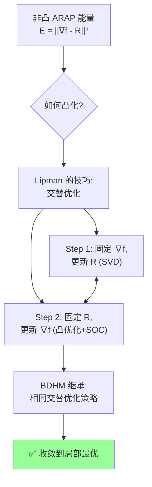
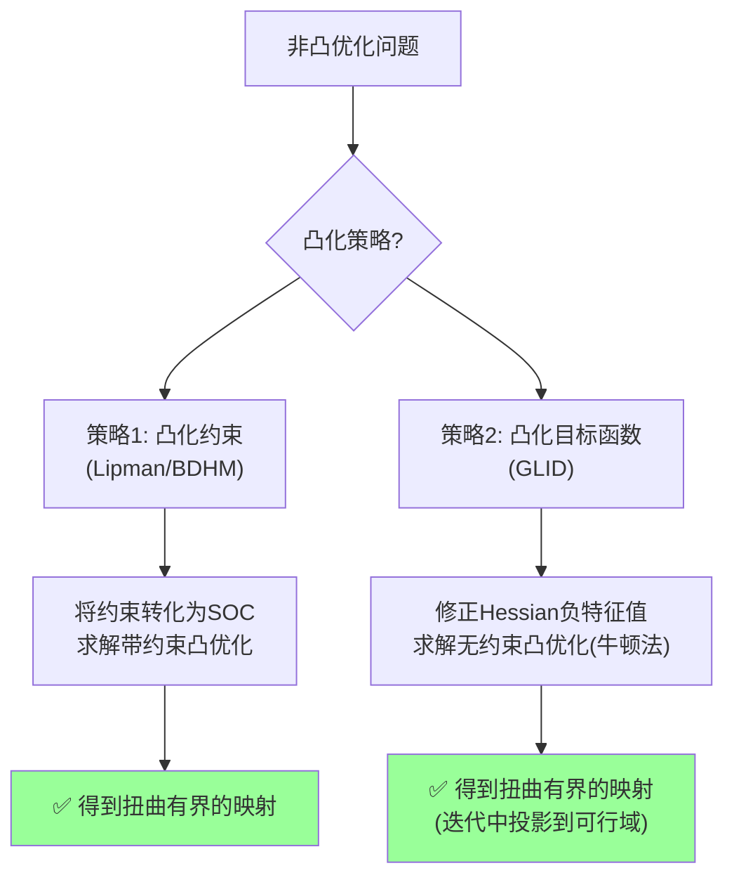

将 2D 平面变形视为一个**复映射**，我们知道调和映射是有比较好的性质那样也就是对应了更好的变形效果，所以本研究的主要目的就是通过数值方法寻找一个这样比较好的映射。

BDHM 的核心策略是**"表示法"**而非"约束法"：不是把 $$\Delta f = 0$$ 作为优化问题的一条约束去求解，而是直接在一个**由调和基函数张成的函数空间**中表示 $$f$$。用 Cauchy 重心坐标构造一组**天然的调和基函数** $$\{\Phi_k(z)\}$$ 和 $$\{\Psi_k(z)\}$$（它们本身满足 $$\Delta \Phi_k = 0$$、$$\Delta \Psi_k = 0$$）将映射表示为 $$f(z) = \sum_k \phi_k \Phi_k(z) + \overline{\sum_k \psi_k \Psi_k(z)}$$调和函数的线性组合仍然是调和函数，无论系数 $$\{\phi_k, \psi_k\}$$ 取何值，$$f(z)$$ 都自动是调和的因此优化变量仅为系数 $$\{\phi_k, \psi_k\}$$，调和性被"硬编码"在了表示中，无需作为约束显式处理。

#### 二阶锥(SOC)凸化技术

将连续的扭曲约束 $|f_{\bar{z}}| \leq \kappa |f_z|$ 和正定性约束 $|f_z|^2 - |f_{\bar{z}}|^2 \geq \varepsilon$ 也转化为二阶锥约束(SOC)的形式。在边界采样点上做凸化（对于调和函数，边界约束可决定内部约束）。

### 复调和映射

**调和映射**定义为满足 Laplace 方程 $$\Delta f = 0$$ 的映射。在复分析中，一个关键事实是：平面区域上的调和函数总可表示为全纯函数的实部。推广到复值映射 $$f = u + iv$$，调和映射可分解为**全纯部分 + 反全纯部分的共轭**。
$$
f(z) = h(z) + \overline{g(z)}
$$

其中 $$h(z)$$ 和 $$g(z)$$ 是 $$\Omega$$ 上的全纯函数,反过来也成立,给定任意两个全纯函数 $$h, g$$，$$f(z) = h(z) + \overline{g(z)}$$ 自动是调和的。

### 复导数

 $$\Delta f = 4 f_{z\bar{z}} = 0$$ 意味着 $$f_z$$ 是全纯的、$$f_{\bar{z}}$$ 是反全纯的。对应的复导数为：
$$
f_z = h'(z), \quad f_{\bar{z}} = \overline{g'(z)}
$$
其中 $$f_z = \frac{1}{2}\left(\frac{\partial f}{\partial x} - i\frac{\partial f}{\partial y}\right)$$，$$f_{\bar{z}} = \frac{1}{2}\left(\frac{\partial f}{\partial x} + i\frac{\partial f}{\partial y}\right)$$。

由此得到一个推论 Corollary 1：

> 若 $f$ 是调和映射，则 $f_z$ 是全纯的，$f_{\bar{z}}$ 是反全纯的。映射 $f$ 是保向的（orientation-preserving）当且仅当 $|f_z| > |f_{\bar{z}}|$。

通过复导数 $f_z$ 与 $f_{\bar{z}}$ 的全纯与反全纯性质来研究 $f$ 的调和性。

$f$ 的 Jacobian 行列式可以通过复导数表达：

$$
J_f = |f_z|^2 - |f_{\bar{z}}|^2
$$

对应地，$f$ 的 Jacobian 矩阵的两个奇异值为：

$$
\sigma_1 = |f_z| + |f_{\bar{z}}|, \quad \sigma_2 = |f_z| - |f_{\bar{z}}|
$$

（假设 $|f_z| \geq |f_{\bar{z}}|$，即 $J_f \geq 0$）

**Dilation（伸缩比）**用其来度量 Conformal Distortion定义为：

$$K_f(z) = \frac{\sigma_1}{\sigma_2} = \frac{|f_z| + |f_{\bar{z}}|}{|f_z| - |f_{\bar{z}}|}$$

等价地，用 Beltrami 系数 $\mu = f_{\bar{z}} / f_z$ 表示：

$$K_f = \frac{1 + |\mu|}{1 - |\mu|}$$

当 $K_f = 1$ 时，$f$ 是共形映射；$K_f$ 越大，扭曲越严重。

### 1.2.3 有界扭曲映射（Bounded Distortion Mapping）

我们要求尽可能扭曲小的 2D 变形，可以考虑给扭曲施加一个界 $K$，我们求解可接受 bound 范围内的扭曲。

> **Definition 1**（Bounded Distortion Mapping）：映射 $f: \Omega \to \mathbb{C}$ 称为 $K$-bounded 的，如果满足：
> 1. $f$ 是调和的（$\Delta f = 0$）
> 2. $f$ 是保向的（$J_f > 0$，即 $|f_z| > |f_{\bar{z}}|$）
> 3. Dilation 有界：$K_f(z) \leq K, \; \forall z \in \Omega$

等价地，条件 2 和 3 可以写为：

$$|f_{\bar{z}}| \leq \kappa \, |f_z|, \quad \kappa = \frac{K-1}{K+1} \in [0, 1)$$

容易证明满足上面条件的 $f$ 是单射。

#### 1.2.3.2 边界值决定映射

对于 Harmonic 映射，边界值全部决定了映射的形态，那么上面 bound 定义可以将考察范围缩小到边界：

> **Theorem 2**：若调和映射 $f$ 在边界 $\partial\Omega$ 上满足 $|f_{\bar{z}}| \leq \kappa |f_z|$，则 $f$ 在内部 $\Omega$ 上自动满足同样的约束（由全纯/反全纯函数的最大模原理）。

###  Cauchy 重心坐标

进一步考察边界（简单曲线）可以用一个简单多边形（Polygon）来进行离散化逼近。

对于简单多边形，定义 Cauchy 重心坐标：

给定多边形 $\partial\Omega = \{v_0, v_1, \ldots, v_{n-1}\}$，Cauchy 重心坐标定义为：

$$w_k(z) = \frac{1}{2\pi i} \oint_{\partial\Omega} \frac{\zeta - v_k}{\zeta - z} \cdot \frac{d\zeta}{\zeta - v_k}$$

对于多边形（折线积分），可以化为：

$$w_k(z) = \frac{1}{2\pi i} \sum_{j=0}^{n-1} \int_{v_j}^{v_{j+1}} \frac{\zeta - v_k}{(\zeta - z)(\zeta - v_k)} \, d\zeta$$

#### 1.2.4.2 离散调和映射的分解

那么就可以将调和映射进一步分解：

> **Theorem 4**（离散调和映射分解）：对于多边形区域上的调和映射 $f$，存在系数 $\{\phi_k\}_{k=0}^{n-1}$ 和 $\{\psi_k\}_{k=0}^{n-1}$ 使得：

$$f(z) = \sum_{k=0}^{n-1} \phi_k \, \Phi_k(z) + \overline{\sum_{k=0}^{n-1} \psi_k \, \Psi_k(z)}$$

其中 $\Phi_k(z)$ 和 $\Psi_k(z)$ 是与 Cauchy 核相关的基函数。

并且对于复导数有：

$$f_z(z) = \sum_{k=0}^{n-1} \phi_k \, \Phi_k'(z), \quad f_{\bar{z}}(z) = \overline{\sum_{k=0}^{n-1} \psi_k \, \Psi_k'(z)}$$

所以现在 $f$ 就完全由 $\phi_k$、$\psi_k$ 系数来表征了。

### 1.2.5 凸化处理与最优化

为了做求解，需要做凸化处理，并导出最优化形式。

各 constrain 条件的凸化如下，用复导数来表示。

#### 1.2.5.1 正定性约束的凸化

$$|f_z|^2 - |f_{\bar{z}}|^2 \geq \varepsilon > 0$$

对于 5d) 的凸化：

用复导数表示为二阶锥约束（SOC）：

并进一步限制在二阶凸锥中：

$$\left\| \begin{pmatrix} 2\,\text{Re}(f_z) \\ 2\,\text{Im}(f_z) \end{pmatrix} \right\|_2 \leq |f_z|^2 + |f_{\bar{z}}|^2 - \varepsilon$$

#### 1.2.5.2 有界扭曲约束的凸化

$$|f_{\bar{z}}| \leq \kappa \, |f_z|, \quad \kappa = \frac{K-1}{K+1}$$

复导数表示：

并限制在二阶凸锥中：

$$\left\| \begin{pmatrix} 2\,\text{Re}(f_{\bar{z}}) \\ 2\,\text{Im}(f_{\bar{z}}) \end{pmatrix} \right\|_2 \leq (1-\kappa)|f_z|^2 - (1+\kappa)|f_{\bar{z}}|^2$$

> 上述 SOC 凸化与 Lipman 方法的关联：上述两个二阶锥约束的推导直接借鉴了 Lipman 的凸化技巧。回顾 §1.1 中的方法：
>
> 1. **Lipman 的凸化思路**：将非凸的扭曲约束 $\frac{|\alpha|+|\beta|}{|\alpha|-|\beta|} \leq C$ 通过引入辅助变量 $r_j = |\alpha|^2 - |\beta|^2$ 转化为凸约束，构成**二阶锥**。
> 2. **BDHM 的直接继承**：将同样的思路应用到连续的调和映射上——将 $|f_{\bar{z}}| \leq \kappa |f_z|$ 和正定性约束转化为 SOC 形式。区别仅在于：Lipman 在每个三角面的局部坐标系下做凸化，而 BDHM 由 Theorem 2（边界值决定内部）只需在边界采样点上做凸化。
> 3. **数学本质的统一**：两者都将关于**奇异值比值**的非凸约束，转化为关于**复导数模长**的二阶锥约束，从而可以用标准的凸优化工具（如 ECOS、MOSEK）求解。

对于非线性**边界条件的处理**比较复杂，见原文 6.4 节。

#### 1.2.5.3 正则项

然后要加入正则项，可以选择 ARAP 能量：

$$E_{\text{reg}}(f) = \int_\Omega \left\| \nabla f - R(\nabla f) \right\|_F^2 \, dA$$

其中 $R(\nabla f)$ 是 $\nabla f$ 的最近旋转矩阵。由于这个能量也是非凸的所以做如下凸化，过程参考 Lipman 的文章：

$$E_{\text{reg}}^{\text{convex}} = \int_\Omega \left( \|\nabla f\|_F^2 - 2\,\text{tr}(\nabla f \cdot R_0^T) \right) dA$$

其中 $R_0$ 是上一迭代的旋转矩阵（线性化）。

> **Lipman 的 ARAP 能量凸化技巧详解**（参见 §1.1.4.2）：
>
> Lipman 原文中处理非凸 ARAP 能量的方法是**交替优化（Alternating Optimization）**策略：
>
> 1. **问题**：ARAP 能量 $E_{ARAP} = \sum \|A_j - R_j\|_F^2$ 中，变量 $A_j$（或 $\alpha_j, \beta_j$）和 $R_j$ 耦合在一起，导致能量关于 $A_j$ 非凸。
> 2. **Lipman 的解法**：固定 $R_j$，则能量关于 $A_j$ 变为**二次凸函数**：
>    $$E_{ARAP}^{\text{convex}} = \sum \left( \|A_j\|_F^2 - 2\,\text{tr}(A_j R_j^T) \right) + \text{const}$$
> 3. **交替迭代**：
>    - Step 1：固定 $A_j$，更新 $R_j = \text{argmin}_R \|A_j - R\|_F^2$（SVD 求解）
>    - Step 2：固定 $R_j$，更新 $A_j$（求解凸优化问题，结合 SOC 约束）
>    - 重复直到收敛
> 4. **BDHM 的继承**：BDHM 对连续的 ARAP 能量做了**完全相同的处理**，将 $\|\nabla f - R\|_F^2$ 线性化为 $\|\nabla f\|_F^2 - 2\,\text{tr}(\nabla f \cdot R_0^T)$，然后与 SOC 约束一起求解凸优化问题。

#### 1.2.5.4 完整优化问题

以及外界输入的约束，终于问题就变成求解如下的**最优化问题**：

$$\min_{\{\phi_k, \psi_k\}} \; E_{\text{reg}}(f) + E_{\text{pos}}(f)$$

$$\text{s.t.} \quad |f_{\bar{z}}(z)| \leq \kappa \, |f_z(z)|, \quad \forall z \in \partial\Omega $$

$$\quad |f_z(z)|^2 - |f_{\bar{z}}(z)|^2 \geq \varepsilon, \quad \forall z \in \partial\Omega $$

$$\quad f(v_k) = f_k^{\text{target}}, \quad k = 0, \ldots, n-1 $$

积分形式的能量用求和表达：

$$E(f) \approx \sum_{j \in \mathcal{M}} w_j \left\| \nabla f(z_j) - R_j \right\|_F^2$$

#### 1.2.5.5 Active Set 方法

综合上面凸化的结果，利用 **Active Set** 方法，则可以得到如下表达式（注意这里采样了三个集合 $\mathcal{M}, \mathcal{A}, \mathcal{B}$）：

$$\min_{\{\phi_k, \psi_k\}} \; \sum_{j \in \mathcal{M}} w_j \left\| \nabla f(z_j) - R_j \right\|_F^2$$

$$\text{s.t.} \quad |f_{\bar{z}}(z_j)| \leq \kappa \, |f_z(z_j)|, \quad \forall j \in \mathcal{A}$$

$$\quad |f_z(z_j)|^2 - |f_{\bar{z}}(z_j)|^2 \geq \varepsilon, \quad \forall j \in \mathcal{B}$$

其中：
- $\mathcal{M}$：所有采样点集合
- $\mathcal{A} \subset \mathcal{M}$：active set 中有界扭曲约束被激活的点
- $\mathcal{B} \subset \mathcal{M}$：active set 中正定性约束被激活的点

对于 Conformal Mapping 可以更进一步简化：

当 $K \to 1$（即 $\kappa \to 0$）时，$|f_{\bar{z}}| = 0$，即 $f$ 是全纯的（共形映射）。此时优化退化为：

$$\min_{\{\phi_k\}} \; \sum_{j \in \mathcal{M}} w_j \, |f_z(z_j)|^2 \quad \text{s.t.} \quad \psi_k = 0, \; \forall k$$

---

### 1.2.6 GLID：基于牛顿法的方法

BDHM 那篇文章是通过求带约束凸优化的方法，而这里（GLID）通过将 Hessian 矩阵凸化，用求解无约束优化问题的牛顿法来做优化。

> **GLID 与 Lipman/BDHM 凸化策略的对比**
>
> GLID 采用了与 Lipman/BDHM **完全不同**的凸化策略：
>
> | 方法 | 凸化对象 | 技术手段 | 优化问题形式 |
> |---|---|---|---|
> | Lipman | 可行域（约束条件） | 二阶锥(SOC)约束 | 凸约束 + 凸目标 |
> | BDHM | 可行域（约束条件） | 二阶锥(SOC)约束 | 凸约束 + 凸目标 |
> | GLID | 目标函数（Hessian矩阵） | Hessian凸化（修正负特征值） | 无约束凸优化 |
>
> **核心区别**：
> - **Lipman/BDHM**：将非凸的**约束** $|f_{\bar{z}}| \leq \kappa |f_z|$ 转化为凸的 SOC 约束，然后求解**带约束的凸优化**问题
> - **GLID**：将非凸的**目标函数** $E_{iso}(f)$ 的 Hessian 矩阵进行凸化（将负特征值设为0或正数），然后求解**无约束的凸优化**问题（牛顿法）
>
> **相同点**：
> - 两者都使用了 Lipman 提出的 **bounded distortion 约束** $|f_{\bar{z}}| \leq \kappa |f_z|$（GLID 在迭代中投影到该可行域）
> - 两者都旨在找到一个扭曲有界的映射

#### 1.2.6.1 Bounded 约束

1）引用 BDHM 中的结果，Bounded 的约束是（这里将从单连通拓展到多连通）：

$$|f_{\bar{z}}(z)| \leq \kappa \, |f_z(z)|, \quad \forall z \in \Omega$$

注意这里并不是同 BDHM 的优化方式，而是做牛顿法做全局优化。

#### 1.2.6.2 各向同性能量（Isometric Energy）

2）我们优化的能量是各向同性（Isometric Energy）：

$$
E_{\text{iso}}(f) = \int_\Omega \left( \sigma_1^2 + \sigma_2^2 - 2 \right) dA = \int_\Omega \left( |f_z|^2 + |f_{\bar{z}}|^2 - J_f \right) dA
$$

其中利用了 $\sigma_1^2 + \sigma_2^2 = 2(|f_z|^2 + |f_{\bar{z}}|^2)$ 和 $J_f = |f_z|^2 - |f_{\bar{z}}|^2$。

GLID 的核心思想是将此能量的 **Hessian 矩阵进行凸化**（修正负特征值），使其变为凸函数，然后使用牛顿法求解无约束优化问题，在迭代中投影到满足 bounded distortion 约束的可行域。
