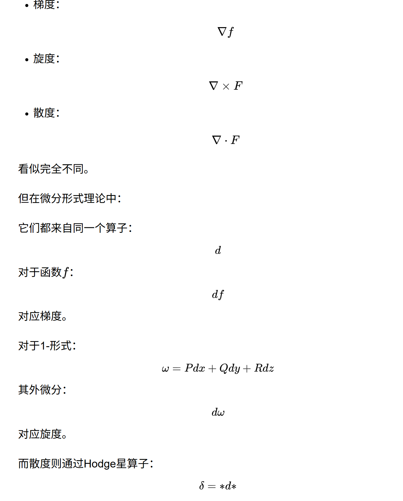

## 微分形式 

微分形式是一套描述几何本质十分有效的语言，陈省身的老师Cartan 发明。它将局部分析对象与整体几何结构自然统一,更好地表达了几何模型的内在结构。许多几何量的本质并不依赖具体坐标，而应通过坐标无关的形式来刻画。

1-形式（如 \(\omega=f(x)\,dx\)）可以看作作用在切向量上的线性泛函，本质上编码了方向导数的信息；2-形式、3-形式则自然对应面积、体积等几何量。

先简单粗略地理解**微分形式是可以用来积分的对象**：比如向量场可以认为是微分形式，标量b是场0-形式，普通向量场可对应 1-形式。微分形式不依赖具体的坐标嵌入，只依赖于**流形内蕴性质**。

### 微分形式的计算

**楔积(wedge)**：将两个1-形式升级为2-形式。几何上，两个1-向量 \(u, v\) 的楔积 \(u \wedge v\) 对应它们张成的有向平行四边形（2-向量）：

楔积运算**可分配**：

$$
\begin{equation*}
u \wedge (v_1 + v_2) = u \wedge v_1 + u \wedge v_2
\end{equation*}
$$

楔积的运算法则（对任意向量 \(u, v, w \in \mathbb{R}^n\) 和标量 \(a, b \in \mathbb{R}\)）：

- **反对称性 (Antisymmetry)**：\(u \wedge v = -v \wedge u\)

  两个1-向量的楔积交换顺序后符号取反，对应有向面积方向翻转（法向 \(+N \to -N\)）：

  

- **结合律 (Associativity)**：\((u \wedge v) \wedge w = u \wedge (v \wedge w)\)
- **对加法的分配律**：\(u \wedge (v + w) = u \wedge v + u \wedge w\)
- **标量乘法的分配律**：\((au) \wedge (bv) = ab\,(u \wedge v)\)

**Hodge算子**：求正交补。在外代数中，Hodge star 算子 \(\star\)（读作"star"）为 \(k\)-向量提供一种"正交补"：若 \(v\) 是 \(\mathbb{R}^n\) 中的 \(k\)-向量，则 \(\star v\) 是一个 \((n-k)\)-向量，在某种意义下是"互补的"。

Hodge算子在平面上相当于旋转 90 度：在 \($\mathbb{R}^2$\) 中，1-向量的 Hodge star 仍是1-向量（因为 \(n-k = 2-1 = 1\)），且与原向量正交。若 \(u\) 指向"东"，则 \(\star u\) 指向"北"——即逆时针旋转 90°：

连续作用 Hodge star：\(\star(\star u)\) 指向"西"，\(\star^3 u\) 指向"南"，\(\star^4 u\) 回到"东"。即在 2D 中，Hodge star 就是逆时针 1/4 旋转。

### 离散微分形式（从连续到网格）

离散微分形式可定义为：

- 0-形式是定义在 $V$ 上的函数 $\alpha(v_i)$
- 1-形式是定义在半边 $HE$ 上的函数 $\beta(e_{ij})$，并且有 $\beta(e_{ji})=-\beta(e_{ij})$
- 2-形式是定义在 $F$ 上的函数 $\gamma(f_{ijk})$

离散外微分算子 $d$：

$$
\begin{aligned}
d\alpha &= \beta(e_{ij}) = \alpha(v_j)-\alpha(v_i),\\
d\beta &= \gamma(f_{ijk}) = \beta(e_{ij})+\beta(e_{jk})+\beta(e_{ki}).
\end{aligned}
$$

1-形式 $\beta$ 称为 **闭的（closed）**，如果 $d\beta=0$。在三角网格上意味着每个三角形上三条边的 1-形式值之和为 0。  
1-形式 $\beta$ 称为 **恰当的（exact）**，如果存在 0-形式 $\alpha$ 使得 $\beta=d\alpha$。

> **重点结论**：所有恰当 1-形式都是闭的，但并非所有闭 1-形式都是恰当的。

**Hodge 算子**

如果某个 1-形式 $\beta$ 既满足 $d\beta=0$ 也满足 $\delta\beta=0$，则 $\beta$ 为 **调和 1-形式（harmonic 1-form）**。

**Laplace 算子**：对 \(k\)-形式，Laplacian 定义为：

$$
\begin{equation*}
\Delta = d\delta + \delta d
\end{equation*}
$$

其中 \(d\) 是外微分，\(\delta = \star d \star\) 是余微分（codifferential）。

- 应用于0-形式（函数）时，后一项消失，得到经典的 Laplacian：\(\Delta f = \text{div}(\nabla f)\)
- 在2D离散情形下，对顶点上的函数，Laplacian 即为著名的 **cotangent 公式** [Pinkall and Polthier 1993]
- 应用于1-形式时，两项都保留 [Fisher et al. 2007]

**Hodge-Laplace 方程**：

$$
\begin{equation*}
\Delta \omega = 0
\end{equation*}
$$

满足此方程的形式 $\omega$ 称为**调和形式 (harmonic form)**。

### 2.2 广义 Stokes、同调与上同调

广义 Stokes 定理：

在离散微分形式已经定义为 cochain 的框架下，可以用 Stokes 定理来定义离散外微分。对任意形式 \(\omega\) 和任意 simplex \(\sigma\)，有：

$$
\int_\sigma d\omega=\int_{\partial\sigma}\omega.
$$

这一定义非常优雅：外微分 \(d\) 与边界算子 \(\partial\) 互为对偶，连续理论中的梯度、旋度、散度、格林公式、高斯公式和斯托克斯公式都被压缩到同一个结构中。

**外微分 \(d\) 统一了梯度、旋度、散度等向量分析算子**，而 Stokes 定理
$$
\int_M d\omega=\int_{\partial M}\omega
$$

把高维区域上的微分运算与边界上的积分联系起来，是牛顿-莱布尼茨公式、格林公式、高斯公式和经典斯托克斯公式的统一几何表达。这说明微积分中“求导、积分”等基本操作，在微分形式语言下，本质上是几何对象之间的自然运算。

### Stokes 定理

微分 \(k\)-形式就是可以在 \(k\) 维域中积分的抽象对象。\(k\)-form 是用来度量 \(k\) 维空间上的**可积信息**。

具体地，0-形式是光滑函数 \(f\)，1-形式是它的微分（导数）：

$$
\begin{equation*}
df = \frac{\partial f}{\partial x^1} dx^1 + \frac{\partial f}{\partial x^2} dx^2 + \cdots
\end{equation*}
$$

1-形式可以在 \(\mathbb{R}^n\) 中任意1维曲线上积分。更一般地，\(k\)-形式是"被设计为在 \(k\) 维区域上积分"的对象——高于或低于该维数的区域上积分为零。

**Stokes 定理**：流形上积分的核心统一定理：
$$
\begin{equation*}
\int_{\partial \Omega} \omega = \int_{\Omega} d\omega
\end{equation*}
$$

即：微分形式 \(\omega\) 在区域边界 \(\partial \Omega\) 上的积分，等于其外微分 \(d\omega\) 在整个区域 \(\Omega\) 上的积分。

为什么这种统一会出现？因为外微分并不依赖具体坐标。**外微分是协变的**，它在坐标变换下保持形式一致。而传统梯度、旋度、散度的写法，则严重依赖欧氏坐标。

从微分形式的观点看，“微积分来自几何”意味着：

- 微积分的对象首先是几何的。函数的导数不再只是孤立的极限，而是余切丛上的 1-形式；积分也不再只是对“高度”的累加，而是对流形上微分形式的积分，依赖于流形的定向和体积元。
- 微积分的定理是几何事实的分析表达。例如 Stokes 定理不是一个单纯的分析技巧，而是拓扑-几何事实：边界算子与外微分互为对偶，即 \(\partial^2=0 \Longleftrightarrow d^2=0\)。微积分的深层结构由几何甚至拓扑决定。
- 坐标无关性体现了几何本源。微分形式在坐标变换下按协变规则变化，使其可以自然定义在曲面、广义相对论中的时空等弯曲空间上。因此，真正的微积分应建立在几何直觉与几何结构上，而不仅依赖代数操作或极限技巧。

从积分来定义微分形式：可以进行积分的“形式”即为微分形式。

积分首先是线性的：对不相交集合 \(A,B\)，有

$$
\int_{A\cup B}=\int_A+\int_B.
$$

光滑函数在零测集上的积分为零；例如函数在曲线或点上的积分为零。更重要的是，积分具有客观性（objective），也就是其值在坐标变换下保持不变。这些性质共同要求被积对象在低维区域上有意义，并且在换元后保持不变。为了满足这些要求，积分号后面的表达必须具有反对称性，因此微分形式正是支撑积分运算的基本构件。

正式定义：

设 \(\mathcal{M}\subset\mathbb{R}^n\) 是 \(n\)-维流形，\(T_x\mathcal{M}\) 是点 \(x\in\mathcal{M}\) 处的切空间。一个 \(k\)-形式 \(\omega^k\) 是定义在 \(\mathcal{M}\) 上的秩为 \(k\) 的反对称张量场。也就是说，在每个点 \(x\)，它都是一个多重线性映射：

$$
\omega^k:T_x\mathcal{M}\times\cdots\times T_x\mathcal{M}\rightarrow\mathbb{R}.
$$

当交换变量发生奇排列时，\(\omega^k\) 改变符号，这就是反对称性。任意 \(k\)-形式也会自然诱导出子流形上的 \(k\)-形式，只需把切空间限制到该子流形的切空间即可。

$\mathbb{R}^3$ 空间中的外微分：

在 \(\mathbb{R}^3\) 中，微分形式与传统向量分析之间有直接对应：

- 0-形式对应标量场；
- 1-形式对应向量场；
- 2-形式也可借助 Hodge 算子对应向量场；
- 3-形式对应标量场。

对向量场 \(u,v,w\) 以及标量函数 \(f\)，形式的求值可理解为：

$$
\begin{aligned}
u^1(v)&\leftrightarrow u\cdot v,\\
u^2(v,w)&\leftrightarrow u\cdot(v\times w),\\
f^3(u,v,w)&\leftrightarrow f\,u\cdot(v\times w).
\end{aligned}
$$

经典的梯度、旋度、散度也可以统一写成外微分与 Hodge 算子的组合：

$$
\begin{aligned}
d^0f&=\nabla f,\\
\star d^1u&=\nabla\times u,\\
\star d^2u&=\nabla\cdot u.
\end{aligned}
$$

这说明即使在最基本的向量运算中，微分形式也给出了更统一、可推广的表达方式，因此适合进一步离散化并用于计算。

### 2.1 离散微分形式与单纯复形

需要先定义单纯复形：

在离散情形中，需要先用单纯复形描述网格。0-simplex 是顶点，1-simplex 是边，2-simplex 是三角形，3-simplex 是四面体。形式化地，一个 \(k\)-simplex \(\sigma_k\) 是 \(k+1\) 个几何上不同的点 \(v_0,\cdots,v_k\in\mathbb{R}^n\) 的非退化凸包：

$$
\sigma_k=\left\{x\in\mathbb{R}^n\mid x=\sum_{i=0}^k \alpha^i v_i,\ \alpha^i\ge 0,\ \sum_{i=0}^k\alpha^i=1\right\}.
$$

这些点 \(v_0,\cdots,v_k\) 称为该 simplex 的顶点，\(k\) 是它的维数，记作

$$
\sigma_k=\{v_0v_1\cdots v_k\}.
$$

单纯复形的 $k$-chain：

给定一个有向单纯复形 \(\mathcal{K}\)，一个 \(k\)-chain 是对每个 \(k\)-simplex 赋予一个实数系数，也就是所有 \(k\)-simplex 的线性组合：

$$
c=\sum_{\sigma\in\mathcal{K}}c(\sigma)\,\sigma,\qquad c(\sigma)\in\mathbb{R}.
$$

所有 \(k\)-chain 构成的群记为 \(C_k\)。

单纯复形的边界算子：

边界算子 \(\partial\) 把一个 \(k\)-simplex 映射为其带符号的 \((k-1)\)-faces 之和。例如三角形的边界就是三条有向边的代数和。一般地：

$$
\partial\{v_0v_1\cdots v_k\}=\sum_{j=0}^k(-1)^j\{v_0,\cdots,\hat{v}_j,\cdots,v_k\}.
$$

其中 \(\hat{v}_j\) 表示删去该顶点。符号 \((-1)^j\) 用来统一处理不同维度下的定向约定。

$k$-cochain 是 $k$-chain 的对偶：

一个 \(k\)-cochain \(\omega\) 是 \(k\)-chain 的对偶，也就是把 \(k\)-chain 映射到实数的线性函数：

$$
\omega:C_k\rightarrow\mathbb{R},\qquad c\mapsto \omega(c).
$$

因为 chain 是 simplex 的线性组合，所以 cochain 只需要在每个 simplex 上给出数值，再线性扩展到整个 chain。

将离散微分形式看作单纯复形的 co-chains：

这正好给出了离散微分形式的定义：\(k\)-cochain 可以看作 \(k\)-形式的离散对应物。连续 \(k\)-形式定义为从 \(k\)-维切空间到 \(\mathbb{R}\) 的线性映射，通常要在 \(k\)-维子流形上积分；在离散情形中，只允许在 \(k\)-simplex 上积分，并把积分值赋给对应的 simplex，就得到一个 \(k\)-cochain。因此，离散 \(k\)-形式就是单纯复形上的 \(k\)-cochain。

对 chain 上形式的计算：

由于线性性，微分形式在任意 chain 上的积分可以由它在各个 simplex 上的积分加权得到：

$$
\int_{\sum_i c_i\sigma_i}\omega=\sum_i c_i\int_{\sigma_i}\omega.
$$

于是，连续 \(k\)-形式 \(\omega\) 在每个 \(k\)-simplex \(\sigma_i\) 上的积分

$$
\omega[i]=\int_{\sigma_i}\omega
$$

就是它的离散表示。实际应用中，有时还需要从 cochain 恢复点值或局部积分值，这对应形式插值（form interpolation）问题。

同调 / 上同调（cohomology）：

上同调群可以看作同调群的对偶版本。把同调定义中的 chain 替换为 cochain，把边界算子 \(\partial\) 替换为外微分 \(d\)，并反转空间之间的映射方向，就得到上同调。因为 cochain 是 chain 的对偶，\(d\) 是 \(\partial\) 的伴随算子，所以对应的等价类定义为上同调群：

$$
H^k=\ker d_k/\operatorname{im} d_{k-1}.
$$

直观地说，上同调刻画了闭形式中不能写成恰当形式的部分，即“闭但非恰当”的全局自由度。

计算上同调群：

计算上同调基的一种常见方法是先计算 Smith Normal Form 得到同调基，再由此构造上同调基；但这种方法复杂度较高。另一类方法直接在外微分矩阵上做化简：对 \(d^k\) 的列进行消元，得到

$$
D^k=d^kN^k,
$$

其中非零列向量线性无关，且 \(N^k\) 是非奇异上三角矩阵。随后构造

$$
K^k=\{N_i^k\mid D_i^k=0\},
$$

作为 \(\ker d^k\) 的基，再从中去掉来自 \(\operatorname{im}d^{k-1}\) 的部分，最终得到上同调基。对于参数化问题而言，上同调基正对应那些闭但非恰当的 1-形式自由度，会进入后续周期约束与基底构造。

> **重点**：在参数化问题中，上同调空间刻画了“闭但非恰当”的全局自由度，这会直接进入后续周期约束与基底构造。

### 向量场与微分形式是对偶的

向量场和微分形式是描述同一个几何对象（流形）的两种互补语言，它们之间通过**内积**（或更准确地说，**黎曼度量**）和**对偶性**紧密联系在一起。

简单来说：**向量场是“箭头”，微分形式是“测量箭头的标尺”。**

**向量场是“动态”的，它描述变化和流动；微分形式是“静态”的，它描述几何结构和测量方式。它们通过内积（度量）这个桥梁，完美地连接在一起**
