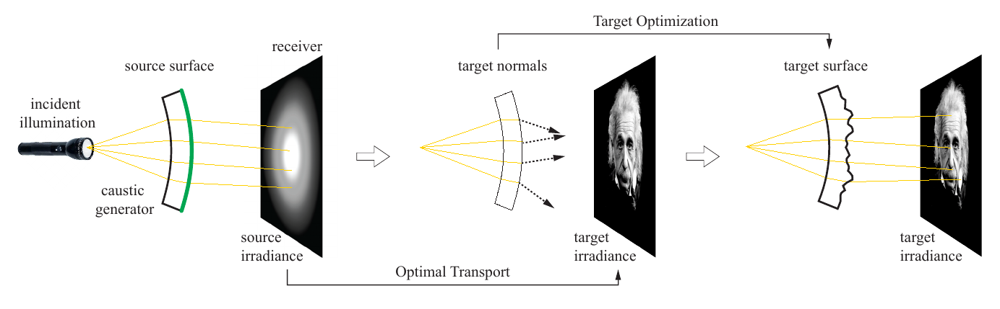
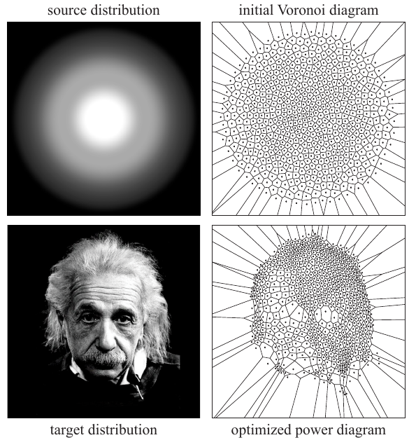
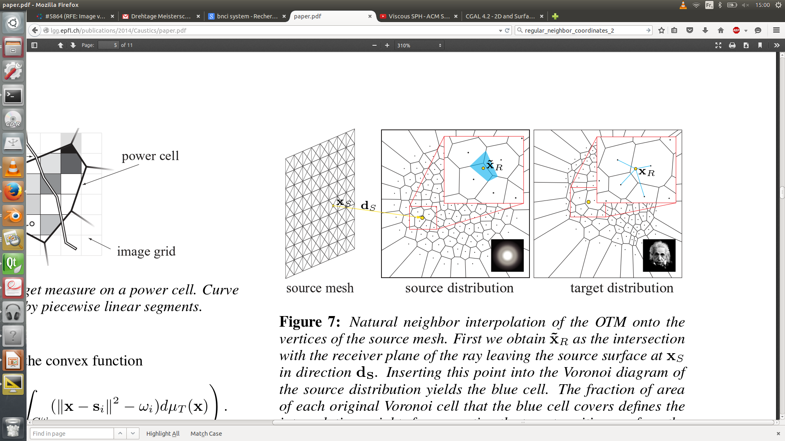
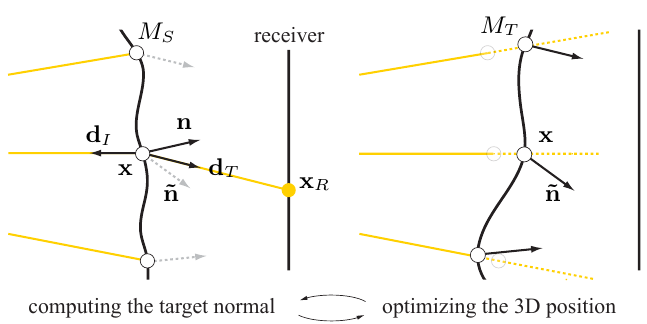
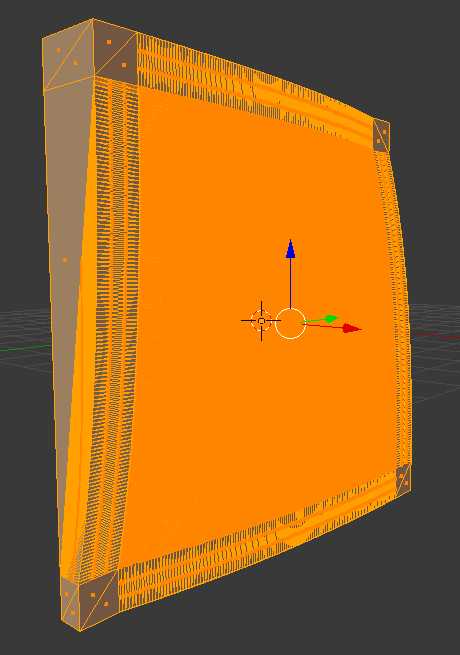
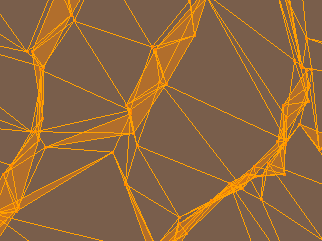
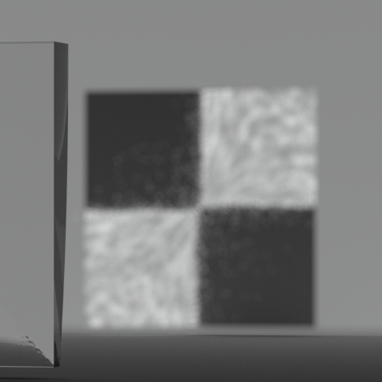
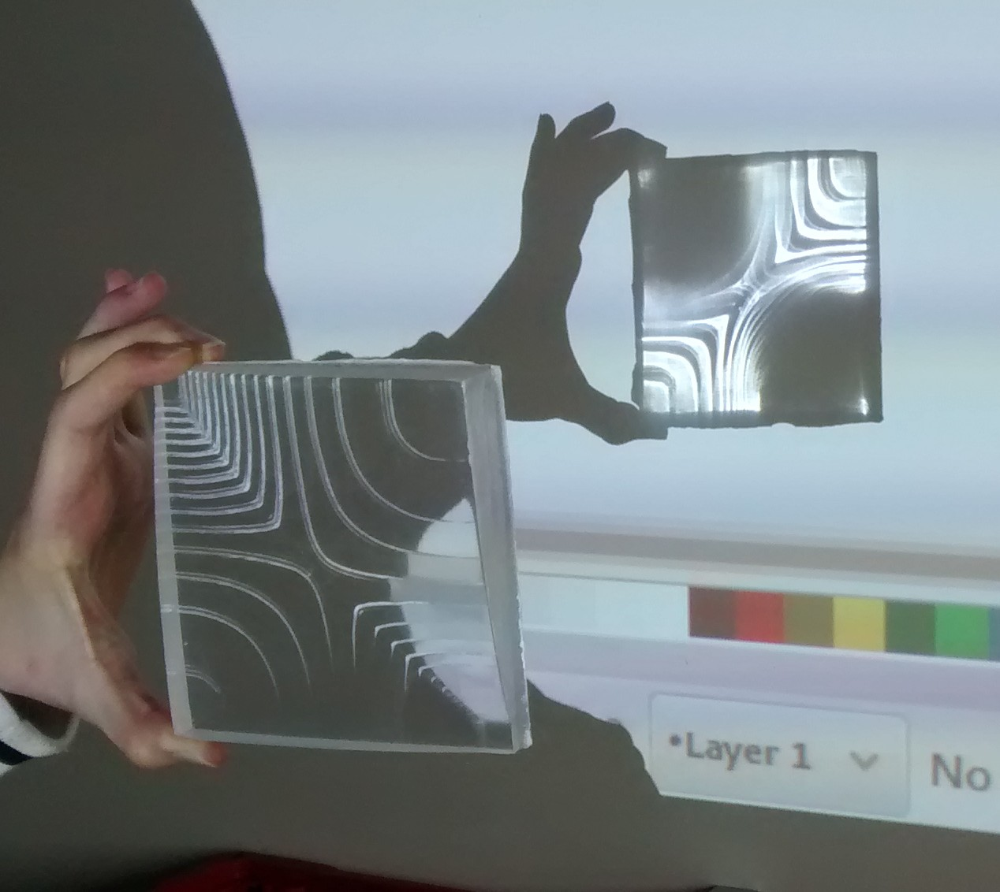

焦散（caustic）是光线穿过不同密度、不同形状介质时，经折射或反射在接收面上形成的迷人光斑图案。本文基于 Schwartzburg 等人的 High-Contrast Computational Caustic Design 思路，用**半离散最优传输（Semi-Discrete OT）**求解焦散映射，并进一步完成曲面优化与实体制作。

相比于其他 Caustic 实现文章，本文主要有两点特色：

1. 首次用最优传输的思路来求解 Caustic Mapping；
2. 可以实现很清晰的焦散效果，并且能实现很高的对比度（High-Contrast）。

## 算法总览

整体流程分为三步：**源辐照度 → 最优传输映射 → 目标曲面优化**。

1. 平行光穿过初始透镜，在接收面上形成简单的源辐照度分布；
2. 用最优传输把源分布映射到目标图像，得到每个采样点所需的目标法向；
3. 迭代优化透镜背面几何，使实际法向逼近目标法向，最终在接收面上复现目标图案。

*图：入射光经 caustic generator 折射到 receiver；OT 建立 source/target irradiance 映射；Target Optimization 生成最终 target surface。*

## 1. 为什么焦散计算可以抽象为 Semi-Discrete OT？

这正是最优传输的经典设定——源分布（入射光）$\mu$ 通过透镜折射映射到目标分布（出射光斑） $\nu = \sum_i m_i \delta_{y_i}$，求透镜表面形状使得光能按 $\nu$ 重新分布，映射 $T$ 由 Snell 折射定律决定。在 Semi-Discrete OT 框架下：

### 图像测度与奇点处理

对于聚集度很高的点或者线，称为 Singular Point 或 Singular Curve。这些奇点在连续密度表示中会出现 Dirac 奇性，需要特殊处理。

将**奇异点/线**（密度无穷大处）从连续测度中分离为离散原子部分，再与剩余连续部分统一处理：

$$
\mu = f(x)\,dx + \sum_k w_k \,\delta_{x_k}
$$

其中 $f(x)$ 是连续密度，$w_k\delta_{x_k}$ 是奇点处的集中质量。

将这些奇点集成到测度中，转化到标准测度形式：

## 2. 源分布：高斯光束

源分布可以认为是一个高斯分布，一束平行光经过球面透镜聚集成一个高斯分布：

$$
E_s \propto \exp\!\left(-\frac{\|x\|^2}{2\sigma^2}\right)
$$

## 3. 焦散问题与 Semi-Discrete OT 的对应关系

为什么可以将焦散计算问题抽象为一个 semi-discrete OT 问题？

直观上，源域上的连续光强分布 $\mu$ 需要被重新分配到接收面上的离散目标点 $y_i$，使每个目标点获得指定质量 $m_i$。半离散 OT 用 Power diagram / Laguerre 单元刻画这种分配关系。

*图：左上 source distribution；右上 initial Voronoi diagram；左下 target distribution；右下 optimized power diagram。*

## 5. Lloyd 初始化

初始采用 **Lloyd 均匀采样**（即 CVT：Centroidal Voronoi Tessellation），通过迭代求 Power 图的权重。

**Lloyd 算法**：对于带密度 $\rho(x)$ 的源分布，迭代更新站点位置：

$$
y_i^{(k+1)} = \frac{\int_{V_i^{(k)}} x \, \rho(x) \, dx}{\int_{V_i^{(k)}} \rho(x) \, dx}
$$

其中 $V_i^{(k)}$ 是第 $k$ 次迭代中站点 $y_i^{(k)}$ 对应的 Voronoi（或 Power）单元。

## 6. 求解最优传输映射

求最优传输的过程采用 Merigot 的算法。

## Merigot 计算半离散 OT 的方法

在半离散 OT 中，常用权重（或势）ψi 定义 Laguerre 单元：

Li(ψ)={x∈Ω|c(x,yi)−ψi≤c(x,yj)−ψj, ∀j}

质量约束为

∫Li(ψ)ρ(x)dx=mi,∑imi=∫Ωρ(x)dx

对应的变分目标（符号按常见文献写法）可写为

E(ψ)=∑iψimi−∫Ωminj(c(x,yj)−ψj)ρ(x)dx

其梯度为残差（下面把记号写清楚，避免与「欧氏面积」混淆）：

∂E∂ψi=mi−μρ(Li(ψ)),μρ(Li):=∫Li(ψ)ρ(x)dx

文中常把 μρ(Li) 简记为 |Li(ψ)|：在 ρ≡1 时它确实是 Lebesgue 测度；一般密度下应理解为**加权质量**，而不是几何上的欧氏面积。

Power diagram 与其对偶三角剖分在迭代过程中不断变化，直至每个 cell 的质量与目标一致：

注意到 $\lambda_p$ 等于初始 CVT 的权重分布。

## 7. Natural Neighbor 插值

OT 映射在离散采样点上给出接收面目标位置，但透镜表面是三角网格，需要把映射插值到每个源网格顶点。

对源面上顶点 $x_S$，沿出射方向 $d_S$ 与接收面求交得 $\tilde{x}_R$。将 $\tilde{x}_R$ 插入源分布的 Voronoi 图，得到新的蓝色 cell；该 cell 从各邻接 Voronoi cell 中"切走"的面积比例，即为插值权重。用这些权重对目标分布中对应 Voronoi cell 的中心做加权，即得顶点 $x_S$ 在接收面上的目标位置 $x_R$。

*图：左为 source mesh；中为 source distribution 上的 Voronoi 插入；右为 target distribution 上的加权插值。*

## 8. 目标曲面优化

OT 只给出接收面上的目标映射，还需反求透镜几何。对每个表面点 $x$，根据 Snell 定律和期望落点 $x_R$ 计算**目标法向** $\tilde{n}$；再沿入射方向优化点的 3D 位置，使实际法向 $n$ 逼近 $\tilde{n}$。两步交替迭代直至收敛。

*图：左 computing the target normal；右 optimizing the 3D position。*

透镜用高密度三角网格离散。初始为规则平板网格，优化后网格在曲率变化剧烈处自动加密：

## 9. 完整计算流程

1. 输入源分布（input source distribution）
2. 预测未修改平板上的接收分布（predict receiver distribution for an unmodified slab）
3. 重采样分布（resample distributions → Lloyd 等）
4. 构造 Power diagram（推荐 CGAL）
5. 求解最优传输映射（solve optimal transport mapping）
6. 对平板顶点做三角映射（triangular map of slab vertices）
7. 用 natural neighbor interpolation 将顶点插值到目标位置 $x_r$
8. 求解透镜表面（推荐 Ceres）
9. 迭代优化
10. 生成 STL 并制作原型

## 10. 制作与实测结果

实体制作流程：

- 由优化后的曲面生成 gcode；
- CNC 铣削：先用 3mm 刀具做粗加工与平面精修；
- 再用 1mm 刀具做精细平面精修。

棋盘格是验证高对比度焦散效果的经典目标。仿真与实物对比如下：

| 仿真 | 实物 |
|:---:|:---:|
|  |  |

## 参考文献

- Schwartzburg, Y. et al., *High-Contrast Computational Caustic Design*, ACM Transactions on Graphics (TOG) 33, 4, 74.
- de Goes, F. et al., *Blue noise through optimal transport*, ACM Transactions on Graphics (TOG) 31, 5, 171.
- Yvinec, M., *2D triangulations*, CGAL User and Reference Manual, 4.3 ed.
- Liu, D. C. and Nocedal, J., *On the limited memory BFGS method for large scale optimization*, Mathematical Programming, 45 (1989), pp. 503–528.
- Agarwal, S. et al., [Ceres Solver](http://ceres-solver.org)
- Gessler, A. et al., [Open Asset Import Library (Assimp)](http://assimp.sourceforge.net/)
