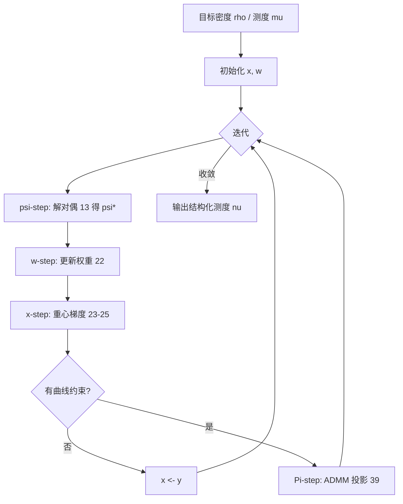

> **论文**：Frédéric de Gournay, Jonas Kahn, Léo Lebrat, Pierre Weiss. [*Optimal Transport Approximation of 2-Dimensional Measures*](https://doi.org/10.1137/18M1193736). SIAM Journal on Imaging Sciences, 12(4), 1563–1595, 2019.  
> **预印本**：[arXiv:1804.08356](https://arxiv.org/abs/1804.08356)

## 概述

给定紧域 $\Omega\subset\mathbb{R}^2$ 上的目标密度 $\rho$（对应测度 $\mu$），希望用**具有结构**的测度 $\nu$ 去逼近它：可以是**离散点**（stippling / halftoning）、**曲线**（curvling）、**线段**（dashing）等。统一目标为

$$
\min_{\nu\in\mathcal{M}} D(\nu,\mu),
\tag{1}
$$

其中 $\mathcal{M}$ 是可容许测度族，$D$ 为测度间距离。本文取 $D=W_2$（二次 Wasserstein 距离），$\Omega=[0,1]^2$。

该框架把多条看似无关的路线统一起来：

| 特例 | $\mathcal{M}$ | 与经典方法的关系 |
| :--- | :--- | :--- |
| **Stippling / 蓝噪声** | $n$ 个 Dirac，可变权重 | Lloyd 算法、de Goes et al. 的 CCVT / 最优传输 halftoning |
| **等权点集** | 权重固定为 $1/n$ | Blue noise through optimal transport [de Goes et al. 2012] |
| **曲线测度** | 弧长参数化、有界曲率/速度/加速度的离散曲线 | Curvling、路径规划、3D 打印喷嘴轨迹 |
| **线段测度** | 分段线性约束 | Dashing 风格渲染 |

**主要贡献**：(i) 交替极小化 + 变度量投影梯度，含 $\psi$/$\mathbf{w}$/$\mathbf{x}$/$\Pi$ 四步；(ii) 稳定化正则 Newton 解半离散 OT 对偶，并给出**全局收敛**保证；(iii) Green 公式加速 Laguerre 单元积分；(iv) 曲线空间上的投影算子（运动学 + 几何约束）；(v) 与静电 halftoning、Lloyd、de Goes 方法的系统对照。

**前置**：[最优传输介绍](2018-05-01-最优传输介绍.md)、[半离散 OT（凸几何）](2020-05-01-基于凸几何的半离散最优传输.md)、[Blue noise through OT](2020-12-12-最优传输计算焦散透镜.md)。

---

## 1. 问题与可容许测度族

### 1.1 目标

$\mu$ 有密度 $\rho:\Omega\to\mathbb{R}_+$，$\int_\Omega \rho=1$。希望 $\nu\in\mathcal{M}$ 在 $W_2$ 意义下最接近 $\mu$，且 $\mathcal{M}$ 编码所需结构。

**有限支撑（点）**：

$$
\mathcal{M}_{f,n}=\left\{\nu(\mathbf{x})=\frac{1}{n}\sum_{i=1}^{n}\delta_{\mathbf{x}[i]},\;\mathbf{x}\in\Omega^n\right\},
\tag{2}
$$

$$
\mathcal{M}_{a,n}=\left\{\nu(\mathbf{x},\mathbf{w})=\sum_{i=1}^{n}\mathbf{w}[i]\,\delta_{\mathbf{x}[i]},\;\mathbf{x}\in\Omega^n,\;\mathbf{w}\in\Delta_{n-1}\right\},
\tag{3}
$$

$\Delta_{n-1}$ 为标准单纯形。解 (1) 且 $\mathcal{M}=\mathcal{M}_{a,n}$ 即**可变权重的量化**；$\mathcal{M}_{f,n}$ 为等权 stippling。

**曲线 / 线段**：$\mathcal{M}$ 为弧长参数化曲线、或固定长度/曲率的离散曲线的 pushforward 测度（§6）。

### 1.2 半离散 $W_2$ 距离

对 $\nu\in\mathcal{M}_{a,n}$，Monge 型传输计划 $T:\Omega\to\{\mathbf{x}[1],\ldots,\mathbf{x}[n]\}$ 满足 $\mu(T^{-1}(\mathbf{x}[i]))=\mathbf{w}[i]$。则

$$
W_2^2(\mu,\nu)=\inf_{T\in\mathcal{T}(\mathbf{x},\mathbf{w})}\int_\Omega \|x-T(x)\|_2^2\,\mathrm{d}\mu(x).
\tag{4}
$$

最优 $T^*$ 描述如何把连续质量 $\mu$ 搬到离散支撑上——这是半离散 OT 的核心。

在结构化测度族 $\mathcal{M}$ 上，本文核心问题为

$$
\inf_{\nu\in\mathcal{M}} W_2^2(\nu,\mu).
\tag{5}
$$

---

## 2. 离散化与总算法框架

### 2.1 用原子测度逼近一般 $\mathcal{M}$

无穷维问题 (5) 用一族原子测度空间逼近：

$$
\mathcal{M}_n=\{\nu(\mathbf{x},\mathbf{w}):\mathbf{x}\in\mathbf{X}_n,\;\mathbf{w}\in\mathbf{W}_n\}\subseteq\mathcal{M}_{a,n},
\tag{6}
$$

$$
\nu(\mathbf{x},\mathbf{w})=\sum_{i=1}^{n}\mathbf{w}[i]\,\delta_{\mathbf{x}[i]}.
\tag{7}
$$

$\mathbf{X}_n\subseteq\Omega^n$ 编码点之间的几何关系（如曲线邻接、速度界），$\mathbf{W}_n\subseteq\Delta_{n-1}$ 编码权重约束。离散化问题为

$$
\inf_{\nu\in\mathcal{M}_n} W_2^2(\nu,\mu),
\tag{8}
$$

在 [Gournay et al. 2018] 中证明：对适当构造的 $(\mathcal{M}_n)$，离散解 $(\nu_n^*)$ 沿子列弱收敛到 (5) 的全局极小元。

**例**：$\mathcal{M}$ 为 $1$-Lipschitz 曲线 pushforward 的测度，可用相邻点间距 $\le 1/n$ 的 $n$ 个 Dirac 逼近，$O(1/n)$ 的 $W_2$ 误差。

离散问题写为

$$
\min_{\mathbf{x}\in\mathbf{X},\,\mathbf{w}\in\mathbf{W}} F(\mathbf{x},\mathbf{w}),
\tag{9}
$$

$$
F(\mathbf{x},\mathbf{w})=\tfrac{1}{2}W_2^2(\nu(\mathbf{x},\mathbf{w}),\mu).
\tag{10}
$$

### 2.2 Algorithm 1：交替投影梯度

```
Algorithm 1  交替投影梯度（最小化 F）

输入: 初始 (x₀, w₀), 迭代次数 N_it
重复 k = 0, …, N_it−1:
  w-step:  w_{k+1} ← argmin_{w∈W} F(x_k, w)        // 常可解析
  x-step:  y_{k+1} ← x_k − s_k Σ_k^{-1} ∇_x F(x_k, w_{k+1})
  Π-step:  x_{k+1} ∈ Π^Σ_k_X(y_{k+1})     // 曲线约束时非平凡；stippling 时 x_{k+1}=y_{k+1}
  // 每步计算 F、∇_x F 时需 ψ-step：给定 (x_k, w_{k+1})，解对偶 (13) 得 ψ*
输出: (x̂, ŵ) = (x_{N_it}, w_{N_it})
```

**变度量投影** $\Pi^{\Sigma_k}_{\mathbf{X}}$：在度量 $\|\mathbf{x}-\mathbf{x}_0\|^2_{\Sigma_k}=\langle\Sigma_k(\mathbf{x}-\mathbf{x}_0),(\mathbf{x}-\mathbf{x}_0)\rangle$ 下投影到 $\mathbf{X}$。$\mathbf{X}$ 非凸时 $\Pi$ 为点集值映射，故 $\mathbf{x}_{k+1}\in\Pi(\cdots)$。

**四大实现难点** → 分别对应 §3–§6：

| 步骤 | 问题 |
| :--- | :--- |
| $\psi$ | 如何高效计算 $F$？ |
| $\mathbf{w}$ | 如何解 $\arg\min_{\mathbf{w}\in\mathbf{W}}F$？ |
| $\mathbf{x}$ | 如何算 $\nabla_{\mathbf{x}}F$ 与度量 $\Sigma_k$？ |
| $\Pi$ | 如何实现曲线空间投影？ |

---

## 3. $\psi$-step：半离散最优传输

### 3.1 假设与 Laguerre 图

**Assumption 1**：$\Omega$ 为紧凸多面体（通常 $[0,1]^2$）；$\mu$ 绝对连续；$\nu$ 为 $n$ 个原子的离散测度。

**Theorem 1**：在 Assumption 1 下，(4) 的最优传输计划 $T^*$ 在 $\mu$-a.e. 意义下唯一。

**Laguerre 单元**（Power 图）：给定点位置 $\mathbf{x}$ 与权重 $\bm{\psi}\in\mathbb{R}^n$，

$$
\mathcal{L}_i(\bm{\psi},\mathbf{x})
=\Bigl\{x\in\Omega:\forall j\neq i,\;
\|x-\mathbf{x}[i]\|^2-\bm{\psi}[i]\le \|x-\mathbf{x}[j]\|^2-\bm{\psi}[j]\Bigr\}.
\tag{11}
$$

$\bm{\psi}=\mathbf{0}$ 时退化为 Voronoi 图。平面 Laguerre 图可在 $O(n\log n)$ 内计算（CGAL）。

**Theorem 2**：存在 $\bm{\psi}^*\in\mathbb{R}^n$ 使最优传输满足

$$
(T^*)^{-1}(\mathbf{x}[i])=\mathcal{L}_i(\bm{\psi}^*,\mathbf{x}).
\tag{12}
$$

即每个站点的质量恰好来自其 Laguerre 单元——与 [Alexandrov / 半离散 OT](2020-05-01-基于凸几何的半离散最优传输.md) 中「支撑高度 $\mathbf{h}$ ↔ 单元体积」对偶一脉相承。

### 3.2 对偶问题

无穷维 (4) 化为有限维**凹**极大化：

$$
W_2(\mu,\nu)=\max_{\bm{\psi}\in\mathbb{R}^n} g(\bm{\psi},\mathbf{x},\mathbf{w}),
\tag{13}
$$

$$
g(\bm{\psi},\mathbf{x},\mathbf{w})
=\sum_{i=1}^{n}\int_{\mathcal{L}_i(\bm{\psi},\mathbf{x})}
\bigl(\|\mathbf{x}[i]-x\|^2-\bm{\psi}[i]\bigr)\,\mathrm{d}\mu(x)
+\sum_{i=1}^{n}\bm{\psi}[i]\,\mathbf{w}[i].
\tag{14}
$$

**Proposition 1**（$g$ 的光滑性）：

- $g$ 对 $\bm{\psi}$ **凹**，梯度 Lipschitz；
- 梯度：

$$
\frac{\partial g}{\partial\bm{\psi}_i}=\mathbf{w}[i]-\mu(\mathcal{L}_i(\bm{\psi},\mathbf{x})).
\tag{15}
$$

- 若 $\rho\in C^1$，则 $g$ 几乎处处二阶可微；$i\neq j$ 时

$$
\frac{\partial^2 g}{\partial\bm{\psi}_i\partial\bm{\psi}_j}
=\int_{\partial\mathcal{L}_i\cap\partial\mathcal{L}_j}\frac{\mathrm{d}\mu(x)}{\|\mathbf{x}[i]-\mathbf{x}[j]\|},
\tag{16}
$$

对角元由闭包关系

$$
\sum_{j=1}^{n}\frac{\partial^2 g}{\partial\bm{\psi}_i\partial\bm{\psi}_j}=0
\tag{17}
$$

确定。Hessian 结构与 [Levy et al. 2015] 半离散 OT 笔记一致：相邻 Laguerre 面共享时非零。

**Proposition 2**：若 $\min\rho>0$ 且站点两两不同，(13) 的极大化子在加常数意义下唯一；极大点附近 $g$ 强凹。

### 3.3 正则化 Newton 法（稳定化）

先前方法 [Aurenhammer et al. 1998; de Goes et al. 2012; Levy et al.] 的收敛常依赖梯度 Lipschitz 常数，而该常数在点共线、密度不均匀时可**任意大**（Remark 1：$n$ 个等距竖直排列点时，Hessian 最大特征值 $\sim 4n$）。

本文采用**正则化 Newton**（类似 Levenberg–Marquardt，但正则参数自动选取）：

$$
\bm{\psi}_{k+1}=\bm{\psi}_k-t_k\bigl(A(\bm{\psi}_k)+\|\nabla_{\bm{\psi}}g(\bm{\psi}_k)\|_2\,\mathrm{Id}\bigr)^{-1}\nabla_{\bm{\psi}}g(\bm{\psi}_k),
\tag{19}
$$

$$
A(\bm{\psi})=
\begin{cases}
\nabla^2_{\bm{\psi}} g(\bm{\psi}) & \text{若 Hessian 在 }\bm{\psi}\text{ 有定义},\\
0 & \text{否则}.
\end{cases}
\tag{20}
$$

在**零均值**子空间上求解以保证唯一性。**Proposition 3**：Wolfe 线搜索下 (19) **全局收敛**到 (13) 的唯一极大点，且局部**二次收敛**——此前结果多为局部收敛 [Levy et al.]。

实践上可结合 [Merigot & Mérigot 2018] 的多尺度初始化；亦可用标准 LM 替代。

### 3.4 Green 公式加速积分

计算 (14)(16) 需对 Laguerre 单元积分。策略：

1. 在规则网格上用双线性/双三次插值离散 $\rho$；
2. 用 **Green 公式**把体积分化为沿 Laguerre 边界的多项式线积分；
3. **预计算**边上各阶矩，之后每次 $\psi$-step 仅做线性组合。

对笛卡尔网格，Laguerre 单元与网格交可解析求交，复杂度从 $O(n_{\text{pixels}})$ 降至约 $O(\sqrt{n_{\text{pixels}}})$，使 $10^5$ 级点集在分钟量级可行。这是本文相对 ibnot [de Goes] 的主要加速来源之一。

---

## 4. $\mathbf{w}$-step 与 $\mathbf{x}$-step

### 4.1 最优权重

子问题

$$
\mathbf{w}^*=\arg\min_{\mathbf{w}\in\mathbf{W}} F(\mathbf{x},\mathbf{w}).
\tag{21}
$$

- **$\mathbf{W}=\{\mathbf{w}_0\}$**（固定权重，如 $1/n$）：$\mathbf{w}^*=\mathbf{w}_0$。
- **$\mathbf{W}=\Delta_{n-1}$**（单纯形）：**Proposition 4** 给出闭式解

$$
\mathbf{w}^*[i]=\mu(\mathcal{L}_i(\mathbf{0},\mathbf{x})),
\tag{22}
$$

即权重等于 **Voronoi 单元**（$\bm{\psi}=0$ 的 Laguerre 单元）内的 $\mu$-质量。直观上：$\bm{\psi}$ 在 (14) 中是质量约束 $\mu(T^{-1}(\mathbf{x}[i]))=\mathbf{w}[i]$ 的 Lagrange 乘子；对 $\mathbf{w}$ 极小化时该约束被拿掉，故 $\bm{\psi}=0$。

### 4.2 站点梯度与变度量

设 $\bm{\psi}^*$ 为 (13) 的极大izer。**Proposition 5**：在 $\rho\in C^0\cap W^{1,1}$、$\mathbf{w}>0$、站点分离时，$F$ 对 $\mathbf{x}$ 为 $C^2$，且

$$
\frac{\partial F(\mathbf{x},\mathbf{w})}{\partial\mathbf{x}[i]}
=\mathbf{w}[i]\,\bigl(\mathbf{x}[i]-\mathbf{b}[i]\bigr),
\tag{23}
$$

其中 $\mathbf{b}[i]$ 为第 $i$ 个 Laguerre 单元的 $\mu$-重心：

$$
\mathbf{b}[i]=\frac{\int_{\mathcal{L}_i(\bm{\psi}^*,\mathbf{x})} x\,\mathrm{d}\mu(x)}
{\int_{\mathcal{L}_i(\bm{\psi}^*,\mathbf{x})}\mathrm{d}\mu(x)}.
\tag{24}
$$

**度量矩阵**（Algorithm 1 中 $\Sigma_k$）：

$$
\Sigma_k=\mathrm{diag}\bigl(\mu(\mathcal{L}_i(\bm{\psi}^*_k,\mathbf{x}_k))\bigr)_{1\le i\le n}.
\tag{25}
$$

**为何这样选？**

1. **Lloyd 算法**：无约束时 $\mathbf{x}_{k+1}=\mathbf{b}(\mathbf{x}_k)$——站点移向各自 Laguerre 单元重心。
2. **交替方向**：固定传输计划（Laguerre 剖分）后，移重心是固定剖分下最优位置。
3. **局部 1-Lipschitz**：临界点处 $\mathbf{x}\mapsto\mathbf{b}(\mathbf{x})$ 局部 1-Lipschitz [Du et al. 2010]，支持步长 $s_k=1$。
4. **拟 Newton**：$\Sigma_k$ 近似 $F$ 对 $\mathbf{x}$ 的 Hessian 对角 [Lebrat et al.]。

实践取 $s_k=1$，无需线搜索即收敛良好。

---

## 5. 与经典方法的关系

### 5.1 Lloyd 算法

Lloyd 算法求解 (5)，$\mathbf{X}=\Omega^n$，$\mathbf{W}=\Delta_{n-1}$。等价于 Algorithm 1，但度量用 **Voronoi 质量**（$\bm{\psi}=0$）：

$$
\Sigma_k=\mathrm{diag}\bigl(\mu(\mathcal{L}_i(\mathbf{0},\mathbf{x}))\bigr).
\tag{26}
$$

与 (25) 的差别：Lloyd **不做** $\psi$-step（不解 OT 对偶），直接用 Voronoi 剖分近似传输；本文每步先求最优 $\bm{\psi}^*$，再更新站点。

### 5.2 Blue noise through optimal transport [de Goes et al. 2012]

等权 stippling：$\mathbf{W}=\{1/n\}$，$\mathbf{X}=\Omega^n$。Algorithm 1 的特例：

$$
\Sigma_k=\frac{1}{n}\,\mathrm{Id},
\tag{27}
$$

并对 $\mathbf{x}$-步做线搜索。de Goes 将 **CCVT（容量约束 Voronoi）** 表述为最优传输 + Power 图上的凸约束极小化，容量约束**精确**满足。详见 [最优传输计算焦散透镜](2020-12-12-最优传输计算焦散透镜.md)。

### 5.3 静电 halftoning（卷积距离）

另一路线用

$$
D(\nu,\mu)=\tfrac{1}{2}\|h\star(\nu-\mu)\|_{L^2(\Omega)}^2,
\tag{28}
$$

$h$ 为光滑核（Maximum Mean Discrepancy / 模糊 SSD）。优化为**一阶**方法 + FMM/NUFFT；高维 $d$ 上复杂度 $O(dn\log n)$，优于 Laguerre 图的 $O(n^{\lceil d/2\rceil})$。

| | 卷积 / 静电 | 最优传输（本文） |
| :--- | :--- | :--- |
| 优化 | 一阶 | 一、二阶混合 |
| 计算核心 | NUFFT / FMM | Laguerre 图 + Green 积分 |
| 维数扩展 | 线性于 $d$ | 2D 高效；高维受限 |
| 2D 速度 | 慢（迭代多） | 快 1–2 个数量级 |
| 视觉质量 | 相当 | 相当 |

**Benchmark**（均匀密度，$2^{10}$–$2^{18}$ 点，31 dB 停止准则）：本文单核实现比 20 核静电 halftoning 快一个数量级以上；非均匀密度（$\rho=2$ 若 $x<0.5$ else $0$）时 ibnot 不收敛，本文仍稳定。

---

## 6. 曲线空间投影（$\Pi$-step）

Stippling 无约束时 $\Pi$ 平凡。对 **curvling / 路径规划**，$\mathbf{X}$ 描述离散曲线上的运动学或几何约束。

### 6.1 离散曲线算子

离散曲线 $\mathbf{x}=(\mathbf{x}[1],\ldots,\mathbf{x}[n])\in\Omega^n$。一阶差分（开/闭曲线）：

$$
(A_1\mathbf{x})[i]=\mathbf{x}[i+1]-\mathbf{x}[i].
$$

二阶差分可取 $A_2=A_1^{\mathsf T}A_1$。

#### 运动学约束（凸）

有界**速度**与**加速度**（车辆模型）：

$$
\|(A_1\mathbf{x})[i]\|_2\le\alpha_1,\qquad
\|(A_2\mathbf{x})[i]\|_2\le\alpha_2.
\tag{29–30}
$$

$$
\mathbf{X}=\{\mathbf{x}\in\Omega^n:\|A_1\mathbf{x}\|_{\infty,2}\le\alpha_1,\;\|A_2\mathbf{x}\|_{\infty,2}\le\alpha_2\}.
\tag{31}
$$

$\|\mathbf{y}\|_{\infty,p}=\sup_i\|\mathbf{y}[i]\|_p$。集合 (31) **凸**。

#### 几何约束（非凸）

**弧长均匀参数化**：$\|(A_1\mathbf{x})[i]\|_2=\alpha_1$，曲线总长 $(n-1)\alpha_1$。

**有界曲率**：在 (32) 成立时，

$$
\|(A_2\mathbf{x})[i]\|_2\le\alpha_2
\quad\Rightarrow\quad
|\theta_i|\le\arccos\!\Bigl(1-\frac{\alpha_2^2}{2\alpha_1^2}\Bigr),
\tag{32–34}
$$

其中 $\theta_i$ 为相邻切向夹角。固定长度 + 有界曲率：

$$
\mathbf{X}=\{\mathbf{x}:\|(A_1\mathbf{x})[i]\|_2=\alpha_1,\;\|A_2\mathbf{x}\|_{\infty,2}\le\alpha_2\}.
\tag{35}
$$

(35) **非凸**——可曲线缩短（投影变短更光滑）或曲线延长（加小环，Fig. 4）。

#### 线性附加约束

闭曲线 $\mathbf{x}[1]=\mathbf{x}[n]$、过指定点、指定均值等：$B\mathbf{x}=\mathbf{b}$。

**统一形式**：

$$
\mathbf{X}=\{\mathbf{x}:A_i\mathbf{x}\in\mathbf{Y}_i,\;1\le i\le m,\;B\mathbf{x}=\mathbf{b}\}.
\tag{37}
$$

权重常取 $\mathbf{W}=\{1/n\}$ 或 $\Delta_{n-1}$。

### 6.2 ADMM 投影

欧氏投影

$$
\Pi_{\mathbf{X}}(\mathbf{z})=\arg\min_{\mathbf{x}\in\mathbf{X}}\tfrac{1}{2}\|\mathbf{x}-\mathbf{z}\|_2^2
\tag{39}
$$

化为分裂形式后用 **ADMM**（Algorithm 2–3）：$\mathbf{y}$-步为逐约束的欧氏投影（速度/加速度球、等长约束等），$\mathbf{x}$-步解带线性约束 $B\mathbf{x}=\mathbf{b}$ 的二次子问题（共轭梯度）。

- **凸约束 (31)**：ADMM 线性收敛 [Boyd et al.]。
- **非凸 (35)**：无完整理论，实践中收敛到 (39) 的临界点。

**多分辨率**：曲线优化时先在下采样曲线上解 (9)，再二分上采样中点作 warm start，显著加速。

---

## 7. 应用

### 7.1 非真实感绘制（NPR）

| 模式 | $\mathcal{M}$ | 效果 |
| :--- | :--- | :--- |
| **Stippling** | 离散点，可变权 | 灰度图用点密度+大小近似 |
| **Curvling** | 有界曲率/速度的曲线 | 单条或多条平滑曲线描绘图像 |
| **Dashing** | 线段测度 | 短线段密度表达明暗 |

Fig. 1 示例：$10^5$ 点 stippling $\approx 202''$；curvling $\approx 313''$；dashing $3.3\times 10^4$ 段 $\approx 237''$（单核）。

### 7.2 高级采样理论

将目标密度投影到满足几何约束的曲线点集，用于**结构化采样模式**设计 [de Gournay et al.]。

### 7.3 路径规划

运动学约束 (31) 直接对应有界速度/加速度的轨迹；在 OT 框架下同时逼近目标「占用」分布。

### 7.4 与焦散 / 透镜设计的联系

半离散 OT + Power 图是 [焦散透镜](2020-12-12-最优传输计算焦散透镜.md)、[多尺度半离散 OT](2020-05-02-多尺度半离散最优传输.md) 的共同计算内核；本文把同一套 $\psi$-step 嵌入**更一般的测度投影**循环，并补上曲线约束的 $\Pi$-step。

---

## 8. 算法流程总览



---

## 9. 小结

| 概念 | 作用 |
| :--- | :--- |
| (1)(5) | 在结构化测度族 $\mathcal{M}$ 上最小化 $W_2^2$ |
| (11)(12) | Laguerre 图 = 半离散 OT 最优传输计划 |
| (13)(14)(15) | 对偶凹极大化；梯度 = 质量残差 |
| (19)(20) | 正则化 Newton；全局 + 局部二次收敛 |
| Green 积分 | 2D 大规模 stippling 的关键加速 |
| (22)(23)(25) | 权重闭式 + 站点移向 Laguerre 重心 |
| (26)(27) | Lloyd 与 de Goes 蓝噪声为特例 |
| (29)–(39) | 曲线速度/曲率约束 + ADMM 投影 |

**局限**：主要针对 **2D**；高维 Laguerre 图代价高。非凸曲线约束下 $\Pi$-step 无全局最优保证。密度需在网格上离散，极非均匀时 $\psi$-step 可能需多尺度初始化。

---

## 参考文献

- de Gournay F., Kahn J., Lebrat L., Weiss P. *Optimal transport approximation of 2-dimensional measures*. SIAM J. Imaging Sci., 12(4), 2019. [DOI](https://doi.org/10.1137/18M1193736) · [arXiv:1804.08356](https://arxiv.org/abs/1804.08356)
- de Goes F., Cohen-Steiner D., Alliez P., Desbrun M. *Blue noise through optimal transport*. ACM TOG (SIGGRAPH), 31(5), 2012. [DOI](https://doi.org/10.1145/2366145.2366190)
- Aurenhammer F., Hoffmann M., Aronov B. *Minkowski-type theorems and least-squares clustering*. Algorithmica, 1998.
- Lévy B., Schwindt C., Steele E. *Laguerre–Minkowski diagrams and applications*. 2015.
- Merigot Q., Mérigot J. *A multiscale approach to optimal transport*. Computer Graphics Forum, 2018.
- Balzer M., Deussen O., et al. *Capacity-constrained point distributions*. CGF, 2009.
- Gournay F., et al. *A projection method for the reconstruction of curves*. 2018.

**相关笔记**：[最优传输介绍](2018-05-01-最优传输介绍.md) · [Monge/Kantorovich](2018-06-01-Monge问题与Kantorivch问题.md) · [半离散 OT](2020-05-01-基于凸几何的半离散最优传输.md) · [多尺度半离散 OT](2020-05-02-多尺度半离散最优传输.md) · [焦散透镜 / 蓝噪声 OT](2020-12-12-最优传输计算焦散透镜.md) · [Sinkhorn](2020-05-12-Sinkhorn算法与DSB.md)
