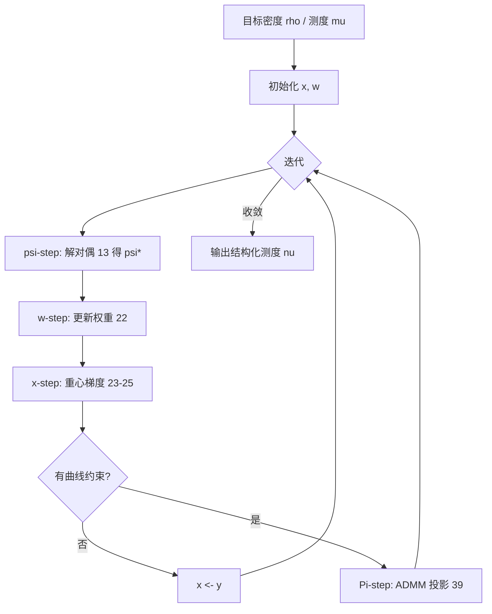

> **论文**：Frédéric de Gournay, Jonas Kahn, Léo Lebrat, Pierre Weiss. [*Optimal Transport Approximation of 2-Dimensional Measures*](https://doi.org/10.1137/18M1193736). SIAM Journal on Imaging Sciences, 12(4), 1563–1595, 2019.  
> **预印本**：[arXiv:1804.08356](https://arxiv.org/abs/1804.08356)

## 概述

给定紧域 $\Omega\subset\mathbb{R}^2$ 上的目标密度 $\rho$（对应测度 $\mu$），希望用**具有结构**的测度 $\nu$ 去逼近它：可以是**离散点**（stippling / halftoning）、**曲线**（curvling）、**线段**（dashing）等。统一目标为

$$
\min_{\nu\in\mathcal{M}} D(\nu,\mu),
\tag{1}
$$

其中 $\mathcal{M}$ 是可容许测度族，$D$ 为测度间距离。本文取 $D=W_2$（二次 Wasserstein 距离），$\Omega=[0,1]^2$。

该框架把多条看似无关的路线统一起来：

| 特例 | $\mathcal{M}$ | 与经典方法的关系 |
| :--- | :--- | :--- |
| **Stippling / 蓝噪声** | $n$ 个 Dirac，可变权重 | Lloyd 算法、de Goes et al. 的 CCVT / 最优传输 halftoning |
| **等权点集** | 权重固定为 $1/n$ | Blue noise through optimal transport [de Goes et al. 2012] |
| **曲线测度** | 弧长参数化、有界曲率/速度/加速度的离散曲线 | Curvling、路径规划、3D 打印喷嘴轨迹 |
| **线段测度** | 分段线性约束 | Dashing 风格渲染 |

**主要贡献**：(i) 交替极小化 + 变度量投影梯度，含 $\psi$/$\mathbf{w}$/$\mathbf{x}$/$\Pi$ 四步；(ii) 稳定化正则 Newton 解半离散 OT 对偶，并给出**全局收敛**保证；(iii) Green 公式加速 Laguerre 单元积分；(iv) 曲线空间上的投影算子（运动学 + 几何约束）；(v) 与静电 halftoning、Lloyd、de Goes 方法的系统对照。

**前置**：[最优传输介绍](2018-05-01-最优传输介绍.md)、[半离散 OT（凸几何）](2020-05-01-基于凸几何的半离散最优传输.md)、[Blue noise through OT](2020-12-12-最优传输计算焦散透镜.md)。

---

## 1. 问题与可容许测度族

### 1.1 目标

$\mu$ 有密度 $\rho:\Omega\to\mathbb{R}_+$，$\int_\Omega \rho=1$。希望 $\nu\in\mathcal{M}$ 在 $W_2$ 意义下最接近 $\mu$，且 $\mathcal{M}$ 编码所需结构。

**有限支撑（点）**：

$$
\mathcal{M}_{f,n}=\left\{\nu(\mathbf{x})=\frac{1}{n}\sum_{i=1}^{n}\delta_{\mathbf{x}[i]},\;\mathbf{x}\in\Omega^n\right\},
\tag{2}
$$

$$
\mathcal{M}_{a,n}=\left\{\nu(\mathbf{x},\mathbf{w})=\sum_{i=1}^{n}\mathbf{w}[i]\,\delta_{\mathbf{x}[i]},\;\mathbf{x}\in\Omega^n,\;\mathbf{w}\in\Delta_{n-1}\right\},
\tag{3}
$$

$\Delta_{n-1}$ 为标准单纯形。解 (1) 且 $\mathcal{M}=\mathcal{M}_{a,n}$ 即**可变权重的量化**；$\mathcal{M}_{f,n}$ 为等权 stippling。

**曲线 / 线段**：$\mathcal{M}$ 为弧长参数化曲线、或固定长度/曲率的离散曲线的 pushforward 测度（§6）。

### 1.2 半离散 $W_2$ 距离

对 $\nu\in\mathcal{M}_{a,n}$，Monge 型传输计划 $T:\Omega\to\{\mathbf{x}[1],\ldots,\mathbf{x}[n]\}$ 满足 $\mu(T^{-1}(\mathbf{x}[i]))=\mathbf{w}[i]$。则

$$
W_2^2(\mu,\nu)=\inf_{T\in\mathcal{T}(\mathbf{x},\mathbf{w})}\int_\Omega \|x-T(x)\|_2^2\,\mathrm{d}\mu(x).
\tag{4}
$$

最优 $T^*$ 描述如何把连续质量 $\mu$ 搬到离散支撑上——这是半离散 OT 的核心。

在结构化测度族 $\mathcal{M}$ 上，本文核心问题为

$$
\inf_{\nu\in\mathcal{M}} W_2^2(\nu,\mu).
\tag{5}
$$

### 1.3 相关工作与应用背景

问题 (1) 最早由 [Chauffert et al. 2017] 以**卷积核距离**形式提出；本文用 $W_2$ 重述并大幅扩展。同一框架覆盖：

| 领域 | 典型 $\mathcal{M}$ | 文献线索 |
| :--- | :--- | :--- |
| 金融 | 离散支撑 | Pages & Wilbertz 2012 |
| 计算机图形 | 点 / 曲线 / 线段 | stippling、stroke-based rendering |
| 采样理论 | 有界速度/加速度轨迹 | MRI 压缩采样 [Boyer et al. 2016] |
| 设施选址 / 网络 | 空间分布网络 | Gastner & Newman 2006 |
| 3D 打印 / 雕刻 | 连续喷嘴/激光轨迹 | Chen et al. 2017 |

**曲线逼近**在 NPR、TSP art、线雕 3D 打印中常见，但以往多无显式优化表述；本文将 curvling 纳入 (5)。

**线段测度（dashing）**：用短线段密度表达明暗，是 stippling 的结构化推广。

---

## 2. 离散化与总算法框架

### 2.1 用原子测度逼近一般 $\mathcal{M}$

无穷维问题 (5) 用一族原子测度空间逼近：

$$
\mathcal{M}_n=\{\nu(\mathbf{x},\mathbf{w}):\mathbf{x}\in\mathbf{X}_n,\;\mathbf{w}\in\mathbf{W}_n\}\subseteq\mathcal{M}_{a,n},
\tag{6}
$$

$$
\nu(\mathbf{x},\mathbf{w})=\sum_{i=1}^{n}\mathbf{w}[i]\,\delta_{\mathbf{x}[i]}.
\tag{7}
$$

$\mathbf{X}_n\subseteq\Omega^n$ 编码点之间的几何关系（如曲线邻接、速度界），$\mathbf{W}_n\subseteq\Delta_{n-1}$ 编码权重约束。离散化问题为

$$
\inf_{\nu\in\mathcal{M}_n} W_2^2(\nu,\mu),
\tag{8}
$$

在 [Gournay et al. 2018] 中证明：对适当构造的 $(\mathcal{M}_n)$，离散解 $(\nu_n^*)$ 沿子列弱收敛到 (5) 的全局极小元。

**例**：$\mathcal{M}$ 为 $1$-Lipschitz 曲线 pushforward 的测度，可用相邻点间距 $\le 1/n$ 的 $n$ 个 Dirac 逼近，$O(1/n)$ 的 $W_2$ 误差。

离散问题写为

$$
\min_{\mathbf{x}\in\mathbf{X},\,\mathbf{w}\in\mathbf{W}} F(\mathbf{x},\mathbf{w}),
\tag{9}
$$

$$
F(\mathbf{x},\mathbf{w})=\tfrac{1}{2}W_2^2(\nu(\mathbf{x},\mathbf{w}),\mu).
\tag{10}
$$

### 2.2 Algorithm 1：交替投影梯度

**变度量投影**（论文 §2.2）：

$$
\Pi^{\Sigma_k}_{\mathbf{X}}(\mathbf{x}_0)
:=\arg\min_{\mathbf{x}\in\mathbf{X}}\|\mathbf{x}-\mathbf{x}_0\|^2_{\Sigma_k},
\qquad
\|\mathbf{x}-\mathbf{x}_0\|^2_{\Sigma_k}
=\langle\Sigma_k(\mathbf{x}-\mathbf{x}_0),(\mathbf{x}-\mathbf{x}_0)\rangle.
$$

$\mathbf{X}$ 非凸时 $\Pi$ 为**点集值**映射，故 $\mathbf{x}$-步写 $\mathbf{x}_{k+1}\in\Pi(\cdots)$ 而非 $=$。

```
Algorithm 1  交替投影梯度（最小化 (1) / (9)）

Oracle: 给定 (x, w)，通过 ψ-step 计算 F(x,w)、∇_x F
输入:  初始 x₀, 目标测度 μ, 迭代次数 N_it
输出:  (x̂, ŵ) 近似 (9) 的解

for k = 0, …, N_it−1:
  w-step:  w_{k+1} ← argmin_{w∈W} F(x_k, w)              ▷ 解析
  选正定矩阵 Σ_k、步长 s_k
  x-step:  y_{k+1} ← x_k − s_k Σ_k^{-1} ∇_x F(x_k, w_{k+1})
  Π-step:  x_{k+1} ∈ Π^{Σ_k}_X(y_{k+1})
end for
x̂ ← x_{N_it},  ŵ ← w_{N_it}
```

**无约束 stippling / halftoning** 时 $\Pi$-步平凡：$\mathbf{x}_{k+1}=\mathbf{y}_{k+1}$。

**五大实现难点**：

| 步骤 | 问题 |
| :--- | :--- |
| $\psi$ | 如何高效计算 $F$？ |
| $\mathbf{w}$ | 如何解 $\arg\min_{\mathbf{w}\in\mathbf{W}}F$？ |
| $\mathbf{x}$ | 如何算 $\nabla_{\mathbf{x}}F$ 与度量 $\Sigma_k$？ |
| $\Pi$ | 如何实现曲线空间投影？ |
| 加速 | 多尺度、warm start 等 |

---

## 3. $\psi$-step：半离散最优传输

### 3.1 假设与 Laguerre 图

**Assumption 1**：$\Omega$ 为紧凸多面体（通常 $[0,1]^2$）；$\mu$ 绝对连续；$\nu$ 为 $n$ 个原子的离散测度。

**Theorem 1**：在 Assumption 1 下，(4) 的最优传输计划 $T^*$ 在 $\mu$-a.e. 意义下唯一。

**Laguerre 单元**（Power 图）：给定点位置 $\mathbf{x}$ 与权重 $\bm{\psi}\in\mathbb{R}^n$，

$$
\mathcal{L}_i(\bm{\psi},\mathbf{x})
=\Bigl\{x\in\Omega:\forall j\neq i,\;
\|x-\mathbf{x}[i]\|^2-\bm{\psi}[i]\le \|x-\mathbf{x}[j]\|^2-\bm{\psi}[j]\Bigr\}.
\tag{11}
$$

$\bm{\psi}=\mathbf{0}$ 时退化为 Voronoi 图。平面 Laguerre 图可在 $O(n\log n)$ 内计算（CGAL）。

**Theorem 2**：存在 $\bm{\psi}^*\in\mathbb{R}^n$ 使最优传输满足

$$
(T^*)^{-1}(\mathbf{x}[i])=\mathcal{L}_i(\bm{\psi}^*,\mathbf{x}).
\tag{12}
$$

即每个站点的质量恰好来自其 Laguerre 单元——与 [Alexandrov / 半离散 OT](2020-05-01-基于凸几何的半离散最优传输.md) 中「支撑高度 $\mathbf{h}$ ↔ 单元体积」对偶一脉相承。

### 3.2 对偶问题

无穷维 (4) 化为有限维**凹**极大化：

$$
W_2(\mu,\nu)=\max_{\bm{\psi}\in\mathbb{R}^n} g(\bm{\psi},\mathbf{x},\mathbf{w}),
\tag{13}
$$

$$
g(\bm{\psi},\mathbf{x},\mathbf{w})
=\sum_{i=1}^{n}\int_{\mathcal{L}_i(\bm{\psi},\mathbf{x})}
\bigl(\|\mathbf{x}[i]-x\|^2-\bm{\psi}[i]\bigr)\,\mathrm{d}\mu(x)
+\sum_{i=1}^{n}\bm{\psi}[i]\,\mathbf{w}[i].
\tag{14}
$$

**Proposition 1**（$g$ 的光滑性）：

- $g$ 对 $\bm{\psi}$ **凹**，梯度 Lipschitz；
- 梯度：

$$
\frac{\partial g}{\partial\bm{\psi}_i}=\mathbf{w}[i]-\mu(\mathcal{L}_i(\bm{\psi},\mathbf{x})).
\tag{15}
$$

- 若 $\rho\in C^1$，则 $g$ 几乎处处二阶可微；$i\neq j$ 时

$$
\frac{\partial^2 g}{\partial\bm{\psi}_i\partial\bm{\psi}_j}
=\int_{\partial\mathcal{L}_i\cap\partial\mathcal{L}_j}\frac{\mathrm{d}\mu(x)}{\|\mathbf{x}[i]-\mathbf{x}[j]\|},
\tag{16}
$$

对角元由闭包关系

$$
\sum_{j=1}^{n}\frac{\partial^2 g}{\partial\bm{\psi}_i\partial\bm{\psi}_j}=0
\tag{17}
$$

确定。Hessian 结构与 [Levy et al. 2015] 半离散 OT 笔记一致：相邻 Laguerre 面共享时非零。由 Gershgorin 圆盘定理，Hessian 最小特征值有下界 $-n\eta\|\rho\|_\infty\mathrm{diam}(\Omega)$，其中 $\eta=1/\min_{i\neq j}\|\mathbf{x}[i]-\mathbf{x}[j]\|$。

**二阶可微性的证明要点**：若某 Laguerre 单元测度为零，则其为线段或点。在一般位置假设下，点 $x$ 满足至少 3 个等式

$$
\|x-\mathbf{x}[i]\|^2-\bm{\psi}[i]=\|x-\mathbf{x}[j_k]\|^2-\bm{\psi}[j_k],
\tag{18}
$$

使 $\mathcal{L}_i$ 退化为单点；满足 (18) 的 $\bm{\psi}$ 集合余维 $\ge 1$，故几乎处处二阶可微。

**Lipschitz 梯度界**（命题 1 证明）：Laguerre 边界随 $\bm{\psi}$ 线性移动，速率 $\le\eta$。对单位方向 $\Delta$，

$$
\bigl|\mu(\mathcal{L}_i(\bm{\psi}+t\Delta,\mathbf{x}))-\mu(\mathcal{L}_i(\bm{\psi},\mathbf{x}))\bigr|
\le t(n-1)\|\rho\|_\infty\eta\,\mathrm{diam}(\Omega),
$$

求和得 $\|\nabla_{\bm{\psi}}g(\bm{\psi}+t\Delta)-\nabla_{\bm{\psi}}g(\bm{\psi})\|_2\le t n^{3/2}\|\rho\|_\infty\eta\,\mathrm{diam}(\Omega)$（偏悲观）。

**Proposition 2**：若 $\min\rho>0$ 且站点两两不同，(13) 的极大化子在加常数意义下唯一；极大点附近 $g$ 强凹。

**一阶 vs 二阶方法的困境** [Kitagawa et al.; Levy]：一阶法依赖梯度 Lipschitz 常数；二阶法依赖 $g$ 的 Hölder 正则性，且要求 Laguerre 单元质量不消失。故早期迭代宜一阶 + 好初值，接近最优解后切换二阶。LM / trust-region 的全局 $C^2$ 假设此处不满足。

### 3.3 正则化 Newton 法（稳定化）

先前方法 [Aurenhammer et al. 1998; de Goes et al. 2012; Levy et al.] 的收敛常依赖梯度 Lipschitz 常数，而该常数在点共线、密度不均匀时可**任意大**。

**Remark 1（高 Lipschitz 常数）**：$\mu$ 为 $\Omega=[0,1]^2$ 上均匀测度，$n$ 个点等距竖直排列 $\mathbf{x}[i]=(\tfrac12,\tfrac{1+2i}{2n})$。Hessian 为 1D Neumann Laplacian 的倍数，最大特征值 $\sim 4n$，Lipschitz 常数随 $n$ 爆炸——**曲线逼近密度时典型**。

本文采用**正则化 Newton**（类似 Levenberg–Marquardt，但正则参数自动选取）：

$$
\bm{\psi}_{k+1}=\bm{\psi}_k-t_k\bigl(A(\bm{\psi}_k)+\|\nabla_{\bm{\psi}}g(\bm{\psi}_k)\|_2\,\mathrm{Id}\bigr)^{-1}\nabla_{\bm{\psi}}g(\bm{\psi}_k),
\tag{19}
$$

$$
A(\bm{\psi})=
\begin{cases}
\nabla^2_{\bm{\psi}} g(\bm{\psi}) & \text{若 Hessian 在 }\bm{\psi}\text{ 有定义},\\
0 & \text{否则}.
\end{cases}
\tag{20}
$$

在**零均值**子空间上求解以保证唯一性。**Proposition 3**：Wolfe 线搜索下 (19) **全局收敛**到 (13) 的唯一极大点，且局部**二次收敛**——此前结果多为局部收敛 [Levy et al.]。

**设计 rationale**：去掉 $\|\nabla g\|\mathrm{Id}$ 则为纯 Newton；加入后，远离最优解时 $\|\nabla g\|$ 大 → 接近梯度下降；接近最优时 $\|\nabla g\|\to 0$ → 接近阻尼 Newton。

实践上可结合 [Merigot 2011] 的多尺度初始化；亦可用标准 LM $\bm{\psi}_{k+1}=\bm{\psi}_k-(A+c_k\mathrm{Id})^{-1}\nabla g$，$c_k$ 由 Wolfe 准则调节，收敛率相近。

### 3.4 Green 公式加速积分

计算 (14)(16) 需对 Laguerre 单元积分。策略：

1. 在规则网格上用双线性/双三次插值离散 $\rho$；
2. 用 **Green 公式**把体积分化为沿 Laguerre 边界的多项式线积分；
3. **预计算**边上各阶矩，之后每次 $\psi$-step 仅做线性组合。

对笛卡尔网格，Laguerre 单元与网格交可解析求交，复杂度从 $O(n_{\text{pixels}})$ 降至约 $O(\sqrt{n_{\text{pixels}}})$，使 $10^5$ 级点集在分钟量级可行。这是本文相对 ibnot [de Goes] 的主要加速来源之一。

---

## 4. $\mathbf{w}$-step 与 $\mathbf{x}$-step

### 4.1 最优权重

子问题

$$
\mathbf{w}^*=\arg\min_{\mathbf{w}\in\mathbf{W}} F(\mathbf{x},\mathbf{w}).
\tag{21}
$$

#### 4.1.1 完全约束 $\mathbf{w}$

$\mathbf{W}=\{\mathbf{w}_0\}$（singleton，如等权 $1/n$）：$\mathbf{w}^*=\mathbf{w}_0$。

#### 4.1.2 单纯形上无约束极小化

$\mathbf{W}=\Delta_{n-1}$：**Proposition 4** 给出闭式解

$$
\mathbf{w}^*[i]=\mu(\mathcal{L}_i(\mathbf{0},\mathbf{x})),
\tag{22}
$$

即权重等于 **Voronoi 单元**（$\bm{\psi}=0$ 的 Laguerre 单元）内的 $\mu$-质量。

**证明要点**：在 (14) 中 $\bm{\psi}$ 是质量约束

$$
\mu\bigl(T^{-1}(\mathbf{x}[i])\bigr)=\mathbf{w}[i]
$$

的 Lagrange 乘子；对 $\mathbf{w}$ 极小化时该约束被移除，故可取 $\bm{\psi}=\mathbf{0}$。

### 4.2 站点梯度与变度量

设 $\bm{\psi}^*$ 为 (13) 的极大izer。**Proposition 5**：在 $\rho\in C^0\cap W^{1,1}$、$\mathbf{w}>0$、站点分离时，$F$ 对 $\mathbf{x}$ 为 $C^2$，且

$$
\frac{\partial F(\mathbf{x},\mathbf{w})}{\partial\mathbf{x}[i]}
=\mathbf{w}[i]\,\bigl(\mathbf{x}[i]-\mathbf{b}[i]\bigr),
\tag{23}
$$

其中 $\mathbf{b}[i]$ 为第 $i$ 个 Laguerre 单元的 $\mu$-重心：

$$
\mathbf{b}[i]=\frac{\int_{\mathcal{L}_i(\bm{\psi}^*,\mathbf{x})} x\,\mathrm{d}\mu(x)}
{\int_{\mathcal{L}_i(\bm{\psi}^*,\mathbf{x})}\mathrm{d}\mu(x)}.
\tag{24}
$$

**度量矩阵**（Algorithm 1 中 $\Sigma_k$）：

$$
\Sigma_k=\mathrm{diag}\bigl(\mu(\mathcal{L}_i(\bm{\psi}^*_k,\mathbf{x}_k))\bigr)_{1\le i\le n}.
\tag{25}
$$

**为何这样选？**

1. **Lloyd 算法**：无约束时 $\mathbf{x}_{k+1}=\mathbf{b}(\mathbf{x}_k)$——站点移向各自 Laguerre 单元重心。
2. **交替方向**：固定传输计划（Laguerre 剖分）后，移重心是固定剖分下最优位置。
3. **局部 1-Lipschitz**：临界点处 $\mathbf{x}\mapsto\mathbf{b}(\mathbf{x})$ 局部 1-Lipschitz [Du et al. 2010]，支持步长 $s_k=1$。
4. **拟 Newton**：$\Sigma_k$ 近似 $F$ 对 $\mathbf{x}$ 的 Hessian 对角 [Lebrat et al. / de Gournay et al. 2018]——$\Sigma_k$ 第 $i$ 对角元等于 $H_{\mathbf{x}\mathbf{x}}[F]$ 第 $i$ 行系数之和。

保证收敛的保守选取：$s_k$ 满足 **Wolfe 条件**。鉴于上述性质，实践取 $s_k=1$，无需线搜索即收敛良好（附录 A 给出局部理论支撑）。

---

## 5. 与经典方法的关系

### 5.1 Lloyd 算法

Lloyd 算法求解 (5)，$\mathbf{X}=\Omega^n$，$\mathbf{W}=\Delta_{n-1}$。等价于 Algorithm 1，但度量用 **Voronoi 质量**（$\bm{\psi}=0$）：

$$
\Sigma_k=\mathrm{diag}\bigl(\mu(\mathcal{L}_i(\mathbf{0},\mathbf{x}))\bigr).
\tag{26}
$$

与 (25) 的差别：Lloyd **不做** $\psi$-step（不解 OT 对偶），直接用 Voronoi 剖分近似传输；本文每步先求最优 $\bm{\psi}^*$，再更新站点。

### 5.2 Blue noise through optimal transport [de Goes et al. 2012]

> **论文**：Fernando de Goes, Katherine Breeden, Victor Ostromoukhov, Mathieu Desbrun. [*Blue Noise through Optimal Transport*](https://doi.org/10.1145/2366145.2366190). ACM TOG 31(6), SIGGRAPH Asia 2012.  
> **项目页**：[geometry.caltech.edu/BlueNoise](https://geometry.caltech.edu/BlueNoise/) · PDF：[Caltech](https://www.geometry.caltech.edu/pubs/dGBOD12.pdf)

本节是本文最直接的前驱：两边都在做「用半离散 $W_2$ / Power 图把连续密度 $\rho$ 凝聚成点集」。de Gournay et al. 2019 把 de Goes 的蓝噪声视为等权特例，并推广到可变权重、曲线、线段等结构化测度。

#### 5.2.1 问题设定：蓝噪声 = 容量约束 + 最优传输

给定域 $\mathcal{D}$ 与正密度 $\rho$（墨水分布），蓝噪声采样把连续墨水**凝聚**成 $n$ 个 Dirac。de Goes 用三条要求刻画：

| 要求 | 含义 |
| :--- | :--- |
| **A. 均匀采样（容量）** | 每点承载等量墨水：$m_i=\int_{V_i}\rho=m\equiv\frac{1}{n}\int_{\mathcal{D}}\rho$ |
| **B. 最优传输** | 把 $\rho$ 搬到点集的总代价最小 |
| **C. 局部不规则** | 避免六角晶格 / Moire 伪影 |

传输代价（对任意剖分 $\mathcal{V}=\{V_i\}$）为

$$
E(X,\mathcal{V})=\sum_{i}\int_{V_i}\rho(x)\,\|x-x_i\|_2^2\,\mathrm{d}x.
\tag{27a}
$$

[Aurenhammer et al. 1998] 证明：在容量约束下极小化 $E$ 的最优剖分必为 **Power 图**（权重 Voronoi / Laguerre）。因此不必在全体剖分中搜索，可限制到加权点集 $(X,W)$ 的 Power 单元 $V_i^w$。这与本文把半离散 $W_2$ 写成 Laguerre 图上的对偶问题完全同构。

#### 5.2.2 变分形式

带 Lagrange 乘子的约束极小化可化为对标量泛函求驻点：

$$
F(X,W)=E(X,W)-\sum_{i} w_i\bigl(m_i-m\bigr).
\tag{27b}
$$

关键性质（与本文对偶 / 梯度公式同构）：

- **固定 $X$，对 $W$**：Hessian $=-\Delta_{w,\rho}$（加权 Laplacian）→ **凹极大化**；Newton 解稀疏 Poisson 系统即可精确满足容量约束（残差可达 $10^{-12}$）。这对应本文的 $\psi$-step（对偶变量与 Power 权重一一对应）。
- **固定 $W$，对 $X$**：

$$
\nabla_{x_i}F=2\,m_i\,(x_i-b_i),\qquad
b_i=\frac{1}{m_i}\int_{V_i^w}x\,\rho(x)\,\mathrm{d}x.
\tag{27c}
$$

临界点要求 $x_i=b_i$，即 **centroidal Power diagram**。这正是本文梯度 (23)–(24) 的等权版本（$\mathbf{w}[i]=m_i=1/n$）。

算法：**交替**「对 $X$ 做带线搜索的梯度下降」与「对 $W$ 做 Newton 投影到容量可行集」；Power 图由 CGAL 更新。另加局部规则性检测 + jitter，实现要求 C。

#### 5.2.3 与本文（de Gournay et al. 2019）的对照

两边「很像」，是因为共享同一半离散 OT 内核；差别在**可容许测度族**与**数值细节**。

| | **BNOT** (de Goes 2012) | **本文** (de Gournay 2019) |
| :--- | :--- | :--- |
| 目标 | 蓝噪声点采样 / stippling | 结构化测度逼近：点、曲线、线段… |
| 测度族 $\mathcal{M}$ | 等权 Dirac：$\mathbf{w}=1/n$ | $\mathcal{M}_{f,n}$ / $\mathcal{M}_{a,n}$ / 曲线 / dashing |
| 距离 | 半离散 $W_2$（Power 图） | 同左，显式写为 $W_2^2(\nu,\mu)$ |
| 对偶变量 | Power 权重 $w_i$ | Laguerre 势 $\psi$（等价） |
| 站点更新 | $\nabla_{x_i}F\propto m_i(x_i-b_i)$ + 线搜索 | (23)–(25)，$\Sigma_k$ 拟 Newton，常取 $s_k=1$ |
| 权重 | 固定等权；用 $W$ 只为**精确容量** | 可选可变 $\mathbf{w}$（$w$-step） |
| 约束投影 $\Pi$ | 无（点自由）+ 局部 jitter | 曲线运动学 / 几何约束的 ADMM |
| 积分加速 | 像素–单元精确求交 | Green 公式（本文相对 ibnot 的主要加速） |
| $\psi$-步稳定 | Newton + Armijo | **正则化 Newton**，非均匀密度下仍收敛（ibnot 常失败） |
| 在本文中的位置 | Algorithm 1 + $\mathbf{W}=\{1/n\}$ 的特例 | 见度量 (27) |

等权 stippling 时，本文度量退化为

$$
\Sigma_k=\mathrm{diag}\bigl(\mu(\mathcal{L}_i(\bm{\phi}^*(\mathbf{x}),\mathbf{x}))\bigr)=\frac{1}{n}\,\mathrm{Id},
\tag{27}
$$

并对 $\mathbf{x}$-步做线搜索时与 BNOT 一致；本文经验上 $s_k=1$ 已够，可省去每次线搜索中反复解对偶的开销。

**一句话**：BNOT =「等权半离散 OT + Power 图上的容量精确约束」；本文 =「同一 OT 内核 + 更广的 $\mathcal{M}$（可变权 / 曲线）+ 更稳的 Newton + Green 加速」。把 BNOT 看成本文框架在 $\mathcal{M}_{f,n}$ 上的历史特例，最贴切。

相关讨论亦可对照 [最优传输计算焦散透镜](2020-12-12-最优传输计算焦散透镜.md)（同一 Power / 半离散 OT 计算内核在透镜设计中的应用）。

### 5.3 静电 halftoning（卷积距离）

另一路线用

$$
D(\nu,\mu)=\tfrac{1}{2}\|h\star(\nu-\mu)\|_{L^2(\Omega)}^2,
\tag{28}
$$

$h$ 为光滑核（Maximum Mean Discrepancy / 模糊 SSD）。在适当假设下 $W_2$ 与 (28) **强等价** [Peyré 2016]，但数值行为差异大。优化为**一阶**方法 + FMM/NUFFT；高维 $d$ 上复杂度 $O(dn\log n)$，优于 Laguerre 图的 $O(n^{\lceil d/2\rceil})$。

| | 卷积 / 静电 | 最优传输（本文） |
| :--- | :--- | :--- |
| 优化 | 一阶 | 一、二阶混合 |
| 计算核心 | NUFFT / FMM | Laguerre 图 + Green 积分 |
| 维数扩展 | 线性于 $d$ | 2D 高效；高维受限 |
| 2D 速度 | 慢（迭代多） | 快 1–2 个数量级 |
| 视觉质量 | 相当 | 相当 |

#### 5.3.1 停止准则与 Benchmark

**停止准则** [Schmaltz et al.]：原图与 stipple 图经高斯卷积后的 SNR；高斯标准差 $\sigma=1/\sqrt{n}$（典型点间距）。所有 benchmark 在 **31 dB** 停止。Fig. 3 展示 8 / 25 / 31 / 34 dB 的迭代演化。

**Table 2**（均匀密度，$1024\times 1024$ 像素，Poisson 初始化；格式：秒 — 迭代次数）：

| # pts | Electro 20核 | Electro BB 20核 | ibnot 1核 | 本文 1核 |
| :---: | :---: | :---: | :---: | :---: |
| $2^{10}$ | 130.3 — 317 | 34.4 — 84 | 131.47 — 15 | **4.03 — 19** |
| $2^{12}$ | 293.9 — 637 | 47.8 — 104 | 267.59 — 22 | **10.86 — 19** |
| $2^{14}$ | 783.5 — 1306 | 106.3 — 177 | 344.77 — 17 | **47.90 — 21** |
| $2^{16}$ | 4568.5 — 3286 | 569.2 — 410 | 1208.45 — 20 | **252.24 — 26** |
| $2^{18}$ | TL | 12125.2 — 1103 | 5633.68 — 23 | **1136.51 — 21** |

ibnot 与本文迭代次数相近，但 Green 积分使**每步**更快（积分复杂度约从 $n_{\text{pix}}$ 降至 $\sqrt{n_{\text{pix}}}$）。

**Table 3**（非均匀密度 $\rho=2$ 若 $x<0.5$ else $0$）：

| # pts | Electro BB 20核 | ibnot 1核 | 本文 1核 |
| :---: | :---: | :---: | :---: |
| $2^{10}$ | 40.2 — 99 | NC | **4.34 — 24** |
| $2^{14}$ | 177.7 — 282 | NC | **79.73 — 27** |
| $2^{18}$ | 39546.1 — 2022 | NC | **1315.01 — 24** |

ibnot 因 $\psi$-步 Hessian 不定常**不收敛**；本文正则 Newton 仍稳定。静电法迭代次数随点数增长，OT 法约恒定 $\sim 20$ 次。

---

## 6. 曲线空间投影（$\Pi$-step）

Stippling 无约束时 $\Pi$ 平凡。对 **curvling / 路径规划**，$\mathbf{X}$ 描述离散曲线上的运动学或几何约束。

### 6.1 离散曲线算子

离散曲线 $\mathbf{x}=(\mathbf{x}[1],\ldots,\mathbf{x}[n])\in\Omega^n$。**一阶差分**算子（开/闭曲线）：

$$
A_1^a:\mathbf{x}\mapsto
\begin{pmatrix}\mathbf{x}[2]-\mathbf{x}[1]\\ \vdots\\ \mathbf{x}[n]-\mathbf{x}[n-1]\\ \mathbf{x}[1]-\mathbf{x}[n]\end{pmatrix},
\qquad
A_1^b:\mathbf{x}\mapsto
\begin{pmatrix}\mathbf{x}[2]-\mathbf{x}[1]\\ \mathbf{x}[3]-\mathbf{x}[2]\\ \vdots\\ \mathbf{x}[n]-\mathbf{x}[n-1]\end{pmatrix}.
$$

下文 $A_1$ 泛指二者之一。**二阶差分**可取 $A_2=A_1^{\mathsf T}A_1$。

#### 运动学约束（凸）

有界**速度**与**加速度**（车辆模型）：

$$
\|(A_1\mathbf{x})[i]\|_2\le\alpha_1,\quad\forall i,
\tag{29}
$$

$$
\|(A_2\mathbf{x})[i]\|_2\le\alpha_2,\quad\forall i.
\tag{30}
$$

$$
\mathbf{X}=\{\mathbf{x}\in\Omega^n:\|A_1\mathbf{x}\|_{\infty,2}\le\alpha_1,\;\|A_2\mathbf{x}\|_{\infty,2}\le\alpha_2\}.
\tag{31}
$$

$\|\mathbf{y}\|_{\infty,p}=\sup_i\|\mathbf{y}[i]\|_p$。集合 (31) **凸**。

#### 几何约束（非凸）

连续情形：弧长参数曲线 $s:[0,T]\to\mathbb{R}^2$，$\|\dot{s}\|=1$，长度 $T$，曲率 $\kappa(t)=\|\ddot{s}(t)\|$。

**弧长均匀参数化**（离散）：

$$
\|(A_1\mathbf{x})[i]\|_2=\alpha_1,\quad\forall i.
\tag{32}
$$

曲线总长 $(n-1)\alpha_1$。

**有界曲率**：

$$
\|(A_2\mathbf{x})[i]\|_2\le\alpha_2,\quad\forall i.
\tag{33}
$$

在 (32) 成立时，对 $2\le i\le n-1$ 有推导

$$
\|(A_2\mathbf{x})[i]\|_2^2
=2\alpha_1^2\bigl(1-\cos\theta_i\bigr),
$$

其中 $\theta_i=\angle(\mathbf{x}[i]-\mathbf{x}[i-1],\,\mathbf{x}[i+1]-\mathbf{x}[i])$。故 (32)+(33) 蕴含

$$
|\theta_i|\le\arccos\!\Bigl(1-\frac{\alpha_2^2}{2\alpha_1^2}\Bigr).
\tag{34}
$$

固定长度 + 有界曲率：

$$
\mathbf{X}=\{\mathbf{x}\in\Omega^n:\|(A_1\mathbf{x})[i]\|_2=\alpha_1,\;\|A_2\mathbf{x}\|_{\infty,2}\le\alpha_2\}.
\tag{35}
$$

(35) **非凸**——可曲线缩短（投影变短更光滑）或曲线延长（加小环，Fig. 4）。

#### 线性附加约束

闭曲线、过指定点、指定均值等：

$$
B\mathbf{x}=\mathbf{b},
\qquad B\in\mathbb{R}^{p\times 2n},\;\mathbf{b}\in\mathbb{R}^p.
\tag{36}
$$

**统一形式**：

$$
\mathbf{X}=\{\mathbf{x}:A_i\mathbf{x}\in\mathbf{Y}_i,\;1\le i\le m,\;B\mathbf{x}=\mathbf{b}\}.
\tag{37}
$$

例如有界速度 (29) 对应

$$
\mathbf{Y}_1=\{\mathbf{y}\in\mathbb{R}^{n\times 2}:\|\mathbf{y}[i]\|_2\le\alpha_1,\;\forall i\}.
\tag{38}
$$

权重常取 $\mathbf{W}=\{1/n\}$ 或 $\Delta_{n-1}$。

### 6.2 ADMM 投影

**欧氏投影**（Algorithm 1 的 $\Pi$-步在无变度量时，或 ADMM 子问题）：

$$
\Pi_{\mathbf{X}}(\mathbf{z})
=\arg\min_{\substack{A_k\mathbf{x}\in\mathbf{Y}_k\\ B\mathbf{x}=\mathbf{b}}}
\tfrac{1}{2}\|\mathbf{x}-\mathbf{z}\|_2^2.
\tag{39}
$$

$\mathbf{X}$ 凸时解唯一；非凸时可能多解，算法求 (39) 的临界点。

**ADMM 分裂**：预条件 $\gamma_i>0$，堆叠

$$
A=\begin{pmatrix}\gamma_1 A_1\\ \vdots\\ \gamma_m A_m\end{pmatrix},\quad
\mathbf{y}=\begin{pmatrix}\mathbf{y}_1\\ \vdots\\ \mathbf{y}_m\end{pmatrix},\quad
\mathbf{Y}=\gamma_1\mathbf{Y}_1\times\cdots\times\gamma_m\mathbf{Y}_m.
\tag{40–41}
$$

(39) 等价于

$$
\min_{\substack{B\mathbf{x}=\mathbf{b}\\ A\mathbf{x}=\mathbf{y}\\ \mathbf{y}\in\mathbf{Y}}}
\tfrac{1}{2}\|\mathbf{x}-\mathbf{z}\|_2^2
=\min_{A\mathbf{x}=\mathbf{y}} f_1(\mathbf{x})+f_2(\mathbf{y}),
\tag{42}
$$

其中 $f_1(\mathbf{x})=\tfrac12\|\mathbf{x}-\mathbf{z}\|_2^2+\iota_{\mathbf{L}}(\mathbf{x})$，$\mathbf{L}=\{\mathbf{x}:B\mathbf{x}=\mathbf{b}\}$；$f_2(\mathbf{y})=\iota_{\mathbf{Y}}(\mathbf{y})$，

$$
\iota_{\mathbf{Y}}(\mathbf{y})=
\begin{cases}0 & \mathbf{y}\in\mathbf{Y},\\ +\infty & \text{否则}.\end{cases}
\tag{43}
$$

**Algorithm 2**（通用 ADMM）：交替更新 $\mathbf{y}$、$\mathbf{x}$、对偶 $\bm{\lambda}$，罚参数 $\beta>0$。

**Algorithm 3**（专用于 (39)）：

```
输入: 待投影 z, 初值 (x₀, λ₀), 矩阵 A,B, 投影 Π_Y, β>0
while 未收敛:
  y_{k+1} ← Π_Y(A x_k + λ_k)
  解线性系统:
    [ β A^T A + I   B^T ] [ x_{k+1} ]   [ β A^T(y_{k+1}−λ_k) + z ]
    [     B          0  ] [   μ     ] = [              b              ]
  λ_{k+1} ← λ_k + A x_{k+1} − y_{k+1}
```

$\mathbf{x}$-步用**共轭梯度**求解。$\mathbf{y}$-步为逐约束欧氏投影（球约束、等长约束等）。

- **凸 (31)**：ADMM 线性收敛 [Giselsson & Boyd]。
- **非凸 (35)**：理论开放 [Li & Pong]，实践中收敛到临界点。

**参数选取**：$\gamma_i=\|A_i\|_2$（谱范数）经验稳定；$\beta$ 手动调一次后固定。

### 6.3 投影算例（Fig. 4）

将猫轮廓（红）投影到蓝约束曲线集：中图——更短长度 + 有界曲率（简化变光滑）；右图——更长长度 + 有界曲率（加环保持形状）。

### 6.4 多分辨率实现

曲线优化时**不全点同时优化**：先在降采样曲线上解 (9)，再二分上采样中点作 warm start。实现用**二进尺度**：相邻采样间插中点；分辨率间权重除以 2。

---

## 7. 应用

### 7.1 非真实感绘制（NPR）

| 模式 | $\mathcal{M}$ | 效果 |
| :--- | :--- | :--- |
| **Stippling** | 离散点，可变权 | 灰度图用点密度+大小近似 |
| **Curvling** | 有界曲率/速度的曲线 | 单条或多条平滑曲线描绘图像 |
| **Dashing** | 线段测度 | 短线段密度表达明暗 |

Fig. 1：$10^5$ 点 stippling $\approx 202''$；curvling $\approx 313''$；dashing $3.3\times 10^4$ 段 $\approx 237''$（单核，随机均匀初始化）。

#### 7.1.1 灰度 Curvling

先 stippling 再曲线投影。Fig. 5：256k 点，$\approx 10'$；不同曲线长度 $l$、$l/3$、$l/12$ 控制细节层次。

#### 7.1.2 彩色图像

给定向量密度 $\rho=(\rho_R,\rho_G,\rho_B):\Omega\to[0,1]^3$：

1. 构造灰度 $\bar{\rho}=(\rho_R+\rho_G+\rho_B)/3$；
2. 用 Algorithm 1 将 $\bar{\rho}$ 投影到 $\mathcal{M}$，得站点 $\mathbf{x}$；
3. 每点颜色取 $\rho(\mathbf{x}[i])/\bar{\rho}(\mathbf{x}[i])$（饱和色）。

$$
\bar{\rho}=\frac{\rho_R+\rho_G+\rho_B}{3}.
\tag{44}
$$

Fig. 6：512k 点彩色 curvling，$\approx 24'$。

#### 7.1.3 动态 / 视频

首帧从任意初值投影；后续帧以前一帧结果为初值，保证帧间点/曲线连续性（补充材料含视频）。

### 7.2 路径规划

#### 7.2.1 无人机监视（Videodrone）

费城犯罪数据 [OpenDataPhilly] 加权成密度 $\mu$（Fig. 7a）。在 (31) 运动学约束下最小化 (1)，轨迹更常经过高危区；附加**有界偏航角速度**、**指定时刻经过充电点**（ autonomy）。8k 离散点，30'' 优化。轨迹分色表示多次充电往返。

#### 7.2.2 激光雕刻

Fig. 8：激光沿连续轨迹灼烧木材复现风景。同一技术可推广至 3D 打印喷嘴与料流轨迹 [Chen et al.]。

#### 7.2.3 MRI 压缩采样

MRI 在 Fourier 域沿**有界速度、有界加速度**曲线采样 [Boyer et al. 2016]，恰为 (31) 约束集。理论建议按稀疏结构在 wavelet 域的分布 $\mu$ 随机采样，物理上不可行 → 用本文将 $\mu$ **投影**到可执行轨迹。

采样得 $\mathbf{y}[i]=\hat{u}(\mathbf{x}[i])$，重建解

$$
\min_{v,\,v|_{\mathbf{x}}=\mathbf{y}}
\tfrac{1}{2}\|\hat{v}(\mathbf{x})-\mathbf{y}\|_2^2+\lambda\|\Psi u\|_1,
\tag{45}
$$

$\Psi$ 为冗余小波等稀疏变换。Fig. 9：目标密度、生成轨迹（约为全 Fourier 采样 1/4）、真图与重建图。

### 7.3 高级采样理论

将目标密度投影到满足几何约束的曲线点集，用于**结构化采样模式**设计 [de Gournay et al.]。

### 7.4 与焦散 / 透镜设计的联系

半离散 OT + Power 图是 [焦散透镜](2020-12-12-最优传输计算焦散透镜.md)、[多尺度半离散 OT](2020-05-02-多尺度半离散最优传输.md) 的共同计算内核；本文把同一套 $\psi$-step 嵌入**更一般的测度投影**循环，并补上曲线约束的 $\Pi$-step。

---

## 8. 算法流程总览



---

## 9. 小结

| 概念 | 作用 |
| :--- | :--- |
| (1)(5) | 在结构化测度族 $\mathcal{M}$ 上最小化 $W_2^2$ |
| (11)(12) | Laguerre 图 = 半离散 OT 最优传输计划 |
| (13)(14)(15) | 对偶凹极大化；梯度 = 质量残差 |
| (19)(20) | 正则化 Newton；全局 + 局部二次收敛 |
| Green 积分 | 2D 大规模 stippling 的关键加速 |
| (22)(23)(25) | 权重闭式 + 站点移向 Laguerre 重心 |
| (26)(27) | Lloyd 与 de Goes 蓝噪声为特例 |
| (27a)–(27c) | BNOT：容量约束 + Power 图 OT；与本文半离散内核同构 |
| (29)–(43) | 曲线约束、ADMM 分裂与投影 |
| (44)(45) | 彩色 curvling、MRI 重建 |
| (46) | Algorithm 1 局部收敛条件 |

**局限**：主要针对 **2D**；高维 Laguerre 图代价高。非凸曲线约束下 $\Pi$-step 无全局最优保证。密度需在网格上离散，极非均匀时 $\psi$-step 可能需多尺度初始化。

---

## 10. 附录 A：Algorithm 1 的收敛性

**Theorem 3** [Nesterov]：设 $\mathbf{X}\subset\mathbb{R}^n$ 闭凸，$\Sigma_k=\Sigma\succ 0$ 常数，$F\in C^1$ 且

$$
\forall(\mathbf{x}_1,\mathbf{x}_2),\quad
\|\nabla F(\mathbf{x}_1)-\nabla F(\mathbf{x}_2)\|_{\Sigma^{-1}}
\le L\|\mathbf{x}_1-\mathbf{x}_2\|_{\Sigma},
\tag{46}
$$

且 $\mathbf{X}$ 紧或 $F$ 强制。则步长 $s_k=1/L$ 时 Algorithm 1 收敛到 $F$ 的临界点。

**应用限制**：定理要求 $\Sigma_k$ 常数 → 权重 $\mathbf{w}$ 需预先固定。由 (23)，$\nabla_{\mathbf{x}}F$ 的 Lipschitz 常数含 $\min_{i\neq j}\|\mathbf{x}[i]-\mathbf{x}[j]\|^{-1}$，**不能**对 $\mathbf{x}$ 一致有界 → 仅有**局部**理论。

**无 $\Pi$-步**（$\mathbf{X}=\Omega^n$）：临界点处梯度 1-Lipschitz（centroidal tessellation）[Du et al. Prop. 6.3]，故 $s_k=1$、$\Sigma_k$ 如 (25) 时可在 $\mathbf{x}^*$ 邻域内证明收敛。邻域大小依赖最优 Laguerre 剖分几何；数值上数百次随机初始化均收敛到视觉良好的驻点。

---

## 参考文献

- de Gournay F., Kahn J., Lebrat L., Weiss P. *Optimal transport approximation of 2-dimensional measures*. SIAM J. Imaging Sci., 12(4), 2019. [DOI](https://doi.org/10.1137/18M1193736) · [arXiv:1804.08356](https://arxiv.org/abs/1804.08356)
- de Goes F., Breeden K., Ostromoukhov V., Desbrun M. *Blue noise through optimal transport*. ACM TOG (SIGGRAPH Asia), 31(6), 2012. [DOI](https://doi.org/10.1145/2366145.2366190) · [项目页](https://geometry.caltech.edu/BlueNoise/)
- de Goes F., Cohen-Steiner D., Alliez P., Desbrun M. *An optimal transport approach to robust reconstruction and simplification of 2d shapes*. CGF, 30(5), 2011.- Aurenhammer F., Hoffmann M., Aronov B. *Minkowski-type theorems and least-squares clustering*. Algorithmica, 1998.
- Lévy B., Schwindt C., Steele E. *Laguerre–Minkowski diagrams and applications*. 2015.
- Merigot Q., Mérigot J. *A multiscale approach to optimal transport*. Computer Graphics Forum, 2018.
- Balzer M., Deussen O., et al. *Capacity-constrained point distributions*. CGF, 2009.
- Gournay F., et al. *A projection method on measures sets*. Constructive Approximation, 45(1), 2017. [Chauffert et al. — 卷积距离版 (1)]
- Boyer C., Chauffert N., Ciuciu P., Kahn J., Weiss P. *On the generation of sampling schemes for MRI*. SIAM J. Imaging Sci., 9(4), 2016.
- de Gournay F., Kahn J., Lebrat L. *Differentiation and regularity of semi-discrete optimal transport*. arXiv:1803.00827, 2018. [式 (23) 梯度来源]
- Du Q., Faber V., Gunzburger M. *Centroidal Voronoi tessellations*. SIAM Review, 41(4), 1999.
- Kitagawa J., Mérigot Q., Thibert B. *A Newton algorithm for semi-discrete optimal transport*. arXiv:1603.05579, 2016.
- Merigot Q. *A multiscale approach to optimal transport*. CGF, 30(5), 2011.
- Polyak R. A. *Regularized Newton method for unconstrained convex optimization*. Math. Program., 120(1), 2009.
- Schmaltz C., Gwosdek P., Bruhn A., Weickert J. *Electrostatic halftoning*. CGF, 29, 2010.

**相关笔记**：[最优传输介绍](2018-05-01-最优传输介绍.md) · [Monge/Kantorovich](2018-06-01-Monge问题与Kantorivch问题.md) · [半离散 OT](2020-05-01-基于凸几何的半离散最优传输.md) · [多尺度半离散 OT](2020-05-02-多尺度半离散最优传输.md) · [焦散透镜 / 蓝噪声 OT](2020-12-12-最优传输计算焦散透镜.md) · [Sinkhorn](2020-05-12-Sinkhorn算法与DSB.md)
