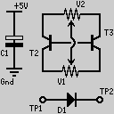
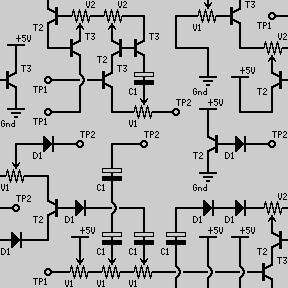
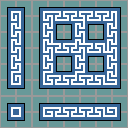
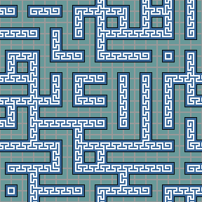

波函数塌缩（Wave Function Collapse, WFC）是由 Maxim Gumin 于 2016 年提出的一种**基于约束的程序化内容生成算法**。它从一张小样本图像出发，自动生成保持局部连续性的更大图像，广泛用于游戏关卡设计、纹理生成、城市规划等领域。

---

## 1. 核心思想

### 1.1 量子力学的类比

算法的命名直接来源于量子力学：

- **"波函数"**：每个格子处于所有可能状态的**叠加态**（superposition）
- **"观测/塌缩"**：选择一个格子，将其固定为某个确定状态
- **"约束传播"**：一次塌缩会影响相邻格子的可能性，像波纹一样扩散

类比薛定谔的猫：在"观测"之前，每个格子同时是"所有可能的 tile"；观测之后，它"塌缩"为确定的某一种 tile，而相邻格子的可能性也因此被约束。

### 1.2 一句话概括

> **从小的样本图像生成更大的图像，保证局部连续性。**

---

## 2. 两种模型

WFC 有两种主要的变体：

### 2.1 Tiled Model（拼贴模型）

将样本图像切分为若干个小块（tiles），分析它们之间的邻接关系，然后基于这些关系生成新图像。

- **输入**：一张样本图像 + tiles 的切分信息
- **规则来源**：手工指定或自动提取 tiles 之间的邻接关系
- **优点**：概念简单，可控性强
- **缺点**：需要预先定义 tiles 和邻接规则

### 2.2 Overlapping Model（重叠模型）

不预定义 tiles，而是从样本图像中提取 $N \times N$ 的**像素模式（patterns）**，分析这些模式之间的重叠关系。

- **输入**：仅一张样本图像
- **规则来源**：自动从样本中提取模式及其允许的重叠方式
- **优点**：完全自动化，不需要手工定义规则
- **缺点**：模式数量可能很多，计算开销更大

---

## 3. Tiled Model 的完整流程

### 3.1 样例展示

样本图：



生成结果：



样本图 2：



生成结果：



### 3.2 步骤一：图片切分

将输入图像切分成 $N \times N$ 个小块（tiles），作为基本单元。

```matlab
imgList{N*N} = [];
pixNum = size(img, 1) / N;
for i = 1:N
    for j = 1:N
        imgList{sub2ind([N,N],i,j)} = ...
            img(((i-1)*pixNum+1):(i*pixNum), ...
                ((j-1)*pixNum+1):(j*pixNum), :);
    end
end
```

每个 tile 被赋予一个权重（通常就是它在样本中出现的频率）。

### 3.3 步骤二：构建邻接表（Adjacency Rules）

计算哪些 tile 可以在上下左右四个方向相邻。这是 WFC 的**核心数据**。

**判定标准**：使用**边缘像素的均方根误差（RMSE）**：

$$\text{RMSE} = \sqrt{\frac{1}{k} \sum_{i=1}^{k} (p_i^{\text{left}} - p_i^{\text{right}})^2}$$

其中 $k$ 是边缘像素数量。RMSE < 阈值（如 40）则认为可以连接。

```matlab
for i = 1:N*N
    for j = 1:N*N
        % 检测右连接：i 的右边缘 vs j 的左边缘
        rErr = sqrt(mean((rImgC - rImgS).^2));
        if rErr < err
            adjList(i).right = [adjList(i).right, j];
        end
        % 类似地检测左、上、下连接...
    end
end
```

**结果**：每条规则形如 "tile $i$ 的右边可以接 tile $j$"，存储在邻接表中。

### 3.4 步骤三：波函数塌缩生成

这是 WFC 算法的核心——不再是简单的从左到右、从上到下填充，而是使用**最小熵优先**的策略。

#### 初始化

创建一个 $R \times C$ 的网格，每个格子初始状态为**所有 tile 的叠加态**：

$$\text{cell}(i,j).\text{possibilities} = \{1, 2, \ldots, N^2\}$$

#### 主循环

```
function WFC(rows, cols, adjList, weights):
    // 初始化：每个格子可以是任何 tile
    grid = Grid(rows, cols)
    for each cell in grid:
        cell.possibilities = {ALL_TILES}

    while 存在未塌缩的格子:
        // 1. 选择熵最低的未塌缩格子
        cell = FindLowestEntropyCell(grid)

        // 2. 塌缩：根据权重随机选择一个 tile
        chosen = WeightedRandom(cell.possibilities, weights)
        cell.possibilities = {chosen}  // 塌缩为单态

        // 3. 约束传播
        if NOT Propagate(cell, grid, adjList):
            return FAILURE  // 矛盾！某格子可能性清零

    return grid  // 成功！
```

#### 熵的计算

WFC 使用**加权香农熵**来选择塌缩顺序：

$$H = \log\left(\sum_{i} w_i\right) - \frac{\sum_{i} w_i \log w_i}{\sum_{i} w_i}$$

其中 $w_i$ 是 tile $i$ 的权重（频率），求和遍历该格子当前所有可能 tile。

**为什么选熵最低的格子？** 熵最低意味着可能性最少，约束最强。优先塌缩最受限的格子可以**尽早发现矛盾**，避免在大量工作之后才失败。

为避免熵相同的格子产生随机性，实际中通常加一个微小的随机扰动：$H' = H + \epsilon \cdot \text{random}()$。

#### 约束传播（Constraint Propagation）

这是 WFC 的**精髓**。塌缩一个格子后，其相邻格子的可能性可能被削减。

```
function Propagate(startCell, grid, adjList):
    stack = [startCell]

    while stack 非空:
        cell = stack.pop()

        for each neighbor of cell (上下左右):
            // 获取 neighbor 在 cell 方向上允许的 tile
            allowed = GetAllowedTiles(cell, neighbor, adjList)

            // 从 neighbor 的可能性中剔除不允许的 tile
            removed = neighbor.possibilities - allowed

            if removed 非空:
                neighbor.possibilities -= removed
                if neighbor.possibilities 为空:
                    return false  // 矛盾！
                stack.push(neighbor)  // 继续传播

    return true
```

> **直觉**：塌缩一个格子就像推倒多米诺骨牌的第一块——约束沿着网格传播，每个被影响的格子进一步影响它的邻居，直到所有约束都被满足或发现矛盾。

### 3.5 步骤四：图像合成

根据最终塌缩结果，将 tile 拼接为输出图像。

```matlab
newImg = zeros([rows*pixNum, cols*pixNum, size(img,3)]);
for i = 1:rows
    for j = 1:cols
        newImg(((i-1)*pixNum+1):(i*pixNum), ...
               ((j-1)*pixNum+1):(j*pixNum), :) = ...
            imgList{indMat(i,j)};
    end
end
```

---

## 4. 矛盾处理：回溯 vs 重启

当约束传播导致某个格子的可能性清零时，算法遇到了**矛盾**。有两种处理方式：

| 策略 | 方法 | 优点 | 缺点 |
|:---|:---|:---|:---|
| **重启（Restart）** | 放弃当前结果，从头开始 | 实现简单 | 可能多次失败，浪费计算 |
| **回溯（Backtracking）** | 撤销上一次塌缩决策，尝试其他 tile | 更高成功率 | 实现复杂，可能指数级回溯 |

原始 WFC 实现使用**重启策略**。实践表明，对于合理设计的邻接规则，重启几次后几乎总能成功。但对于约束很紧的问题，回溯更可靠。

---

## 5. WFC 与其他程序化生成方法的对比

| 方法 | 原理 | 输入 | 优点 | 缺点 |
|:---|:---|:---|:---|:---|
| **WFC** | 约束传播 + 熵塌缩 | 一张样本图 | 自动学习规则，局部连续性好 | 全局结构不可控 |
| **L-System** | 字符串重写规则 | 产生式规则 | 适合植物/分形结构 | 规则需手工设计 |
| **噪声函数（Perlin/Simplex）** | 梯度噪声插值 | 参数 | 连续平滑，计算快 | 不适合结构化内容 |
| **Cellular Automata** | 局部邻域规则 | 规则 + 初始状态 | 简单直观，适合洞穴生成 | 规则需手工设计 |
| **Voronoi 图** | 最近邻划分 | 种子点 | 天然分区效果 | 生成结果模式单一 |

WFC 的独特优势在于**数据驱动**——只需提供一张样本，算法自动提取规则。不需要手工编写规则，也不需要机器学习训练。

---

## 6. 应用场景

| 领域 | 用途 | 示例 |
|:---|:---|:---|
| **游戏关卡设计** | 生成城市布局、地牢、平台关卡 | Caves of Qud, Townscaper |
| **纹理合成** | 从小样本生成大纹理贴图 | 砖墙、地板、布料纹理 |
| **3D 场景生成** | 生成建筑群、城市街道 | 城市天际线生成 |
| **像素艺术** | 扩展精灵图（sprite sheet） | 角色动画帧生成 |
| **音乐生成** | 基于模式的音乐序列生成 | — |

---

## 7. 实现/代码资源

- **原始实现（C#）**：[mxgmn/WaveFunctionCollapse](https://github.com/mxgmn/WaveFunctionCollapse)
- **Python 实现**：[eyalrd/WaveFunctionCollapse](https://github.com/eyalrd/WaveFunctionCollapse)
- **Web 在线演示**：[wavefunctioncollapse.com](https://wavefunctioncollapse.com/)

## 参考

- Gumin, M. (2016). *WaveFunctionCollapse*. GitHub repository.
- Karth, I., & Smith, A. M. (2017). "WaveFunctionCollapse is constraint solving in the wild." *Proceedings of the 12th International Conference on the Foundations of Digital Games*.
- Heaton, R. (2018). "The Wavefunction Collapse Algorithm explained very clearly." [Blog post](https://robertheaton.com/2018/12/17/wavefunction-collapse-algorithm/).
