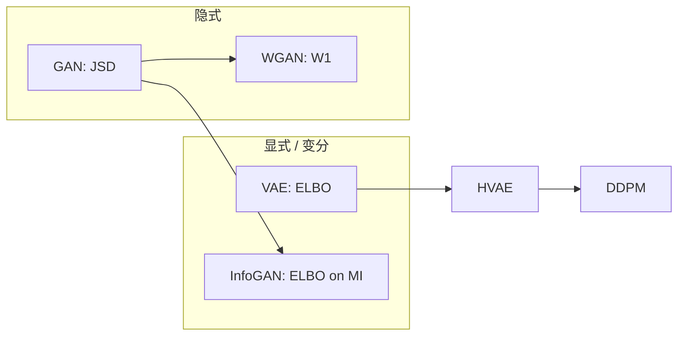

> **原始 GAN**：Goodfellow et al., *Generative Adversarial Nets*, NeurIPS 2014.  
> **WGAN**：Arjovsky et al., *Wasserstein GAN*, ICML 2017.  
> **InfoGAN**：Chen et al., *InfoGAN: Interpretable Representation Learning by Information Maximizing GANs*, NeurIPS 2016.

全文路线：**§1–3** GAN / WGAN 对抗训练 → **§4** 变分推断（ELBO、KL 恒等式、通式互信息界）→ **§5** InfoGAN 实例化。ELBO 与 VAE 训练细节见 [生成模型与 VAE]().

---

## 1. 原始 GAN

### 1.1 架构与目标

- **生成器** $G_\theta(z)$：噪声 $z \sim p_z(z)$（通常 $\mathcal{N}(0,I)$）→ 假样本 $\tilde{x}$；
- **判别器** $D_\phi(x)$：输出 $x$ 为真的「概率」（sigmoid 输出）。

**极小–极大博弈**：

$$
\min_G \max_D V(D,G)
= \mathbb{E}_{x \sim p_{\mathrm{data}}}\!\left[\log D(x)\right]
+ \mathbb{E}_{z \sim p_z}\!\left[\log\bigl(1 - D(G(z))\bigr)\right].
\tag{1.1}
$$

- $D$：最大化 $V$ → 真样本 $\log D(x)\to 1$，假样本 $\log(1-D(G(z)))\to 0$；
- $G$：最小化 $V$ → 使 $D(G(z))\to 1$，欺骗 $D$。

实践常改为生成器最大化 $\mathbb{E}_z[\log D(G(z))]$，避免早期 $\log(1-D(G(z)))$ 梯度饱和。

记 $p_g$ 为 $G(z)$ 的推前分布。最优判别器（对固定 $G$）：

$$
D^*(x) = \frac{p_{\mathrm{data}}(x)}{p_{\mathrm{data}}(x) + p_g(x)}.
\tag{1.2}
$$

代入 (1.1) 得

$$
V(D^*, G) = 2\,\mathrm{JSD}\!\left(p_{\mathrm{data}} \,\|\, p_g\right) - \log 4,
\tag{1.3}
$$

其中 $\mathrm{JSD}(P\|Q)=\tfrac{1}{2}\mathrm{KL}(P\|M)+\tfrac{1}{2}\mathrm{KL}(Q\|M)$，$M=\tfrac{1}{2}(P+Q)$。**原始 GAN 等价于最小化 $p_{\mathrm{data}}$ 与 $p_g$ 的 Jensen–Shannon 散度。**

### 1.2 优缺点

| 优点 | 缺点 |
| :--- | :--- |
| 样本锐利、单步生成 | 训练不稳定 |
| 无需显式密度 | **模式坍塌** |
| 架构灵活 | $D$ 过强时 $G$ 梯度消失 |

**JS 散度与梯度消失**：当 $\mathrm{supp}(p_{\mathrm{data}})\cap\mathrm{supp}(p_g)=\varnothing$ 时，$\mathrm{JSD}=\log 2$（常数），对 $G$ 无梯度。高维中 $P_r,P_g$ 支撑几乎必然不交（Arjovsky & Bottou 反例：$P$ 在 $x=0$，$Q$ 在 $x=\theta$）。

| 度量 | 支撑不交时 | 梯度 |
| :--- | :--- | :--- |
| $\mathrm{KL}(P\|Q)$ | $\infty$ | 爆炸 |
| $\mathrm{JSD}(P,Q)$ | $\log 2$ | **为零** |
| $W_1(P,Q)$ | $\propto\|\theta\|$ | 光滑可用 |

---

## 2. WGAN 与最优传输

### 2.1 Wasserstein-1 距离

**Kantorovich 问题**（代价 $c(x,y)=\|x-y\|$）：

$$
W_1(p_r, p_g) = \inf_{\gamma \in \Pi(p_r,p_g)} \mathbb{E}_{(x,y)\sim\gamma}[\|x-y\|],
\tag{2.1}
$$

$\Pi(p_r,p_g)$ 为边缘分别为 $p_r,p_g$ 的联合分布集。直观：把 $p_g$ 的「土堆」搬到 $p_r$ 的最小平均工作量。**即使支撑不交，$W_1$ 仍随分布距离光滑变化。**

### 2.2 Kantorovich–Rubinstein 对偶

$$
W_1(p_r, p_g) = \sup_{\|f\|_{\mathrm{Lip}}\le 1}
\left\{
\mathbb{E}_{x\sim p_r}[f(x)] - \mathbb{E}_{x\sim p_g}[f(x)]
\right\},
\tag{2.2}
$$

$\|f\|_{\mathrm{Lip}}\le 1$ 即 $|f(x)-f(y)|\le\|x-y\|$。**WGAN 的 critic $f_w$ 正是对偶势函数。**

一般 Lipschitz 常数 $K$ 时除以 $K$；取 $K=1$ 得上式。

### 2.3 WGAN 损失

用 $f_w$ 替代 sigmoid 判别器：

$$
\mathcal{L}_{\mathrm{critic}} = \mathbb{E}_{x\sim p_g}[f_w(x)] - \mathbb{E}_{x\sim p_r}[f_w(x)],
\qquad
\mathcal{L}_{G} = -\mathbb{E}_{z}[f_w(G(z))].
$$

**交替**：critic 最小化 $\mathcal{L}_{\mathrm{critic}}$（估计 $W_1$），$G$ 最小化 $\mathcal{L}_G$。

### 2.4 三种 Lipschitz 约束

| 方法 | 机制 | 特点 |
| :--- | :--- | :--- |
| **WGAN** | 权重裁剪 $w\leftarrow\mathrm{clip}(w,-c,c)$ | 简单，$c$ 敏感，表达力受限 |
| **WGAN-GP** | $\lambda\,\mathbb{E}_{\hat{x}}[(\|\nabla_{\hat{x}} f(\hat{x})\|_2-1)^2]$，$\hat{x}=\epsilon x_r+(1-\epsilon)x_g$ | 稳定，插值点局部约束 |
| **SN-GAN** | 谱归一化，每层 $\|W\|_2\le 1$ | 全局 Lipschitz，广泛使用 |

### 2.5 GAN vs WGAN 与 OT 对照

| 概念 | 原始 GAN | WGAN |
| :--- | :--- | :--- |
| 分布度量 | JSD | $W_1$ |
| $D$/critic 输出 | 概率 | 标量分数 |
| 对偶 | 无显式 OT | KR 对偶 (2.2) |
| Loss 曲线 | 难解释 | 可反映质量 |
| 生成器 | Monge 映射 $G:z\mapsto x$ | 同左，用 critic 梯度改进推前 |

---

## 3. 其他 GAN 变体（简表）

| 方法 | 核心 |
| :--- | :--- |
| **LSGAN** | 最小二乘替代 log 损失，缓解饱和 |
| **CGAN** | 条件 $y$ 注入 $G,D$：$G(z,y)$，有监督控制 |
| **BigGAN** | 大规模 + 类条件 + 谱归一化 |
| **StyleGAN** | 风格化隐空间 $w$，层次噪声 |

---

## 4. 变分推断：从 ELBO 到 GAN 的桥梁

[生成模型与 VAE]() 用变分推断（Variational Inference, VI）训练显式密度模型。**原始 GAN 不优化 ELBO**——它甚至没有 tractable 的 $p_g(x)$。但 InfoGAN 要最大化互信息 $I(c;x)$，其中条件熵 $H(c|x)$ 同样涉及**不可算的真实后验** $p(c|x)$；处理它的工具与 VAE 中逼近 $p(z|x)$ **完全同构**。本节先把 VI 主线讲清，再说明它如何接到 InfoGAN（§5）。

### 4.1 变分推断解决什么问题？

设观测 $x$，隐变量 $u$（VAE 里 $u=z$，InfoGAN 里 $u=c$）。生成模型指定联合分布 $p_\theta(x,u)$（如 $p(x|u)p(u)$），关心

$$
p_\theta(u|x) = \frac{p_\theta(x,u)}{p_\theta(x)}, \qquad
\log p_\theta(x) = \log \int p_\theta(x,u)\,du.
$$

分母 $p_\theta(x)$ 是积分，**真实后验 $p_\theta(u|x)$ 一般无闭式**——无法直接算期望 $\mathbb{E}_{p(u|x)}[\cdot]$ 或熵 $H(u|x)=-\mathbb{E}_{p(u|x)}[\log p(u|x)]$。

**变分推断的核心想法**：用一族易处理的分布 $q_\phi(u|x)$（变分族）去逼近 $p_\theta(u|x)$，把「对真实后验的期望」换成「对 $q_\phi$ 的期望 + 一个可优化的 KL 间隙」。

### 4.2 ELBO：Jensen 不等式推导

对任意 $q_\phi(u|x)>0$（在 $p_\theta(x,u)>0$ 处）：

$$
\begin{aligned}
\log p_\theta(x)
&= \log \int q_\phi(u|x)\, \frac{p_\theta(x,u)}{q_\phi(u|x)}\, du \\
&= \log \mathbb{E}_{u\sim q_\phi(u|x)}\!\left[\frac{p_\theta(x,u)}{q_\phi(u|x)}\right] \\
&\ge \mathbb{E}_{q_\phi(u|x)}\!\left[\log \frac{p_\theta(x,u)}{q_\phi(u|x)}\right]
\quad \text{（$\log$ 凹，Jensen）} \\
&=: \mathcal{L}(\theta,\phi;x).
\end{aligned}
$$

$\mathcal{L}$ 即 **证据下界 (ELBO)**：$\mathcal{L}(\theta,\phi;x)\le \log p_\theta(x)$。VAE 取 $u=z$，最大化 $\mathcal{L}$ 等价于在拟合数据的同时让 $q_\phi(z|x)$ 靠近 $p_\theta(z|x)$。

将联合分布因式分解 $p_\theta(x,z)=p_\theta(x|z)p(z)$，ELBO 展开为

$$
\mathcal{L}(\theta,\phi;x)
= \mathbb{E}_{q_\phi(z|x)}[\log p_\theta(x|z)]
- \mathrm{KL}\!\left(q_\phi(z|x)\,\|\,p(z)\right).
\tag{4.1}
$$

第一项：**重构**（给定 $z$ 生成 $x$ 的对数似然期望）；第二项：后验 $q_\phi$ 与先验 $p(z)$ 的 KL，防止编码器把信息全塞进 $z$ 导致过拟合。

### 4.3 KL 恒等式：ELBO 差 = 后验 KL

ELBO 与真实后验的关系由一条恒等式精确刻画。对任意 $q_\phi$：

$$
\begin{aligned}
\mathrm{KL}\!\left(q_\phi(u|x)\,\|\,p_\theta(u|x)\right)
&= \mathbb{E}_{q_\phi}\!\left[\log \frac{q_\phi(u|x)}{p_\theta(u|x)}\right] \\
&= \mathbb{E}_{q_\phi}\!\left[\log \frac{q_\phi(u|x)\,p_\theta(x)}{p_\theta(x,u)}\right] \\
&= \log p_\theta(x) - \mathcal{L}(\theta,\phi;x).
\end{aligned}
\tag{4.2}
$$

因此：

$$
\log p_\theta(x) = \mathcal{L}(\theta,\phi;x) + \mathrm{KL}\!\left(q_\phi(u|x)\,\|\,p_\theta(u|x)\right).
$$

- 固定 $\theta$，**最大化 ELBO** $\Leftrightarrow$ **最小化** $\mathrm{KL}(q_\phi\|p_\theta(\cdot|x))$，即让变分后验逼近真实后验；
- ELBO 紧（等于 $\log p_\theta(x)$）当且仅当 $q_\phi(u|x)=p_\theta(u|x)$。

训练时 Monte Carlo：从 $q_\phi(z|x)$ 采样 $z$，估计 (4.1) 的期望；**重参数化** $z=\mu_\phi(x)+\sigma_\phi(x)\odot\epsilon$ 使采样可反传（详见 VAE 一文）。

### 4.4 GAN 不用 ELBO，为何仍谈变分推断？

**原始 GAN** 不学 $p_\theta(x)$ 的显式密度，而是学推前分布 $p_g=G_\#\mu_z$，通过判别器极小–极大博弈最小化 JSD（§1）。没有边际似然 $\log p_g(x)$，故**不存在**对 $x$ 的 ELBO 目标。

但 VI 提供的是**通用模板**：

> 遇到含真实后验 $p(u|x)$ 的量（期望、熵、互信息），引入变分分布 $q_\psi(u|x)$，用 $\mathrm{KL}\ge 0$ 把不可算项换成可优化的下界/上界。

**VAE** 对不可算的 $\log p_\theta(x)$ 引入 $q_\phi(z|x)$，得到 **ELBO** (4.1)。**InfoGAN** 对不可算的 $H(c|x)$ 引入 $Q_\psi(c|x)$，得到**互信息下界** (4.3)。二者结构平行：VAE 用 $q_\phi$ 逼近 $p(z|x)$ 以间接最大化似然；InfoGAN 用 $Q_\psi$ 逼近 $p(c|x)$ 以间接最大化 $I(c;x)$。**GAN 的对抗损失管「像真样本」；变分项管「隐码 $c$ 可从生成结果中恢复」**。

### 4.5 从条件熵到互信息下界（通式）

对任意随机变量 $c,x$，条件熵

$$
H(c|x) = -\mathbb{E}_{p(x,c)}[\log p(c|x)] = -\mathbb{E}_{p(x)}\mathbb{E}_{p(c|x)}[\log p(c|x)]
$$

含真实后验 $p(c|x)$。引入任意 $Q_\psi(c|x)$：

$$
\begin{aligned}
H(c|x)
&= -\mathbb{E}_{p(c|x)}[\log p(c|x)] \\
&= -\mathbb{E}_{p(c|x)}\!\left[\log \frac{p(c|x)}{Q_\psi(c|x)} + \log Q_\psi(c|x)\right] \\
&= \mathrm{KL}\!\left(p(c|x)\,\|\,Q_\psi(c|x)\right)
- \mathbb{E}_{p(c|x)}[\log Q_\psi(c|x)] \\
&\le -\mathbb{E}_{p(c|x)}[\log Q_\psi(c|x)],
\end{aligned}
$$

因 $\mathrm{KL}\ge 0$。故

$$
I(c;x) = H(c) - H(c|x) \ge H(c) + \mathbb{E}_{p(c,x)}[\log Q_\psi(c|x)].
\tag{4.3}
$$

与 (4.2) 对照：那里 KL 间隙分离的是 $\log p(x)$ 与 ELBO；这里分离的是 $H(c|x)$ 与 $-\mathbb{E}[\log Q(c|x)]$。**InfoGAN §5.3 只是把 $x$ 换为 $G(z,c)$、用生成时的已知 $c$ 做 Monte Carlo**，没有新数学，只是同一变分套路在新目标上的实例化。

### 4.6 三种生成范式中的变分角色

**VAE** 全程变分：$q_\phi(z|x)$ 编码，ELBO 训练，有显式（下界）密度。**GAN** 纯隐式：$G(z)$ 采样，无 $q$、无 ELBO。**InfoGAN** 混合：$G,D$ 仍是对抗博弈；额外加 $Q_\psi(c|x)$ 与 (4.3) 的变分项，使结构码 $c$ 与图像可互信息最大化——**变分网络只服务于不可算的 $H(c|x)$，不服务于边际似然**。

---

## 5. InfoGAN：互信息目标的实例化

§4.5 已给出互信息的变分下界 (4.3)。本节说明 InfoGAN 如何把它接到 GAN 训练上。

### 5.1 动机

标准 GAN 的 $z$ 噪声**不可解释**。InfoGAN 将输入拆为：

- $z \sim p_z$：不可压缩噪声；
- $c \sim p(c)$：**结构化隐码**（离散类别、连续角度等），希望与生成图像 $x=G(z,c)$ 有强互信息，从而**无监督解耦**语义因子。

### 5.2 互信息目标

$$
I(c;\, x) = I\bigl(c;\, G(z,c)\bigr)
= H(c) - H(c \mid x),
\quad x = G(z,c).
$$

最大化 $I(c;x)$ → $c$ 可从 $x$ 恢复，生成可控。

**InfoGAN 目标**：

$$
\min_{G,Q}\max_D \; V(D,G) - \lambda\, I(c;\, G(z,c)).
\tag{5.1}
$$

### 5.3 变分下界在 InfoGAN 中的形式

式 (4.3) 对 $x=G(z,c)$ 直接适用。因生成时 $c\sim p(c)$ **已知**，对 $p(c,x)$ 的期望可用 $(z,c)$ 的 Monte Carlo 估计：

$$
I(c;G(z,c)) \ge H(c) + \mathbb{E}_{z,c}\!\left[\log Q_\psi\bigl(c \mid G(z,c)\bigr)\right].
$$

$H(c)$ 对 $Q,G$ 为常数，故最大化互信息 $\Leftrightarrow$ 最大化

$$
\mathcal{L}_I(G,Q) = \mathbb{E}_{z,c}\!\left[\log Q_\psi\bigl(c \mid G(z,c)\bigr)\right].
\tag{5.2}
$$

与 VAE 重构项 $\mathbb{E}_{q_\phi}[\log p_\theta(x|z)]$ 同构：**变分网络 $Q$ 在生成样本上回归已知 $c$**；差别在于 VAE 的 $z$ 从 $q_\phi(z|x)$ 采样（推断方向），InfoGAN 的 $c$ 从先验注入 $G$（生成方向已知）。KL 展开见 §4.5。

### 5.4 网络与训练

三个组件：**生成器** $G(z,c)$；**判别器** $D(x)$（标准 GAN）；**辅助网络** $Q_\psi(c|x)$（常共享 $D$ 的卷积特征，输出 $c$ 的分布）。

**实用目标**（等价于 (5.1) 的变分替代）：

$$
\min_{G,Q}\max_D \;
V(D,G) - \lambda\, \mathbb{E}_{z,c}\!\left[\log Q_\psi\bigl(c \mid G(z,c)\bigr)\right].
$$

- $c$ 可混合**离散**（one-hot + 交叉熵）与**连续**（高斯 $Q(c|x)$ + MSE 或负对数似然）；
- $\lambda$ 控制解耦强度；$Q$ 与 $D$ 可联合训练。

### 5.5 与 CGAN 对比

**CGAN** 用外部标签 $y$ 条件化 $G(z,y)$，有监督训练，只能控制预定义类。**InfoGAN** 在无标签数据上通过互信息**学出**结构码 $c$（可离散可连续），用变分网络 $Q_\psi$ 逼近 $p(c|x)$，实现无监督解耦与可控生成。

### 5.6 小结

InfoGAN 将 **GAN 对抗训练** 与 **VAE 式变分界** 结合：$Q$ 扮演 VAE 编码器的角色，但监督信号来自**生成时注入的 $c$** 而非 ELBO。这为可控生成与表征学习提供了无监督路径。

---

## 6. 生成范式总览

| 范式 | 优化目标 | 密度 | 样本质量 | 可控性 |
| :--- | :--- | :--- | :--- | :--- |
| VAE | ELBO | 有下界 | 常模糊 | $z$ 插值 |
| GAN | JSD（隐式） | 无 | 锐利 | 弱 |
| WGAN | $W_1$ | 无 | 锐利、稳 | 弱 |
| InfoGAN | GAN + $I(c;x)$ | 无 | 锐利 | **$c$ 解耦** |
| 扩散 | 层次 ELBO | 有下界 | 高 | 条件扩展 |

---

## 参考文献

- Goodfellow et al., *Generative Adversarial Nets*, NeurIPS 2014.
- Arjovsky et al., *Wasserstein GAN*, ICML 2017.
- Gulrajani et al., *Improved Training of WGANs*, NeurIPS 2017 (WGAN-GP).
- Miyato et al., *Spectral Normalization for GANs*, ICLR 2018.
- Chen et al., *InfoGAN*, NeurIPS 2016.
- Mirza & Osindero, *Conditional Generative Adversarial Nets*, 2014 (CGAN).
