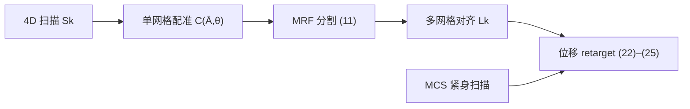

> **论文**：Gerard Pons-Moll, Sergi Pujades, Sonny Hu, Michael J. Black. [*ClothCap: Seamless 4D Clothing Capture and Retargeting*](https://doi.org/10.1145/3072959.3073711). ACM Transactions on Graphics (SIGGRAPH), 36(4), Article 73, 2017.

**ClothCap** 从 **4D 扫描**（60 fps 高分辨率动态 3D 扫描，含纹理）中捕获穿着多件日常衣物的人体，自动将各件衣物与皮肤分割，跟踪衣物形变，估计衣下**最小穿衣体型 (MCS, Minimally Clothed Shape)**，并支持将捕获衣物**重定向 (retarget)** 到新体型与新姿态——面向虚拟试衣等应用。本文笔记侧重其 **MRF 网格顶点分割**；MRF 基础见 [马尔可夫随机场（MRF）](2019-12-01-概率图模型：马尔可夫随机场（MRF）.md)。

---

## 1. 问题与思路

真实人物通常同时穿着多件衣物（T 恤、长裤等）。要估计各件衣物的形状、跨帧跟踪并可信渲染，必须将**每件衣物彼此分开，并与身体分开**。此前衣物捕获工作多限于单件衣物、简单动作、低分辨率，或无法完成物理意义上的分割与重定向。

ClothCap 的核心哲学是**从仿真转向捕获**：衣物实物已存在，直接扫描穿着该衣物的人，再泛化到新身体，比从厂商获取纸样再仿真更可行。

**主要贡献**：

| 模块 | 内容 |
| :--- | :--- |
| **分割** | 借助 SMPL 体型先验 + 外观 GMM 的 **MRF**，自动分割 4D 扫描序列（§5.2） |
| **跟踪** | **多网格 (multi-mesh)** 模板，每件衣物独立网格，跨帧对齐（§5.3） |
| **重定向** | 将动态衣物适配到新 SMPL 体型与姿态（§5.4） |

**与 Stoll et al. (2010) 等衣物捕获工作的区别**：后者主要找**高非刚性区域**以仿真形变，**不**将各件衣物与身体分开，衣物无法脱下并转移到新身体；ClothCap 强调**物理衣物的分割**与 **retarget**。

**数据**：主动立体 4D 扫描系统（与 Dyna 等同期工作类似），输入为带纹理的点云，约 60 fps。

---

## 2. 整体流程

### 2.1 Step 0：配置

捕获某类衣物组合前需指定：

- 衣物件数 $N_{\mathrm{garm}}$；
- 在 SMPL 模板上的**粗粒度空间先验**（Fig. 4：各身体部位更可能属于哪件衣物）——仅需一次手工配置，非常粗糙。

此外为每位被试估计 **MCS**：作者额外扫描穿紧身运动内衣的静态体型，将 SMPL 拟合到该扫描；也可换用 Zhang et al. (2017) 等自动估计衣下体型的方法。假设各序列**首帧近似 A 姿态**。

### 2.2 三步管线

输入为带颜色的 4D 点云/扫描序列 $S_k$：

```
Step 0：配置 Ngarm + 衣物先验；估计被试 MCS
Step 1a：单网格 SMPL 配准 → 穿衣外表面 C(Ā, θ)
Step 1b：MRF 顶点分割 → 模板标签 + 扫描标签 vs,k
Step 2：多网格对齐与跨帧跟踪 → L̄k
Step 3：准备位移 + 穿衣 → retarget 到新体型/姿态
```



**三种「模板」概念**（论文 Fig. 3）：

| 对象 | 含义 |
| :--- | :--- |
| **Cloth template（分割模板）** | 仅定义**拓扑**：哪些顶点属于哪件衣物 |
| **Multi-cloth template** $\bar{L}$ | 每件衣物一块网格，捕获**几何 + 拓扑**；每被试每套穿着算一次 |
| **Multi-cloth alignment** $L_k$ | 模板在每一帧的变形，跟踪扫描 |

**单网格对齐**将 SMPL 变形以贴合扫描外表面，得到单一闭合网格 $A$。它能解释外观，但**无法**正确跟踪衣物边界（T 恤与长裤间隙）、存在**表面滑动**（切向运动差）。因此需要 Step 1b 分割，再为每件衣物使用独立模板网格。

---

## 3. SMPL 与单网格配准（分割的前置）

ClothCap 建立在 **SMPL** 之上。SMPL 为函数 $M(\beta, \theta)$：$\beta \in \mathbb{R}^{50}$ 为体型 PCA 系数，$\theta \in \mathbb{R}^{72}$ 为 23 关节轴角 + 全局朝向；输出 6890 顶点网格。核心为线性混合蒙皮 (LBS)：

$$
M(\beta, \theta) = W\!\left(T_P(\beta, \theta),\, J(\beta),\, \theta,\, W\right),
\tag{1}
$$

$$
T_P(\beta, \theta) = \bar{T} + B_S(\beta) + B_P(\theta),
\tag{2}
$$

其中 $\bar{T}$ 为均值形状，$B_S, B_P$ 为体型/姿态 blend shapes，$J(\beta) = J_{\mathrm{reg}}(\bar{T} + B_S(\beta))$ 为关节位置。

### 3.1 Stage 1：被试专属单网格模型

对序列首帧扫描 $S_1^j$（A 姿态），联合优化体型 $\beta$、姿态 $\theta$ 与变形模板 $A$：

$$
E(\beta, \theta, A; S) = w_d E_d + w_c E_c + w_\theta E_\theta + w_\beta E_\beta.
\tag{3}
$$

**数据项**——扫描点 $x_s$ 到对齐面 $A$ 的鲁棒距离，$\rho(e) = e^2/(\sigma^2 + e^2)$ 为 Geman–McClure 惩罚：

$$
E_d(A; S) = \sum_{x_s \in S} \rho\!\left(\mathrm{dist}(x_s, A)\right).
\tag{4}
$$

**耦合项**——对齐网格的**边** $A_{t,e}$ 贴近 SMPL 对应边 $M_{t,e}(\beta, \theta)$（允许切向滑动，适合衣物）：

$$
E_c(A, \beta, \theta) = \sum_{t,e} w_t \left\| A_{t,e} - M_{t,e}(\beta, \theta) \right\|_F^2.
\tag{5}
$$

手部、足部等 $w_t$ 更大（扫描噪声大、无衣物遮挡）。**姿态/体型先验**为 Mahalanobis 距离 $E_\theta(\theta) = D_M(\theta; \mu_\theta, \Sigma_\theta)$，$E_\beta(\beta) = D_M(\beta; 0, \Sigma_\beta)$。

**两阶段权重策略**：

1. 初值 $w_c \to \infty$（其余正则权重大）→ **纯 SMPL 配准**，估计衣下 $\beta, \theta$；
2. 减小正则、增大 $w_d$ → 允许 $A$ 偏离身体以解释外层衣物。

初始化：$\theta \leftarrow \mu_\theta$，$\beta \leftarrow 0$，$A_{t,e} \leftarrow M_{t,e}(\beta, \theta)$。式 (3) 高度非凸，初始化关键。

**穿衣 T 姿态模板**：对齐网格 $A$ 不能直接 re-pose，需求解 unposed 网格 $\bar{A}$：

$$
\bar{A} = \arg\min_{\bar{A}} \left\| W(\bar{A} + B_P(\theta), J_{\mathrm{reg}}\bar{A}, \theta, W) - A \right\|_F^2.
\tag{8}
$$

单网格模型 $C(\bar{A}, \theta) = W(\bar{A} + B_P(\theta), J_{\mathrm{reg}}\bar{A}, \theta, W)$ 即固定「形状」为 $\bar{A}$ 的 SMPL，捕获穿衣几何。

### 3.2 Stage 2：序列单网格跟踪

用被试专属 $C(\bar{A}, \theta)$ 正则全序列：

$$
E(A_k, \theta_k; S_k) = w_d E_d + w_c E_c',
\tag{9}
$$

$$
E_c'(A_k, \theta_k; \bar{A}) = \sum_{t,e} w_t \left\| A_{t,e,k} - C_{t,e}(\bar{A}, \theta_k) \right\|_F^2.
\tag{10}
$$

每帧用上一帧姿态初始化；首帧用 Stage 1 结果。紧身衣时单网格已较合理，宽松衣物则与真实差距大——且**衣物边界无法跟踪**（Fig. 5）。

> 单网格对齐提供**拓扑与身体部位信息**，是后续在模板网格图 $T$ 上做 MRF 的基础。

---

## 4. 基于体型先验的 MRF 分割（核心）

### 4.1 为何在网格图上做 MRF？

直接在**图像域**分割缺乏三维形状信息，且手臂遮挡 T 恤等问题严重。ClothCap 在**单网格对齐的模板网格图** $T$ 上分割：每个顶点 $i \in T$ 对应随机变量 $v_i$，取值 $s_i \in \{0, 1, \ldots, N_{\mathrm{garm}}\}$（$0$ = 皮肤，其余为各件衣物）。手臂与 T 恤在拓扑上相距很远，自遮挡不再是问题。

### 4.2 MRF 能量

寻找标签配置 $\mathbf{v} = \{v_i \mid i \in T\}$，极小化标准 **MRF / CRF 型**能量：

$$
E(\mathbf{v}) = \sum_{i \in T} \varphi_i(v_i) + \sum_{(i,j) \in T} \psi_{ij}(v_i, v_j).
\tag{11}
$$

其中 $\varphi_i$ 为**一元势（unary）**，$\psi_{ij}$ 为**二元势（pairwise）**。对应模板网格邻接图上的 MRF；一元项依赖扫描观测，整体更接近 **CRF** 的 MAP 推断。因子图视角：每个顶点 $i$ 连一元因子 $\varphi_i$，每条边 $(i,j)$ 连二元因子 $\psi_{ij}$，联合能量为因子乘积的 $-\log$。

### 4.3 一元项：外观 GMM + 衣物先验

$$
\varphi_i(v_i) = \sum_{j \in \mathcal{B}_i(S)} -\log p_j(v_i) + \epsilon_i(v_i).
\tag{12}
$$

**（1）数据似然项** $-\log p_j(v_i)$

对每件衣物在 **HSV 颜色空间**（比 RGB 更抗光照变化）拟合 **高斯混合模型 (GMM)**。对模板顶点 $i$ 的扫描邻域 $\mathcal{B}_i(S)$ 中扫描点 $x_j$，标签为 $s$ 的似然为

$$
p_j(s) = \sum_{m=0}^{N} \pi_s^m \,\mathcal{N}\!\left( I(x_j) \,\middle|\, \mu_s^m, \Sigma_s^m \right),
\tag{13}
$$

其中 $I(x_j)$ 为 HSV 外观，$\pi_s^m, \mu_s^m, \Sigma_s^m$ 为标签 $s$ 的第 $m$ 个混合分量参数。

GMM 在 **A 姿态第一帧**上训练：该帧分割先用简化的无监督 **K-means 投票**代替 $p_j$ 自动获得，再拟合 GMM。仅用外观项时分割噪声大（论文 Fig. 6 第二列）。

**（2）衣物先验项** $\epsilon_i(v_i)$

编码「躯干顶点更可能是 T 恤、头/手/脚应为皮肤」等**粗粒度先验**。利用 SMPL 的身体部位划分，对每种衣物配置（如「T 恤 + 长裤」）**手工定义**每个顶点的偏好（Fig. 4：绿 = 可能，灰 = 不确定，红 = 不可能）。

形式地，对顶点 $i$：

- **偏好标签** $l_i$：$\epsilon_i(s) = 1 - \delta(s - l_i)$（Kronecker $\delta$）；
- **禁止某标签**：$\epsilon_i(s) = \delta(s - l_i)$。

先验很保守（例如不硬性假设长裤上沿位置，因腹部可能露出），但能有效纠正外观误判（如将头标为 T 恤，Fig. 6 第三列）。

### 4.4 二元项：Potts 平滑

鼓励邻接顶点标签一致。设模板邻接矩阵 $Z \in \mathbb{R}^{N \times N}$（$N$ 为顶点数）：

$$
\psi_{ij}(v_i, v_j) = Z_{ij}\,\bigl(1 - \delta(v_i - v_j)\bigr).
\tag{14}
$$

邻接且标签不同则代价为 $1$，否则为 $0$。这是 MRF 中经典的 **Potts 模型**平滑项。

### 4.5 推断：$\alpha$-expansion

式 (11) 为**多标签子模 MRF** 的常见形式（Potts 二元项满足子模性）。用 **$\alpha$-expansion** 图割算法 [Boykov et al. 2001] 求近似 MAP 标签配置：

- 每次扩展将部分顶点固定为标签 $\alpha$，其余保持二值选择；
- 重复直至能量不再下降；
- 对 Potts 模型可得到有理论保证的局部最优。

实践中 MRF 在模板网格上规模适中（SMPL 级数千顶点），$\alpha$-expansion 足够快。

### 4.6 消融实验（Fig. 6）

| 方法 | 现象 |
| :--- | :--- |
| 仅 GMM 一元项 | 分割噪声大，阴影/光照敏感 |
| MRF + GMM，**无** SMPL 衣物先验 | 头部误标为 T 恤 |
| **MRF + GMM + 衣物先验** | 最佳 |

说明：**外观 alone 不够**；**平滑 alone 不够**；SMPL 部位先验提供全局语义约束，与 MRF 平滑互补。

### 4.7 标签回传与边界

**模板 → 扫描**：MRF 在模板顶点 $i$ 上得标签 $s_i$；每个扫描点取**最近模板顶点**的标签。

**边界检测**：

1. 按标签将单网格对齐拆成 $N_{\mathrm{garm}}+1$ 块连通分量；
2. 仅含一个三角面的边为**衣物边界**；
3. 利用 SMPL 身体部位，自动标注边界类型（右袖、T 恤下摆、裤腰等）；
4. 边界顶点在扫描上标为白色（Fig. 7），得每帧标签向量 $\mathbf{v}_{s,k}$。

边界信息对多网格对齐至关重要：$E_{\mathrm{bound}}$ 强制模板边界环与扫描边界环匹配。

---

## 5. 多网格对齐

扫描被分为 $S = \{S^0, \ldots, S^{N_{\mathrm{garm}}}\}$（皮肤 + 各衣物）。多网格对齐分两阶段，共用目标式 (15)。

### 5.1 被试专属多网格模板（第一帧 A 姿态）

1. 用分割标签将 SMPL 均值形状拆成多块（Fig. 8b）；
2. 各块变形以解释第一帧对应扫描块（Fig. 8a）→ 得 $\bar{L}$（Fig. 8c）；
3. 因每顶点关联 SMPL 骨骼，可用 SMPL **re-pose**（Fig. 8d），用于全序列跟踪。

多网格模型 $C(\bar{L}, \theta) = \{C^0, \ldots, C^{N_{\mathrm{garm}}}\}$；对齐变量 $L = \{L^0, \ldots, L^{N_{\mathrm{garm}}}\}$ 与 $C$ 同拓扑、顶点可优化。

每帧 $k$ 优化 $\Phi_k = [\theta_k, L_k]$：

$$
E(\Phi_k) = w_d E_d' + w_b E_{\mathrm{bound}} + w_c E_c'' + w_s E_{\mathrm{lap}} + w_a E_{\mathrm{smth}}.
\tag{15}
$$

**分块数据项**——每衣物网格 $L^l$ 只匹配对应扫描 $S^l$，沿用式 (4)：

$$
E_d'(L; S) = \sum_{l=0}^{N_{\mathrm{garm}}} E_d(L^l; S^l).
\tag{16}
$$

**边界项**——$B_r(\cdot)$ 返回网格第 $r$ 条边界环；模板与扫描边界环一一对应（皮肤 $l=0$ 不参与）：

$$
E_{\mathrm{bound}}(L; S) = \sum_{l=1}^{N_{\mathrm{garm}}} \sum_{r=0}^{R_l} E_d\!\left(B_r(L^l),\, B_r(S^l)\right).
\tag{17}
$$

**耦合项**——各衣物块独立贴近 posed 多网格模型；Stage 1 用 $M(\beta^j, 0)$ 初始化 $\bar{L}$：

$$
E_c''(L, \theta; M(\beta^j, 0)) = \sum_{l=0}^{N_{\mathrm{garm}}} E_c'(L^l, \theta; C^l(M(\beta^j, 0), \theta)).
\tag{18}
$$

**拉普拉斯正则**——$G_{\mathrm{lap}} = I - H^{-1}Z$，抑制三角翻转与尖刺：

$$
E_{\mathrm{lap}}(L) = \sum_{l=1}^{N_{\mathrm{garm}}} \left\| G_{\mathrm{lap}}^l L^l \right\|_F^2.
\tag{19}
$$

**边界平滑**——对边界环顶点 $x_{r,n}$ 惩罚二阶差分：

$$
E_{\mathrm{smth}}(L) = \sum_r \sum_n \left\| x_{r,n-1} - 2 x_{r,n} + x_{r,n+1} \right\|^2.
\tag{20}
$$

第一帧解完后用式 (8) **unpose** 得更新后的 $\bar{L}$。算多网格模板时取 $w_s = 2000$ 以得到较平滑、少姿态褶皱的模板。

### 5.2 序列跟踪（Stage 2）

给定 $\bar{L}$，对全序列优化式 (15)，耦合项换为：

$$
E_c'''(L, \theta; \bar{L}) = \sum_{l=0}^{N_{\mathrm{garm}}} E_c'(L^l, \theta; \bar{L}^l).
\tag{21}
$$

**经验权重**（毫米单位）：$w_d=1000,\, w_b=20,\, w_c=1.5,\, w_s=200,\, w_a=20$。

---

## 6. MCS 与动态重定向（Retargeting）

多网格对齐只跟踪**可见皮肤**，衣下完整体型需额外估计（Fig. 9 左）。重定向分**准备**与**穿衣**两步。

### 6.1 时变衣下体型

静态 MCS $\bar{N}^{\mathrm{cap}}$ 来自紧身扫描配准。动态序列不能仅用 $\theta_k$ 去 pose MCS——运动时肌肉软组织伸缩，SMPL 精度不足。故每帧在 T 姿态估计时变裸体形状 $\bar{N}_k^{\mathrm{cap}}$：约束在衣物内部、贴近可见皮肤对齐，并靠近 MCS（细节见 Zhang et al. 2017）。

### 6.2 位移编码

在 T 姿态下，从源被试 $\mathrm{cap}$ 计算两类位移：

**动态体型位移**（时变身体形变）：

$$
\bar{D}_{\mathrm{dyna}} = \bar{N}_k^{\mathrm{cap}} - \bar{N}^{\mathrm{cap}}.
\tag{22}
$$

**衣物位移**（每件衣物相对对应裸体顶点的偏移）：

$$
\bar{D}_{\mathrm{cloth}}^l = \bar{L}_{k}^{l,\mathrm{cap}} - U_{\mathrm{cloth}}^l\, \bar{N}_k^{\mathrm{cap}},
\tag{23}
$$

$U_{\mathrm{cloth}}^l$ 为选取衣物 $l$ 对应裸体顶点的掩码矩阵。

### 6.3 穿衣到新体型

给定目标被试静态裸体 $\bar{N}^{\mathrm{target}}$：

$$
\bar{N}_k^{\mathrm{target}} = \bar{N}^{\mathrm{target}} + \bar{D}_{\mathrm{dyna}},
\tag{24}
$$

$$
\bar{L}_{k}^{l,\mathrm{target}} = U_{\mathrm{cloth}}^l\, \bar{N}_k^{\mathrm{target}} + \bar{D}_{\mathrm{cloth}}^l.
\tag{25}
$$

再用捕获姿态 $\theta_k$ pose 即可。同一被试 retarget 到自身可得**衣下完整身体动画**（Fig. 9 右）。

**应用**：

- **动态试衣**（Fig. 12）：专业模特穿各款衣物扫描一次，衣物可 retarget 到任意 CAESAR 体型并复现原动作；
- **改体型**（Fig. 13）：用 SMPL 增重/变胖后，将捕获衣物序列 retarget 到新体型；
- **静态试衣**（Fig. 14）：CAESAR 数据集上万体型穿同一套捕获衣物。

褶皱随姿态未必物理正确，但视觉足够逼真；且衣物与 SMPL 骨骼关联，reposing 简单。

---

## 7. 实验与特殊拓扑

**动作与衣物**：跑步、跳跃、拳击等；牛仔裤、T 恤、衬衫、短裤、运动衫、**裙子**等。

**与身体同拓扑的衣物**（衬衫、长裤）：除粗粒度先验外全自动。**裙子**等拓扑不同：先用 MRF 得扫描分割点云，再人工清理、重拓扑；顶点全挂 SMPL 根关节，之后流程相同（Fig. 10）。

**分辨率**：多网格模板分辨率决定褶皱细节；更高分辨率 segmented template 可捕获更高频褶皱。

---

## 8. 与 MRF 理论及他法的联系

| 概念 | ClothCap 中的实例 |
| :--- | :--- |
| **随机场** | 模板网格顶点标签 $v_i$ |
| **一元势** | $-\log p_j(v_i)$（GMM 外观）+ $\epsilon_i(v_i)$（SMPL 部位先验） |
| **二元势** | Potts 平滑 $\psi_{ij}$ |
| **推断** | $\alpha$-expansion 求 MAP 配置 |
| **CRF 味道** | 一元项依赖扫描观测 $S$（条件于数据） |

与 [MRF 应用 1：法向重建](MRF应用1-法向重建.md)（体积多标签 + Wulff 形状先验）不同，ClothCap 是**离散标签**的网格分割，一元项融合**颜色 GMM** 与 **SMPL 语义部位**，属于经典 **appearance + shape prior + smoothness** 的 MRF 范式。

同领域相关方法：

| 方法 | 特点 |
| :--- | :--- |
| **ClothCap** | 4D 扫描 + MRF 多衣物分割 + multi-mesh 跟踪 + retarget |
| **IPNet** 等 | 扫描–SMPL 配准，侧重衣下体型 |
| **Stoll et al. 2010** | 粗网格 + 刚/非刚分区 + 物理仿真，无衣物–身体分离 |
| **CoSeg** 等 | 网格共分割，无 4D 衣物重定向 |

**MRF 在管线中的位置**：分割质量直接决定 $E_d'$ 分块是否正确、$E_{\mathrm{bound}}$ 环是否对齐——错误分割会把 T 恤顶点拉去对齐裤子扫描，后续优化无法挽回。因此 MRF 虽只占一节，却是 **multi-cloth 框架的枢纽**。

---

## 9. 局限与备注

- 衣物先验按配置**手工定义**，新款式需更新先验图（Fig. 4）；
- 外观模型对噪声、阴影、光照仍敏感，依赖体型先验补救；
- 裙子等**拓扑异于身体**的衣物需额外手工步骤建立粗略拓扑；
- 褶皱随姿态变化未必物理正确，但视觉足以支持试衣等应用。

---

## 参考文献

- Pons-Moll et al., *ClothCap*, SIGGRAPH 2017. [DOI](https://doi.org/10.1145/3072959.3073711) · [项目页](https://clothcap.is.tue.mpg.de/)
- Loper et al., *SMPL*, SIGGRAPH Asia 2015.
- Boykov et al., *Fast approximate energy minimization via graph cuts*, IEEE TPAMI 2001.
- Kolmogorov & Zabih, *What energy functions can be minimized via graph cuts?*, ECCV 2002（子模性与 $\alpha$-expansion 理论）.
- Pons-Moll et al., *Dyna: A Model of Dynamic Human Shape in Motion*, SIGGRAPH 2015（同扫描系统背景）.
- Zhang et al., *Detailed, accurate, human shape estimation from clothed 3D scan sequences*, CVPR 2017（衣下体型估计，MCS 动态扩展引用）.
