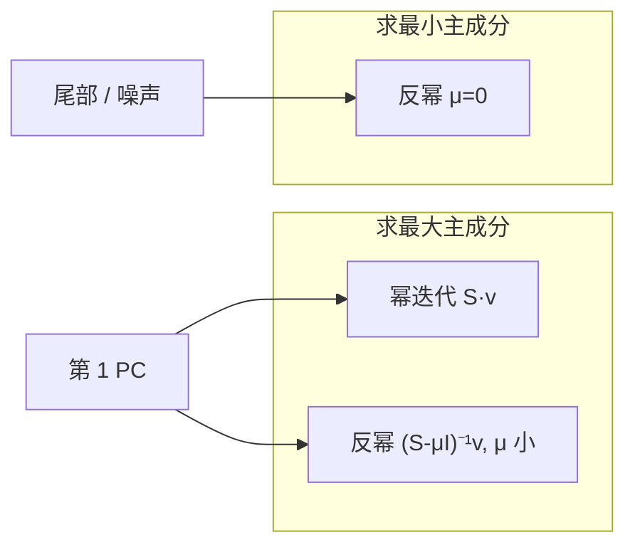
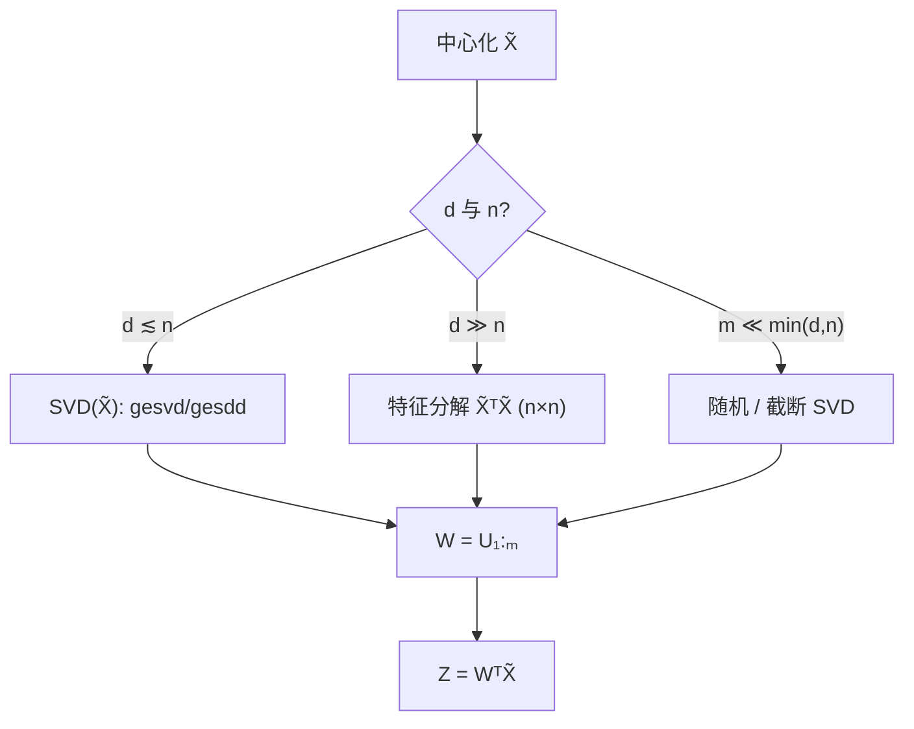
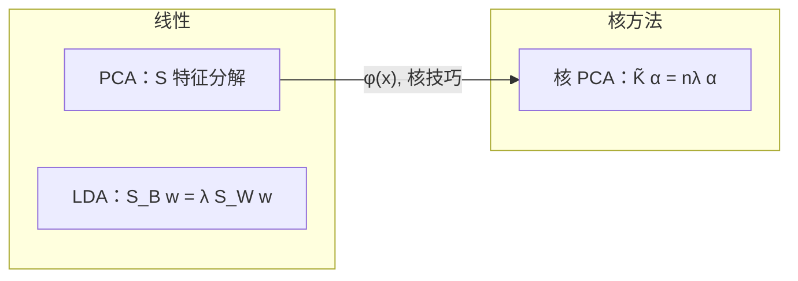
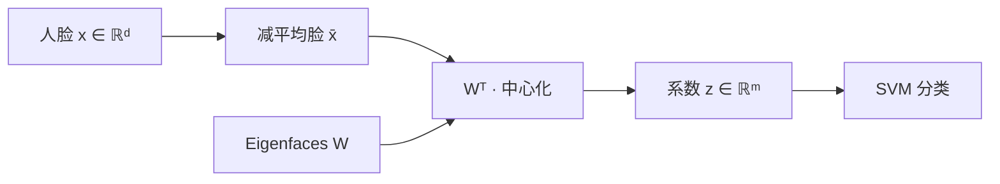

**主成分分析 (PCA)** 与 **线性判别分析 (LDA)** 是两类经典的线性降维方法：PCA **无监督**，保留最大方差；LDA **有监督**，最大化类间分离。二者都可借助特征分解求解；PCA 还可通过 **核技巧** 推广到非线性流形（**核 PCA**）。§5 以 **Eigenfaces** 为例，说明 PCA 与 **SVM** 在人脸识别中的串联用法。

**阅读路线**：§1 PCA（含 §1.6 **数值求解：SVD**）→ §2 LDA → §3 核 PCA → §4 对比 → §5 Eigenfaces。

---

## 符号约定

| 符号 | 含义 |
| :--- | :--- |
| $x_i \in \mathbb{R}^d$ | 第 $i$ 个样本（列向量或行向量，下文统一用列向量） |
| $n$ | 样本数 |
| $c$ | LDA 类别数 |
| $n_k$ | 第 $k$ 类样本数，$\sum_k n_k = n$ |
| $\bar{x}$ | 全体样本均值 |
| $\bar{x}_k$ | 第 $k$ 类均值 |
| $X \in \mathbb{R}^{d\times n}$ | 数据矩阵，列 $x_i$ 已中心化 |
| $W \in \mathbb{R}^{d\times m}$ | 投影矩阵（$m$ 维子空间） |

---

## 1. 主成分分析（PCA）

### 1.1 问题：无监督降维

给定 $\{x_i\}_{i=1}^n \subset \mathbb{R}^d$，希望找到 $m \ll d$ 维子空间，使投影后尽可能保留数据信息。PCA 的「信息」通常定义为**方差**。

### 1.2 推导一：最大方差方向

**Step 1：中心化。** 令

$$
\bar{x}=\frac{1}{n}\sum_{i=1}^n x_i,\qquad
\tilde{x}_i=x_i-\bar{x}.
$$

记 $\tilde{X}=[\tilde{x}_1,\ldots,\tilde{x}_n]\in\mathbb{R}^{d\times n}$。

**Step 2：一维投影。** 单位方向 $w\in\mathbb{R}^d$，$\|w\|=1$，投影 $z_i=w^\top \tilde{x}_i$。

投影后方差：

$$
\mathrm{Var}(z)=\frac{1}{n}\sum_{i=1}^n (w^\top \tilde{x}_i)^2
= w^\top \Bigl(\frac{1}{n}\sum_{i=1}^n \tilde{x}_i\tilde{x}_i^\top\Bigr) w
= w^\top S w,
$$

其中 **样本协方差矩阵**（差一个无偏因子 $n/(n-1)$，不影响方向）：

$$
S=\frac{1}{n}\sum_{i=1}^n \tilde{x}_i\tilde{x}_i^\top
=\frac{1}{n}\tilde{X}\tilde{X}^\top.
$$

**Step 3：约束优化。**

$$
\max_{\|w\|=1}\; w^\top S w
\quad\Leftrightarrow\quad
\max_w\; w^\top S w \;\;\text{s.t.}\;\; w^\top w=1.
$$

拉格朗日函数 $\mathcal{L}=w^\top S w-\lambda(w^\top w-1)$，求导：

$$
\frac{\partial \mathcal{L}}{\partial w}=2Sw-2\lambda w=0
\quad\Rightarrow\quad
Sw=\lambda w.
$$

故 $w$ 为 $S$ 的**特征向量**，$\lambda$ 为对应**特征值**。投影方差 $=w^\top Sw=\lambda$。

**结论**：**第一主成分** = $S$ 的**最大特征值**对应特征向量；第 $k$ 主成分 = 第 $k$ 大特征值对应特征向量（取相互正交的一组）。

**Step 4：$m$ 维子空间。** 取 $W=[w_1,\ldots,w_m]$（列向量为前 $m$ 个特征向量），投影

$$
z_i = W^\top \tilde{x}_i \in \mathbb{R}^m.
$$

### 1.3 推导二：最小重构误差（等价性）

另一表述：找秩 $m$ 正交基 $W$，最小化中心化数据的重构误差

$$
\min_{W^\top W=I}\;\frac{1}{n}\sum_{i=1}^n \|\tilde{x}_i - W W^\top \tilde{x}_i\|^2.
$$

记 $P=WW^\top$ 为到 $\mathrm{span}(W)$ 的正交投影。Eckart–Young 定理：最优 $P$ 由 $S$ 的前 $m$ 个特征向量张成。故**最大方差**与**最小重构误差**给出**同一组主成分**。

### 1.4 SVD 形式

对中心化矩阵 $\tilde{X}$ 做 **SVD**：

$$
\tilde{X} = U \Sigma V^\top,
$$

其中 $U\in\mathbb{R}^{d\times r}$、$\Sigma\in\mathbb{R}^{r\times r}$（$r=\mathrm{rank}(\tilde{X})$）列正交，$V\in\mathbb{R}^{n\times r}$ 列正交。

则

$$
S=\frac{1}{n}\tilde{X}\tilde{X}^\top = \frac{1}{n}U\Sigma^2 U^\top,
$$

$U$ 的列即 $S$ 的特征向量；特征值 $\lambda_j=\sigma_j^2/n$（$\sigma_j$ 为 $\Sigma$ 对角元）。

**实践**：当 $d\gg n$ 时，对 $\tilde{X}^\top\tilde{X}\in\mathbb{R}^{n\times n}$ 做 SVD 更省（**dual PCA**）。

### 1.5 PCA 算法小结

1. 中心化：$\tilde{x}_i=x_i-\bar{x}$；
2. 计算 $S$ 或 SVD($\tilde{X}$)；
3. 取前 $m$ 个特征向量组成 $W$；
4. 降维：$z_i=W^\top \tilde{x}_i$；重构：$\hat{x}_i=\bar{x}+WW^\top \tilde{x}_i$。

**解释方差比**：第 $j$ 主成分贡献 $\lambda_j/\sum_k \lambda_k$。

### 1.6 数值求解：特征分解与 SVD

理论上是解 $Sw=\lambda w$，$S=\frac{1}{n}\tilde{X}\tilde{X}^\top$。实践中**几乎从不**先显式构造 $d\times d$ 的 $S$ 再做特征分解——维数大时代价 $O(d^3)$、且 $\tilde{X}\tilde{X}^\top$ 会把条件数**平方**。标准做法是改用 **SVD（奇异值分解）** 或其对偶形式；与直接特征分解**数学等价**，数值上更稳。

#### 方法一：对 $\tilde{X}$ 做 SVD（最常用）

$$
\tilde{X}=U\Sigma V^\top,\qquad U\in\mathbb{R}^{d\times r},\;\Sigma=\mathrm{diag}(\sigma_1,\ldots,\sigma_r),\;\sigma_1\ge\cdots\ge\sigma_r>0.
$$

主成分方向与特征值：

$$
w_j=u_j\ \text{（$U$ 的第 $j$ 列）},\qquad \lambda_j=\frac{\sigma_j^2}{n}.
$$

投影可直接用 SVD，无需先形成 $S$：

$$
z_i = W^\top \tilde{x}_i = W^\top U\Sigma V^\top e_i
\quad\text{或等价地}\quad
Z = W^\top \tilde{X} = \Sigma_{1:m} V_{1:m}^\top.
$$

**库实现**：`numpy.linalg.svd`、`scipy.linalg.svd`、`sklearn.decomposition.PCA` 底层均调用 LAPACK 的 `gesvd` / `gesdd`（分治法，大数据时常用 `gesdd`）。

#### 方法二：Dual PCA（$d\gg n$，如 Eigenfaces）

当 $d\gg n$ 时，算 $d\times d$ 的 $S$ 不现实；改为解**小矩阵**特征问题。由

$$
\tilde{X}\tilde{X}^\top u_j = \sigma_j^2 u_j
\quad\Leftrightarrow\quad
\tilde{X}^\top\tilde{X}\, v_j = \sigma_j^2 v_j,\quad u_j=\frac{1}{\sigma_j}\tilde{X}v_j,
$$

其中 $v_j$ 为 $n\times n$ 矩阵 $L=\tilde{X}^\top\tilde{X}$ 的特征向量。复杂度从 $O(d^3)$ 降为 **$O(n^2 d)$**（算 $L$）+ $O(n^3)$（分解 $L$）；$n\ll d$ 时极省。§5 Eigenfaces 即此路线。

#### 方法三：只算前 $m$ 个主成分（截断 / 随机化）

若 $m\ll \min(d,n)$，不必做**完整** SVD：

| 方法 | 思路 | 复杂度量级 |
| :--- | :--- | :--- |
| **幂迭代 + 正交化** | 逐个求最大特征方向并 deflation | $O(mnk)$ 每轮 |
| **Lanczos** | 三对角化后解小特征问题 | 适合稀疏/大矩阵 |
| **随机 SVD (Halko et al.)** | 随机投影 $\tilde{X}\Omega$ 再 QR + 小 SVD | $O(m^2 n)$ 量级 |

`sklearn.decomposition.PCA(svd_solver='randomized')` 在 $d,n$ 很大且 $m$ 较小时走此路。

#### 方法四：幂迭代与反幂迭代（Inverse Power Iteration）

PCA 只需**少数最大**特征值/特征向量时，可用迭代法而不做完整 SVD。须区分**幂迭代**与**反幂迭代**各自求的是什么。

**（1）幂迭代（Power Iteration）——求最大特征值**

$$
v^{(t+1)}=\frac{Sv^{(t)}}{\|Sv^{(t)}\|}.
$$

在 $\lambda_1>\lambda_2$ 时，$v^{(t)}\to w_1$（第一主成分）。矩阵–向量乘

$$
Sv^{(t)}=\frac{1}{n}\tilde{X}(\tilde{X}^\top v^{(t)})
$$

只需 $O(nd)$，**不必形成** $S$。

**（2）反幂迭代（Inverse Power Iteration）——求最接近 $\mu$ 的特征值**

每步解线性方程组并归一化：

$$
(S-\mu I)\,w^{(t+1)}=v^{(t)},\qquad
v^{(t+1)}=\frac{w^{(t+1)}}{\|w^{(t+1)}\|}.
$$

收敛到使 $|\lambda_j-\mu|$ **最小**的特征对 $(\lambda_j,w_j)$。

| 移位 $\mu$ | 收敛到 | PCA 用途 |
| :--- | :--- | :--- |
| $\mu=0$ | **最小**特征值方向 | 尾部主成分、噪声子空间；$S$ 奇异时对应零空间 |
| $\mu\approx\lambda_j$ | 附近的 $\lambda_j$ | **隔离**第 $j$ 个主成分（已知粗估计时） |
| $\mu\ll\lambda_{\min}^+$ | 等价于对 $S^{-1}$ 幂迭代 | 求**最大**特征值（仅当 $S$ 可逆时） |

**要点**：反幂迭代**默认不是**「直接求第一主成分」；$\mu=0$ 时求的是**最小**特征方向。PCA 要的是**最大**方差 → 首选**幂迭代**，或带**移位求逆（shift-and-invert）** 的反幂迭代。

**（3）移位求逆：用反幂迭代求最大特征值**

取 $\mu<\lambda_{\min}^+$（所有感兴趣特征值之下，如 $\mu=0$ 当 $S\succeq 0$），对

$$
M(\mu)=(S-\mu I)^{-1}
$$

做幂迭代：每步解 $(S-\mu I)w=v$，等价于反幂迭代。$M(\mu)$ 的最大特征值为 $(\lambda_1-\mu)^{-1}$，故收敛到**原矩阵最大** $\lambda_1$。$\mu$ 越接近 $\lambda_1$，收敛越快（Rayleigh 商移位）。

**（4）与 PCA 的匹配关系**

| 目标 | 推荐迭代 |
| :--- | :--- |
| 第 1 主成分 | 对 $S$ **幂迭代**；或对 $\tilde{X}^\top\tilde{X}$ 幂迭代（dual，$n\times n$） |
| 前 $m$ 个主成分 | **Deflation**：求出 $w_1$ 后于 $(I-w_1w_1^\top)S$ 上重复；或**子空间迭代**（块幂法） |
| 第 $j$ 个主成分（已知 $\lambda_{j\pm1}$ 估计） | 反幂迭代，$\mu=(\lambda_{j-1}+\lambda_{j+1})/2$ |
| 最小 / 尾部方向 | 反幂迭代 $\mu=0$ |

**（5）$d\gg n$ 时的实现注意**

$S=\frac{1}{n}\tilde{X}\tilde{X}^\top$ 秩 $\le n$，**不可逆**。反幂迭代解 $(S-\mu I)w=v$ 应：

- 在 **$L=\tilde{X}^\top\tilde{X}$**（$n\times n$）上做（非零特征值与 $S$ 相同）；或
- 用 **Woodbury / Sherman–Morrison** 利用低秩结构，避免 $d\times d$ 求逆；或
- 每步用 **共轭梯度 (CG)** 解 $(S-\mu I)w=v$，仅做 $S\cdot w$ 的矩阵–向量乘。

**（6）与 SVD / Lanczos 的取舍**

| | 幂 / 反幂迭代 | 完整或截断 SVD |
| :--- | :--- | :--- |
| 要全部 $m$ 维且 $m$ 不小 | 需 deflation，误差累积 | **更稳、更省事** |
| 只要 1–几个主成分、$S\cdot v$ 便宜 | 可行 | 仍常用 SVD |
| 矩阵–向量乘极贵、$m$ 很小 | 反幂 + CG 有优势 | 随机 SVD 往往仍更好 |

**结论**：**反幂迭代可以用于 PCA**，但须配对移位 $\mu$——求最大主成分用**幂迭代**或 **shift-and-invert 反幂迭代**（$\mu$ 取小）；$\mu=0$ 的反幂迭代求的是**最小**特征方向。工程上 `sklearn` / LAPACK 仍以 SVD 为主；迭代法多见于**极大规模稀疏谱**或**在线 / 流式 PCA**。

#### 为何优先 SVD 而非直接算 $S$ 的特征值？

| 对比 | $S=\frac{1}{n}\tilde{X}\tilde{X}^\top$ 特征分解 | $\tilde{X}$ 的 SVD |
| :--- | :--- | :--- |
| 矩阵规模 | $d\times d$ | 只需 $\tilde{X}$（$d\times n$）或对偶 $n\times n$ |
| 条件数 | $\kappa(S)=\kappa(\tilde{X})^2$ | $\kappa(\tilde{X})$，**更稳** |
| 与 PCA 关系 | 直接 | **定理等价**：$u_j,\lambda_j=\sigma_j^2/n$ |
| 典型库 | `eigh(S)` 仅当 $d$ 小 | **默认推荐** |

**结论**：可以用、且**应该优先用 SVD 中的方法**求 PCA——不是两套不同算法，而是同一问题的更稳定实现。流程：中心化 $\tilde{X}$ → SVD（或 dual / 截断 SVD）→ 取 $U_{1:m}$、$\Sigma_{1:m}$ → $z_i=W^\top\tilde{x}_i$。

#### 与核 PCA 的数值解

核 PCA 解的是 $\tilde{K}\alpha=n\lambda\alpha$（§3），属于**对称矩阵特征分解**，用 `eigh` 即可（$n\times n$，$n$ 为样本数）。若 $n$ 极大，同样可用截断特征分解 / Lanczos，**不能**对核矩阵直接做 SVD 替代，但数学上仍是对称正定阵的谱分解问题。

---

## 2. 线性判别分析（LDA）

### 2.1 问题：有监督降维

数据带标签 $y_i\in\{1,\ldots,c\}$。希望投影后**类间分得开、类内分得拢**——与 PCA（只看总体方差，可能把类间差异当噪声丢掉）形成对比。

### 2.2 Fisher 线性判别（二分类）

**类内散度 (within-class scatter)**：

$$
S_W = S_1 + S_2,\quad
S_k=\sum_{i:y_i=k}(\tilde{x}_i-\bar{x}_k)(\tilde{x}_i-\bar{x}_k)^\top,
$$

其中 $\bar{x}_k$ 为第 $k$ 类均值。

**类间散度 (between-class scatter)**（二分类，$\bar{x}$ 为总均值）：

$$
S_B = (\bar{x}_1-\bar{x}_2)(\bar{x}_1-\bar{x}_2)^\top.
$$

**Fisher 准则**：找 $w$ 使类间投影距离相对类内投影方差最大：

$$
J(w)=\frac{w^\top S_B w}{w^\top S_W w}.
$$

分子：两类中心投影 $(w^\top\bar{x}_1-w^\top\bar{x}_2)^2$；分母：类内投影方差之和。

对 $w$ 求导（注意 $J$ 对 $w$ 缩放不变），得**广义特征值问题**：

$$
S_B w = \lambda S_W w.
$$

二分类时 $\mathrm{rank}(S_B)=1$，只有一个非零广义特征值；最优 $w\propto S_W^{-1}(\bar{x}_1-\bar{x}_2)$（当 $S_W$ 可逆）。

### 2.3 多类 LDA

**类内散度矩阵**：

$$
S_W=\sum_{k=1}^c\sum_{i:y_i=k}(\tilde{x}_i-\bar{x}_k)(\tilde{x}_i-\bar{x}_k)^\top.
$$

**类间散度矩阵**：

$$
S_B=\sum_{k=1}^c n_k(\bar{x}_k-\bar{x})(\bar{x}_k-\bar{x})^\top.
$$

**多类 Fisher 准则**：同时求 $m$ 个方向 $W=[w_1,\ldots,w_m]$，

$$
\max_W \;\mathrm{tr}\!\left((W^\top S_W W)^{-1} W^\top S_B W\right),
$$

等价于广义特征值问题

$$
S_B w_j = \lambda_j S_W w_j,\qquad j=1,\ldots,m,
$$

取 $\lambda_j$ 最大的 $m$ 个特征向量（$m\le c-1$，因 $\mathrm{rank}(S_B)\le c-1$）。

**数值注意**：$S_W$ 奇异时（$n<d$ 或类内共线）用伪逆 $S_W^+$ 或正则化 $S_W+\epsilon I$。

### 2.4 LDA 算法小结

1. 计算各类均值 $\bar{x}_k$、总均值 $\bar{x}$；
2. 构造 $S_W$、$S_B$；
3. 解 $S_B w=\lambda S_W w$，取前 $m\le c-1$ 个特征向量；
4. 投影 $z_i=W^\top x_i$（是否中心化各类等价，常用原 $x_i$ 或 $\tilde{x}_i$ 一致即可）。

**与 PCA 对比**：LDA 用标签，最多 $c-1$ 维；PCA 无标签，最多 $d$ 维（实际取 $m\ll d$）。

---

## 3. 核 PCA（Kernel PCA）

### 3.1 动机

PCA 是**线性**投影。数据若落在非线性流形上（如 Swiss roll），线性 PCA 效果差。**核 PCA** 先在隐式特征空间 $\mathcal{H}$ 做 PCA，再借助核函数避免显式计算 $\phi(x)$。

### 3.2 特征空间中的 PCA

设映射 $\phi:\mathbb{R}^d\to\mathcal{H}$（可能无穷维），在 $\mathcal{H}$ 中对 $\phi(\tilde{x}_i)$ 做标准 PCA。

特征空间协方差（设 $\mathcal{H}$ 上已中心化 $\sum_i\phi(\tilde{x}_i)=0$）：

$$
C=\frac{1}{n}\sum_{i=1}^n \phi(\tilde{x}_i)\phi(\tilde{x}_i)^\top.
$$

求特征向量 $v\in\mathcal{H}$：$Cv=\lambda v$，$\|v\|=1$。

**Representer 定理**：$v$ 必在 $\{\phi(\tilde{x}_i)\}$ 张成子空间中，即

$$
v=\sum_{i=1}^n \alpha_i \phi(\tilde{x}_i).
$$

代入 $Cv=\lambda v$，两边与 $\phi(\tilde{x}_j)$ 做内积，记 **核矩阵** $K_{ij}=k(x_i,x_j)=\langle\phi(x_i),\phi(x_j)\rangle$：

$$
\frac{1}{n}K\alpha=\lambda\alpha.
$$

即 **核矩阵** 的特征值问题（对中心化后的核）。

### 3.3 核矩阵的中心化

原始样本未必在 $\mathcal{H}$ 中零均值。对**核矩阵**而非显式 $\phi$ 做中心化：

$$
\tilde{K}=HKH,\quad H=I_n-\frac{1}{n}\mathbf{1}\mathbf{1}^\top.
$$

等价于在特征空间对 $\phi(x_i)$ 减均值后再做 PCA。对 $\tilde{K}$ 做特征分解：

$$
\tilde{K}\alpha^{(j)} = n\lambda_j \alpha^{(j)},\qquad j=1,\ldots,m,
$$

取前 $m$ 个特征值 $\lambda_j$ 及对应 $\alpha^{(j)}$（归一化使 $(\alpha^{(j)})^\top\tilde{K}\alpha^{(j)}=n\lambda_j$）。

### 3.4 投影与重构

**训练样本** $x_i$ 在第 $j$ 核主成分上的坐标：

$$
z_{ij}=\frac{1}{\sqrt{n\lambda_j}}\,(\alpha^{(j)})^\top \tilde{k}_i,
$$

其中 $\tilde{k}_i$ 为 $\tilde{K}$ 的第 $i$ 列（样本 $x_i$ 与所有训练点的中心化核向量）。

**新样本** $x$：先算与训练集的核向量 $k_i=k(x,x_i)$，再中心化

$$
\tilde{k}_i = k_i - \frac{1}{n}\sum_j k(x,x_j) - \frac{1}{n}\sum_j k(x_j,x_i) + \frac{1}{n^2}\sum_{j,\ell} k(x_j,x_\ell),
$$

则

$$
z_j(x)=\frac{1}{\sqrt{n\lambda_j}}\sum_{i=1}^n \alpha_i^{(j)}\,\tilde{k}_i(x).
$$

**注意**：核 PCA **一般无简单线性重构**（$\phi$ 未知）；常用于可视化、去噪、特征提取的前处理。

### 3.5 常用核与超参

| 核 | 形式 | 说明 |
| :--- | :--- | :--- |
| 线性 | $k(x,x')=x^\top x'$ | 退化为普通 PCA |
| 多项式 | $(x^\top x'+c)^p$ | 有限维隐式特征 |
| RBF / 高斯 | $\exp(-\|x-x'\|^2/(2\sigma^2))$ | 最常用；$\sigma$ 控制局部性 |
| Sigmo id | $\tanh(\kappa x^\top x'+\theta)$ | 需满足 Mercer 条件 |

核矩阵 $K$ 必须**对称半正定**（Mercer 定理）。RBF 核 $\sigma$ 过小 → 核矩阵近似单位阵，主成分退化为各点自身；$\sigma$ 过大 → 接近线性。

### 3.6 核 PCA 算法小结

1. 选核 $k$，构造 $K$，中心化得 $\tilde{K}=HKH$；
2. 对 $\tilde{K}$ 特征分解，取前 $m$ 个特征对 $(\lambda_j,\alpha^{(j)})$；
3. 训练点投影：$z_{ij}\propto (\alpha^{(j)})^\top \tilde{k}_i$；
4. 新点：构造中心化核向量后同样内积。

**与核 LDA**：核 LDA 将 Fisher 准则搬到特征空间，同样只依赖核矩阵；思路与核 PCA 平行，但利用类标签。

---

## 4. PCA、LDA 与核 PCA 对比

| 方法 | 监督 | 目标 | 最大维数 | 非线性 |
| :--- | :---: | :--- | :---: | :---: |
| **PCA** | 否 | 最大方差 / 最小重构误差 | $d$ | 否 |
| **LDA** | 是 | 最大类间/类内散度比 | $c-1$ | 否 |
| **核 PCA** | 否 | 特征空间最大方差 | $n$（通常 $\ll d$） | 是 |

**选用建议**：

- 无标签、探索结构、去相关 → **PCA**；
- 有标签、分类前降维 → **LDA**（常与 PCA 串联：先 PCA 去噪再 LDA）；
- 流形弯曲、聚类/可视化 → **核 PCA**（注意 $\sigma$ 与 $m$ 的选取）。

---

## 5. 应用：Eigenfaces 中的 PCA 与 SVM

**Eigenfaces（特征脸）** 由 Turk & Pentland (1991) 提出，是人脸识别中最经典的 **PCA 降维 + 分类器** 管线。原始论文用**最近邻**比较特征系数；实践中常在 Eigenface 系数上再训练 **SVM**，获得更好的类间间隔与泛化。

### 5.1 问题设定

- 每张灰度人脸图像展平为 $x\in\mathbb{R}^d$（如 $64\times 64\Rightarrow d=4096$）；
- 训练集 $\{(x_i,y_i)\}_{i=1}^n$，$y_i\in\{1,\ldots,c\}$ 为身份 ID；
- 典型情形 **$d\gg n$**（像素远多于样本）→ 必须用 §1.4 的 **dual PCA**，不可直接构造 $d\times d$ 协方差阵。

### 5.2 PCA 阶段：从人脸到 Eigenface

**Step 1：构造数据矩阵。** 列向量为各张人脸（可先统一尺寸、对齐、归一化到 $[0,1]$）：

$$
X=[x_1,\ldots,x_n]\in\mathbb{R}^{d\times n}.
$$

**Step 2：平均脸与中心化。**

$$
\bar{x}=\frac{1}{n}\sum_{i=1}^n x_i \quad\text{（平均脸）},\qquad
\tilde{x}_i=x_i-\bar{x},\quad \tilde{X}=[\tilde{x}_1,\ldots,\tilde{x}_n].
$$

**Step 3：Dual PCA（$d\gg n$ 时）。** 计算 $n\times n$ 矩阵

$$
L=\tilde{X}^\top \tilde{X}\in\mathbb{R}^{n\times n},
$$

特征分解 $L v_j=\lambda_j v_j$。则 $S=\frac{1}{n}\tilde{X}\tilde{X}^\top$ 的非零特征向量为

$$
u_j=\frac{1}{\sqrt{n\lambda_j}}\,\tilde{X}v_j,\qquad j=1,\ldots,r,\quad r\le n-1.
$$

$u_j\in\mathbb{R}^d$ reshape 回图像即第 $j$ 张 **Eigenface（特征脸）**——数据协方差的主方向，通常前几幅对应整体光照/轮廓，后面捕捉细节。

**Step 4：选 $m$ 维子空间。** 取 $\lambda_j$ 最大的 $m$ 个 $u_j$，$W=[u_1,\ldots,u_m]\in\mathbb{R}^{d\times m}$。保留维数 $m$ 常取使累计方差达 90%–95%，或经验上 $m\approx 50\sim 150$。

**Step 5：投影得 Eigenface 系数（特征）。**

$$
z_i = W^\top \tilde{x}_i \in \mathbb{R}^m.
$$

$z_i$ 是第 $i$ 张脸在 Eigenface 基下的坐标，作为后续分类器的输入。

**Step 6：重构（可选）。** $\hat{x}_i=\bar{x}+Wz_i$。去掉小特征值对应分量可实现**去噪/压缩**。

### 5.3 为何先 PCA 再分类？

| 原因 | 说明 |
| :--- | :--- |
| **维数灾难** | 直接在 $\mathbb{R}^d$ 上分类，$d$ 极大、$n$ 很小，易过拟合 |
| **去相关** | PCA 基正交，$z_i$ 各维近似不相关，利于线性分类器 |
| **去噪** | 丢弃小特征值方向（高频噪声、细微表情），保留主要人脸变化 |
| **计算** | dual PCA 只需 $O(n^2 d)$ 级，不必存 $d\times d$ 矩阵 |

PCA 在此是**无监督**的（未用 $y_i$），不保证身份可分；故需要第二步判别模型。**Fisherfaces** 用 §2 的 LDA 替代 PCA 做有监督降维，是常见变体。

### 5.4 SVM 阶段：在 Eigenface 系数上分类

在 $\{(z_i,y_i)\}$ 上训练 **多类 SVM**。

**线性 SVM（二分类）。** 对类别 $k$，构造标签 $\tilde{y}_i=+1$ 若 $y_i=k$，否则 $-1$。优化

$$
\min_{w,b}\;\frac{1}{2}\|w\|^2 + C\sum_{i=1}^n \xi_i
\quad\text{s.t.}\quad
\tilde{y}_i(w^\top z_i+b)\ge 1-\xi_i,\;\xi_i\ge 0.
$$

决策函数 $f_k(z)=w_k^\top z+b_k$；**一对多 (OvR)**：预测 $\hat{y}=\arg\max_k f_k(z)$。

**多类策略**：

| 策略 | 做法 |
| :--- | :--- |
| **OvR** | 每类训练一个二分类 SVM |
| **OvO** | 每对类训练一个 SVM，$c(c-1)/2$ 个，投票 |
| **多类 SVM** | 单优化问题（如 Crammer–Singer） |

**核 SVM。** 在 $z$ 空间还可使用 RBF 核 $k(z,z')=\exp(-\gamma\|z-z'\|^2)$，在 Eigenface 系数上进一步非线性分界。也可对**原始像素**用核 SVM，但 $d$ 大时不如先 PCA 再线性/RBF SVM 高效。

**测试流程：**

1. 新脸 $x_{\mathrm{test}}$ 中心化：$\tilde{x}_{\mathrm{test}}=x_{\mathrm{test}}-\bar{x}$；
2. 投影：$z_{\mathrm{test}}=W^\top \tilde{x}_{\mathrm{test}}$；
3. SVM 预测：$\hat{y}=\mathrm{SVM}(z_{\mathrm{test}})$。

### 5.5 完整算法小结

| 阶段 | 输入 | 输出 | 方法 |
| :--- | :--- | :--- | :--- |
| 预处理 | 原始图像 | 对齐、归一化的 $x_i$ | 检测、裁剪 |
| PCA | $\{x_i\}$ | $W,\bar{x}$，Eigenfaces | dual PCA，取前 $m$ 维 |
| 特征 | $x_i,\,W,\,\bar{x}$ | $z_i=W^\top(x_i-\bar{x})$ | 线性投影 |
| 训练 SVM | $\{(z_i,y_i)\}$ | 多类 SVM 模型 | OvR + 线性或 RBF |
| 识别 | $x_{\mathrm{test}}$ | $\hat{y}$ | 投影 + SVM 推断 |

### 5.6 与最近邻、Fisherfaces 的对比

| 方法 | 特征提取 | 分类器 | 特点 |
| :--- | :--- | :--- | :--- |
| **Eigenfaces + NN** | PCA | 系数空间最近邻 | 原论文；简单，边界不最优 |
| **Eigenfaces + SVM** | PCA | 最大间隔 SVM | 泛化通常更好；可调 $C$、核 |
| **Fisherfaces + SVM** | LDA | SVM | 有监督降维，类间更分离；$m\le c-1$ |
| **深度方法** | CNN 嵌入 | Softmax / 度量学习 | 现代主流；需大量数据 |

**超参提示**：$m$ 过小 → 丢失判别信息；$m$ 过大 → 过拟合、含噪声方向。SVM 的 $C$ 控制间隔与误分类权衡；RBF 的 $\gamma$ 与 Eigenface 系数尺度相关，常配合交叉验证选取。

### 5.7 与本文理论章节的对应

| 概念 | Eigenfaces 中的实例 |
| :--- | :--- |
| §1.2 最大方差 | Eigenface $u_j$ = 人脸集合协方差主方向 |
| §1.4 dual PCA | $d=4096,\,n=100$ 时只算 $\tilde{X}^\top\tilde{X}$ |
| §1.6 SVD 数值解 | `sklearn.PCA` / LAPACK `gesdd` 实现 Eigenface 基 |
| §2 LDA | Fisherfaces 替代 PCA 作特征提取 |
| §3 核 PCA | 非线性 Eigenface（较少用）；核 SVM 更常加在 $z$ 空间 |
| SVM | 在 $m$ 维系数上最大化类间间隔 |

---

## 参考文献

- Jolliffe, *Principal Component Analysis*, Springer.
- Fisher, *The Use of Multiple Measurements in Taxonomic Problems*, 1936.
- Schölkopf, Smola, Müller, *Kernel Principal Component Analysis*, ICANN 1997.
- Bishop, *Pattern Recognition and Machine Learning*, Ch. 12.
- Turk, Pentland, *Eigenfaces for Recognition*, Journal of Cognitive Neuroscience, 1991.
- Belhumeur, Hespanha, Kriegman, *Eigenfaces vs. Fisherfaces: Recognition Using Class Specific Linear Projection*, IEEE TPAMI, 1997.
- Cortes, Vapnik, *Support-Vector Networks*, Machine Learning, 1995.
