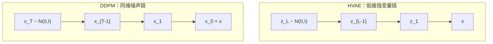
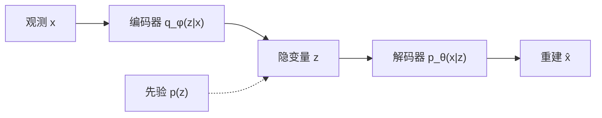

> **VAE**：Diederik P. Kingma, Max Welling. [*Auto-Encoding Variational Bayes*](https://arxiv.org/abs/1312.6114). ICLR 2014.

生成模型学习数据分布 $p_{\mathrm{data}}(x)$，从中采样新样本。**变分自编码器 (VAE)** 用隐变量 $z$ 建模 $p_\theta(x)$，通过**变分推断**引入近似后验 $q_\phi(z|x)$，以 **ELBO**（证据下界）作为训练目标——将难解的 $\log p_\theta(x)$ 与后验推断转化为可梯度优化的下界，并用 **重参数化技巧** 使 $q_\phi$ 采样可反传。本文给出完整数学推导，并经由 **HVAE** 过渡到 **[DDPM]()** 的层次隐变量视角。延伸阅读：[Score Matching]()、[DDIM]().

---

## 1. 生成模型：问题与范式

### 1.1 目标

观测 $x \in \mathbb{R}^d$（图像、文本嵌入等），假设 $x \sim p_{\mathrm{data}}(x)$。生成模型希望：

1. **密度估计**：学习 $p_\theta(x) \approx p_{\mathrm{data}}(x)$；
2. **采样**：从 $p_\theta$ 快速抽取新 $x$；
3. **推断**（可选）：对新 $x$ 估计隐表示或后验。

给定有限样本 $\{x^{(i)}\}_{i=1}^n$，通常最大化对数似然：

$$
\theta^\star = \arg\max_\theta \sum_{i=1}^n \log p_\theta\!\left(x^{(i)}\right)
\quad \Leftrightarrow \quad
\max_\theta \; \mathbb{E}_{p_{\mathrm{data}}(x)}[\log p_\theta(x)].
$$

高维 $x$ 下直接参数化 $p_\theta(x)$ 困难（归一化常数、多模态）。主流思路：

| 范式 | 核心想法 | 代表 |
| :--- | :--- | :--- |
| **显式密度** | 可算 $p_\theta(x)$ | 标准化流、自回归 |
| **隐变量模型** | $p_\theta(x)=\int p_\theta(x|z)p(z)\,dz$ | **VAE**、扩散模型 |
| **隐式模型** | 只采样 $x=g_\theta(z)$，无密度 | GAN |
| **得分模型** | 学 $\nabla_x\log p(x)$ | Score Matching、扩散 |

### 1.2 推前映射视角

另一等价表述：选简单基分布 $p_0$（常为标准高斯 $\mathcal{N}(0,I_d)$），学习映射 $T_\theta:\mathbb{R}^m\to\mathbb{R}^d$，使 $T_\theta(z)$ 的分布接近 $p_{\mathrm{data}}$，其中 $z\sim p_0$。VAE 中 $T_\theta$ 即解码器 $\mu_\theta(z)$（或从 $p_\theta(x|z)$ 采样）；GAN 中 $T_\theta=G_\theta$。**无条件生成**学边缘分布 $p(x)$；**条件生成**学 $p(x\mid y)$（类标签、文本等），VAE/GAN/扩散均有条件扩展（CVAE、CGAN、classifier guidance 等）。

### 1.3 三大实践挑战

在有限样本 $\{x^{(i)}\}_{i=1}^n$ 下，生成模型通常需同时兼顾：

1. **快速采样**（推理效率）；
2. **高质量样本**（逼真度）；
3. **模式覆盖**（避免模式坍塌，多样性接近 $p_{\mathrm{data}}$）。

VAE 走 **变分推断 + 显式 ELBO**，训练稳定但样本常偏模糊；GAN 走 **对抗博弈**，样本锐利但训练不稳。二者互补，后文经 HVAE 与扩散模型统一在层次 ELBO 框架下。

### 1.4 隐变量生成模型

引入 $z \in \mathbb{R}^m$（通常 $m \ll d$）：

$$
p_\theta(x) = \int p_\theta(x \mid z)\, p(z)\, dz,
$$

- **先验** $p(z)$：常取 $p(z)=\mathcal{N}(0,I)$；
- **似然 / 解码器** $p_\theta(x|z)$：神经网络输出分布参数（高斯、Bernoulli 等）。

**联合分布** $p_\theta(x,z)=p_\theta(x|z)p(z)$。**真实后验**：

$$
p_\theta(z \mid x) = \frac{p_\theta(x \mid z)\, p(z)}{p_\theta(x)}
$$

分母 $p_\theta(x)$ 是上述积分，一般**不可解析**——这是 VAE 需要变分近似的根源。

---

## 2. 变分推断与 ELBO 推导

**ELBO 与变分推断是什么关系？** 二者不是两件独立的事：**ELBO 就是变分推断（Variational Inference, VI）在隐变量模型里常用的优化目标**。VI 用易处理的 $q_\phi(z|x)$ 逼近难解的真实后验 $p_\theta(z|x)$；ELBO $\mathcal{L}(\theta,\phi;x)$ 则是对数证据 $\log p_\theta(x)$ 的**可计算下界**——最大化 ELBO，等价于在拟合数据的同时让 $q_\phi$ 靠近 $p_\theta(\cdot|x)$。VAE 的全称 *Auto-Encoding **Variational Bayes*** 即：**用神经网络做摊销变分推断（amortized VI）**，编码器输出 $q_\phi$，解码器参数化 $p_\theta$，联合最大化 ELBO。

### 2.0 变分推断在做什么？

贝叶斯推断关心**后验** $p_\theta(z|x)$ 与**证据** $p_\theta(x)=\int p_\theta(x,z)\,dz$。对隐变量模型，分母积分不可解析，后验也无闭式——**精确推断**不可行。

**变分推断**的做法：在变分族 $\mathcal{Q}=\{q_\phi(z|x)\}$（如对角高斯、因子分解）中选 $q_\phi$，使之尽量接近 $p_\theta(z|x)$。标准目标有两种写法，**彼此等价**：

$$
\min_{\phi}\; \mathrm{KL}\!\left(q_\phi(z|x)\,\|\,p_\theta(z|x)\right)
\quad\Longleftrightarrow\quad
\max_{\theta,\phi}\; \mathcal{L}(\theta,\phi;x).
$$

理由由 §2.3 的恒等式给出：$\log p_\theta(x)=\mathcal{L}+\mathrm{KL}(q_\phi\|p_\theta(\cdot|x))$，固定 $\theta$ 时 $\log p_\theta(x)$ 为常数，故**最小化后验 KL** 与**最大化 ELBO** 对 $\phi$ 是同一件事。

术语上：**证据 (evidence)** 指 $p_\theta(x)$；**ELBO** 即 Evidence Lower BOund，满足 $\mathcal{L}\le\log p_\theta(x)$；**变分分布** $q_\phi$ 由推断网络（编码器）输出；**摊销 VI** 指所有 $x$ 共用同一套参数 $\phi$，而非对每个 $x$ 单独优化一个 $q$。

因此：**没有 ELBO 就没有 VAE 的变分训练**；反过来说，**推导 ELBO 的 Jensen/KL 步骤就是变分推断的核心推导**。后文 §2.2–2.4 给出 ELBO 的两种等价推导与重构–KL 分解；§2.5 说明与 EM 的关系；§3 起把 $q_\phi,p_\theta$ 实例化为神经网络。

### 2.1 为何需要近似后验

训练需 $\log p_\theta(x)$，但

$$
\log p_\theta(x) = \log \int p_\theta(x,z)\, dz
$$

积分在 $z$ 上不可枚举。EM 的 E 步需要 $p_\theta(z|x)$，而它正是上式分母导致的难解对象——故用 **变分推断** 引入 $q_\phi(z|x)\approx p_\theta(z|x)$，并以 **ELBO** 为可优化目标（§2.0）。

### 2.2 推导一：Jensen 不等式（最常用）

对任意分布 $q_\phi(z|x)$（$q_\phi(z|x)>0$ 当 $p_\theta(x,z)>0$）：

$$
\begin{aligned}
\log p_\theta(x)
&= \log \int q_\phi(z|x)\, \frac{p_\theta(x,z)}{q_\phi(z|x)}\, dz \\
&= \log \mathbb{E}_{z \sim q_\phi(z|x)}\!\left[\frac{p_\theta(x,z)}{q_\phi(z|x)}\right] \\
&\ge \mathbb{E}_{z \sim q_\phi(z|x)}\!\left[\log \frac{p_\theta(x,z)}{q_\phi(z|x)}\right]
\quad \text{（Jensen：$\log$ 凹）} \\
&= \mathbb{E}_{q_\phi(z|x)}[\log p_\theta(x,z)] - \mathbb{E}_{q_\phi(z|x)}[\log q_\phi(z|x)] \\
&=: \mathcal{L}(\theta,\phi; x).
\end{aligned}
$$

$\mathcal{L}$ 称为 **证据下界 (ELBO, Evidence Lower BOund)**：$\mathcal{L} \le \log p_\theta(x)$。它既是变分推断要最大化的量（§2.0），也是 VAE 实际反传的损失（差一个负号即最小化 $-\mathcal{L}$）。

### 2.3 推导二：KL 恒等式（揭示 ELBO 结构）

将 ELBO 与后验 KL 联系起来。对任意 $q_\phi(z|x)$：

$$
\begin{aligned}
\mathrm{KL}\!\left(q_\phi(z|x) \,\|\, p_\theta(z|x)\right)
&= \mathbb{E}_{q_\phi}\!\left[\log \frac{q_\phi(z|x)}{p_\theta(z|x)}\right] \\
&= \mathbb{E}_{q_\phi}\!\left[\log \frac{q_\phi(z|x)\, p_\theta(x)}{p_\theta(x,z)}\right] \\
&= \log p_\theta(x) - \mathcal{L}(\theta,\phi;x).
\end{aligned}
$$

因 $\mathrm{KL} \ge 0$，故 $\mathcal{L} \le \log p_\theta(x)$。且

$$
\boxed{
\log p_\theta(x) = \mathcal{L}(\theta,\phi;x)
+ \mathrm{KL}\!\left(q_\phi(z|x) \,\|\, p_\theta(z|x)\right).
}
$$

- 固定 $\theta$，最大化 $\mathcal{L}$ w.r.t. $\phi$ $\Leftrightarrow$ 最小化 $\mathrm{KL}(q_\phi \| p_\theta(\cdot|x))$，即 $q_\phi$ 逼近真实后验；
- $\mathrm{KL}=0$ 时 ELBO **紧**（等于 $\log p_\theta(x)$）。

### 2.4 ELBO 的重构–正则分解

利用 $p_\theta(x,z)=p_\theta(x|z)p(z)$：

$$
\begin{aligned}
\mathcal{L}(\theta,\phi;x)
&= \mathbb{E}_{q_\phi(z|x)}[\log p_\theta(x|z)]
+ \mathbb{E}_{q_\phi(z|x)}[\log p(z)]
- \mathbb{E}_{q_\phi(z|x)}[\log q_\phi(z|x)] \\
&= \underbrace{\mathbb{E}_{q_\phi(z|x)}[\log p_\theta(x|z)]}_{\text{重构项}}
- \underbrace{\mathrm{KL}\!\left(q_\phi(z|x) \,\|\, p(z)\right)}_{\text{正则项}}.
\end{aligned}
$$

| 项 | 含义 |
| :--- | :--- |
| $\mathbb{E}[\log p_\theta(x|z)]$ | 从 $z$ **重建** $x$ 的期望对数似然 |
| $\mathrm{KL}(q_\phi \| p)$ | 编码分布 $q_\phi(z|x)$ 贴近先验 $p(z)$ |

**训练目标**（对数据集平均）：

$$
\max_{\theta,\phi}\; \mathbb{E}_{p_{\mathrm{data}}(x)}\bigl[\mathcal{L}(\theta,\phi;x)\bigr].
$$

等价于最大化 ELBO，同时隐式最小化每个 $x$ 上的后验 KL（当 $\phi$ 足够灵活时）。

### 2.5 与 EM 的关系

- **E 步**：$q(z|x) \leftarrow p_\theta(z|x)$（不可行 → VAE 用 $q_\phi$ 近似）；
- **M 步**：$\theta \leftarrow \arg\max_\theta \mathbb{E}_{q}[\log p_\theta(x,z)]$。

VAE 对 $\theta,\phi$ **联合**梯度上升，是 amortized variational inference：同一套 $\phi$ 处理所有 $x$，而非每个 $x$ 单独优化 $q$。

---

## 3. VAE 架构与参数化

### 3.1 编码器与解码器

- **编码器** $q_\phi(z|x)$：**推断网络**，输出 $z$ 的分布参数；
- **解码器** $p_\theta(x|z)$：**生成网络**，给定 $z$ 输出 $x$ 的分布。

常见选择：

$$
p(z) = \mathcal{N}(0, I), \qquad
q_\phi(z|x) = \mathcal{N}\!\left(z;\, \mu_\phi(x),\, \mathrm{diag}(\sigma_\phi^2(x))\right).
$$

对连续图像 $x$，常设

$$
p_\theta(x|z) = \mathcal{N}\!\left(x;\, \mu_\theta(z),\, \sigma_x^2 I\right)
\quad \text{或} \quad
\log p_\theta(x|z) = \sum_j \log \mathrm{Bernoulli}(x_j \mid \pi_{\theta,j}(z)).
$$

### 3.2 高斯似然下的重构损失

若 $p_\theta(x|z)=\mathcal{N}(\mu_\theta(z), \sigma_x^2 I)$，则

$$
\log p_\theta(x|z) = -\frac{\|x - \mu_\theta(z)\|^2}{2\sigma_x^2} + \text{const},
$$

**最大化** $\mathbb{E}[\log p_\theta(x|z)]$ $\Leftrightarrow$ **最小化** $\mathbb{E}\|x - \mu_\theta(z)\|^2$（MSE 重构）。$\sigma_x^2$ 固定时即标准 L2 重建损失。

---

## 4. 重参数化技巧（Reparameterization Trick）

### 4.1 问题

损失含期望 $\mathbb{E}_{z \sim q_\phi(z|x)}[\log p_\theta(x|z)]$。若直接采样 $z \sim q_\phi(z|x)$，$z$ 对 $\phi$ 的随机性阻断梯度（采样算子不可微）。

### 4.2 技巧

将 $z$ 写为确定性函数 + 外生噪声。对 $q_\phi(z|x)=\mathcal{N}(\mu_\phi(x), \sigma_\phi^2(x))$：

$$
z = \mu_\phi(x) + \sigma_\phi(x) \odot \epsilon, \qquad \epsilon \sim \mathcal{N}(0, I),
$$

其中 $\odot$ 为逐元素乘。于是

$$
\mathbb{E}_{q_\phi(z|x)}[f(z)]
= \mathbb{E}_{\epsilon \sim \mathcal{N}(0,I)}\!\left[f\bigl(\mu_\phi(x) + \sigma_\phi(x)\odot\epsilon\bigr)\right],
$$

梯度经 $\mu_\phi,\sigma_\phi$ **确定性**反传，$\epsilon$ 视为常数。实践中常用 $\sigma_\phi(x)=\exp\!\bigl(\tfrac{1}{2}\log\sigma_\phi^2(x)\bigr)$ 保证方差为正。

### 4.3 与策略梯度的对比

| 方法 | 梯度估计 | 方差 |
| :--- | :--- | :--- |
| **重参数化** | $\nabla_\phi \mathbb{E}_\epsilon[f(\mu+\sigma\epsilon)]$ | 低（可微路径） |
| **REINFORCE** | $f(z)\nabla_\phi\log q_\phi(z|x)$ | 高 |

VAE 选择重参数化是因为 $q_\phi$ 取连续可微分布（高斯）。

---

## 5. KL 项的闭式解

设 $q_\phi(z|x)=\mathcal{N}(\mu, \mathrm{diag}(\sigma^2))$，$p(z)=\mathcal{N}(0,I)$（各维独立）。一维情形：

$$
\mathrm{KL}\!\left(\mathcal{N}(\mu,\sigma^2) \,\|\, \mathcal{N}(0,1)\right)
= \frac{1}{2}\left(\sigma^2 + \mu^2 - 1 - \log\sigma^2\right).
$$

**推导**：

$$
\begin{aligned}
\mathrm{KL} &= \mathbb{E}_q\!\left[\log\frac{q(z)}{p(z)}\right]
= \mathbb{E}_q\!\left[-\frac{1}{2}\log(2\pi\sigma^2) - \frac{(z-\mu)^2}{2\sigma^2}
+ \frac{1}{2}\log(2\pi) + \frac{z^2}{2}\right] \\
&= -\frac{1}{2}\log\sigma^2 - \frac{1}{2}
+ \frac{\mathbb{E}_q[z^2]}{2}
= \frac{1}{2}\left(\mu^2 + \sigma^2 - 1 - \log\sigma^2\right).
\end{aligned}
$$

$d$ 维求和：

$$
\mathrm{KL}\!\left(q_\phi(z|x) \,\|\, p(z)\right)
= \frac{1}{2}\sum_{j=1}^{d}\left(\mu_j^2 + \sigma_j^2 - 1 - \log\sigma_j^2\right).
$$

此项**无需采样**，与 $\theta$ 无关，只正则编码器。

---

## 6. 完整训练目标与算法

对 mini-batch $\{x^{(i)}\}$，Monte Carlo 估计（每样本 1 次 $\epsilon$）：

$$
\mathcal{L}_{\mathrm{VAE}} \approx \frac{1}{B}\sum_{i=1}^{B}
\left[
\log p_\theta\!\left(x^{(i)} \,\big|\, \mu_\phi(x^{(i)}) + \sigma_\phi(x^{(i)})\odot\epsilon^{(i)}\right)
- \mathrm{KL}\!\left(q_\phi(z|x^{(i)}) \,\|\, p(z)\right)
\right],
$$

$\epsilon^{(i)} \sim \mathcal{N}(0,I)$。

**算法**：

1. 采样 mini-batch $x^{(i)} \sim p_{\mathrm{data}}$；
2. 编码：$\mu^{(i)} \leftarrow \mu_\phi(x^{(i)})$，$\log\sigma^{2,(i)} \leftarrow \log\sigma_\phi^2(x^{(i)})$；
3. 重参数化：$z^{(i)} \leftarrow \mu^{(i)} + \sigma^{(i)} \odot \epsilon^{(i)}$，$\epsilon^{(i)} \sim \mathcal{N}(0,I)$；
4. 解码：$\hat{x}^{(i)} \leftarrow \mu_\theta(z^{(i)})$；
5. 损失：$\mathcal{L} = \frac{1}{B}\sum_i \bigl[\text{recon}(x^{(i)}, \hat{x}^{(i)}) + \mathrm{KL}^{(i)}\bigr]$；
6. 梯度下降更新 $\theta,\phi$。

**生成**：$z \sim \mathcal{N}(0,I)$，$x \leftarrow \mu_\theta(z)$（或从 $p_\theta(x|z)$ 采样）。

---

## 7. 层次 VAE（HVAE）

单层 VAE 用**一个**低维 $z$ 概括 $x$，解码器 $p_\theta(x|z)$ 须一步完成高维生成，往往导致**模糊样本**（高斯似然 + 低维瓶颈）。**层次 VAE (Hierarchical VAE, HVAE)** 引入多层隐变量 $z_1,\ldots,z_L$，自顶向下逐层细化表示，是扩散模型的重要前驱。

### 7.1 生成模型（自顶向下）

设 $z_L$ 为最高层（最抽象），$z_1$ 最接近观测 $x$：

$$
p_\theta(x, z_{1:L})
= p(z_L)\,
\prod_{l=1}^{L-1} p_\theta(z_l \mid z_{l+1})\,
p_\theta(x \mid z_1).
\tag{7.1}
$$

- $p(z_L) = \mathcal{N}(0, I)$；
- $p_\theta(z_l \mid z_{l+1})$：高层 $z_{l+1}$ 生成低层 $z_l$（常取高斯，参数由神经网络输出）；
- $p_\theta(x \mid z_1)$：最底层 $z_1$ 生成 $x$。

边际似然：

$$
p_\theta(x) = \int p_\theta(x, z_{1:L})\, dz_{1:L}.
$$

**生成**：$z_L \sim p(z_L)$，依次采样 $z_{L-1} \sim p_\theta(z_{L-1}|z_L),\ldots,z_1 \sim p_\theta(z_1|z_2)$，最后 $x \sim p_\theta(x|z_1)$。每一层只负责**一部分**抽象程度，减轻单步解码负担。

### 7.2 推断网络（自底向上）

后验 $p_\theta(z_{1:L}|x)$ 不可解，用变分分布 $q_\phi(z_{1:L}|x)$ 近似。常用**马尔可夫**结构（由观测向上推断）：

$$
q_\phi(z_{1:L} \mid x)
= q_\phi(z_1 \mid x)\,
\prod_{l=1}^{L-1} q_\phi(z_{l+1} \mid z_l).
\tag{7.2}
$$

$q_\phi(z_1|x)$ 为编码器；$q_\phi(z_{l+1}|z_l)$ 为层间推断网络。更复杂的 HVAE（NVAE、VDVAE）还引入**自回归**或**精度矩阵**结构以加强层间依赖。

### 7.3 层次 ELBO

对联合分布应用与 §2 相同的 Jensen / KL 推导，得

$$
\log p_\theta(x)
\ge \mathbb{E}_{q_\phi(z_{1:L}|x)}\!\left[
\log \frac{p_\theta(x, z_{1:L})}{q_\phi(z_{1:L}|x)}
\right]
=: \mathcal{L}_{\mathrm{HVAE}}(\theta,\phi;x).
$$

展开后可写为**多层重构 + 多层 KL**（与单层 VAE 同构，只是变量更多）：

$$
\begin{aligned}
\mathcal{L}_{\mathrm{HVAE}}
&= \mathbb{E}_{q_\phi}\bigl[\log p_\theta(x \mid z_1)\bigr]
+ \sum_{l=1}^{L-1} \mathbb{E}_{q_\phi}\bigl[\log p_\theta(z_l \mid z_{l+1})\bigr]
+ \mathbb{E}_{q_\phi}\bigl[\log p(z_L)\bigr] \\
&\quad - \mathbb{E}_{q_\phi}\bigl[\log q_\phi(z_{1:L} \mid x)\bigr].
\end{aligned}
$$

利用 $q_\phi$ 的马尔可夫分解 (7.2)，最后一项可拆成

$$
\mathbb{E}_{q_\phi}[\log q_\phi(z_{1:L}|x)]
= \mathbb{E}_{q_\phi}[\log q_\phi(z_1|x)]
+ \sum_{l=1}^{L-1} \mathbb{E}_{q_\phi}[\log q_\phi(z_{l+1}|z_l)].
$$

与生成侧 $\log p_\theta(z_l|z_{l+1})$、$\log p(z_L)$ 配对后，ELBO 可理解为：每一层 $(z_l, z_{l+1})$ 上都有类似 VAE 的 **重构–KL 平衡**；层数 $L$ 增加 → 更细的渐进生成，但推断与训练也更重。

### 7.4 与单层 VAE 的对比

| | **VAE** | **HVAE** |
| :--- | :--- | :--- |
| 隐变量 | 单个 $z$ | $z_1,\ldots,z_L$ 链 |
| 生成 | $z \to x$ 一步 | $z_L \to \cdots \to z_1 \to x$ 多步 |
| ELBO | 1 组 recon + 1 个 KL | 多组层级 recon + 多个 KL |
| 样本质量 | 易模糊 | NVAE/VDVAE 等可接近 GAN |
| 与扩散 | — | **直接前驱**（见 §8） |

**β-VAE**（$\beta>1$ 加大 KL 权重）主要作用于单层；层次结构则通过**多尺度隐空间**实现解耦，二者可结合。

---

## 8. 从 HVAE 到 DDPM

[DDPM]() 可视为一种**特殊的层次隐变量模型**：隐变量不是低维 $z$，而是与 $x$ **同维**的噪声序列 $x_{1:T}$，且前向过程**固定、不需学习**。

### 8.1 DDPM 作为马尔可夫 HVAE

记 $x_0$ 为干净数据，$x_1,\ldots,x_T$ 为逐步加噪版本。定义**前向**（固定）转移：

$$
q(x_t \mid x_{t-1}) = \mathcal{N}\!\left(x_t;\, \sqrt{1-\beta_t}\, x_{t-1},\, \beta_t I\right),
\quad t = 1,\ldots,T.
$$

等价地，一步到位：

$$
q(x_t \mid x_0) = \mathcal{N}\!\left(x_t;\, \sqrt{\bar{\alpha}_t}\, x_0,\, (1-\bar{\alpha}_t) I\right),
\quad \bar{\alpha}_t = \prod_{s=1}^{t}(1-\beta_s).
$$

当 $T$ 足够大，$q(x_T|x_0) \approx \mathcal{N}(0,I)$：**最高层「隐变量」$x_T$ 近似标准高斯先验**，与 VAE 的 $p(z_L)=\mathcal{N}(0,I)$ 角色相同。

**生成模型**（学习逆向）：

$$
p_\theta(x_{0:T}) = p(x_T)\, \prod_{t=1}^{T} p_\theta(x_{t-1} \mid x_t),
\quad p(x_T) = \mathcal{N}(0,I).
$$

与 HVAE 对照：

| HVAE (7.1) | DDPM |
| :--- | :--- |
| $z_L \sim p(z_L)$ | $x_T \sim \mathcal{N}(0,I)$ |
| $z_l \sim p_\theta(z_l \mid z_{l+1})$ | $x_{t-1} \sim p_\theta(x_{t-1} \mid x_t)$ |
| $x \sim p_\theta(x \mid z_1)$ | 即 $t=1$ 时的 $p_\theta(x_0 \mid x_1)$ |
| 层数 $L$ 通常 $\ll$ 图像维数 | 层数 $T$ 可达数百–上千；每层与 $x$ **同维** |

### 8.2 DDPM 的变分下界（与 ELBO 同一套语言）

边际似然：

$$
p_\theta(x_0) = \int p_\theta(x_{0:T})\, dx_{1:T}.
$$

引入真实前向联合 $q(x_{1:T}|x_0) = \prod_t q(x_t|x_{t-1})$，对 $\log p_\theta(x_0)$ 做变分下界（与 §2.2 完全平行）：

$$
\begin{aligned}
\log p_\theta(x_0)
&\ge \mathbb{E}_{q(x_{1:T}|x_0)}\!\left[
\log \frac{p_\theta(x_{0:T})}{q(x_{1:T}|x_0)}
\right] \\
&= \mathbb{E}_q\!\left[\log p_\theta(x_0|x_1)\right]
- \mathrm{KL}\!\left(q(x_T|x_0) \,\|\, p(x_T)\right) \\
&\quad - \sum_{t=2}^{T} \mathrm{KL}\!\left(q(x_{t-1}|x_t,x_0) \,\|\, p_\theta(x_{t-1}|x_t)\right).
\end{aligned}
$$

- **先验匹配项** $\mathrm{KL}(q(x_T|x_0)\|p(x_T))$：$T$ 大时 $q(x_T|x_0)\approx\mathcal{N}(0,I)$，与 HVAE 中 $\mathrm{KL}(q(z_L|x)\|p(z_L))$ 类似；
- **每层去噪 KL** $\mathrm{KL}(q(x_{t-1}|x_t,x_0)\|p_\theta(x_{t-1}|x_t))$：在已知 $x_0$ 时前向后验 $q(x_{t-1}|x_t,x_0)$ **有闭式高斯解**（因前向线性高斯），故训练可化为对 $\epsilon_\theta$ 的回归——这正是 DDPM **简化损失**的来源。

Ho et al. 进一步证明，在参数化 $p_\theta(x_{t-1}|x_t)$ 为高斯且预测噪声 $\epsilon_\theta$ 时，加权 ELBO 等价于

$$
\mathcal{L}_{\mathrm{simple}}(\theta)
= \mathbb{E}_{t,\, x_0,\, \epsilon}\!\left[
\left\|\epsilon - \epsilon_\theta\!\left(\sqrt{\bar{\alpha}_t}\, x_0 + \sqrt{1-\bar{\alpha}_t}\,\epsilon,\, t\right)\right\|^2
\right],
$$

其中 $t \sim \mathcal{U}\{1,\ldots,T\}$，$x_0 \sim p_{\mathrm{data}}$，$\epsilon \sim \mathcal{N}(0,I)$。与 VAE 的「重构 $x$」不同，DDPM 每层只学**去掉一小步噪声**——任务更简单，但需 **$T$ 次**串联（训练时随机抽一层，采样时逐步执行）。

### 8.3 为何 DDPM 缓解 VAE 的模糊问题

| 问题 | **VAE / HVAE** | **DDPM** |
| :--- | :--- | :--- |
| 一步生成跨度 | $z \to x$ 或 $z_1 \to x$ 跨度大 | 每步 $x_t \to x_{t-1}$ 只去少量噪声 |
| 似然 | 常高斯解码 → MSE → 模糊 | 每步高斯**条件**于 $x_t$，逐步细化 |
| 隐变量维数 | $z$ 低维瓶颈 | $x_t$ 与 $x$ 同维，无瓶颈 |
| 前向过程 | 学习 $q_\phi(z|x)$ | **固定** $q(x_t|x_{t-1})$，推断侧简化 |

直觉：**HVAE** 用多层 $z$ 把「生成 $x$」拆成多级；**DDPM** 把同一件事拆成 $T$ 个**同维状态**上的马尔可夫去噪，前向加噪闭式可算，只学逆向。扩散模型系列（[DDIM]()、[DPM-Solver]()、Score Matching）都是在这一 **层次 ELBO + 马尔可夫链** 框架上的加速或连续化。

### 8.4 统一视角

$$
\boxed{
\text{VAE} \;\xrightarrow{\text{多层 } z}\; \text{HVAE}
\;\xrightarrow{\text{同维 } x_t,\;\text{固定前向}}\; \text{DDPM}
\;\xrightarrow{\text{连续极限}}\; \text{Score SDE / Flow}
}
$$

- **ELBO / 变分下界**贯穿始终；
- **重参数化**：VAE 对 $z$；DDPM 对前向 $x_t = \sqrt{\bar{\alpha}_t}x_0 + \sqrt{1-\bar{\alpha}_t}\epsilon$（$x_0,\epsilon$ 为外生噪声）；
- **生成**：从先验（$z_L$ 或 $x_T$）出发，沿学到的马尔可夫链走到 $x$。

---

## 9. β-VAE 与单层 VAE 局限

**β-VAE** 将 KL 加权：$\mathcal{L}_\beta = \mathbb{E}[\log p_\theta(x|z)] - \beta\,\mathrm{KL}(q_\phi\|p)$，$\beta>1$ 促进**解耦**表示，但可能牺牲重建质量。

| 优点 | 局限 |
| :--- | :--- |
| 训练稳定（单目标、无对抗） | 样本常偏模糊（高斯似然 + MSE） |
| 有显式 $p(z)$、可插值 | ELBO 松弛，$p_\theta(x)$ 可能偏弱 |
| 编码器给出近似后验 | 单层 $z$ 瓶颈；→ 用 **HVAE / DDPM** 分层缓解 |

**自编码器 (AE)** 无概率建模；**GAN** 样本锐利但无密度、训练不稳定（详见 [生成模型与 GAN]()）。

---

## 10. 延伸阅读：Score Matching

**得分函数** $\nabla_x \log p_{\mathrm{data}}(x)$ 指向概率密度增长最快的方向，是定义在数据空间上的向量场。**Score Matching** 训练网络 $s_\theta(x)\approx\nabla_x\log p_{\mathrm{data}}(x)$，无需归一化常数；与扩散模型的逆向 SDE 直接相关（得分即噪声预测的变体）。DDPM 可视为在层次 ELBO 框架上学习各时刻得分。

> 详见 [Score Matching：基于得分的生成模型]().

---

## 11. 附录：生成质量指标 FID

**FID（Fréchet Inception Distance）** 衡量生成图像与真实图像在 Inception 特征空间中的分布距离。设真实/生成特征分别为 $\mathcal{N}(\mu_r,\Sigma_r)$、$\mathcal{N}(\mu_g,\Sigma_g)$，则

$$
\mathrm{FID} = \|\mu_r - \mu_g\|^2
+ \mathrm{Tr}\!\left(\Sigma_r + \Sigma_g - 2(\Sigma_r \Sigma_g)^{1/2}\right).
$$

FID 越小，生成分布越接近真实分布。常用于比较 VAE、GAN、扩散模型；需注意对样本量与特征提取器敏感。

---

## 12. 小结

**逻辑链**：

$$
\underbrace{\max_\theta \log p_\theta(x)}_{\text{难解}}
\;\Rightarrow\;
\underbrace{\max_{\theta,\phi} \mathcal{L}}_{\text{ELBO}}
= \mathbb{E}_{q_\phi}[\log p_\theta(x|z)]
- \mathrm{KL}(q_\phi \| p)
$$

重参数化使 $\mathcal{L}$ 对 $\phi$ 可微，端到端训练。**VAE → HVAE → DDPM** 是同一变分生成框架下「逐层细化」的深化：隐变量从低维 $z$ 到多层 $z_{1:L}$，再到与数据同维的噪声链 $x_{1:T}$，最终引出扩散模型全套工具。

---

## 参考文献

- Kingma & Welling, *Auto-Encoding Variational Bayes*, ICLR 2014.
- Rezende et al., *Stochastic Backpropagation and Approximate Inference in Deep Generative Models*, ICML 2014.
- Blei et al., *Variational Inference: A Review for Statisticians*, JASA 2017.
- Higgins et al., *β-VAE*, ICLR 2017.
- Vahdat & Kautz, *NVAE: A Deep Hierarchical Variational Autoencoder*, NeurIPS 2020.
- Child, *Very Deep VAEs Generalize Autoregressive Models and Can Outperform Them on Images*, ICLR 2021 (VDVAE).
- Ho et al., *Denoising Diffusion Probabilistic Models*, NeurIPS 2020.
- Sohl-Dickstein et al., *Deep Unsupervised Learning using Nonequilibrium Thermodynamics*, ICML 2015（扩散 ELBO 早期形式）.
