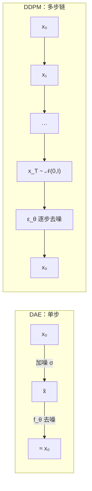

<<<<<<< HEAD
DDPM 是一个马尔可夫链模型。如图，一滴液体在水中扩散，就像在一张干净的图上不断加噪——前向过程逐步将数据分布转化为纯噪声，逆向过程则学习从噪声中还原数据。
=======
> **论文**：Jonathan Ho, Ajay Jain, Pieter Abbeel. [*Denoising Diffusion Probabilistic Models*](https://arxiv.org/abs/2006.11239). NeurIPS 2020.  
> **前置**：[生成模型与 VAE]()（§8 从 HVAE 到 DDPM）· **下一篇**：[DDIM]()

DDPM 是一个马尔可夫链模型：前向过程逐步加噪，将数据分布变为纯噪声；逆向过程学习逐步去噪，从噪声生成数据。直观上像一滴墨在水中扩散——只不过我们**学会**把过程倒放回来。

**阅读路线**：§1 DAE 动机 → §2 前向加噪 → §3 逆向去噪 → §4 训练（ELBO → 简化损失）→ §5 连续时间视角。
>>>>>>> cc24ea76 (DDIM补充)


## 符号约定

<<<<<<< HEAD
### 1.1 随机微分方程（SDE）表示

DDPM 的前向加噪过程可以视为如下**伊藤（Itô）随机微分方程（SDE）**的解：

$$
dx_t = f(x_t, t) dt + g(t) dw_t
$$

其中 **$w_t$ 是标准维纳过程（Wiener Process）**，$f$ 为漂移系数（向量函数），$g$ 为扩散系数（标量函数）。$p_T$ 是先验分布。

### 1.2 离散化：马尔可夫链形式

DDPM 将**连续 SDE 离散化为一串马尔可夫链**。给定数据分布 $x_0 \sim q(x_0)$，前向过程按以下方式逐步加噪：

$$
q(x_t | x_{t-1}) = \mathcal{N}\left(x_t; \sqrt{1 - \beta_t}\, x_{t-1}, \beta_t I\right)
$$

其中 **$\beta_t \in (0, 1)$ 是方差调度（variance schedule）**，控制每步加入的噪声量。由马尔可夫性和高斯分布的可加性，可以直接从 $x_0$ 采样任意时刻 $x_t$：

$$
x_t = \sqrt{\bar{\alpha}_t}\, x_0 + \sqrt{1 - \bar{\alpha}_t}\, \epsilon, \quad \epsilon \sim \mathcal{N}(0, I)
$$

其中 
$$
\alpha_t = 1 - \beta_t，\bar{\alpha}_t = \prod_{s=1}^t \alpha_s
$$

对应的条件分布为：

$$
q(x_t | x_0) = \mathcal{N}\left(x_t; \sqrt{\bar{\alpha}_t}\, x_0, (1 - \bar{\alpha}_t)I\right)
$$
=======
| 符号 | 含义 |
| :--- | :--- |
| $x_0 \sim q(x_0)$ | 干净数据 |
| $x_1,\ldots,x_T$ | 与 $x_0$ 同维的逐步加噪版本 |
| $\beta_t$ | 第 $t$ 步噪声方差，$\beta_t \in (0,1)$ |
| $\alpha_t = 1-\beta_t$ | 第 $t$ 步**信号保留率** |
| $\bar\alpha_t = \prod_{s=1}^t \alpha_s$ | **累积**保留率 |
| $\epsilon,\epsilon_t$ | 标准正态 $\mathcal{N}(0,I)$，彼此独立 |
| $q(\cdot)$ | 固定前向（推断分布，不训练） |
| $p_\theta(\cdot)$ | 学习逆向（生成分布） |
>>>>>>> cc24ea76 (DDIM补充)

当 $T \to \infty$ 时，

$$
\bar{\alpha}_T \to 0，x_T \sim \mathcal{N}(0, I)
$$

---

## 1. 从去噪自编码器（DAE）说起

### 1.1 去噪自编码器在做什么？

**去噪自编码器 (Denoising Autoencoder, DAE)** 的思路很直接：人为破坏输入，再让网络把它修回来。

1. 取干净样本 $x_0 \sim q(x_0)$；
2. **加噪**得到 $\tilde{x}$（例如 $\tilde{x} = x_0 + \sigma \epsilon$，$\epsilon \sim \mathcal{N}(0,I)$）；
3. 训练网络 $f_\theta$，使 $f_\theta(\tilde{x}) \approx x_0$。

等价地，常令网络**预测噪声** $\epsilon_\theta(\tilde{x}) \approx \epsilon$，损失为

$$
\mathcal{L}_{\mathrm{DAE}} = \mathbb{E}_{x_0,\epsilon}\bigl[\|x_0 - f_\theta(\tilde{x})\|^2\bigr]
= \mathbb{E}\bigl[\|\epsilon - \epsilon_\theta(\tilde{x})\|^2\bigr].
$$

<<<<<<< HEAD
其中 **$\bar{w}_t$ 是反向时间的标准维纳过程**，$dt$ 为负无穷小时间步。一旦知道每个边缘分布的得分函数 $\nabla_x \log p_t(x_t)$，便可模拟逆过程。
=======
DAE 学的是：**在给定噪声水平下，如何从损坏的观测恢复干净数据**。它并不直接给出 $p(x_0)$ 的采样器，但已经抓住了扩散模型的核心技能——**去噪**。
>>>>>>> cc24ea76 (DDIM补充)

### 1.2 与得分（score）的联系

Vincent (2011) 指出：在加性高斯噪声下，最优去噪方向与数据分布的**得分函数** $\nabla_x \log p(x)$ 相关。小噪声时，去噪残差 $x_0 - f_\theta(\tilde{x})$ 近似沿着 $\nabla_x \log p(x)$ 方向——这与 [Score Matching]() 一脉相承：**学会去噪 ≈ 学会分布的局部结构**。

### 1.3 单步 DAE 为何不够生成？

<<<<<<< HEAD
其中 $\mu_\theta$ 通过神经网络预测。利用 $x_t = \sqrt{\bar{\alpha}_t} x_0 + \sqrt{1-\bar{\alpha}_t}\epsilon$

可将 $\mu_\theta$ 重参数化为噪声预测形式：
$$
\mu_\theta(x_t, t) = \frac{1}{\sqrt{\alpha_t}} \left(x_t - \frac{\beta_t}{\sqrt{1-\bar{\alpha}_t}} \epsilon_\theta(x_t, t)\right)
$$
=======
| 问题 | 说明 |
| :--- | :--- |
| **固定噪声水平** | 一个 DAE 通常只对应一种 $\sigma$；生成要从**纯噪声**出发，噪声强度与训练时不一致 |
| **没有「路线图」** | 从 $\mathcal{N}(0,I)$ 一步跳到 $p(x_0)$ 太难；需要**多步、渐进去噪** |
| **缺少生成概率模型** | DAE 是判别式映射 $\tilde{x}\mapsto x_0$，没有显式定义 $p_\theta(x_0)$ 与采样链 |

**扩散模型的回答**：
>>>>>>> cc24ea76 (DDIM补充)

- **前向**：设计一条固定的、可解析的**加噪链** $x_0 \to x_1 \to \cdots \to x_T$，终点 $x_T \approx \mathcal{N}(0,I)$；
- **逆向**：把 DAE 推广为**一族**去噪器 $\epsilon_\theta(x_t, t)$，在每个时间步 $t$ 都能从当前噪声图预测噪声；
- **生成**：从 $x_T \sim \mathcal{N}(0,I)$ 出发，反复调用 $\epsilon_\theta(\cdot,t)$ **逐步去噪**，得到 $x_0$。

于是：**DAE = 单时刻去噪；DDPM = 多时刻去噪 + 固定前向加噪 + 变分/得分训练**。下面先形式化「加噪链」，再定义可学习的「去噪链」。



### 1.4 与层次 VAE 的关系（直觉）

[生成模型与 VAE]() §8 指出：DDPM 可看作**马尔可夫 HVAE**——隐变量不是低维 $z$，而是与 $x$ **同维**的链 $x_{1:T}$；前向 $q(x_t|x_{t-1})$ **固定不训练**，只学逆向 $p_\theta(x_{t-1}|x_t)$。最高层 $x_T \approx \mathcal{N}(0,I)$ 扮演 VAE 先验 $p(z)$ 的角色；每层任务从「一步解码 $z\to x$」变成「一小步去噪 $x_t\to x_{t-1}$」，从而缓解模糊。

---

<<<<<<< HEAD


## 3. 训练目标
=======
## 2. 前向扩散过程（Forward Process）
>>>>>>> cc24ea76 (DDIM补充)

### 2.1 随机微分方程（SDE）表示

连续极限下，前向加噪可写为伊藤 SDE：

$$
dx_t = f(x_t, t)\, dt + g(t)\, dw_t,
$$

其中 $w_t$ 为标准维纳过程，$f$ 为漂移，$g$ 为扩散系数。DDPM 对应 **Variance Preserving (VP)** 型：信号方差在加噪过程中大致保持（见 §5）。离散版即下面马尔可夫链。

### 2.2 离散化：马尔可夫链

给定 $x_0 \sim q(x_0)$，**一步加噪**：

$$
q(x_t \mid x_{t-1}) = \mathcal{N}\!\left(x_t;\, \sqrt{1 - \beta_t}\, x_{t-1},\, \beta_t I\right).
$$

<<<<<<< HEAD
其中 $t \sim \mathcal{U}\{1, T\}$，$x_0 \sim q(x_0)$，$\epsilon \sim \mathcal{N}(0, I)$。

这是 DDPM 实际使用的损失函数——简单、稳定、有效。


=======
**逐项解读**：

| 量 | 含义 |
| :--- | :--- |
| $\sqrt{1-\beta_t}\,x_{t-1}$ | 保留上一时刻信号的比例 $\sqrt{\alpha_t}$ |
| $\beta_t I$ | 本步注入的高斯噪声方差 |
| 马尔可夫性 | $x_t$ 只依赖 $x_{t-1}$，与 $x_{t-2},\ldots,x_0$ 无关 |

$\beta_t$ 是**方差调度 (variance schedule)**：可看作 DAE 里噪声强度 $\sigma$ 的离散时间表。常用线性调度 $\beta_1=10^{-4}\to\beta_T=0.02$，或余弦调度。

### 2.3 「套娃」：任意时刻的边缘分布

递推代入 $x_{t-1}, x_{t-2},\ldots$ 的表达式，交叉项期望为 0，系数平方和为 $\bar\alpha_t$，得**一步到位**采样（训练时极重要）：

$$
x_t = \sqrt{\bar{\alpha}_t}\, x_0 + \sqrt{1 - \bar{\alpha}_t}\, \epsilon, \quad \epsilon \sim \mathcal{N}(0, I),
$$

$$
q(x_t \mid x_0) = \mathcal{N}\!\left(x_t;\, \sqrt{\bar{\alpha}_t}\, x_0,\, (1 - \bar{\alpha}_t) I\right).
$$

**解读**：

- $\sqrt{\bar\alpha_t}\,x_0$：**信号分量**，随 $t$ 增大而衰减；
- $\sqrt{1-\bar\alpha_t}\,\epsilon$：**噪声分量**，随 $t$ 增大而主导；
- 当 $T$ 足够大、$\bar\alpha_T \approx 0$ 时，$x_T \approx \mathcal{N}(0,I)$。

> **注**：严格极限 $T\to\infty$ 才使边缘**精确**等于 $\mathcal{N}(0,I)$；有限 $T$ 是工程近似。

**训练意义**：不必模拟 $t$ 步链，对随机 $t$ 可直接用 $(x_0,\epsilon)$ 构造 $x_t$——这是 DDPM 训练高效的关键。
>>>>>>> cc24ea76 (DDIM补充)


## 3. 逆向去噪过程（Reverse Process）

<<<<<<< HEAD
DDPM 可视为 **Variance Preserving（VP）SDE** 的一种离散化：
=======
### 3.1 生成模型：马尔可夫链

边际似然：
>>>>>>> cc24ea76 (DDIM补充)

$$
p_\theta(x_0) = \int p_\theta(x_{0:T})\, dx_{1:T}, \qquad
p_\theta(x_{0:T}) = p(x_T)\,\prod_{t=1}^{T} p_\theta(x_{t-1} \mid x_t),
$$

其中 $p(x_T)=\mathcal{N}(0,I)$。**生成**从 $x_T$ 采样，再按 $t=T,T-1,\ldots,1$ 串行去噪。

### 3.2 逆向 SDE（连续视角）

Anderson (1982)：前向 SDE 的逆过程为

$$
dx_t = \bigl[f(x_t,t) - g(t)^2 \nabla_x \log p_t(x_t)\bigr]\, dt + g(t)\, d\bar{w}_t,
$$

其中 $\nabla_x \log p_t(x_t)$ 为**得分函数**。离散 DDPM 用神经网络学各时刻得分（等价于学 $\epsilon_\theta$），再模拟逆过程。

### 3.3 真后验 $q(x_{t-1}\mid x_t, x_0)$

训练时有 $x_0$，可对 Bayes 加条件。马尔可夫性使 $q(x_t\mid x_{t-1},x_0)=q(x_t\mid x_{t-1})$，三项皆为高斯，**完成平方**得闭式后验：

$$
q(x_{t-1}\mid x_t, x_0) = \mathcal{N}\!\left(x_{t-1};\, \tilde\mu_t(x_t,x_0),\, \tilde\beta_t I\right),
$$

$$
\tilde\mu_t = \frac{\sqrt{\bar\alpha_{t-1}}\,\beta_t}{1-\bar\alpha_t}\, x_0
+ \frac{\sqrt{\alpha_t}\,(1-\bar\alpha_{t-1})}{1-\bar\alpha_t}\, x_t,
\qquad
\tilde\beta_t = \frac{1-\bar\alpha_{t-1}}{1-\bar\alpha_t}\,\beta_t.
$$

**含义**：$\tilde\mu_t$ 是 $x_0$ 与 $x_t$ 的**凸组合**（系数和为 1）——在已知干净图与当前噪声图时，对 $x_{t-1}$ 的最优估计。代入 $x_t=\sqrt{\bar\alpha_t}x_0+\sqrt{1-\bar\alpha_t}\epsilon$ 得

$$
\tilde\mu_t = \frac{1}{\sqrt{\alpha_t}}\left(x_t - \frac{\beta_t}{\sqrt{1-\bar\alpha_t}}\,\epsilon\right).
$$

这是 DDPM 用 $\epsilon_\theta$ 参数化均值的来源：**把未知 $\epsilon$ 换成网络预测**。

### 3.4 学习逆向：噪声预测参数化

逆向过程是前向的「倒放」。设

$$
p_\theta(x_{t-1} \mid x_t) = \mathcal{N}\!\left(x_{t-1};\, \mu_\theta(x_t, t),\, \Sigma_\theta(x_t, t)\right).
$$

Ho et al. 取 $\mu_\theta$ 为真后验形式，把 $\epsilon$ 换为 $\epsilon_\theta(x_t,t)$：

$$
\mu_\theta(x_t, t) = \frac{1}{\sqrt{\alpha_t}} \left(x_t - \frac{\beta_t}{\sqrt{1-\bar\alpha_t}} \epsilon_\theta(x_t, t)\right).
$$

**为何预测 $\epsilon$ 而非直接预测 $x_0$？**

1. 与 ELBO 中 KL 项的自然参数化一致；
2. 不同 $t$ 下 $\epsilon$ 与 $x_t$ 尺度更匹配，训练更稳；
3. 等价地可预测 $\hat x_0=(x_t-\sqrt{1-\bar\alpha_t}\epsilon_\theta)/\sqrt{\bar\alpha_t}$，三种目标在理想网络下等价。

### 3.5 采样过程

从 $x_T \sim \mathcal{N}(0, I)$ 出发：

$$
x_{t-1} = \frac{1}{\sqrt{\alpha_t}} \left(x_t - \frac{\beta_t}{\sqrt{1-\bar\alpha_t}} \epsilon_\theta(x_t, t)\right) + \sigma_t z, \quad z \sim \mathcal{N}(0, I).
$$

| $\sigma_t$ 取法 | 说明 |
| :--- | :--- |
| $\sigma_t^2 = \beta_t$ | 与前向方差一致 |
| $\sigma_t^2 = \tilde\beta_t$ | 后验方差（常用，论文默认） |
| $\sigma_t = 0$ | 确定性去噪 → [DDIM]() |

**解读**：第一项是「去噪后的均值」；第二项 $+\sigma_t z$ 注入随机性，使逆向成为 SDE 而非 ODE。采样必须**逐步**执行 $T$ 次（DDIM 可跳步）。

```mermaid
flowchart TB
  subgraph train ["训练（单步随机 t）"]
    x0["x₀ ~ 数据"] -->|式 (4) 加噪| xt["x_t"]
    xt --> loss["‖ε - ε_θ(x_t,t)‖²"]
  end
  subgraph sample ["采样（T 步串行）"]
    xT["x_T ~ 𝒩(0,I)"] --> denoise["x_{T-1} … x₀"]
    denoise --> out["生成 x₀"]
  end
```


## 1. 从 DDPM 到 DDIM

DDIM 的核心贡献是提出了一族非马尔可夫的扩散过程，其边缘分布与 DDPM 完全相同，但可以以更少的步数完成生成——**1000 步的 DDPM 效果，DDIM 只需 50-100 步**。

### 1.1 DDPM 的局限

DDPM 的逆向过程依赖于马尔可夫性质，每步去噪后需添加随机噪声以保证质量。这意味着：

- 采样步数必须接近训练步数（通常 $T = 1000$），否则质量骤降
- 生成过程是随机的，无法控制隐变量

DDIM 不需要按 $t = T, T-1, \ldots, 1$ 依次采样，而是可以从 $\{1,\ldots,T\}$ 中选取任意长度为 $S$ ($S \ll T$) 的子序列，按降序采样即可。例如取 $S=50$ 步均匀等间隔的时间步。

DDIM（$\sigma=0$）可视为概率流 ODE 的 Euler 离散化。DPM-Solver 论文进一步证明了 DDIM 是一阶 DPM-Solver 的特例，其优越性来源于充分利用了扩散 ODE 的半线性结构。

### 1.2 非马尔可夫前向过程

DDIM 定义了一族**非马尔可夫**的前向过程，其核心是与 DDPM 共享边缘分布 $q(x_t | x_0)$。

对于任意序列 $\sigma = (\sigma_1, \ldots, \sigma_T)$，有：
$$
q_\sigma(x_{1:T} | x_0) = q_\sigma(x_T | x_0) \prod_{t=2}^T q_\sigma(x_{t-1} | x_t, x_0)
$$

其中：

$$
q_\sigma(x_{t-1} | x_t, x_0) = \mathcal{N}\left(\sqrt{\bar{\alpha}_{t-1}} x_0 + \sqrt{1 - \bar{\alpha}_{t-1} - \sigma_t^2} \cdot \frac{x_t - \sqrt{\bar{\alpha}_t} x_0}{\sqrt{1 - \bar{\alpha}_t}}, \sigma_t^2 I\right)
$$

### 1.3 生成过程

利用噪声预测网络 $\epsilon_\theta$ 估计 $x_0$：

$$
\hat{x}_0 = \frac{x_t - \sqrt{1 - \bar{\alpha}_t} \epsilon_\theta(x_t, t)}{\sqrt{\bar{\alpha}_t}}
$$

然后朝 $\hat{x}_0$ 方向更新，同时可选地注入噪声 $\sigma_t$：

$$
x_{t-1} = \sqrt{\bar{\alpha}_{t-1}} \hat{x}_0 + \sqrt{1 - \bar{\alpha}_{t-1} - \sigma_t^2} \epsilon_\theta(x_t, t) + \sigma_t z
$$

其中 $z \sim \mathcal{N}(0, I)$。

---

<<<<<<< HEAD
## 2. 确定性版本（$\sigma_t = 0$）

当 $\sigma_t = 0$（对所有 $t$），采样过程变为**完全确定性的**：

$$
x_{t-1} = \sqrt{\bar{\alpha}_{t-1}} \left(\frac{x_t - \sqrt{1 - \bar{\alpha}_t} \epsilon_\theta(x_t, t)}{\sqrt{\bar{\alpha}_t}}\right) + \sqrt{1 - \bar{\alpha}_{t-1}} \epsilon_\theta(x_t, t)
$$

这就是 DDIM 最常用的形式——**给定了初始噪声 $x_T$，生成结果是确定的**。这意味着：

- $x_T$ 扮演隐编码（latent code）的角色，可以用于插值、编辑
- 采样步数可从 1000 降至 50-100，大幅加速

=======
## 4. 训练目标

训练时**已知** $x_0$：随机 $t$，按前向公式人造 $x_t$，让 $\epsilon_\theta$ 预测所加噪声——与 §1.1 的 DAE 损失同形，只是 $t$ 随机、强度由 $\bar\alpha_t$ 调度。

### 4.1 变分下界（ELBO）

引入固定前向联合 $q(x_{1:T}|x_0)=\prod_t q(x_t|x_{t-1})$，对 $\log p_\theta(x_0)$ 做 Jensen 下界（与 VAE 完全平行）：

$$
\mathbb{E}[-\log p_\theta(x_0)]
\le \mathbb{E}_{q(x_{0:T})}\!\left[\log \frac{p_\theta(x_{0:T})}{q(x_{1:T}|x_0)}\right]
=: -\mathcal{L}_{\mathrm{ELBO}}.
$$

展开为（标准扩散 ELBO 分解）：

$$
\mathcal{L}_{\mathrm{ELBO}}
= \mathbb{E}_q\Bigl[
\underbrace{\mathrm{KL}(q(x_T|x_0)\|p(x_T))}_{L_T}
+ \sum_{t=2}^{T} \underbrace{\mathrm{KL}(q(x_{t-1}|x_t,x_0)\|p_\theta(x_{t-1}|x_t))}_{L_{t-1}}
- \underbrace{\log p_\theta(x_0|x_1)}_{L_0}
\Bigr].
$$

| 项 | 含义 |
| :--- | :--- |
| $L_T$ | 终点 $x_T$ 是否接近 $\mathcal{N}(0,I)$；$T$ 大时自动小 |
| $L_{t-1}$ | 每步逆向 KL：学得的 $p_\theta$ 是否匹配真后验 $q(x_{t-1}|x_t,x_0)$ |
| $L_0$ | 最后一步重建 $x_0$ |

**关键**：$q(x_{t-1}|x_t,x_0)$ 有闭式高斯（§3.3），且 $p_\theta$ 也取高斯时，$L_{t-1}$ 化为 $\|\tilde\mu_t-\mu_\theta\|^2$ 的加权形式 → 噪声预测 MSE。

### 4.2 从 KL 到噪声 MSE（概要）

对 $t>1$，设 $p_\theta(x_{t-1}|x_t)=\mathcal{N}(\mu_\theta,\sigma_t^2 I)$，则

$$
\mathbb{E}\bigl[\mathrm{KL}(q(x_{t-1}|x_t,x_0)\|p_\theta)\bigr]
\propto \mathbb{E}\!\left[\frac{\|\tilde\mu_t-\mu_\theta\|^2}{\sigma_t^2}\right].
$$

代入 $\mu_\theta$ 的 $\epsilon_\theta$ 形式与 $x_t=\sqrt{\bar\alpha_t}x_0+\sqrt{1-\bar\alpha_t}\epsilon$，得

$$
\|\tilde\mu_t-\mu_\theta\|^2
\propto \|\epsilon-\epsilon_\theta(x_t,t)\|^2.
$$

不同 $\sigma_t$、$\gamma_t$ 只改变各 $t$ 的权重；Ho et al. 进一步取**均匀权重**得简化目标。

### 4.3 简化目标 $\mathcal{L}_{\mathrm{simple}}$

$$
\mathcal{L}_{\text{simple}}(\theta) = \mathbb{E}_{t, x_0, \epsilon} \left[ \|\epsilon - \epsilon_\theta(\sqrt{\bar\alpha_t} x_0 + \sqrt{1-\bar\alpha_t}\epsilon, t)\|^2 \right],
$$

其中 $t \sim \mathcal{U}\{1, T\}$，$x_0 \sim q(x_0)$，$\epsilon \sim \mathcal{N}(0, I)$。

**实践解读**：

- 每个 batch：抽 $t$、抽 $x_0$、抽 $\epsilon$ → 构造 $x_t$ → 回归 $\epsilon$；
- **训练 = 在所有噪声水平上做 DAE**，共享同一网络 $\epsilon_\theta(\cdot,t)$；
- 与完整 ELBO 相比略去部分权重，但训练更稳、实现更简单，效果相当。

---

## 5. 连续时间：VP-SDE

DDPM 离散链是如下 VP-SDE 的 Euler–Maruyama 离散化：

$$
dx_t = -\frac{1}{2}\beta(t)\, x_t\, dt + \sqrt{\beta(t)}\, dw_t.
$$

| 连续量 | 离散对应 |
| :--- | :--- |
| $\beta(t)$ | $\beta_t$ |
| 漂移 $-\frac{1}{2}\beta(t)x_t$ | 均值缩放 $\sqrt{1-\beta_t}$ |
| 扩散 $\sqrt{\beta(t)}$ | 噪声 $\sqrt{\beta_t}$ |

**Variance Preserving**：边缘方差 $\mathrm{Var}(x_t)\approx 1$ 在 VP 调度下大致保持。$\beta(t)$ 线性增长时，分布从 $p(x_0)$ 平滑过渡到 $\mathcal{N}(0,I)$——§1 的多步加噪在极限下变成连续扩散。逆向则对应带得分项的 SDE；[Score Matching]() 与 [DDIM]()（$\sigma=0$ 的 ODE）都是这一框架的延伸。

---

## 6. 小结

| 阶段 | 做什么 | 是否训练 |
| :--- | :--- | :--- |
| 前向 $q(x_t|x_{t-1})$ | 逐步加噪至 $x_T\approx\mathcal{N}(0,I)$ | **固定** |
| 训练 $\epsilon_\theta$ | 各 $t$ 上预测噪声（DAE） | **学习** |
| 逆向 $p_\theta(x_{t-1}|x_t)$ | 从 $x_T$ 逐步去噪生成 $x_0$ | 用训好的 $\epsilon_\theta$ |

**加速方向**：DDIM 改逆向为确定性 ODE 并跳步；DPM-Solver 用高阶 ODE 求解器——二者训练目标与 DDPM **相同**。

---

## 参考文献

- Ho et al., *Denoising Diffusion Probabilistic Models*, NeurIPS 2020.
- Sohl-Dickstein et al., *Deep Unsupervised Learning using Nonequilibrium Thermodynamics*, ICML 2015.
- Vincent, *A Connection Between Score Matching and Denoising Autoencoders*, Neural Computation 2011.
- Anderson, *Reverse-Time Diffusion Equation Models*, Stochastic Processes and their Applications 1982.
- Song et al., *Score-Based Generative Modeling through SDEs*, ICLR 2021.

---

> 下一篇：[DDIM：隐式确定性采样加速]()
>>>>>>> cc24ea76 (DDIM补充)
