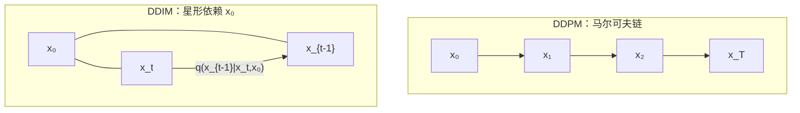
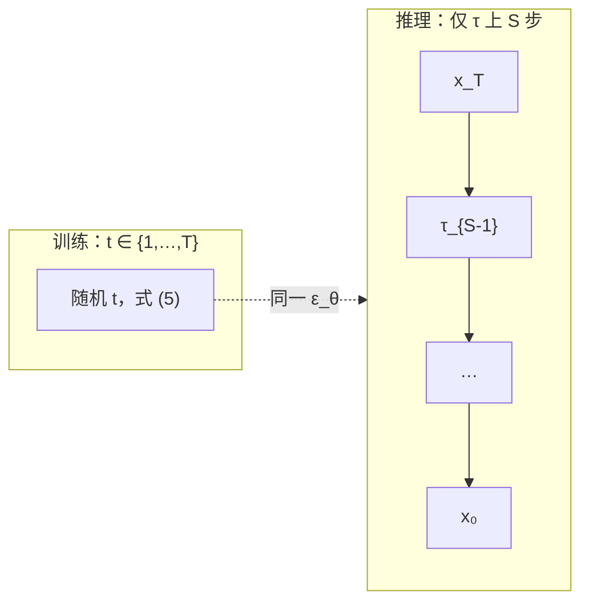
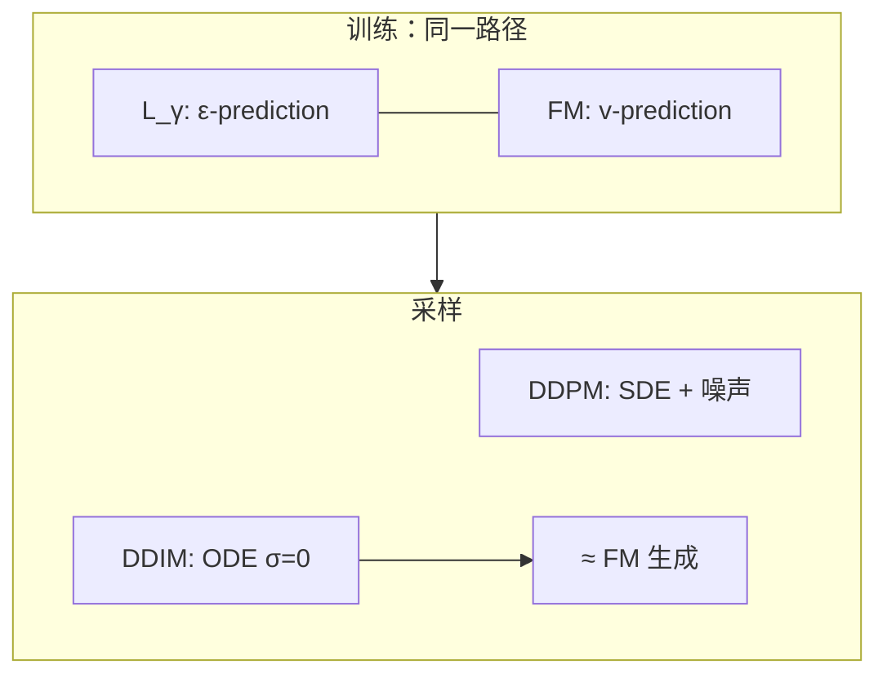

> **论文**：Jiaming Song, Chenlin Meng, Stefano Ermon. [*Denoising Diffusion Implicit Models*](https://arxiv.org/abs/2010.02502). ICLR 2021.  
> **教程参考**：童彤（Double 童发发），[*保姆级 DDIM 基本原理深度解析*](保姆级DDIM基本原理深度解析v1.2.pdf) v1.2.  
> **前置**：[DDPM]() · **延伸**：[Flow Matching]() · [DPM-Solver]()

**DDIM** 在**与 DDPM 完全相同的训练目标**下，构造**非马尔可夫**前向过程；逆向可**确定性**采样并**跳步**，加速 10×–50×，**无需重训** $\epsilon_\theta$。数学上：逆向 **SDE**（DDPM）→ **ODE**（DDIM，$\sigma_t=0$）。

**阅读路线**：§1 动机 → §2 DDPM 前提（含 $\tilde\mu_t$ 完成平方）→ §3–§4 DDIM 构造与定理 1 → §5 采样与跳步 ELBO (52)–(57) → §6 ODE → §7–§8 实验与联系 → 附录。

---

## 符号约定

| 符号 | 含义 |
| :--- | :--- |
| $\alpha_t$ | DDIM 论文记号 = Ho 的 $\bar\alpha_t=\prod_{s\le t}(1-\beta_s)$（**累积**保留率） |
| $\alpha_t^{\mathrm{step}}$ | $=\alpha_t/\alpha_{t-1}=1-\beta_t$（Ho 论文里的单步 $\alpha_t$） |
| $\beta_t$ | 单步噪声方差 $=1-\alpha_t^{\mathrm{step}}$ |
| $\epsilon,\epsilon_t,\epsilon'$ | 标准正态 $\mathcal{N}(0,I)$；教程约定凡 $\epsilon$ 均如此，**彼此独立** |
| $\sigma_t$ | DDIM **人为**方差超参（$\neq$ 噪声 $\epsilon$） |
| $\eta$ | 跳步时 $\sigma_{\tau_i}(\eta)$ 的插值，$\eta=0$ 为 DDIM，$\eta=1$ 为 DDPM |

**与 Ho et al. 对照**：DDIM 式 (3) 中 $\sqrt{\alpha_t/\alpha_{t-1}}=\sqrt{1-\beta_t}$；式 (4) 中 $\alpha_t=$ Ho 的 $\bar\alpha_t$。

下文公式编号与 Song et al. (2021) 一致。

---

## 1. 问题与直觉

### 1.1 DDIM 解决什么

| 痛点 | DDIM 做法 |
| :--- | :--- |
| DDPM 采样步数 $\approx$ 训练加噪步数（常 $T=1000$），极慢 | 非马尔可夫逆向 + 子序列 $\tau$，$S\ll T$ |
| 需重新训练？ | **否** — 直接用 DDPM 训好的 $\epsilon_\theta$ |
| 数学本质 | 随机去噪 **SDE** → 确定性 **概率流 ODE**（$\sigma_t=0$） |
| 额外能力 | 稳定隐编码 $x_T$、球面插值、近似重建 |

### 1.2 「老司机」三要素：DDIM 改了什么？

教程用三个比喻概括 DDPM 与 DDIM 的分工：

| 比喻 | 数学对象 | DDPM | DDIM |
| :--- | :--- | :--- | :--- |
| **路线** | 边缘 $q(x_t\mid x_0)$ | 马尔可夫链加噪 | **完全相同**（式 (4)(22)） |
| **车** | 逆向 $p_\theta(x_{t-1}\mid x_t)$ | SDE，每步加随机噪声 | $\sigma_t=0$ 时为 **ODE**，可跳步 |
| **司机** | 损失 $L_\gamma$ / $\epsilon_\theta$ | MSE 预测噪声 | **梯度等价**（定理 1），白嫖 DDPM 权重 |

**结论**：路线、司机不变，**只改装「车」**——把依赖 $x_0$ 的非马尔可夫更新用于采样，并允许时间下标不连续。

> **注**：有限 $T$ 时 $\alpha_T$ 只能渐近趋于 0；先验 $\mathcal{N}(0,I)$ 严格需 $T\to\infty$ 才可达。这是 DDPM/DDIM 共用的工程近似。



### 1.3 逻辑链：从 DDPM 枷锁到 DDIM

1. DDPM 训练只依赖 $q(x_t|x_0)$（式 (4)），不依赖联合 $q(x_{1:T}|x_0)$ 如何分解；
2. 换一条**非马尔可夫**联合，只要边缘不变，训练目标梯度相同（定理 1）；
3. 新联合的逆向因子 $q(x_{t-1}|x_t,x_0)$ 显含 $x_0$，采样时用 $\hat x_0=f_\theta(x_t)$ 代入；
4. 取 $\sigma_t=0$ → 确定性 ODE；时间步可不连续 → **跳步加速**。

---

## 2. DDPM 基础（DDIM 的前提）

> 完整推导见 [DDPM 笔记]()。本节只保留 DDIM 必需的式子与**为何 DDPM 采样慢**的解释。

### 2.1 生成模型与 ELBO

$$
p_\theta(x_0)=\int p_\theta(x_{0:T})\,dx_{1:T},\quad
p_\theta(x_{0:T})=p_\theta(x_T)\prod_{t=1}^{T}p_\theta^{(t)}(x_{t-1}\mid x_t).
\tag{1}
$$

$$
\max_\theta \mathbb{E}[\log p_\theta(x_0)]
\le \mathbb{E}[\log p_\theta(x_{0:T})-\log q(x_{1:T}\mid x_0)]
=: \mathcal{L}_{\mathrm{ELBO}}.
\tag{2}
$$

展开（与 VAE 同框架）：

$$
\mathcal{L}_{\mathrm{ELBO}}
= \mathbb{E}_q\Bigl[
\underbrace{\mathrm{KL}(q(x_T|x_0)\|p(x_T))}_{L_T}
+ \sum_{t=2}^{T}\underbrace{\mathrm{KL}(q(x_{t-1}|x_t,x_0)\|p_\theta(x_{t-1}|x_t))}_{L_{t-1}}
- \underbrace{\log p_\theta(x_0|x_1)}_{L_0}
\Bigr].
$$

| 项 | 含义 |
| :--- | :--- |
| $L_T$ | 终点是否接近 $\mathcal{N}(0,I)$ |
| $L_{t-1}$ | 每步逆向是否匹配真后验 |
| $L_0$ | 最终重建 $x_0$ |

DDIM 定理 1 说：改 $q$ 的联合分解时，若 $q(x_t|x_0)$ 不变，与 $\theta$ 有关的项仍可化为式 (5)。

### 2.2 马尔可夫前向与边缘（式 (3)(4)）

$$
q(x_{1:T}\mid x_0)=\prod_{t=1}^{T}q(x_t\mid x_{t-1}),\quad
q(x_t\mid x_{t-1})=\mathcal{N}\!\left(\sqrt{\tfrac{\alpha_t}{\alpha_{t-1}}}\,x_{t-1},\,\bigl(1-\tfrac{\alpha_t}{\alpha_{t-1}}\bigr)I\right).
\tag{3}
$$

**套娃**得训练唯一依赖的边缘：

$$
q(x_t\mid x_0)=\mathcal{N}(\sqrt{\alpha_t}\,x_0,\,(1-\alpha_t)I),\quad
x_t=\sqrt{\alpha_t}\,x_0+\sqrt{1-\alpha_t}\,\epsilon.
\tag{4}
$$

- $\sqrt{\alpha_t}\,x_0$：信号分量；$\sqrt{1-\alpha_t}\,\epsilon$：噪声分量；
- 训练时对随机 $t$ 可直接采样 $x_t$，无需模拟整条链。

### 2.3 真后验与 DDPM 的「马尔可夫枷锁」

训练时有 $x_0$，Bayes 加条件：

$$
q(x_{t-1}\mid x_t,x_0)=\frac{q(x_t\mid x_{t-1})\,q(x_{t-1}\mid x_0)}{q(x_t\mid x_0)}.
$$

**为何加 $x_0$ 就够？** 马尔可夫下 $q(x_t\mid x_{t-1},x_0)=q(x_t\mid x_{t-1})$——给定 $x_{t-1}$ 时 $x_t$ 与遥远 $x_0$ 独立。分子分母三项皆为高斯 → 完成平方得

$$
q(x_{t-1}\mid x_t,x_0)=\mathcal{N}(\tilde\mu_t,\,\tilde\beta_t I),
$$

$$
\tilde\mu_t=\frac{\sqrt{\alpha_{t-1}}\bigl(1-\alpha_t/\alpha_{t-1}\bigr)}{1-\alpha_t}\,x_0
+\frac{\sqrt{\alpha_t/\alpha_{t-1}}\,(1-\alpha_{t-1})}{1-\alpha_t}\,x_t.
$$

$\tilde\mu_t$ 是 $x_0$ 与 $x_t$ 的**凸组合**（系数和为 1）。后验方差：

$$
\tilde\beta_t=\frac{1-\alpha_{t-1}}{1-\alpha_t}\Bigl(1-\frac{\alpha_t}{\alpha_{t-1}}\Bigr)
=\frac{1-\alpha_{t-1}}{1-\alpha_t}\,\beta_t^{\mathrm{step}}.
$$

代入 $x_t=\sqrt{\alpha_t}x_0+\sqrt{1-\alpha_t}\epsilon$：

$$
\tilde\mu_t=\frac{1}{\sqrt{\alpha_t^{\mathrm{step}}}}\Bigl(x_t-\frac{\beta_t^{\mathrm{step}}}{\sqrt{1-\alpha_t}}\epsilon\Bigr).
$$

#### 补充：完成平方求 $\tilde\mu_t$（教程「繁琐初等运算」）

记 $a=\sqrt{\alpha_{t-1}}$，$b=\sqrt{\alpha_t/\alpha_{t-1}}$，$c=1-\alpha_t/\alpha_{t-1}=\beta_t^{\mathrm{step}}$。三项高斯密度相除后，对数后验（差常数）为

$$
\log q(x_{t-1}\mid x_t,x_0)\propto
-\frac{(x_{t-1}-ax_0)^2}{2(1-\alpha_{t-1})}
-\frac{(x_t-bx_{t-1})^2}{2c}.
$$

对 $x_{t-1}$ **合并二次型**。第二项展开：

$$
\frac{(x_t-bx_{t-1})^2}{2c}
=\frac{b^2}{2c}x_{t-1}^2-\frac{b x_t}{c}x_{t-1}+\text{const}.
$$

第一项给出 $\frac{1}{2(1-\alpha_{t-1})}x_{t-1}^2$。令 $x_{t-1}$ 的二次项系数等于 $\frac{1}{2\tilde\beta_t}$，一次项系数等于 $\tilde\mu_t/\tilde\beta_t$，解得

$$
\tilde\mu_t=
\frac{\sqrt{\alpha_{t-1}}\bigl(1-\alpha_t/\alpha_{t-1}\bigr)}{1-\alpha_t}\,x_0
+\frac{\sqrt{\alpha_t/\alpha_{t-1}}\,(1-\alpha_{t-1})}{1-\alpha_t}\,x_t,
\qquad
\tilde\beta_t=\frac{1-\alpha_{t-1}}{1-\alpha_t}\Bigl(1-\frac{\alpha_t}{\alpha_{t-1}}\Bigr).
$$

**要点**：这是 Bayes 公式的直接计算，无需猜测 $\tilde\mu_t$ 的形式；DDPM 的 $\mu_\theta$ 即把上式中未知 $\epsilon$ 换为 $\epsilon_\theta$。

**DDPM 采样**：$p_\theta(x_{t-1}|x_t)=\mathcal{N}(\mu_\theta,\sigma_t^2 I)$，$\mu_\theta$ 把 $\epsilon$ 换为 $\epsilon_\theta$：

$$
x_{t-1}=\frac{1}{\sqrt{\alpha_t^{\mathrm{step}}}}\Bigl(x_t-\frac{\beta_t^{\mathrm{step}}}{\sqrt{1-\alpha_t}}\epsilon_\theta\Bigr)+\sigma_t z,\quad z\sim\mathcal{N}(0,I).
$$

| DDPM 采样方差 $\sigma_t^2$ | 说明 |
| :--- | :--- |
| $\beta_t^{\mathrm{step}}$ | 前向方差 |
| $\tilde\beta_t$ | 后验方差（常用） |
| $\hat\sigma_t^2=1-\alpha_t/\alpha_{t-1}$ | Ho CIFAR10 大方差；**少步 FID 差** |

**枷锁**：采样用 $p_\theta(x_{t-1}|x_t)$ **不带** $x_0$，且每步加噪 $+\sigma_t z$ → 只能 $t=T,\ldots,1$ **密步**执行，无法从 $x_{900}$ 一步跳到 $x_{800}$。DDIM 的突破口：**换联合分布，解开这条链**。

### 2.4 训练目标（式 (5)）

$$
L_\gamma(\epsilon_\theta)=\sum_{t=1}^{T}\gamma_t\,\mathbb{E}_{x_0,\epsilon}\Bigl[\bigl\|\epsilon_\theta^{(t)}(\sqrt{\alpha_t}x_0+\sqrt{1-\alpha_t}\epsilon)-\epsilon\bigr\|^2\Bigr].
\tag{5}
$$

Ho et al. 取 $\gamma_t\equiv 1$。ELBO 中 $L_{t-1}$、$L_0$ 可经 $\gamma_t$ **合并**为一项；下标写 $t$ 而非 $t-1$ 是权重吸收后的写法，**非笔误**。

> **DDIM 关键**：$L_\gamma$ **只通过**式 (4) 依赖前向；联合 $q(x_{1:T}|x_0)$ 可换，只要边缘 $q(x_t|x_0)$ 不变。

---

## 3. DDIM 构造：非马尔可夫前向

### 3.1 两条设计要求（白嫖 DDPM 权重）

1. **梯度等价**：损失只通过 $q(x_t|x_0)$ 依赖前向 → 边缘必须与 DDPM **完全一致**（式 (4)(22)）；
2. **可采样**：$q(x_{t-1}|x_t,x_0)$ 取高斯，支持重参数化。

**不能再**把 $q(x_{t-1}|x_t,x_0)$ 化成只依赖 $x_t$ 的 $q(x_{t-1}|x_t)$——否则又回到 DDPM 马尔可夫逆向，跳步不成立。

### 3.2 联合分解（式 (6)）

$$
q_\sigma(x_{1:T}\mid x_0)=q_\sigma(x_T\mid x_0)\prod_{t=2}^{T}q_\sigma(x_{t-1}\mid x_t,x_0),\quad
q_\sigma(x_T\mid x_0)=\mathcal{N}(\sqrt{\alpha_T}x_0,(1-\alpha_T)I).
\tag{6}
$$

**解读**：

- 时间方向：从 $x_T$ 往 $x_1$ 因子化（与**生成**方向一致）；
- 每个因子依赖 $(x_t,x_0)$ → 给定 $x_t$ 时 $x_{t-1}$ 仍依赖 $x_0$ → **非马尔可夫**；
- 图模型：$x_0$ 到各 $x_t$ 呈「星形」；不同于式 (3) 的单链。

### 3.3 条件高斯（式 (7)）与待定系数推导

$$
q_\sigma(x_{t-1}\mid x_t,x_0)=\mathcal{N}\!\left(
\underbrace{\sqrt{\alpha_{t-1}}\,x_0}_{\text{信号}}
+\underbrace{\sqrt{1-\alpha_{t-1}-\sigma_t^2}\,
\frac{x_t-\sqrt{\alpha_t}\,x_0}{\sqrt{1-\alpha_t}}}_{\text{沿 }\epsilon\text{ 方向}},\;
\underbrace{\sigma_t^2 I}_{\text{额外随机}}
\right).
\tag{7}
$$

**待定系数法**（教程核心）：记 $\epsilon=(x_t-\sqrt{\alpha_t}x_0)/\sqrt{1-\alpha_t}$，设

$$
q_\sigma(x_{t-1}\mid x_t,x_0)=\mathcal{N}(\sigma_1 x_0+\sigma_2\epsilon,\,\xi^2 I),\quad \xi=\sigma_t.
$$

由式 (4)，$x_{t-1}=\sqrt{\alpha_{t-1}}x_0+\sqrt{1-\alpha_{t-1}}\,\epsilon'$，$\epsilon'\sim\mathcal{N}(0,I)$。

> **切记**：$\epsilon$ 与 $\epsilon'$ 都是标准正态，但**不能**在等式两边做代数消元；只能比较**分布**的均值、方差（教程强调「一撇」「两撇」含义）。

**方程组**（对给定 $x_0$）：

$$
\begin{cases}
\text{均值：} & \sigma_1=\sqrt{\alpha_{t-1}}, \\[4pt]
\text{方差：} & \sigma_2^2+\sigma_t^2=1-\alpha_{t-1}
\;\Rightarrow\;
\sigma_2=\sqrt{1-\alpha_{t-1}-\sigma_t^2}.
\end{cases}
$$

**约束**：$\sigma_t^2\le 1-\alpha_{t-1}$，否则 $\sigma_2$ 非实。

**跳步为何成立**：推导**未用** $q(x_t|x_{t-1})$；$t$ 与 $t-1$ 可不相邻（如 $\tau_i=900\to\tau_{i-1}=800$）。

### 3.4 边缘不变（式 (22) / Lemma 1）

$$
q_\sigma(x_t\mid x_0)=\mathcal{N}(\sqrt{\alpha_t}x_0,(1-\alpha_t)I),\quad \forall t.
\tag{22}
$$

**归纳证明**（$t$ 从 $T$ 降到 $1$）：设 $q_\sigma(x_t|x_0)=\mathcal{N}(\sqrt{\alpha_t}x_0,(1-\alpha_t)I)$，则

$$
q_\sigma(x_{t-1}|x_0)=\int q_\sigma(x_t|x_0)\,q_\sigma(x_{t-1}|x_t,x_0)\,dx_t.
$$

代入式 (7)，高斯卷积：均值中噪声方向项

$$
\sqrt{1-\alpha_{t-1}-\sigma_t^2}\cdot\frac{\sqrt{\alpha_t}x_0-\sqrt{\alpha_t}x_0}{\sqrt{1-\alpha_t}}=0
$$

→ $\mathbb{E}[x_{t-1}|x_0]=\sqrt{\alpha_{t-1}}x_0$；方差 $\sigma_t^2+(1-\alpha_{t-1}-\sigma_t^2)=1-\alpha_{t-1}$。□

### 3.5 非马尔可夫「前向」（式 (8)）

$$
q_\sigma(x_t\mid x_{t-1},x_0)=\frac{q_\sigma(x_{t-1}\mid x_t,x_0)\,q_\sigma(x_t\mid x_0)}{q_\sigma(x_{t-1}\mid x_0)}.
\tag{8}
$$

由式 (6) 反解；结果仍为高斯，但一般 $q_\sigma(x_t|x_{t-1},x_0)\neq q_\sigma(x_t|x_{t-1})$——**不能**消去 $x_0$，即非马尔可夫。

---

## 4. 训练：定理 1 与免重训

### 4.1 $x_0$ 预测与逆向（式 (9)(10)）

$$
f_\theta^{(t)}(x_t)=\frac{x_t-\sqrt{1-\alpha_t}\,\epsilon_\theta^{(t)}(x_t)}{\sqrt{\alpha_t}}.
\tag{9}
$$

**解读**：式 (4) 解出 $\epsilon$ 再令 $\epsilon\leftarrow\epsilon_\theta$；若预测完美则 $f_\theta^{(t)}(x_t)=x_0$。

$$
p_\theta^{(t)}(x_{t-1}\mid x_t)=
\begin{cases}
\mathcal{N}(f_\theta^{(1)}(x_1),\sigma_1^2 I), & t=1,\\[4pt]
q_\sigma(x_{t-1}\mid x_t,f_\theta^{(t)}(x_t)), & t>1.
\end{cases}
\tag{10}
$$

- $t>1$：式 (7) 中 $x_0$ 换为网络 $\hat x_0=f_\theta^{(t)}(x_t)$；
- $t=1$：额外 $\sigma_1^2 I$ 保证 $p_\theta(x_0)$ 支撑全空间（连续密度）。

### 4.2 变分目标（式 (11)）

$$
J_\sigma=\mathbb{E}_{q_\sigma}\bigl[\log q_\sigma(x_{1:T}\mid x_0)-\log p_\theta(x_{0:T})\bigr].
\tag{11}
$$

**极大似然直觉**：最小化 $J_\sigma$ = 最大化 $\log p_\theta(x_0)$ 的变分下界（与 DDPM ELBO 同型，只是 $q$ 换成 $q_\sigma$）。

### 4.3 定理 1 与完整推导

**定理 1**：$\forall\sigma>0$，$\exists\gamma,C$ 使 $J_\sigma=L_\gamma+C$。

对 $t>1$，设 $p_\theta^{(t)}=q_\sigma(x_{t-1}|x_t,f_\theta)$。同方差 $\sigma_t^2 I$ 的高斯 KL：

$$
\mathrm{KL}(q_\sigma(\cdot|x_t,x_0)\|p_\theta^{(t)})
=\frac{\|\mu_q-\mu_p\|^2}{2\sigma_t^2}
=\mathbb{E}\left[\frac{\|x_0-f_\theta(x_t)\|^2}{2\sigma_t^2}\right].
$$

代入 $x_0=(x_t-\sqrt{1-\alpha_t}\epsilon)/\sqrt{\alpha_t}$ 与式 (9)：

$$
x_0-f_\theta=\frac{\sqrt{1-\alpha_t}}{\sqrt{\alpha_t}}(\epsilon-\epsilon_\theta),\quad
\Rightarrow\quad
\frac{(1-\alpha_t)\|\epsilon-\epsilon_\theta\|^2}{2\sigma_t^2\alpha_t}.
$$

取 $\gamma_t=1/(2d\sigma_t^2\alpha_t)$ 即式 (5)。常数 $C$ 吸收与 $\theta$ 无关的熵项 →

$$
\boxed{\nabla_\theta J_\sigma=\nabla_\theta L_\gamma.}
$$

**白嫖 DDPM 权重**：用 DDPM 训好的 $\epsilon_\theta$ 直接做 DDIM 采样，**不必重训**。

> $\sigma_t=0$ 不在定理陈述内（分母为 0）；论文说明可用 $\sigma\to 0^+$ 近似，极限仍成立。

```mermaid
flowchart TB
  subgraph train ["训练：与 DDPM 相同"]
    x0["x₀"] -->|式 (4)| xt["x_t"]
    xt --> L["‖ε - ε_θ(x_t,t)‖²"]
  end
  subgraph sample_ddpm ["DDPM 采样"]
    xT1["x_T"] -->|随机 +σ_t z| x01["x₀"]
  end
  subgraph sample_ddim ["DDIM 采样"]
    xT2["x_T"] -->|σ=0, 可跳步| x02["x₀"]
  end
  L -.->|同一 ε_θ| sample_ddpm
  L -.->|同一 ε_θ| sample_ddim
```

---

## 5. 采样

### 5.1 一步更新（式 (12)）

$$
x_{t-1}=\sqrt{\alpha_{t-1}}\,\hat x_0
+\sqrt{1-\alpha_{t-1}-\sigma_t^2}\,\epsilon_\theta^{(t)}(x_t)
+\sigma_t\epsilon_t,
\quad
\hat x_0=f_\theta^{(t)}(x_t),\;\epsilon_t\sim\mathcal{N}(0,I)\ \text{独立于}\ x_t.
\tag{12}
$$

| 项 | 论文称呼 | 作用 |
| :--- | :--- | :--- |
| $\sqrt{\alpha_{t-1}}\hat x_0$ | predicted $x_0$ | 按估计干净图，缩放到 $t-1$ 信号强度 |
| $\sqrt{1-\alpha_{t-1}-\sigma_t^2}\,\epsilon_\theta$ | direction pointing to $x_t$ | 沿预测噪声方向，补足除 $\sigma_t$ 外的方差预算 |
| $\sigma_t\epsilon_t$ | random noise | 随机性；DDIM 取 $\sigma_t=0$ 消去 |

**由 (7)(9)(10) 推出**：$t>1$ 时 $p_\theta^{(t)}=q_\sigma(x_{t-1}|x_t,f_\theta)$，重参数化即得 (12)。

**确定性 DDIM**（$\sigma_t=0$）：

$$
x_{t-1}=\sqrt{\alpha_{t-1}}\,\hat x_0+\sqrt{1-\alpha_{t-1}}\,\epsilon_\theta^{(t)}(x_t).
$$

- 映射 $x_t\mapsto x_{t-1}$ **确定**；$x_T$ 唯一决定 $x_0$；
- **Implicit**：非每步显式随机转移的「纯种」扩散；粒子扩散图像不再严格成立，但 ODE 视角更自然。

**恢复 DDPM**：$\sigma_t=\sqrt{(1-\alpha_{t-1})/(1-\alpha_t)}\sqrt{1-\alpha_t/\alpha_{t-1}}$，式 (12) 等价于 DDPM 采样。

### 5.2 编码（逆 ODE）

生成：$x_T\to x_0$。编码：沿**反向** ODE 从 $x_0$ 积分到 $x_T$，得到近似隐表示（用于重建、编辑）。DDPM 因每步随机性，**无法**稳定 encode–decode。

### 5.3 跳步与子序列 $\tau$

训练用全长 $T$，生成只在子序列 $\tau=(\tau_1,\ldots,\tau_S)$，$\tau_S=T$ 上执行式 (12)。跳过的时刻 $\bar\tau=\{1,\ldots,T\}\setminus\tau$ 仅出现在 ELBO 中，**不参与**采样链。

跳步更新（将 $t,\,t-1$ 换为 $\tau_i,\,\tau_{i-1}$）：

$$
x_{\tau_{i-1}}=\sqrt{\alpha_{\tau_{i-1}}}\,\hat x_0
+\sqrt{1-\alpha_{\tau_{i-1}}-\sigma_{\tau_i}^2}\,\epsilon_\theta^{(\tau_i)}(x_{\tau_i})
+\sigma_{\tau_i}\epsilon.
$$

**随机性插值**（式 (16)）：

$$
\sigma_{\tau_i}(\eta)=\eta\sqrt{\frac{1-\alpha_{\tau_{i-1}}}{1-\alpha_{\tau_i}}}\sqrt{1-\frac{\alpha_{\tau_i}}{\alpha_{\tau_{i-1}}}}.
\tag{16}
$$

| $\eta$ | 行为 |
| :--- | :--- |
| $0$ | DDIM，确定性 |
| $1$ | DDPM 方差调度 |
| $(0,1)$ | 质量–随机性折中 |

**轨迹 $\tau$**：线性 $\lfloor ci\rfloor$ 或二次 $\lfloor ci^2\rfloor$（CIFAR 常用二次）。同一 $\epsilon_\theta$，改 $\tau$ 即可在速度–质量间调节。

### 5.4 跳步 ELBO 理论（式 (52)–(57)）

跳步不仅「工程上少算几步」，论文附录 C.1 给出：在子序列 $\tau=(\tau_1,\ldots,\tau_S)$ 上（$\tau_S=T$，$\tau$ 严格递增，$\tau_0:=0$），可重新定义前向联合与生成联合，使 **$J_\sigma=L_\gamma+C$ 仍成立**。

记 $\bar\tau=\{1,\ldots,T\}\setminus\tau$ 为**跳过**的时刻。

**跳步前向联合**（式 (52)）：

$$
q_{\sigma,\tau}(x_{1:T}\mid x_0)
= q(x_{\tau_S}\mid x_0)\,
\prod_{i=1}^{S} q_\sigma(x_{\tau_{i-1}}\mid x_{\tau_i},x_0)\,
\prod_{t\in\bar\tau} q(x_t\mid x_0).
\tag{52}
$$

**解读**：

| 因子 | 含义 |
| :--- | :--- |
| $q(x_{\tau_S}\mid x_0)$ | 子序列终点边缘，$=$ 式 (4) |
| $\prod_i q_\sigma(x_{\tau_{i-1}}\mid x_{\tau_i},x_0)$ | 只在 $\tau$ 上定义**反向因子**（可跨多步，如 $\tau_i-\tau_{i-1}>1$） |
| $\prod_{t\in\bar\tau} q(x_t\mid x_0)$ | 跳过时刻只保留**边缘** $q(x_t\mid x_0)$，不连进马尔可夫链 |

中间时刻 $t\in\bar\tau$ **不出现在采样路径**上，只保证变分分解与边缘 $q(x_t|x_0)$ 一致。

**跳步生成联合**（式 (55)）：

$$
p_\theta(x_{0:T})
= p(x_T)\,
\prod_{i=1}^{S} p_\theta^{(\tau_i)}(x_{\tau_{i-1}}\mid x_{\tau_i})\,
\prod_{t\in\bar\tau} p_\theta^{(t)}(x_0\mid x_t).
\tag{55}
$$

**解读**：采样链只在 $\tau$ 上执行 $S$ 步 $p_\theta^{(\tau_i)}$；$\bar\tau$ 上的 $p_\theta^{(t)}(x_0|x_t)$ 仅出现在 ELBO 的重建项中，**不参与**从 $x_T$ 到 $x_0$ 的递推。

**逆向核**（式 (56)）：

$$
p_\theta^{(\tau_i)}(x_{\tau_{i-1}}\mid x_{\tau_i})
= q_\sigma\!\left(x_{\tau_{i-1}}\mid x_{\tau_i},\, f_\theta^{(\tau_i)}(x_{\tau_i})\right),
\tag{56}
$$

即式 (7)(12) 把 $(t,t-1)$ 换为 $(\tau_i,\tau_{i-1})$，$\hat x_0=f_\theta^{(\tau_i)}(x_{\tau_i})$。

**变分目标**（式 (53)(54) 概要）：对 $q_{\sigma,\tau}$ 与 $p_\theta$ 仍定义

$$
J_{\sigma,\tau}=\mathbb{E}_{q_{\sigma,\tau}}\!\left[\log\frac{q_{\sigma,\tau}(x_{1:T}\mid x_0)}{p_\theta(x_{0:T})}\right].
$$

展开后，$\bar\tau$ 上因子与 $\theta$ 无关或吸收进常数 $C$；$\tau$ 上的 KL 项与定理 1 同型 → **仍得 $J_{\sigma,\tau}=L_\gamma+C$**（式 (57)）：

$$
J_{\sigma,\tau}(\epsilon_\theta)=L_\gamma(\epsilon_\theta)+C_{\sigma,\tau}.
\tag{57}
$$

**结论**：训练仍用全长 $T$ 的式 (5)（随机 $t$）；推理时任意选 $\tau$、任意 $S$，**同一** $\epsilon_\theta$ 即可——这是 DDIM「白嫖权重 + 跳步加速」的理论依据。



---

## 6. 连续时间：SDE → ODE（式 (13)–(15)）

式 (12) 令 $\sigma_t=0$ 并整理：

$$
x_{t-1}=\sqrt{\frac{\alpha_{t-1}}{\alpha_t}}\,x_t
+\Bigl(\sqrt{1-\alpha_{t-1}}-\sqrt{\tfrac{\alpha_{t-1}(1-\alpha_t)}{\alpha_t}}\Bigr)\epsilon_\theta(x_t,t).
$$

记 $\bar x_t=x_t/\sqrt{\alpha_t}$，除以 $\sqrt{\alpha_{t-\Delta}}$ 得对 **噪声水平** $\sigma$ 的 Euler（式 (13)）：

$$
\frac{x_{t-\Delta}}{\sqrt{\alpha_{t-\Delta}}}
=\frac{x_t}{\sqrt{\alpha_t}}
+\Bigl(\sqrt{\tfrac{1-\alpha_{t-\Delta}}{\alpha_{t-\Delta}}}-\sqrt{\tfrac{1-\alpha_t}{\alpha_t}}\Bigr)\epsilon_\theta^{(t)}(x_t).
\tag{13}
$$

$\Delta\to 0$，令 $\sigma(t)=\sqrt{(1-\alpha(t))/\alpha(t)}$，得 **概率流 ODE**（式 (14)）：

$$
d\bar x(t)=\epsilon_\theta^{(t)}\!\left(\frac{\bar x(t)}{\sqrt{\sigma^2(t)+1}}\right)d\sigma(t).
\tag{14}
$$

对**物理时间** $t$ 做 Euler 得式 (15)（Score SDE 论文形式）：

$$
\frac{x_{t-\Delta}}{\sqrt{\alpha_{t-\Delta}}}
=\frac{x_t}{\sqrt{\alpha_t}}
+\frac{1}{2}\left(\frac{1-\alpha_{t-\Delta}}{\alpha_{t-\Delta}}-\frac{1-\alpha_t}{\alpha_t}\right)
\sqrt{\frac{\alpha_t}{1-\alpha_t}}\,\epsilon_\theta^{(t)}(x_t).
\tag{15}
$$

**式 (13) vs (15)**：(13) 对噪声水平 $\sigma$ 离散化；(15) 对物理时间 $t$ 离散化。**少步**时 (13) 通常更准。

**命题 1**：式 (14) 与 Song et al. (2020) VP-SDE 的 probability flow ODE 等价——**SDE 扰动系数置 0** 即 ODE；数值上无扩散项，步长可更大。

| 教程三问 | 答案 |
| :--- | :--- |
| 路线变了吗？ | **否**，$q(x_t|x_0)$ 同 DDPM |
| 司机变了吗？ | **否**，$L_\gamma$ 梯度等价 |
| 车变了吗？ | **是**，SDE → ODE |

---

## 7. 实验与应用

### 7.1 采样质量（论文 Table 1）

CIFAR-10 / CelebA，$T=1000$ 训练、$S$ 步采样：

| 设置 | FID 趋势 |
| :--- | :--- |
| DDIM $\eta=0$ | **少步 $S$ 最优**（$S=10\sim 50$ 可用） |
| DDPM $\eta=1$ | 需 $S$ 接近 $T$ |
| $\hat\sigma$ 大方差 | 密步尚可，**少步崩溃** |

| $S$ | DDIM $\eta=0$ | DDPM $\eta=1$ |
| :---: | :---: | :---: |
| 10 | $\approx 13.4$ | $\approx 41$ |
| 1000 | $\approx 4.0$ | $\approx 4.0$ |

### 7.2 一致性、插值、重建

**Sample consistency**：固定 $x_T$，改 $\tau$（10 / 20 / 50 / 1000 步）→ 高层特征相似，细节随步数增加。DDPM 同一 $x_T$ 因随机采样得多样 $x_0$，**做不到**。

**插值**（式 (67) SLERP）：在 $x_T$ **球面**上插值再 DDIM 解码 → 语义平滑过渡（优于像素空间线性插值）。

$$
x_T^{(\lambda)}=\frac{\sin((1-\lambda)\theta)}{\sin\theta}x_T^{(0)}+\frac{\sin(\lambda\theta)}{\sin\theta}x_T^{(1)},\quad
\theta=\arccos\!\left(\frac{(x_T^{(0)})^\top x_T^{(1)}}{\|x_T^{(0)}\|\|x_T^{(1)}\|}\right).
\tag{67}
$$

DDPM 只能在**像素空间**对全程噪声插值，语义一致性差。

**重建**：DDIM encode–decode MSE 随 $S$ 增大而降（$S=1000$ 约 $10^{-4}$）；DDPM 随机性导致无法稳定重建。

**墙钟**：50k 张 CIFAR-10，$S=50$ 约比 $S=1000$ 快 **10×–50×**（单卡 2080 Ti）。

---

## 8. 与 Flow Matching 的关系

VP 桥 $x_t=\sqrt{\alpha_t}x_0+\sqrt{1-\alpha_t}\epsilon$ 上，$\epsilon$-prediction 与 CFM 的 $v$-prediction **差调度系数**；DDIM（$\sigma=0$）= 该路径上 **ODE Euler**。[DPM-Solver]() 为高阶推广（DDIM = 一阶特例）。

| 维度 | DDPM | DDIM ($\eta=0$) | Flow Matching |
| :--- | :--- | :--- | :--- |
| 前向联合 | 马尔可夫 (3) | 非马尔可夫 (6)(7) | 固定条件路径 |
| 训练 | 式 (5) | **相同** | $v$-prediction |
| 采样 | 随机 SDE | 确定性 ODE | ODE 积分 |
| 步数 | $\sim T$ | $S\ll T$ | 可少步 |
| 隐编码 $x_T$ | 不稳定 | **稳定** | 流起点 |



---

## 9. 小结

| 问题 | DDIM 答案 |
| :--- | :--- |
| 训练要改吗？ | **否**，定理 1：$J_\sigma=L_\gamma+C$ |
| 为何能跳步？ | 非马尔可夫因子不依赖 $q(x_t|x_{t-1})$ |
| 为何更快？ | $\sigma=0$ 确定性 ODE + 子序列 $\tau$ |
| 代价？ | 需接受 Implicit / 非马尔可夫解释；$\eta=0$ 时多样性略低于 DDPM |

---

## 附录 A. 离散数据推广（式 (17)–(21)）

one-hot $x_0\in\mathbb{R}^K$：

$$
q(x_t|x_0)=\mathrm{Cat}(\alpha_t x_0+(1-\alpha_t)\mathbf{1}_K/K).
$$

$q(x_{t-1}|x_t,x_0)$ 为同类混合，与式 (7) 同构；$\sigma_t\to 0$ 时确定性；边缘不变则训练等价。

---

## 附录 B. 论文公式索引

| 编号 | 内容 |
| :---: | :--- |
| (1)(2) | 生成链、ELBO |
| (3)(4) | DDPM 前向、边缘（训练只依赖 (4)） |
| (5) | $L_\gamma$，DDPM/DDIM **共用训练** |
| (6)(7)(8)(22) | 非马尔可夫前向、边缘不变 |
| (9)(10)(11) | $f_\theta$、$p_\theta$、$J_\sigma$ |
| Thm 1 | $J_\sigma=L_\gamma+C$，**免重训** |
| (12) | **采样实现**（三项分解） |
| (16) | $\eta$ 插值 DDIM↔DDPM |
| (13)–(15) | ODE / Euler |
| (52)–(57) | 跳步 ELBO 理论（§5.4） |
| (67) | SLERP 插值 |

---

## 附录 C. 教程 ↔ 论文对照

| 教程表述 | 论文对应 |
| :--- | :--- |
| 路线 / 车 / 司机 | $q(x_t|x_0)$ / $p_\theta(x_{t-1}|x_t)$ / $L_\gamma$ |
| 待定系数 $\sigma_1,\sigma_2,\xi$ | 式 (7) |
| 不能对 $\epsilon$ 代数消元 | 分布匹配 vs 点态等式 |
| 损失白嫖 | 定理 1 |
| SDE→ODE | 式 (12) $\sigma_t=0$ → (13)(14) |
| 跳步 900→800 | 未用 $q(x_t|x_{t-1})$ |

---

## 参考文献

- Song et al., *Denoising Diffusion Implicit Models*, ICLR 2021.
- Ho et al., *Denoising Diffusion Probabilistic Models*, NeurIPS 2020.
- Song et al., *Score-Based Generative Modeling through SDEs*, ICLR 2021.
- Lipman et al., *Flow Matching for Generative Modeling*, ICLR 2023.
- Liu et al., *DPM-Solver*, NeurIPS 2022.
- 童彤，*保姆级 DDIM 基本原理深度解析* v1.2.
