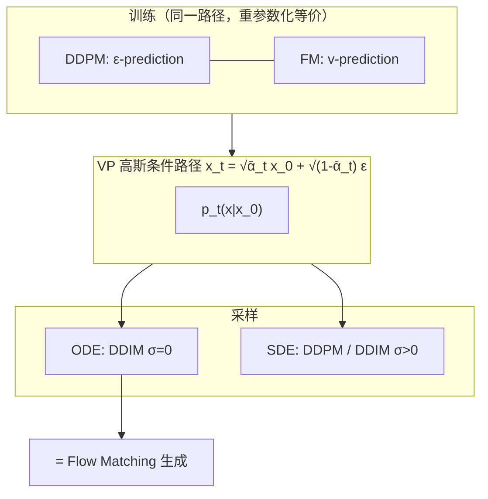

> **论文**：Jiaming Song, Chenlin Meng, Stefano Ermon. [*Denoising Diffusion Implicit Models*](https://arxiv.org/abs/2010.02502). ICLR 2021.
>
> 建议先读 [DDPM]()，再读 [Flow Matching]()。

**核心结论（后验视角）**：DDIM（$\sigma_t = 0$）并非与 Flow Matching 无关的「扩散加速技巧」——它就是在**同一条高斯条件概率路径**上，用已学到的**速度场 / 流场**做 **ODE 积分**的确定性采样器。DDPM 训练 $\epsilon_\theta$，与在该路径上做 Conditional Flow Matching（CFM）训练 $v_\theta$，**目标等价**（差一个时间重参数化）；DDIM 采样与 FM 生成**是同一类 ODE 求解**。

---

## 1. 从 DDPM 到 DDIM

### 1.1 DDPM 的局限

DDPM 逆向过程依赖马尔可夫性，每步去噪后注入随机噪声。因此：

- 采样步数需接近训练步数（通常 $T \approx 1000$），否则质量骤降；
- 生成随机，$x_T$ 不能稳定充当隐编码。

### 1.2 非马尔可夫前向过程

DDIM 定义一族**非马尔可夫**前向过程，与 DDPM **共享边缘分布** $q(x_t \mid x_0)$。对任意噪声序列 $\sigma = (\sigma_1, \ldots, \sigma_T)$：

$$
q_\sigma(x_{1:T} \mid x_0) = q_\sigma(x_T \mid x_0) \prod_{t=2}^{T} q_\sigma(x_{t-1} \mid x_t, x_0),
$$

$$
q_\sigma(x_{t-1} \mid x_t, x_0) = \mathcal{N}\!\left(
\sqrt{\bar{\alpha}_{t-1}}\, x_0
+ \sqrt{1 - \bar{\alpha}_{t-1} - \sigma_t^2}\,
\frac{x_t - \sqrt{\bar{\alpha}_t}\, x_0}{\sqrt{1 - \bar{\alpha}_t}},
\;\sigma_t^2 I
\right).
$$

### 1.3 生成更新

用噪声网络 $\epsilon_\theta$ 估计 $\hat{x}_0$，再更新：

$$
\hat{x}_0 = \frac{x_t - \sqrt{1 - \bar{\alpha}_t}\, \epsilon_\theta(x_t, t)}{\sqrt{\bar{\alpha}_t}},
$$

$$
x_{t-1} = \sqrt{\bar{\alpha}_{t-1}}\, \hat{x}_0
+ \sqrt{1 - \bar{\alpha}_{t-1} - \sigma_t^2}\, \epsilon_\theta(x_t, t)
+ \sigma_t z, \quad z \sim \mathcal{N}(0, I).
$$

---

## 2. 确定性 DDIM（$\sigma_t = 0$）

$$
x_{t-1} = \sqrt{\bar{\alpha}_{t-1}}\,
\frac{x_t - \sqrt{1 - \bar{\alpha}_t}\, \epsilon_\theta(x_t, t)}{\sqrt{\bar{\alpha}_t}}
+ \sqrt{1 - \bar{\alpha}_{t-1}}\, \epsilon_\theta(x_t, t).
$$

$\sigma_t = 0$ 时采样**完全确定**：给定 $x_T$，生成路径唯一。于是：

- $x_T$ 可当作隐编码，支持插值与编辑；
- 可在 $\{1,\ldots,T\}$ 中取长度 $S \ll T$ 的子序列（如 50 步均匀跳步），大幅加速。

---

## 3. DDIM 就是 Flow Matching（同一 ODE，不同命名）

### 3.1 统一语言：流与速度场

[Flow Matching]() 用 ODE 描述生成：

$$
\frac{d}{dt}\phi_t(x) = v_t\!\left(\phi_t(x)\right), \qquad p_t = [\phi_t]_\sharp p_0.
$$

密度满足连续性方程 $\partial_t p_t = -\mathrm{div}(v_t p_t)$。**生成** = 从 $t=1$（噪声）沿 $v_t$ **积分到** $t=0$（数据）。

DDIM（$\sigma=0$）正是对该 ODE 的 **Euler 离散化**——不是另一套生成范式，而是**去掉随机项后的流积分**。

### 3.2 同一条条件路径：扩散桥 = FM 的高斯路径

DDPM / DDIM 的前向桥（给定数据 $x_0$，下文 $x_0$ 表示**干净样本**）：

$$
x_t = \sqrt{\bar{\alpha}_t}\, x_0 + \sqrt{1 - \bar{\alpha}_t}\, \epsilon, \quad \epsilon \sim \mathcal{N}(0, I).
$$

这是 FM 框架下的**固定条件高斯路径** $p_t(x \mid x_0)$ 的特例（Lipman et al. 指出扩散路径包含在 FM 路径族中）。FM 不限于此路径，还可选 OT 直线插值等更高效路径；**选 VP 扩散路径时，FM 与 DDPM 重合**。

### 3.3 训练等价：$\epsilon$-prediction $\Leftrightarrow$ $v$-prediction

**Conditional Flow Matching** 在条件路径 $x_t \sim p_t(\cdot \mid x_0, x_1)$ 上回归条件速度 $u_t(x \mid x_0, x_1)$，再边缘化得 FM 目标：

$$
\mathcal{L}_{\mathrm{FM}}(\theta) = \mathbb{E}_{t,\, p_t(x)} \left\| v_\theta(x, t) - u_t(x) \right\|^2.
$$

对 VP 扩散桥，$u_t$ 可写成 $x_0, \epsilon$ 的线性组合；**预测噪声** $\epsilon_\theta(x_t, t)$ 与**预测速度** $v_\theta(x_t, t)$ 之间只差**已知的时间调度系数**（$\sqrt{\bar{\alpha}_t}$、$\sqrt{1-\bar{\alpha}_t}$ 及其导数）。因此：

| 视角 | 训练学什么 | 路径 |
| :--- | :--- | :--- |
| **DDPM** | $\|\epsilon - \epsilon_\theta(x_t,t)\|^2$ | VP 高斯桥 |
| **Flow Matching** | $\|v_\theta - u_t\|^2$ | 同一路径（取扩散桥时） |
| **Score Matching** | $\|s_\theta - \nabla\log p_t\|^2$ | 同一路径 |

**同一网络、同一数据、重参数化后损失等价**——DDPM 训练本质上已在做 FM，只是论文语言仍用「扩散 / 去噪」。

### 3.4 采样等价：DDIM = FM 的 ODE 求解

概率流 ODE（Score SDE 的确定性版本）：

$$
\frac{d x_t}{dt} = f(x_t, t) - \tfrac{1}{2} g(t)^2 \nabla_x \log p_t(x_t).
$$

将 $\nabla_x \log p_t$ 用 $\epsilon_\theta$ 代入，即得与 DDIM 更新一致的流场。$\sigma_t=0$ 的 DDIM 一步：

$$
x_{t-\Delta} \approx x_t + \Delta t \cdot \tilde{v}_\theta(x_t, t),
$$

其中 $\tilde{v}_\theta$ 由 $\epsilon_\theta$ 经调度函数显式写出。**少步跳采样** = 加大 Euler 步长 = FM / CNF 的粗粒度 ODE 积分。

> 详见 [DPM-Solver]()：DDIM 是一阶 DPM-Solver 特例；高阶求解器 = 更精确的流积分。

### 3.5 随机 DDIM（$\sigma_t > 0$）在 FM 中的位置

$\sigma_t > 0$ 时 DDIM 重新注入噪声，对应 **SDE 采样**而非纯 ODE。FM 框架下：

- **$\sigma=0$（DDIM）**：确定性流，与 CNF / Rectified Flow 推断一致；
- **$\sigma>0$（DDPM 式）**：朗之万修正，探索性更强，同一流场上的随机扰动。

### 3.6 小结：为何说「DDIM 实际上就是 Flow Matching」

| 问题 | DDIM / 扩散语言 | Flow Matching 语言 |
| :--- | :--- | :--- |
| 如何把噪声变成数据？ | 逆向去噪 / 概率流 ODE | 积分速度场 $v_t$ |
| 训练目标？ | 预测噪声 $\epsilon_\theta$ | 回归 $v_\theta$（扩散路径下等价） |
| 确定性快速采样？ | DDIM $\sigma=0$ + 跳步 | ODE Euler / Heun 少步积分 |
| 隐编码？ | $x_T$ | 流起点 $x_1 \sim p_{\mathrm{noise}}$ |

**实践含义**：用 DDPM 训好的 $\epsilon_\theta$ 做 DDIM 采样，等价于用 FM 训好的 $v_\theta$ 做 ODE 生成（差系数换算）。近年工作（Rectified Flow、Shortcut Models 等）进一步把路径从「扩散桥」换成「OT 直线」，训练仍是 FM，采样仍是 ODE——**变的主要是路径，不是范式**。

---

## 4. DDPM vs DDIM vs FM 对比

| 维度 | DDPM | DDIM ($\sigma=0$) | Flow Matching |
| :--- | :--- | :--- | :--- |
| **路径** | VP 高斯桥 | 同左（共享 $q(x_t\mid x_0)$） | 可选扩散桥 / OT 直线等 |
| **训练** | $\epsilon$-prediction | **相同** | $v$-prediction（扩散桥下等价） |
| **采样** | 随机 SDE | 确定性 ODE（Euler） | 确定性 ODE |
| **步数** | $\sim 1000$ | $50$–$100$ 跳步 | 同样可少步积分 |
| **隐空间** | 不稳定 | $x_T$ 可编码 | 流起点可编码 |
| **范式** | 马尔可夫扩散 | **流的确定性积分** | 显式流 / CNF |

---

## 5. 参考文献

- Song et al., *Denoising Diffusion Implicit Models*, ICLR 2021.
- Lipman et al., *Flow Matching for Generative Modeling*, ICLR 2023.
- Song et al., *Score-Based Generative Modeling through Stochastic Differential Equations*, ICLR 2021（概率流 ODE）。
- Liu et al., *DPM-Solver: A Fast ODE Solver for Diffusion Probabilistic Model Sampling*, NeurIPS 2022.
