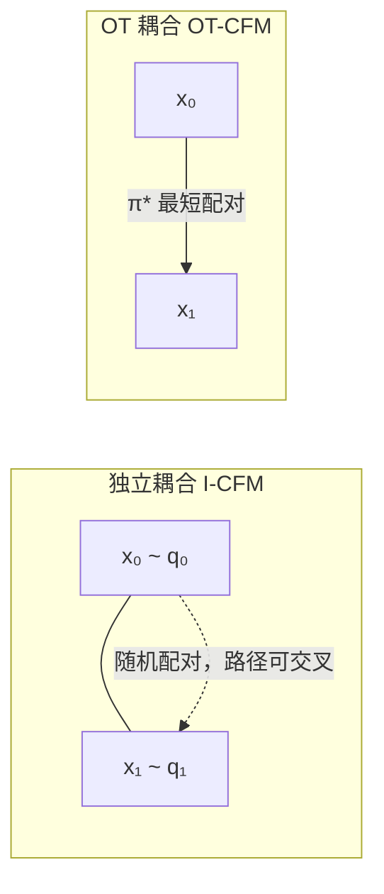

> **OT-Flow**：Derek Onken, Samy Wu Fung, Xingjian Li, Lars Ruthotto. [*OT-Flow: Fast and Accurate Continuous Normalizing Flows via Optimal Transport*](https://arxiv.org/abs/2006.00104). AAAI 2021.  
> **OT-CFM**：Alexander Tong et al. [*Improving and Generalizing Flow-Based Generative Models with Minibatch Optimal Transport*](https://arxiv.org/abs/2302.00482). TMLR 2024.  
> **Multisample FM**：Aram-Alexandre Pooladian et al. [*Multisample Flow Matching: Straightening Flows with Minibatch Couplings*](https://arxiv.org/abs/2304.14772). ICML 2023.

连续流生成模型（CNF、Flow Matching、扩散 ODE）的瓶颈往往是：**推理时要对神经 ODE 积分很多步**。许多不同的速度场 $v_\theta$ 都能把噪声分布 $q_0$ 推到数据分布 $q_1$，但轨迹弯曲的流需要更细的步长。**最优传输 (OT)** 偏好「最短、不交叉」的搬运方式——在 $W_2$ 度量下对应**直线位移插值**。把 OT 结构嵌入训练，可得到更直的流、更少的函数求值 (NFE)、更快的训练。

本文串联两条路线：**OT-Flow**（在 CNF 损失里加运输代价与 HJB 正则）与 **OT-CFM**（在 Flow Matching 里用 OT 耦合替代独立采样）。建议先读 [Flow Matching]() 与 [条件流匹配]().

---

## 1. 动机：为何要「直」的流？

CNF 由 ODE 定义：

$$
\frac{d\phi_t(x)}{dt} = v_t(\phi_t(x)), \quad \phi_0(x)=x, \qquad
p_t = [\phi_t]_\sharp p_0.
$$

训练常最大化似然 $\mathbb{E}_{p_{\mathrm{data}}}[\log p_1(x)]$，但满足边界条件 $p_0 \approx \mathcal{N}(0,I)$、$p_1 \approx p_{\mathrm{data}}$ 的 $v_t$ **不唯一**。弯曲轨迹在 Euler / RK 离散化下误差大，推理需数十至上千次网络前向。

| 问题 | 独立耦合 / 无 OT 约束 | OT 约束后 |
| :--- | :--- | :--- |
| 轨迹形状 | 样本路径可交叉、绕弯 | 倾向直线、少交叉 |
| 推理 NFE | 多 | 少（常 10–50 步即可） |
| 训练方差 | CFM 目标方差较大 | OT 配对降低方差 |

WGAN 从另一角度用 $W_1$ 度量分布距离（见 [GAN 与最优传输]() §2）。OT-Flow / OT-CFM 则把 **$W_2$ 几何**直接写进流的训练目标或采样耦合里。

---

## 2. 静态 OT 与位移插值

设源、目标分布为 $q_0, q_1$，**Kantorovich 最优传输**（平方欧氏代价）：

$$
W_2^2(q_0, q_1) = \inf_{\pi \in \Pi(q_0,q_1)} \mathbb{E}_{(x_0,x_1)\sim\pi}\!\left[\|x_0 - x_1\|^2\right].
$$

Brenier 定理：在适当正则性下，最优计划 $\pi^\star$ 集中在 Monge 映射 $T$ 的图上，$x_1 = T(x_0)$。

**McCann 位移插值**给出连接 $q_0$ 与 $q_1$ 的测地线（动态 OT 的边际路径）：

$$
p_t^{\mathrm{OT}} = \bigl[(1-t)\,\mathrm{id} + t\,T\bigr]_\sharp q_0, \qquad t \in [0,1].
$$

对离散样本对 $(x_0, x_1) \sim \pi^\star$，条件路径为**直线**：

$$
x_t = (1-t)\, x_0 + t\, x_1, \qquad u_t(x \mid x_0, x_1) = x_1 - x_0.
$$

这正是 [Rectified Flow]() 与 **I-CFM** 在 $\sigma=0$ 时的条件速度；差别在于 $(x_0,x_1)$ 如何配对——独立采样 vs OT 配对。

---

## 3. OT-Flow：正则化 CNF（Onken et al.）

[OT-Flow](https://github.com/EmoryMLIP/OT-Flow) 面向**需算密度**的 CNF（FFJORD / RNODE 一脉），用 OT 理论约束 ODE 轨迹。

### 3.1 问题表述

CNF 训练最小化（负对数似然 + 正则）：

$$
\min_\theta \; \mathbb{E}_{x \sim \rho_0}\!\left[\mathcal{C}(x, T) + \mathcal{L}(x, T) + \mathcal{R}(x, T)\right],
\quad \text{s.t.} \quad \frac{dz}{dt} = v(z,t;\theta),\; z(0)=x.
$$

- $\mathcal{C}$：终端 KL / NLL，使 $z(T)$ 服从 $\rho_1$；
- **运输代价** $\mathcal{L}$：惩罚轨迹弧长

$$
\mathcal{L}(x,T) = \int_0^T \frac{1}{2}\|v(z(x,t),t)\|^2\, dt;
$$

- **HJB 正则** $\mathcal{R}$：势函数 $\Phi$ 满足 Hamilton–Jacobi–Bellman 方程时轨迹最优。

### 3.2 势函数参数化

由 Pontryagin 极大值原理，最优速度可写为势的梯度：

$$
v(x,t;\theta) = -\nabla_x \Phi(x,t;\theta).
$$

HJB 方程（沿最优轨迹）：

$$
-\partial_t \Phi(x,t) = \frac{1}{2}\|\nabla_x \Phi(x,t)\|^2.
$$

**HJB 正则项**惩罚偏离：

$$
\mathcal{R}(x,T) = \int_0^T \left(\partial_t \Phi + \frac{1}{2}\|\nabla_x \Phi\|^2\right) dt.
$$

网络直接学 $\Phi$（ResNet + 二次项），而非 $v$；$\nabla^2\Phi$ 对称，可用**精确 trace** 算 $\mathrm{tr}(\nabla v)=\mathrm{tr}(\nabla^2\Phi)$，复杂度与 Hutchinson 估计相当但无随机误差。

### 3.3 与 RNODE / FFJORD 对比

| 方法 | 势函数 $\Phi$ | $L_2$ 运输代价 | HJB 正则 | 精确 trace |
| :--- | :---: | :---: | :---: | :---: |
| FFJORD | ✗ | ✗ | ✗ | ✗ |
| RNODE | ✗ | ✓ | ✗ | ✗ |
| OT-Flow | ✓ | ✓ | ✓ | ✓ |

OT-Flow 在多个密度估计 benchmark 上达到相近精度，但参数量约 1/4、训练约 8× 加速、推理约 24× 加速——核心收益来自**更直轨迹 → 更少 RK 步**。

---

## 4. OT-CFM：Flow Matching 中的 OT 耦合

[条件流匹配 (CFM)]() 回归条件速度场：

$$
\mathcal{L}_{\mathrm{CFM}}(\theta)
= \mathbb{E}_{t,\, z,\, x \sim p_t(\cdot|z)}
\left[\|v_\theta(x,t) - u_t(x|z)\|^2\right],
\quad t \sim \mathcal{U}[0,1].
$$

### 4.1 独立耦合 I-CFM

取 $z=(x_0,x_1)$，$q(z)=q(x_0)\,q(x_1)$（**独立**），高斯桥：

$$
p_t(x|z) = \mathcal{N}\!\bigl(x;\, (1-t)x_0 + t x_1,\, \sigma^2 I\bigr), \qquad
u_t(x|z) = x_1 - x_0.
$$

$\sigma \to 0$ 时边际流将 $q_0$ 推到 $q_1$，但一般**不是**动态 OT 流——因为 $x_0,x_1$ 随机配对，直线会交叉。

### 4.2 最优传输耦合 OT-CFM

令 $q(z)=\pi^\star(x_0,x_1)$ 为 (2) 式最优计划（或其在 mini-batch 上的近似）。**条件路径 (14)(15) 不变**，只改配对方式：

$$
z = (x_0, x_1) \sim \pi^\star, \qquad
x_t = (1-t)x_0 + t x_1.
$$

**命题（Tong et al.）**：当 $\sigma^2 \to 0$，边际场 $u_t$ 的流解决 **动态 OT**——即 McCann 插值对应的测地线速度场。OT 计划的一个关键性质：**不同样本的直线段不相交**，整体路径能量最小。

### 4.3 Mini-batch OT 算法

全数据 OT 计划存储与计算代价 $O(n^2)$（精确算法常 $O(n^3)$），无法直接用于 ImageNet。实践中每步训练：

1. 取 batch $\{x_0^{(i)}\}_{i=1}^B \sim q_0$，$\{x_1^{(j)}\}_{j=1}^B \sim q_1$；
2. 构造代价矩阵 $C_{ij} = \|x_0^{(i)} - x_1^{(j)}\|^2$；
3. 解线性分配 / Sinkhorn 得配对 $\pi_{\mathrm{batch}}$；
4. 对每对 $(x_0, x_1) \sim \pi_{\mathrm{batch}}$ 用 (14)(15) 算 CFM 损失。

这与 Pooladian et al. **Multisample Flow Matching** 的 batch coupling 本质相同。额外开销通常 **< 1%** 训练时间，但显著降低梯度方差、加快收敛。

**Sinkhorn 正则化**（熵正则 OT）给出 **SB-CFM**，对应 Schrödinger 桥的概率流；$\varepsilon \to 0$ 退化为 OT-CFM，$\varepsilon \to \infty$ 退化为 I-CFM。

---

## 5. 为何 OT 让 Flow Matching 更高效？

### 5.1 更少的推理步数

弯曲流：Euler 步长 $\Delta t$ 大时累积误差大，需小步长 → NFE 高。  
OT 直线路径：$v_\theta \approx x_1 - x_0$ 沿 $t$ 近似常数，**粗步长 Euler 仍准确**。实验上 OT-CFM 在 CIFAR-10 等任务上，相同 FID 下 NFE 可降至 I-CFM 的 1/2–1/5。

### 5.2 更低的训练方差

CFM 对 $(x_0,x_1)$ 配对敏感。独立耦合时，同一 $x_1$ 可能配到远离的 $x_0$，目标速度 $x_1-x_0$ 方差大。OT 配对最小化 batch 内总位移，**回归目标更一致**，收敛更快。

### 5.3 与扩散路径对比

扩散桥 $x_t = \sqrt{\bar\alpha_t}\,x_0 + \sqrt{1-\bar\alpha_t}\,\epsilon$ 是弯曲的（方差调度）；[DDIM]() 在同一路径上走 ODE。OT 位移插值是**欧氏直线**，通常更短、更易积分——这也是 FM 系列强调「非扩散路径」的原因之一。

### 5.4 路径能量与动态 OT

定义路径能量 $\mathrm{PE}(v_\theta) = \int_0^1 \mathbb{E}\|v_\theta(X_t,t)\|^2 dt$。动态 OT 的速度使 $\mathrm{PE} = W_2^2(q_0,q_1)$。OT-CFM 学到的流在 **NPE**（归一化路径能量）上接近最优，优于 RNODE、FFJORD 等早期神经 OT 方法。

---

## 6. 统一视角

$$
\boxed{
\underbrace{W_2 \text{ 静态计划 } \pi^\star}_{\text{配对}}
\;\Rightarrow\;
\underbrace{x_t=(1-t)x_0+tx_1}_{\text{位移插值}}
\;\Rightarrow\;
\underbrace{u_t = x_1-x_0}_{\text{CFM 目标}}
\;\Rightarrow\;
\underbrace{v_\theta \approx u_t}_{\text{学 ODE}}
}
$$

| | **OT-Flow** | **OT-CFM** |
| :--- | :--- | :--- |
| 框架 | CNF + 似然 | Simulation-free CFM |
| OT 进入方式 | 损失正则 ($\mathcal{L}$ + HJB) | 数据–噪声 **耦合** $\pi$ |
| 参数化 | 势 $\Phi$，$v=-\nabla\Phi$ | 直接 $v_\theta(x,t)$ |
| 密度 | 可算 $\log p_1(x)$ | 一般只求采样 |
| 代表 | Onken et al. 2021 | Tong et al. 2023; Pooladian et al. 2023 |

二者共同思想：**把 Brenier / McCann 的直线几何写进训练**，避免网络浪费容量学弯曲动力学。后续 **Rectified Flow** 进一步对已有流做 reflow，迭代拉直路径；**LOOM-CFM** 等在 mini-batch OT 之上加跨 batch 记忆，缓解局部 OT 的全局次优。

---

## 7. 小结

- **OT 约束流** = 让粒子沿近似测地线运动，ODE 积分步数减少，Flow Matching 推理加速。
- **OT-Flow**：在 CNF 里加 $L_2$ 弧长 + HJB 正则 + 势参数化，适合密度估计时代。
- **OT-CFM**：在 CFM 里用 mini-batch OT 重配对 $(x_0,x_1)$，条件路径仍为直线桥；$\sigma\to 0$ 时解动态 OT，是当今 FM / 扩散 ODE 加速的主流技巧之一。
- 与 [Rectified Flow]() 互补：OT-CFM 在训练时选对配对；RF 在训练后蒸馏/reflow 已有流。

---

## 参考文献

- Onken et al., *OT-Flow*, AAAI 2021.
- Finlay et al., *How to Train Your Neural ODE*, ICML 2020 (RNODE).
- Grathwohl et al., *FFJORD*, ICLR 2019.
- Tong et al., *Improving and Generalizing Flow-Based Generative Models with Minibatch Optimal Transport*, TMLR 2024.
- Pooladian et al., *Multisample Flow Matching*, ICML 2023.
- Lipman et al., *Flow Matching for Generative Modeling*, ICLR 2023.
- Liu, *Rectified Flow*, 2022.
- Brenier, *Polar factorization and monotone rearrangement of vector-valued functions*, 1991.
- McCann, *A convexity principle for interacting gases*, 1997.
- Cuturi, *Sinkhorn Distances*, NeurIPS 2013.
