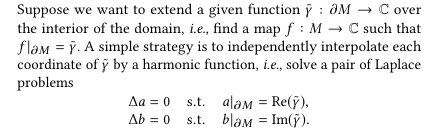

## BFF

本篇文章就是从如何**改变参数域形状**的角度入手，实现了一种可**实时**的高效编辑参数域形状共形参数化算法

可不可以展平后通过平面变形的方法来对形状进行编辑呢？(破坏了pipeline的一致性)

到底能对形状做出什么程度的变形呢？限制肯定是有的。黎曼映射定理是说任意两个拓扑圆盘之间存在共形映射，但并不是说能从一个形状进行任意变形并且还能保持共形性

由复分析理论中关于全纯函数的知识，共形映射是共轭调和映射对组成（conjugate  harmonic pair）,所以求解共形映射就是求解这样一对调和映射对$f = a + bi$

**Cherrier 方程**

Cherrier 方程就是带边流形上的Yamabe方程

$$ \begin{array} { r c l c l } { { \Delta u } } & { { = } } & { { K - e ^ { 2 u } \widetilde { K } } } & { { \mathrm { o n } } } & { { M } } \\ { { \frac { \partial u } { \partial n } } } & { { = } } & { { \kappa - e ^ { u } \widetilde { \kappa } } } & { { \mathrm { o n } } } & { { \partial M } } \end{array} $$

该式等价于

对(1)进行积分

Omega是离散网格的角盈。

同样对(2)进行积分可得

其中定义在边界上得h称为Neumann值

**Poincaré-Steklov operator(Poisson方程边界条件转换)**

BFF算法的输入分两种：（1）共形放缩因子$u$  (2)边界角度$\widetilde k$，分别对应了两种边界条件

Dirichelt to Neumann

Neumann to Dirichlet

**Hibert变换**

计算出了Neumann值h

对于调和函数，边界延拓到内部

算法流程

直接编辑

## Poisson方程

Poisson 方程在自然界中应用广泛，比如热的扩散。其定义为 $\Delta a = b$，Laplace 方程是其中 $b=0$ 的特殊情况，是一种椭圆型偏微分方程，用算法进行数值计算时，将其离散化后可以通过**稀疏线性系统**来进行求解。

Poisson 方程限定了边界后，其边界条件有 **Dirichlet边界条件**与 **Neumann边界条件**。

**Dirichlet 边界条件**
$$
\begin{aligned}
\Delta a &= \phi \quad \text{on } M,\\
a &= g \quad \text{on } \partial M.
\end{aligned}
$$

**Neumann 边界条件**
$$
\begin{aligned}
\Delta a &= \phi \quad \text{on } M,\\
\frac{\partial a}{\partial n} &= h \quad \text{on } \partial M.
\end{aligned}
$$

在三角网格上进行离散化后即转化为如下线性方程组

$$
Aa = P\phi.
$$

其中 $A \in \mathbb{R}^{V \times V}$ 为 **cotan-Laplace 矩阵**。非对角元与对角元常用 cotangent 权表示为

$$
A_{ij} = -\frac{1}{2}\left(\cot\beta_p^{ij} + \cot\beta_q^{ij}\right),
$$

$$
A_{ii} = -\sum_{ij \in E} A_{ij}.
$$

$P$ 是 Mass 矩阵，在展平的场景下可设 $P = E$。

将网格顶点分为内部点与边界点，可对矩阵 $A$ 分块。

对于**Neumann 边界条件**，Poisson 问题可写为分块形式
$$
\begin{bmatrix}
A_{II} & A_{IB} \\
A_{IB}^T & A_{BB}
\end{bmatrix}
\begin{bmatrix}
a_I \\ a_B
\end{bmatrix}
=
\begin{bmatrix}
\phi_I \\ \phi_B - h
\end{bmatrix}.
$$

对于**Dirichlet 边界条件**，有 $a_B = g \in \mathbb{R}^{B}$，消去边界未知量后得到仅关于内部变量的方程

$$
A_{II}\, a_I = \phi_I - A_{IB}\, g.
$$

## Variational Surface Cut

可以得到很好的分割效果

用变分法的方式求解析优化的方式，而不再用传统的组合优化方式

定义一个依赖于切割路径的能量函数，然后通过连续变形（演化）切割路径不断降低这个能量值

变形过程中需要共形因子时刻满足如下Yamabe方程

通过连续变形一条曲线$\gamma$,使得一方面distortion尽可能小，另外长度尽可能小

用Dirichlet能量来度量distortion

仅要求distortion尽可能小，那么问题就是ill-posed，由于可以通过不断延展$\gamma$的长度来减小distortion，所以需要对curve长度进行约束

Cea方法

构造Lagrangian函数

