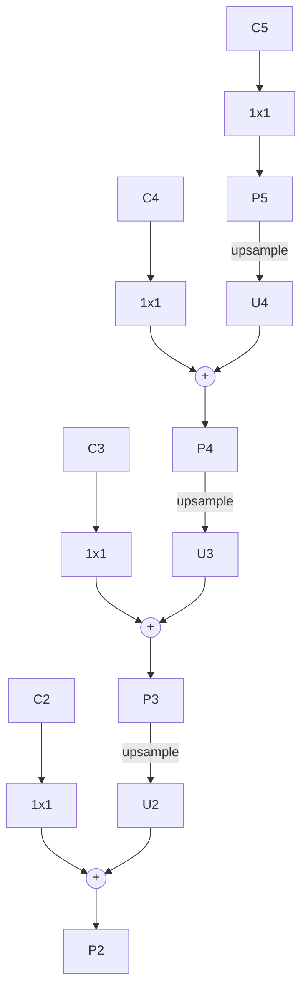

> **论文**：Lin et al., [*Feature Pyramid Networks for Object Detection*](https://arxiv.org/abs/1612.03144), CVPR 2017。  
> 检测上下文见 [两阶段算法](激光除草-目标检测1-两阶段算法.md)、[代码参考](目标检测1-两阶段算法-代码参考.md)（Mask R-CNN / Faster R-CNN 常用 ResNet+FPN）。

---

## 1. 要解决什么问题？

目标检测里目标尺度差几个数量级（远处小草 vs 近处大株）。卷积骨干天然是**语义强、分辨率低**的深层特征，和**分辨率高、语义弱**的浅层特征：

| 层级 | 分辨率 | 语义 | 对检测 |
| :--- | :--- | :--- | :--- |
| 浅层（如 ResNet C2） | 高 | 弱（边缘、纹理） | 利于小目标定位 |
| 深层（如 C5） | 低 | 强（类别） | 利于大目标 / 分类 |

早期做法对比：

- **图像金字塔**：多尺度输入各跑一遍网络 → 准但慢；
- **只用顶层特征**（如 Faster R-CNN 的 C4/C5）→ 快，但**小目标**信息在下采样中丢失严重；
- **SSD 式多尺度**：在骨干不同层直接接检测头 → 浅层语义不够，深层又缺细节。

**FPN** 的主张：在**单次前向**内，用自顶向下路径把强语义送回高分辨率，再经**横向连接（lateral）**与自底向上特征相加，得到**每一层都既有语义又有位置**的金字塔 $\{P_k\}$，供 RPN / 检测头按尺度选用。

---

## 2. 结构：自底向上 + 自顶向下 + 横向

以 ResNet 为例，取 stage 输出 $C_2,C_3,C_4,C_5$（相对输入 stride 约为 $4,8,16,32$）。

```text
自底向上（Backbone）:   C2 → C3 → C4 → C5
                              ↑横向 1×1 降维对齐通道
自顶向下:               P5 ← P4 ← P3 ← P2
                         ↑ 2× 上采样后逐元素相加
```

对每一层（示意）：

$$
\begin{aligned}
M_5 &= \mathrm{Conv}_{1\times1}(C_5),\\
M_k &= \mathrm{Conv}_{1\times1}(C_k) + \mathrm{Upsample}(M_{k+1}),
\quad k=4,3,2,\\
P_k &= \mathrm{Conv}_{3\times3}(M_k).
\end{aligned}
$$

- **$1\times1$**：把各 $C_k$ 通道统一到相同维度（常用 256），才能相加；
- **上采样**：通常最近邻 $\times 2$，把粗语义对齐到更细网格；
- **$3\times3$**：减轻上采样混叠，得到最终 $P_k$。

常再对 $P_5$ 做 stride-2 得到 $P_6$ 专供更大 anchor（RPN 用）。检测时：**大目标看粗层 $P_5/P_6$，小目标看细层 $P_2/P_3$**。



---

## 3. 在检测器里怎么用？

**Faster R-CNN + FPN**：

- RPN 在 **每个 $P_k$ 上**滑窗 + anchor（各层负责不同尺度范围）；
- RoI 按面积映射到某一层：面积大 → 粗层，面积小 → 细层，再 **RoIPool / RoIAlign**；
- 各层共享（或几乎共享）检测头参数。

**Mask R-CNN** 默认骨干就是 ResNet-FPN，小目标与 mask 边界都受益于高分辨率 $P_2$。

经验效果：相对「单层 C4/C5」，COCO 上小物体 AP 提升明显，而相对图像金字塔成本低得多（一次 backbone）。

---

## 4. 和其它融合方式的对比

| 方法 | 思路 | 特点 |
| :--- | :--- | :--- |
| **FPN** | 顶向下语义 + 横向加和 | 检测标配；实现简单 |
| **U-Net 跳连** | 编码–解码对称拼接 | 分割更常见；通道常 concat |
| **SSD 多尺度头** | 各层独立预测 | 浅层语义弱 |
| **PANet** | FPN 后再加自底向上增强路径 | 加强定位信息回流 |
| **BiFPN**（EfficientDet） | 双向、可学习加权融合 | NAS/高效检测常用 |

杂草等小目标场景：FPN（或 PANet/BiFPN）几乎是检测/实例分割的默认「脖子（neck）」。

---

## 5. 代码对照（PyTorch）

```python
import torch
import torch.nn as nn
import torch.nn.functional as F

class FPN(nn.Module):
    """C2..C5 → P2..P5，通道统一为 out_ch"""
    def __init__(self, in_chs=(256, 512, 1024, 2048), out_ch=256):
        super().__init__()
        self.laterals = nn.ModuleList(
            [nn.Conv2d(c, out_ch, 1) for c in in_chs]
        )
        self.smooths = nn.ModuleList(
            [nn.Conv2d(out_ch, out_ch, 3, padding=1) for _ in in_chs]
        )

    def forward(self, cs):
        # cs: [C2,C3,C4,C5]
        laterals = [l(c) for l, c in zip(self.laterals, cs)]
        for i in range(len(laterals) - 1, 0, -1):
            laterals[i - 1] = laterals[i - 1] + F.interpolate(
                laterals[i], size=laterals[i - 1].shape[-2:], mode="nearest"
            )
        return [s(f) for s, f in zip(self.smooths, laterals)]  # P2..P5
```

工程上直接用 torchvision：

```python
from torchvision.models.detection.backbone_utils import resnet_fpn_backbone
backbone = resnet_fpn_backbone("resnet50", pretrained=True)
# fasterrcnn_resnet50_fpn 内部即此类骨干
```

---

## 6. 小结

- FPN = **特征金字塔**，不是图像金字塔：一次前向，多层可用。
- 关键操作：**横向 $1\times1$ + 上采样相加 + $3\times3$ 平滑**。
- 解决「深层有语义、浅层有位置」的割裂，显著改善**多尺度 / 小目标**检测，成为 Faster/Mask R-CNN、一阶段 neck 的基础模块。

---

## 参考文献

1. Tsung-Yi Lin et al. *Feature Pyramid Networks for Object Detection*. CVPR 2017. [arXiv:1612.03144](https://arxiv.org/abs/1612.03144)
2. Shu Liu et al. *Path Aggregation Network for Instance Segmentation*. CVPR 2018. (PANet)
3. Mingxing Tan, Ruoming Pang, Quoc V. Le. *EfficientDet: Scalable and Efficient Object Detection*. CVPR 2020. (BiFPN)
4. Kaiming He et al. *Mask R-CNN*. ICCV 2017.（ResNet-FPN 标配）
