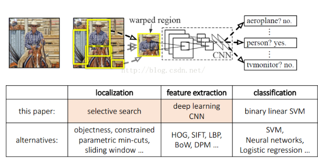
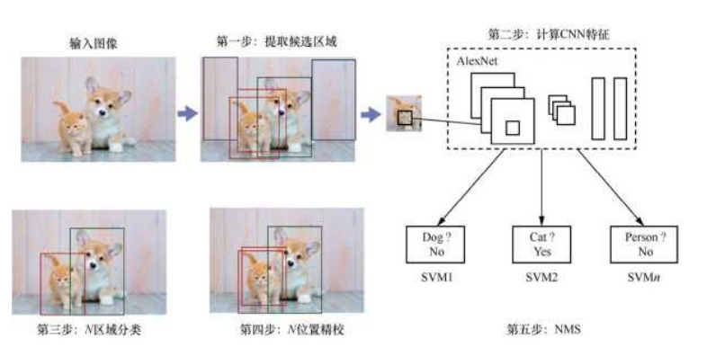
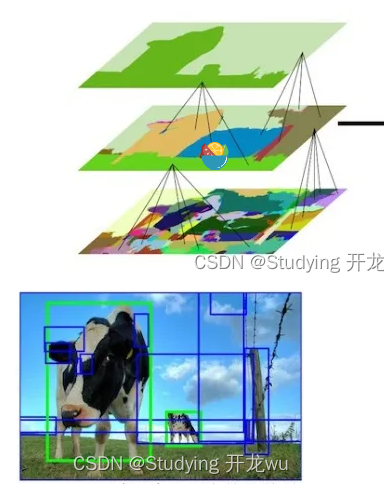
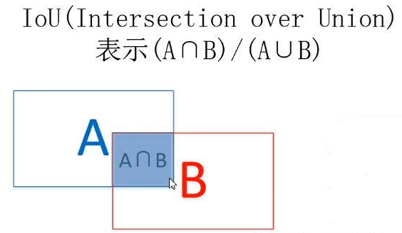
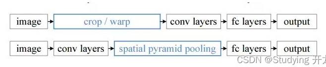
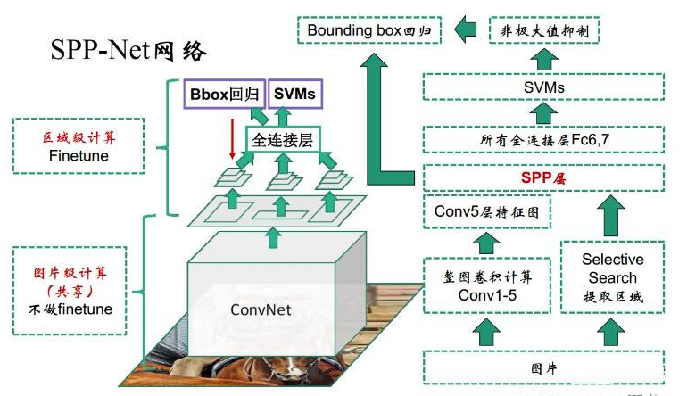
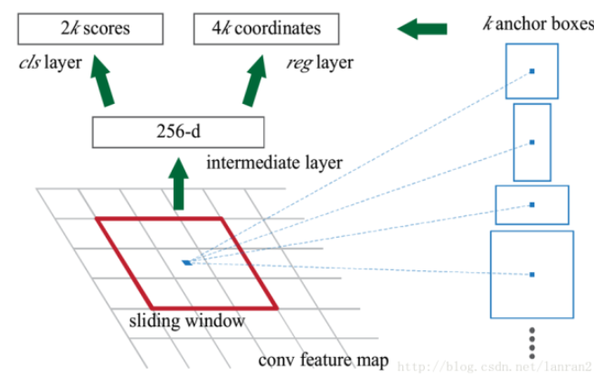
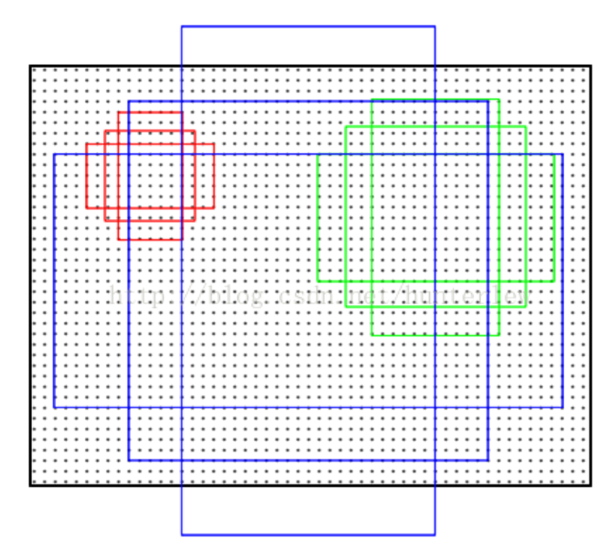
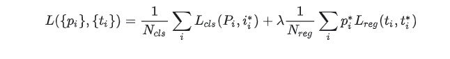

实例分割基于目标检测，目标检测有两种基本流派。**两阶段算法**先选框然后再进行分类代表有Fast RCNN，Faster RCNN；**单阶段算法**直接进行端到端的检测：代表有SSD,YOLO

两阶段算法先进行阶段一：**区域候选（Region Proposal）**确定感兴趣区域（ROI），再进行阶段二：**在候选区域上预测边界框坐标和类别**。

## 开山之作RCNN(2015)

RCNN = Selective Search + CNN提取特征 +SVM分类

#### 提取候选区域:Selective Search

选择性搜索是用于目标检测的区域提议算法，它计算速度快，具有很高的召回率，基于颜色，纹理，大小和形状兼容计算相似区域的分层分组。Selective Search算法主要包含两个内容：Hierarchical Grouping Algorithm、Diversification Strategies。

Hierarchical Grouping Algorithm,用贪心算法对区域进行迭代分组: 计算所有邻近区域之间的相似性； 两个最相似的区域被组合在一起； 计算合并区域和相邻区域的相似度； 重复2、3过程，直到整个图像变为一个地区。

Diversification Strategies,这个部分讲述作者提到的多样性的一些策略，使得抽样多样化，主要有下面三个不同方面： (1)利用各种不同不变性的色彩空间； (2)采用不同的相似性度量； (3)通过改变起始区域。此部分比较简单，不详细介绍，作者对比了一些初始化区域的方法，发现方法效果最好

### CNN提取特征 +SVM分类

在RCNN中，使用selective search方法在**原始图像上生成近2000个Region Proposal**，然后resize到固定尺寸，输入到CNN网络中，也就是说一张原始图片要进行2000次前向推理计算，存在着大量的重复**冗余计算**。

目标检测里用 **IoU（Intersection over Union，交并比）** 衡量两个框的重合程度。设预测框 $B_p$、标注框 $B_{gt}$：

$$
\mathrm{IoU}(B_p, B_{gt}) = \frac{|B_p \cap B_{gt}|}{|B_p \cup B_{gt}|} = \frac{\text{交集面积}}{\text{并集面积}}
$$

取值范围 $[0,1]$：完全重合为 1，无重叠为 0。大于某阈值（常用 0.5）则认为两框足够相近，可当作同一目标的正确框选。

每张图 Selective Search 约产出 2000 个 proposal，需与 GT 比 IoU 打标签：

- **正样本**：某 proposal 与某一类别 GT 的 $\mathrm{IoU} \ge 0.5$，则标为该类正例；
- **负样本（背景）**：与所有 GT 的 **最大 IoU** 低于约 $0.3$，标为背景；
- **中间地带**（约 $0.3\sim 0.5$）：通常丢弃，不参与 SVM 训练，避免难样本干扰。

每个类别单独训一个**二分类 SVM**：正例是该类高 IoU proposal，负例是背景。

### 推理后处理NMS（非极大值抑制）

同一目标常有多个高分重叠框。NMS 流程：

1. 按分类置信度排序；
2. 保留最高分框，删除与它 IoU 超过阈值（常用 $0.3\sim 0.5$）的其余框；
3. 对剩余框重复，直到清空。

这里 IoU 用来判断「是否在打同一个目标」，避免重复检测。

#### 一个直接改进SPPNet

SPPNet的主要贡献在于：**共享卷积计算和Spatial Pyramid Pooling(空间金字塔池化)**，使得**每张图片只需要进行一次CNN网络的前向推理计算**。在RCNN中需要图像块resize到固定大小，难免会有变形和失真。

RCNN的流程需要将每一个图像块输入到网络中。

SPP方法大大减小了计算量。

## FastRCNN&FasterRCNN

区域建议网络（RPN）：Faster R-CNN摒弃了**选择性搜索，**提出区域提议网络（Region Proposal Network）用于生成候选目标区域。RPN网络通过滑窗的方式提取候选区域特征，并将提取的特征映射到一个低维向量，然后将其输入到边界框回归层和边界框分类层，获取候选目标区域的位置偏移和分类输出。

共享卷积特征：Faster R-CNN中RPN和检测网络共享输入图像的卷积特征，实现了端到端的联合训练，使得模型能够更好地调整卷积特征以适应特定的检测任务。

**先验框（Anchors）**：Faster R-CNN中首次提出先验框的概念，通过使用多尺度先验框，RPN能够生成不同大小和长宽比的候选区域，提高了模型对于不同尺度的目标的检测能力。

   ### 候选区域选择:RPN

   利用RPN网络直接生成检测框，极大的提高了检测速度。**RPN的作用是用来提取候选框的，类似于前面介绍的RCNN的第一步Selective Search**。**它的网络结构基于神经网络，但是输出的是包含二元softmax和bbox回归的多任务模型。**

   RPN网络的输入是前面CNN output的**feature maps**。我们在feature map上做一个大小为3x3的滑窗操作, 得到一个**channel是256维的特征图**，尺寸与input的特征图相同，维度是256*H*W。对这个256维的向量，我们分别做**两次1x1卷积操作**，一个得到2k score, 一个得到4k coordinates。

   这个2k score只区分是不是目标，输出**候选区域属于前景（物体）和背景的分数**，这里注意，这里的分类只区分是否包含目标，至于所包含目标的类别，是Faster-RCNN最后的分类网络干的事情。4k coordinates指的是对原图坐标的偏移。

   

   那么这个k又是什么东西呀？这里有一个**anchor(先验框)**的概念，也是RPN的核心之一。论文预先设定好生成9个anchors。我们前面说到对于feature map, 我们有一个3*3的滑窗操作。对于每次滑窗所划到的3x3的区域，就以该区域中心点为坐标，生成9个anchor。anchor它的本质是，将相同尺寸的输入，得到不同尺寸的输出。它们的中心相同，但是有不同的长宽比和尺度。这9个anchor，中心坐标一样，但是大小各不相同，如下图：

   

   

   而上文提到的k就是anchors的数量，所以2k个分数就是9个anchors的共18个分数，36个坐标。对于每个anchor， 计算**anchor与ground-truth bounding boxes的IoU**，大于0.7则判定为有目标，小于0.3则判定为背景，介于0.3-0.7，则设为0，不参与训练

   我们来看看RPN的代价函数：

   

   代价函数有两部分，对应着RPN的两条路线，即**是否包含目标**和**bbox的坐标与anchor坐标的回归误差**。

   ROI pooling :划归为统一大小的框

FastRCNN提出,它的**输入是特征图，输出则是大小固定**的channel x H x W的vector。ROI Pooling是**将一个个大小不同的region proposals，映射成大小固定的(W x H）的矩形框**。它的作用是根据region proposals的位置坐标在特征图中将相应区域池化为固定尺寸的特征图，以便进行后续的分类和输出回归框操作。它可以加速处理速度。

ROI Pooling有两个输入，一个是图片进入CNN后的特征图，另一个是区域的边框。ROI 的输出是一个**region_nums x channels x W x H**的向量。

**RoI可以看成是SPP的简化版本**，原版SPP是多尺度池化后进行concat组成新特征，而RoI只使用一个尺度，可以将任意维度的特征矩阵缩放成固定维度。论文中的具体做法是，把高和宽都平均分为7*7的小块，然后在每一个小块做max pooling操作，channel维度不变，这样做能使输出维度固定，同时RoI Pooling不是多尺度的池化，梯度回传非常方便，为fine-tune卷积层提供了条件。（SPP Net不能fine-tune卷积层）

### 实例分割Mask-RCNN

Mask R-CNN = Faster R-CNN 框架上的实例分割扩展。任务上看「多一个分割头」最直观，但论文贡献不只这一点。

在目标检测（分类 + 框回归）基础上，**并联增加第三个头**——掩码分支（Mask Head）。该分支通常是一个**小型 FCN（全卷积网络）**，在 RoI 特征上**预测像素级二值掩码**。分类仍由分类头负责；mask 按类输出、与分类解耦（不是用 mask 自己做多类竞争）。

相对 Faster R-CNN，主要变化有三点：

1. **Mask Head（主增量）**：并联 FCN，对每个 RoI 做像素级二值 mask。
2. **RoIAlign（另一大改动）**：用 RoIAlign **替换 RoIPool**，去掉量化、双线性插值对齐特征与像素。对框检测略有帮助，对 **mask 边界** 很关键——只加 mask 头、仍用 RoIPool，分割质量会明显差一截。
3. **多任务损失**：\(L = L_{cls} + L_{box} + L_{mask}\)，分类、框回归、掩码三任务联合训练。

#### ROIAlign

RoIPool 会对 RoI 坐标做取整量化，特征和原图像素有错位；实例分割对对齐更敏感，故 Mask R-CNN 改为 RoIAlign。

虚线网格表示特征图，实线表示一个 RoI（本例中分为 2×2 的格子），每个格子内的圆点表示 4 个采样点。ROIAlign 通过特征图上邻近网格点的双线性插值来计算每个采样点的值。RoI、其格子划分以及采样点所涉及的所有坐标均不进行量化。

#### **Head Architecture**

我们扩展了 Faster R-CNN 的两种现有头部结构 [左/右图分别对应 ResNet C4 和 FPN 骨干网络的头部，均添加了 mask 分支。数字表示空间分辨率与通道数。箭头表示 conv、deconv 或 fc 层（conv 保持空间尺寸，deconv 增大空间尺寸）。
