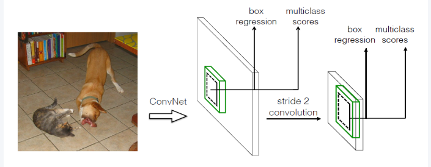
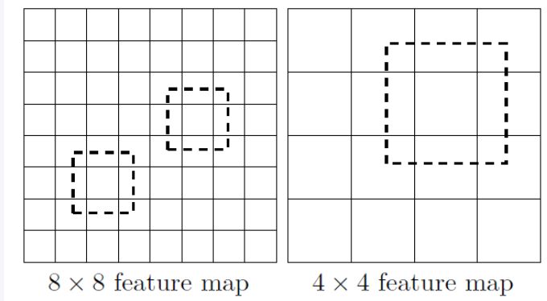
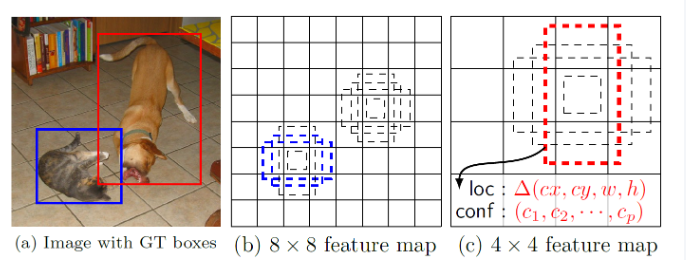

> 两阶段脉络见 [两阶段算法](激光除草-目标检测1-两阶段算法.md)。多尺度特征融合见 [FPN](卷积网络特征融合.md)；无锚点路线见 [无锚点检测](目标检测3-无锚点检测.md)。工程落地见 [YOLO 杂草重训练](激光除草-YOLO%20杂草模型重训练.md)。

---

## 单阶段 vs 两阶段

两阶段（Faster / Mask R-CNN）先 **RPN 提候选**，再对 RoI 分类与回归。单阶段 **省略区域候选**，在整图特征上做 **密集预测（dense prediction）**：每个网格 / 每个先验位置直接出框与类别，一次前向出结果。

| | 两阶段 | 单阶段 |
| :--- | :--- | :--- |
| 流程 | Proposal → 精修 | 直接回归 / 分类 |
| 速度 | 相对慢 | 通常更快，易实时 |
| 典型难点 | RoI 对齐、两段训练 | **正负样本极度不平衡**；小目标 / 召回 |

结构上，现代单阶段多遵循 **骨干（Backbone）– 颈部（Neck）– 头部（Head）**。早期 **YOLOv1 没有明确 Neck**，只有骨干 + 检测头。单阶段里既有 **anchor-based**（SSD、YOLOv2–v5），也有后来的 **anchor-free**（YOLOv8 等），并非一开始就全是锚框。

本文主线：先讲清 **YOLOv1**，用 **SSD** 对照多尺度与先验框，再专节讨论 **正负不均衡**；**YOLOv2 及之后**收成一节演进表，不逐代展开。

```text
YOLOv1（网格+FC）
   ↓          ↘ 对照 SSD（多尺度+先验框）
★ 正负样本不均衡（难负例 / Focal Loss …）
   ↓
YOLO 后续（v2→v8：anchor → 多尺度 → 工程化 → 解耦/无锚）
```

---

## YOLOv1：把检测当成回归

将图像划分为 $S\times S$ 网格（论文常用 $S=7$）。**目标中心落在哪个格子，就由该格负责预测**。每个格子预测 $B$ 个边界框（各含 $x,y,w,h$ 与 **objectness**）以及 $C$ 个类别概率。输出张量维度：

$$
S \times S \times (B\cdot 5 + C)
$$

最终置信度常理解为：$\mathrm{objectness} \times P(\mathrm{class}\mid\mathrm{object})$。类别概率在格子内共享，因此 **每个格子实质更擅长预测一类物体**——同一格多个重叠目标时容易漏检。


架构灵感来自 GoogLeNet：约 24 个卷积层 + 2 个全连接层；前 20 个卷积作骨干，后面接 FC 作为检测头。**全程卷积特征再压到全连接**，空间结构保留较弱。


**损失直觉（多任务加权和）**：有目标的格子强化坐标回归与类别；objectness 对「有无物体」单独监督；无目标格子主要压低 objectness，避免海量背景把训练带偏（正负不均衡的早期对策，见后文专节）。坐标常用平方误差，并对宽高取平方根以减轻大框主导误差。

**局限（后面几代主要在修这些）**：

1. **一格难多目标** → 召回偏弱，尤其小目标、密集目标；
2. **无锚框形状先验**，框形状全靠网络从零学；
3. **FC 检测头** + 单尺度特征，小目标与多尺度场景吃亏；
4. 损失与编码相对粗糙，定位精度不如同时期两阶段。

---

## 对照：SSD（多尺度 + 先验框）

与同期 YOLOv1 对照：同为单阶段 CNN 检测，但 SSD 更早把 **多尺度特征图** 与 **先验框（prior / anchor）** 用到位。



**（1）多尺度特征图**

浅层特征图分辨率高、感受野小 → 偏小目标；深层特征图分辨率低 → 偏大目标。多层都接检测头，比 YOLOv1「只在顶层看一眼」对尺度更友好。



“SSD的流程和YOLOv1的流程是一样的，输入一幅图像得到一系列候选区域，使用NMS得到最终的检测框。与YOLOv1不同的是，SSD使用了不同阶段的特征图用于检测，”


**（2）用卷积做检测头**

与 YOLOv1 末尾全连接不同，SSD 在各尺度特征图上用小卷积核直接出类别与框偏移，保留空间布局、也更易接到任意分辨率特征上。

**（3）先验框（借鉴 Faster R-CNN anchor）**

每个单元放置多种尺度 / 长宽比的 prior；网络学的是相对 prior 的偏移，而不是从零猜任意形状，降低回归难度。下图示意同一中心多种 prior，猫 / 狗分别匹配更合适的形状。



**训练**：GT 与 prior 按 IoU **匹配** 正样本。其余海量背景 prior 会带来严重的正负不均衡——SSD 用 **难负例挖掘** 控制比例；完整原因与后续解法见下节。

---

## 单阶段的正负样本不均衡

这是单阶段相对两阶段最常被低估、却又最伤精度的问题，值得单独拎出来。


### 问题从哪来？

单阶段在特征图上对 **每个位置 × 多种先验（或每个网格）** 都做分类，一张图轻易产生 **成千上万** 个候选；其中真正与 GT 匹配的正样本往往只有几十个，其余几乎全是 **背景负样本**。

两阶段之所以没那么惨：RPN + 采样会把送进第二阶段的 RoI **正负比例压到可控**（例如约 1:3），分类头见到的不是「整图铺满的背景」。

| | 两阶段 | 单阶段密集预测 |
| :--- | :--- | :--- |
| 候选来源 | RPN 筛过再采样 | 几乎所有位置都参与损失 |
| 正负比 | 训练时可人为平衡 | 常为 $1:10^2\sim10^3$ 量级 |
| 若不处理 | 影响较小 | 损失被易分背景主导 |

### 会带来什么后果？

普通交叉熵（CE）对每个样本一视同仁。海量 **易分负例**（一眼就是背景、$p$ 已经很低）贡献的梯度总和很大，模型倾向于「全部判背景也能把平均 loss 压下去」，**难分正例 / 难负例学不动**。这正是早期「单阶段快但不准、不如两阶段」的重要原因之一——不全是结构不行，而是 **训练信号被不平衡淹没**。

注意：这里说的「类别不均衡」在检测里首先是 **前景 vs 背景（正负）** 的极度失衡；前景各类之间数量不均是另一层问题，常叠加出现，但单阶段论文里首要矛盾多是正负比。

### 常见应对（按思路，不是按年代背名单）

**难负例挖掘（Hard Negative Mining）——SSD 路线**

不算全部负样本的损失，只挑 **当前 loss 最大的一批难负例**，并限制正负数量比（如约 1:3）。实现简单、有效，但属于 **离散采样启发式**：阈值与比例要调，且「丢掉」的易分负例信息不参与更新。

**Focal Loss——RetinaNet 路线**

不删样本，而是在 CE 上对「已经分得很对」的样本 **连续降权**：

$$
\mathrm{FL}(p_t) = -\alpha_t (1-p_t)^{\gamma}\log(p_t)
$$

- $p_t$：真实类上的预测概率；越大说明越「易分」；
- $(1-p_t)^{\gamma}$：易分时接近 0，难分时接近 1；$\gamma$ 越大，易分样本权重压得越狠；
- $\alpha_t$：再微调正负相对权重。

**RetinaNet** = FPN + anchor + Focal Loss，用同一套密集预测打平当时两阶段精度，把结论写死：**单阶段要准，必须正面处理正负不均衡**。后续 YOLO 里的损失加权、正样本分配、质量感知分支等，同属这一脉络。

---

## YOLO 后续演进（v2 → v8）

相对 v1 的几条短板（无锚、单尺度、FC 头、工程弱），后面几代可以看成在同一范式上 **打补丁**：密集预测 + NMS 不变，逐项补先验、多尺度与训练配方。

**YOLOv2** 最大变化是引入 **anchor**。对训练集框做 k-means 得到宽高聚类，再预测相对先验的偏移；中心用 sigmoid 锁在网格内，避免早期乱飘。同时去掉全连接检测头、改卷积预测，并做多尺度训练。形状有了先验后，召回与定位相对 v1 明显改善。

**YOLOv3** 在三个尺度特征图上分别预测：高分辨率尺度偏小目标，低分辨率尺度偏大目标，骨干为 Darknet-53。至此 YOLO 系正式吃上特征金字塔红利；多尺度融合原理见 [FPN](卷积网络特征融合.md)。

**YOLOv4 → v5** 更偏工程。v4 把 CSP、Mosaic 等训练技巧拢进 YOLO；v5（Ultralytics）在 **CSP + PANet 式 Neck**、自动 anchor、CIoU 类框损失与完整工具链上继续打磨。精度提升往往来自结构小改加训练配方，而不是再换一套检测哲学。激光除草等业务侧常用的也是这一脉。

**YOLOv8** 进一步收束为现代默认形态：分类与回归 **解耦** 成两路，减轻互相干扰；并走向 **anchor-free**（细节见 [无锚点检测](目标检测3-无锚点检测.md)）。

