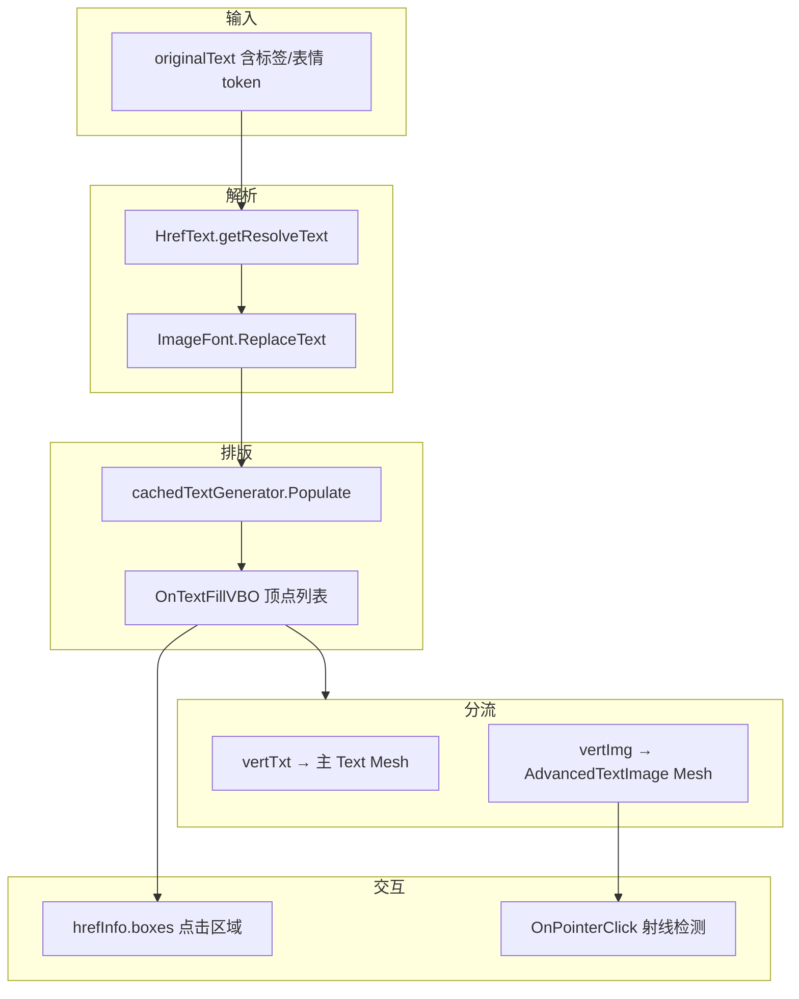

# AdvancedText 技术文档

> 源文件：`cpp/AdvancedText.cs`  
> 涵盖：源码解析、技术栈、Three.js 复刻、生态现成方案、SDF 与位图对比、经验归纳（含 LearnOpenGL 字体章对照）。

---

## 目录

1. [概述](#概述)
2. [架构与数据流](#架构与数据流)
3. [类结构与所用技术](#类结构与所用技术)
4. [Three.js 复刻方案](#threejs-复刻方案)
5. [Three.js 是否有现成方案](#threejs-是否有现成方案)
6. [SDF 与源码技术路线](#sdf-与源码技术路线)
7. [维护经验如何归纳](#维护经验如何归纳)
8. [与 LearnOpenGL 字体章的关系](#与-learnopengl-字体章的关系)
9. [小结](#小结)

---

## 概述

`AdvancedText.cs` 实现的是 **Unity UGUI 下的图文混排富文本**：在普通 `Text` 排版结果上，把占位字符替换成图集精灵四边形，并解析超链接、用顶点包围盒做点击检测。注释写明目标为「图文混排」。

依赖类型（`HrefText`、`ImageFont`、`ReplacementInfo`、`BetterList` 等）不在当前仓库，但从调用方式可以还原其行为契约。

---

## 架构与数据流

### 双图层 + 顶点分流



| 组件 | 职责 |
|------|------|
| `AdvancedText`（继承 `Text`） | 解析、排版、顶点分流、超链接区域、主图层只画文字 |
| `AdvancedTextImage`（`MaskableGraphic`） | 子物体 `Images`，用图集纹理画内联图片/表情 |
| `m_CachedInputRendererBG` | 预留背景层（当前未写入顶点） |

运行时 `CheckImage()` 会：

1. 创建子节点 `Images` / `ImageBG`，铺满父 `RectTransform`
2. 把 **主 Text 的 `raycastTarget` 设为 false**，点击交给图片层或超链接逻辑
3. 把 `ImageFont.Texture` 赋给图片层的 `mainTexture`

这是典型的 **「文字一层、精灵一层」** 分离渲染，避免同一 `Material` 混用字体纹理与图集纹理。

### 文本预处理

`GenerateText()` 在 `isTextDirty` 时：

1. `HrefText.getResolveText(originalText)` — 剥离/记录超链接标签，`getHrefList` 存 `startIndex` / `endIndex`
2. `ImageFont.ReplaceText(m_outText, imageSize)` — 把表情/图片 token 换成 **单个占位字符**，产出 `info.Symbols[]`（含 `Index`、`UV[4]` 等）
3. `m_Text = info.ReplacedText` — 交给 Unity `TextGenerator` 排版

占位符占一个「字」的 advance，从而 **内联位置由引擎排版决定**。

### 超链接点击区域

对 `m_hrefText.getHrefList` 中每条链接：

- 遍历 `[startIndex, endIndex)` 范围内的文字顶点 `position`
- 用 `Bounds.Encapsulate` 扩展包围盒
- 当 `position.x < bounds.min.x` 时视为换行，将当前 bounds 压入 `hrefInfo.boxes`，再开新 box

技术点：**不用 Collider**，而是用排版顶点在本地空间聚合成 `Rect`。点击时用 `RectTransformUtility.ScreenPointToLocalPointInRectangle` 做点包含测试（`OnPointerClick`）。

### 顶点分流（图文混排核心）

`TextGenerator` 每个可见字符 **4 个 `UIVertex`（一个 quad）**。循环 `textVertList` 时：

- 若当前 quad 对应 `SymbolSpriteInfo`（`idx == lastSprite.Index`），则 **不再写入文字顶点**，改为按 `lastSprite.UV` 生成 4 个图片顶点写入 `vertImg`
- 图片顶点位置：`old.position + offset`（`offset.y = -fontSize/4` 微调基线）+ `worldNum * spacing`（与 `lineSpacing` 相关的水平微调）
- 过滤退化 quad：`position[i] == position[i+1]` 的 junk 顶点

最后：

- `FillUIQuad(_toFill, vertTxt)` → 主 Text mesh
- `m_CachedInputRenderer.ImageVertices = vertImg` → 图集 mesh

### `FillUIQuad`

每满 4 个顶点组成一片 quad，三角形索引为 `(0,1,2)` 与 `(2,3,0)`。与 Three.js 里 `BufferGeometry` 的 index buffer 思路一致。

### 性能与脏标记

| 机制 | 作用 |
|------|------|
| `vertCache` + `isPureEmoji` | 纯表情时按 symbol 数量缓存整段文字顶点 |
| `regenText` vs 仅改色 | 尺寸/文案变才重算；只改 `color` 时批量改 `vertImg`/`vertTxt` 的 alpha/颜色 |
| `isTextDirty` / `isVerticisDirty` | 配合 `SetVerticesDirty`、`UpdateGeometry`、`cachedTextGenerator.Invalidate` |

---

## 类结构与所用技术

### `AdvancedTextImage`

- 继承 `MaskableGraphic`，自定义 mesh 绘制
- 持有 `BetterList<UIVertex> vertexStream` 与 `Texture tex`
- `OnPopulateMesh` 调用 `AdvancedText.FillUIQuad` 提交三角形
- `ImageVertices` setter 触发 `isDirty`，在 `Update` 里 `SetVerticesDirty`

### `AdvancedText`

- 继承 `Text`，实现 `IPointerClickHandler` 等
- 序列化字段：`m_ImageFont`、`originalText`、`imageSize`、`isPureEmoji`、`raycastTarget`
- 运行时子渲染器：`m_CachedInputRenderer`（图片）、`m_CachedInputRendererBG`（背景，未使用顶点）
- 顶点缓冲：`vertImg`（图）、`vertTxt`（文）、可选 `vertCache`

### 技术归纳表

| 类别 | 技术 |
|------|------|
| 平台 | Unity、C# |
| UI | **UGUI**（`Text`、`MaskableGraphic`、`VertexHelper`、`Graphic` 脏标记体系） |
| 排版 | **`TextGenerator` / `CachedTextGenerator`**，非 TextMeshPro |
| 资源 | **图集纹理 `ImageFont`**（类 bitmap/sprite font），按 UV 切 quad |
| 网格 | 手写 **UI 三角形索引**、`UIVertex` 流 |
| 交互 | **EventSystems**（`IPointerClickHandler`）、屏幕坐标 → 本地 Rect |
| 工具 | `BetterList`（动态数组）、`Utils` 扩展（如 `SafeInvoke`） |
| 模式 | **占位符替换 + 双 Pass 渲染**、顶点缓存、超链接 AABB 分片 |

**源码实际路线：** 正文为 **位图字体图集**（`TextGenerator`），行内图为 **图集 UV quad**，并非 SDF。

---

## Three.js 复刻方案

Unity 版本质是：**先做一次排版拿位置，再在同一行内叠 sprite quad**。Three.js 没有 `TextGenerator`，需自选排版引擎。

### 方案对比

| 方案 | 优点 | 缺点 |
|------|------|------|
| **A. troika-three-text + Plane/InstancedMesh** | 真 3D、SDF 清晰、与场景统一 | 需自算 inline sprite 位姿 |
| **B. Canvas 2D → Texture** | 实现快 | 放大糊、链接热区难做 |
| **C. three-mesh-ui / MSDF** | 专为 3D UI | 依赖较重 |
| **D. CSS2DRenderer / drei Html** | 富文本、链接最省事 | 非纯 mesh |

与 `AdvancedText` 最接近的 mesh 路线是 **方案 A**；最快出效果是 **DOM/HTML 叠层（方案 D）**。

### 管线对齐

```
originalText
  → parseHref()       // 对应 HrefText
  → replaceTokens()   // 对应 ImageFont
  → layoutLine()      // 对应 TextGenerator
  → emitTextMesh()    // troika / MSDF
  → emitSpriteQuads() // symbol 处放 quad
  → buildHrefBoxes()  // 换行分片 Rect
  → 点击检测          // 对应 OnPointerClick
```

### 参考实现（骨架）

```javascript
import * as THREE from 'three';
import { Text } from 'troika-three-text';

export class AdvancedText3D {
  constructor(options) {
    this.group = new THREE.Group();
    this.atlas = options.atlasTexture;
    this.symbols = [];
    this.hrefBoxes = [];

    this.textMesh = new Text();
    this.textMesh.font = options.fontUrl;
    this.textMesh.fontSize = options.fontSize ?? 32;
    this.textMesh.color = options.color ?? 0xffffff;
    this.textMesh.anchorX = 'left';
    this.textMesh.anchorY = 'top';
    this.textMesh.maxWidth = options.maxWidth ?? 400;
    this.group.add(this.textMesh);

    this.spriteGroup = new THREE.Group();
    this.group.add(this.spriteGroup);
    this.onHrefClick = options.onHrefClick;
  }

  setText(original) {
    const { displayText, symbols, hrefs } = preprocess(original, this.atlasMap);
    this.symbols = symbols;
    this.textMesh.text = displayText;
    this.textMesh.sync(() => {
      this._layoutSprites(symbols);
      this._buildHrefBoxes(hrefs);
    });
  }

  _layoutSprites(symbols) {
    this.spriteGroup.clear();
    const glyphs = this.textMesh.textRenderInfo?.glyphGeometry?.glyphs || [];
    let glyphIndex = 0;
    for (const sym of symbols) {
      while (glyphIndex < glyphs.length && glyphs[glyphIndex].charIndex < sym.charIndex) {
        glyphIndex++;
      }
      const g = glyphs[glyphIndex];
      if (!g) continue;
      const plane = new THREE.Mesh(
        new THREE.PlaneGeometry(sym.width, sym.height),
        new THREE.MeshBasicMaterial({ map: this.atlas, transparent: true, depthTest: false })
      );
      plane.position.set(g.xMin + sym.width * 0.5, g.yMax - sym.height * 0.5, 0.01);
      applyAtlasUV(plane.geometry, sym.uv);
      this.spriteGroup.add(plane);
      glyphIndex += 1;
    }
  }

  _buildHrefBoxes(hrefs) {
    const glyphs = this.textMesh.textRenderInfo?.glyphGeometry?.glyphs || [];
    for (const href of hrefs) {
      const boxes = [];
      let minX = Infinity, minY = Infinity, maxX = -Infinity, maxY = -Infinity;
      for (let i = href.startIndex; i < href.endIndex && i < glyphs.length; i++) {
        const g = glyphs[i];
        if (g.xMin < minX - 1e-3) {
          if (minX < Infinity) boxes.push({ minX, minY, maxX, maxY });
          minX = g.xMin; minY = g.yMin; maxX = g.xMax; maxY = g.yMax;
        } else {
          minX = Math.min(minX, g.xMin);
          minY = Math.min(minY, g.yMin);
          maxX = Math.max(maxX, g.xMax);
          maxY = Math.max(maxY, g.yMax);
        }
      }
      if (minX < Infinity) boxes.push({ minX, minY, maxX, maxY });
      this.hrefBoxes.push({ name: href.name, boxes });
    }
  }
}

function preprocess(original, atlasMap) {
  const symbols = [];
  const hrefs = [];
  let display = original;
  display = display.replace(/<a\s+href="([^"]+)"[^>]*>([\s\S]*?)<\/a>/gi, (_, name, inner) => {
    const start = /* 在 display 上计算的字符索引 */;
    hrefs.push({ name, startIndex: start, endIndex: start + inner.length });
    return inner;
  });
  display = display.replace(/\[img:([^\]]+)\]/g, (_, key) => {
    const sym = atlasMap[key];
    symbols.push({ charIndex: display.length, ...sym });
    return '\uFFFC';
  });
  return { displayText: display, symbols, hrefs };
}
```

```bash
npm install three troika-three-text
```

### Unity ↔ Three.js 对照

| Unity `AdvancedText` | Three.js |
|----------------------|----------|
| `cachedTextGenerator.Populate` | troika `Text.sync()` / canvas `measureText` |
| `UIVertex` 四元组 | `PlaneGeometry` + position/uv attribute |
| `ImageFont.Texture` + `SymbolSpriteInfo.UV` | `Texture` + 自定义 uv |
| `vertTxt` / `vertImg` | `Text` + `spriteGroup` |
| `hrefInfo.boxes` | 局部 AABB + 射线投平面 |
| `MaskableGraphic` 裁剪 | `clippingPlanes` / troika `clipRect` |
| `vertCache` | 按 `symbols.length` 的 `Map` 缓存 |
| `lineSpacing` 微调 | `lineIndex * spacing` 偏移 sprite |

### 实现注意点

1. **占位符必须占排版宽度**，否则图文挤压。
2. **基线对齐**：Unity 用 `(0, -fontSize/4, 0)`；Three.js 应对齐 `glyph.yMin/yMax`。
3. **深度**：sprite `renderOrder` 略高于文字，`depthTest: false` 视 UI 需求而定。
4. **超链接索引**须在 **displayText** 上与 glyph 一致，不是原始串字节偏移。
5. **`m_CachedInputRendererBG`** 可扩展为表情底框，源码未使用。

---

## Three.js 是否有现成方案

**Three.js 核心没有**类似 `AdvancedText` 的图文混排 + 超链接热区 + 图集占位符开箱实现。

| 需求 | 现成程度 |
|------|----------|
| Three.js 内置 | ❌ 无 |
| 行内图 + 文字 + 换行（mesh） | ⚠️ **three-mesh-ui** 的 `Text` + `Inline` / `InlineBlock`（`InlineBlock` 文档曾标 WIP） |
| 超链接热区 | ❌ 需自写（同 `hrefInfo.boxes`） |
| 最快出效果 | ✅ **drei `Html`** / CSS2D（真 DOM，非顶点混排） |
| 与 `ImageFont` 占位机制 1:1 | ❌ 需 troika 排版 + 自写 sprite |

### 生态库简表

| 库 | 说明 |
|----|------|
| [three-mesh-ui](https://github.com/felixmariotto/three-mesh-ui) | 3D/VR UI，`InlineBlock` 行内图标/表情，最接近 mesh 图文混排 |
| [troika-three-text](https://www.npmjs.com/package/troika-three-text) | 高质量 SDF 字，行内图需自拼 |
| [@react-three/drei Html](https://github.com/pmndrs/drei#html) | DOM 富文本，开发成本最低 |
| three-bmfont-text / MSDF 图集 | 偏「图标当字」，非任意 `[img:]` |
| Canvas → `CanvasTexture` | 快但糊，热区难 |

**选型建议：**

- VR / 纯 mesh、行内表情 → **three-mesh-ui**
- 字质量 + 自定义图集 token → **troika + 自写 sprite**（本文复刻路线）
- 链接、样式、混排省心 → **Html/CSS 叠层**
- 几乎 1:1 复刻 UGUI 占位符双图层 → 无开箱库，需自研

---

## SDF 与源码技术路线

**不是**「像 AdvancedText 的效果现在都普遍改成纯 SDF」。

| 层级 | 趋势 |
|------|------|
| **纯文字** | Unity **TMP**、Web **troika/MSDF** 等，SDF/MSDF 已是主流方向 |
| **图文混排** | 仍多为 **占位符排版 + 文字层 + 图集 sprite 层**；行内彩色图/表情通常 **不是** SDF |
| **AdvancedText 源码** | **Bitmap `Text` + `ImageFont` quad**，属于经典位图路线 |

SDF 解决 **字怎么画得清**；AdvancedText 解决 **字和图怎么排在同一行、怎么点链接**。二者正交，可叠加（例如 TMP 字 + Sprite 层）。

「几乎全 SDF」多见于：图标打进同一 MSDF 图集、或纯文字 UI。聊天、自定义 `[img:]` 场景仍多为混合方案。

---

## 维护经验如何归纳

### 实际覆盖的能力

| 工作内容 | 归类 |
|----------|------|
| 占位符、`ImageFont`、行内表情/图 | **富文本 / 图文混排** |
| `vertTxt` / `vertImg`、子 `AdvancedTextImage` | **UGUI 自定义网格绘制** |
| `TextGenerator` 顶点后处理 | **引擎排版结果接入**（非自研字体引擎） |
| 超链接 `boxes`、点击 | **富文本交互热区** |
| 脏标记、`vertCache` | **UI 性能与刷新** |
| 字体光栅化、SDF、hinting | 源码中 **基本没有** |

### 简历 / 自述推荐表述

**推荐：**

- UGUI **富文本 / 图文混排**组件
- 基于 **TextGenerator** 的自定义 Mesh 富文本
- **行内图集**与文字混排、双图层渲染
- 富文本 **超链接点击区域**（顶点包围盒、换行分片）

**可写但宜加限定：**

- 「富文本**排版与显示**（含字体网格与行内精灵）」

**避免单独写：**

- 「字体渲染**引擎**开发」
- 「**SDF** 文字渲染」（除非还维护过 TMP/自研 SDF）

### 一句话（面试用）

> 维护/开发了 Unity UGUI 下的 **图文混排富文本组件**：在引擎排版基础上做占位符替换、文字/图集双 mesh、超链接热区与顶点缓存；属于 **富文本显示与布局定制**，而非底层字体光栅化。

可迁移价值：**标记解析 → 占位排版 → 多 Pass 合成 → 交互热区 → 性能**，在 Web（troika + sprite）、游戏 UI、聊天中结构相同，仅文字层常换成 SDF。

---

## 与 LearnOpenGL 字体章的关系

两段经历处在 **不同层次**，互补而非重复。

### LearnOpenGL 字体章典型流程

1. **FreeType** 加载 TTF/OTF  
2. Glyph **光栅化为位图**（常 8 bit 灰度）  
3. 写入 **纹理图集**，记录 `bearing`、`advance`  
4. **四边形 + 采样 + alpha 混合** 绘制  

属于 **「字体 → 位图 → GPU quad」**，自己处理排版与图集。

### 与 AdvancedText 对照

| | AdvancedText | LearnOpenGL 字体 |
|--|--------------|------------------|
| 层次 | 应用 / UGUI | 图形 API + FreeType |
| 排版 | `TextGenerator` | 按 `advance` 自摆 quad |
| 光栅化 | Unity 内置 | **FreeType** |
| 行内图/链接 | ✅ | 教程通常无 |
| 与 SDF | 无关（bitmap） | 经典教程多为 **位图**，非 SDF |

LearnOpenGL 补的是 **「字怎么变成纹理、怎么画上去」**；AdvancedText 补的是 **「在已有排版上混图、链接、少刷新」**。

### 合并后的能力表述

> **文字显示：** 从 OpenGL + FreeType 理解 glyph 光栅化与图集绘制；在 Unity 上做过 **UGUI 图文混排富文本**（占位符、双 mesh、超链接、顶点缓存）。

分条示例：

- 使用 **FreeType + OpenGL** 实现位图字体图集与 quad 文本绘制（LearnOpenGL 实践）  
- 维护 **UGUI 富文本组件**：行内表情/图集、`TextGenerator` 顶点后处理、超链接区域与性能优化  

加上 LearnOpenGL 后，可说了解 **字体渲染基础链路**，项目侧仍是 **富文本/UI 扩展**；不宜在无 TMP/MSDF 实践时写「精通 SDF 字体引擎」。

### 自然延伸方向

| 方向 | 与现有经验关系 |
|------|----------------|
| MSDF / SDF | 在 LearnOpenGL 图集思路上换距离场纹理 |
| HarfBuzz / shaping | FreeType 之上，教程通常不涉及 |
| troika-three-text | 应用层像 AdvancedText，字层为 SDF |
| 自研富文本 | OpenGL 管画字，自管占位符 + sprite（分工同 AdvancedText） |

---

## 小结

| 主题 | 结论 |
|------|------|
| **组件本质** | UGUI **顶点级图文混排**：排版 → 占位符 → 文字/图集双 mesh → 超链接热区 |
| **源码技术** | **Bitmap 字 + 图集 quad**，非 SDF |
| **行业现状** | 文字层趋向 **SDF/MSDF**；行内图仍多为 **sprite**；排版模式与源码同源 |
| **Three.js** | 无内置；**three-mesh-ui** / **troika+sprite** / **Html** 三档选型 |
| **个人经验** | **富文本 + UGUI 网格定制**；叠加 LearnOpenGL 后为 **「画字管线 + 富文本工程」** |
| **复刻关键** | 先拿 glyph 几何，再叠 sprite；热区用分片 Rect |

---

## 参考

- 源码：`cpp/AdvancedText.cs`
- [three-mesh-ui](https://github.com/felixmariotto/three-mesh-ui)
- [troika-three-text](https://www.npmjs.com/package/troika-three-text)
- [LearnOpenGL — Text Rendering](https://learnopengl.com/In-Practice/Text-Rendering)
