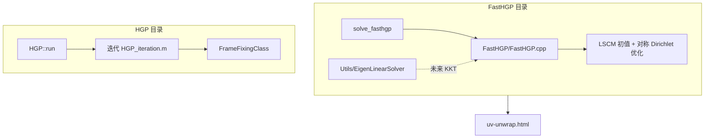

# HGP / FastHGP 代码注释与论文对应

本文档把 `cpp/conformal-parameterization` 中 HGP 与 FastHGP 的实现，与博客解读文章逐段对应。

| 解读文章 | 路径 |
|:---|:---|
| 全局调和参数化（HGP / q-CCM） | `_posts/1.Parameterization/3.几何优化方法/全局调和参数化.md` |
| FastHGP 子空间方法 | `_posts/1.Parameterization/3.几何优化方法/全局调和参数化FastHGP.md` |
| 曲面度量（正则性、度量、共形背景） | `_posts/1.Parameterization/2.共形参数化探微/2016-07-15-曲面度量.md` |

**目录结构**（已拆分）：

| 目录 | 内容 |
|:---|:---|
| `HGP/` | 原始 HGP（CGAL + GMM + MATLAB + MOSEK） |
| `FastHGP/` | 自包含 FastHGP（BaseMesh + Eigen，WASM 与后续完整管线） |

---

## 1. 代码分层总览



| 层次 | 入口 | 依赖 | 适用场景 |
|:---|:---|:---|:---|
| FastHGP（本仓库主实现） | `wasm/bindings_uv_unwrap_simple_compat.cpp::solve_fasthgp` | `BaseMesh` + Eigen + LSCM | 浏览器交互展 UV |
| HGP（遗留桌面版） | `HGP/main.cpp` → `HGP::run` | CGAL + GMM + MATLAB + MOSEK | 原始 HGP 全局调和参数化 |

**注意**：当前 `FastHGP/` 实现了论文中 **对称 Dirichlet 扭曲优化** 的简化版（LSCM 初值 + 梯度下降 + 线搜索）。完整 KKT 子空间、ATP、seam 旋转约束计划在 `BaseMesh` 上迁入 `FastHGP/`；`Utils/EigenLinearSolver` 已就绪。

---

## 2. 公共基础设施

### 2.1 网格与 seam 数据

| 概念（论文/解读） | 代码位置 | 说明 |
|:---|:---|:---|
| 三角网格 $S$ | `Parser/Parser.h`, `Parser/Parser.cpp` | OBJ 顶点、面、锥点、seam |
| CGAL 半边结构 | `HarmonicParametrization::buildTriangleMesh` | 构建 `Mesh`，设置 cut / cone |
| 系统变量索引（cut 后副本） | `HarmonicParametrization::updateIndexOfHEinSystem` | `mIndexOfHEinSystem[he] →` 线性系统列号 |
| 旋转约束表 $r_{ij}$ | `mRotationConstraints`, `HGP::setRotationsConstraints` | seam 边两侧副本的 $90°$ 倍数旋转 |
| 边界分量 | `Borders.h`, `Borders.cpp` | 亏格、边界环、边界顶点遍历 |

对应解读：
- 《全局调和参数化》§Seam 旋转约束、分支覆盖
- 《曲面度量》§正则性：局部 immersion 要求 $\det g > 0$，代码里用 `checkForFoldovers` 检测翻转

### 2.2 结果写回与验证

| 功能 | 函数 | 论文含义 |
|:---|:---|:---|
| 将解写回半边 UV | `HarmonicParametrization::updatHalfedgeUVs` | 从 $z=u+iv$ 恢复各副本坐标 |
| 检测翻转三角形 | `HarmonicParametrization::checkForFoldovers` | 局部单射性：$\det J > 0$ |
| 锥角检测 | `HarmonicParametrization::coneAngleDetection` | 锥点总角是否匹配目标 |
| 共形畸变 $K$ | `HarmonicParametrization::calcK`, `calcDistortion` | 解读《曲面度量》中的角度/面积畸变 |

---

## 3. HGP（全局调和参数化）代码对应

解读文章：《全局调和参数化.md》  
论文：Harmonic Global Parametrization (BCW17)，q-CCM / 分支覆盖 + 调和能量 + Lipman 约束。

### 3.1 主流程

```text
HGP::run
  ├─ loadMesh              读 OBJ、向量场 / frames
  ├─ transferMeshToMatlab  导出 V,F, cones, vectorField
  ├─ setHalfEdgesMap       cut 后半边 → 系统索引
  ├─ setRotationsConstraints   式 (6) seam 旋转
  ├─ setBoundaryFaces      边界/锥点邻域三角形 F_cb
  └─ while (maxIt--)
        ├─ updateHalfEdgesMetric
        ├─ setHarmonicInternalVerticesConstraints   内部调和
        ├─ setHarmonicSeamVerticesConstraints         seam 顶点调和
        ├─ setFramesInMatlab → computeGradientsInCpp  梯度算子 D
        ├─ HGP_iteration.m (CVX/MOSEK)                核心优化
        ├─ FrameFixingClass::runFrameFixingProcedure  锥点 frame 修复
        └─ checkForFoldovers
```

### 3.2 论文章节 ↔ 函数对照

| 解读章节 | 数学对象 | 实现 |
|:---|:---|:---|
| §q-CCM 凸组合性 | $\sum w_{ij}(z_i-z_j)=0$ | `setHarmonicInternalVerticesConstraints`：内部顶点平均权重方程 |
| §Seam 旋转约束 | $z_j^a - z_i^a = e^{i2\pi r_{ij}/q}(z_j^b-z_i^b)$ | `setRotationsConstraints`：组装 `HGP.rotMatrix` |
| §Seam 顶点调和 | 多副本加权方程 | `setHarmonicSeamVerticesConstraints` |
| §调和能量 $\|Lz\|^2$ | 梯度算子 $D$，$L\approx D$ | `computeGradientsInCpp` → `HGP.Grad.m1,m2,S,ti,tj,tk` |
| §Lipman 单射约束 | $\mathrm{Re}(f_{\bar z}\overline{f_z^j/f_z^i}) - |f_z|\ge\epsilon$ | **`HGP_iteration.m`（仍用 MATLAB+CVX）** |
| §覆盖空间 / wheel | 分支覆盖后内部为 wheel | 隐含在 cut + 多副本索引 `updateIndexOfHEinSystem` |
| §帧场 frame field | $\zeta_i$ 用于 Lipman 约束 | `computeFramesFromVectorFieldInCpp` 或外部 `.mat` frames |
| §迭代中 frame 更新 | $f_z/|f_z|$ | `updateFramesFromCurrentFzInCpp` |
| §锥点 frame 修复 | ABF 一环角修正 | `FrameFixingClass`（`frameFixABF` 已迁 C++） |

### 3.3 仍依赖 MATLAB 的部分

| 文件 | 作用 | 可否继续迁移 |
|:---|:---|:---|
| `MatlabScripts/HGP/HGP_iteration.m` | 最小化 $\|Lz\|^2$ + 旋转约束 + Lipman SOCP | 难；需 MOSEK 或自写 SOCP/QP |
| `load(matLocation)` | 从 `.mat` 读预计算 frames | 可改为纯 C++ 读文件 |

**已迁到 C++ 的 HGP 脚本**：`computeGrads`, `getFramesFromVectorField`, `setFrames1/2`, `frameFixABF`, `HGP_settings`, `HGP_report` 等。

---

## 4. FastHGP 代码对应

解读文章：《全局调和参数化FastHGP.md》  
实现目录：`FastHGP/`（`FastHGP.cpp` + `Utils/EigenLinearSolver`）

### 4.1 当前已实现（简化版）

```text
FastHGP::parameterize
  ├─ initializeWithLscm          LSCM 初值
  ├─ buildTriangleData           局部 Jacobian
  ├─ symmetricDirichletEnergy    §8 对称 Dirichlet
  ├─ localInjectivityStep        §8 局部单射线搜索
  └─ decreasingEnergyStep        Armijo 线搜索
```

### 4.2 论文完整管线（计划迁入 FastHGP/）

| 解读 § | 内容 | 状态 |
|:---|:---|:---|
| §5 KKT | 调和基 $H$ | `EigenLinearSolver::selectiveInverse` 已就绪 |
| §6 meta 顶点 | 边界降采样 | 待 BaseMesh 边界 API |
| §7 ATP | 局部凸可行集投影 | 待实现 |
| §8 Newton | 对称 Dirichlet Hessian | 当前为梯度下降近似 |

---

## 5. WASM 入口

路径：
- `FastHGP/FastHGP.{h,cpp}`
- `wasm/bindings_uv_unwrap_simple_compat.cpp::solve_fasthgp`
- 前端：`uv-unwrap.html` 中 **FastHGP** 选项

---

## 6. 符号与代码变量速查

| 论文符号 | 代码中的名字 |
|:---|:---|
| $z = u + iv$ | `GMMDenseColMatrix mUVs` 或半边 `uv()` |
| $D$, $\|Lz\|^2$ | `HGP.Grad.*`, `FillLaplacianInKKT` |
| $K$ | `mKKtEigen` |
| $H$ | `mHarmonicBasisInAllV` / `HarmonicBasis` |
| $c_{\mathrm{int}}$ | `mReducedSolution`, `FastHGP.UVonCones` |
| $f_z, f_{\bar z}$ | `mJfz * c`, `mJfbz * c` |
| $\zeta_i$ (frame) | `mFrames`, `HGP.frames` |
| $F_{cb}$ 边界/锥邻域三角面 | `HGP.BVFaces`, `mReducedFaces` |
| $\partial V$, meta 顶点 | `mConesAndMetaMap`, `mIsMeta` |
| $r_{ij}$ seam 旋转指数 | `mRotationConstraints`, `HGP.rotMatrix` |

---

## 7. Matlab 脚本迁移状态（截至当前）

### `MatlabScripts/HGP/`

| 脚本 | 状态 |
|:---|:---|
| `HGP/HGP_iteration.m` | **保留**（CVX/MOSEK 核心），运行副本；归档见 `reference_matlab/` |
| `computeGrads.m` 等 | 已迁 C++，原版在 `reference_matlab/` |
| `frameFixABF.m` 等 | 已迁 C++，原版在 `reference_matlab/` |

详见 **`HGP/MATLAB与C++对照表.md`**、**`HGP/README.md`**（迁移状态与待办）。

### `MatlabScripts/FastHGP/`

| 原脚本 | 状态 |
|:---|:---|
| 全部 14 个 `.m` | **已删除**，逻辑已迁入 `FastHGP.cpp` |

---

## 8. 阅读顺序建议

1. 先读《曲面度量》理解 immersion、度量、共形与畸变度量。
2. 再读《全局调和参数化》理解 seam、覆盖空间、HGP 优化模型。
3. 读《全局调和参数化FastHGP》理解子空间、KKT、ATP、Newton。
4. 对照本文档从 `HarmonicParametrization` → `HGP::run` 或 `FastHGP::run` 跟代码。
5. 若只做前端展 UV，重点看 **§5 WASM 简化版** 与 `solve_fasthgp`。

---

## 9. 构建与运行

| 目标 | 命令 |
|:---|:---|
| 构建 WASM（含 FastHGP） | `powershell -ExecutionPolicy Bypass -File cpp/build_wasm.ps1 -Target uv_unwrap_simple` |
| 输出 | `assets/wasm/uv_unwrap_simple.js` + `.wasm` |
| 前端 | 打开 `uv-unwrap.html`，选择 **FastHGP** |

桌面版 `HGP/` 需 CGAL、GMM、MATLAB Engine。`FastHGP/` 仅需 BaseMesh + Eigen。

---

## 10. 后续可迁移项

| 优先级 | 内容 | 难点 |
|:---|:---|:---|
| 高 | `HGP_iteration.m` → C++ QP/SOCP | 依赖 MOSEK |
| 中 | WASM 接入 seam/锥点（需 CutSeamMesh） | 与 `uv_unwrap_field` 管线整合 |
| 低 | 桌面版恢复完整 Newton Hessian + PSD 投影 | 与论文 §8 完全一致 |

---

*文档版本：与仓库中 HGP/FastHGP C++ 迁移状态同步；如有函数更名请以源码为准。*
