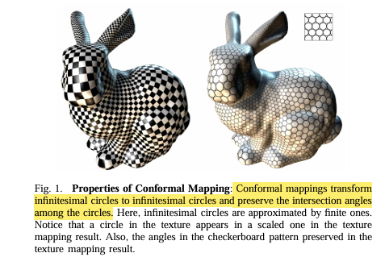
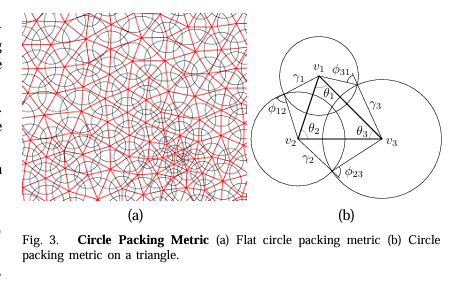

# 曲面展开 系列目录

## 曲面展开（Surface Parameterization）

第1章&emsp;曲面展开-介绍

第2章&emsp;曲面展开-一个简单的展平算法

第3章&emsp;曲面展开-三角网格上的算子

第4章&emsp;数学理论-线性方程组 Ax=b

第5章&emsp;曲面展开-共形映射

第6章&emsp;曲面展开-圆填充方法

第7章&emsp;曲面展开-圆填充方法理论证明

第8章&emsp;数学理论-非线性优化

第9章&emsp;数学理论-微分几何相关知识

第10章&emsp;曲面展开-共形因子

第11章&emsp;曲面展开-Ricci 流


# 曲面展开-一个简单的展平算法

在开始我们的探索之前，我们先根据直觉，构想一个简单的算法。假设我们的曲面$M$是有弹性的——即每一条边都视为是一个弹簧，网格的边界是一个橡皮筋。那么我们可以在外部施加力将边界固定下来。

### A. 三角网格

计算机中所有3D物体的表面都是由许多小三角形拼在一起表示的，这样的三角形组成的网格称为**三角网格(Mesh)** 记作$M=\{V,E,F |V,E,F为网格的顶点,边,面\}$

**拓扑圆盘**是具有单个边界"开口网格曲面"，比如这个简化版("抽象")的大卫头像


#### 三角网格的**半边结构**

对于三角网格(Mesh)这种对象，要想高效实施在其上的算法，该给它设计怎样的数据结构呢？要想到我们的算法会经常在这个数据上做哪些操作呢？我们需要快速索引以下信息:与顶点相邻的边，顶点所在的三角面，一个三角面上顶点，一个三角面上的边。常见的基于三角网格的几何库 有CMU的**Geometry Central** ,ETH的**LibIGL**以及INFRA的**GeoGram**


假设我们把三角网格的边界固定到一个圆周上


为了简化处理，假设对于内部某个顶点$v \in V_{int}$作用在它身上的力是均衡的，那它将会位于其邻居顶点所构成区域的质心位置，这样自然就形成了一个方程了。


1. 将$M$中的顶点集$V$进行编号(用数字代表顶点) $V=\{1,2,3,...n\}$,并划分为内点集和边界点集即 $V = V_{int} \cup V_{bnd}$
2. 对内部顶点$v \in V_{int}$,设$N_v$为其邻居顶点集，则由于$v$位于质心位置则有$x_v = \frac 1 {|N_v|} \Sigma_{u \in N_v}x_u$
3. 对边界顶点$v \in V_{bnd}$,将边界点也进行排序并且$v$的序号$i_v$，由于边界点定在圆周上那么$x_{i_v}=(rcos({\theta_{i_v}}),rsin({\theta_{i_v}}))\\$

上面的式子实际上可以表示成实**稀疏线性系统**$Ax=b,A=\{a_{ij}\}_{n*n}\\$(u,v两个坐标)

1. 对任意的$v \in V_{int}$ , $A(v,u) = \begin{cases}  1 &，  u=v \\ -\frac 1 {|N_v|}&， u \in N_v \\ 0 &，其它\end{cases} $
2. 对任意的$v \in V_{bnd}$, $A(v,u) = \begin{cases}  1 &，  u=v \\  0 &，其它\end{cases} $，其边界序号为$i_v$ ,则$b_{i_v} = (rcos({\theta_{i_v}})，rsin({\theta_{i_v}}) )$

对上述线性方程的求解，如果矩阵$A$的规模不是很大，可以直接$Gauss-Seidal$方法迭代求解，如果$A$的规模很大的话要对$A$进行分解(如$Cholesky分$解)后求解，在后面文章中我们将会详细讨论这个线性方程数值求解问题。


最后可以得到如下图的展平结果


在展平的表面上贴上一层棋盘格，可以直观地观察到扭曲的大小。


事实上，虽然上面的算法我们做了一系列的假设，但是算法的正确性还是有严格的数学保证(解是存在的，并且是有良好性质的)，这个正确性保证来自于图论(Graph Theory)中的**Tutte嵌入定理**(参考文献[1])。

上面的算法虽然正确性是有保证的，但是缺陷也是很明显的就是扭曲太大了(同时角度和面积的变形都很大)。

由于我们的平均权重只考虑到网格的组合性质(没有使用到关于坐标位置等几何信息),所以对于几何上比较复杂的网格模型不可避免会有比较大的扭曲,[2]中优化了权重将几何信息引入从而缓解了这部分造成的扭曲。

这个方法需要我们先固定一个凸多边形边界，那么如果原来的3D模型边界与我们所指定边界如果差别比较大的话（比如“非凸”的边界），那就不可避免的会有比较大的扭曲变形，比较好的当然是算法根据3D模型的特征自动寻找一个比较符合的边界,后面介绍的算法只需要固定两个顶点就会找到一个比较好的边界,并且尽可能减少角度的变形)


---

## 附录


### B. Tutte 嵌入定理

设 $G = (V, E)$ 是 **3-连通平面图**，将顶点集划分为边界顶点 $V_{\text{bnd}}$ 和内部顶点 $V_{\text{int}}$。若满足：

1. **边界固定**：将 $V_{\text{bnd}}$ 按顺序固定到平面上一个**严格凸多边形**的顶点位置；
2. **内部为邻居凸组合**：对每个 $v_i \in V_{\text{int}}$，存在权重 $w_{ij} > 0$（$\sum_j w_{ij} = 1$），使得：

$$
v_i = \sum_{v_j \in N(v_i)} w_{ij} \cdot v_j
$$

**则**：由此得到的平面嵌入**无自交**（全局单射），所有面具有正面积，是一个合法的直线平面嵌入（straight-line planar embedding）。

> 本文使用最简单的均匀权重特例 $w_{ij} = \frac{1}{\vert N(v_i)\vert}$，即每个内部顶点位于其邻居的重心位置。

## **参考文献**

[1] Tutte, W. T. (1963). *How to draw a graph*. Proceedings of the London Mathematical Society.

[2] Floater, M. S. (1997). *Parametrization and smooth approximation of surface triangulations*. CAGD.


# 曲面展开-介绍

<!--more-->

### 引言：从"二向箔"到曲面展平

在刘慈欣的科幻巨著《三体III·死神永生》中，歌者文明使用了一种终极武器——**二向箔**。它一经展开，便将三维空间强制"压扁"为二维平面，整个太阳系——行星、恒星、文明——在瞬间坍缩为一幅没有厚度的巨画。这或许是科幻史上最令人绝望的画面之一：**降维打击**——高维空间被不可逆地映射到低维。

有趣的是，在数学和计算机图形学中，我们也在做一件看似相似的事情：将三维曲面**展平**到二维平面上。但与二向箔不同的是——

- 我们**不摧毁**曲面结构，而是寻找最优的二维**表示**；
- 我们**不甘于**暴力降维，而是追求**尽可能小地扭曲**角度与面积；

但如何将一个三维空间中的曲面摊平到二维的平面上？有时为了方便观察研究人们会将地球仪的表面展平。这在生活经验中看起来似乎不太起眼的问题，但是却蕴含着无限的奥秘。下面我将带您从最朴素的直觉出发，逐步深入复分析、微分几何、拓扑学与凸优化的殿堂，探索**将三维世界优雅地映射到二维平面**的数学艺术。

---

### 曲面展平(参数化)

**曲面展开**是指建立三维曲面与二维平面区域之间的一一对应映射。用数学语言描述：设 $S \subset \mathbb{R}^3$ 是一张三维曲面，$\Omega \subset \mathbb{R}^2$ 是平面区域，参数化即寻找映射：
$$
f: S \to \Omega
$$
使得 $f$ 是**双射（一一对应）**，且具有某种"良好"性质（如保持角度、面积等）。

为了解决这个问题我们要从数学上找到一个**展平映射**$f:R^3\rightarrow R^{2}$，使得三维空间中曲面的点与二维空间中的点是相对应，这个更加低维的空间可以认为是该曲面的参数域，所以曲面的展平也称为曲面的**参数化(Parameterization)**。

参数化的核心矛盾在于：**曲面的高斯曲率决定了它能否被无扭曲地展平**。

根据 **Theorema Egregium（绝妙定理）**，高斯曲率是内蕴量，不能通过等距变换改变。因此：

- **高斯曲率为零**的曲面（如柱面、锥面）可以无扭曲地展平
- **高斯曲率非零**的曲面（如球面）**不可能**无扭曲地展平

这意味着，对于一般曲面，参数化必然引入**扭曲**。算法设计的目标就是：**在满足约束的前提下，最小化扭曲**。

下面我们看一个常见的直观例子，如下图所示这种绘制世界地图的**“墨卡托投影法”**。基本方法是假想在球面内部有一个光源，而球面外部包围着一个圆柱面,光线将球面的点投射到圆柱面上,再将圆柱面展开。


**“墨卡托投影“映射是有扭曲的**,比如我们看地图会发现俄罗斯比非洲面积还要大


但是实际上俄罗斯面积只有非洲大陆面积的一半左右


这种方法牺牲面积大小，保留角度和形状(也称为共形映射)沿着赤道不会发生扭曲，越靠近极点的地方面积扭曲就越大。


**尽可能减小扭曲**是要达成的重要目标，我们要尽可能保证三维曲面展平到平面上后其细节信息不会造成太大的失真。想象下如果CT扫描后的直肠曲面展平后观察到的病灶变形严重的话(肿瘤块被放大或缩小)那这样的映射是不可用的。

**纹理贴图**是一种计算机图形学技术，设计师可以在二维空间进行模拟物体的表面纹理与细节信息的设计，再通过计算机手段将其投影到3D模型表面，从而赋予模型/角色更有深度的视觉体验。在游戏相关的领域中，纹理贴图经常被用来对3D场景和对象进行上色及纹理填充等。


### 现代医学上的应用

比如通过CT扫描获取到腹部断层图像，然后用多视角几何的方法重建三维直肠曲面后，为了方便医生的观察，最后将这个直肠曲面平展到平面上。（使用这种方法，设备和病患没有接触，不需要麻醉，不会诱导并发症）


地图投影泛指将地球表面展平以便绘制地图方法，其核心就是将球面上的点转换为平面上的点。由于投影方式的不同，所形成的世界地图“长相”也大相径庭。

**圆锥****投影**


**方位投影**


**伪圆柱投影**


**折衷投影**


# 曲面展开-三角网格上的算子

---
layout: post
title: "曲面展开-三角网格上的算子"
category: Parameterization
---

### **三角网格上的分片线性映射**

在三角网格的设定下，那么我们要求的映射$f$又可以写成这样$$f:M \rightarrow R^{2},\text M{是R^{3}中的三角网格}$$，而另外一方面要构造这样映射$f$只要对顶点集$V$找到一组$R^2$的坐标(一般称为”**UV坐标**“如下图所示）即可。


我们先来看下三角形**重心坐标(Barycentric Coordinate)**的概念,


有了重心坐标的值之后那么插值的权重采用重心坐标权重就是合理的，那么分段线性映射就可以表达为每个顶点函数值的线性组合，其中系数就是该点在三角形局部坐标系下的重心坐标$f(x) = \alpha f_i + \beta f_j + \gamma f_k$

### 映射的Jacobian矩阵

对于每一个三角面片，我们可以首先建立一个如下的局部坐标系，二维坐标来表示其中的点那就是说如何在每个三角形上建立起局部·坐标系。如下图所示，假设我们选取三角形$T=[x_i,x_j,x_k]$,那么我们以某个顶点$x_i$为原点以某个边$[x_i,x_j]$为$X$轴，然后按照右手定则建立坐标系。


对于每一个三角面片$t$我们可以合理地假设映射$f$在其上的作用可以是一个简单的线性函数$f_t$,可以设$f_t(x) = J_tx + b_t$。

其中$J_t$是Jacobian矩阵，是对映射局部形变情况的描述，在后面我们在对其进行仔细的研究。$b_t$平移量对于参数化映射来说并没有影响，直接设为0

分片线性映射$f$的Jacobian矩阵如下

$$
J_t =
\begin{pmatrix}
\frac{\partial u}{\partial x} & \frac{\partial u}{\partial y} \\[4pt]
\frac{\partial v}{\partial x} & \frac{\partial v}{\partial y}
\end{pmatrix}
=
\begin{pmatrix}
u_j-u_i & u_k-u_i \\[4pt]
v_j-v_i & v_k-v_i
\end{pmatrix}
\begin{pmatrix}
x_j-x_i & x_k-x_i \\[4pt]
y_j-y_i & y_k-y_i
\end{pmatrix}^{-1}
\tag{1}
$$

2阶矩阵可以直接求逆
$$
A = \begin{pmatrix} a & b \\ c & d \end{pmatrix}, \quad
A^{-1} = \frac{1}{ad - bc} \begin{pmatrix} d & -b \\ -c & a \end{pmatrix}
\quad \text{（当 } ad - bc \ne 0 \text{）}
$$
对公式(1)代数变形可以得到下面的展开形式

$$
\begin{aligned}
{\begin{pmatrix}{\frac{\partial u}{\partial x}}\\{\frac{\partial u}{\partial y}}\end{pmatrix} }=\frac{1}{2A_t}{\begin{pmatrix}{y_j-y_k}&{y_k-y_i}&{y_i-y_j}\\{x_k-x_j}&{x_i-x_k}&{x_j-x_i}\end{pmatrix} }
{\begin{pmatrix}u_i\\u_j\\u_k\end{pmatrix} }\\
{\begin{pmatrix}{\frac{\partial v}{\partial x}}\\{\frac{\partial v}{\partial y}}\end{pmatrix} }=\frac{1}{2A_t}{\begin{pmatrix}{y_j-y_k}&{y_k-y_i}&{y_i-y_j}\\{x_k-x_j}&{x_i-x_k}&{x_j-x_i}\end{pmatrix} }
{\begin{pmatrix}v_i\\v_j\\v_k\end{pmatrix} }
\end{aligned}
\tag{2}
$$

其中$A_t$是三角形面积，可以通过叉积求得$2A_t=(x_iy_j-y_ix_j)+(x_jy_k-y_jx_k)+(x_ky_i-y_kx_i)$

**翻转与Jacobi矩阵**

映射$f$ 是无翻转的(flip free)，映射后三角形的定向是不能翻转的，否则也会有错乱的情况


**分段线性映射的奇异值**

对分段线性映射$f$的Jacobian矩阵$J_t$进行SVD分解 ,$$J_t=U\Sigma V^T,\Sigma={\begin{pmatrix}{\sigma_1}&{0}\\{0}&{\sigma_2}\end{pmatrix} } $$,奇异值$\sigma_1 , \sigma_2$分别描述映射在正交两个方向上的拉伸程度，如下图所示


根据分解后的奇异值$\sigma_1 , \sigma_2$，对映射扭曲进行度量

（1）若$\sigma_1 = \sigma_2$ 则这两个三角形是相似三角形，则映射是保角映射

（2）进一步若$\sigma_1 = \sigma_2 =1$ 则这两个三角形只是发生了旋转

当然不是什么映射都可以，必须满足一定的**约束**

1.映射$f$ 是局部单射的(Locally Injective)，即映射之后内部的三角形的边是不能相交的


2. 映射$f$ 是无翻转的(flip free)，映射后三角形的定向是不能翻转的，否则也会有错乱的情况


3.映射$f$ 是双射的(Bijecive), 映射后的边界是不能相交的


## 分片线性映射的梯度

分段线性函数

$$
f(\mathbf{x}) = \alpha f_i + \beta f_j + \gamma f_k
$$
将梯度算子作用于其上可得

$$
\nabla_{\mathbf{x}} f(\mathbf{x}) = f_i \nabla_{\mathbf{x}} \alpha + f_j \nabla_{\mathbf{x}} \beta + f_k \nabla_{\mathbf{x}} \gamma
$$
由重心坐标 $\alpha$ 的面积比表示，

$$
\alpha = \frac{A_i}{A_T} = \frac{\left( (\mathbf{x} - \mathbf{x}_j) \cdot \frac{(\mathbf{x}_k - \mathbf{x}_j)^\perp}{\|\mathbf{x}_k - \mathbf{x}_j\|} \right) \|\mathbf{x}_k - \mathbf{x}_j\|}{2 A_T} = \frac{(\mathbf{x} - \mathbf{x}_j) \cdot (\mathbf{x}_k - \mathbf{x}_j)^\perp}{2 A_T}
$$


进而

$$
\nabla_{\mathbf{x}} \alpha = \frac{(\mathbf{x}_k - \mathbf{x}_j)^\perp}{2A_T},\quad \nabla_{\mathbf{x}} \beta = \frac{(\mathbf{x}_i - \mathbf{x}_k)^\perp}{2A_T},\quad \nabla_{\mathbf{x}} \gamma = \frac{(\mathbf{x}_j - \mathbf{x}_i)^\perp}{2A_T}
$$
因此

$$
\nabla_{\mathbf{x}} f(\mathbf{x}) = f_i \frac{(\mathbf{x}_k - \mathbf{x}_j)^\perp}{2A_T} + f_j \frac{(\mathbf{x}_i - \mathbf{x}_k)^\perp}{2A_T} + f_k \frac{(\mathbf{x}_j - \mathbf{x}_i)^\perp}{2A_T}
$$


## 分片线性映射的Laplace算子

#### Dirichlet能量

对于一个**实映射**,定义其Dirichlet能量为其梯度的$L2$范数
$$
E_D = \frac{1}{2}\int_X|\nabla u|^2dA
$$
可以用Dirichlet能量来衡量映射的平滑性(如一个映射是调和的,则其Dirichlet能量为0)

在三角网格定义域上，该能量的**离散化**如下

$$
E_D = \Sigma_{he_{ij}} cot(\alpha_{ij})(u_i - u_j)^2
$$
Laplace算子，定义为梯度的散度 $\operatorname{div}\,\nabla u$。在 $\mathbb{R}^2$ 上 $\Delta u = u_{xx} + u_{yy}$，故调和映射满足 $\Delta u = 0$，与 Dirichlet 能量极小相关。

> The Laplacian measures the **regularity (or irregularity) of a function.** For instance, for a linear function the Laplacian is equal to zero. **Therefore, minimizing the Laplacian of $u$ and $v$ results in smooth parametric coordinates;** in other words, this also minimizes the distortion of the parameterization. The Laplacian can be generalized to curved surfaces, and the …

对于定义在任二维曲面$S$上的信号$f$,则其Laplace定义为该信号梯度的散度$\Delta_Sf = -div_S \nabla_Sf$，

下面我们看下在离散的三角网格上Laplace算子是怎么样的，在三角网格上Laplaces算子也称为**Laplace-Beltrami算子**


#### 图(Graph)上的Laplace算子

**离散化**，即如何对于三角网格(Mesh)定义Laplace算子呢？

1.将网格看成是图，从而图的Laplace算子也能用来定义网格的Laplace算子(Uniform Laplacian)

$$
\Delta f(v_i) = \frac{1}{|\mathcal{N}_1(v_i)|} \sum_{v_j \in \mathcal{N}_1(v_i)} (f_j - f_i)
$$


#### Laplace-Beltrami算子

2.上面的定义方式仅考虑网格的连接性,没有考虑顶点的几何分布特性，所以更常用的是下面这种定义（Cotangent formula）

对于下面的顶点的小领域$A_i$采用Mixed Voronoi Cell


根据散度定理(Divergence Theorem,又称高斯定理)

$$
\int_{A_i} \operatorname{div} \mathbf{F}(\mathbf{u})\,\mathrm{d}A = \int_{\partial A_i} \mathbf{F}(\mathbf{u}) \cdot \mathbf{n}(\mathbf{u})\,\mathrm{d}s
$$
那么对于Laplace算子则有

$$\int_{A_i} \Delta f(\mathbf{u}) \,\mathrm{d}A = \int_{A_i} \operatorname{div} \nabla f(\mathbf{u}) \,\mathrm{d}A = \int_{\partial A_i} \nabla f(\mathbf{u}) \cdot \mathbf{n}(\mathbf{u}) \,\mathrm{d}s$$

$\mathbf{n}$ 的朝向向外。下图为三角形 $T$ 上与边 $(\mathbf{x}_i,\mathbf{x}_j)$、$(\mathbf{x}_i,\mathbf{x}_k)$ 相关的局部记号（点 $\mathbf{a},\mathbf{b}$ 及法向等）。


对每一个部分分别进行计算

$$
\begin{aligned}
\int_{\partial A_i \cap T} \nabla f(\mathbf{u}) \cdot \mathbf{n}(\mathbf{u})\,\mathrm{d}s
&= \nabla f(\mathbf{u}) \cdot (\mathbf{a} - \mathbf{b})^\perp
=\frac{1}{2}\, \nabla f(\mathbf{u}) \cdot (\mathbf{x}_j -\mathbf{x}_k)^\perp
\end{aligned}
$$


将之前计算的导数代入进去则有

$$
\begin{aligned}
\int_{\partial A_i \cap T} \nabla f(\mathbf{u}) \cdot \mathbf{n}(\mathbf{u})\,\mathrm{d}s
={} & (f_j - f_i)\,\frac{(\mathbf{x}_i - \mathbf{x}_k)^\perp \cdot (\mathbf{x}_j - \mathbf{x}_k)^\perp}{4A_T}  + (f_k - f_i)\,\frac{(\mathbf{x}_j - \mathbf{x}_i)^\perp \cdot (\mathbf{x}_j - \mathbf{x}_k)^\perp}{4A_T}
\end{aligned}
$$


记 $\gamma_j,\gamma_k$ 分别为顶点 $v_j,v_k$ 处的内角。由

$$
A_T = \tfrac{1}{2}\sin\gamma_j \,\|\mathbf{x}_j - \mathbf{x}_i\|\,\|\mathbf{x}_j - \mathbf{x}_k\| = \tfrac{1}{2}\sin\gamma_k \,\|\mathbf{x}_i - \mathbf{x}_k\|\,\|\mathbf{x}_j - \mathbf{x}_k\|
$$


以及

$$
\cos\gamma_j = \frac{(\mathbf{x}_j - \mathbf{x}_i)\cdot(\mathbf{x}_j - \mathbf{x}_k)}{\|\mathbf{x}_j - \mathbf{x}_i\|\,\|\mathbf{x}_j - \mathbf{x}_k\|},\qquad \cos\gamma_k = \frac{(\mathbf{x}_i - \mathbf{x}_k)\cdot(\mathbf{x}_j - \mathbf{x}_k)}{\|\mathbf{x}_i - \mathbf{x}_k\|\,\|\mathbf{x}_j - \mathbf{x}_k\|}
$$
可得

$$
\int_{A_i} \Delta f(\mathbf{u})\,\mathrm{d}A = \frac{1}{2} \sum_{v_j \in \mathcal{N}_1(v_i)} (\cot \alpha_{ij} + \cot \beta_{ij})(f_j - f_i)
$$


从而对 Laplace–Beltrami 算子的离散化可取为

$$
\Delta f(v_i) := \frac{1}{2A_i} \sum_{v_j \in \mathcal{N}_1(v_i)} (\cot \alpha_{ij} + \cot \beta_{ij})(f_j - f_i)
$$


#### **扭曲能量**

另外我们希望映射的扭曲是尽可能小的，我们可以定义一个能量$E(f)$，用来度量映射$f$的扭曲程度,从而可以将参数化问题建模为一个抽象的几何最优化问题,之后的工作就是尽可能找到"好"的能量，找到更快更稳定的收敛方法。

$$
\min_{f \in PL}\, E(f)，\quad f\text{ 满足约束条件}
$$
接下来我们会看到如何定义具体的能量，以及如何对这些能量进行数值优化。


# 数学理论-线性方程组Ax=b

---
layout: post
title: "数学理论-线性方程组Ax=b"
category: Math
---
我们先不讨论方程的解存在性问题，先假设解是存在的，主要考察数值求解的算法。其数值求解方法有1.迭代法 2.共轭梯度法(CG) 3.直接分解法(LLT)，下面我们将进行一一介绍

### 1.迭代法

这是最基础线性方程组数值求解方法，我们先将方程$Ax=b$展开

$$
\begin{aligned}
a_{1,1}x_1 + a_{1,2}x_2 + \cdots + a_{1,n}x_n &= b_1,\\
a_{2,1}x_1 + a_{2,2}x_2 + \cdots + a_{2,n}x_n &= b_2,\\
\vdots \quad & \vdots\\
a_{n,1}x_1 + a_{n,2}x_2 + \cdots + a_{n,n}x_n &= b_n.
\end{aligned}
$$

根据不动点迭代的思路，可以进行如下变形从而有以下的**Jacobi 方法**
$$
x_i^{(k+1)}=\frac{1}{a_{ii}}\left(b_i-\sum_{j\ne i} a_{ij}x_j^{(k)}\right)
$$

对上面的方法进行并行化后，可以得到更加高效的**Gauss-Seidel方法**
$$
x_i^{(k+1)}=\frac{1}{a_{ii}}\left(
b_i-\sum_{j=1}^{i-1}a_{ij}x_j^{(k+1)}-\sum_{j=i+1}^{n}a_{ij}x_j^{(k)}
\right)
$$

可以证明如果矩阵$A$是对角占优的则迭代将收敛，上面迭代法适用范围广算法也简单，但是实际使用时效率是偏低的。

#### 2.共轭梯度法（Conjugate gradients）

其基本思路是将线性方程组$Ax=b$的求解转化为如下二次型的最优化问题
$$
\Phi(x)=\frac{1}{2}x^T A x-b^T x
$$

**梯度下降路径**的选择是关键
$$
\begin{aligned}
k&=0, \quad r^{(0)}=p^{(0)}=Ax^{(0)}-b,\\
\text{while }&\left(\|Ax^{(k)}-b\|\le \epsilon\right)\ \text{and }\left(k<k_{\max}\right),\\
\alpha&=\frac{r^{(k)T}r^{(k)}}{p^{(k)T}Ap^{(k)}},\\
x^{(k+1)}&=x^{(k)}+\alpha p^{(k)},\\
r^{(k+1)}&=r^{(k)}-\alpha A p^{(k)},\\
\beta&=\frac{r^{(k+1)T}r^{(k+1)}}{r^{(k)T}r^{(k)}},\\
p^{(k+1)}&=r^{(k+1)}+\beta p^{(k)},\\
k&\leftarrow k+1.
\end{aligned}
$$

关键不是“盲目沿负梯度前进”，而是在逐步扩展的 **Krylov 子空间里寻找最优方向**，从而避免普通梯度下降常见的锯齿路径。

实现时通常配合如下停止准则：

- 相对残差 $\|r^{(k)}\|/\|b\| < \epsilon$
- 达到最大迭代次数 $k_{\max}$
- 连续若干步残差下降幅度很小（提前停止）

### 3.稀疏对称矩阵的 sparse Cholesky 分解 $A=LL^T$

$$
Ax=b \Leftrightarrow LL^T x=b \Leftrightarrow 
\begin{cases}
Ly=b,\\
L^T x=y.
\end{cases}
$$

$$
\begin{bmatrix}
A_{II} & A_{IB}\\
A_{BI} & A_{BB}
\end{bmatrix}
=
\begin{bmatrix}
L_{II} & 0\\
L_{BI} & L_{BB}
\end{bmatrix}
\begin{bmatrix}
L_{II}^T & L_{BI}^T\\
0 & L_{BB}^T
\end{bmatrix}
$$

需要注意的是Cholesky分解和CG迭代都要求矩阵$A$是对称正定的(Positive Definite),其他分解包括 LU 分解等，但效率不如 Cholesky 分解
$$
Ax=b \Leftrightarrow LUx=b \Leftrightarrow 
\begin{cases}
Ly=b,\\
Ux=y.
\end{cases}
$$

### 实际工程经验

- 对称正定优先 Cholesky（更快、更省内存）
- 非对称或不定矩阵转用 LU / QR
- 超大规模问题优先考虑“预条件 + 迭代法”

## Poisson方程

Poisson 方程在自然界中应用广泛，比如热的扩散。其定义为 $\Delta a = b$，Laplace 方程是其中 $b=0$ 的特殊情况，是一种椭圆型偏微分方程，用算法进行数值计算时，将其离散化后可以通过**稀疏线性系统**来进行求解。

Poisson 方程限定了边界后，其边界条件有 **Dirichlet边界条件**与 **Neumann边界条件**。

**Dirichlet 边界条件**
$$
\begin{aligned}
\Delta a &= \phi \quad \text{on } M,\\
a &= g \quad \text{on } \partial M.
\end{aligned}
$$

**Neumann 边界条件**
$$
\begin{aligned}
\Delta a &= \phi \quad \text{on } M,\\
\frac{\partial a}{\partial n} &= h \quad \text{on } \partial M.
\end{aligned}
$$

在三角网格上进行离散化后即转化为如下线性方程组

$$
Aa = P\phi.
$$

其中 $A \in \mathbb{R}^{V \times V}$ 为 **cotan-Laplace 矩阵**。非对角元与对角元常用 cotangent 权表示为

$$
A_{ij} = -\frac{1}{2}\left(\cot\beta_p^{ij} + \cot\beta_q^{ij}\right),
$$

$$
A_{ii} = -\sum_{ij \in E} A_{ij}.
$$

$P$ 是 Mass 矩阵，在展平的场景下可设 $P = E$。

将网格顶点分为内部点与边界点，可对矩阵 $A$ 分块。

对于**Neumann 边界条件**，Poisson 问题可写为分块形式
$$
\begin{bmatrix}
A_{II} & A_{IB} \\
A_{IB}^T & A_{BB}
\end{bmatrix}
\begin{bmatrix}
a_I \\ a_B
\end{bmatrix}
=
\begin{bmatrix}
\phi_I \\ \phi_B - h
\end{bmatrix}.
$$

对于**Dirichlet 边界条件**，有 $a_B = g \in \mathbb{R}^{B}$，消去边界未知量后得到仅关于内部变量的方程

$$
A_{II}\, a_I = \phi_I - A_{IB}\, g.
$$

## Appendix

### 1.解的存在性

对于$b=0$ 为齐次线性方程组,线性方程组解的存在性等价于其矩阵$A$的可逆性，对于$b\ne 0$ 非齐次线性方程组解的存在唯一性，由非线性方程组相容性问题 $ r(A\vert b) = r(A) $的情况来判定。

### 2.高性能的C++线性代数库—Eigen库

Eigen自带了如下一些求解器，适用于求解大规模稀疏系统

| 求解器             | 适用矩阵 | 依赖 | 特点                     |
| ------------------ | -------- | ---- | ------------------------ |
| **SimplicialLDLT** | 对称正定 | 内置 | 轻量，适合 2D 问题       |
| **SimplicialLLT**  | 对称正定 | 内置 | 比 LDLT 更快但更不稳定   |
| **SparseLU**       | 任意方阵 | 内置 | 基于 SuperLU，支持非对称 |
| **SparseQR**       | 任意矩阵 | 内置 | 用于最小二乘，内存高     |

```C++
#include <Eigen/Sparse>
#include <Eigen/SparseLU>

Eigen::SparseMatrix<double> A(n, n);
// ... 矩阵装配 A ...

Eigen::VectorXd b(n);
// ... 矩阵装配 b ...

Eigen::SparseLU<Eigen::SparseMatrix<double>> solver;
solver.compute(A);

if (solver.info() != Eigen::Success) {
    std::cerr << "Decomposition failed!" << std::endl;
    return -1;
}

Eigen::VectorXd x = solver.solve(b);
```


参考：

经典教材《Numerical Optimization》（Nocedal & Wright）


# 曲面展开-共形映射

###  共形映射 (Conformal Mapping)

如图将一个三维人脸曲面映射到平面圆盘上。我们在人脸曲面任意画两条相交曲线，这两条曲面上的曲线被映射到平面上的两条曲线，空间曲线的交点被映成平面曲线的交点，在交点处，空间曲线的夹角等于平面曲线的夹角。这两条空间曲线任意选取，其夹角都被映射完美保持。


这种能保持角度的映射可以很好的保持图像不失真，我们称之为保角映射(Angle Preserving)，这种类型的映射我们可以认为至少是不错的所以是值得研究的。


我们可以回头再看下墨卡托映射，它虽然会使得不同国家的面积发生变形，但是形状一定是没有发生变化的，这对于制作地图来说，保持角度是很重要的，否则根据地图导航将会南辕北辙。


数学上任意两个平面区域之间都是存在这样的一个保角变换的，在高等数学理论中称这类保持角度的映射为**共形映射**，有如下**黎曼映照定理**保证了这种映射是一定存在的。

 设 $\Omega \subset \mathbb{C}$ 是单连通开集，$\Omega \neq \mathbb{C}$。对任意 $z_0 \in \Omega$，存在唯一全纯双射 $f : \Omega \to \mathbb{D}$ 

满足：  $f(z_0) = 0 , f'(z_0) > 0$ 其中$\mathbb{D} = \{ z \in \mathbb{C} , |z|<1 \}$。

数学上已经理论上保证了存在性，接下来就是设计算法来求解这样的映射。

### 直观的方法-ABF算法

三角网格是由成千上万的三角形组合而成的，那么如果两个三角网格的每对三角形都尽可能相似的话，那么两个三角网格也可以认为是“相似”的，所以我们尝试着让每个小三角形都尽可能保持相似的从而保持整体的形状 ，这种从三角形角度考虑出发的方法称为**ABF（Angle Based Flattening）**算法

设$\alpha_i^0$，$\alpha_i$分别为三角网格展开前后的某个内角值，那它们的映射前后的差值就是$(\alpha_i - \alpha_i^0)^2$，对所有的角度累加，从而得到一个二次优化$E=\Sigma(\alpha_i - \alpha_i^0)^2$ ，约束条件如下：

(1) 由于角度发生改变了，所以对于每个三角形我们要让内角和保持为$\pi$, 即$\Sigma_{\alpha_i\in t}{\alpha_i}=\pi$ 

(2) 另外由于是展平到了平面上，所以对于内部每个顶点v，与它连接角度的角度和为$2\pi$,即$\Sigma_{\alpha_i\in v}=2\pi$

(3) 如下图,对于每个顶点v,其1-邻域两个对角$\beta_i与\gamma_i$满足如下关系$\prod \frac {sin_{\beta_i}} {sin\gamma_i}=1$


上面约束优化问题虽然可以通过Lagrange乘子法转化为无约束优化问题进行求解，但是由于约束(3)中含有非线性条件所以是不容易求解的，一种思路是将约束(3)进行**线性化**后再求解。

实际上保角映射并不是说保三角网格的内角，而是保持的是曲面内两条相交线夹角的不变，所以上面方法并没有很好的保角性质。

### **LSCM算法**


通过高等数学中复变函数的理论来构造一个能量$E$,并求解其最优化。

令复数$U=u+iv,X=x+iy$，那么显然$U(X)$就是一个复函数，复函数是共形的当且仅当其满足的**Cauchy-Riemann方程**
$$
{\partial u}/{\partial x} = {\partial v}/{\partial y} \\ {\partial u}/{\partial y} = -{\partial v}/{\partial x}
\tag{CR}
$$
并结合前面推导的Jacobian矩阵可得下式
$$
{\partial U}/{\partial x} + i{\partial U}/{\partial y} = \frac{i}{2A_t}(W_{t_i},W_{t_j},W_{t_k}){\begin{pmatrix}u_i\\u_j\\u_k\end{pmatrix}}, \quad
其中\begin{cases}W_{t_i} = (x_k - x_j)+i(y_k-y_j)\\
W_{t_j} = (x_i - x_k)+i(y_i-y_k)\\
W_{t_k} = (x_j - x_i)+i(y_j-y_i)\\
\end{cases}
\tag{3}
$$

那么对于每个三角形$T_i$可以通过如下方法定义一个能量来衡量其不满足共形性的程度


$$
C(T_i) = {||{{\partial U}/{\partial x}}+i{{\partial U}/{\partial y}}||}^2 A_{T_j}=\frac {1} {4A_T}{|(W_{j1},W_{j2},W_{j3})(U_{j1},U_{j2},U_{j3})|}^2
$$
将所有三角形能量进行累加$E_{lscm} = \Sigma_{i=1}^{n} C(T_i)$，可以认为是关于复数$U=(U_1,U_2,...,U_n)^T$的二次型$E_{lscm} = C(U=(U_1,U_2,...,U_n)^T)=U^*CU = ||MU||^2$
$$
M=(m_{ij})是|F|\times|V|稀疏矩阵，
m_{ij} = \begin{cases}W_{j,T_i},如果v_j属于三角形T_i \\ 0\end{cases}
\tag{4}
$$
如果不加限制那么会得到平凡解(trivial),即$U=0$的常映射。

要想得到非平凡解需要固定一部分点(pin点)，即固定某些$U$的值，所以可以将$U$分块为$(U_f^T,U_p^T)^T$其中$U_f$是自由的点，$U_p$是固定

同样的将$M$分解$M =(M_f \ M_p)$,其中$M_f$的形状是$|F|*(|V|-p)$
$$
||MU||^2=||MfUf+MpUp||^2
$$
复矩阵$M$的实部与虚部进行分解$M=M^{re}+iM^{im}$,那么可以将上式转为求解如下的**实最小二乘**
$$
\begin{aligned}
C(x) = ||Ax-b||^2,
A={\begin{pmatrix}{M_f^{Re}}&{-M_f^{Im}}\\{M_f^{Im}}&{M_f^{Re}}\end{pmatrix} },
b=-{\begin{pmatrix}{M_p^{Re}}&{-M_p^{Im}}\\{M_p^{Im}}&{M_p^{Re}}\end{pmatrix} }{\begin{pmatrix}U_p^{Re}\\U_p^{Im}\end{pmatrix}}
\end{aligned}\tag{5}
$$
其中矩阵A的大小为$2|F|\times 2(|V| -p)$，并且$b\in R^{2|F|},x\in R^{2|V|-p}$ 

可以证明当固定点个数大于等于2时($p\geq2$)，矩阵A满秩，方程有唯一解

**LSCM 共形能量 = Dirichlet 能量 − 参数域有向面积**。

实际上LSCM能量，可以表达为映射对于Cauchy-Riemann公式的残差值，即$E_{lscm} = \int_X |{\nabla u}^ \perp  - \nabla v|^2 dA$

将上式展开，那么LSCM所计算的能量极小等价于Dirichlet能量极减去面积项（见下图及公式提取）：

$$
\begin{aligned}
E_{\text{LSCM}}(\mathbf{u}) 
&= \int_{\chi} \frac{1}{2}\Bigl( \nabla u^{\perp} \!\cdot\! \nabla u^{\perp} + \nabla v \!\cdot\! \nabla v - 2\,\nabla u^{\perp} \!\cdot\! \nabla v \Bigr)\,dA \\[4pt]
&= \int_{\chi} \frac{1}{2}\Bigl( \nabla u \!\cdot\! \nabla u + \nabla v \!\cdot\! \nabla v - 2\,\nabla u \times \nabla v \Bigr)\,dA \\[4pt]
&= E_D(\mathbf{u}) - A(\mathbf{u})
\end{aligned}
$$

**共形能量的原始定义**（Cauchy-Riemann 残差的 $L^2$ 范数）：
$$
E_C(F) = \frac{1}{2}\int_D \bigl|(\nabla u)^{\perp} - \nabla v\bigr|^2 \, dA \tag{7}
$$

**Dirichlet 能量**：
$$
E(F) = \frac{1}{2}\int_\Omega \bigl(|\nabla u|^2 + |\nabla v|^2\bigr) \, dA \tag{4}
$$

**关键展开式**：
$$
\begin{aligned}
\bigl|(\nabla u)^{\perp} - \nabla v\bigr|^2
&= \bigl((\nabla u)^{\perp} - \nabla v\bigr) \cdot \bigl((\nabla u)^{\perp} - \nabla v\bigr) \\
&= (\nabla u)^{\perp} \!\cdot\! (\nabla u)^{\perp} + \nabla v \!\cdot\! \nabla v - 2(\nabla u)^{\perp} \!\cdot\! \nabla v \\
&= |\nabla u|^2 + |\nabla v|^2 - 2\,\nabla u \times \nabla v
\end{aligned}
$$

**最终关系**：
$$
\boxed{E_C(F) = E_D(F) - A} \tag{8}
$$

其中 $A = \displaystyle\int_D (\nabla u \times \nabla v)\,dA$ 为参数域的有向面积。

> 这意味着最小化 LSCM 共形能量等价于**在固定边界条件下最小化 Dirichlet 能量**（面积项 $A$ 在边界固定时为常数）。


**参考文献**

[1] L. Liu, L. Zhang, Y. Xu, C. Gotsman, and S. J. Gortler. 2008. A local/global approach to mesh parameterization. *Computer Graphics Forum* 27, 5 (2008), 1495–1504.

[1] B. Lévy, S. Petitjean, N. Ray, and J. Maillot, "Least Squares Conformal Maps for Automatic Texture Atlas Generation," *ACM Trans. Graph.*, vol. 21, no. 3, pp. 362–371, Jul. 2002, doi: 10.1145/566654.566590.


# 曲面展开-圆填充方法

---
layout: post
title: "曲面展开-圆填充方法"
category: Parameterization
---


## 从圆填充到共形几何

### 圆是共形几何的基本构建单元

**圆填充可以用来近似共形映射（Thurston）**，共形映射保持角度和圆不变：

- 共形映射将**圆映射为圆**
- 保持两个圆之间的**相交角度**不变

有了这样的认识，我们便可以构造对共形映射的数值逼近算法——用大量的圆对曲面进行填充，然后寻找一个映射，使这些圆在映射后仍然保持圆形。如果映射对所有圆都能做到这一点，它就具有很好的共形性。


### Circle Packing与Circle Pattern

**Circle Packing（圆填充）** 是指在平面（或曲面）上排布一组圆，使得相邻的圆**外切（相切不重叠）**，并且它们的切点关系与给定的图的邻接关系完全一致。对于一个三角网格而言，每个顶点对应一个圆，若两顶点之间有边相连，则对应的两个圆相切。这样便建立了**图的组合结构**与**平面几何配置**之间的对应。

三角网格与圆填充对应的存在性由KAT定理保证，Stephenson 等人实现了三角网格上实现 Circle Packing 的算法，但 Circle Packing 有一个本质局限：**它只考虑了三角网格的连接性质，而没有充分考虑其几何性质（如原始三角形的角度信息）。**也就是说，Circle Packing 的参数化结果仅由图的拓扑结构决定，对原始几何的还原精度有限。

而**Circle Pattern** 是 Circle Packing 的推广。与 Circle Packing 要求圆与圆**相切**不同，Circle Patterns 允许相邻圆以**任意给定角度相交**，从而将原始三角网格的几何信息（内角）编码进圆的配置中。

所有三角形的**外接圆**可以认为是对它的一个**圆图案（Circle Pattern）**

- 每个三角形有一个外接圆
- 相邻三角形的外接圆以一定角度相交
- 相交角度 $\theta_e$ 称为**边权值（edge weight）**


> **边权值定义**：
> $$
> \forall e_{ij} \in E:\, \theta_e = \begin{cases} \displaystyle \pi - \alpha_{ij}^k - \alpha_{ij}^l & \text{for interior edges} \\[8pt] \displaystyle \pi - \alpha_{ij}^k & \text{for boundary edges} \end{cases}
> $$

Circle Pattern 算法的目标是**求这组边权值以及对应的圆半径**，从而得到完整的圆配置，即参数化结果。

## 二、基于Circle Pattern的展平算法

### 算法基本步骤

**输入**：三维三角网格

1. **求可行边权值 $\theta_e$**：二次优化，使 $\theta_e$ 接近原始几何值并满足 **Coherent Angle System 约束**
2. **变分求圆半径**：对 $\rho_i = \log r_i$ 求解凸优化问题
3. **布局**：根据圆半径和相交角度，在平面上重建圆配置，得到参数化坐标

**预处理**（可选）：Intrinsic Local Delaunay 边翻转

**全局参数化**（可选）：引入锥奇异点，处理拓扑复杂的网格


### 1.求可行边权值 $\theta_e$

---

**Circle Patterns 存在性定理**：

> 对于给定边权值 $\theta_e$（共形变换下保持不变）和一个抽象三角网格即单纯复形（Simplicial Complex），其 CirclePattern 存在当且仅当 **Coherent Angle System** 存在。

**Coherent Angle System** 是对抽象三角网格赋予一组符合下面约束的角度值 $\hat{\alpha}_{ij}^k$

**1. 正性约束**：所有角度值都大于0，$$\hat{\alpha}_{ij}^k > 0$$

**2. 三角形内角和约束**：对每个三角形 $t = (i,j,k)$，三个内角之和等于 $\pi$，$$\hat{\alpha}_{ij}^k + \hat{\alpha}_{jk}^i + \hat{\alpha}_{ki}^j = \pi$$

**3. 边权值约束**：对每条内部边 $e = (i,j)$，两侧三角形中的对应角满足：$$\hat{\alpha}_{ij}^k + \hat{\alpha}_{ij}^l = \pi - \theta_e$$

从而，求 Coherent Angle System 等价于求解一个具有 $3|F|$ 个变量、$|F|+|E|$ 个等式约束的线性可行域。

对于空间中给定的三维三角网格，其原始的 $\theta_e$（由网格的实际几何决定）如果不满足 Coherent Angle System 的约束，即无法直接找到合适的圆填充。因此，需要在尽量接近原始角度值的前提下，寻找满足约束的可行 $\theta_e$，这导出如下**二次优化问题**：

> **二次优化目标函数**：
> $$
> Q(\hat{\alpha}) = \sum \left| \hat{\alpha}_{ij}^k - \alpha_{ij}^k \right|^2
> $$

满足**Coherent Angle System约束**

> - **positivity（正性约束）**：$\displaystyle \forall \hat{\alpha}_{ij}^k : \hat{\alpha}_{ij}^k > 0$
>
> - **local Delaunay condition（局部 Delaunay 条件）**：$\displaystyle \forall e_{ij} \in E_\text{int} : \hat{\alpha}_{ij}^k + \hat{\alpha}_{ij}^l < \pi$
>
> - **triangle sum condition（三角形内角和条件）**：$\displaystyle \forall t_{ijk} \in T : \hat{\alpha}_{ij}^k + \hat{\alpha}_{jk}^i + \hat{\alpha}_{ki}^j = \pi$
>
> - **vertex sum condition（顶点角度和条件）**：$\displaystyle \forall v_k \in V_\text{int} : \sum_{t_{ijk}\ni v_k} \hat{\alpha}_{ij}^k = 2\pi$

### 变分法求圆半径

在得到 Coherent Angle System 后，需要通过变分方法求解每个圆的半径，从而确定完整的圆配置。

令 $\rho_{ijk} = \log r_{ijk}$（对圆半径取对数），其中 $r_{ijk}$ 是顶点 $i$ 在三角形 $(i,j,k)$ 中的对应圆半径。


通过几何关系，角度可以表示为：

$$
\alpha_{ij}^k = \alpha(\rho_i, \rho_j, \rho_k) = \arccos\left(\frac{r_i^2 + r_j^2 - r_k^2}{2r_i r_j}\right)
$$
构造能量泛函：

$$
E(\rho) = \sum_{t} \left(\mathcal{L}(\alpha_{ij}^k) + \mathcal{L}(\alpha_{jk}^i) + \mathcal{L}(\alpha_{ki}^j)\right) - \sum_e \theta_e \cdot \log r
$$
其中 $\mathcal{L}(\cdot)$ 是 **Lobachevsky 函数**：

$$
\mathcal{L}(x) = -\int_0^x \log|2\sin t| \, dt
$$
能量泛函的梯度条件给出：

$$
\frac{\partial E}{\partial \rho_i} = K_i = 0
$$
即每个顶点的离散曲率为零（对于平坦参数化）。

> **kite 角度 $\varphi_e^k$ 的计算**：
> $$
> \varphi_e^k = \begin{cases} \displaystyle f_e(x) = \operatorname{atan2}(\sin\theta_e,\, e^x - \cos\theta_e) & e \in E_\text{int} \\[8pt] \displaystyle \pi - \theta_e & e \in E_\text{bdy} \end{cases}
> $$
> 其中 $x = \rho_{ijk} - \rho_{jil}$。
>
> **平坦性约束（非线性方程组）**：
> $$
> \forall t \in T:\, 0 = 2\pi - \sum_{e \in t} 2\varphi_e^t
> $$

这一变分方法的理论基础来自 **Bobenko** 的变分原理,并依据 **Rivin 定理**(理想双曲四面体的二面角与 Circle Pattern 的边权值之间存在对偶关系)

## 三、算法的预处理与锥奇异点

### Intrinsic Local Delaunay 预处理

在正式求解前，可以先对原始三维三角网格进行 **Intrinsic Local Delaunay** 预处理：

> 在不改变网格抽象三角网格结构的前提下，通过边翻转操作使网格在内蕴度量意义下满足 Delaunay 条件。


这一预处理步骤能够显著减小参数化结果的扭曲。


###  锥奇异点

对于拓扑非平凡的曲面（如亏格$g>0$ 的闭合曲面）或者带边界的复杂形状，**不可能让所有顶点都平坦（$K_i=0$）**。高斯曲率必须"有地方去"。而**锥奇异点**是高斯曲率被集中赋予非零值的特殊点：

$$
K_i = 2\pi - \sum_{\text{face } f \ni i} \alpha_i^f\\
其中 \alpha_i^f 为顶点 i 在面 f 中的角度。
$$


**高斯–博内定理**给出了整体曲率与拓扑之间的约束：
$$
\sum_i K_i = 2\pi \chi\\
其中 \chi 为曲面的欧拉示性数
$$


  通过引入锥奇异点，可以极大地减少参数化扭曲：

  - 算法自动将高斯曲率集中到少数几个顶点（锥奇异点）
  - 其余区域保持平坦（高斯曲率为 0）
  - 从而在整体上最小化保角扭曲

  

  在 Circle Pattern 算法中，只需在变分能量中加入对锥奇异点处目标角度的额外约束：

$$
\sum_{f \ni i} \alpha_i^f = 2\pi k_i\\
  其中 k_i 为目标角度亏量系数（通常 k_i \in \mathbb{Z}^+）。
$$

有了锥奇异点后可以用Dijstra算法连接锥奇异点和边界点得到分割线。

  #### 边界条件

  - **自由边界**：边界圆的半径自由变化，参数化结果的边界形状由算法自动确定

    > **自然边界条件（Natural Boundary Condition）**：
    > $$
    > \forall v_k \in V_\text{bdy} :\, \sum_{t_{ijk}\ni v_k} \hat{\alpha}_{ij}^k < 2\pi
    > $$

  - **指定边界**：边界圆满足给定的形状约束（如映射到矩形或圆形边界）

    > **指定边界曲率条件（Prescribed Boundary Curvature）**：
    > $$
    > \forall v_k \in V_\text{bdy} :\, \sum_{t_{ijk}\ni v_k} \hat{\alpha}_{ij}^k = \pi - \kappa_k
    > $$

  

## 附录

  ###  A.Koebe–Andreev–Thurston （KAT）定理

  **Koebe–Andreev–Thurston（KAT）定理** 是 Circle Packing 理论的核心，它给出了圆填充存在性与唯一性的保证：

  > **每一个有限的、简单连通的平面图**（无重边、无自环的平面嵌入图）**都存在唯一的（在Möbius变换意义下）对应圆填充**。


这一定理最早由 Koebe（1928）证明，后由 Thurston（1978）重新发现并推广。Thurston 提出了一种迭代算法来计算 Circle Packing：其核心思路是通过调整每个圆的半径，使得每个内部顶点处的"角度亏量"（即围绕该顶点的圆的夹角之和与 $2\pi$ 的差，称为**离散曲率**）趋向于零。这一过程类似于曲率流，最终收敛到一个满足曲率平衡的圆填充配置。

> **Theorem (Rivin)** — 设 $\Sigma$ 为球面的多面体胞腔分解。假设对每条边 $e$ 赋予角度 $\theta_e$，满足 $0 < \theta_e < \pi$。则存在**理想双曲多面体**，其组合结构等价于 $\Sigma$，且每条外部边的二面角恰好为 $\theta_e$，**当且仅当**以下条件成立：对每个余边界为单顶点的 cocycle $\gamma$，有 $\sum_{e \in \gamma} \theta_e \geq 2\pi$，等号成立 **当且仅当** $\gamma$ 是该顶点的 boundary。

  ### B.Bobenko–Springborn 变分原理的完整推导

#### B.1 物理直觉：为什么用变分法？

Circle Patterns 问题本质上是：**给定边权值 $$\theta_e$$，求一组圆半径 $$\{r_i\}$$ 使得圆的相交角度恰好为 $$\theta_e$$**。

这不是一个简单的代数方程——它是高度非线性的。Bobenko & Springborn (2004) 的天才之处在于发现这个问题等价于一个**凸优化问题**的极值点：

$$\min_{\rho} E(\rho)$$

凸性保证了：
- 解的存在性和唯一性
- 可以用牛顿迭代高效求解

#### B.2 能量泛函的来源：双曲几何对偶

能量泛函并非"凭空构造"，而是来自 **Rivin 定理** 建立的深刻对偶关系：

$$
\begin{array}{ccc}
\text{2D 圆图案 (Circle Patterns)} & \longleftrightarrow & \text{3D 理想双曲四面体} \\
\text{边权值 } \theta_e & \longleftrightarrow & \text{二面角 (dihedral angle)} \\
\text{圆半径 } r_i & \longleftrightarrow & \text{四面体的某种度量参数} \\
\text{能量 } E(\rho) & \longleftrightarrow & \text{双曲体积}
\end{array}
$$

**具体来说**：对于每个三角形 $$t = (i,j,k)$$，三个圆的交点确定了三个夹角 $$\alpha_{ij}^k, \alpha_{jk}^i, \alpha_{ki}^j$$。在双曲空间中，这三个角正好对应某个**理想双曲四面体的三个二面角**，而这个四面体的体积可以用 **Lobachevsky 函数** 表示：

$$V_{\text{tet}} = \mathcal{L}(\alpha_1) + \mathcal{L}(\alpha_2) + \mathcal{L}(\alpha_3)$$

#### B.3 能量泛函的构造

将所有三角形的"体积"求和，再加上边权值的贡献项：

$$E(\rho) = \underbrace{\sum_{t \in T} \sum_{\text{angles } \alpha \in t} \mathcal{L}(\alpha)}_{\text{来自双曲体积（第一项）}} - \underbrace{\sum_{e \in E} \theta_e \cdot \log r_e}_{\text{边权约束项（第二项）}}$$

**各项含义**：
- **第一项**：所有三角形对应的理想双曲四面体体积之和，由 Lobachevsky 函数给出
- **第二项**：类似拉格朗日乘子项，强制每条边的相交角度等于给定的 $$\theta_e$$

其中 **Lobachevsky 函数**定义为：

$$\mathcal{L}(x) = -\int_0^x \log|2\sin t| \, dt$$

该函数具有以下重要性质：
$$
\begin{aligned}
&\mathcal{L}'(x) = -\log(2\sin x) \\
&\text{周期性：} \mathcal{L}(x + \pi) = \mathcal{L}(x) \\
&\text{在 } (0, \pi) \text{ 上严格凹}
\end{aligned}
$$

#### B.4 角度与半径的关系推导

在三角形 $$(i,j,k)$$ 中，三边长分别为 $$r_i + r_j$$, $$r_j + r_k$$, $$r_k + r_i$$（因为圆外切）。由**余弦定理**：

$$\cos(\alpha_{ij}^k) = \frac{(r_i+r_j)^2 + (r_i+r_k)^2 - (r_j+r_k)^2}{2(r_i+r_j)(r_i+r_k)}$$

化简分子：

$$(r_i+r_j)^2 + (r_i+r_k)^2 - (r_j+r_k)^2 = 2r_i^2 + 2r_ir_j + 2r_ir_k - 2r_jr_k$$

因此得到文档中的形式：

$$\boxed{\alpha_{ij}^k = \arccos\left(\frac{r_i^2 + r_j^2 - r_k^2}{2r_i r_j}\right)}$$

令 $$\rho_i = \log r_i$$（取对数是为了保证 $$r_i > 0$$ 并改善数值稳定性）。

#### B.5 能量梯度计算

利用链式法则计算能量泛函关于变量 $$\rho_i$$ 的偏导数：

$$\frac{\partial E}{\partial \rho_i} = \sum_{\alpha \ni v_i} \frac{d\mathcal{L}}{d\alpha}\bigg|_{\alpha} \cdot \frac{\partial \alpha}{\partial \rho_i} - \sum_{e \ni v_i} \theta_e$$

已知 $$\mathcal{L}'(x) = -\log(2\sin x)$$，代入得：

$$\frac{\partial E}{\partial \rho_i} = -\sum_{\alpha \ni v_i} \log(2\sin\alpha) \cdot \frac{\partial \alpha}{\partial \rho_i} - \sum_{e \ni v_i} \theta_e$$

能量极小化条件 $$\nabla E = 0$$ 给出：

$$\forall i:\, K_i = -\sum_{\alpha \ni v_i} \log(2\sin\alpha) \cdot \frac{\partial \alpha}{\partial \rho_i} - \sum_{e \ni v_i} \theta_e = 0$$

即每个顶点的离散曲率为零（对于平坦参数化）。

#### B.6 Kite 角度公式推导（核心！）

观察下图中的 **Kite（风筝形）结构**：两个共享边 $$e = (v_i, v_j)$$ 的相邻三角形形成一个四边形。


在这个 Kite 中：
$$
\begin{aligned}
&\varphi_e^k: \text{左侧三角形在边 } e \text{ 处的 kite 角} \\
&\varphi_e^l: \text{右侧三角形在边 } e \text{ 处的 kite 角} \\
&\theta_e: \text{两圆的相交角（即边权值）}
\end{aligned}
$$

通过复杂的三角恒等变换（利用球面/双曲三角学），可以证明 kite 角度与半径比之间存在如下显式关系：

$$\boxed{\varphi_e^k = f_e(x) = \operatorname{atan2}(\sin\theta_e,\; e^{x} - \cos\theta_e)}$$

其中 $$x = \rho_{ijk} - \rho_{jil} = \log(r_{ijk}/r_{jil})$$ 是**同一顶点两侧圆半径之比的对数**。

**直观理解该公式**：

| 条件 | 结果 | 解释 |
|------|------|------|
| $e^{\Delta\rho} = 1$（两侧半径相等） | $\varphi_e^k = \dfrac{\pi - \theta_e}{2}$ | 对称情况 |
| $e^{\Delta\rho} > 1$ | $\varphi_e^k$ 增大 | 大圆一侧的 kite 角变大 |
| $e^{\Delta\rho} < 1$ | $\varphi_e^k$ 减小 | 小圆一侧的 kite 角变小 |

对于边界边，kite 角度退化为：
$$\varphi_e^k = \pi - \theta_e$$

#### B.7 平坦性约束

能量极小化条件等价于以下非线性方程组：

$$\boxed{\forall t \in T:\, \sum_{e \in t} 2\varphi_e^t = 2\pi}$$

即每个三角形中三个 kite 角之和等于 $$2\pi$$（绕一圈）。这是实际算法中需要通过牛顿迭代求解的方程组。

#### B.8 物理类比与总结

整个系统可以类比为**弹簧系统**：
$$
\begin{aligned}
&\theta_e \text{ 是弹簧的"自然长度"} \\
&\text{偏离自然长度时产生"恢复力"（即曲率 } K_i \text{）} \\
&\text{平衡位置（} \nabla E = 0 \text{）就是所求解}
\end{aligned}
$$

**算法流程总结**：
$$
\begin{aligned}
&1.\ \text{初始化半径 } \rho_i = 0 \text{（即所有 } r_i = 1 \text{）} \\
&2.\ \text{计算当前各边的 kite 角度 } \varphi_e
\end{aligned}
$$
3. 检查平坦性约束是否满足（残差是否足够小）

4. 若不满足，根据雅可比矩阵更新半径

5. 迭代至收敛

#### B.9 算法效果对比

与 ABF算法的对比实验，Circle Pattern 方法的扭曲明显更小

   

  ### 参考文献

  - Bobenko, A. I., & Springborn, B. A. (2004). *Variational principles for circle patterns and Koebe's theorem*. Transactions of the AMS.
  - Stephenson, K. (2005). *Introduction to Circle Packing*. Cambridge University Press.
  - Thurston, W. P. (1978). *The geometry and topology of 3-manifolds*.
  - Rivin, I. (1994). *On geometry of ideal polyhedra: contemporary mathematics*. AMS.


# 曲面展开-圆填充方法理论证明

Rivin定理，理想双曲四面体与圆图案之间的对偶

> **Theorem (Rivin)**. Let $\Sigma$ be a polytopal cellular decomposition of the sphere. Suppose an angle $\theta_e$, with $0 < \theta_e < \pi$, is assigned to each edge $e$. There exists an **ideal** hyperbolic polyhedron which is combinatorially equivalent to $\Sigma$, and with exterior dihedral angles $\theta_e$, if and only if the following condition holds: For every cocycle $\gamma$ of edges, $\sum_{e \in \gamma} \theta_e \geq 2\pi$, with equality if **and only if** $\gamma$ is the boundary of a single vertex.
>
> This **ideal** hyperbolic polyhedron is unique up to isometry.

双曲理想四面体与圆图案（Circle Patterns）之间存在着非常深刻的对偶关系。简单来说，一个理想的双曲多面体（如四面体）的几何形状，唯一地决定了球面上一个特定组合结构的圆图案，反之亦然。这个桥梁性的发现主要由 William Thurston 提出。

### 核心桥梁：从多面体到圆的对偶性

这种联系的本质是"对偶"。下表清晰地展示了两者之间的对应关系：

$$
\begin{array}{lll}
\text{在双曲理想多面体中} & & \text{在球面圆图案中} \\
\hline
\text{每一个面} & \longleftrightarrow & \text{对应一个圆} \\
\text{每一条边} & \longleftrightarrow & \text{对应两个圆的交点} \\
\text{边的二面角} & \longleftrightarrow & \text{圆的外夹角 (Exterior Intersection Angle)} \\
\text{多面体的理想顶点 (位于无穷远处)} & \longleftrightarrow & \text{圆图案中的空隙 (Interstice)，即所有圆未覆盖的一个点}
\end{array}
$$

具体来说，给定一个三维双曲空间中的凸多面体，包含其各个面的"定向双曲平面"的边界，会在无穷远球面（可视为我们通常的球面）上形成一系列圆。这些圆的组合结构（即谁和谁相交）恰好是原多面体的对偶多面体的组合结构。

---

## Theorem (Koebe) — 球面圆填充定理

**Koebe 定理（Koebe, 1936）**

> For every triangulation of the **sphere**, there is a **packing of circles in the sphere** such that circles correspond to vertices and two circles touch if and only if the corresponding vertices are adjacent. This circle pattern is unique up to Möbius transformations of the sphere.

**中文表述：**

对于球面的每一个三角剖分，都存在球面上的一种**圆填充（circle packing）**，使得：

- 每个圆对应一个顶点
- 两个圆相切 **当且仅当** 对应的两个顶点相邻

这种圆填充模式在球面的 **Möbius 变换**意义下是唯一的。

### 关键概念

| 术语                  | 说明                                                 |
| --------------------- | ---------------------------------------------------- |
| Triangulation         | 三角剖分：将曲面划分为三角形网格                     |
| Circle Packing        | 圆填充：一组互不相交（或相切）的圆                   |
| Möbius Transformation | 默比乌斯变换：保角变换 $z \mapsto \frac{az+b}{cz+d}$ |
| Adjacent vertices     | 相邻顶点：共享同一条边的两个顶点                     |

---

## Theorem (Rivin) — 双曲多面体与圆填充

**Rivin 定理（Rivin, 1996）**

> Let $\Sigma$ be a polytopal cellular decomposition of the sphere. Suppose an angle $\theta_e$, with $0 < \theta_e < \pi$, is assigned to each edge $e$. There exists the **ideal hyperbolic polyhedron** which is combinatorially equivalent to $\Sigma$, and with exterior dihedral angles $\theta_e$,** if and only if** the following condition holds: For every cocycle $\gamma$ of edges, $\sum_{e \in \gamma} \theta_e \geq 2\pi$, with equality **if and only if** $\gamma$ is the boundary of a single vertex.

**中文表述：**

设 $\Sigma$ 是球面的一个**多面体胞腔分解**。若对每条边 $e$ 分配一个角度 $\theta_e$（满足 $0 < \theta_e < \pi$），则存在一个与 $\Sigma$ 组合等价的**理想双曲多面体**，且其外二面角为 $\theta_e$，**当且仅当**以下条件成立：

$$\forall \text{ 边的余圈 } \gamma: \quad \sum_{e \in \gamma} \theta_e \geq 2\pi$$

等号成立 **当且仅当** $\gamma$ 是单个顶点的边界。

### 关键概念

| 术语                             | 说明                                                     |
| -------------------------------- | -------------------------------------------------------- |
| Polytopal Cellular Decomposition | 多面体胞腔分解：将球面分解为凸多面体的组合结构           |
| Ideal Hyperbolic Polyhedron      | 理想双曲多面体：所有顶点都在无穷远处的双曲空间中的多面体 |
| Exterior Dihedral Angle          | 外二面角：沿边的两面之间的外角                           |
| Cocycle / 余圈                   | 图论中边集的一个子集，表示"切割"图的结构                 |
| Combinatorially Equivalent       | 组合等价：具有相同的面-边-顶点关联关系                   |

### 条件的几何意义

该条件的本质是**角度和约束**：

- 对任意边的余圈（cut set），其上分配的角度之和不小于 $2\pi$
- 这保证了对应的双曲几何结构的可实现性
- 当余圈恰好是某顶点的星形邻域边界时，角度和等于 $2\pi$

---

## 两定理的联系

Koebe 定理和 Rivin 定理都建立了**离散几何结构**与**圆填充**之间的深刻联系：

```
Koebe 定理:  球面三角剖分  ←→  球面圆填充
                  ↓               ↓
Rivin 定理:  多面体分解    ←→  理想双曲多面体 (通过边角分配)
```


### 以理想四面体为例

对于一个理想的双曲四面体（四个顶点都在无穷远处）：

1. 它有 **4 个面**，因此在对应的圆图案中，球面上会有 **4 个圆**。
2. 它有 **6 条边**，这意味着这 4 个圆在球面上两两相交，共有 **6 个交点**。
3. 四面体每条棱的二面角，恰好等于球面上对应两个圆在交点处的外夹角。

因此，决定一个理想双曲四面体形状的 **6 个二面角**，就等价于决定了球面上一个由 4 个圆构成的图案的 **6 个相交角**。著名的 **Rivin 定理**严格刻画了什么样的二面角组合能够构成一个理想的凸双曲多面体，这也等价于刻画了什么样的相交角组合能在球面上实现一个对应的圆图案。

### 重要工具：变分原理

这个理论不仅优美，而且可计算。Bobenko 和 Springborn 在此基础上建立了一个变分原理。

- **核心思想**：寻找满足给定相交角的圆图案（或对应的理想多面体）的问题，可以转化为一个**凸优化问题**
- **目标函数**：该优化问题的目标函数具有清晰的几何意义——它可以被解释为某个相关理想双曲多面体的**体积**
- **意义**：这为解决圆图案和多面体的存在性、唯一性及构造问题提供了强大而实用的工具

总结来说，**双曲理想多面体（如四面体）与球面圆图案通过"对偶性"紧密相连，其角度数据一一对应**。以 Rivin 定理为理论保证，并通过变分原理这一工具，我们可以在两个领域之间自由转换并解决几何构造问题。

如果你对 Bobenko-Springborn 变分原理的具体形式，或如何从一个给定的圆图案角度出发构造出具体的双曲四面体模型感兴趣，我可以为你进一步解释。

---

## 双曲理想四面体

三维双曲空间 $$\mathbb{H}^3 = \{(x,y,z) | z > 0\}$$，配有双曲度量

$$ds^2 = \frac{dx^2 + dy^2 + dz^2}{z^2}$$

$xy$ 平面是无穷远平面。双曲测地线是和 $xy$ 平面垂直的直线或者半圆弧，双曲测地平面是赤道在 $xy$ 平面上的半球或者者和 $xy$ 平面相垂直的平面。


*图 31.1 显示了一个双曲理想四面体 (hyperbolic ideal tetrahedron)，四个顶点在无穷远处，四个面都是完备测地子流形，即双曲平面。*

$xy$ 平面上放置一个欧氏三角形，三个内角为 $\{\alpha,\beta,\gamma\}$。我们过三条边作三个垂直平面，构成理想四面体的三个面；再作以三角形的外接圆为赤道的半球面，构成理想四面体的第四个面。

> **定理 31.1 (Milnor [27])**. 双曲理想四面体的体积为
> $$
> V(P_0) = V(\alpha,\beta,\gamma) = \Lambda(\alpha) + \Lambda(\beta) + \Lambda(\gamma),
> $$
> 这里 $\Lambda(\theta)$ 是 Lobachevsky 函数。

---

## Lobachevsky 函数

> **定义 31.1** Lobachevsky 函数
> $$
> \Lambda(\theta) = -\int_0^\theta \log|2\sin u|\, du,
> $$
>
> 它具有如下性质：
> 1. **周期性**: $$\Lambda(\theta) = \Lambda(\theta + \pi)$$;
> 2. **奇函数**: $$\Lambda(-\theta) = -\Lambda(\theta)$$;
> 3. $$\frac{1}{2}\Lambda(2\theta) = \Lambda(\theta) + \Lambda(\theta + \frac{\pi}{2})$$.

---

## Bobenko 的变分法

> **Theorem 3.** Let $\Sigma$ be an oriented cellular surface, let $\theta^* \in (0,\pi)^E$ be a function on the non-oriented edges, and let $\Phi \in (0,\infty)^{F_{\Sigma}}$ be a function on the faces.
>
> A Euclidean circle pattern, which is combinatorially equivalent to $\Sigma$, which has interior intersection angles $\theta^*$, and has cone (or boundary) angles $\Phi_f$ in the centers of the circles exists, **if and only if** the following two conditions are satisfied.
>
> **(i)**
> $$
> \sum_{f \in F} \Phi(f) = \sum_{e \in E} 2\theta^*(e) \tag{5}
> $$
>
> **(ii)** If $F'$ is a nonempty subset of the face set $F$, $F' \neq F$, and $E'$ is the set of all edges incident with any face in $F'$, then
> $$
> \sum_{f \in F'} \Phi(f) < \sum_{e \in E'} 2\theta^*(e). \tag{6}
> $$
>
> The Euclidean circle pattern is unique up to similarity.
>
> A corresponding hyperbolic circle pattern in a surface of constant curvature $-1$ with cone-singularities exists, **if and only if** inequality (6) holds for all nonempty subsets $F' \subset F$, including $F$ itself. The hyperbolic circle pattern is unique up to isometry.

---

## Coherent Angle System

> **Proposition 4.** *A coherent angle system exists if and only if the conditions of theorem 3 hold.*
>
> *Proof.* It is easy to see that these conditions are necessary. To prove that they are sufficient, we apply the feasible flow theorem of network theory. Let $(N,X)$ be a network (i.e. a directed graph), where $N$ is the set of nodes and $X$ is the set of branches. For any subgraph $N' \subset N$ let $ex(N')$ be the set of branches having their initial node in $N'$ but not their terminal node. Let $im(N')$ be the set of branches having their terminal node in $N'$ but not their initial node. Assume that there is a lower capacity bound $a_x$ and an upper capacity bound $b_x$ associated with each branch $x$, with $-\infty \leq a_x \leq b_x \leq \infty$.

---

## Colin de Verdière 的突破（1990–1991）

他在论文 *"Un principe variationnel pour les empilements de cercles"* (Invent. Math., 1991) 中提出：

圆填充问题可以转化为一个**凸优化问题（变分原理）**，其解由某个能量函数的最小值给出。

### 核心思想

- 给定一个平面图 $$G = (V,E)$$，为每个顶点 $$v \in V$$ 分配一个对数半径变量 $$x_v = \log r_v$$
- 定义一个**能量函数（或势能）**：
  $$
  E(x) = \sum_{(u,v)\in E} f(x_u - x_v)
  $$
  其中 $$f(t)$$ 是一个**严格凸函数**（例如 $$f(t) = -\log\sinh t$$ 或类似形式），用于编码"相切条件"
- 在适当的约束下（如固定某些圆的位置以消除 Möbius 自由度），**最小化该能量函数**，其极小值点就对应一个合法的圆填充

---

## 其他变分原理

本节推导 Colin de Verdière、Brägger 和 Rivin 的变分原理。对于圆填充，Colin de Verdière 的泛函可以通过最小化 **不在模式中出现的那些正交相交圆的半径** 来从我们的泛函 $$S_{Euc}$$ 和 $$S_{hyp}$$ 得到。Brägger 和 Rivin 泛函的推导涉及 $$S_{Euc}$$ 的 Legendre 变换。我们认为 Leibon 的泛函可以通过 $$S_{hyp}$$ 的 Legendre 变换以相同的方式推导出来。

本文思路引自 Colin


- **Koebe 定理**（1936）：任意有限连通平面图都存在一个圆填充表示。
- 传统证明依赖复分析（共形映射）或几何构造（如 Thurston 的迭代算法）。


## 双曲四面体与Lobachesky函数

### 4.1 从双曲三角形到双曲四面体

在欧氏几何中，三角形的面积由底×高决定；而在双曲几何中，**面积完全由角度决定**——这就是著名的 **Gauss-Bonnet 公式**：

$$\text{Area}(\triangle) = \pi - (\alpha + \beta + \gamma)$$

其中 $\alpha, \beta, \gamma$ 是双曲三角形的三个内角。这个**亏量**（defect）$\pi - (\alpha+\beta+\gamma)$ 正比于面积。

将这一思想推广到三维双曲空间 $\mathbb{H}^3$，我们考虑最简单的多面体——**双曲四面体**（hyperbolic tetrahedron）。与双曲三角形类似，双曲四面体的体积也由其**二面角**（dihedral angles）唯一决定。

### 4.2 Lobachevsky 函数

**Lobachevsky 函数**（也记作 $\Lambda(x)$ 或 $\Pi(x)$）是研究双曲几何的核心特殊函数：

$$\boxed{\Lambda(x) = -\int_0^x \ln|2\sin t|\, dt}$$

该函数具有以下关键性质：

| 性质                 | 表达式                                                       |
| :------------------- | :----------------------------------------------------------- |
| **奇函数**           | $\Lambda(-x) = -\Lambda(x)$                                  |
| **周期性**           | $\Lambda(x + \pi) = \Lambda(x)$                              |
| **Duplication 公式** | $\Lambda(2x) = 2\Lambda(x) + 2\Lambda\left(\frac{\pi}{2} - x\right)$ |
| **特殊值**           | $\Lambda\left(\frac{\pi}{2}\right) = 0$, $\quad \Lambda\left(\frac{\pi}{3}\right) = \frac{G}{3}$ （$G$ 为 Catalan 常数） |
| **级数展开**         | $\displaystyle\Lambda(x) = \sum_{n=1}^{\infty}\frac{\sin(2nx)}{n^2}$ |

> **注：** 该函数最早由 N.I. Lobachevsky 在其关于非欧几何的研究中引入，用于表达双曲四面体的体积。C.L. Siegel 后来对其进行了深入研究。

### 4.3 双曲余弦定律（二面角形式）

设双曲四面体的六个二面角分别为：

$$\theta_{ij}, \quad i < j,\quad i,j \in \{0,1,2,3\}$$

其中 $\theta_{ij}$ 是以边 $e_{ij}$ 为公共棱的两个面的夹角。

对于任意一个顶点 $i$ 处相交的三条棱上的三个二面角，满足**双曲余弦关系**。以顶点 0 为例，有：

$$\cos\theta_{23} = \cos\theta_{12}\cos\theta_{13} + \sin\theta_{12}\sin\theta_{13}\cos\alpha_0$$

其中 $\alpha_0$ 是顶点 0 处的**立体角**（solid angle）。这可以看作是球面余弦定律在双曲空间中的推广。

更一般地，六个二面角必须满足一定的相容条件才能构成合法的双曲四面体——它们对应于 Gram 矩阵的正定性约束。

### 4.4 双曲四面体的体积公式

双曲四面体的体积可以用 **Lobachevsky 函数**精确表达。最经典的形式是 **Murakami-Yano 公式**（1995）以及更早的 **Milnor-Schlafli 公式**：

#### 基本形式

设双曲四面体的六个二面角为 $\theta_{01}, \theta_{02}, \theta_{03}, \theta_{12}, \theta_{13}, \theta_{23}$。则体积可表示为：

$$V = \frac{1}{8}\sum_{i=0}^{7}\varepsilon_i\,\Lambda(\phi_i)$$

其中 $\phi_i$ 是由二面角通过特定线性组合构造的角度参数，$\varepsilon_i = \pm 1$ 为符号系数。

#### 更直观的形式（Chen 形式）

对于**理想四面体**（ideal tetrahedron，即所有四个顶点都在无穷远处），体积只取决于三个**边参数** $z_1, z_2, z_3 \in (0, \pi)$：

$$V(z_1, z_2, z_3) = \Lambda(z_1) + \Lambda(z_2) + \Lambda(z_3) + \Lambda(z_1 + z_2 + z_3 - \pi)$$

这三个边参数满足 $z_1 + z_2 + z_3 > \pi$ 且每个 $z_i < \pi$。

#### 一般情形（非理想四面体）

对于一般的（紧致或有理想顶点的）双曲四面体，体积公式更为复杂，需要用到 **五项恒等式**（pentagonal identity）：

$$V = \sum_{k=1}^{6}(-1)^{s_k}\,\Lambda(\omega_k)$$

其中 $\omega_k$ 由二面角的加减组合给出，符号 $s_k$ 取决于具体配置。

### 4.7 数值示例

以下是一些典型值：

| 四面体类型         | 二面角特征       | 近似体积                         |
| :----------------- | :--------------- | :------------------------------- |
| 理想正四面体       | 全部二面角 = 60° | $V \approx 1.0149416...$         |
| 极薄四面体（退化） | 一个二面角 → 0   | $V \to 0$                        |
| 最大体积紧致四面体 | 特殊优化配置     | $V < 3.330...$（Jørgensen 定理） |

最大体积的理想四面体体积约为 $V_{max} \approx 1.01494$（当所有二面角相等时达到），而紧致（有限体积）双曲四面体的体积上界约为 $V_{compact} < 3.330$。


### 引用

Variational principles for circle patterns and Koebe's theorem

Kenneth Stephenson, *Introduction to Circle Packing*, Cambridge Univ. Press, 2005.


# 数学理论-非线性优化

略了H的计算


由于泰勒展开只对局部有比较好的近似效果，所以自然需要给$\Delta x$添加一个范围，称为信赖域

LM方法是一种信赖域方法


通过对$\rho$进行放缩


改良版的GN方法


LM算法进一步用到了拉格朗日乘子法，将约束项并入到优化中


## AppendixAppendix
手写GN与使用Ceres库

Ceres库是专门用于求解非线性最小二乘的函数库

## 牛顿法


## 拟牛顿法 


### LBFGS

### 线搜索( Line Search)

#### Armijo准则

#### Wolfe准则


### 信赖域(Trust Region)


# 数学理论-微分几何相关知识

### 曲率

如果要定义曲面的曲率首先就要先了解曲线的曲率

**曲线的曲率**


Frenet坐标架


**曲面的曲率**

可以证明曲面上曲率最大和最小的方向是一定是彼此正交的


主曲率向量场


**曲率的计算**


主曲率是以下广义特征值问题的解


形状算子是矩阵


如何计算主曲率


### 曲面的第一基本型与第二基本型

第一基本量内蕴

第二基本量外蕴


曲面在局部可以看作一个**二次曲面**（如椭球、双曲面等），而这些二次曲面的主轴天然就是正交的。可以参加libigl中computeCurvature的实现


你有没有过这样的体验：把一张平整的纸卷成圆筒，它的“弯度”好像变了，但有些东西又没变？Gauss-Bonnet定理就是干这个的——**它在说，曲面的“局部弯曲程度”和“整体形状特征”之间，藏着一条永远打不破的数学铁律**！不管你怎么拉伸、扭曲一个曲面（只要不撕破、不粘连），把曲面上每一点的“弯曲脾气”（高斯曲率）加起来，结果永远等于一个只跟曲面“洞的数量”有关的数（欧拉示性数）乘以2π。听起来玄乎？别急，这可能是人类历史上最“跨界”的数学定理之一——左手牵着微积分（算曲率），右手拉着拓扑学（看洞数），硬生生把“局部”和“整体”焊死了！

**弯曲曲面的“身份证”——从高斯曲率说起**

要懂Gauss-Bonnet，得先认识“高斯曲率”这个脾气古怪的家伙。你摸过篮球和马鞍吗？篮球表面处处“向外鼓”，高斯曲率是正的；马鞍中间“向内凹”，曲率是负的；而桌面这种平面，曲率就是0。**但高斯曲率最神奇的地方在于——它是“内禀”的！** 啥意思？想象你是一只蚂蚁在球面上爬，你不用抬头看天空，光靠测量周围“三角形内角和”就能知道自己在“正曲率世界”（三角形内角和大于180°）；如果内角和小于180°，那你八成在马鞍面上。这种“不用跳出曲面就能感知的弯曲”，就是高斯曲率的灵魂。


蚂蚁视角下的曲面曲率：球面三角形内角和大于180°

那Gauss-Bonnet定理到底干了啥？它把整个曲面上的高斯曲率“加起来”（数学上叫积分），发现这个总和竟然只跟曲面的“拓扑结构”有关！拓扑是啥？就是不管你怎么揉、拉、扭（只要不撕、不粘），曲面不变的性质——比如球面不管捏成啥样，它“没有洞”的本质变不了；甜甜圈（环面）有一个洞，这也是它的“拓扑身份证”。**定理公式长这样：∫∫_S K dA = 2πχ(S)**，这里K是高斯曲率，dA是曲面面积元，χ(S)就是欧拉示性数——一个直接反映“洞的数量”的整数！比如球面的χ=2，环面的χ=0，双环面χ=-2……你看，左边是微积分算出来的“局部曲率总和”，右边是拓扑学的“整体特征数”，这俩八竿子打不着的东西，被Gauss-Bonnet定理死死捆在了一起！


从“局部弯曲”到“整体命运”：**定理推导**的神来之笔

别被“推导”吓跑！其实Gauss-Bonnet定理的核心思想超级朴素——**把曲面“拆碎”成无数小三角形，算每个小三角形的曲率贡献，加起来就是整个曲面的曲率总和**。就像你数一块拼图的总块数，不用一块块数，数每行有几块再乘以行数就行。


先从最简单的情况说起：平面上的三角形内角和是180°（π弧度），但在曲面上，三角形内角和会“跑偏”。比如球面上画个三角形，三个角都可能是直角，内角和就成了270°，比π多了π/2。高斯发现，这个“跑偏量”（内角和减去π）正好等于三角形内部的高斯曲率积分！这就是“高斯绝妙定理”的特殊情况：对一个测地三角形（三边都是“最短路”测地线），∫∫_Δ K dA = α+β+γ - π，其中α、β、γ是三角形的三个内角。


那如果把曲面分成N个这样的测地三角形呢？每个三角形的“跑偏量”加起来，就是整个曲面的曲率积分。但这时候要注意：三角形的边和顶点会重复计算，得想办法抵消。比如两个相邻三角形共享一条边，它们在这条边上的“外角”会互相抵消；顶点处所有三角形的内角加起来，正好是一个周角2π。一顿操作猛如虎，最后所有局部“跑偏量”的总和，竟然化简成了2π(顶点数V - 棱数E + 面数F)！而V - E + F，正是拓扑学的“祖师爷”——欧拉示性数χ(S)！**所以整个曲面的曲率积分∫∫_S K dA = 2πχ(S)**，这就是Gauss-Bonnet定理的“民间推导版”。你看，从一个小三角形的内角和，一路推到整个曲面的拓扑性质，这不就是数学界的“草船借箭”吗？用局部的“小数据”算整体的“大数据”！

前面我们计算出了主曲率，下面我们以此定义高斯曲率与平均曲率


l另外高斯曲率还有一个如下的定义

**高斯映射-曲面世界的GPS定位系统**


想象你站在一个崎岖的山坡上，手中的指南针不断摆动。Gauss映照就是这样一个"数学指南针"，它记录着曲面上每一点"朝哪个方向倾斜"。具体来说，对于曲面S上的每一点p，我们取其单位法向量n(p)，然后将这个向量平移到单位球面S²的对应位置。

想象你站在一个光滑曲面上，手中握着一个指向天空的法向量。Gauss映照就是将曲面上每一点的这个法向量对应到单位球面上的过程。**这个看似简单的操作，却蕴含着曲面形状的深刻信息**。


在局部坐标系(u,v)下，设曲面S的参数表示为x(u,v)。曲面的单位法向量场N(u,v)由下式给出： N(u,v) = (x_u × x_v)/|x_u × x_v|


Gauss映照g: S→S²定义为g(p) = N(p)，其中p∈S，S²表示单位球面。这个定义看似依赖曲面的嵌入方式，但神奇的是，**Gauss曲率作为内蕴量却与嵌入无关**。


为什么法向量的变化能反映曲面弯曲程度？直观上，平坦区域法向量几乎不变，而高度弯曲区域法向量变化剧烈。Gauss映照的微分dg_p: T_pS→T_g(p)S²正是量化这种变化的工具。

**这个从曲面到单位球面的映射φ:S→S²就是Gauss映照**。它把复杂的曲面信息"压缩"到了单位球面上，让我们可以通过研究球面上的图像来反推原始曲面的性质。就像把三维地形图投影到二维地图上，只不过这次是从曲面到球面。

曲面上每个点存在一个唯一的法向量N,垂直于其切平面上的所有向量，将这个法向量放缩到1那么就得到一个映射称为高斯映射				


高斯映射的导映射dN(X)称为Weingarten映射

让我们通过具体计算揭示Gauss映照的运作机制。考虑曲面在点p处的切空间T_pS，由{x_u,x_v}张成。Gauss映照的微分dg_p将切向量v∈T_pS映射为：


dg_p(v) = ∂N/∂v = -W_p(v)


其中W_p是Weingarten映射（形状算子）。这个负号告诉我们，**法向量的变化方向与曲面弯曲方向相反**。


在局部坐标下，Weingarten映射的矩阵表示为： W = [g^ij][h_jk] = I⁻¹·II


其中I是第一基本形式矩阵，II是第二基本形式矩阵。这个关系揭示了**Gauss映照微分与曲面基本形式的深刻联系**。


例题：计算旋转抛物面z=x²+y²在原点处的Gauss映照微分。


解：参数化曲面为x(u,v)=(u,v,u²+v²)。计算得： x_u=(1,0,2u), x_v=(0,1,2v) 在原点处，N(0,0)=(0,0,1) I = E=1, F=0, G=1 II = L=2, M=0, N=2 因此W = [2 0; 0 2]，dg_p将切向量(a,b)映射为(-2a,-2b)


这个结果说明原点处法向量变化率是切向量的-2倍，反映了抛物面在该点的均匀弯曲特性。

Gauss的伟大发现是：**曲面的总曲率等于Gauss映照的像集面积**。具体来说，对于曲面上的区域R，有：


∫∫_R K dA = Area(g(R))


其中K是Gauss曲率，dA是曲面面积元。这个等式揭示了局部几何性质与整体拓扑之间的深刻联系。


在局部坐标下，Gauss曲率可表示为： K = (LN-M²)/(EG-F²) = det(W)


这意味着**Gauss曲率就是Weingarten映射的行列式**，量化了Gauss映照对面积的"拉伸"程度。当K>0时，g保持局部定向；K<0时，g反转局部定向。


更惊人的是，Gauss曲率完全由第一基本形式决定（Theorema Egregium）。这解释了为何曲面上的生物（如蚂蚁）无需离开曲面就能感知其弯曲程度——**曲率是内蕴的，与外部观察者视角无关**。

要严格定义Gauss映照，我们需要一些准备工作。设S⊂ℝ³是一个正则曲面，对每点p∈S，存在邻域U和参数化x:U→S。我们可以计算xu=∂x/∂u和xv=∂x/∂v这两个切向量，它们的叉积给出了法向量方向。


单位法向量定义为： n(p) = (xu × xv)/||xu × xv||


**Gauss映照φ:S→S²就是将所有点的单位法向量收集起来，映射到单位球面上**。这个定义看似简单，却蕴含着曲面局部行为的全部信息。通过分析φ的微分dφp:TpS→Tφ(p)S²，我们可以提取曲面的曲率信息。

#### Gauss映照揭示的曲面密码

Gauss映照最神奇的地方在于它与曲面曲率的深刻联系。**Gauss曲率K(p)实际上等于映照φ在p点的Jacobian行列式**。这意味着：


当K(p)>0时，φ保持局部定向；当K(p)<0时，φ反转局部定向；当K(p)=0时，φ在该点退化。


更精确地说，我们有： K(p) = limA→0 Area(φ(A))/Area(A)


**这个关系表明，Gauss曲率衡量的是Gauss映照的"面积放大率"**。正曲率区域被映照放大，负曲率区域被映照反转并压缩，零曲率区域被映照成一条曲线。


Gauss的伟大发现是：**曲面的总曲率等于Gauss映照的像集面积**。具体来说，对于曲面上的区域R，有：


∫∫_R K dA = Area(g(R))


其中K是Gauss曲率，dA是曲面面积元。这个等式揭示了局部几何性质与整体拓扑之间的深刻联系。


在局部坐标下，Gauss曲率可表示为： K = (LN-M²)/(EG-F²) = det(W)


这意味着**Gauss曲率就是Weingarten映射的行列式**，量化了Gauss映照对面积的"拉伸"程度。当K>0时，g保持局部定向；K<0时，g反转局部定向。


更惊人的是，Gauss曲率完全由第一基本形式决定（Theorema Egregium）。这解释了为何曲面上的生物（如蚂蚁）无需离开曲面就能感知其弯曲程度——**曲率是内蕴的，与外部观察者视角无关**。

## 高斯曲率


如何度量曲面的不平整度，高斯曲率，甜甜圈里面的是负曲率外面的是正曲率，而根据高斯博内定理两者的和是零


**高斯曲率**对于内部点


对于拓扑空间，度量决定了曲率，所以我们要找到使得曲率为零的度量，局部度量的放缩变化是由共形因子决定的。下面我们将看到如何通过对度量进行放缩从而将曲面共形地展平。

对于参数化算法，网格内部点的目标高斯曲率$K^{new}$都是0


内部点高斯曲率：

边界点测地曲率，

映射的共形性等价于对于测度的放缩。局部形状的放缩变形仅由其放缩因子(scaling factor)决定。共形映射是几何内在属性与其几何嵌入无关

方向导数与协变导数


### 对LC的进一步解释


**高斯绝妙定理**

**高斯-博内定理**


对其直接离散化得到推导出三角网格的高斯曲率


Gauss映照在现代科技中的惊艳应用

**计算机图形学**中，Gauss映照被广泛用于曲面简化和法线贴图技术。通过分析Gauss映照的图像，可以智能地决定哪些曲面细节可以简化而不影响视觉效果。


**机器人路径规划**利用Gauss映照分析地形曲率，帮助机器人判断哪些表面可安全行走或抓取。**自动驾驶系统**也使用类似技术分析道路曲率变化。


**医学影像处理**中，Gauss映照帮助分析器官表面的复杂形变，辅助疾病诊断。例如肺部结节的Gauss映照模式与良性/恶性肿瘤有显著相关性。


**材料科学**通过Gauss映照研究纳米材料表面结构，预测其力学和化学性质。特定映照模式对应着更高的催化活性或强度。


# 曲面展开-共形因子

###  共形等价与共形因子

设$S$是一个嵌入在$ \mathbb{R}^3$的曲面(二维流形)，其上配有黎曼度量$g$。另外设 $u:S \to \mathbb{R}$是一个定义在曲面$S$上的标量函数。那么可以证明$\widetilde{g} = e^{2u}g$也是$S$上的黎曼度量，由度量$\widetilde{g}$诱导的角度与度量$g$诱导的角度是相等的，标量函数$u$称为**共形因子(conformal factor)**，共形因子是


共形映射在每个点的局部区域的所有方向的向量都是统一(uniform)的放缩，这个统一的放缩系数就是共形因子。数学上，共形映射满足：

$$
df(X) \cdot df(Y) = \lambda\langle X,Y\rangle
\\\lambda = e^{2u} 是局部放缩系数。
$$


而共形因子连接的两个度量$\widetilde{g}$与$g$是**共形等价(conformal equivalent)**

**Yamabe方程**

共形因子$u$影响度量，而新度量又诱导出新的高斯曲率$\widetilde{K}$,其关系可以用Yamabe方程进行描述

$$
\Delta u=e^{2u} \widetilde{K} - K
$$
Yamabe方程描述了在共形变换下高斯曲率的变化，可以采用等温坐标的方法来证明Yamabe方程（详见《计算共形几何》507页)

**离散化**

三角网格$M = (V,E,T)$的度量可以自然地定义为边集$E$的标量函数$l:E \to R$，而共形因子$u$定义顶点集$V$上,$u:S \to R$。如果$M$的两个度量$l$与$\widetilde{l}$(也就是两组边长)是共形等价的,可以得到以下关系式。

$对于任意边e_{ij} \in E,\quad \widetilde{l_{i,j}}=e^{\frac{(u_i+u_j)}{2}}l_{i,j} \tag{2}$

可以证明对于三角网格，Yamabe方程可**简化成以下（线性）泊松方程**$\Delta\phi =\widetilde{K} - K$

由于有$\widetilde{K}$是展平后的高斯曲率，所以有$\widetilde{K} = 0$,所以等价于如下的**Poisson方程**

$\Delta\phi = - K \tag{3}$

求UV坐标

有了共形因子就可以得到源三角网格与目标三角网格边集间的缩放系数

l=l'eu

由了边长后可以确定三角网格的角度数据，根据余弦定理，三角形 $(v_i, v_j, v_k)$ 中顶点 $v_i$ 处的对角 $\alpha_{jk}^i$ 为：

$$\alpha_{jk}^i = 2\tan^{-1}\sqrt{\frac{(l_{ij}+l_{jk}-l_{ki})(l_{jk}+l_{ki}-l_{ij})}{(l_{ki}+l_{ij}-l_{jk})(l_{jk}+l_{ki}+l_{ij})}}$$

有了边长和角度就可以确定目标三角网格的顶点位置即UV坐标(BFS即可)


**锥奇异点的计算**

**锥度量 (Cone Metric)**：三角网格 $M$ 上的锥度量 $g$ 是具有零离散高斯曲率的度量（除了一组称为 **锥点 (cones)** 的顶点 $C = \{c_i\}$ 外），其锥角 $\alpha_i > 0$。在锥点的邻域内，曲面等价于一个以 $c_i$ 为顶点、锥角为 $\alpha_i$ 的锥面。关于该度量的高斯曲率是 delta 函数 $K_i \delta(p - c_i)$，其中 $K_i = 2\pi - \alpha_i$。


metric与curvature的变化规律就是 **Ricci Flow**

> **a) 物理直觉 (Physical Intuition)**：Ricci flow 具有简单的物理解释。给定一个具有黎曼度量的曲面，**度量诱导高斯曲率函数**。如果度量改变，则高斯曲率也将相应地改变。我们通过以下方式对度量进行变形：在每个点，我们局部地缩放度量，使得缩放因子与该点的曲率成正比。经过变形后，曲率将被改变。我们重复变形过程，因此度量和曲率都将演化，就像**热扩散过程**一样。最终，高斯曲率函数将在任何地方都变为常数。如果曲面是单连通的，那么它最终变成球面（这个证明的基本思想是 Poincaré 猜想）。

曲面的Ricci flow是设计Riemann度量的重要工具

> **b) 动机 (Motivations)**：**Surface Ricci flow 是设计黎曼度量的强大工具**，这样的度量在曲面上诱导用户定义的高斯曲率函数，并且许多共形（即角度保持）变换到原始度量的方法可以在工程领域中被表述为寻找具有某些期望属性的度量，其中 Ricci flow 可以被直接利用。


> **Curvature Flow（曲率流）**：将 $u$ 视为时间的函数，在能量 $E$ 的负梯度下演化：
>
> $$
> \partial_t u = -2\,\text{grad}\,E = (\widetilde{K} - K)
> $$
>
> （为简化起见，假设 $M$ 没有边界。）我们可以将 $u^* = \text{argmin}_u E(u)$ ——我们使用牛顿法计算——视为此曲率流的稳态解，给定目标曲率。利用 $\partial_t \widetilde{K} = \partial_u \widetilde{K} \cdot \partial_t u$ 和公式 (10)，我们还发现曲率的演化由以下方程控制：
>
> $$
> \partial_t \widetilde{K} = \widetilde{\Delta}(\widetilde{K} - \widetilde{K})
> $$
>
> 其中 $\widetilde{\Delta}$ 表示由 $u(t)$ 诱导的离散度量的（正半定）**cot-Laplace 算子**。
>
> **关键结果**：当 $\widetilde{K} = 0$ 时，该流被 Luo [2004] 考虑为 **Yamabe flow 的离散版本**。他证明了该流是变分的，但没有给出能量公式，也没有意识到 cot-Laplace 算子出现在 $\widetilde{K}$ 的演化方程中。Jin et al. [2007] 使用 Chow 和 Luo [2003] 的离散 Ricci flow 定义的不同离散曲率流构成了该方法的基础。
>
> **对于二维黎曼流形，Yamabe flow 与 Ricci flow 相同**。我们的显式变分 formulation 为曲面上的离散 Ricci flow 提供了一种新方法。

在二维黎曼流形，Yamabe flow等价于Ricci flow


归一化定理

> **定理 1 (Uniformization Theorem / 单值化定理)**：设 $(S, \mathbf{g})$ 是具有黎曼度量 $\mathbf{g}$ 的紧致二维曲面，则存在一个与 $\mathbf{g}$ 共形的度量 $\tilde{\mathbf{g}}$，使得其高斯曲率处处为常数；该常数是 $\{+1, 0, -1\}$ 之一。我们称这样的度量为 $S$ 的 **uniformization metric**。
>
> 根据 Gauss-Bonnet 定理 (Eq. 13)，常曲率的符号必须匹配曲面 Euler 数 $\chi(S)$ 的符号：$\chi(S) > 0$ 时为 $+1$，$\chi(S) = 0$ 时为 $0$，$\chi(S) < 0$ 时为 $-1$。
>
> 因此，**我们可以将任意闭曲面用其 uniformization metric 嵌入到三个标准曲面之一**：
> - **球面 $\mathbb{S}^2$**：亏格为零且 Euler 数为正的曲面
> - **平面 $\mathbb{E}^2$**：亏格为一且 Euler 数为零的曲面（环面）
> - **双曲空间 $\mathbb{H}^2$**：高亏格且 Euler 数为负的曲面
>
> 相应地，正 Euler 数的曲面具有**球面几何**；零 Euler 数的曲面具有**欧几里得几何**；负 Euler 数的曲面具有**双曲几何**。

**CETM算法**

求解(3)式相当于$|V|$个方程，$|V|$个未知数，由**Gauss-Bonnet方程**的约束可以消去一个自由度，从而构成一个$|V|个未知数，|V|-1个方程$的线性系统，求解这个线性系统等价于求下面凸能量的最小值：

$$
E(u) = \sum_{t_{ijk}\in T} \left(f(\tilde{\lambda}_{ij},\tilde{\lambda}_{jk},\tilde{\lambda}_{ki}) - \frac{\pi}{2}(u_i+u_j+u_k)\right) + \frac{1}{2}\sum_{v_i\in V} \widehat{\Theta}_i\,u_i \quad (7)
$$

其中 $$\lambda_{ij} := 2\log l_{ij}$$ 是**对数边长 (logarithmic lengths)**。进一步两边取对数后变形：

$$
\tilde{\lambda}_{ij} = \lambda_{ij} + u_i + u_j
$$

函数 $f(\tilde{\lambda}_{ij}, \tilde{\lambda}_{jk}, \tilde{\lambda}_{ki})$ 的定义为：

$$
\begin{aligned}
f(\tilde{\lambda}_{ij},\tilde{\lambda}_{jk},\tilde{\lambda}_{ki}) =& \\
\frac{1}{2}\Bigl(&\tilde{\alpha}^i_{jk}\tilde{\lambda}_{jk}+\tilde{\alpha}^j_{ki}\tilde{\lambda}_{ki}+\tilde{\alpha}^k_{ij}\tilde{\lambda}_{ij}\Bigr) \\ 
&+ \Pi(\tilde{\alpha}^i_{jk})+\Pi(\tilde{\alpha}^j_{ki})+\Pi(\tilde{\alpha}^k_{ij}), \quad (8)
\end{aligned}
$$

> **关于 $$\Pi(\cdot)$$：Milnor–Lobachevsky 函数**
>
> 上式中的 $$\Pi(\cdot)$$ 即 **Milnor 的 Lobachevsky 函数**（也称 Clausen 函数），是双曲几何和共形参数化理论中的核心工具函数。其定义为：
>
> $$
> \Pi(\theta) = \Lambda(\theta) = -\int_0^\theta \log|2\sin u|\, du
> $$
>
> **关键性质**：
> $$
> \begin{aligned}
&\text{1. 周期性：} \Pi(\theta + \pi) = \Pi(\theta) \\
&\text{2. 奇函数：} \Pi(-\theta) = -\Pi(\theta) \\
&\text{3. 倍角关系：} \frac{1}{2}\Pi(2\theta) = \Pi(\theta) + \Pi(\theta + \tfrac{\pi}{2}) \\
&\text{4. 严格凹性：在 } (0,\pi) \text{ 上严格凹（保证凸优化的唯一解）} \\
&\text{5. 导数：} \Pi'(\theta) = -\log(2\sin\theta)
> \end{aligned}
> $$
>
> **在本算法中的作用**：
> - 在 CETM 能量泛函中，$$\Pi(\tilde{\alpha}^i_{jk})$$ 等项将三角形的对数角度变量与双曲体积联系起来
> - 其**严格凹性**保证了能量函数的**凸性**，从而确保牛顿迭代的收敛性和解的唯一性
> - 几何上，$$\sum_i \Pi(\alpha_i)$$ 表示以角度 $$\{\alpha_i\}$$ 为二面角的**理想双曲四面体的体积**（Milnor 定理）
>
> 该函数最早由 Lobachevsky 在研究双曲几何时引入，后由 John Milnor 在其经典论文 *"Hyperbolic geometry: The first 150 years"* (1982) 中系统阐述。在 Circle Pattern / CETM 算法体系中，它是连接 2D 共形参数化与 3D 双曲几何的桥梁。

> **CETM 与圆填充方法 (Circle Patterns) 的深层联系**
>
> CETM 算法和圆填充方法看似是两种不同的共形参数化方案，但它们共享同一**双曲几何根源**：**理想双曲四面体的体积公式**。
>
> **共同的核心对象**：
>
> | | **CETM (本节)** | **Circle Patterns** |
> |---|---|---|
> | 2D 基本单位 | 三角形 $(v_i, v_j, v_k)$ | Kite 四边形（两三角形拼接） |
> | 3D 对偶对象 | 理想双曲四面体（以 $\tilde{\alpha}^i_{jk}$ 为二面角） | 理想双曲四面体（以 Kite 角度 $\varphi_e^k$ 为二面角） |
> | 能量函数中的核心项 | $\Pi(\tilde{\alpha}^i_{jk})$（Lobachevsky 函数） | $\Lambda(\varphi_e^k)$（Lobachevsky 函数，记法不同） |
> | 凸性来源 | $\Pi(\theta)$ 在 $(0,\pi)$ 上严格凹 | 同上 |
> | 优化变量 | 对数边长 $\tilde{\lambda}_{ij} = \lambda_{ij} + u_i + u_j$ | 圆半径的对数 $x_i = \log r_i$ |
>
> **为什么两者都会出现双曲四面体？**
>
> 关键在于 **Rivin 定理**（1996）：一个角度集合 $\{\theta_1, \ldots, \theta_n\}$ 可以作为某个理想双曲多面体的**内二面角**，当且仅当围绕每个顶点的角度和为 $2\pi$、且满足某些线性约束。这意味着：
>
> - **在 CETM 中**：三角网格的每个三角形对应一个理想双曲四面体，三个对角 $\tilde{\alpha}^i_{jk}, \tilde{\alpha}^j_{ki}, \tilde{\alpha}^k_{ij}$ 恰好是该四面体的三个二面角，而第四个"无穷远"顶点的存在保证了体积的良定义性。能量项 $\sum \Pi(\tilde{\alpha})$ 就是这些四面体的**总体积之和**。
>
> - **在 Circle Patterns 中**：每个 Kite 四边形同样对应一个理想双曲四面体，Kite 的四个角度（两个原始角度 + 两个互补角度）构成四面体的四组二面角。Bobenko–Springborn 变分原理的能量函数同样是这些四面体的体积之和。
>
> **统一的视角**：
>
> 两种算法都可以理解为：
> 1. 将 2D 三角网格的每个面/边 **提升 (lift)** 到 $\mathbb{H}^3$ 中的一个理想双曲四面体
> 2. 以所有四面体的**体积之和**作为能量函数
> 3. 利用 Lobachevsky 函数的**严格凹性**保证凸优化有唯一解
> 4. 通过**牛顿迭代**求解最优参数
>
> 这种"2D 问题 → 3D 双曲几何 → 凸优化"的模式是现代离散共形几何的核心范式之一，由 Bobenko, Pinkall, Springborn [2006] 和 Ben-Chen, Gotsman, Bunin [2008] 分别从不同路径独立发现并形式化。
>
> > - 

**梯度计算**

能量函数 $E$ 关于 $u_i$ 的偏导数为：

$$
\partial_{u_i}E = \frac{1}{2}\left(\widehat{\Theta}_i - \sum_{t_{ijk}\ni v_i} \tilde{\alpha}^i_{jk}\right)
$$

**Hessian 矩阵**

$$(\text{Hess } E \cdot \delta u)_i = \frac{1}{2}(\Delta \delta u)_i = \frac{1}{4}\sum_{e_{ij}\ni v_i} w_{ij}\,(\delta u_i - \delta u_j), \quad (10)$$

其中 $w_{ij} = \cot\tilde{\alpha}_{ij}^k + \cot\tilde{\alpha}_{ij}^l$（对于内部边），对于边界边只取一个 cot 项。

可以证明其 Hessian 矩阵是半正定的


**参考文献**：

- Bobenko, A.I., Pinkall, U., Springborn, B. (2006). *Discrete conformal maps and ideal hyperbolic polyhedra.*
- Ben-Chen, M., Gotsman, C., Bunin, G. (2008). *Conformal Flattening by Curvature Prescription and Metric Scaling


# 2017-06-14-曲面展开-Ricci流.md


## Ricci 流与共形因子的关系

**Ricci 流（Ricci Flow）本质上是一种通过演化度量来调整曲面曲率的方法**，而其核心机制正是通过 **共形因子（conformal factor）** 来实现的。

### 连续情形

在光滑二维黎曼流形 $(S, \mathbf{g})$ 上，设 $\mathbf{g}(t)$ 为随时间 $t$ 演化的黎曼度量，经典的 **归一化 Ricci 流** 方程为：

$$
\frac{d\mathbf{g}_{ij}(t)}{dt} = (\bar{K} - K(t))\,\mathbf{g}_{ij}(t)
$$

其中 $K(t)$ 为当前高斯曲率，$\bar{K}$ 为目标常曲率（由 Gauss-Bonnet 定理决定）。关键在于：**该方程保持度量的共形类不变**——即若初始条件满足 $\mathbf{g}(0) = e^{2u_0}\mathbf{g}_0$，则解始终可写为：

$$
\mathbf{g}(t) = e^{2u(t)}\mathbf{g}_0
$$

其中 $u(t)$ 就是随时间演化的 **共形因子**。代入 Ricci 流方程可得 $u$ 的演化方程（即 **Yamabe 流**）：

$$
\frac{du}{dt} = \bar{K} - K(t) = \bar{K} - e^{-2u}\left(K_0 - \Delta_{\mathbf{g}_0} u\right)
$$

其中 $K_0$ 和 $\Delta_{\mathbf{g}_0}$ 分别是背景度量下的高斯曲率和 Laplace-Beltrami 算子。

### 离散情形

对于三角网格，**离散 Ricci 流** 通过 **圆填充度量（Circle Packing Metric）** 来参数化共形结构：

- 每个顶点 $v_i$ 关联一个圆半径 $\gamma_i > 0$（或其对数 $u_i = \ln \gamma_i$）
- 边长由两个端点的半径和夹角决定：$l_{ij} = f(\gamma_i, \gamma_j, \Phi_{ij})$
- 调整半径等价于做 **离散共形变换**
- 离散 Ricci 流方程：$\displaystyle \frac{d\gamma_i}{dt} = (\bar{K}_i - K_i)\gamma_i$

> **总结**：无论是连续还是离散情形，Ricci 流的核心都是 **通过演化共形因子来驱动曲率趋于均匀**，最终实现曲面的 **单值化（Uniformization）**。

#### 单值化定理

单值化定理Riemmann定理的进一步推广，我们可以看到对于十分复杂的曲面也是能够共形映射到一个简单域上的

任意一个单连通的黎曼曲面，都共形等价于三种标准曲面之一：黎曼球面(正曲率)，复平面（零曲率）或单位圆盘（负曲率）

所以说前面说的黎曼映照定理实际上是单值化定理的特例（3维流形共有八种标准曲面，即为Thurston著名的几何化猜想）

---

## 正文

曲面**Ricci流**的是求解**Yamabe方程**的强有力方法，其关键思路是黎曼度量随时间演化，演化速率正比于当前的高斯曲率$dg/dt = -2Kg$，最后收敛到常值。

ricci流是通过曲率构造黎曼度量的强有力的工具，ricci流是根据曲率对曲面的Riemann度量进行共形变换，使得曲率能像热流一样在曲面上进行扩散。

Discrete Ricci flow这篇工作将将球面空间/欧式空间/双曲三种空间的ricci流进行统一表达和求解的计算框架

共形变换与circle packing


*Fig. 1. Properties of Conformal Mapping: 共形变换保持无穷小圆为圆、保持交角不变*


任意二维流形都可以归结为几个共形类中，而Ricci流解决了"How to"的问题，所有Riemann曲面都可以通过ricci流收敛到到常曲率

在平滑曲面上的ricci流,类比温度流

**Smooth Surface Ricci Flow**：设 $S$ 为光滑曲面（带 Riemann 度量 $\mathbf{g}$），Ricci 流使度量随曲率 $K(t)$ 演化：

$$
\frac{d\mathbf{g}_{ij}(t)}{dt} = -2K(t)\,\mathbf{g}_{ij}(t) \tag{3}
$$

**与热传导的类比**：设 $T(t)$ 为温度场，热扩散方程为 $dT/dt = -\Delta_{\mathbf{g}} T$。温度场随时间趋于均匀，最终变为常数。

从物理意义上讲，Ricci 流诱导的曲率演化 **恰好等同于曲面上的热扩散**：

$$
\frac{dK(t)}{dt} = -\Delta_{\mathbf{g}(t)} K(t) \tag{4}
$$

其中 $\Delta_{\mathbf{g}(t)}$ 是度量 $\mathbf{g}(t)$ 诱导的 Laplace-Beltrami 算子。

若将 (3) 中的度量替换为 $\mathbf{g}(t) = e^{2u(t)}\mathbf{g}(0)$（即共形因子参数化），则 Ricci 流简化为：

$$
\frac{du}{dt} = -2K(t) \tag{5}
$$

这表明 **度量应按照曲率进行变化**。

- Ricci flow收敛性：**陈-罗定理**（Chow-Luo Theorem）为离散曲面上的Ricci流提供了关键的理论保证：在离散Ricci流下，曲率演化是收敛的，并且能实现任意给定的目标曲率（只要满足高斯-博内定理约束）。

> **Theorem 3 (Chow 1991)**: 对于正 Euler 特征数的闭曲面，若在流动过程中保持总面积不变，则 **Ricci 流将收敛到一个处处 Gauss 曲率为常值的度量**。

这是一个非常深刻的问题，触及了经典连续 Ricci 流与离散 Ricci 流的核心联系。需要首先澄清一个关键点：

> **定义经典的、在光滑流形上的 Ricci 流本身并不需要圆填充。圆填充（Circle Packing）是定义和实现离散曲面上的 Ricci 流的基性工具。**

所以，回到你的问题：**为什么（离散）Ricci 流需要圆填充？**

因为圆填充为离散曲面提供了一个天然的、可计算的 **"共形度量"表示**，并由此诱导了一个符合几何直觉的 **离散曲率定义**。这使得光滑 Ricci 流的深刻思想得以"移植"到离散的三角网格上，从而在计算机图形学、几何处理、三维建模等领域（如曲面参数化、网格变形、网格生成）有了革命性的应用。

对于离散化需要借助circle packing来定义度量

**Discrete Conformal Deformation（离散共形形变）**：共形度量变形保持无穷小圆和交角不变。离散共形度量的形变使用 **有限半径的圆** 来近似无穷小圆。

圆填充度量的概念由 Thurston [9] 引入。设 $\Gamma$ 是定义在顶点上的函数，$\Gamma: V \to \mathbb{R}^+$，它为每个顶点 $v_i$ 分配半径 $\gamma_i$。类似地，令 $\Phi$ 为定义在边上的函数，$\Phi: E \to [0, \frac{\pi}{2}]$，它为每条边 $e_{ij}$ 分配锐角 $\Phi(e_{ij})$，称为边的 **权重函数（weight function）**。顶点函数和边权函数的对 $(\Gamma, \Phi)$ 称为网格 $\Sigma$ 上的 **circle packing metric**。


*Fig. 3. Circle Packing Metric：(a) 平面圆填充度量；(b) 三角网格上的圆填充度量*

两个 circle packing metric $(\Gamma_1, \Phi_1)$ 和 $(\Gamma_2, \Phi_2)$ 在同一网格上是 **共形等价的** 当且仅当 $\Phi_1 \equiv \Phi_2$。共形形变是指 **仅修改顶点半径而保持边上交角不变** 的 circle packing metric 形变。


**1. 圆填充定义了离散共形结构：**
- 对于一个三角网格，如果我们为每个顶点分配一个圆，并确保相邻顶点的圆在边上外切，我们就得到了一个 **圆填充**
- 这些圆的半径集合 $\{r_i\}$ 可以被视为一种 **离散的共形度量**。调整圆的半径，就类比于在光滑曲面上进行共形（保角）地缩放度量
- 这使得我们可以在 **离散 setting 中研究"共形几何"**，而 Ricci 流在共形几何中具有非常好的性质

**2. 圆填充诱导了离散曲率：**
- 在圆填充配置下，每个顶点 $i$ 周围的边和圆会形成一个逻辑区域。该顶点处的 **离散高斯曲率 $K_i$** 被定义为 $2\pi$ 减去其周围所有相邻圆所夹的圆心角之和
- 如果所有圆心角之和等于 $2\pi$，则曲率为零；小于 $2\pi$ 则为正曲率；大于 $2\pi$ 则为负曲率。这是一个非常自然且符合几何直观的定义

**3. 离散 Ricci 流的定义与实现：**
- 有了离散度量（圆半径 $r_i$）和离散曲率（$K_i$）的定义，**离散 Ricci 流方程就可以被写出来**。它通常表述为：让圆半径 $r_i$ 随时间变化，其变化率正比于目标曲率 $\bar{K}_i$ 与当前曲率 $K_i$ 的差
- 形式上：

$$
\frac{dr_i}{dt} = (\bar{K}_i - K_i)\, r_i
$$

- 这个方程的目标是驱动当前曲率 $K_i$ 流向期望的目标曲率 $\bar{K}_i$（例如常曲率）。**这完全类于经典 Ricci 流驱动曲率趋于均匀的目标**

为什么用不直接用边长来刻画

**简短回答是：只用边长作为度量，无法唯一确定我们关心的"共形结构"，而圆填充提供的半径则可以。**

下面将从理论充分性和 Ricci 流的实现需求两个层面，详细解释为什么在离散 Ricci 流的框架中，选择圆半径（圆填充度量）比直接使用边长（边长度量）更优越。

### 1. 理论层面：边长不足以刻画共形类

在光滑曲面上，"共形变换"是保持局部角度（即形状相似）的变换。在离散曲面上，我们希望有类似的概念。

**边长度量的局限性：**
给定一个三角网格，如果你只指定所有边的长度 $\{l_{ij}\}$，那么每个三角形的形状就被 **完全刚性** 地确定了（满足三角形不等式）。你无法在保持所有边长不变的情况下改变三角形的角度。这意味着：**边长度量锁死了网格的具体形状，没有给"保角形变"留出任何空间**。它无法定义一个 "共形类"，因为所有度量都在同一个（刚性的）等价类中。

**圆填充度量的优越性：**
在圆填充中，每个顶点 $v_i$ 关联一个圆、半径为 $r_i$。在这个设定下，边 $e_{ij}$ 的长度由两圆半径 $r_i, r_j$ 和两者之间的 **相交角**（或组合角）共同决定。对于一个给定的圆填充（即给定了所有 $\{r_i\}$），我们可以调整半径 $\{r_i\}$ 而保持网格的组合结构不变。这会改变边长，但关键是：**它以一种保留圆与圆之间的相切关系的方式进行形变**。这种变化恰好是离散共形变换的完美类比——改变了局部度量（半径），但保持了局部的"相切"这一共形性质。因此，**半径的集合 $\{r_i\}$ 自然参数化了离散共形类**。

### 2. 实践与算法层面：Ricci流实现的必然选择

离散 Ricci 流的目标，是驱动曲率流向一个均匀分布。这需要在同一个共形类内连续地、光滑地改变度量量。

**如果以边长为变量：**
1. **约束复杂**：你需要确保每一步迭代后，新的边长集合 $\{l_{ij}\}$ 对于每一个三角形仍然满足三角形不等式。这是一个庞大而复杂的非线性约束集，使得优化问题极其困难
2. **与曲率关系间接**：边长和顶点曲率之间的关系非常复杂和非线性。从边长变化推导出曲率变化（Ricci 流的本质）的公式会异常繁琐
3. **不保角**：即使你能迭代，边长变化一般会改变三角形的角度，这意味着你离开了初始的共形类。这与经典 Ricci 流在共形类内演化的思想不符

**如果以圆半径为变量（圆填充度量）：**
1. **无约束优化**：半径 $r_i > 0$ 是相互独立的正变量。优化过程中没有三角形不等式那样的组合约束，算法上是一个简单的无约束优化问题（在取对数后）
2. **与曲率关系直接**：如前所述，离散曲率 $K_i$ 可以通过圆心角的公式用半径 $\{r_i\}$ 简洁地表达出来。离散 Ricci 流方程 $dr_i/dt = (\bar{K}_i - K_i)r_i$ 就是这种直接关系的体现
3. **自动保角**：整个演化过程在圆填充的框架内进行，因此始终保持在同一个离散共形类中，完美地模拟了光滑 Ricci 流的共形性质
4. **理论坚实**：陈-罗定理证明了，在这个框架下，离散 Ricci 流是全局收敛的，并且总能量（一个凸函数）的梯度就是曲率差。这为算法提供了坚实的理论基础和数值稳定性保证

所以，回到你的核心疑问：**之所以不直接用三角网格的边长作为度量来实现Ricci流，是因为边长是一个“刚性”的参数，它无法自然地参数化共形结构，且会导致数值实现上不可行的带约束优化问题。而圆填充的半径，是一个“柔性”的参数，它完美地捕捉了离散共形类，并将离散Ricci流转化为一个优雅、无约束、理论完备的凸优化过程。**

算法迭代过程

**V. Algorithm**

本节详细介绍离散 Ricci 流算法，需要双曲几何和代数拓扑的相关知识（详见附录 VIII-C 和 VIII-A），推荐参考文献 [41] 和 [42]。

所有类型离散 Ricci 流的统一流程如下：

1. 确定目标曲率和背景几何
2. 计算初始 circle packing metric
3. 使用梯度下降法和 Newton 法优化 Ricci 能量
4. 利用得到的 metric 计算 layout（展开坐标）

有些情况下在双曲空间中展开要比在欧式空间中展开效果要好


*Fig. 12. Euclidean vs. Hyperbolic: 右侧模型共形参数化到带 4 个奇点的 Euclidean 平面；左侧模型参数化到 Poincaré 圆盘（双曲平面），且无奇点*

## 附录

### 黎曼度量与等温坐标

### 3.1 黎曼度量

**黎曼度量** $g$ 是在曲面的每一点的切空间上定义的一个**正定二次型**。在局部坐标 $(u,v)$ 下，黎曼度量可以写成：

$$g = E \, du^2 + 2F \, du \, dv + G \, dv^2$$

其中 $E, F, G$ 是 $(u,v)$ 的函数，满足：

- $E > 0, \, G > 0$
- $EG - F^2 > 0$

> **黎曼度量使我们能够在曲面上定义长度、角度和面积。**

### 3.2 等温坐标

> **等温坐标是黎曼面的核心——它将共形结构与度量联系起来。**

**定义**：如果黎曼度量在局部坐标 $(u,v)$ 下满足 $E = G$ 且 $F = 0$，即：

$$g = \lambda(u,v)^2 (du^2 + dv^2)$$

其中 $\lambda(u,v) > 0$ 是一个正函数，称为**共形因子（Conformal Factor）**，则称 $(u,v)$ 为**等温坐标**。

> **在等温坐标下，度量的矩阵表示为对角矩阵，这意味着两个方向上的"缩放"是相同的——正是共形映射的特征。**

### 3.3 等温坐标的存在性

**关键定理**：在任何二维黎曼流形上，等温坐标**局部存在**。

更具体地：

> **在曲面的每一点附近，都存在一组局部坐标 $(u,v)$，使得黎曼度量在该坐标下取对角形式 $g = \lambda^2(du^2 + dv^2)$。**

这个定理的证明通常使用**PDE 方法**（求解 Beltrami 方程）或**移动标架法**。

### 3.4 共形因子的变换

如果通过共形因子 $e^{2u}$ 变换度量：

$$\tilde{g} = e^{2u} g$$

则新旧度量的高斯曲率满足 **Yamabe 方程**：

$$\Delta u = e^{2u} \tilde{K} - K$$

其中 $K$ 是原曲面的高斯曲率，$\tilde{K}$ 是新曲面的高斯曲率。

> **这说明：通过调整共形因子，我们可以控制曲面的曲率。这正是离散 Ricci 流的理论基础。**

---

> **核心洞察**：黎曼面的理论告诉我们，任何曲面都可以赋予共形结构，而等温坐标保证了共形参数化的存在性。通过共形因子变换度量（Yamabe 方程 / Ricci 流），我们可以将曲面"展平"到平面上。这就是全局参数化的理论基础。
