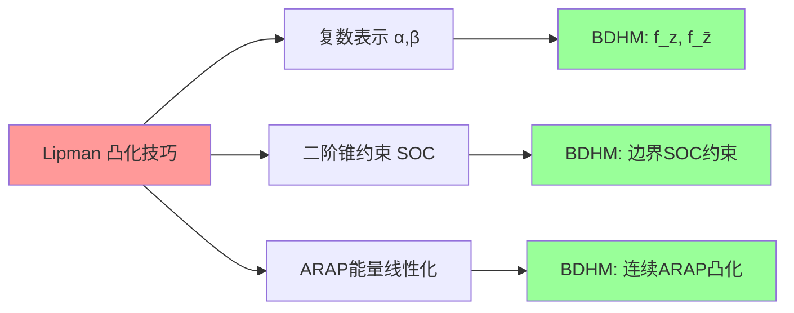
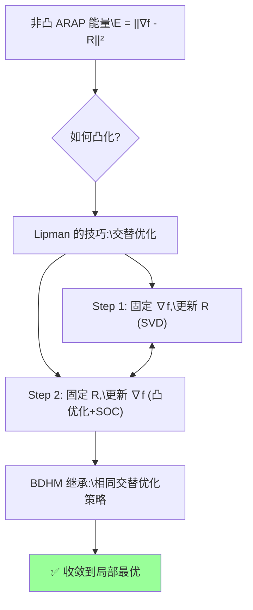
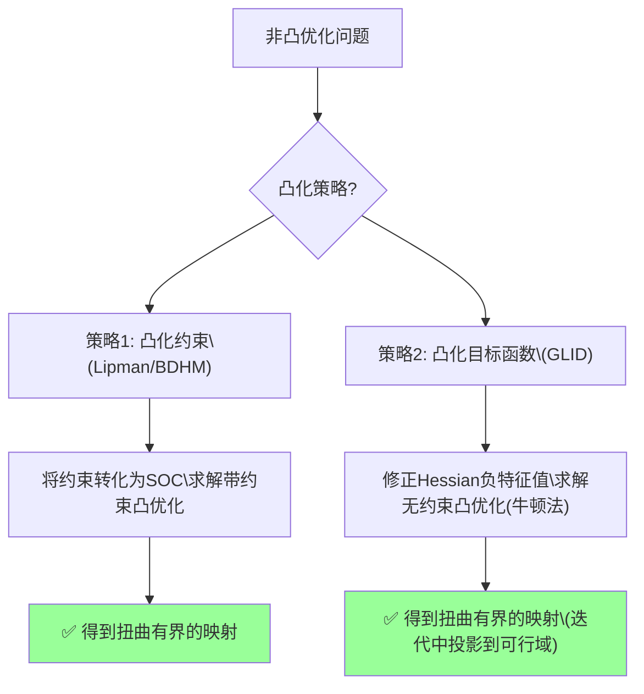
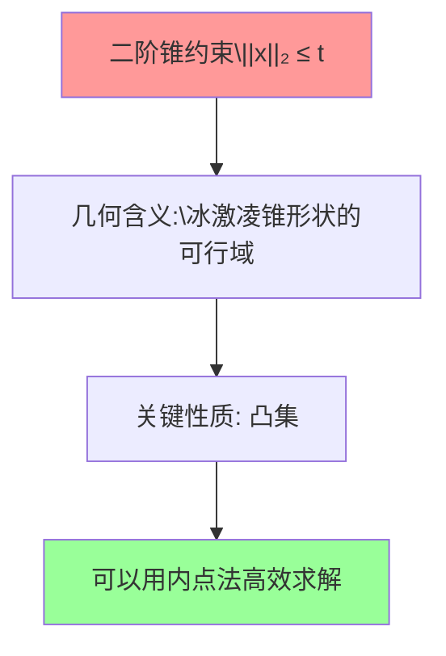

\newpage
# 前言
## 前言与目录

## 写在前面

在刘慈欣的科幻巨著《三体III·死神永生》中，歌者文明使用了一种终极武器——**二向箔**。它一经展开，便将三维空间强制"压扁"为二维平面，整个太阳系——行星、恒星、文明——在瞬间坍缩为一幅没有厚度的巨画。这或许是科幻史上最令人绝望的画面之一：**降维打击**——高维空间被不可逆地映射到低维。

有趣的是，在数学和计算机图形学中，我们也在做一件看似相似的事情：将三维曲面**展开**到二维平面上。但与二向箔不同的是——

- 我们**不摧毁**曲面结构，而是寻找最优的二维**表示**；
- 我们**不甘于**暴力降维，而是追求**尽可能小地扭曲**角度与面积。

那么，如何将三维曲面摊平到二维平面上？这个看似不起眼的问题——就像绘制世界地图时把地球仪展开那样——却蕴含着无尽的几何与拓扑奥秘。本书将带你从最朴素的直觉出发，逐步深入复分析、微分几何、拓扑学与凸优化的殿堂，探索**将三维世界优雅地映射到二维平面**的数学艺术。

### 本书特色

本书以直观、可动手的方式组织内容。通过可视化工具观察几何现象、亲手推导公式、编写代码验证结论，让抽象的数学变得可触摸、可玩味。代码与公式相互印证，使理论不再悬浮于纸面。

内容上追求**少而深刻**——不求面面俱到，而是精选核心数学概念，串联起微积分、线性代数、复分析、微分几何、拓扑学、凸优化等多个分支。读者可以在"玩"中获得对这些领域的高层次直觉。学完本书后，若想继续深入，顾险峰老师的计算共形几何与最优传输理论会是通往时代前沿的下一步阶梯。

### 主要数学理论

曲面展开的理论根植于三个数学分支的交汇。**复分析**提供了共形映射的基本语言——柯西-黎曼方程刻画角度保持的微分条件，黎曼映射定理保证单连通区域到单位圆盘的共形映射存在性。**微分几何**将曲面展开为内蕴几何问题：第一基本形式携带度量信息，等温坐标（局部坐标下度量为对角形式）是共形参数化的直接目标，高斯曲率决定曲面能否无扭曲展开，而单值化定理断言任意曲面可赋予常曲率度量，为 Ricci 流等方法提供了理论保证。**凸优化**则充当计算桥梁——多数参数化能量（如 LSCM 的二次型、Circle Patterns 的凸能量、ARAP 的交替优化）最终都归结为凸优化或可高效求解的变分问题，拉格朗日乘子法和交替方向乘子法（ADMM）是处理约束的常用工具。

我们将在本系列中多次遇到同一概念（如共形映射、高斯曲率），每次都从不同角度加深理解。同一主题，在不同阶段以不同深度反复出现，最终达成深刻理解。这正是教育中"螺旋式上升"的典范。

### 章节导读

全书共六章，按"方法 → 应用 → 理论"的逻辑递进：

- **第1章（曲面展开介绍）** 从最基础的 Tutte 嵌入和分段线性映射出发，建立 Laplace 算子和 Jacobian 矩阵等基本工具，并介绍 ARAP 能量优化。
- **第2章（共形映射方法）** 聚焦共形参数化的核心算法：LSCM、Circle Patterns（分算法与理论两篇）和 Ricci 流，展示从柯西-黎曼方程到凸变分问题的完整路径。
- **第3章（四边形网格化）** 将参数化能力从三角形网格提升到四边形网格：MIQ 混合整数规划、QuadCover 覆盖空间方法、向量场平行移动，是参数化技术在前沿几何处理中的直接应用。
- **第4章（计算共形几何）** 在具体方法与应用的感性认识之后，系统补全理论基础——代数拓扑、微分形式、Hodge 分解、全局调和与共形参数化、Abel–Jacobi 映射与 Holonomy。
- **第5章（最优传输）** 打通保面积映射与最优传输之间的等价关系，介绍 Monge-Kantorovich 理论、Semi-Discrete 解法、Monge-Ampère 方程求解以及在焦散透镜设计中的应用。
- **第6章（附录）** 提供线性方程组求解、非线性优化、离散曲率、双曲几何等预备知识。

建议阅读路线：初学者顺序阅读第1–2章建立直觉和方法论，第3章体验参数化在四边形网格化中的应用，再学习第4章补全理论基础，最后进入第5章的最优传输前沿。有微分几何基础的读者可跳过第4章前半部分。

### 与其他资源的对比

在曲面展开与几何处理领域，已有诸多优秀的参考资源：经典教材如 Botsch 等的《Polygon Mesh Processing》是很好的入门读物，但部分内容略显陈旧；顾险峰老师的《计算共形几何》与《最优传输》理论深度极高，适合进阶但门槛不低；Tristan Needham 的《可视化复分析》与《可视化微分形式》以极富直觉的方式呈现抽象概念，强烈推荐；Kenneth Stephenson 的《Introduction to Circle Packing》则是圆填充方向的不二之选。网课方面，GAMES 的 Games301 和 Games102、中科大的数字几何处理、MIT 的 Shape Analysis 以及 CMU 的 Digital Geometry Processing 各有所长，但普遍假设较多前置知识或覆盖面有限。理论补充上，梅加强的《Riemann 曲面导论》提供了严格的数学基础，顾险峰老师的"老顾谈几何"博客兼具前沿性与直观性，Bobenko 等人的《Discrete Differential Geometry》也是离散微分几何的重要教材。与上述资源相比，本系列的特点在于：从基础出发、注重实践与细致推导，不假设过多前置知识；追根溯源，剖析数学思维脉络而非仅呈现算法结论；覆盖主流参数化方法并揭示其内在联系；同时配有完整的代码与可视化，力求让理论可触摸、可验证。

### 作者

本科数学，硕士软件工程，多年图形算法工程师经验。参与过游戏引擎、WebAR、三维重建等多个从研发到落地的项目，热衷于数学与计算机图形学的交叉领域。


## 目录

### 第1章　曲面展开介绍

- 1.1 介绍
- 1.2 一个简单的展开算法
- 1.3 分段线性映射的 Laplace 算子
- 1.4 分段线性映射的 Jacobian 矩阵与 ARAP 方法
- 1.5 几何变形的特征值分析

### 第2章　共形映射方法

- 2.1 基于柯西-黎曼方程的 LSCM 方法
- 2.2 圆填充（Circle Patterns）方法——算法流程
- 2.3 圆填充方法——理论证明（KAT 定理、Rivin 定理与 Bobenko 变分原理）
- 2.3 共形因子方法
- 2.4 Ricci 流方法
- 2.5 几何变形的目标凸化

### 第3章　四边形网格化

- 3.1 介绍：从三角形参数化到四边形网格化
- 3.2 MIQ（Mixed-Integer Quadrangulation）算法
- 3.3 QuadCover 算法
- 3.4 向量场的平行移动

### 第4章　计算共形几何

- 4.1 代数拓扑基础
- 4.2.1 微分形式与参数化——介绍
- 4.2.2 Tutte 嵌入的推广
- 4.2.3 全局调和参数化（HGP）
- 4.2.4 四边形网格化（Tong06）
- 4.3 全局共形参数化
- 4.4 Abel–Jacobi 映射
- 4.5 Holonomy

### 第5章　最优传输

- 5.1 Monge 问题与 Kantorovich 问题
- 5.2 顾老师的 Semi-Discrete 解法
- 5.3 Mérigot 的 Semi-Discrete 解法
- 5.4 针对网格的 Monge-Ampère 方程求解
- 5.5 最优传输计算焦散透镜
- 5.6 流体力学观点与图像配准

### 附录　（第6章）

- 6.1.1 线性方程组 Ax = b
- 6.1.2 非线性优化
- 6.2 离散曲面的高斯曲率
- 6.3.1 双曲平面
- 6.3.2 圆填充与极小曲面
- 6.4 一些简单情况的最优传输

### 参考文献


## 2016-01-01-0.封面


\newpage
# 第一章 基础曲面展开方法
## 曲面展开-介绍

## 1.1.1 曲面展开(参数化)定义

**曲面展开（参数化 / Parameterization）**是指建立三维曲面与二维平面区域之间的一一对应映射。用数学语言描述：设  $S \subset \mathbb{R}^3$ 是一张三维曲面， $\Omega \subset \mathbb{R}^2$  是平面区域（称为曲面的**参数域**），参数化即寻找**双射（一一对应）**：
$$
f: S \to \Omega
$$
并且要求  $f$ 具有某种"良好"性质（如保持角度、面积等）。

并非任意映射都是合法的参数化，它必须满足以下**约束**：

1. 映射 $f$ 是**局部单射的（Locally Injective）**，即映射后内部三角形的边不能自交；


2. 映射 $f$ 是无翻转的(flip free)，映射后三角形的定向是不能翻转的，否则也会有错乱的情况


3.映射 $f$  是双射的(Bijecive), 映射后的边界是不能相交的


参数化的核心矛盾在于：**曲面的高斯曲率决定了它能否被无扭曲地展开**。

根据 **Theorema Egregium（绝妙定理）**，高斯曲率是内蕴量，不能通过等距变换改变。因此：

- **高斯曲率为零**的曲面（如柱面、锥面）可以无扭曲地展开
- **高斯曲率非零**的曲面（如球面）**不可能**无扭曲地展开

这意味着，对于一般曲面，参数化必然引入**扭曲**。算法设计的目标就是：**在满足约束的前提下，最小化扭曲**。

计算机中所有3D物体的表面都是由许多小三角形拼在一起表示的，这样的三角形组成的网格称为**三角形网格(Mesh)** 记作
$$
M=\{V,E,F |V,E,F\text{为网格的顶点},\text{边},\text{面}\}
$$


## 1.1.2 一个生活中的例子

下面我们看一个生活中常见的曲面展开例子—我们的世界地图。我们知道地球是球形的，为方便观察，我们要将地球表面的球面铺展到平面上也即将**球面上的点转换为平面上的点**，这就要用到曲面展开的方法了。

一般常见的地图展开方法使用的是**墨卡托投影法(Mercator Projection)**：假设球面内部有一个光源，球面外包围着一个圆柱面，光线将球面上的点投射到圆柱面上，再将圆柱面展开，就得到了我们熟悉的世界地图。


然而，墨卡托投影**必然引入扭曲**。比如我们在地图上看到的俄罗斯面积远大于非洲，但事实上俄罗斯的陆地面积只有非洲的一半左右。产生这种错觉的原因在于：墨卡托投影牺牲了面积精度以换取角度保持（即"共形映射"）。赤道附近的区域扭曲极小，越靠近两极面积膨胀越严重。


所以**尽可能减小扭曲**是我们寻找更优展开(参数化)方法的重要目标。我们将这个问题用数学语言进行形式化：定义一个能量  $E(f)$ 来度量映射 $f$  的扭曲程度，从而将参数化建模为几何最优化问题——之后的工作就是找到"好"的能量以及更快更稳定的数值求解方法。

$$
\min_{f \in PL}\, E(f)\text{，}\quad f\text{ 满足约束条件}
$$
接下来我们会看到具体该如何定义这个能量，以及如何对这些能量进行数值优化。

除了墨卡托投影还有许多其他投影方法，由于投影方式的不同，所形成的世界地图"长相"也大相径庭。

**圆锥****投影**


**方位投影**


**伪圆柱投影**


**折衷投影**


## 1.1.3 其他应用

游戏或动漫影视工业中3D模型的**纹理贴图(Texture Mapping)**：纹理贴图经常被用来对3D场景和对象进行上色及纹理填充等。设计师可以在二维空间进行模拟物体的表面纹理与细节信息的设计，再通过计算机手段将其投影到3D模型表面。


**肠镜地图**：通过CT扫描获取到腹部断层图像，然后用多视角几何的方法重建三维直肠曲面后，为了方便医生的观察，最后将这个直肠曲面平展到平面上，像看地球仪一样观察曲折的肠道。使用这种方法，设备和病患没有接触，不需要麻醉，不会诱导并发症。


## 曲面展开方法的发展脉络

曲面参数化的研究始于 Tutte [1] 的图嵌入工作——将边界固定在凸多边形上，内部顶点为邻居凸组合即可保证无自交嵌入。Floater [2] 推广了重心坐标的权重选择。进入 2000 年代，Sheffer 与 de Sturler 提出 ABF [3]，从角度约束出发进行非线性优化；Lévy 等提出 LSCM [4]，将保角条件转化为线性最小二乘，大幅提升效率。同时期，Gu 与 Yau [5] 建立了全局共形参数化的理论基础，Bobenko 与 Springborn [6] 为 Circle Patterns 引入变分原理。2008 年前后涌现了 ARAP [7]、离散 Ricci 流 [8] 和 CETM [9] 等方法。2010 年代，QuadCover [10]、帧场方法 [11]、MIQ [12] 将参数化推进到四边形网格生成的前沿；SLIM [13] 提供了可扩展的保角优化框架，Crane 等的 BFF [14] 则开辟了边界优先的新范式。

## 曲面展开-一个简单的展开算法

## 1.2.1 一个简单的展开算法-Tutte参数化方法

在开始我们的探索之前，先根据直觉构想一个简单的算法。想想我们生活中带弹性头套的场景，把要展开的曲面看作一张弹性膜，我们假想用手将这个弹性膜的边界固定住，之后弹性膜的内部力会将膜的内部伸展到合适的位置上。

我们后面的3D模型主要是最简单拓扑的模型即**拓扑圆盘(Topological Disk)**—是指具有单条边界环的"开口网格曲面"，比如这个简化的（"抽象"的）大卫头像：


现在我们将三角网格的边界固定到一个圆周上，上面这个过程用三角网格 $M$ 来进行建模就是，三角网格上面每条边我们认为是一个弹簧


假设内部顶点 $v \in V_{int}$ 所受的力是均衡的，那么它自然位于邻居顶点所围成区域的质心位置，从而形成一个线性方程


1. 将 $M$ 的顶点集编号为 $V=\{1,2,3,\dots,n\}$ ，并划分为内部点集 $V_{int}$ 和边界点集 $V_{bnd}$ ；
2. 对内部顶点 $v \in V_{int}$ ，设 $N_v$ 为其邻居集，则平衡状态下 $x_v = \frac{1}{\vert N_v\vert}\sum_{u \in N_v} x_u$ ；
3. 对边界顶点 $v \in V_{bnd}$ ，按顺序排列并赋予序号 $i_v$ ，将其固定在圆周上： $x_{i_v}= \bigl(r\cos\theta_{i_v},\; r\sin\theta_{i_v}\bigr)$ 。

上式可整理成**稀疏线性系统** $Ax = b$ ，其中 $A = \{a_{ij}\}_{n\times n}$ （ $u, v$ 两个坐标各需一组）：

1. 对任意的 $v \in V_{int}$ ,
$$A(v,u) = \begin{cases}  1 &\text{，}  u=v \\ -\frac 1 {|N_v|}&\text{，} u \in N_v \\ 0 &\text{，其它}\end{cases}$$

2. 对任意的 $v \in V_{bnd}$ ,
$$A(v,u) = \begin{cases}  1 &\text{，}  u=v \\  0 &\text{，其它}\end{cases}$$
，其边界序号为 $i_v$ ,则 $b_{i_v} = (rcos({\theta_{i_v}})\text{，}rsin({\theta_{i_v}}) )$ 对上述线性系统，当 $A$ 规模不大时可直接用 **Gauss-Seidel** 方法迭代求解；当规模较大时则需对 $A$ 进行**矩阵分解**（如 **Cholesky 分解**）后求解，对线性方程组求解这方面的讨论可参见附录1。


最后可得到如下展开结果：


我们在展开的表面上贴上一层棋盘格纹理，可以直观地观察到扭曲的大小。


##  1.2.2 理论保证—Tutte 嵌入定理

虽然上述算法充满感性的估计和直觉，但它的正确性有严格的数学保证—**Tutte 嵌入定理**

设 $G = (V, E)$ 是 **3-连通平面图**，将顶点集划分为边界顶点 $V_{\text{bnd}}$ 和内部顶点 $V_{\text{int}}$ 。若满足：

1. **边界固定**：将 $V_{\text{bnd}}$ 按顺序固定到平面上一个**严格凸多边形**的顶点位置；
2. **内部为邻居凸组合**：对每个 $v_i \in V_{\text{int}}$ ，存在权重 $w_{ij} > 0$ （ $\sum_j w_{ij} = 1$ ），使得：

$$
v_i = \sum_{v_j \in N(v_i)} w_{ij} \cdot v_j
$$

**则**：由此得到的平面嵌入**无自交**（全局单射），所有面具有正面积，是一个合法的直线平面嵌入（straight-line planar embedding）。

> 这里使用最简单的均匀权重特例  $w_{ij} = \frac{1}{\vert N(v_i)\vert}$ ，即每个内部顶点位于其邻居的重心位置。


## 1.2.3 算法缺陷分析

我们**扭曲过大**（角度和面积都严重变形）。其中一个问题在于均匀权重只利用了网格的连接信息，完全**忽略了网格的几何属性**。

另一个问题在于**固定边界指定**：这个方法需要人为指定一个凸多边形边界，当三维模型本身的轮廓距离凸边形较远（比如非凸边界）时，大量扭曲不可避免。

后面介绍的**自由边界方法**是会3D模型的几何特征解算出更好的边界。


### 1.2.4 半边结构(Half-Edge)

要想三角网格上高效实现算法，需要合适的数据结构支持。常见的网格操作需要快速索引：顶点的邻边和邻面、三角面的三个顶点和三条边，半边结构(Half-Edge)作为数据结构，非常适配Mesh的使用场景。常用的三角网格处理库包括 CMU 的 **Geometry Central**、ETH 的 **LibIGL** 以及 INFRA 的 **GeoGram**。


## 曲面展开-离散微分几何-Laplace算子

## 2.1.1 分片线性映射

在三角网格的设定下，我们所求的映射  $f: M \to \mathbb{R}^2$ 将三维网格 $M \subset \mathbb{R}^3$ 映射到平面。只需为每个顶点 $v \in V$ 找到一组 $\mathbb{R}^2$ 坐标（常称为 **UV 坐标**），映射 $f$ 便完全确定。


首先看下三角形**重心坐标（Barycentric Coordinate）**的概念：


重心坐标 $\alpha$  可以认为是小三角形与大三角形之间的**面积比**
$$
\alpha = \frac{A_i}{A_T} = \frac{\left( (\mathbf{x} - \mathbf{x}_j) \cdot \frac{(\mathbf{x}_k - \mathbf{x}_j)^\perp}{\|\mathbf{x}_k - \mathbf{x}_j\|} \right) \|\mathbf{x}_k - \mathbf{x}_j\|}{2 A_T} = \frac{(\mathbf{x} - \mathbf{x}_j) \cdot (\mathbf{x}_k - \mathbf{x}_j)^\perp}{2 A_T}
$$

其中  $A_t$ 是三角形有向面积， $2A_t = (x_iy_j - y_ix_j) + (x_jy_k - y_jx_k) + (x_ky_i - y_kx_i)$ 。有了 $u, v$  两方向的梯度后便可组合成 Jacobian 矩阵（见下一节）。

以重心坐标作为插值权重，分段线性映射可以表达为各顶点函数值关于重心坐标的线性组合：
$$
f(x) = \alpha f_i + \beta f_j + \gamma f_k
$$

## 2.1.2 映射的Laplace算子

将**梯度算子 $\nabla$ **作用于式(2)可得
$$
\nabla f(\mathbf{x}) = f_i \nabla \alpha + f_j \nabla \beta + f_k \nabla \gamma
\\\nabla \alpha = \frac{(\mathbf{x}_k - \mathbf{x}_j)^\perp}{2A_T},\quad \nabla \beta = \frac{(\mathbf{x}_i - \mathbf{x}_k)^\perp}{2A_T},\quad \nabla \gamma = \frac{(\mathbf{x}_j - \mathbf{x}_i)^\perp}{2A_T}
$$

因此
$$
\nabla f(\mathbf{x}) = f_i \frac{(\mathbf{x}_k - \mathbf{x}_j)^\perp}{2A_T} + f_j \frac{(\mathbf{x}_i - \mathbf{x}_k)^\perp}{2A_T} + f_k \frac{(\mathbf{x}_j - \mathbf{x}_i)^\perp}{2A_T}
$$


**Laplace算子**定义为其**梯度的散度** 
$$
\Delta f = \operatorname{div}\,\nabla f
$$
 Laplace 算子度量了函数的"不规则程度"， $\Delta f = 0$ 称为调和映射(Harmonic Mapping)。在我们熟悉的 $\mathbb{R}^2$ 中，上式简化为 $\Delta f = f_{xx} + f_{yy}$ 。在流形上定义的Laplace算子称为**Laplace-Beltrami算子**。那么在三角形网格上如何定义和计算呢？其关键就在于如何定义离散(三角网格上)**散度(Divergence)**。

如果将网格看成是图(Graph)，从而图的Laplace算子也能用来定义网格的Laplace算子(Uniform Laplacian)
$$
\Delta f(v_i) = \frac{1}{|\mathcal{N}_1(v_i)|} \sum_{v_j \in \mathcal{N}_1(v_i)} (f_j - f_i)
$$

但是图仅考虑网格的连接属性(或组合属性),没有考虑顶点的几何属性，所以使用起来会丢失许多几何信息。

根据**散度定理(Divergence Theorem,又称高斯定理)**
$$
\int_{A_i} \operatorname{div} \mathbf{F}(\mathbf{u})\,\mathrm{d}A = \int_{\partial A_i} \mathbf{F}(\mathbf{u}) \cdot \mathbf{n}(\mathbf{u})\,\mathrm{d}s
$$
对于下面的顶点的小领域 $A_i$ 采用Mixed Voronoi Cell


那么对于Laplace算子则有
$$
\int_{A_i} \Delta f(\mathbf{u}) \,\mathrm{d}A = \int_{A_i} \operatorname{div} \nabla f(\mathbf{u}) \,\mathrm{d}A = \int_{\partial A_i} \nabla f(\mathbf{u}) \cdot \mathbf{n}(\mathbf{u}) \,\mathrm{d}s
$$


 $\mathbf{n}$ 的朝向向外。下图为三角形 $T$ 上与边 $(\mathbf{x}_i,\mathbf{x}_j)$ 、 $(\mathbf{x}_i,\mathbf{x}_k)$ 相关的局部记号（点 $\mathbf{a},\mathbf{b}$  及法向等）。


对每一个部分分别进行计算
$$
\begin{aligned}
\int_{\partial A_i \cap T} \nabla f(\mathbf{u}) \cdot \mathbf{n}(\mathbf{u})\,\mathrm{d}s
&= \nabla f(\mathbf{u}) \cdot (\mathbf{a} - \mathbf{b})^\perp
=\frac{1}{2}\, \nabla f(\mathbf{u}) \cdot (\mathbf{x}_j -\mathbf{x}_k)^\perp
\end{aligned}
$$

将之前计算的导数代入进去则有
$$
\begin{aligned}
\int_{\partial A_i \cap T} \nabla f(\mathbf{u}) \cdot \mathbf{n}(\mathbf{u})\,\mathrm{d}s
={} & (f_j - f_i)\,\frac{(\mathbf{x}_i - \mathbf{x}_k)^\perp \cdot (\mathbf{x}_j - \mathbf{x}_k)^\perp}{4A_T}  + (f_k - f_i)\,\frac{(\mathbf{x}_j - \mathbf{x}_i)^\perp \cdot (\mathbf{x}_j - \mathbf{x}_k)^\perp}{4A_T}
\end{aligned}
$$

记  $\gamma_j,\gamma_k$ 分别为顶点 $v_j,v_k$  处的内角。由
$$
A_T = \tfrac{1}{2}\sin\gamma_j \,\|\mathbf{x}_j - \mathbf{x}_i\|\,\|\mathbf{x}_j - \mathbf{x}_k\| = \tfrac{1}{2}\sin\gamma_k \,\|\mathbf{x}_i - \mathbf{x}_k\|\,\|\mathbf{x}_j - \mathbf{x}_k\|
$$

以及
$$
\cos\gamma_j = \frac{(\mathbf{x}_j - \mathbf{x}_i)\cdot(\mathbf{x}_j - \mathbf{x}_k)}{\|\mathbf{x}_j - \mathbf{x}_i\|\,\|\mathbf{x}_j - \mathbf{x}_k\|},\qquad \cos\gamma_k = \frac{(\mathbf{x}_i - \mathbf{x}_k)\cdot(\mathbf{x}_j - \mathbf{x}_k)}{\|\mathbf{x}_i - \mathbf{x}_k\|\,\|\mathbf{x}_j - \mathbf{x}_k\|}
$$
可得
$$
\int_{A_i} \Delta f(\mathbf{u})\,\mathrm{d}A = \frac{1}{2} \sum_{v_j \in \mathcal{N}_1(v_i)} (\cot \alpha_{ij} + \cot \beta_{ij})(f_j - f_i)
$$

从而对 Laplace–Beltrami 算子在三角网格上的离散化为
$$
\Delta f(v_i) := \frac{1}{2A_i} \sum_{v_j \in \mathcal{N}_1(v_i)} (\cot \alpha_{ij} + \cot \beta_{ij})(f_j - f_i)
$$

## 2.1.3 映射的Dirichlet能量

### Dirichlet 能量的连续形式

映射的 Dirichlet 能量定义为映射梯度的  $L^2$  范数：

$$
E_D(f) = \frac{1}{2}\int_S \|\nabla f\|^2 \,dA
$$

对于从曲面  $S$ 到平面 $\Omega$ 的映射 $f = (u,v)$ ，总 Dirichlet 能量为两分量之和：

$$
E_D = \frac{1}{2}\int_S \left(\|\nabla u\|^2 + \|\nabla v\|^2\right) dA
$$

极小化 Dirichlet 能量等价于求解 Laplace 方程  $\Delta u = 0, \Delta v = 0$ ——这正是**调和映射**的定义。

### 离散 Dirichlet 能量与 Cot-Laplace 的联系

将上一节推导的离散 Laplace-Beltrami 算子代入，可以写出三角网格上 Dirichlet 能量的**离散形式**：

$$
E_D(\mathbf{u}) = \frac{1}{2} \sum_{e_{ij} \in E} w_{ij} \|\mathbf{u}_i - \mathbf{u}_j\|^2
$$

其中权重  $w_{ij} = \cot\alpha_{ij} + \cot\beta_{ij}$ 正是 cot-Laplace 矩阵中的边权重， $\alpha_{ij}, \beta_{ij}$ 为共享边 $e_{ij}$ 的两个三角形中该边的对角。

这个离散化的推导思路是：将 $\|\nabla f\|^2$ 在每个三角形内（梯度为常数）积分，然后对边贡献求和——其结果自然诱导出 cot 权重。详细地，对单个三角形 $T_{ijk}$ ：

$$
\int_{T_{ijk}} \|\nabla f\|^2 dA = \frac{1}{4A_T} \left( (f_j - f_i)\|x_k - x_i\| \cot\alpha_{jk}^i + \dots \right)
$$

累加所有三角形即得上述边权重形式。

### Dirichlet 能量与共形扭曲

对于从曲面到平面的映射，还可以定义映射后**参数域的面积**：

$$
E_A = \int_S \det(J) \,dA = \text{Area}(\Omega)
$$

其中  $J$ 为映射的 Jacobian 矩阵。Desbrun 等人 [DMA02] 的关键洞察是：**Dirichlet 能量等于参数域面积 $E_A$  加上共形扭曲项**：

$$
E_D = E_A + \frac{1}{2}\int_S (\sigma_1 - \sigma_2)^2 \,dA
$$

其中  $\sigma_1, \sigma_2$ 为 Jacobian 矩阵 $J$ 的奇异值。当且仅当 $\sigma_1 = \sigma_2$ 时（即映射为**共形映射**）， $E_D = E_A$ ，扭曲项消失。

> 这个关系揭示了 Dirichlet 能量在参数化中的核心地位：极小化 Dirichlet 能量 → 趋向于保角映射。

### DCP（Discrete Conformal Parameterization）算法

Desbrun 等人（2002）基于上述理论提出了 **离散共形参数化（DCP / DNCP）**。其核心思想是：

1. **内部点**：满足调和方程 $\Delta u = 0$ ，即 $u_i$  为其邻域顶点的 cot 加权平均：
   $$
   \sum_{v_j \in N(v_i)} w_{ij} (\mathbf{u}_j - \mathbf{u}_i) = 0, \quad w_{ij} = \cot\alpha_{ij} + \cot\beta_{ij}
   $$

2. **边界点**：采用"自然"边界条件——本质上是最小化**共形能量**时的 Euler-Lagrange 边界项，具体做法是将边界点以弧长比例映射到凸多边形（如圆或矩形）上并固定。这种边界处理保证了映射的全局一一对应性。

3. **求解**：将内部点方程与固定边界组合为一个稀疏线性系统：
   $$
   \mathbf{L} \mathbf{U} = \mathbf{0}, \quad \text{边界点坐标作为 Dirichlet 边界条件}
   $$
   其中  $\mathbf{L}$ 为 $|V|\times|V|$ 的 **cot-Laplace 矩阵**， $\mathbf{U}$ 为所有顶点的 $(u,v)$ 坐标。由于 $\mathbf{L}$  是对称半正定的（在固定边界后变为正定），可用 Cholesky 分解或共轭梯度法高效求解。


## 曲面展开-离散微分几何-Jacobian矩阵

## 2.2.1 映射的Jacobian矩阵

对于每一个三角面片，先建立局部坐标系以简化计算。如下图所示，选取三角形  $T = [x_i, x_j, x_k]$ ，以某顶点 $x_i$ 为原点、边 $[x_i, x_j]$ 为 $X$ 轴方向，按右手定则建立坐标系。


在每个三角面片 $t$ 上，假设映射 $f$ 退化为线性函数 $f_t(x) = J_t x + b_t$ ——其中 $J_t$ 是 Jacobian 矩阵，刻画了该三角形局部的缩放与旋转；平移量 $b_t$ 对参数化无影响，可直接设为零。

分片线性映射 $f$ 的Jacobian矩阵如下

$$
J_t =
\begin{pmatrix}
\frac{\partial u}{\partial x} & \frac{\partial u}{\partial y} \\[4pt]
\frac{\partial v}{\partial x} & \frac{\partial v}{\partial y}
\end{pmatrix}
=
\begin{pmatrix}
u_j-u_i & u_k-u_i \\[4pt]
v_j-v_i & v_k-v_i
\end{pmatrix}
\begin{pmatrix}
x_j-x_i & x_k-x_i \\[4pt]
y_j-y_i & y_k-y_i
\end{pmatrix}^{-1}
\tag{1}
$$

二阶矩阵可以直接求逆：
$$
A = \begin{pmatrix} a & b \\ c & d \end{pmatrix}, \quad
A^{-1} = \frac{1}{ad - bc} \begin{pmatrix} d & -b \\ -c & a \end{pmatrix}
\quad \text{（当 } ad - bc \ne 0 \text{）}
$$
对公式(1)代数变形可以得到下面的展开形式

$$
\begin{aligned}
{\begin{pmatrix}{\frac{\partial u}{\partial x}}\\{\frac{\partial u}{\partial y}}\end{pmatrix} }=\frac{1}{2A_t}{\begin{pmatrix}{y_j-y_k}&{y_k-y_i}&{y_i-y_j}\\{x_k-x_j}&{x_i-x_k}&{x_j-x_i}\end{pmatrix} }
{\begin{pmatrix}u_i\\u_j\\u_k\end{pmatrix} }\\
{\begin{pmatrix}{\frac{\partial v}{\partial x}}\\{\frac{\partial v}{\partial y}}\end{pmatrix} }=\frac{1}{2A_t}{\begin{pmatrix}{y_j-y_k}&{y_k-y_i}&{y_i-y_j}\\{x_k-x_j}&{x_i-x_k}&{x_j-x_i}\end{pmatrix} }
{\begin{pmatrix}v_i\\v_j\\v_k\end{pmatrix} }
\end{aligned}
\tag{2}
$$

## 2.2.2 Jacobian矩阵的奇异值

对分段线性映射 $f$ 的Jacobian矩阵 $J_t$ 可以进行SVD分解 ,$$J_t=U\Sigma V^T,\Sigma={\begin{pmatrix}{\sigma_1}&{0}\\{0}&{\sigma_2}\end{pmatrix} } $$,奇异值 $\sigma_1 , \sigma_2$ 分别描述映射在正交两个方向上的拉伸程度，如下图所示


根据分解后的奇异值 $\sigma_1 , \sigma_2$ ，对映射扭曲进行度量

（1）若 $\sigma_1 = \sigma_2$ 则这两个三角形是相似三角形，则映射是保角映射

（2）进一步若 $\sigma_1 = \sigma_2 =1$ 则这两个三角形只是发生了旋转

映射 $f$  是无翻转的(flip free)，映射后三角形的定向是不能翻转的，否则也会有错乱的情况，有翻转即两个奇异值是异号的
$$
\sigma_1 * \sigma_2 < 0
$$


## 基于奇异值优化的展开方法

**ARAP(As Rigid As Possible)**采用**迭代**优化的策略：先从一个简单算法（如 Tutte）初始化，然后交替进行如下两步——首先为每个三角形寻找一个尽量保持原形状的局部近似（**Local 优化**），再回头调整 Jacobian 矩阵使网格整体保持连接（**Global 优化**）。


若矩阵 SVD 分解后两奇异值相等（ $\sigma_1 = \sigma_2$ ），则该变换是相似变换（仅旋转+均匀缩放），由此构成的相似变换族记为 $\Omega_s$ 。用 Frobenius 范数量化当前 Jacobian $J_t$ 到 $\Omega_s$  的距离：
$$
d(J_t,L_t)=||J_t-L_t||_F^2
$$
对于整个三角网格，累加所有三角形的差异得到一个如下的能量函数，这个就是我们要优化的能量函数
$$
E_{ARAP}=\sum_{t}A_t||J_t-L_t||_F^2,L_t\in\Omega_s \
\tag{1}
$$

这个优化能量有两部分是要优化的对象，其一是映射Jacobian矩阵 $J_t$ ，其二是局部优化目标 $L_t$ 。考虑先固定其中一个再优化另外一个，交替进行。

### **Local 优化**

固定当前映射的 $J_t$ ，对每个三角形独立寻找最优的相似变换近似 $L_t^*$ ：
$$
L_t^* = min_{L_t}\{d(J_t,M_t)\} ,M_t\in\Omega_s \\
$$
注意到
$$
||J_t-L_t||_F^2=tr((J_t-L_t)^T(J_t-L_t))
$$


根据**Procrustes分析**，通过对 $J_t$ 的**带符号的SVD分解(Signed SVD)**可以解得 $L_t^*$ 

对 $J_t$ 进行SVD(带符号)分解,其中U,V保证是**旋转矩阵**，可以令 $\sigma_2$ 是负的(一般的SVD分解中U,V是正交矩阵不一定是旋转矩阵)
$$
J_t=U\Sigma V^T,\Sigma={\begin{pmatrix}{\sigma_1}&{0}\\{0}&{\sigma_2}\end{pmatrix} }
$$
然后重新组合上面分解的矩阵得到 $L_t$ 

$$
L_t= U {\begin{pmatrix}{s}&{0}\\{0}&{s}\end{pmatrix}} V^T,s = \frac{\sigma_1+\sigma_2}{2}
\tag{3}
$$
这个局部优化的效果可参看下图，其中右边黑色三角形是优化的目标三角形，红色三角形为最优的共形三角形


### **Global优化**

若直接令  $J_t = L_t$ ，各三角形独立优化后会破坏网格顶点间的连接关系——相邻三角形共用的顶点将不再重合。


因此需要**Global 优化**：固定 $L_t$ ，在全局顶点位置 $\{u_t\}$ 上优化 $E_{ARAP}$ 。将上节推导的 $J_t$ 表达式代入（每个 $J_t$ 可写为该三角形三个顶点 $\{u_i, u_j, u_k\}$  的线性函数）：
$$
\begin{aligned}
{\begin{pmatrix}{\frac{\partial u}{\partial x}}\\{\frac{\partial u}{\partial y}}\end{pmatrix} }=\frac{1}{2A_t}{\begin{pmatrix}{y_j-y_k}&{y_k-y_i}&{y_i-y_j}\\{x_k-x_j}&{x_i-x_k}&{x_j-x_i}\end{pmatrix} }
{\begin{pmatrix}u_i\\u_j\\u_k\end{pmatrix} }\\
{\begin{pmatrix}{\frac{\partial v}{\partial x}}\\{\frac{\partial v}{\partial y}}\end{pmatrix} }=\frac{1}{2A_t}{\begin{pmatrix}{y_j-y_k}&{y_k-y_i}&{y_i-y_j}\\{x_k-x_j}&{x_i-x_k}&{x_j-x_i}\end{pmatrix} }
{\begin{pmatrix}v_i\\v_j\\v_k\end{pmatrix} }
\end{aligned}
$$


 可以将(2)式的能量转化为如下形式,我们优化的变量是向量 $\{u_t\}$ 
$$
\begin{aligned}
E_{ARAP}(u,L) = \frac{1}{2}\sum_{t=1}^T\sum_{i=0}^2cot(\theta_t^i)||(u_t^i-u_t^{i+1})-L_t(x_t^i-x_t^{i+1})||^2\\
=\frac{1}{2} \Sigma_{he_{ij}}cot(\theta_{ij})||(u^i-u^j)-L_t(x^i-x^j)||^2\\
\end{aligned}
\tag{4}
$$

对向量  $\{u_t\}$  求导并令其为零（寻找能量极小值的临界点），得到稀疏线性系统：
$$
\sum_{j\in N(i)}[cot(\theta_{ij}) +cot(\theta_{ji})](u^i-u^{j}) 
=\sum_{j\in N(i)}[cot(\theta_{ij})L_{t(i,j)} +cot(\theta_{ji})L_{t(j,i)}](x^i-x^{j}) 
\tag{5}
$$
最后可以求解上面的**稀疏线性方程组（Sparse Linear System）**来求得 $\{u_t\}$ 


## 曲面展开-ABF算法

##  1.5 一个直观的方法-ABF算法

三角网格是由成千上万的三角形组合而成的，那么如果两个三角网格的每对三角形都尽可能相似的话，那么两个三角网格也可以认为是“相似”的，所以我们尝试着让每个小三角形都尽可能保持相似的从而保持整体的形状 ，这种从三角形角度考虑出发的方法称为**ABF（Angle Based Flattening）**算法

设 $\alpha_i^0$ ， $\alpha_i$ 分别为三角网格展开前后的某个内角值，那它们的映射前后的差值就是 $(\alpha_i - \alpha_i^0)^2$ ，对所有的角度累加，从而得到一个二次优化 $E=\Sigma(\alpha_i - \alpha_i^0)^2$ ，约束条件如下：

(1) 由于角度发生改变了，所以对于每个三角形我们要让内角和保持为 $\pi$ , 即 $\Sigma_{\alpha_i\in t}{\alpha_i}=\pi$ (2) 另外由于是展开到了平面上，所以对于内部每个顶点v，与它连接角度的角度和为 $2\pi$ ,即 $\Sigma_{\alpha_i\in v}=2\pi$ 

(3) 如下图,对于每个顶点v,其1-邻域两个对角 $\beta_i\text{与}\gamma_i$ 满足如下关系 $\prod \frac {sin_{\beta_i}} {sin\gamma_i}=1$ 


上面约束优化问题虽然可以通过Lagrange乘子法转化为无约束优化问题进行求解，但是由于约束(3)中含有非线性条件所以是不容易求解的，一种思路是将约束(3)进行**线性化**后再求解。

实际上保角映射并不是说保三角网格的内角，而是保持的是曲面内两条相交线夹角的不变，所以上面方法并没有很好的保角性质。

\newpage
# 第二章 基础共形映射方法
## 共形映射方法-共形映射初步认识

##  2.1.1 共形映射介绍

如图将一个三维人脸曲面映射到平面圆盘上。我们在人脸曲面任意画两条相交曲线，这两条曲面上的曲线被映射到平面上的两条曲线，空间曲线的交点被映成平面曲线的交点，在交点处，空间曲线的夹角等于平面曲线的夹角。这两条空间曲线任意选取，其夹角都被映射完美保持。


这种能保持局部角度的映射称为**保角映射**（Angle Preserving），在高等数学理论中称这类保持角度的映射为**共形映射(Conformal Mapping)**，它能最大程度地维持几何细节的形状不失真——因此是参数化算法中极具价值的研究方向。


回头再看墨卡托映射：各国面积虽被扭曲，但局部形状得以保持——对地图导航而言，角度保真度远比面积保真度重要，否则按地图导航将导致方向错误。


我们看到这类映射有非常良好的性质(具有直观和谐的美感，以及良好的物理属性)，事实上这类映射也具有良好的数学性质，对它们的研究归属于现代数学分支中的复分析以及黎曼几何理论。经过经年累月的研究可以说数学家们对共形映射的研究已经是颇为充分的了。首先是如下存在性的保证。

**黎曼映照定理(Riemann Mapping Theorem)**保证了数学上任意两个平面区域之间都是存在共形映射。

 设  $\Omega \subset \mathbb{C}$ 是单连通开集， $\Omega \neq \mathbb{C}$ 。对任意 $z_0 \in \Omega$ ，存在唯一全纯双射 $f : \Omega \to \mathbb{D}$ 满足： $f(z_0) = 0 , f'(z_0) > 0$ 其中 $\mathbb{D} = \{ z \in \mathbb{C} , |z|<1 \}$ 。

理论上的存在性已经由黎曼映照定理保证，接下来的任务是通过变分的方法，构造一个能量 泛函 $E(f)$ 然后通过最优化的方法来求解，从而得到具体的映射。


## 2.1.2 基于复变函数理论的方法

LSCM(Least Square Conformal Mapping)算法基于复变函数理论中的**Cauchy-Riemann方程**，令复数 $U=u+iv,X=x+iy$ ，那么显然 $U(X)$ 就是一个复函数，复函数是共形的当且仅当其满足下面公式
$$
{\partial u}/{\partial x} = {\partial v}/{\partial y} \\ {\partial u}/{\partial y} = -{\partial v}/{\partial x}
\tag{CR}
$$
所以我们可以将能量泛函定义为映射的**Cauchy-Riemann 残差**的最小二乘  $L^2$  范数，即有
$$
E_{\text{LSCM}}(\mathbf{u}) = \int_X |{\nabla u}^ \perp  - \nabla v|^2 dA
$$
结合前面推导的**Jacobian矩阵**
$$
{\partial U}/{\partial x} + i{\partial U}/{\partial y} = \frac{i}{2A_t}(W_{t_i},W_{t_j},W_{t_k}){\begin{pmatrix}u_i\\u_j\\u_k\end{pmatrix}}, \quad
\text{其中}\begin{cases}W_{t_i} = (x_k - x_j)+i(y_k-y_j)\\
W_{t_j} = (x_i - x_k)+i(y_i-y_k)\\
W_{t_k} = (x_j - x_i)+i(y_j-y_i)\\
\end{cases}
\tag{3}
$$

那么对于每个三角形 $T_i$ 可以通过如下方法定义一个能量来衡量其不满足共形性的程度


$$
C(T_i) = {||{{\partial U}/{\partial x}}+i{{\partial U}/{\partial y}}||}^2 A_{T_j}=\frac {1} {4A_T}{|(W_{j1},W_{j2},W_{j3})(U_{j1},U_{j2},U_{j3})|}^2
$$

将所有三角形能量进行累加 $E_{\text{LSCM}}(\mathbf{u}) = \Sigma_{i=1}^{n} C(T_i)$ ，可以认为是关于复数 $U=(U_1,U_2,...,U_n)^T$ 的二次型
$$
E_{\text{LSCM}}(\mathbf{u}) = C(U=(U_1,U_2,...,U_n)^T)=U^*CU = ||MU||^2
\\M=(m_{ij})\text{是}|F|\times|V|\text{稀疏矩阵，}
m_{ij} = \begin{cases}W_{j,T_i},\text{如果}v_j\text{属于三角形}T_i \\ 0\end{cases}
\tag{4}
$$
如果不加限制那么会得到平凡解(trivial)即 $U=0$ 的常映射，所以要想得到非平凡解需要固定一部分点(pin点)，即固定某些 $U$ 的值。

我们将 $U$ 分块为 $(U_f^T,U_p^T)^T$ 其中 $U_f$ 是自由的点 $U_p$ 是固定的点，同样的将 $M$ 分解 $M =(M_f \ M_p)$ ,其中 $M_f$ 的形状是 $|F|*(|V|-p)$ 
$$
||MU||^2=||M_fU_f+MpUp||^2
$$
上面的讨论还是基于复数的，我们要进行数值计算就要转到实数域上，进一步对**复矩阵 $M$ 的实部与虚部进行分解**， $M=M^{re}+iM^{im}$ ,最终可以将上式转为求解如下的**实最小二乘**
$$
\begin{aligned}
C(x) = ||Ax-b||^2,
A={\begin{pmatrix}{M_f^{Re}}&{-M_f^{Im}}\\{M_f^{Im}}&{M_f^{Re}}\end{pmatrix} },
b=-{\begin{pmatrix}{M_p^{Re}}&{-M_p^{Im}}\\{M_p^{Im}}&{M_p^{Re}}\end{pmatrix} }{\begin{pmatrix}U_p^{Re}\\U_p^{Im}\end{pmatrix}}
\end{aligned}\tag{5}
$$
其中矩阵A的大小为 $2|F|\times 2(|V| -p)$ ，并且 $b\in R^{2|F|},x\in R^{2|V|-p}$ ，原始论文在附录处有证明当固定点个数大于等于2时( $p\geq2$ )，矩阵A满秩，方程有唯一解。

## 2.1.3 共形能量的一致性


下面展开 LSCM 能量

$$
\begin{aligned}
E_{\text{LSCM}}(\mathbf{u}) 
&= \int_{\chi} \frac{1}{2}\Bigl( \nabla u^{\perp} \!\cdot\! \nabla u^{\perp} + \nabla v \!\cdot\! \nabla v - 2\,\nabla u^{\perp} \!\cdot\! \nabla v \Bigr)\,dA \\[4pt]
&= \int_{\chi} \frac{1}{2}\Bigl( \nabla u \!\cdot\! \nabla u + \nabla v \!\cdot\! \nabla v - 2\,\nabla u \times \nabla v \Bigr)\,dA \\[4pt]
&= E_D(\mathbf{u}) - A(\mathbf{u})
\end{aligned}
$$

**Dirichlet 能量**：
$$
E(F) = \frac{1}{2}\int_\Omega \bigl(|\nabla u|^2 + |\nabla v|^2\bigr) \, dA \tag{4}
$$

**关键展开式**：
$$
\begin{aligned}
\bigl|(\nabla u)^{\perp} - \nabla v\bigr|^2
&= \bigl((\nabla u)^{\perp} - \nabla v\bigr) \cdot \bigl((\nabla u)^{\perp} - \nabla v\bigr) \\
&= (\nabla u)^{\perp} \!\cdot\! (\nabla u)^{\perp} + \nabla v \!\cdot\! \nabla v - 2(\nabla u)^{\perp} \!\cdot\! \nabla v \\
&= |\nabla u|^2 + |\nabla v|^2 - 2\,\nabla u \times \nabla v
\end{aligned}
$$

**最终关系**：
$$
\boxed{E_C(F) = E_D(F) - A} \tag{8}
$$

其中  $A = \displaystyle\int_D (\nabla u \times \nabla v)\,dA$ 为参数域的有向面积。

我们这里介绍的LSCM共形能量与前面介绍的Dirichlet能量具有如下关系：**LSCM 共形能量 = Dirichlet 能量 − 参数域有向面积**。这意味着最小化 LSCM 共形能量等价于**在固定边界条件下最小化 Dirichlet 能量**（面积项 $A$ 在边界固定时为常数）。


ARAP能量与LSCM能量是完全等价的


---

## 2.1.5 LSCM 与 DNCP 的等价性

Cohen-Steiner 等人在 2002 年的工作中证明了一个重要结论：**LSCM（Least Squares Conformal Maps）与 Desbrun 的 DNCP（Discrete Natural Conformal Parameterization）在数学上是完全等价的**。

两者的等价性可以从以下角度理解：

- **DNCP** 基于**离散 Dirichlet 能量**的变分原理。Desbrun 证明了当边界固定时，最小化 Dirichlet 能量等价于求解线性 Laplace 方程，其数值骨架正是 `cot-Laplacian` 矩阵
- **LSCM** 基于**Cauchy-Riemann 残差**的 $L^2$ 最小二乘。从上文展开式 $E_{\text{LSCM}} = E_D - A$ 可知，当参数域面积 $A$  固定为常数时，最小化 LSCM 能量就等于最小化 Dirichlet 能量

两者的**法方程最终都可以归结为解一个 `cot-Laplacian` 系统**。这意味着不同出发点的共形参数化方法，最终落到数值实现上共享了同一个线性骨架。这个结论在 [5] Cohen-Steiner et al. 2002 中有严格的数学证明。

**参考文献**：

- [5] Cohen-Steiner, D., et al. (2002). *Least squares conformal maps for automatic texture atlas generation.* ACM SIGGRAPH 2002.


## 曲面展开-圆填充方法

##  2.2.1  圆填充与共形几何

圆是共形几何的基本构建单元，**圆填充可以用来近似共形映射（Thurston）**，共形映射保持角度和圆不变：

- 共形映射将**圆映射为圆**

- 保持两个圆之间的**相交角度**不变

  
  
> *"If it is triangulated, circle pack it!"* — 三角剖分即圆填充。


有了这样的认识，我们便可以构造对共形映射的数值逼近算法——用大量的圆对曲面进行填充，然后寻找一个映射，使这些圆在映射后仍然保持圆形。如果映射对所有圆都能做到这一点，它就具有很好的共形性。


### Circle Packing与Circle Pattern

**Circle Packing（圆填充）** 是指在平面（或曲面）上排布一组圆，使得相邻的圆**外切（相切不重叠）**，并且它们的切点关系与给定的图的邻接关系完全一致。对于一个三角网格而言，每个顶点对应一个圆，若两顶点之间有边相连，则对应的两个圆相切。这样便建立了**图的组合结构**与**平面几何配置**之间的对应。

三角网格与圆填充对应的存在性由KAT定理保证，Stephenson 等人实现了三角网格上实现 Circle Packing 的算法，但 Circle Packing 有一个本质局限：**它只考虑了三角网格的连接性质，而没有充分考虑其几何性质（如原始三角形的角度信息）。**也就是说，Circle Packing 的参数化结果仅由图的拓扑结构决定，对原始几何的还原精度有限。

而**Circle Pattern** 是 Circle Packing 的推广。与 Circle Packing 要求圆与圆**相切**不同，Circle Patterns 允许相邻圆以**任意给定角度相交**，从而将原始三角网格的几何信息（内角）编码进圆的配置中。

所有三角形的**外接圆**可以认为是对它的一个**圆图案（Circle Pattern）**

- 每个三角形有一个外接圆
- 相邻三角形的外接圆以一定角度相交
- 相交角度  $\theta_e$  称为**边权值（edge weight）**


> **边权值定义**：
> $$
> \forall e_{ij} \in E:\, \theta_e = \begin{cases} \displaystyle \pi - \alpha_{ij}^k - \alpha_{ij}^l & \text{for interior edges} \\[8pt] \displaystyle \pi - \alpha_{ij}^k & \text{for boundary edges} \end{cases}
> $$

Circle Pattern 算法的目标是**求这组边权值以及对应的圆半径**，从而得到完整的圆配置，即参数化结果。


##  2.2.2 基于Circle Pattern的展开算法

### 算法基本步骤

**输入**：三维三角网格

1. **求可行边权值  $\theta_e$ **：二次优化，使 $\theta_e$ 接近原始几何值并满足 **Coherent Angle System 约束**
2. **变分求圆半径**：对 $\rho_i = \log r_i$ 求解凸优化问题
3. **布局**：根据圆半径和相交角度，在平面上重建圆配置，得到参数化坐标

**预处理**（可选）：Intrinsic Local Delaunay 边翻转

**全局参数化**（可选）：引入锥奇异点，处理拓扑复杂的网格


### 1.求可行边权值 $\theta_e$ ---

**Circle Patterns 存在性定理**：

> 对于给定边权值 $\theta_e$ （共形变换下保持不变）和一个抽象三角网格即单纯复形（Simplicial Complex），其 CirclePattern 存在当且仅当 **Coherent Angle System** 存在。

**Coherent Angle System** 是对抽象三角网格赋予一组符合下面约束的角度值 $\hat{\alpha}_{ij}^k$ 

**1. 正性约束**：所有角度值都大于0，$$\hat{\alpha}_{ij}^k > 0$$

**2. 三角形内角和约束**：对每个三角形  $t = (i,j,k)$ ，三个内角之和等于 $\pi$ ，$$\hat{\alpha}_{ij}^k + \hat{\alpha}_{jk}^i + \hat{\alpha}_{ki}^j = \pi$$

**3. 边权值约束**：对每条内部边  $e = (i,j)$ ，两侧三角形中的对应角满足：$$\hat{\alpha}_{ij}^k + \hat{\alpha}_{ij}^l = \pi - \theta_e$$

从而，求 Coherent Angle System 等价于求解一个具有  $3|F|$ 个变量、 $|F|+|E|$ 个等式约束的线性可行域。

对于空间中给定的三维三角网格，其原始的 $\theta_e$ （由网格的实际几何决定）如果不满足 Coherent Angle System 的约束，即无法直接找到合适的圆填充。因此，需要在尽量接近原始角度值的前提下，寻找满足约束的可行 $\theta_e$ ，这导出如下**二次优化问题**：

> **二次优化目标函数**：
> $$
> Q(\hat{\alpha}) = \sum \left| \hat{\alpha}_{ij}^k - \alpha_{ij}^k \right|^2
> $$

满足**Coherent Angle System约束**

> - **positivity（正性约束）**： $\displaystyle \forall \hat{\alpha}_{ij}^k : \hat{\alpha}_{ij}^k > 0$ 
>
> - **local Delaunay condition（局部 Delaunay 条件）**： $\displaystyle \forall e_{ij} \in E_\text{int} : \hat{\alpha}_{ij}^k + \hat{\alpha}_{ij}^l < \pi$ 
>
> - **triangle sum condition（三角形内角和条件）**： $\displaystyle \forall t_{ijk} \in T : \hat{\alpha}_{ij}^k + \hat{\alpha}_{jk}^i + \hat{\alpha}_{ki}^j = \pi$ 
>
> - **vertex sum condition（顶点角度和条件）**： $\displaystyle \forall v_k \in V_\text{int} : \sum_{t_{ijk}\ni v_k} \hat{\alpha}_{ij}^k = 2\pi$ ### 2.变分法求圆半径

在得到 Coherent Angle System 后，需要通过变分方法求解每个圆的半径，从而确定完整的圆配置。

令 $\rho_{ijk} = \log r_{ijk}$ （对圆半径取对数，取对数是为了保证 $$r_i > 0$$ 并改善数值稳定性），其中  $r_{ijk}$ 是顶点 $i$ 在三角形 $(i,j,k)$  中的对应圆半径。


通过几何关系，角度可以表示为：

$$
\alpha_{ij}^k = \alpha(\rho_i, \rho_j, \rho_k) = \arccos\left(\frac{r_i^2 + r_j^2 - r_k^2}{2r_i r_j}\right)
$$
构造能量泛函：

$$
E(\rho) = \sum_{t} \left(\mathcal{L}(\alpha_{ij}^k) + \mathcal{L}(\alpha_{jk}^i) + \mathcal{L}(\alpha_{ki}^j)\right) - \sum_e \theta_e \cdot \log r
$$
其中  $\mathcal{L}(\cdot)$  是 **Lobachevsky 函数**：

$$
\mathcal{L}(x) = -\int_0^x \log|2\sin t| \, dt
$$
能量泛函的梯度条件给出：

$$
\frac{\partial E}{\partial \rho_i} = K_i = 0
$$
即每个顶点的离散曲率为零（对于平坦参数化）。

**kite 角度  $\varphi_e^k$  的计算**：
$$
\varphi_e^k = \begin{cases} \displaystyle f_e(x) = \operatorname{atan2}(\sin\theta_e,\, e^x - \cos\theta_e) & e \in E_\text{int} \\[8pt] \displaystyle \pi - \theta_e & e \in E_\text{bdy} \end{cases}
$$
其中  $x = \rho_{ijk} - \rho_{jil}$ 。

**kite 平坦性约束**：
$$
\forall t \in T:\, 0 = 2\pi - \sum_{e \in t} 2\varphi_e^t
$$

即每个三角形中三个 kite 角之和等于 $$2\pi$$（绕一圈）。

这一变分方法的理论基础来自 **Bobenko** 的变分原理,并依据 **Rivin 定理**(理想双曲四面体的二面角与 Circle Pattern 的边权值之间存在对偶关系)

#### Bobenko-Springborn 变分能量的推导路线图

在代码实现 `CirclePatternsWasm.cpp` 中，`ImLi2SumWasm` 函数计算的是 **Bobenko-Springborn 变分能量**，其推导路线如下：

1. **起点**：Kite 四边形的四个角度构成理想双曲四面体的二面角，能量 = 四面体体积（Milnor 定理）
2. **Lobachevsky 函数积分**：体积表达为  $\Pi(\theta) = -\int_0^\theta \log|2\sin t| dt$ 的组合
3. **转换为 Clausen 积分**：利用 $\Pi(\theta) = Cl_2(2\theta)/2$ 将积分转到 $Cl_2$ 域
4. **倍角公式化简**：利用倍角关系 $\tfrac{1}{2}\Pi(2\theta) = \Pi(\theta) + \Pi(\theta + \pi/2)$ 和三倍角公式，将表达式中所有 $\Pi$ 项化简
5. **最终得到 `ImLi2SumWasm`**：
```cpp
double ImLi2SumWasm(double dp, double theta) {
    double tStar = M_PI - theta;
    double x = 2.0 * atan(tanh(0.5 * dp) * tan(0.5 * tStar));
    return x * dp + Cl2(x + tStar) + Cl2(-x + tStar) - Cl2(2.0 * tStar);
}
```
其中 $dp = \rho_f - \rho_g$ 是相邻面半径对数之差， $\theta$ 是边权值 $\tau_e$ 。

> **注意**：文章中的能量表达式 $E(\rho) = \sum_t \mathcal{L}(\alpha_{ij}^k) - \sum_e \theta_e \cdot \log r$ 展示的是以 Lobachevsky 函数 $\mathcal{L}$ 写出的**紧凑理论形式**，而代码中实现的是经过倍角公式化简后的 **Bobenko-Springborn 变分形式**（以 $Cl_2$ 函数直接表达）。两者在数学上是等价的，但代码版本避免了中间角度的显式计算，数值上更稳定。


### 三角形角度与圆半径的关系

在三角形 $(i,j,k)$ 中，三边长分别为 $r_i + r_j, r_j + r_k,r_k + r_i$ （因为圆外切）。由**余弦定理**：

$$
\cos(\alpha_{ij}^k) = \frac{(r_i+r_j)^2 + (r_i+r_k)^2 - (r_j+r_k)^2}{2(r_i+r_j)(r_i+r_k)}
$$

化简可得：

$$
(r_i+r_j)^2 + (r_i+r_k)^2 - (r_j+r_k)^2 = 2r_i^2 + 2r_ir_j + 2r_ir_k - 2r_jr_k
$$

$$
\alpha_{ij}^k = \arccos\left(\frac{r_i^2 + r_j^2 - r_k^2}{2r_i r_j}\right)
$$


## 2.2.3 算法的预处理与锥奇异点

### Intrinsic Local Delaunay 预处理

在正式求解前，可以先对原始三维三角网格进行 **Intrinsic Local Delaunay** 预处理：

> 在不改变网格抽象三角网格结构的前提下，通过边翻转操作使网格在内蕴度量意义下满足 Delaunay 条件。

对每条内部边  $e$ ，需要满足**局部 Delaunay（Local Delaunay）条件**：

$$
\alpha_{ij}^k + \alpha_{ij}^l \leq \pi
$$


Circle Pattern 要求满足 Delaunay 三角剖分的**空圆条件**。否则某个顶点可能位于另一个三角形外接圆内，与 Circle Patterns 的定义相违背。局部 Delaunay 是 Delaunay 三角剖分空圆性质的等价条件，因此优化后得到的配置自然满足 Delaunay 性质。这一预处理步骤能够显著减小参数化结果的扭曲。

###  锥奇异点

在网格参数化中，当网格因为种种原因无法被摊平到平面上时，我们会在原始网格上选取一些锥奇异点（下文中也称锥点），并用连接锥奇异点和边界的割 缝将网格割开，得到一个可以摊平在平面上的网格.上图给出了一个锥奇异点被称为“锥”的形象的解释，即我们可以将参数化得到的网格在锥点附近的部分卷起来得到一个锥状的曲面.


对于拓扑非平凡的曲面（如亏格 $g>0$ 的闭合曲面）或者带边界的复杂形状，**不可能让所有顶点都平坦（ $K_i=0$ ）**。高斯曲率必须"有地方去"。而**锥奇异点**是高斯曲率被集中赋予非零值的特殊点：

$$
K_i = 2\pi - \sum_{\text{face } f \ni i} \alpha_i^f\\
\text{其中} \alpha_i^f \text{为顶点} i \text{在面} f \text{中的角度。}
$$


**高斯–博内定理**给出了整体曲率与拓扑之间的约束：
$$
\sum_i K_i = 2\pi \chi\\
\text{其中} \chi \text{为曲面的欧拉示性数}
$$

  通过引入锥奇异点，可以极大地减少参数化扭曲：

  - 算法自动将高斯曲率集中到少数几个顶点（锥奇异点）
  - 其余区域保持平坦（高斯曲率为 0）
  - 从而在整体上最小化保角扭曲

  

  在 Circle Pattern 算法中，只需在变分能量中加入对锥奇异点处目标角度的额外约束：

$$
\sum_{f \ni i} \alpha_i^f = 2\pi k_i\\
  \text{其中} k_i \text{为目标角度亏量系数（通常} k_i \in \mathbb{Z}^+\text{）。}
$$

引入锥奇异点后，可用 Dijkstra 算法将锥奇异点与边界点连接，得到曲面的割线。

  #### 边界条件

  - **自由边界**：边界圆的半径自由变化，参数化结果的边界形状由算法自动确定

    > **自然边界条件（Natural Boundary Condition）**：
    > $$
    > \forall v_k \in V_\text{bdy} :\, \sum_{t_{ijk}\ni v_k} \hat{\alpha}_{ij}^k < 2\pi
    > $$

  - **指定边界**：边界圆满足给定的形状约束（如映射到矩形或圆形边界）

    > **指定边界曲率条件（Prescribed Boundary Curvature）**：
    > $$
    > \forall v_k \in V_\text{bdy} :\, \sum_{t_{ijk}\ni v_k} \hat{\alpha}_{ij}^k = \pi - \kappa_k
    > $$

  

#### 算法效果对比

与 ABF算法的对比实验，Circle Pattern 方法的扭曲明显更小

   

---

## Circle Patterns 算法 C++ 实现与 WebAssembly 部署

### 实现文件


```text
  文件 | 说明
  `CirclePatterns.h/.cpp` | 原始实现（依赖 Mosek QP 求解角度优化）
  `CirclePatternsWasm.h/.cpp` | WASM 独立实现（绕过 Mosek，直接计算边权值）
  `wasm_circle_patterns.cpp` | WebAssembly C 导出接口
  `build_wasm_cp.ps1` | WASM 构建脚本
```


### 算法流程

```
Mesh → CirclePatternsWasm::parameterize()
  ├── Phase 1: computeAnglesDirect()
  │     └── 从原始角度直接计算边权值 τ_e = π - Σα，带 Delaunay 钳制
  ├── Phase 2: computeRadii()
  │     ├── computeEnergy()    — Bobenko-Springborn 变分能量
  │     ├── computeGradient()  — ∇E_f = 2π - Σ 2·φ_e(ρ)
  │     ├── computeHessian()   — 基于边权值 τ_e 的 Hessian
  │     └── Solver::newton()   — 牛顿迭代（凸优化，保证收敛）
  └── Phase 3: setUVs()
        └── 从半径和边权值反算边长，BFS 展开
```

### 关键代码

#### 1. 边权值计算（Phase 1，替代 Mosek QP）

```cpp
void CirclePatternsWasm::computeAnglesDirect() {
    // 复制原始半边缘角度，钳制到正数
    for (HalfEdgeCIter he = mesh.halfEdges.begin(); ...) {
        if (!he->onBoundary)
            angles[he->index] = std::max(he->angle(), EPSILON);
    }
    // 计算边权值 τ_e
    for (EdgeCIter e = mesh.edges.begin(); ...) {
        double a1 = angles[e->he->index];
        if (e->isBoundary()) {
            thetas[e->index] = M_PI - a1;  // τ_e = π - α
        } else {
            double a2 = angles[e->he->flip->index];
            double sum = a1 + a2;
            // 局部 Delaunay 钳制: α1 + α2 < π
            if (sum >= M_PI) {
                double scale = (M_PI - EPSILON) / sum;
                a1 *= scale; a2 *= scale;
                angles[e->he->index] = a1;
                angles[e->he->flip->index] = a2;
                sum = M_PI - EPSILON;
            }
            thetas[e->index] = std::max(M_PI - sum, EPSILON);
        }
    }
}
```

#### 2. 变分能量（Bobenko-Springborn）

```cpp
// 能量: E(ρ) = Σ_edges ImLi₂Sum(Δρ, τ_e) + Σ_faces 2πρ_f
void computeEnergy(double& energy, const Eigen::VectorXd& rho) {
    for (EdgeCIter e = ...) {
        if (e->isBoundary())
            energy -= 2*(M_PI - τ_e) * rho[face];
        else
            energy += ImLi2SumWasm(ρ_f - ρ_g, τ_e)  // Lobachevsky 函数积分
                    - (M_PI - τ_e)*(ρ_f + ρ_g);
    }
    for (FaceCIter f = ...)
        if (!f->isBoundary()) energy += 2*M_PI*ρ_f;
}

// 梯度: ∇E_f = 2π - Σ_{e∈∂f} 2·φ_e(ρ)
void computeGradient(VectorXd& g, const VectorXd& rho) {
    // φ_e = atan2(sin(τ_e), exp(Δρ) - cos(τ_e))  — kite 角度
}

// Hessian: ∂²E/∂ρ_f∂ρ_g = sin(τ_e) / (cosh(Δρ) - cos(τ_e))
void computeHessian(SparseMatrix& H, const VectorXd& rho) { ... }
```

#### 3. Kite 角度函数

```cpp
// kite 角度: φ_e(ρ) = atan2(sin(τ), e^{Δρ} - cos(τ))
double feWasm(double dp, double theta) {
    return atan2(sin(theta), exp(dp) - cos(theta));
}
```

#### 4. UV 布局

```cpp
void setUVs() {
    computeAnglesAndEdgeLengths(lengths); // 从半径+边权值反算边长
    // BFS 逐面展开
    // 边长 l_e = 2·r_i·sin(φ_e)
    // 角度 α = φ_e 或 π - τ_e（边界边）
}
```

### 锥奇异点支持

```cpp
// CirclePatternsWasm.h
class CirclePatternsWasm {
    std::unordered_map<int, double> coneSingulars; // vertex_index → target_angle_sum
public:
    void setConeSingulars(const std::vector<int>& idx, 
                          const std::vector<double>& angle);
};

// JavaScript 调用（可选，传空数组表示无锥点）
solve_cp(pos, posLen, faces, faceLen, optScheme,
         coneIdx, coneIdxLen, coneAngles, coneAnglesLen);
```

锥奇异点机制：对标记为锥点的顶点，其目标角度和不是  $2\pi$ 而是指定的锥角值（如 $4\pi$ 、 $6\pi$  等），这使得高斯曲率被集中到这些顶点上，减少整体扭曲。

### WASM 编译

```powershell
.\build_wasm_cp.ps1
```

输出：`assets/wasm/cp_solver.js` + `cp_solver.wasm`

```javascript
// 调用
const cp = await CPSolver();
cp.ccall('solve_cp', 'number',
  ['number','number','number','number','number',
   'number','number','number','number'],
  [posPtr, posLen, facePtr, faceLen, optScheme, 0,0,0,0]);
const uvSize = cp.ccall('get_cp_uv_result_size', 'number', [], []);
const uvPtr  = cp.ccall('get_cp_uv_result', 'number', [], []);
cp.ccall('cp_dispose', 'void', [], []);
// optScheme: 0=梯度下降, 1=牛顿法(推荐), 3=LBFGS
```

### 在线演示

**在线访问：** [https://lixiongguo.github.io/uv-unwrap.html](https://lixiongguo.github.io/uv-unwrap.html)，选择 **"Circle Pattern (圆图案)"** 即可体验。


## 曲面展开-圆填充方法理论证明

## 2.3.1 理论基础：KAT 定理与 Rivin 定理

### KAT 定理（圆填充存在性）

**Koebe–Andreev–Thurston（KAT）定理**是 Circle Packing 的基石：

> **Theorem (Koebe, 1936).** For every triangulation of the sphere, there is a packing of circles in the sphere such that circles correspond to vertices and two circles touch if and only if the corresponding vertices are adjacent. This circle pattern is unique up to Möbius transformations of the sphere.


该定理由 Koebe（1928/1936）最初证明，后由 Thurston（1978）重新发现并推广。Thurston 还提出：**圆填充可以用来近似共形映射**。

进一步推广到三角面上的 Circle Patterns：

> **Theorem 1.** For every polytopal cellular decomposition of the sphere, there exists a pattern of circles with the following properties: a circle for each face and vertex; vertex circles form a packing touching iff vertices are adjacent; face circles likewise; for each edge, a pair of touching vertex circles and a pair of touching face circles touch at the same point, intersecting orthogonally. This pattern is unique up to Möbius transformations.

### Rivin 定理（与双曲多面体的对偶）

Rivin 定理建立了 Circle Pattern 与理想双曲多面体之间的核心桥梁——决定一个理想双曲多面体几何形状的二面角，恰好等价于决定球面上对应圆图案的相交角：

> **Theorem (Rivin).** Let  $\Sigma$ be a polytopal cellular decomposition of the sphere. Suppose an angle $\theta_e$ ( $0 < \theta_e < \pi$ ) is assigned to each edge $e$ . There exists an **ideal** hyperbolic polyhedron combinatorially equivalent to $\Sigma$ with exterior dihedral angles $\theta_e$ , **if and only if** for every cocycle $\gamma$ of edges: $\sum_{e \in \gamma} \theta_e \geq 2\pi$ , with equality **iff** $\gamma$ is the boundary of a single vertex. This ideal hyperbolic polyhedron is unique up to isometry.

定理中的**余圈条件**本质是角度和约束：对任意边的切割集，分配的角度和不小于 $2\pi$ ，保证双曲几何结构的可实现性。Bobenko & Springborn 在此基础上建立了变分原理——将寻求满足给定相交角的圆图案（或对应理想多面体）转化为凸优化问题，其目标函数可解释为相关双曲多面体的体积。

---

## 2.3.2 核心对偶：Circle Pattern ↔ 理想双曲四面体

所有推导的根基在于以下**一一对应**：

$$
\begin{array}{ccc}
\text{2D 圆图案 (Circle Patterns)} & \longleftrightarrow & \text{3D 理想双曲四面体} \\
\text{边权值 } \theta_e & \longleftrightarrow & \text{二面角 (dihedral angle)} \\
\text{圆半径 } r_i & \longleftrightarrow & \text{四面体的度量参数} \\
\text{能量 } E(\rho) & \longleftrightarrow & \text{双曲体积}
\end{array}
$$

### 具体对应关系

以理想四面体为例——四个顶点均在双曲空间的无穷远处：

- 它有 **4 个面** → 球面上对应 **4 个圆**
- 它有 **6 条边** → 4 圆两两相交共 **6 个交点**
- 每条棱的**二面角** = 球面上对应两圆在交点处的**外夹角**

决定一个理想双曲四面体的 **6 个二面角**，等价于决定球面上由 4 个圆构成的图案的 **6 个相交角**。

更一般地，推广到三角网格上的任意 Circle Pattern：


```text
  双曲理想多面体中 | ↭ | 球面圆图案中
  每个面 | ↔ | 对应一个圆
  每条边 | ↔ | 两个圆的交点
  边的二面角 | ↔ | 圆的外夹角 (Exterior Intersection Angle)
  理想顶点（无穷远） | ↔ | 圆图案中的空隙 (Interstice)
```


给定一个三维双曲空间中的凸多面体，其各面的定向双曲平面边界在无穷远球面上形成一系列圆，这些圆的组合结构（谁与谁相交）恰好是原多面体的对偶组合结构。


*图：双曲理想四面体 (hyperbolic ideal tetrahedron)，四个顶点在无穷远处，四个面都是完备测地子流形（双曲平面）。*

---

## 2.3.3 双曲四面体的体积与 Lobachevsky 函数

### 双曲空间的度规

三维双曲空间  $\mathbb{H}^3 = \{(x,y,z) \mid z > 0\}$ ，配以 Poincaré 半空间度量：

$$
ds^2 = \frac{dx^2 + dy^2 + dz^2}{z^2}
$$

 $xy$ 平面为无穷远平面。双曲测地线是与 $xy$ 平面垂直的直线或半圆弧；双曲测地平面是赤道在 $xy$ 平面的半球面，或与 $xy$ 平面垂直的平面。

### 双曲理想四面体的构造

在 $xy$ 平面上放置一个欧氏三角形，三个内角为 $\{\alpha, \beta, \gamma\}$ 。过三条边作三个垂直平面，构成理想四面体的三个面；再以三角形的外接圆为赤道作半球面，构成第四个面——四个顶点均在无穷远。

> **定理  (Milnor).** 双曲理想四面体的体积为：
> $$
> V(P_0) = V(\alpha, \beta, \gamma) = \Lambda(\alpha) + \Lambda(\beta) + \Lambda(\gamma)
> $$

关键是：**体积只由三个角度决定**，这正是将"求圆半径"转化为"极小化体积"的数学基础。

###  Lobachevsky 函数

> **定义** Lobachevsky 函数：
> $$
> \boxed{\Lambda(x) = -\int_0^x \ln|2\sin t|\, dt}
> $$

**关键性质：**


```text
  性质 | 表达式
  奇函数 |  $\Lambda(-x) = -\Lambda(x)$ 周期性 | $\Lambda(x + \pi) = \Lambda(x)$ Duplication | $\frac{1}{2}\Lambda(2x) = \Lambda(x) + \Lambda(x + \pi/2)$ 微分 | $\Lambda'(x) = -\log | 2\sin x |$ 在 $(0, \pi)$ 上 | 严格凹
```


该函数最早由 Lobachevsky 在研究非欧几何时引入，用于表达双曲四面体的体积。C.L. Siegel 对其进行了深入研究。级数形式为 $\Lambda(x) = \sum_{n=1}^\infty \frac{\sin(2nx)}{n^2}$ 。

---

## 2.3.4 Bobenko-Springborn 变分原理（核心）

### 问题表述与存在性

给定边权值 $\theta_e$ （共形变换下不变），**求一组圆半径 $\{r_i\}$ ** 使得圆的相交角度恰好等于 $\theta_e$ 。这是一个高度非线性的方程系统。

Bobenko & Springborn（2004）的天才发现：**该问题等价于一个凸优化问题的极值点**。其存在性由以下定理严格保证：

> **Theorem 3 (Bobenko).** Let $\Sigma$ be an oriented cellular surface, let $\theta^* \in (0,\pi)^E$ be a function on non-oriented edges, and let $\Phi \in (0,\infty)^{F_\Sigma}$ be a function on faces. A Euclidean circle pattern combinatorially equivalent to $\Sigma$ with interior intersection angles $\theta^*$ and cone angles $\Phi_f$ exists **iff**:
>
> **(i)** $\displaystyle \sum_{f \in F} \Phi(f) = \sum_{e \in E} 2\theta^*(e)$ >
> **(ii)** For any nonempty proper subset $F' \subset F$ with incident edge set $E'$ : $\displaystyle \sum_{f \in F'} \Phi(f) < \sum_{e \in E'} 2\theta^*(e)$ >
> Unique up to similarity. A corresponding hyperbolic circle pattern (curvature $-1$ ) exists iff (ii) holds for **all** nonempty $F' \subseteq F$ ; unique up to isometry.

### 变量选取

令 $\rho_i = \log r_i$ （保证 $r_i > 0$ ，改善数值稳定性）。在三角形 $(i,j,k)$  中，角度与半径的关系由余弦定理给出：

$$
\boxed{\alpha_{ij}^k = \arccos\left(\frac{r_i^2 + r_j^2 - r_k^2}{2r_i r_j}\right)}
$$

###  能量泛函的构造

将所有三角形对应的理想双曲四面体"体积"求和，加上边权值的拉格朗日乘子项：

$$
E(\rho) = \underbrace{\sum_{t \in T} \;\sum_{\alpha \in t} \Lambda(\alpha)}_{\text{双曲体积之和}} \;-\; \underbrace{\sum_{e \in E} \theta_e \cdot \log r_e}_{\text{边权约束项}}
$$

**第一项**来自 Milnor 定理——每个三角形三个角度对应的理想四面体体积 =  $\Lambda$ 之和。

**第二项**类似拉格朗日乘子，强制边的相交角等于给定的 $\theta_e$ 。

凸性保证：解存在唯一，可用牛顿迭代高效求解。

### 梯度与平衡条件

链式法则计算偏导数：

$$
\frac{\partial E}{\partial \rho_i} = \sum_{\alpha \ni v_i} \underbrace{\Lambda'(\alpha)}_{-\log(2\sin\alpha)} \cdot \frac{\partial \alpha}{\partial \rho_i} - \sum_{e \ni v_i} \theta_e
$$

极小化条件  $\nabla E = 0$  即：

$$
\forall i: \quad K_i = -\sum_{\alpha \ni v_i} \log(2\sin\alpha) \cdot \frac{\partial \alpha}{\partial \rho_i} - \sum_{e \ni v_i} \theta_e = 0
$$

每个顶点的离散曲率为零——这正是平坦参数化的目标。


## 2.3.5 Coherent Angle System 与 Colin de Verdière

### Coherent Angle System

Circle Patterns 存在 ⇔ **Coherent Angle System** 存在，要求赋予三角网格一组角度满足：

- **正性**： $\hat{\alpha}_{ij}^k > 0$ 
- **三角形内角和**： $\hat{\alpha}_{ij}^k + \hat{\alpha}_{jk}^i + \hat{\alpha}_{ki}^j = \pi$ 
- **边权值约束**（内部边）： $\hat{\alpha}_{ij}^k + \hat{\alpha}_{ij}^l = \pi - \theta_e$ > **Proposition 4.** A coherent angle system exists iff the conditions of Theorem 3 hold. 充分性可由网络流可行定理（feasible flow theorem）证明：构造一个有向图网络，节点容量约束由定理条件保证，存在可行流 ⇔ 存在满足 Coherent Angle System 的角度分配。

### Colin de Verdière 变分原理（1991）

Colin de Verdière 在 *"Un principe variationnel pour les empilements de cercles"*（Invent. Math., 1991）中首次将变分方法引入圆填充理论，为每个顶点 $v$ 分配对数半径 $x_v = \log r_v$ ，定义严格凸的能量函数并最小化。其工作仅依赖三角剖分的组合结构，是变分方向的奠基性贡献。

Bobenko-Springborn 在此基础上推广到任意相交角的 Circle Patterns（而非仅限于相切），其泛函可通过 **Legendre 变换**与 Colin de Verdière、Brägger、Rivin 的泛函相互转化：对 Colin de Verdière 的情形，通过最小化"不在图案中出现的正交相交圆的半径"即可从 Bobenko 泛函 $S_{Euc}$ 和 $S_{hyp}$ 推导得出；Brägger 和 Rivin 泛函则涉及 $S_{Euc}$  的 Legendre 变换。

---

## 总结

```
Koebe/KAT 定理 ──→ 圆填充存在性（组合 → 几何）
       │
       ▼
Rivin 定理    ──→ 二面角 ⇔ 圆相交角（双曲多面体对偶）
       │
       ▼
Milnor 定理   ──→ 双曲体积 = Λ(α) + Λ(β) + Λ(γ)
       │
       ▼
Bobenko 变分  ──→ min E(ρ) = ΣΛ(α) − Σθₑ·log r
                   凸优化 → 解存在唯一 → 牛顿迭代求解
```

**核心思想**：求 Circle Pattern 的圆半径 → 等价于构造理想双曲四面体 → 等价于极小化由 Lobachevsky 函数给出的凸能量。每一步都有严格的几何意义。


## 曲面展开-共形因子方法

##  共形因子与Yamabe方程

### 黎曼度量与等温坐标

**黎曼度量**  $g$ 是在曲面的每一点的切空间上定义的一个**正定二次型**。在局部坐标 $(u,v)$  下，黎曼度量可以写成：
$$
g = E \, du^2 + 2F \, du \, dv + G \, dv^2
$$


其中  $E, F, G$ 是 $(u,v)$ 的函数，满足：

- $E > 0, \, G > 0$ - $EG - F^2 > 0$ > **黎曼度量使我们能够在曲面上定义长度、角度和面积。**

如果黎曼度量在局部坐标 $(u,v)$ 下满足 $E = G$ 且 $F = 0$ ，即：

$$
g = \lambda(u,v)^2 (du^2 + dv^2)
$$


其中  $\lambda(u,v) > 0$ 是一个正函数，称为**共形因子（Conformal Factor）**，则称 $(u,v)$ 为**等温坐标**。

> **在等温坐标下，度量的矩阵表示为对角矩阵，这意味着两个方向上的"缩放"是相同的——正是共形映射的特征。**

在任何二维黎曼流形上，等温坐标**局部存在**。

> **在曲面的每一点附近，都存在一组局部坐标 $(u,v)$ ，使得黎曼度量在该坐标下取对角形式 $g = \lambda^2(du^2 + dv^2)$ 。**

这个定理的证明通常使用**PDE 方法**（求解 Beltrami 方程）或**移动标架法**。

> **核心洞察**：黎曼面的理论告诉我们，任何曲面都可以赋予共形结构，而等温坐标保证了共形参数化的存在性。通过共形因子变换度量（Yamabe 方程 / Ricci 流），我们可以将曲面"展开"到平面上。这就是全局参数化的理论基础。

### Yamabe方程

共形因子 $u$ 影响度量，而新度量又诱导出新的高斯曲率 $\widetilde{K}$ ,其关系可以用Yamabe方程进行描述

$$
\Delta u=e^{2u} \widetilde{K} - K
$$
Yamabe方程描述了在共形变换下高斯曲率的变化，可以采用等温坐标的方法来证明Yamabe方程（详见《计算共形几何》507页)

###  共形等价与共形因子

设 $S$ 是一个嵌入在 $\mathbb{R}^3$ 的曲面(二维流形)，其上配有黎曼度量 $g$ 。另外设 $u:S \to \mathbb{R}$ 是一个定义在曲面 $S$ 上的**共形因子（conformal factor）**。那么可以证明 $\widetilde{g} = e^{2u}g$ 也是 $S$ 上的黎曼度量，且由 $\widetilde{g}$ 诱导的角度与 $g$  一致——即两者**共形等价**。

对于拓扑空间，度量决定了曲率。**映射的共形性等价于对度量的放缩**，其放缩过程由共形因子进行控制，通过对度量进行放缩，可以将曲面共形地展开。


共形映射在每个点的局部区域的所有方向的向量都是统一(uniform)的放缩，这个统一的放缩系数就是共形因子。数学上，共形映射满足：
$$
df(X) \cdot df(Y) = \lambda\langle X,Y\rangle
$$

 $\lambda = e^{2u}$ 是局部放缩系数。

### 离散化

可以认为三角网格 $M = (V,E,T)$ 的**度量就是边**，定义为边集 $E$ 的标量函数 $l:E \to R$ ，而共形因子 $u$ 定义顶点集 $V$ 上, $u:S \to R$ 。如果 $M$ 的两个度量 $l$ 与 $\widetilde{l}$ (也就是两组边长)是共形等价的,可以得到以下关系式:对于任意边 $e_{ij} \in E$ 
$$
\widetilde{l_{i,j}}=e^{\frac{(u_i+u_j)}{2}}l_{i,j}
$$

可以证明对于三角网格，Yamabe方程可**简化成以下（线性）Laplace方程**
$$
\Delta\phi =\widetilde{K} - K
$$
由于有 $\widetilde{K}$ 是展开后的高斯曲率，所以有 $\widetilde{K} = 0$ ,所以等价于如下的**Poisson方程**
$$
\Delta\phi = - K
$$
---

**CETM算法**

求解(3)式相当于 $|V|$ 个方程， $|V|$ 个未知数，由**Gauss-Bonnet方程**的约束可以消去一个自由度，从而构成一个 $|V|\text{个未知数，}|V|-1\text{个方程}$ 的线性系统，求解这个线性系统等价于求下面凸能量的最小值：

$$
E(u) = \sum_{t_{ijk}\in T} \left(f(\tilde{\lambda}_{ij},\tilde{\lambda}_{jk},\tilde{\lambda}_{ki}) - \frac{\pi}{2}(u_i+u_j+u_k)\right) + \frac{1}{2}\sum_{v_i\in V} \widehat{\Theta}_i\,u_i \quad (7)
$$

其中 $$\lambda_{ij} := 2\log l_{ij}$$ 是**对数边长 (logarithmic lengths)**。进一步两边取对数后变形：

$$
\tilde{\lambda}_{ij} = \lambda_{ij} + u_i + u_j
$$

函数  $f(\tilde{\lambda}_{ij}, \tilde{\lambda}_{jk}, \tilde{\lambda}_{ki})$  的定义为：

$$
\begin{aligned}
f(\tilde{\lambda}_{ij},\tilde{\lambda}_{jk},\tilde{\lambda}_{ki}) =& \\
\frac{1}{2}\Bigl(&\tilde{\alpha}^i_{jk}\tilde{\lambda}_{jk}+\tilde{\alpha}^j_{ki}\tilde{\lambda}_{ki}+\tilde{\alpha}^k_{ij}\tilde{\lambda}_{ij}\Bigr) \\ 
&+ \Pi(\tilde{\alpha}^i_{jk})+\Pi(\tilde{\alpha}^j_{ki})+\Pi(\tilde{\alpha}^k_{ij}), \quad (8)
\end{aligned}
$$

> **关于 $$\Pi(\cdot)$$：Milnor–Lobachevsky 函数**
>
> 上式中的 $$\Pi(\cdot)$$ 即 **Milnor 的 Lobachevsky 函数**（也称 Clausen 函数），是双曲几何和共形参数化理论中的核心工具函数。其定义为：
>
> $$
> \Pi(\theta) = \Lambda(\theta) = -\int_0^\theta \log|2\sin u|\, du
> $$
>
> **关键性质**：
> $$
> \begin{aligned}
&\text{1. 周期性：} \Pi(\theta + \pi) = \Pi(\theta) \\
&\text{2. 奇函数：} \Pi(-\theta) = -\Pi(\theta) \\
&\text{3. 倍角关系：} \frac{1}{2}\Pi(2\theta) = \Pi(\theta) + \Pi(\theta + \tfrac{\pi}{2}) \\
&\text{4. 严格凹性：在 } (0,\pi) \text{ 上严格凹（保证凸优化的唯一解）} \\
&\text{5. 导数：} \Pi'(\theta) = -\log(2\sin\theta)
> \end{aligned}
> $$
>
> **在本算法中的作用**：
> - 在 CETM 能量泛函中，$$\Pi(\tilde{\alpha}^i_{jk})$$ 等项将三角形的对数角度变量与双曲体积联系起来
> - 其**严格凹性**保证了能量函数的**凸性**，从而确保牛顿迭代的收敛性和解的唯一性
> - 几何上，$$\sum_i \Pi(\alpha_i)$$ 表示以角度 $$\{\alpha_i\}$$ 为二面角的**理想双曲四面体的体积**（Milnor 定理）
>
> **与 Clausen 积分的关系**：
> $$
> \Pi(\theta) = \frac{Cl_2(2\theta)}{2}
> $$
> 其中  $Cl_2(\theta) = \sum_{k=1}^{\infty} \frac{\sin(k\theta)}{k^2}$ 是二阶 Clausen 函数。在代码实现中，Lobachevsky 函数正是通过这一恒等式利用 Chebyshev 级数展开快速计算的：
> ```cpp
> double lobachevsky(double a) { return Cl2(2*a)/2; }
> ```
>
> 该函数最早由 Lobachevsky 在研究双曲几何时引入，后由 John Milnor 在其经典论文 *"Hyperbolic geometry: The first 150 years"* (1982) 中系统阐述。在 Circle Pattern / CETM 算法体系中，它是连接 2D 共形参数化与 3D 双曲几何的桥梁。

> **CETM 与圆填充方法 (Circle Patterns) 的深层联系**
>
> CETM 算法和圆填充方法看似是两种不同的共形参数化方案，但它们共享同一**双曲几何根源**：**理想双曲四面体的体积公式**。
>
> **共同的核心对象**：
>
> | | **CETM (本节)** | **Circle Patterns** |
> |---|---|---|
> | 2D 基本单位 | 三角形 $(v_i, v_j, v_k)$ | Kite 四边形（两三角形拼接） |
> | 3D 对偶对象 | 理想双曲四面体（以 $\tilde{\alpha}^i_{jk}$ 为二面角） | 理想双曲四面体（以 Kite 角度 $\varphi_e^k$ 为二面角） |
> | 能量函数中的核心项 | $\Pi(\tilde{\alpha}^i_{jk})$ （Lobachevsky 函数） | $\Lambda(\varphi_e^k)$ （Lobachevsky 函数，记法不同） |
> | 凸性来源 | $\Pi(\theta)$ 在 $(0,\pi)$ 上严格凹 | 同上 |
> | 优化变量 | 对数边长 $\tilde{\lambda}_{ij} = \lambda_{ij} + u_i + u_j$ | 圆半径的对数 $x_i = \log r_i$ |
>
> **为什么两者都会出现双曲四面体？**
>
> 关键在于 **Rivin 定理**（1996）：一个角度集合 $\{\theta_1, \ldots, \theta_n\}$ 可以作为某个理想双曲多面体的**内二面角**，当且仅当围绕每个顶点的角度和为 $2\pi$ 、且满足某些线性约束。这意味着：
>
> - **在 CETM 中**：三角网格的每个三角形对应一个理想双曲四面体，三个对角 $\tilde{\alpha}^i_{jk}, \tilde{\alpha}^j_{ki}, \tilde{\alpha}^k_{ij}$ 恰好是该四面体的三个二面角，而第四个"无穷远"顶点的存在保证了体积的良定义性。能量项 $\sum \Pi(\tilde{\alpha})$ 就是这些四面体的**总体积之和**。
>
> - **在 Circle Patterns 中**：每个 Kite 四边形同样对应一个理想双曲四面体，Kite 的四个角度（两个原始角度 + 两个互补角度）构成四面体的四组二面角。Bobenko–Springborn 变分原理的能量函数同样是这些四面体的体积之和。
>
> **统一的视角**：
>
> 两种算法都可以理解为：
> 1. 将 2D 三角网格的每个面/边 **提升 (lift)** 到 $\mathbb{H}^3$ 中的一个理想双曲四面体
> 2. 以所有四面体的**体积之和**作为能量函数
> 3. 利用 Lobachevsky 函数的**严格凹性**保证凸优化有唯一解
> 4. 通过**牛顿迭代**求解最优参数
>
> 这种"2D 问题 → 3D 双曲几何 → 凸优化"的模式是现代离散共形几何的核心范式之一，由 Bobenko, Pinkall, Springborn [2006] 和 Ben-Chen, Gotsman, Bunin [2008] 分别从不同路径独立发现并形式化。
>

**梯度计算**

能量函数 $E$ 关于 $u_i$  的偏导数为：

$$
\partial_{u_i}E = \frac{1}{2}\left(\widehat{\Theta}_i - \sum_{t_{ijk}\ni v_i} \tilde{\alpha}^i_{jk}\right)
$$

**Hessian 矩阵**

$$(\text{Hess } E \cdot \delta u)_i = \frac{1}{2}(\Delta \delta u)_i = \frac{1}{4}\sum_{e_{ij}\ni v_i} w_{ij}\,(\delta u_i - \delta u_j), \quad (10)$$

其中  $w_{ij} = \cot\tilde{\alpha}_{ij}^k + \cot\tilde{\alpha}_{ij}^l$ （对于内部边），对于边界边只取一个 cot 项。

可以证明其 Hessian 矩阵是半正定的


**锥奇异点的计算**

**锥度量 (Cone Metric)**：三角网格 $M$ 上的锥度量 $g$ 是具有零离散高斯曲率的度量（除了一组称为 **锥点 (cones)** 的顶点 $C = \{c_i\}$ 外），其锥角 $\alpha_i > 0$ 。在锥点的邻域内，曲面等价于一个以 $c_i$ 为顶点、锥角为 $\alpha_i$ 的锥面。关于该度量的高斯曲率是 delta 函数 $K_i \delta(p - c_i)$ ，其中 $K_i = 2\pi - \alpha_i$ 。

求UV坐标,有了共形因子就可以得到源三角网格与目标三角网格边集间的缩放系数l=l'eu,由了边长后可以确定三角网格的角度数据，根据余弦定理，三角形 $(v_i, v_j, v_k)$ 中顶点 $v_i$ 处的对角 $\alpha_{jk}^i$  为：

$$\alpha_{jk}^i = 2\tan^{-1}\sqrt{\frac{(l_{ij}+l_{jk}-l_{ki})(l_{jk}+l_{ki}-l_{ij})}{(l_{ki}+l_{ij}-l_{jk})(l_{jk}+l_{ki}+l_{ij})}}$$

有了边长和角度就可以确定目标三角网格的顶点位置即UV坐标(BFS即可)

**参考文献**：

- Bobenko, A.I., Pinkall, U., Springborn, B. (2006). *Discrete conformal maps and ideal hyperbolic polyhedra.*
- Ben-Chen, M., Gotsman, C., Bunin, G. (2008). *Conformal Flattening by Curvature Prescription and Metric Scaling*

---

## CETM 算法 C++ 实现与 WebAssembly 部署

本节对应的 C++ 实现位于 `cpp/conformal-parameterization/Cetm.cpp`，并已编译为 WebAssembly 供在线交互使用。

### 核心实现概览

**文件结构：**


```text
  文件 | 说明
  `Cetm.h` / `Cetm.cpp` | CETM 算法核心实现
  `Parameterization.h` / `.cpp` | 参数化基类（提供 `normalize()`、`computeQcError()`）
  `Solver.h` / `Solver.cpp` | 优化求解器（梯度下降 / 牛顿法 / LBFGS）
  `Mesh.h` / `Mesh.cpp` | 半边网格数据结构
  `MeshIO.h` / `MeshIO.cpp` | OBJ 文件读写
  `Utils.h` | Clausen 积分 `Cl2()` 与 Milnor–Lobachevsky 函数
  `wasm_cetm.cpp` | WebAssembly 导出接口
  `build_wasm_cetm.ps1` | WASM 构建脚本
```


**关键数据流：**

```
OBJ 模型 → Mesh（半边结构）→ Cetm::parameterize()
  ├── setTargetThetas()          # 内部顶点设为 2π
  ├── computeScaleFactors()       # 优化共形因子 u
  │     ├── computeEnergy()       #   公式 (7) 能量函数
  │     ├── computeGradient()     #   公式 (9) 梯度
  │     ├── computeHessian()      #   公式 (10) 基于 cot-Laplacian 的 Hessian
  │     └── Solver::newton()      #   牛顿迭代求解
  ├── setEdgeLengthsAndAngles()   # 反算新边长与角度
  └── setUVs()                    # BFS 展开确定 UV 坐标
```

### 核心代码解析

#### 1. 能量函数（公式 7）

```cpp
// Cetm.cpp - computeEnergy()
void Cetm::computeEnergy(double& energy, const Eigen::VectorXd& u) {
    energy = 0.0;
    for (FaceCIter f = mesh.faces.begin(); f != mesh.faces.end(); f++) {
        if (!f->isBoundary()) {
            // 三角形三条边的缩放后长度 l̃_ij = l_ij * exp((u_i + u_j)/2)
            std::vector<double> al(3);
            // ... 计算三条缩放边长 ...

            do {
                // 计算三角形内角 α̃^i_jk
                angles[he->index] = angle(al[(i+2)%3], al[i], al[(i+1)%3]);
                // 累加: ½ α̃ λ̃ + Π(α̃) - π/2 u_i
                energy += 0.5*angles[he->index]*lambda(al[i])
                        + lobachevsky(angles[he->index]) - M_PI_2*au[i];
            } while (he != f->he);
        }
    }
    // 顶点项: ½ Σ Θ̂_i u_i
    for (VertexCIter v = mesh.vertices.begin(); v != mesh.vertices.end(); v++) {
        if (!v->isBoundary())
            energy += 0.5*thetas[vIdx]*u[vIdx];
    }
}
```

#### 2. 梯度（公式 9）

```cpp
// Cetm.cpp - computeGradient()
void Cetm::computeGradient(Eigen::VectorXd& gradient, const Eigen::VectorXd& u) {
    for (VertexCIter v = mesh.vertices.begin(); v != mesh.vertices.end(); v++) {
        if (v->isBoundary()) continue;
        // 计算顶点周围的对角之和
        double angleSum = 0.0;
        HalfEdgeCIter he = v->he;
        do {
            if (!he->onBoundary) angleSum += angles[he->next->index];
            he = he->flip->next;
        } while (he != v->he);
        // ∂E/∂u_i = ½ (Θ̂_i - Σ α̃^i_jk)
        gradient[vIdx] = 0.5*(thetas[vIdx] - angleSum);
    }
}
```

#### 3. Hessian（公式 10，基于 cot-Laplacian）

```cpp
// Cetm.cpp - computeHessian()
void Cetm::computeHessian(Eigen::SparseMatrix<double>& hessian, const Eigen::VectorXd& u) {
    // (Hess E · δu)_i = ¼ Σ_j w_ij (δu_i - δu_j)
    // 其中 w_ij = cot α̃^k_ij + cot α̃^l_ij
    for (VertexCIter v = mesh.vertices.begin(); v != mesh.vertices.end(); v++) {
        double sumW = 0.0;
        do {
            double cotAlpha = !he->onBoundary ? cot(angles[he->index]) : 0.0;
            double cotBeta  = !he->flip->onBoundary ? cot(angles[he->flip->index]) : 0.0;
            double w = (cotAlpha + cotBeta)/4.0;
            sumW += w;
            // 非对角线: -w
            HTriplets.push_back(Eigen::Triplet<double>(vIdx, jIdx, -w));
        } while (he != v->he);
        // 对角线: Σ w + 微调ε (保证正定性)
        HTriplets.push_back(Eigen::Triplet<double>(vIdx, vIdx, sumW + 1e-8));
    }
}
```

#### 4. UV 坐标展开（BFS 布局）

```cpp
// Cetm.cpp - setUVs()
void Cetm::setUVs() {
    std::stack<EdgeCIter> stack;
    // 初始化第一条边：选择一个边作为"种子"
    EdgeCIter e = mesh.edges.begin();
    stack.push(e);
    e->he->vertex->uv = Eigen::Vector2d::Zero();
    e->he->next->vertex->uv = Eigen::Vector2d(lengths[e->index], 0);

    // BFS 遍历所有三角形，用边长和角度逐面展开
    std::unordered_map<int, bool> visited;
    while (!stack.empty()) {
        EdgeCIter e = stack.top(); stack.pop();
        Eigen::Vector2d dir = (v2.uv - v1.uv).normalized();
        performFaceLayout(h1, dir, visited, stack);   // 正向
        performFaceLayout(h2, -dir, visited, stack);  // 反向
    }
    normalize();
}
```

#### 5. Clausen 积分（Lobachevsky 函数）

```cpp
// Utils.h - Lobachevsky 函数 Π(θ) = Cl₂(2θ)/2
double lobachevsky(double a) { return Cl2(2*a)/2; }

// Clausen 积分：使用 Chebyshev 级数展开
inline double Cl2(double x) {
    if (x == 0.0) return 0.0;
    x = std::remainder(x, 2*M_PI);
    // |x| ≤ 2π/3 时使用一个级数
    if (fabs(x) <= 2.0944) { /* 13 项 Chebyshev/Taylor 级数 */ }
    // 更大值时使用另一个级数（利用周期性）  
    x += ((x > 0.0) ? -M_PI : M_PI);
    /* 另一个 12 项级数 */
}
```

### WebAssembly 编译与部署

#### 构建命令

在 `cpp/conformal-parameterization/` 目录下执行：

```powershell
# 使用 PowerShell 构建脚本
.\build_wasm_cetm.ps1
```

等价的手动 emcc 命令：

```bash
emcc wasm_cetm.cpp Cetm.cpp Mesh.cpp MeshIO.cpp Solver.cpp \
     Parameterization.cpp QcError.cpp Vertex.cpp Edge.cpp \
     Face.cpp HalfEdge.cpp \
     -I./deps -I./deps/Eigen -I. \
     -s MODULARIZE=1 -s EXPORT_NAME="CETMSolver" \
     -s "EXPORTED_RUNTIME_METHODS=['ccall','cwrap','UTF8ToString','getValue','setValue']" \
     -s "EXPORTED_FUNCTIONS=['_malloc','_free','_solve_cetm', \
         '_get_cetm_uv_result','_get_cetm_uv_result_size', \
         '_get_cetm_last_time_ms','_cetm_dispose']" \
     -s ALLOW_MEMORY_GROWTH=1 -s WASM=1 \
     -std=c++17 -O2 \
     -o ../assets/wasm/cetm_solver.js
```

#### 输出文件

- `assets/wasm/cetm_solver.js` — WASM 胶水代码（~100KB）
- `assets/wasm/cetm_solver.wasm` — 编译后的 WebAssembly 二进制（~1.5MB）

#### JavaScript 调用接口

```javascript
// 1. 初始化 WASM 模块
const cetmModule = await CETMSolver();

// 2. 加载网格数据（double[] 顶点, int[] 三角形）
cetmModule.ccall('solve_cetm', 'number',
  ['number','number','number','number','number'],
  [posPtr, posLen, facePtr, faceLen, optScheme]);
// optScheme: 0=梯度下降, 1=牛顿法(推荐), 3=LBFGS

// 3. 获取 UV 结果
const uvSize = cetmModule.ccall('get_cetm_uv_result_size', 'number', [], []);
const uvPtr  = cetmModule.ccall('get_cetm_uv_result', 'number', [], []);

// 4. 获取耗时
const timeMs = cetmModule.ccall('get_cetm_last_time_ms', 'number', [], []);

// 5. 释放资源
cetmModule.ccall('cetm_dispose', 'void', [], []);
```

#### 交互式演示

本算法已集成到在线演示页面 `uv-unwrap.html` 中，支持以下操作：

1. 从预设模型列表选择或拖拽上传 `.obj` 文件
2. 在算法选择中选择 **"CETM (共形因子)"**
3. 选择优化方法（牛顿法 / 梯度下降 / LBFGS）
4. 点击"开始展开"执行共形参数化
5. 左侧显示原始 3D 模型，右侧显示展开后的 UV 网格

**在线访问：** [https://lixiongguo.github.io/uv-unwrap.html](https://lixiongguo.github.io/uv-unwrap.html)

### 算法复杂度


```text
  步骤 | 复杂度 | 说明
  能量/梯度计算 | O(\ | F\ | ) | 遍历所有三角形面
  Hessian 构建 | O(\ | V\ | ) | 基于 cot-Laplacian 的稀疏矩阵
  牛顿迭代 | O(\ | V\ | ^{1.5}) | 每步用 Eigen::SimplicialLDLT 求解线性系统
  UV 布局 | O(\ | V\ | ) | 单次 BFS 遍历
  **总体** | **O(\ | V\ | ^{1.5})** | 牛顿法收敛很快，通常 10-20 次迭代
```


### 编译依赖

- **Emscripten** ≥ 3.1（用于 C++ → WASM 编译）
- **Eigen 3**（header-only 线性代数库，已在 `deps/Eigen/` 中）
- **C++17**（使用了 `std::remainder`、`std::function` 等特性）


## 曲面展开-里奇流方法

## 3.4.1 里奇流与共形变换的关系

**里奇流（Ricci Flow）本质上是一种通过演化度量来调整曲面曲率的方法**，其核心机制通过 **共形因子（conformal factor）** 来实现的。

在光滑二维黎曼流形  $(S, \mathbf{g})$ 上，设 $\mathbf{g}(t)$ 为随时间 $t$  演化的黎曼度量，经典的 **归一化 Ricci 流** 方程为：

$$
\frac{d\mathbf{g}_{ij}(t)}{dt} = (\bar{K} - K(t))\,\mathbf{g}_{ij}(t)
$$

其中  $K(t)$ 为当前高斯曲率， $\bar{K}$ 为目标常曲率（由 Gauss-Bonnet 定理决定）。关键在于：**该方程保持度量的共形类不变**——即若初始条件满足 $\mathbf{g}(0) = e^{2u_0}\mathbf{g}_0$ ，则解始终可写为：

$$
\mathbf{g}(t) = e^{2u(t)}\mathbf{g}_0
$$

其中  $u(t)$ 就是随时间演化的 **共形因子**。代入 Ricci 流方程可得 $u$  的演化方程（即 **Yamabe 流**）：

$$
\frac{du}{dt} = \bar{K} - K(t) = \bar{K} - e^{-2u}\left(K_0 - \Delta_{\mathbf{g}_0} u\right)
$$

其中  $K_0$ 和 $\Delta_{\mathbf{g}_0}$ 分别是**背景度量**下的高斯曲率和 Laplace-Beltrami 算子。

**Ricci 流是求解 Yamabe 方程的强有力方法**。其核心思想是：让黎曼度量随时间演化，最终收敛到常曲率。在平滑曲面上的Ricci流类比温度流，从物理上看，这种情况类似于热的扩散：Ricci 流通过共形地缩放曲面上各点的度量，使得曲率像热流一样在全曲面上均匀化。

> Ricci 流的 **通过演化共形因子来驱动曲率趋于均匀**，最终实现曲面的 **单值化（Uniformization）**


根据单值化定理，任意二维流形都可以归结为几个共形类中，而Ricci流解决了"How to"的问题，所有Riemann曲面都可以通过ricci流收敛到到常曲率

设 $S$ 为光滑曲面（带 Riemann 度量 $\mathbf{g}$ ），Ricci 流使度量随曲率 $K(t)$  演化：

$$
\frac{d\mathbf{g}_{ij}(t)}{dt} = -2K(t)\,\mathbf{g}_{ij}(t) \tag{3}
$$

**与热传导的类比**：设  $T(t)$ 为温度场，热扩散方程为 $dT/dt = -\Delta_{\mathbf{g}} T$ 。温度场随时间趋于均匀，最终变为常数。

若将 (3) 中的度量替换为 $\mathbf{g}(t) = e^{2u(t)}\mathbf{g}(0)$ （即共形因子参数化），则 Ricci 流简化为：

$$
\frac{du}{dt} = -2K(t) \tag{4}
$$

**陈-罗定理（Chow-Luo Theorem）**为离散曲面上的Ricci流的收敛性提供了关键的理论保证：在离散Ricci流下，曲率演化是收敛的，并且能实现任意给定的目标曲率（只要满足高斯-博内定理约束）。

### 离散化

对于三角网格，**离散 Ricci 流** 通过 **圆填充度量（Circle Packing Metric）** 来参数化共形结构：

- 每个顶点  $v_i$ 关联一个圆半径 $\gamma_i > 0$ （或其对数 $u_i = \ln \gamma_i$ ）
- 边长由两个端点的半径和夹角决定： $l_{ij} = f(\gamma_i, \gamma_j, \Phi_{ij})$ 
- 调整半径等价于做 **离散共形变换**
- 离散 Ricci 流方程： $\displaystyle \frac{d\gamma_i}{dt} = (\bar{K}_i - K_i)\gamma_i$ 

> **总结**：无论是连续还是离散情形，Ricci 流的核心都是 **通过演化共形因子来驱动曲率趋于均匀**，最终实现曲面的 **单值化（Uniformization）**。

#### 单值化定理

> **参见**：[共形因子](./2016-11-05-2.共形映射方法-2.3%20共形因子方法.md) —— 共形等价与三类标准曲面（球面/平面/双曲空间）的嵌入

---


## 正文

**Ricci 流**是求解 Yamabe 方程的强有力方法。其核心思想是：让黎曼度量随时间演化，演化速率正比于当前的高斯曲率—— $dg/dt = -2Kg$ ——最终收敛到常曲率。从物理上看，这种情况类似于热的扩散：Ricci 流通过共形地缩放曲面上各点的度量，使得曲率像热流一样在全曲面上均匀化。

Jin 等人 [8] 的离散 Ricci 流工作将球面、欧氏、双曲三种几何空间下的 Ricci 流统一表达为可计算的数值框架。

共形变换与circle packing


*Fig. 1. Properties of Conformal Mapping: 共形变换保持无穷小圆为圆、保持交角不变*


任意二维流形都可以归结为几个共形类中，而Ricci流解决了"How to"的问题，所有Riemann曲面都可以通过ricci流收敛到到常曲率

在平滑曲面上的ricci流,类比温度流

**Smooth Surface Ricci Flow**：设 $S$ 为光滑曲面（带 Riemann 度量 $\mathbf{g}$ ），Ricci 流使度量随曲率 $K(t)$  演化：

$$
\frac{d\mathbf{g}_{ij}(t)}{dt} = -2K(t)\,\mathbf{g}_{ij}(t) \tag{3}
$$

**与热传导的类比**：设  $T(t)$ 为温度场，热扩散方程为 $dT/dt = -\Delta_{\mathbf{g}} T$ 。温度场随时间趋于均匀，最终变为常数。

从物理意义上讲，Ricci 流诱导的曲率演化 **恰好等同于曲面上的热扩散**：

$$
\frac{dK(t)}{dt} = -\Delta_{\mathbf{g}(t)} K(t) \tag{4}
$$

其中  $\Delta_{\mathbf{g}(t)}$ 是度量 $\mathbf{g}(t)$ 诱导的 Laplace-Beltrami 算子。

若将 (3) 中的度量替换为 $\mathbf{g}(t) = e^{2u(t)}\mathbf{g}(0)$ （即共形因子参数化），则 Ricci 流简化为：

$$
\frac{du}{dt} = -2K(t) \tag{5}
$$

这表明 **度量应按照曲率进行变化**。

> **关键结论**：在二维情形下，**Yamabe flow 等价于 Ricci flow**——两者都是通过演化共形因子  $u$ 来驱动曲率均匀化。详见 [共形因子](./2016-11-05-2.共形映射方法-2.3%20共形因子方法.md)。

- Ricci flow收敛性：**陈-罗定理**（Chow-Luo Theorem）为离散曲面上的Ricci流提供了关键的理论保证：在离散Ricci流下，曲率演化是收敛的，并且能实现任意给定的目标曲率（只要满足高斯-博内定理约束）。

> **Theorem 3 (Chow 1991)**: 对于正 Euler 特征数的闭曲面，若在流动过程中保持总面积不变，则 **Ricci 流将收敛到一个处处 Gauss 曲率为常值的度量**。

这里涉及经典连续 Ricci 流与离散 Ricci 流之间的核心联系，需要先澄清一个关键点：

> **光滑流形上的 Ricci 流本身并不需要圆填充。圆填充（Circle Packing）是定义和实现离散曲面上 Ricci 流的基本工具。**

那么，在离散版本中为何必须借助圆填充？

因为圆填充为离散曲面提供了一个天然的、可计算的 **"共形度量"表示**，并由此诱导了一个符合几何直觉的 **离散曲率定义**。这使得光滑 Ricci 流的深刻思想得以"移植"到离散的三角网格上，从而在计算机图形学、几何处理、三维建模等领域（如曲面参数化、网格变形、网格生成）有了革命性的应用。

对于离散化需要借助circle packing来定义度量

**Discrete Conformal Deformation（离散共形形变）**：共形度量变形保持无穷小圆和交角不变。离散共形度量的形变使用 **有限半径的圆** 来近似无穷小圆。

圆填充度量的概念由 Thurston [9] 引入。设 $\Gamma$ 是定义在顶点上的函数， $\Gamma: V \to \mathbb{R}^+$ ，它为每个顶点 $v_i$ 分配半径 $\gamma_i$ 。类似地，令 $\Phi$ 为定义在边上的函数， $\Phi: E \to [0, \frac{\pi}{2}]$ ，它为每条边 $e_{ij}$ 分配锐角 $\Phi(e_{ij})$ ，称为边的 **权重函数（weight function）**。顶点函数和边权函数的对 $(\Gamma, \Phi)$ 称为网格 $\Sigma$ 上的 **circle packing metric**。


*Fig. 3. Circle Packing Metric：(a) 平面圆填充度量；(b) 三角网格上的圆填充度量*

两个 circle packing metric $(\Gamma_1, \Phi_1)$ 和 $(\Gamma_2, \Phi_2)$ 在同一网格上是 **共形等价的** 当且仅当 $\Phi_1 \equiv \Phi_2$ 。共形形变是指 **仅修改顶点半径而保持边上交角不变** 的 circle packing metric 形变。


**1. 圆填充定义了离散共形结构：**
- 对于一个三角网格，如果我们为每个顶点分配一个圆，并确保相邻顶点的圆在边上外切，我们就得到了一个 **圆填充**
- 这些圆的半径集合 $\{r_i\}$ 可以被视为一种 **离散的共形度量**。调整圆的半径，就类比于在光滑曲面上进行共形（保角）地缩放度量
- 这使得我们可以在 **离散 setting 中研究"共形几何"**，而 Ricci 流在共形几何中具有非常好的性质

**2. 圆填充诱导了离散曲率：**
- 在圆填充配置下，每个顶点 $i$ 周围的边和圆会形成一个逻辑区域。该顶点处的 **离散高斯曲率 $K_i$ ** 被定义为 $2\pi$ 减去其周围所有相邻圆所夹的圆心角之和
- 如果所有圆心角之和等于 $2\pi$ ，则曲率为零；小于 $2\pi$ 则为正曲率；大于 $2\pi$ 则为负曲率。这是一个非常自然且符合几何直观的定义

**3. 离散 Ricci 流的定义与实现：**
- 有了离散度量（圆半径 $r_i$ ）和离散曲率（ $K_i$ ）的定义，**离散 Ricci 流方程就可以被写出来**。它通常表述为：让圆半径 $r_i$ 随时间变化，其变化率正比于目标曲率 $\bar{K}_i$ 与当前曲率 $K_i$  的差
- 形式上：

$$
\frac{dr_i}{dt} = (\bar{K}_i - K_i)\, r_i
$$

- 这个方程的目标是驱动当前曲率  $K_i$ 流向期望的目标曲率 $\bar{K}_i$ （例如常曲率）。**这完全类于经典 Ricci 流驱动曲率趋于均匀的目标**

为什么用不直接用边长来刻画

**简短回答是：只用边长作为度量，无法唯一确定我们关心的"共形结构"，而圆填充提供的半径则可以。**

下面将从理论充分性和 Ricci 流的实现需求两个层面，详细解释为什么在离散 Ricci 流的框架中，选择圆半径（圆填充度量）比直接使用边长（边长度量）更优越。

### 1. 理论层面：边长不足以刻画共形类

在光滑曲面上，"共形变换"是保持局部角度（即形状相似）的变换。在离散曲面上，我们希望有类似的概念。

**边长度量的局限性：**
给定一个三角网格，如果你只指定所有边的长度 $\{l_{ij}\}$ ，那么每个三角形的形状就被 **完全刚性** 地确定了（满足三角形不等式）。你无法在保持所有边长不变的情况下改变三角形的角度。这意味着：**边长度量锁死了网格的具体形状，没有给"保角形变"留出任何空间**。它无法定义一个 "共形类"，因为所有度量都在同一个（刚性的）等价类中。

**圆填充度量的优越性：**
在圆填充中，每个顶点 $v_i$ 关联一个圆、半径为 $r_i$ 。在这个设定下，边 $e_{ij}$ 的长度由两圆半径 $r_i, r_j$ 和两者之间的 **相交角**（或组合角）共同决定。对于一个给定的圆填充（即给定了所有 $\{r_i\}$ ），我们可以调整半径 $\{r_i\}$ 而保持网格的组合结构不变。这会改变边长，但关键是：**它以一种保留圆与圆之间的相切关系的方式进行形变**。这种变化恰好是离散共形变换的完美类比——改变了局部度量（半径），但保持了局部的"相切"这一共形性质。因此，**半径的集合 $\{r_i\}$ 自然参数化了离散共形类**。

### 2. 实践与算法层面：Ricci流实现的必然选择

离散 Ricci 流的目标，是驱动曲率流向一个均匀分布。这需要在同一个共形类内连续地、光滑地改变度量量。

**如果以边长为变量：**
1. **约束复杂**：你需要确保每一步迭代后，新的边长集合 $\{l_{ij}\}$ 对于每一个三角形仍然满足三角形不等式。这是一个庞大而复杂的非线性约束集，使得优化问题极其困难
2. **与曲率关系间接**：边长和顶点曲率之间的关系非常复杂和非线性。从边长变化推导出曲率变化（Ricci 流的本质）的公式会异常繁琐
3. **不保角**：即使你能迭代，边长变化一般会改变三角形的角度，这意味着你离开了初始的共形类。这与经典 Ricci 流在共形类内演化的思想不符

**如果以圆半径为变量（圆填充度量）：**
1. **无约束优化**：半径 $r_i > 0$ 是相互独立的正变量。优化过程中没有三角形不等式那样的组合约束，算法上是一个简单的无约束优化问题（在取对数后）
2. **与曲率关系直接**：如前所述，离散曲率 $K_i$ 可以通过圆心角的公式用半径 $\{r_i\}$ 简洁地表达出来。离散 Ricci 流方程 $dr_i/dt = (\bar{K}_i - K_i)r_i$ 就是这种直接关系的体现
3. **自动保角**：整个演化过程在圆填充的框架内进行，因此始终保持在同一个离散共形类中，完美地模拟了光滑 Ricci 流的共形性质
4. **理论坚实**：陈-罗定理证明了，在这个框架下，离散 Ricci 流是全局收敛的，并且总能量（一个凸函数）的梯度就是曲率差。这为算法提供了坚实的理论基础和数值稳定性保证

所以，回到你的核心疑问：**之所以不直接用三角网格的边长作为度量来实现Ricci流，是因为边长是一个“刚性”的参数，它无法自然地参数化共形结构，且会导致数值实现上不可行的带约束优化问题。而圆填充的半径，是一个“柔性”的参数，它完美地捕捉了离散共形类，并将离散Ricci流转化为一个优雅、无约束、理论完备的凸优化过程。**

算法迭代过程

**V. Algorithm**

本节详细介绍离散 Ricci 流算法，需要双曲几何和代数拓扑的相关知识（详见附录 VIII-C 和 VIII-A），推荐参考文献 [41] 和 [42]。

所有类型离散 Ricci 流的统一流程如下：

1. 确定目标曲率和背景几何
2. 计算初始 circle packing metric
3. 使用梯度下降法和 Newton 法优化 Ricci 能量
4. 利用得到的 metric 计算 layout（展开坐标）

有些情况下在双曲空间中展开要比在欧式空间中展开效果要好


*Fig. 12. Euclidean vs. Hyperbolic: 右侧模型共形参数化到带 4 个奇点的 Euclidean 平面；左侧模型参数化到 Poincaré 圆盘（双曲平面)，且无奇点*

---

## 离散 Ricci 流算法 C++ 实现与 WebAssembly 部署

本节对应的 C++ 实现位于 `cpp/conformal-parameterization/RicciFlow.cpp`，已编译为 WebAssembly 供在线交互使用。

### 核心实现概览

**文件结构：**


```text
  文件 | 说明
  `RicciFlow.h` / `RicciFlow.cpp` | 离散 Ricci 流核心实现
  `Parameterization.h` / `.cpp` | 参数化基类（提供 `normalize()`、`computeQcError()`）
  `Solver.h` / `Solver.cpp` | 优化求解器（梯度下降 / 牛顿法 / LBFGS）
  `Mesh.h` / `Mesh.cpp` | 半边网格数据结构
  `MeshIO.h` / `MeshIO.cpp` | OBJ 文件读写
  `wasm_ricci.cpp` | WebAssembly 导出接口
  `build_wasm_ricci.ps1` | WASM 构建脚本
```


**关键数据流：**

```
OBJ 模型 → Mesh（半边结构）→ RicciFlow::parameterize()
  ├── initInversiveDistances()      # 从原始边长计算反演距离 I_ij
  ├── setTargetCurvature()          # 目标曲率 K̄=0（平坦度量）
  ├── optimizeRadii()               # Ricci 流优化
  │     ├── computeEdgeLengthsAndAngles()  # 圆填充度量 → 边长 → 角度
  │     ├── computeEnergy()         #   Ricci 能量
  │     ├── computeGradient()       #   ∇E_i = K_i - K̄_i
  │     ├── computeHessian()        #   cot-Laplacian
  │     └── Solver::newton()        #   牛顿迭代
  └── setUVs()                      # BFS 展开确定 UV 坐标
```

### 核心公式

#### 1. 圆填充度量（反演距离圆填充）

边 $e_{ij}$ 的长度由两顶点半径 $r_i, r_j$ 与反演距离 $I_{ij}$  决定：

$$l_{ij}^2 = r_i^2 + r_j^2 + 2 \\, I_{ij} \\, r_i r_j$$

定义  $u_i = \log r_i$ ，则：

$$l_{ij}(u_i, u_j) = \sqrt{e^{2u_i} + e^{2u_j} + 2 \\, I_{ij} \\, e^{u_i+u_j}}$$

初始反演距离由原始边长  $l_{ij}^0$ 反算（设 $r_i^0 = r_j^0 = 1$ ）：

$$I_{ij} = \\frac{(l_{ij}^0)^2 - 2}{2}$$

#### 2. 离散 Ricci 能量

Ricci 能量的梯度等于曲率差：

$$\nabla E_i(u) = K_i(u) - \overline{K}_i$$

其中离散发散曲率：

$$K_i = 2\pi - \sum_{f \\ni v_i} \\alpha_{f, i}$$

（内部顶点；边界顶点用  $\pi$ 替代 $2\pi$ ）

#### 3. 牛顿法求解

每一步牛顿方向的线性系统：

$$H \\cdot \delta u = -(K - \overline{K})$$

其中 Hessian 为 cot-Laplacian：

$$H_{ij} = \\frac{\partial K_i}{\partial u_j} = \begin{cases}
-w_{ij} & i \neq j \\\\
\sum_k w_{ik} & i = j
\end{cases}$$

$$w_{ij} = \cot \\alpha_{ij}^k + \cot \\alpha_{ij}^l$$

### 核心代码解析

#### 1. 反演距离初始化

```cpp
void RicciFlow::initInversiveDistances() {
    // 第一遍：计算平均边长（归一化）
    double avgLen = 0.0;
    for (EdgeCIter e = mesh.edges.begin(); e != mesh.edges.end(); e++)
        avgLen += e->length();
    avgLen /= mesh.edges.size();

    // 第二遍：I_ij = (l_ij² - 2) / 2
    for (EdgeCIter e = mesh.edges.begin(); e != mesh.edges.end(); e++) {
        double normLen = e->length() / avgLen;
        inversiveDistance[e->index] = (normLen*normLen - 2.0) / 2.0;
    }
}
```

#### 2. 圆填充边长计算

```cpp
double RicciFlow::edgeLengthFromMetric(double ui, double uj, double Iij) const {
    double ri = exp(ui), rj = exp(uj);
    double l2 = ri*ri + rj*rj + 2.0 * Iij * ri * rj;
    return sqrt(std::max(l2, 1e-12));
}
```

#### 3. 梯度计算

```cpp
void RicciFlow::computeGradient(VectorXd& gradient, const VectorXd& u) {
    gradient.setZero();
    // Σ angles around each vertex
    for (FaceCIter f = mesh.faces.begin(); f != mesh.faces.end(); f++) {
        HalfEdgeCIter he = f->he;
        do {
            if (!he->vertex->isBoundary())
                gradient[index[he->vertex->index]] -= halfEdgeAngles[he->index];
            he = he->next;
        } while (he != f->he);
    }
    // ∇E_i = K_i - K̄_i = (2π - Σ angles) - K̄_i
    for (int i = 0; i < solver.n; i++)
        gradient[i] = (2.0 * M_PI + gradient[i]) - Ktarget[i];
}
```

#### 4. Newton 优化

```cpp
bool RicciFlow::optimizeRadii() {
    MeshHandle handle;
    // 绑定回调：每次迭代自动重算边长和角度
    handle.computeEnergy = [this](double& e, const VectorXd& u) {
        solver.x = u;
        computeEdgeLengthsAndAngles();  // 先更新几何状态
        computeEnergy(e, u);
    };
    handle.computeGradient  = ...;
    handle.computeHessian   = ...;

    solver.handle = &handle;
    if (OptScheme == NEWTON) solver.newton();
    else if (OptScheme == LBFGS) solver.lbfgs();
    else solver.gradientDescent();
    return true;
}
```

#### 5. UV 坐标展开

```cpp
void RicciFlow::setUVs() {
    // 初始边作为种子
    EdgeCIter e = mesh.edges.begin();
    e->he->vertex->uv = Vector2d::Zero();
    e->he->next->vertex->uv = Vector2d(edgeLengths[e->index], 0);

    // BFS 遍历所有三角形，用边长和角度逐面展开
    std::stack<EdgeCIter> stack;
    std::unordered_map<int, bool> visited;
    stack.push(e);
    while (!stack.empty()) {
        EdgeCIter e = stack.top(); stack.pop();
        Vector2d dir = (v2.uv - v1.uv).normalized();
        performFaceLayout(h1, dir, visited, stack);
        performFaceLayout(h2, -dir, visited, stack);
    }
    normalize();
}
```

### WebAssembly 编译与部署

#### 构建命令

```powershell
.\build_wasm_ricci.ps1
```

等价的手动 emcc 命令：

```bash
emcc wasm_ricci.cpp RicciFlow.cpp Mesh.cpp MeshIO.cpp Solver.cpp \
     Parameterization.cpp QcError.cpp Vertex.cpp Edge.cpp \
     Face.cpp HalfEdge.cpp \
     -I./deps -I./deps/Eigen -I. \
     -s MODULARIZE=1 -s EXPORT_NAME="RicciFlowSolver" \
     -s "EXPORTED_RUNTIME_METHODS=['ccall','cwrap','UTF8ToString','getValue','setValue']" \
     -s "EXPORTED_FUNCTIONS=['_malloc','_free','_solve_ricci', \
         '_get_ricci_uv_result','_get_ricci_uv_result_size', \
         '_get_ricci_last_time_ms','_ricci_dispose']" \
     -s ALLOW_MEMORY_GROWTH=1 -s WASM=1 \
     -std=c++17 -O2 \
     -o ../assets/wasm/ricci_solver.js
```

#### 输出文件

- `assets/wasm/ricci_solver.js` — WASM 胶水代码
- `assets/wasm/ricci_solver.wasm` — 编译后的 WebAssembly 二进制

#### JavaScript 调用接口

```javascript
// 1. 初始化 WASM 模块
const ricciModule = await RicciFlowSolver();

// 2. 加载网格数据并求解
ricciModule.ccall('solve_ricci', 'number',
  ['number','number','number','number','number'],
  [posPtr, posLen, facePtr, faceLen, optScheme]);
// optScheme: 0=梯度下降, 1=牛顿法(推荐), 3=LBFGS

// 3. 获取 UV 结果
const uvSize = ricciModule.ccall('get_ricci_uv_result_size','number',[],[]);
const uvPtr  = ricciModule.ccall('get_ricci_uv_result','number',[],[]);

// 4. 获取耗时
const timeMs = ricciModule.ccall('get_ricci_last_time_ms','number',[],[]);

// 5. 释放资源
ricciModule.ccall('ricci_dispose','void',[],[]);
```

#### 交互式演示

已集成到在线演示页面 `uv-unwrap.html`，操作步骤：

1. 选择预设模型或上传 `.obj` 文件
2. 在算法选择中选择 **"Ricci 流 (圆填充)"**
3. 选择优化方法（牛顿法 / 梯度下降 / LBFGS）
4. 点击"开始展开"执行离散 Ricci 流参数化
5. 左侧显示原始 3D 模型，右侧显示展开后的 UV 网格

**在线访问：** [https://lixiongguo.github.io/uv-unwrap.html](https://lixiongguo.github.io/uv-unwrap.html)

### 算法复杂度


```text
  步骤 | 复杂度 | 说明
  反演距离初始化 | O(\ | E\ | ) | 遍历所有边
  边长/角度计算 | O(\ | F\ | ) | 遍历所有三角形面
  曲率/梯度计算 | O(\ | V\ | ) | 遍历所有顶点
  Hessian 构建 | O(\ | V\ | ) | 基于 cot-Laplacian 的稀疏矩阵
  牛顿迭代 | O(\ | V\ | ^{1.5}) | SimplicialLDLT 稀疏求解
  UV 布局 | O(\ | V\ | ) | 单次 BFS 遍历
  **总体** | **O(\ | V\ | ^{1.5})** | 牛顿法通常 10-30 次迭代收敛
```


### 与 CETM 的对比


```text
  特性 | Ricci 流 | CETM
  度量参数化 | 圆填充半径  $r_i$ | 共形因子 $u_i$ 边长公式 | $l_{ij}=\sqrt{r_i^2+r_j^2+2I_{ij}r_ir_j}$ | $\tilde{l}_{ij}=l_{ij}e^{(u_i+u_j)/2}$ 能量函数 | $\int (K_i - \bar{K}_i) du_i$ | $f(\tilde{\lambda}) - \frac{\pi}{2}\Sigma u$ 
  理论基础 | Chow-Luo 定理 | Yamabe 方程离散化
  凸性保证 | 能量严格凸 | 能量凸（Lobachevsky 函数凹性）
```


### 编译依赖

- **Emscripten** ≥ 3.1
- **Eigen 3**（header-only，`deps/Eigen/`）
- **C++17**


## 曲面展开-BFF边界优先展开

## BFF (Boundary First Flattening)

### 算法核心洞察

前面介绍的 CETM、Circle Patterns、Ricci 流等方法，都是**同时求解内部和边界**的共形参数化。Sawhney & Crane (2017) 提出了一个截然不同的思路：**先处理边界，再处理内部**——这就是 BFF（Boundary First Flattening）的核心洞察。


**关键思想**：共形映射  $f = a + bi$ 是共轭调和映射对。由调和函数的性质，**边界值唯一决定了内部值**。因此我们可以：

1. **先**在边界上确定目标曲率分布（如均匀分布 → 圆形边界）
2. **再**用 Poisson 方程将边界信息传播到内部
3. **最后**通过 Hilbert 变换得到共轭函数

这种方式将耦合的非线性问题解耦为两个线性子问题，既简化了计算，又支持实时交互式编辑。

### 数学基础：Cherrier 方程

Cherrier 方程是带边流形上的 Yamabe 方程，描述了共形因子 $u$  在内部和边界上分别满足的条件：

$$
\begin{array} { r c l c l }
{ \Delta u } & { = } & { K - e ^ { 2 u } \widetilde { K } } & { \mathrm { on } } & { M } \\[6pt]
{ \frac { \partial u } { \partial n } } & { = } & { \kappa - e ^ { u } \widetilde { \kappa } } & { \mathrm { on } } & { \partial M }
\end{array}
$$

其中：
-  $\Delta$ 是 Laplace-Beltrami 算子
- $K, \kappa$ 分别是当前度量的内部高斯曲率和边界测地曲率
- $\widetilde{K}, \widetilde{\kappa}$ 是目标度量的对应曲率
- $u$ 是共形因子，满足 $\widetilde{g} = e^{2u}g$ 

**对于平坦参数化**（目标度量是欧氏度量）： $\widetilde{K} = 0, \widetilde{\kappa}$ 由用户指定。


对内部方程(1)进行积分，结合 Gauss-Bonnet 定理：


其中 $\Omega$ 是离散网格的角盈。

同样对边界方程(2)进行积分：


其中定义在边界上的 $h$ 称为 **Neumann 值**，它编码了边界曲率信息。

### Poincaré-Steklov 算子：边界条件转换

BFF 的核心机制是 **Poincaré-Steklov 算子**——将 Poisson 方程的 Dirichlet 边界条件与 Neumann 边界条件相互转换。BFF 支持两种输入模式：

**模式 1：Curvature 驱动（Neumann → Dirichlet）**

指定目标边界曲率 $\widetilde{\kappa}$ ，算法自动确定边界形状：


**模式 2：Position 驱动（Dirichlet → Neumann）**

直接指定目标边界位置 $g$ （如映射到单位圆），算法求解内部：


### Hilbert 变换：从调和函数到共形映射

共形映射 $f = a + bi$ 由一对共轭调和函数组成。给定调和函数 $a$ ，其共轭 $b$  满足 Cauchy-Riemann 方程：

$$
\frac{\partial b}{\partial x} = -\frac{\partial a}{\partial y}, \quad \frac{\partial b}{\partial y} = \frac{\partial a}{\partial x}
$$

等价于  $\nabla b = (\nabla a)^\perp$ （将 $a$ 的梯度旋转 $90^\circ$ ）。


**离散 Hilbert 变换步骤**：
1. 在每个三角面上计算 $\nabla a$ （通过重心坐标梯度）
2. 将梯度旋转 $90^\circ$ 得到 $\nabla b$ 的面估计
3. 将面梯度面积加权插值到顶点
4. 对 $\nabla b$ 求散度，解 Poisson 方程 $L \cdot b = \text{div}(\nabla b)$ 计算出 Neumann 值 $h$ 后，即可将边界延拓到内部：


### 算法流程


**Curvature 模式完整流程**：

```
1. 计算离散边界曲率 κ_i（每个边界顶点处的转向角缺陷）
2. 设定目标边界曲率 κ̃_i（默认：均匀分布 2π/B → 圆形边界）
3. 计算 Neumann 数据 h_i = κ_i - κ̃_i
4. 解 Poisson 方程 L·a = 0，边界条件 ∂a/∂n = h
5. Hilbert 变换：∇b = (∇a)^⊥ → 解 Poisson 得 b
6. (a, b) 即为共形参数化 UV 坐标
```

**Position 模式流程**：

```
1. 指定目标边界位置 g（如单位圆上的点）
2. 构建边界-内部分块 Laplacian：L_II · a_I = -L_IB · g
3. 分别对 U 和 V 分量求解
4. 拼接得到完整 UV
```

**交互式编辑**：用户可以拖拽边界顶点实时调整参数域形状：


---

## Poisson 方程离散化

Poisson 方程 $\Delta a = b$  是一种椭圆型偏微分方程，自然界中应用广泛（如热扩散）。在三角网格上离散化后转化为稀疏线性系统：

$$
A a = P \phi
$$

其中  $A \in \mathbb{R}^{V \times V}$  为 **cotan-Laplace 矩阵**：

$$
A_{ij} = -\frac{1}{2}\left(\cot\beta_p^{ij} + \cot\beta_q^{ij}\right),\quad
A_{ii} = -\sum_{ij \in E} A_{ij}
$$

 $P$ 是 Mass 矩阵（对角 lumped mass：每个顶点面积 = 相邻面面积的 1/3 之和）。

### 边界条件的分块处理

将网格顶点分为内部点（ $I$ ）与边界点（ $B$ ），对矩阵 $A$  分块：

**Neumann 边界条件**：

$$
\begin{bmatrix}
A_{II} & A_{IB} \\
A_{IB}^T & A_{BB}
\end{bmatrix}
\begin{bmatrix}
a_I \\ a_B
\end{bmatrix}
=
\begin{bmatrix}
\phi_I \\ \phi_B - h
\end{bmatrix}
$$

其中  $h$ 是 Neumann 边界数据（编码边界曲率差）。

**Dirichlet 边界条件**（ $a_B = g$  已知）：

$$
A_{II}\, a_I = \phi_I - A_{IB}\, g
$$

消去边界未知量后得到仅关于内部变量的对称正定系统，可直接用 Cholesky 分解求解。

---

## BFF 算法 C++ 实现与 WebAssembly 部署

本节对应的 C++ 实现位于 `cpp/conformal-parameterization/BFF.cpp`，并已编译为 WebAssembly 供在线交互使用。

### 文件结构


```text
  文件 | 说明
  `BFF.h` / `BFF.cpp` | BFF 算法核心实现（支持 Curvature / Position 两种模式）
  `wasm_bff.cpp` | WebAssembly C 导出接口
  `Parameterization.h` / `.cpp` | 参数化基类
```


### 算法数据流

```
Mesh → BFF::parameterize()
  ├── extractMeshData()          # 提取 V, F 矩阵
  ├── computeCotLaplacian()      # 构建 cotan-Laplacian L + mass matrix + edge list
  ├── computeBoundaryCurvature() # 沿边界遍历 → 计算每顶点转向角缺陷 κ_i
  ├── [CURVATURE mode]
  │     ├── solvePoissonNeumann() # L·a = 0, ∂a/∂n = h = κ - κ̃
  │     └── hilbertTransform()    # ∇b = (∇a)^⊥ → Poisson → b
  ├── [POSITION mode]
  │     └── solveDirichlet()      # L_II · a_I = -L_IB · g
  └── Normalize UV → copy back to mesh
```

### 核心代码解析

#### 1. 离散边界曲率计算

```cpp
// BFF.cpp - computeBoundaryCurvature()
void BFF::computeBoundaryCurvature() {
    // 1. 沿边界半边遍历，得到有序边界顶点列表
    HalfEdgeCIter he = startEdge->he;
    if (!he->onBoundary) he = he->flip;
    VertexCIter startV = he->vertex;
    boundaryVertices.push_back(startV->index);
    
    HalfEdgeCIter cur = he->next;
    while (cur->vertex != startV) {
        if (cur->onBoundary) {
            boundaryVertices.push_back(cur->vertex->index);
            cur = cur->next;
        } else {
            cur = cur->flip->next;
        }
    }
    
    // 2. 对每个边界顶点，计算转向角缺陷
    // κ_i = π - angle(p_{i-1}, p_i, p_{i+1})
    int B = boundaryVertices.size();
    for (int i = 0; i < B; i++) {
        Vector3d e1 = (pPrev - pCurr).normalized();
        Vector3d e2 = (pNext - pCurr).normalized();
        double angle = acos(e1.dot(e2));
        boundaryCurvature[i] = M_PI - angle;
    }
}
```

**曲率的几何意义**：若网格在边界处是"平坦"的（边界顶点处两边共线），则  $\kappa_i = 0$ 。若边界内凹， $\kappa_i > 0$ ；外凸则 $\kappa_i < 0$ 。由 Gauss-Bonnet 定理，总边界曲率 $\sum \kappa_i = 2\pi$ （对拓扑圆盘）。

#### 2. Neumann Poisson 求解（Curvature 模式）

```cpp
// BFF.cpp - solvePoissonNeumann()
void BFF::solvePoissonNeumann() {
    int B = boundaryVertices.size();
    
    // 默认目标曲率：均匀分布 → 边界收敛到圆形
    double uniformCurv = 2.0 * M_PI / B;
    
    // Neumann 数据 h_i = κ_i - κ̃_i（当前曲率与目标曲率之差）
    VectorXd h(B);
    for (int i = 0; i < B; i++) {
        double target = targetCurvature.empty() ? uniformCurv : targetCurvature[i];
        h(i) = boundaryCurvature[i] - target;
    }
    
    // 构造 RHS：Neumann 边界条件贡献
    // 对每个边界顶点，边界积分 ∫ h ds 贡献到 RHS
    VectorXd rhs = VectorXd::Zero(nV);
    for (int i = 0; i < B; i++) {
        int v = boundaryVertices[i];
        double len1 = (V.row(v) - V.row(vPrev)).norm();
        double len2 = (V.row(vNext) - V.row(v)).norm();
        double integral = 0.5 * len1 * h((i-1+B)%B) + 0.5 * len2 * h(i);
        rhs(v) = -integral * scale;
    }
    
    // 固定一个边界顶点消除零空间（加罚项到 Laplacian）
    int anchor = boundaryVertices[0];
    L.coeffRef(anchor, anchor) += 1e8;
    rhs(anchor) = 0.0;
    
    // Cholesky 求解
    SimplicialLDLT<SparseMatrix<double>> solver;
    solver.compute(L);
    VectorXd a = solver.solve(rhs);
    // a 即为调和函数 u 坐标
}
```

**Neumann 条件的离散处理**：连续形式中 $\partial a/\partial n = h$ 在离散情况下通过边界积分编码到 RHS。对于边界顶点 $v$ ，两个相邻边界半边的 Neumann 贡献被积分并添加到 $v$ 的方程右端。

#### 3. Hilbert 变换

```cpp
// BFF.cpp - hilbertTransform()
void BFF::hilbertTransform() {
    // Step 1: 逐面计算 ∇a 并旋转 90° → ∇b
    for (int fi = 0; fi < nF; fi++) {
        Vector3d fn = (p1-p0).cross(p2-p0);
        double area = 0.5 * fn.norm();
        
        // 重心坐标梯度：∇a = (1/2A)·Σ a_i·(n×e_i)
        Vector3d ga = (1.0/(2*area)) * (
            a0 * fn.cross(e12) + a1 * fn.cross(e20) + a2 * fn.cross(e01));
        
        // 梯度旋转 90° CCW: gb = n × ga
        Vector3d gb = fn.normalized().cross(ga);
        gradA.row(fi) = gb; // 存储为 ∇b 的面估计
    }
    
    // Step 2: 面梯度 → 顶点梯度（面积加权插值）
    for (int fi = 0; fi < nF; fi++) {
        for (int k = 0; k < 3; k++) {
            int v = F[fi*3+k];
            vertArea(v) += area;
            Vgrad.row(v) += area * gradA.row(fi);
        }
    }
    for (int i = 0; i < nV; i++)
        if (vertArea(i) > 1e-12) Vgrad.row(i) /= vertArea(i);
    
    // Step 3: 计算梯度场散度
    // div_i = ½ Σ_f Σ_{e∈∂f} (g_f · e_n) · cot(α_e)
    
    // Step 4: 解 Poisson 方程 L·b = div
    solver.compute(L);
    VectorXd b = solver.solve(div);
    // b 即为共轭调和函数 v 坐标
}
```

**Hilbert 变换的理论基础**：在单连通域上，调和函数的共轭存在且唯一（差一个常数）。离散版本通过计算梯度的旋转变换再恢复，等价于将 Cauchy-Riemann 方程离散化。

#### 4. Dirichlet 求解（Position 模式）

```cpp
// BFF.cpp - solveDirichlet()
void BFF::solveDirichlet() {
    // 构建 interior-only Laplacian: L_II
    // 对每条内部边，若两端都是 interior → 加到 L_II
    // 若一端 interior 一端 boundary → -L_IB·g 贡献到 RHS
    
    // 分别解 U 和 V:
    //   L_II · u_I = -L_IB · u_B
    //   L_II · v_I = -L_IB · v_B
    
    SimplicialLDLT<SparseMatrix<double>> solver;
    solver.compute(L_II);
    VectorXd uInterior = solver.solve(bu);
    VectorXd vInterior = solver.solve(bv);
}
```

### WebAssembly 编译与部署

**构建命令**（在 `cpp/conformal-parameterization/` 目录下执行）：

```bash
emcc wasm_bff.cpp BFF.cpp Mesh.cpp MeshIO.cpp Parameterization.cpp \
     Vertex.cpp Edge.cpp Face.cpp HalfEdge.cpp \
     -I./deps -I./deps/Eigen -I. \
     -s MODULARIZE=1 -s "EXPORT_NAME='BFFSolver'" \
     -s "EXPORTED_RUNTIME_METHODS=['ccall','cwrap','UTF8ToString','getValue','setValue']" \
     -s "EXPORTED_FUNCTIONS=['_malloc','_free','_solve_bff','_get_bff_uv_result', \
         '_get_bff_uv_result_size','_get_bff_last_time_ms','_bff_dispose']" \
     -s ALLOW_MEMORY_GROWTH=1 -s WASM=1 \
     -std=c++17 -O2 \
     -o ../assets/wasm/bff_solver.js
```

**输出文件**：
- `assets/wasm/bff_solver.js` — WASM 胶水代码
- `assets/wasm/bff_solver.wasm` — 编译后的 WebAssembly 二进制

**JavaScript 调用接口**：

```javascript
// 1. 初始化 WASM 模块
const bffModule = await BFFSolver();

// 2. 求解（mode: 0 = Curvature 自动圆形边界, 1 = Position）
bffModule.ccall('solve_bff', 'number',
  ['number','number','number','number','number'],
  [posPtr, posLen, facePtr, faceLen, 0]);

// 3. 获取 UV 结果
const uvSize = bffModule.ccall('get_bff_uv_result_size', 'number', [], []);
const uvPtr  = bffModule.ccall('get_bff_uv_result', 'number', [], []);

// 4. 获取耗时
const timeMs = bffModule.ccall('get_bff_last_time_ms', 'number', [], []);

// 5. 释放资源
bffModule.ccall('bff_dispose', 'void', [], []);
```

**在线访问**：[https://lixiongguo.github.io/uv-unwrap.html](https://lixiongguo.github.io/uv-unwrap.html)，选择 **"BFF (边界优先展开)"** 即可体验。

### 算法复杂度


```text
  步骤 | 操作 | 复杂度
  边界曲率 | 沿边界遍历 + 顶点角度计算 | O(B)
  cotan-Laplacian | 逐边 cotan 权重 + 稀疏组装 | O(\ | E\ | )
  Poisson 求解 (Neumann) | Cholesky 分解 + 回代 | O(\ | V\ | ^{1.5})
  Hilbert 变换 | 面梯度 + 顶点插值 + 散度 + 二次 Poisson | O(\ | F\ | + \ | V\ | ^{1.5})
  Dirichlet 求解 | 仅内部变量 Cholesky | O(\ | I\ | ^{1.5})
  **总体（Curvature 模式）** |  | **O(\ | V\ | ^{1.5})**
  **总体（Position 模式）** |  | **O(\ | V\ | ^{1.5})**
```


> Position 模式通常更快，因为只需解两次 Dirichlet 问题（U 和 V），而 Curvature 模式需要一次 Neumann Poisson + 一次 Hilbert Poisson。

### 两种模式对比


```text
  特性 | Curvature 模式 | Position 模式
  输入 | 目标边界曲率 $\widetilde{\kappa}$ | 目标边界位置 $g$ 
  边界形状 | 算法自动确定（圆形） | 用户指定
  适用场景 | 自动展开、批量处理 | 交互式编辑、形状控制
  数学路径 | Neumann → Dirichlet（Poincaré-Steklov） | 直接 Dirichlet 求解
  Hilbert 变换 | 需要 | 不需要（Dirichlet 直接给 UV）
```


### 编译依赖

- **Eigen 3**（header-only，`deps/Eigen/`）
- **Emscripten** ≥ 3.1
- **C++17**

**参考文献**：

- Sawhney, R., & Crane, K. (2017). *Boundary First Flattening.* ACM Transactions on Graphics (SIGGRAPH 2017).
- Bobenko, A.I., Pinkall, U., Springborn, B. (2006). *Discrete conformal maps and ideal hyperbolic polyhedra.*


\newpage
# 第三章 基于几何优化的方法
## 曲面展开介绍 — 几何变形的特征值分析

> 现有许多方法优化各向同性扭曲能量，但实现牛顿方法（二阶）的收敛速度比较困难。本文通过对变形梯度的 Eigen System 进行解析，使 Hessian 投影到正定空间，从而实现二阶牛顿迭代优化——对于复杂网格，用 ARAP 等一阶方法收敛较慢，而二阶方法可显著加速。

主要是将各向同性扭曲能量（**isotropic distortion energies**）的 Hessian 投影到半正定空间中，从而可以用牛顿方法来进行求解。

---

### 1.5.1 变形梯度与不变量

三角网格整体的扭曲能量等于组成三角面扭曲能量的聚合——在每个 quadrature point 上，变形梯度 F 所量化的扭曲可聚合为标量形式的扭曲能量：

$$
E(\mathbf{x}) = \sum_{q} \Psi_q(F_q) \cdot |q|
$$

其中 $$\Psi_q$$ 为 quadrature point q 处的能量密度，$$|q|$$ 为其体积权重。通过链式法则，可将能量对顶点位置 $$\mathbf{x}$$ 的一阶和二阶导数用 $$\mathbf{f} = \text{vec}(F)$$ 表达：

$$
\frac{\partial E}{\partial \mathbf{x}} = \sum_{q} |q| \left( \frac{\partial \Psi_q}{\partial \mathbf{f}} \right)^T \frac{\partial \mathbf{f}}{\partial \mathbf{x}}
$$

$$
\frac{\partial^2 E}{\partial \mathbf{x}^2} = \sum_{q} |q| \left( \frac{\partial \mathbf{f}}{\partial \mathbf{x}} \right)^T \frac{\partial^2 \Psi_q}{\partial \mathbf{f}^2} \frac{\partial \mathbf{f}}{\partial \mathbf{x}}
$$

对于每个三角形，记其变形梯度为 $$F \in \mathbb{R}^{3 \times 2}$$（从三维到二维的映射），其 SVD 分解为：

$$
F = U\Sigma V^T,\quad \Sigma = \begin{pmatrix} \sigma_1 & 0 \\ 0 & \sigma_2 \\ 0 & 0 \end{pmatrix}
$$

其中 $$\sigma_1, \sigma_2 > 0$$ 为变形梯度的奇异值，U 和 V 为正交矩阵。各向同性扭曲能量定义为其奇异值的对称函数 $$W(\sigma_1, \sigma_2)$$，满足对称性 $$W(\sigma_1, \sigma_2) = W(\sigma_2, \sigma_1)$$。

**变形梯度（deformation gradient）**：$$F = RS$$，由于 $$R$$ 是旋转矩阵，$$F$$ 的扭曲由 $$S$$ 产生。通过极分解 $$F = RS$$ 得到 stretch tensor 的不变量，并将 eigenvalues 与 eigenvectors 表示为这些不变量。为方便表达采用 **Tensor 表示法**，对每个 quadrature point 的能量累加得到总体能量。利用链式求导法对上式能量求导后，定义不变量 $$I_1, I_2, I_3$$，从而使能量可以表达成可以解析 Hessian 的 eigen structure 的形式。

具体地，引入变形梯度不变量：

**主要不变量**：

$$
I_1 = \sigma_1^2 + \sigma_2^2 = \|F\|_F^2 = \text{tr}(F^T F)
$$

$$
I_2 = \sigma_1\sigma_2 = \det(F^T F)^{1/2}
$$

**辅助变量**（用于后续特征值表达的简化）：

$$
I_3 = \sigma_1^2 \sigma_2^2 = \det(F^T F) = I_2^2
$$

（注：在 2D 参数化中 $$I_3$$ 并非独立不变量，即 $$I_3 = I_2^2$$，但在某些场合为表达一致性仍沿用记号。）

对于任意可表示为不变量函数的能量密度 $$\Psi(I_1, I_2)$$，总能量为：

$$
E = \sum_{t} A_t \cdot \Psi(I_1(F_t), I_2(F_t))
$$

对每个三角形 t 求能量对顶点位置的 Hessian，即可用于牛顿迭代。

---

### 1.5.2 不变量的 Eigen Structure 分析

将能量密度 $$\Psi(I_1, I_2)$$ 的 Hessian 记为 $$\mathbf{H}$$。通过链式法则：

$$
\frac{\partial \Psi}{\partial \mathbf{u}} = \frac{\partial \Psi}{\partial I_1} \frac{\partial I_1}{\partial \mathbf{u}} + \frac{\partial \Psi}{\partial I_2} \frac{\partial I_2}{\partial \mathbf{u}}
$$

$$
\mathbf{H} = \frac{\partial^2 \Psi}{\partial \mathbf{u}^2} = \sum_{m,n \in \{1,2\}} \Psi_{mn} \left(\frac{\partial I_m}{\partial \mathbf{u}} \otimes \frac{\partial I_n}{\partial \mathbf{u}}\right) + \sum_{m \in \{1,2\}} \Psi_m \frac{\partial^2 I_m}{\partial \mathbf{u}^2}
$$

其中 $$\Psi_m = \frac{\partial \Psi}{\partial I_m}$$，$$\Psi_{mn} = \frac{\partial^2 \Psi}{\partial I_m \partial I_n}$$。

**核心技巧**：$$\mathbf{H}$$ 的 eigen structure 可以从 $$I_1, I_2$$ 的梯度与 Hessian 的特征系统组合得到，而非对整个 Hessian 数值求解。

#### 1.5.2.1 $$I_1$$ 的 Eigen Structure

先对 $$I_1$$ 的 Eigen Structure 进行分析。

$$I_1 = \|F\|_F^2$$，由 F 的六个分量组成 $$(f_{11}, f_{21}, f_{31}, f_{12}, f_{22}, f_{32})$$，有：

$$
\frac{\partial I_1}{\partial F} = 2F,\quad \frac{\partial^2 I_1}{\partial F^2} = 2\mathbf{I}_6
$$

其中 $$\mathbf{I}_6$$ 是 $$6 \times 6$$ 单位矩阵。于是 Hessian 的 eigen system 为：**全部特征值均为 2**，任意方向均为特征向量。这是一个高度简并的结构。

#### 1.5.2.2 $$I_2$$ 的 Eigen Structure

$$I_2 = \sigma_1\sigma_2 = \sqrt{I_3}$$，其中 $$I_3 = \det(F^T F)$$。

$$I_2$$ 的梯度在变形梯度空间中的表达式为（可通过 $$F$$ 的伴随矩阵给出）：

$$
\frac{\partial I_2}{\partial F} = \frac{1}{2I_2} \frac{\partial I_3}{\partial F}
$$

而 $$\frac{\partial I_3}{\partial F}$$ 的形式可通过 $$F^T F$$ 的余子式求得。在局部坐标系（对齐到奇异向量方向）下，特征模式分为两组：

- **拉伸方向**（$$\sigma_1, \sigma_2$$ 方向）：对应特征值为 $$\frac{\sigma_2^2}{I_2}, \frac{\sigma_1^2}{I_2}$$
- **剪切方向**（$$\sigma_1 \leftrightarrow \sigma_2$$ 耦合方向）：对应特征值为 $$-\frac{I_2}{2}$$

#### 1.5.2.3 $$I_3$$ 的 Eigen Structure

$$I_3 = \sigma_1^2 \sigma_2^2 = \det(F^T F)$$ 的 eigen structure 与 $$I_2$$ 类似，在局部坐标系下其 Hessian 模式为：

- **拉伸方向**：特征值为 $$2\sigma_2^2$$, $$2\sigma_1^2$$
- **剪切方向**：特征值为 $$-2I_2$$

综上，三个不变量的特征系统可直接解析写出，这是将总 Hessian 投影到半正定空间的基础。

---

### 1.5.3 特征向量求解

有了特征值后求解特征向量，对于 2D 的情况。

在变形梯度 F 的 SVD 坐标系下，记 $$U = [\mathbf{u}_1, \mathbf{u}_2, \mathbf{u}_3]$$，$$V = [\mathbf{v}_1, \mathbf{v}_2]$$。

Hessian 的特征向量可分类为以下模式（各模式之间正交）：

**模式 1** — 拉伸模式（stretch，对应 $$\sigma_1$$）：

$$
\mathbf{e}_{\text{stretch},1} = \mathbf{v}_1 \otimes \mathbf{u}_1
$$

**模式 2** — 拉伸模式（stretch，对应 $$\sigma_2$$）：

$$
\mathbf{e}_{\text{stretch},2} = \mathbf{v}_2 \otimes \mathbf{u}_2
$$

**模式 3** — 剪切模式（shear，$$\sigma_1 \leftrightarrow \sigma_2$$ 耦合）：

$$
\mathbf{e}_{\text{shear}} = \frac{1}{\sqrt{2}}\left( \mathbf{v}_2 \otimes \mathbf{u}_1 + \mathbf{v}_1 \otimes \mathbf{u}_2 \right)
$$

**模式 4** — 垂直于映射平面的旋转模式（只存在于 R³→R² 映射中）：

$$
\mathbf{e}_{\text{null}} = \mathbf{v}_1 \otimes \mathbf{u}_3,\quad \mathbf{v}_2 \otimes \mathbf{u}_3
$$

这些零特征值方向对应于不影响映射平面的三维旋转——在参数化问题中它们自然对应 Hessian 的零空间。

---

### 1.5.4 不同能量的解析

将上述框架应用于常见各向同性扭曲能量。

#### 1.5.4.1 ARAP 能量

ARAP（As-Rigid-As-Possible）能量通常表述为 $$\Psi_{\text{ARAP}} = \|F - R\|_F^2$$（见 Chao et al., 2010），用不变量表达为：

$$
\Psi_{\text{ARAP}} = \|F\|_F^2 - 2\,\text{tr}(S) + \|R\|_F^2 = I_1 - 2\sqrt{I_1 + 2I_2} + d
$$

其中 $$R = \arg\min_{Q \in SO(3)} \|F - Q\|_F^2$$ 为最优旋转矩阵（由 Procrustes 分析，$$R = U V^T$$），d 为维度（2D 情况下 d = 2）。注意 $$\sigma_1 + \sigma_2 = \sqrt{(\sigma_1 + \sigma_2)^2} = \sqrt{\sigma_1^2 + \sigma_2^2 + 2\sigma_1\sigma_2} = \sqrt{I_1 + 2I_2}$$。

将前述链式法则应用于此能量，在 **2D** 下 ARAP 能量的 **Hessian 前两个特征对**为：

$$
\lambda_1 = 2 - \frac{4}{\sigma_1 + \sigma_2},\quad \lambda_2 = 2
$$

在 $$\sigma_1 = \sigma_2 = 1$$（即无扭曲的理想位置）处，$$\lambda_1 = \lambda_2 = 2 > 0$$，Hessian 正定——因此靠近解时牛顿法有超线性收敛速度。

#### 1.5.4.2 MIPS 能量

MIPS（Most Isometric ParameterizationS）能量定义为奇异值比的对称形式：

$$
\Psi_{\text{MIPS}} = \frac{\sigma_1}{\sigma_2} + \frac{\sigma_2}{\sigma_1} = \frac{\sigma_1^2 + \sigma_2^2}{\sigma_1 \sigma_2} = \frac{I_1}{I_2}
$$

MIPS 能量完全由不变量比值表达，这使得其导数形式简洁：

$$
\Psi_1 = \frac{1}{I_2},\quad \Psi_2 = -\frac{I_1}{I_2^2}
$$

$$
\Psi_{11} = 0,\quad \Psi_{12} = -\frac{1}{I_2^2},\quad \Psi_{22} = \frac{2I_1}{I_2^3}
$$

MIPS 的特殊之处在于能量仅依赖于 $$\sigma_1/\sigma_2$$ 这一比值，因此当 $$\sigma_1 = \sigma_2$$ 时能量达到最小值 2。但 $$I_2 \to 0$$ 时能量趋向无穷，天然惩罚翻转。

**半正定投影（PSD Projection）**：

对于 ARAP、MIPS 等能量，Hessian 在其定义域内的某些区域可能为**不定矩阵**（有负特征值），导致牛顿步方向不是下降方向。解决方法是：利用前文的 eigen system 将负特征值**钳制为零**（或一个小的正数）：

$$
\mathbf{H}_{\text{PSD}} = \sum_{i} \max(\lambda_i, \varepsilon) \cdot \mathbf{e}_i \mathbf{e}_i^T
$$

其中 $$\lambda_i, \mathbf{e}_i$$ 为 $$\mathbf{H}$$ 的特征值与特征向量，$$\varepsilon > 0$$ 为一个小的正则项。这等价于将 Hessian 投影到半正定锥上。

---

### 1.5.5 算法流程

综上所述，基于特征值分析的牛顿方法流程如下：

```
输入：三角网格 M，能量类型（ARAP / MIPS / ...），初始映射 u⁰
输出：优化后的映射 u*

1. 用 Tutte 或 DCP 初始化 u⁰

2. for k = 0, 1, 2, ... (直到收敛):
   a. 对每个三角形 t 计算变形梯度 F_t 及其 SVD 分解
   b. 计算不变量 I1(F_t), I2(F_t)
   c. 计算能量值 E 及其梯度 g（Ψ₁, Ψ₂ 的组合）
   d. 计算 Hessian H 的 eigen system：
      - 对各不变量按 1.5.2 节分解
      - 组合得到总 Hessian 的特征值与特征向量
   e. 将 Hessian 投影到半正定空间：λ_i ← max(λ_i, ε)
   f. 求解 H_PSD · Δu = -g（稀疏线性系统）
   g. 线搜索确定步长 α
   h. 更新：u^{k+1} = u^k + α · Δu

3. 返回映射 u*
```

**与 ARAP 对比**：ARAP 采用交替优化（Local + Global），全局步实质上是求解一个 **cot-Laplacian 线性系统**，这相当于使用固定近似 Hessian 的梯度下降——收敛较慢（通常需数百次迭代）。而对 Hessian 的解析投影使得牛顿法每次迭代利用了**真实的二阶曲率信息**，在解附近的收敛速度是 **超线性到二次**的，对于高扭曲网格可大幅减少迭代次数。


## 共形映射方法 — 几何变形的目标凸化

> **第2章 共形映射方法** · 2.5 几何变形的目标凸化

> 本文基于 **Yaron Lipman**, *"Bounded Distortion Mapping Spaces for Triangular Meshes"*, ACM TOG (SIGGRAPH 2012).  
> 核心思想：通过在每个三角面上引入局部坐标系（local frame），将非凸的有界扭曲约束转化为**二阶锥约束（SOC）**，从而用凸优化方法高效求解。

本文主要讲解的是如何控制三角网格(Mesh)上的分片线性映射 $f$ 的**共形扭曲(记为 $K$ )**有界(即小于一个常数 $C$ )，并且同时确保 $f$ 的局部单射性质。该方法本身不是独立的参数化方法，而是对一般参数化方法(LSCM, ARAP等)的**约束加强**——在原始能量优化中加入凸的有界扭曲约束。

---

### 2.5.1 背景与动机

对于三角网格 $M = (V, F, E)$ 上的分片连续线性映射（CPL, Continuous Piecewise Linear），定义其全体构成的函数空间为 $\mathcal{F}^M$ 。每个面 $f_j$ 上的映射限制为一个仿射变换，其 Jacobian 矩阵的奇异值 $\sigma_1 \geq \sigma_2 \geq 0$ 刻画了局部形变：

- **共形扭曲**（conformal distortion）： $K(A_j) = \frac{\sigma_1}{\sigma_2} \in [1, \infty)$ 
- **无翻转条件**： $\det(A_j) > 0$ ，等价于 $\sigma_2 > 0$ 
- **有界扭曲目标**： $K(A_j) \leq C$ ，其中 $C \geq 1$ 我们希望限制共形扭曲不超过 $C$ ，即定义子空间：

$$
\mathcal{F}^M_C = \{ f \in \mathcal{F}^M : K(A_j(f)) \leq C,\; \forall f_j \in F \}
$$

**核心问题**： $\mathcal{F}^M_C$ 是**非凸的**（因为 $K \leq C$ 是非凸约束），无法直接使用凸优化高效求解。

**解决思路**：为每个三角面 $f_j$ 选定一个局部坐标系 $\oplus_j$ ，在此坐标系下表达仿射映射，从而构造出 $\mathcal{F}^M_C$ 的**最大凸子空间** $\mathcal{F}^{M,\oplus}_C$ 。优化在此凸子空间中进行，既可以保证扭曲有界，又可以用凸优化（SOCP）高效求解。

具体构建步骤如下：

1. 研究单面仿射变换空间 $\mathcal{A}_C(f_j)$ ：无翻转 + 共形扭曲 $\leq C$ 2. 通过局部坐标架 $\oplus_j$ ，构造其最大凸子空间 $\mathcal{A}^{\oplus_j}_C(f_j) \subset \mathcal{A}_C(f_j)$ 3. 对所有面施加凸约束，并加上跨边连续性约束，得到映射空间 $\mathcal{F}^{M,\oplus}_C \subset \mathcal{F}^M_C$ 4. 在凸空间 $\mathcal{F}^{M,\oplus}_C$ 中优化目标能量（LSCM/ARAP等）

#### 三角面上的仿射映射与局部坐标系

对每个三角面定义 $f_j \in F$ 定义其上的一个局部坐标系 $\oplus_j := [o_j,e_1^j,e_2^j]$ 

那么对于 $f_j$ 上的任意一点 $p$ ，可以表示成 $p = o_j + x_1 e_1^j + x_2 e_2^j$ 


我们可以定义在 $f_j$ 上的仿射映射 $A_j : f_j \to \mathbb{R}^2$ ：

$$
A_j(p) = A[p] + T
$$

其中

$$
A = \begin{pmatrix} a & b \\ c & d \end{pmatrix} \in \mathbb{R}^{2 \times 2}, \quad [p] = \begin{pmatrix} x_1 \\ x_2 \end{pmatrix}, \quad T = \begin{pmatrix} t_1 \\ t_2 \end{pmatrix}
$$

从而就可以表达为如下的限制条件（无翻转 + 共形扭曲有界）：

$$
\sigma_1(A_j) - \sigma_2(A_j) \geq 0 \tag{2.1}
$$

$$
\frac{\sigma_1(A_j)}{\sigma_2(A_j)} \leq C \tag{2.2}
$$

#### 复数表示

在复数域上表达更为简洁。将仿射映射  $A_j$  用复数表示为：

$$
A_j(z) = \alpha z + \beta \bar{z} + \gamma
$$

其中  $\alpha, \beta, \gamma \in \mathbb{C}$ ，而 $\gamma$ 是平移项（不影响 Jacobian 分析，通常忽略）。

可以求得矩阵 $A_j$  与复数系数的关系：

$$
\alpha = \frac{1}{2}\left(a + d + i(c - b)\right), \quad \beta = \frac{1}{2}\left(a - d + i(b + c)\right)
$$

反过来：

$$
a = \text{Re}(\alpha + \beta), \quad b = -\text{Im}(\alpha - \beta), \quad c = \text{Im}(\alpha + \beta), \quad d = \text{Re}(\alpha - \beta)
$$

#### 奇异值与共形扭曲

由  $\alpha, \beta$ 的复数表示， $A_j$  的 Jacobian 矩阵的奇异值为：

$$
\sigma_1 = |\alpha| + |\beta|, \quad \sigma_2 = |\alpha| - |\beta| \qquad (\text{当 } |\alpha| \geq |\beta|)
$$

共形扭曲  $K$  可以用奇异值之比表达：

$$
K(A_j) = \frac{\sigma_1}{\sigma_2} = \frac{|\alpha| + |\beta|}{|\alpha| - |\beta|}
$$

#### 约束条件的转化

那么受限条件 (2.1)-(2.2) 就可以转化为如下形式：

$$
|\alpha| - |\beta| \geq 0 \quad \text{(无翻转)} \tag{2.1'}
$$

$$
\frac{|\alpha| + |\beta|}{|\alpha| - |\beta|} \leq C \quad \text{(共形扭曲有界)} \tag{2.2'}
$$

引入中间变量  $r_j \in \mathbb{R}$ ，令 $r_j = |\alpha|^2 - |\beta|^2 = \det(A_j)$ 。那么：

- 无翻转约束 $(2.1')$ 等价于 $r_j > 0$ - 扭曲有界约束 $(2.2')$  可转化为：

$$
|\beta| \leq \frac{C-1}{C+1} |\alpha| \tag{2.3}
$$

**推导**：由  $(|\alpha|+|\beta|)/(|\alpha|-|\beta|) \leq C$ ，交叉相乘得 $|\alpha|+|\beta| \leq C(|\alpha|-|\beta|)$ ，整理即得 $|\beta|(C+1) \leq |\alpha|(C-1)$ 。

满足上面条件的三元组 $(\alpha, \beta, r) \in \mathbb{C} \times \mathbb{C} \times \mathbb{R}$ 构成的空间即为 $\mathcal{A}_C(f_j)$ 。

并注意到其最大凸子空间 $\mathcal{A}^{\oplus_j}_C(f_j) \subset \mathcal{A}_C(f_j)$ ：

$$
\mathcal{A}^{\oplus_j}_C(f_j) = \left\{ (\alpha, \beta, r) : \; |\alpha|^2 - |\beta|^2 \geq r > 0, \; |\beta|^2 \leq \frac{(C-1)^2}{(C+1)^2} \cdot r \right\}
$$

也就是如下图所示的（蓝色内圆与灰色半平面是凸的，但是黄色锥的补区域却是非凸的，我们就是用灰色区域代替黄色锥的补区域的）：


#### 凸子空间的元素

 $\mathcal{A}_C^{\oplus_j}$ 是 $\mathcal{A}_C$ 的子空间，下面来看下具体 $A_C^{\oplus_j}$  包含什么样的元素：

$$
\mathcal{A}_C^{\oplus_j}(f_j) = \left\{ A_j = \begin{pmatrix} \text{Re}(\alpha+\beta) & -\text{Im}(\alpha-\beta) \\ \text{Im}(\alpha+\beta) & \text{Re}(\alpha-\beta) \end{pmatrix} : (\alpha, \beta, r) \in \mathcal{A}_C^{\oplus_j} \right\}
$$

> **Proposition 4.1.** 设  $C > 1$ 。则条件 (4.15)、(4.16)、(4.17) 刻画了所有保向仿射变换 $A_j(z) = \alpha_j z + \beta_j \bar{z} + \gamma_j$ 且共形扭曲 $K < C$ 的集合，其中对相似分量 $\alpha_j$  有如下限制：
> $$
> |\arg(\alpha_j)| < \cos^{-1}\!\left(\frac{4}{5}\right)
> $$
> 而反相似分量  $\beta_j$ 和平移分量 $\gamma_j$ 在有界扭曲仿射空间 $\mathcal{A}_C(f_j)$ 中不受任何方向限制。

#### 映射空间构造

所有三角面上取局部坐标得到一个frame filed $\oplus =\{\oplus_j\}$ ，从而构造出 $\mathcal{F}^{M,\oplus}_C \subset \mathcal{F}^M$ ：

$$
\mathcal{F}^{M,\oplus}_C = \left\{ f \in \mathcal{F}^M : \; A_j(f) \in \mathcal{A}_C^{\oplus_j}(f_j), \; \forall f_j \in F \right\}
$$

#### 双射性

可以定义  $C \geq 1$ 的保向空间 $F^+_M$ ：

$$
F^+_M = \left\{ f \in F^M : \; \det(A_j) > 0, \; \forall f_j \in F \right\}
$$

> 本节的结果实际上适用于更大的空间  $F_M^+$ （所有保向 CPL 映射的全体）：对于所有 $C > 1$ ， $\mathcal{F}_C^{M,\oplus} \subset F_M^+ \subset \mathcal{F}^M$ 。其凸子空间 $\mathcal{F}_C^{M,\oplus}$ 的有效性不依赖于特定的坐标架 $\oplus$ 选择。

> **Theorem 5.1 (全局双射).** 保向 CPL 映射 $f \in F_M^+$ 若将 $M$ 的边界**双射地**映射到 $\Omega$ 的边界，则 $f$ 是 $M \to \Omega$ 的双射。

> **Theorem 5.2 (多联通区域).** 考虑一个多联通网格 $M$ ，其边界为 $\partial M = \bigcup_{b=0}^{L} P_b$ ，其中 $P_0$ 是外部边界， $P_1, \dots, P_L$ 是各孔洞的简单多边形边界（正确定向）。则保向 CPL 映射 $f \in F_M^+$ 若将 $M$ 的边界双射地映射到 $\Omega$ 的边界，则 $f$ 是 $M \to \Omega$ 的双射。

---

### 2.5.2 优化模型

#### 2.5.2.1 离散化：从网格顶点到面 Jacobian

对于三角网格，顶点坐标 $U \in \mathbb{R}^{|V| \times 2}$ 为优化变量。对于每个面 $f_j$ （顶点为 $v_1, v_2, v_3$ ），局部坐标下的 Jacobian 矩阵 $A_j$ 可通过线性映射计算：

在 $f_j$ 的局部坐标系 $\oplus_j$ 下，三个顶点坐标为 $p_1, p_2, p_3 \in \mathbb{R}^2$ ，映射后为 $u_1, u_2, u_3 \in \mathbb{R}^2$ 。则 Jacobian 满足：

$$
\begin{pmatrix} u_2 - u_1 \\ u_3 - u_1 \end{pmatrix}^T = A_j \begin{pmatrix} p_2 - p_1 \\ p_3 - p_1 \end{pmatrix}^T
$$

因此  $A_j$ 是 $U$ 的**线性函数**： $A_j = D_j U$ ，其中 $D_j$ 是面 $f_j$ 上的差分算子矩阵。

#### 2.5.2.2 复数域上的线性关系

给定局部坐标系，3D顶点 $V$ 到 UV 坐标 $U$ 的映射 $A_j$ 在复数域中系数 $\alpha_j, \beta_j \in \mathbb{C}$ 也为 $U$  的线性函数：

$$
\alpha_j = \mathbf{a}_j^T \mathbf{u}, \quad \beta_j = \mathbf{b}_j^T \mathbf{u}
$$

其中  $\mathbf{u} = (u_1, v_1, u_2, v_2, \dots)^T \in \mathbb{R}^{2|V|}$ 是所有 UV 坐标拼接成的向量， $\mathbf{a}_j, \mathbf{b}_j \in \mathbb{C}^{2|V|}$  是仅与网格几何和局部坐标架有关的常量。

#### 2.5.2.3 凸约束的二阶锥规划（SOCP）形式

凸子空间约束：

$$
\mathcal{A}_C^{\oplus_j}(f_j) = \left\{ (\alpha, \beta, r) : \; |\alpha|^2 - |\beta|^2 \geq r > 0, \; |\beta|^2 \leq \frac{(C-1)^2}{(C+1)^2} \cdot r \right\}
$$

这两个约束都是**二阶锥约束（Second-Order Cone, SOC）**，可写成标准 SOC 形式。将其作为约束加入优化问题中，即可用现成的 SOCP 求解器（如 Mosek、CPLEX、ECOS）高效求解。

具体地，第一个约束  $|\alpha|^2 - |\beta|^2 \geq r$  等价于：

$$
\left\| \begin{pmatrix} 2\beta \\ |\alpha|^2 - r - 1 \end{pmatrix} \right\|_2 \leq |\alpha|^2 - r + 1
$$

第二个约束  $|\beta|^2 \leq \frac{(C-1)^2}{(C+1)^2} \cdot r$  等价于：

$$
\left\| \begin{pmatrix} 2\beta \\ r - \frac{(C-1)^2}{(C+1)^2} \end{pmatrix} \right\|_2 \leq r + \frac{(C-1)^2}{(C+1)^2}
$$

均为标准的旋转二阶锥约束（rotated SOC）。

#### 2.5.2.4 局部坐标架（Frame）的选择

坐标架  $\oplus_j$ 的选取影响凸子空间的大小和形状。常用的选取方案：

- **静态方案**：基于初始网格嵌入（如取三角形第一条边为 x 轴）固定坐标架
- **迭代方案**：每次迭代后根据当前最优解更新坐标架，使凸子空间在当前解附近尽可能大

迭代更新坐标架可以显著改善最终结果的扭曲分布。

---

### 2.5.3 算法流程

1. **初始化**：获取初始映射 $f^{(0)}$ （如 Tutte 嵌入、LSCM 或 ARAP 结果）
2. **坐标架设定**：为每个面 $f_j$ 选定/更新局部坐标系 $\oplus_j$ 3. **构建 SOCP**：以 $U$ 为变量，对每个面施加 $\mathcal{A}_C^{\oplus_j}$ 凸约束
4. **求解**：用 SOCP 求解器解优化问题，更新 $U$ 
5. **检查收敛**：若扭曲或能量变化低于阈值则停止，否则回到步骤 2

---

### 2.5.4 能量函数

#### 2.5.4.1 LSCM 能量

LSCM（Least Squares Conformal Maps）的离散能量为：

$$
E_{\text{LSCM}}(f) = \sum_{f_j \in F} |\beta_j|^2 \cdot \text{area}(f_j)
$$

即最小化每个面上的"反共形"部分  $\beta_j$ 。**结合 Lipman 约束**后，带约束优化问题为：

$$
\min_{f} \; E_{\text{LSCM}}(f) \quad \text{s.t.} \quad (\alpha_j, \beta_j, r_j) \in \mathcal{A}_C^{\oplus_j}(f_j), \; \forall j
$$


> **(a) LSCM 优化结果**

> 由于  $\beta_j$ 是 $U$ 的线性函数， $E_{\text{LSCM}}$ 是 $U$  的**二次型**。结合 SOC 约束后构成**凸二次锥规划（Convex QCQP/SOCP）**，可全局最优求解。

#### 2.5.4.2 ARAP 能量

ARAP（As Rigid As Possible）的离散能量为：

$$
E_{\text{ARAP}}(f) = \sum_{f_j \in F} \|A_j - R_j\|_F^2 \cdot \text{area}(f_j)
$$

其中  $R_j$ 是 $A_j$ 的最近旋转矩阵（通过 SVD 极分解 $A_j = R_j S_j$  求得）。结合 Lipman 约束：

$$
\min_{f} \; E_{\text{ARAP}}(f) \quad \text{s.t.} \quad (\alpha_j, \beta_j, r_j) \in \mathcal{A}_C^{\oplus_j}(f_j), \; \forall j
$$


> **(b) BD-ARAP 优化结果**

> ARAP 能量非凸，但可通过 **local-global 迭代**求解：Local 步固定  $U$ 更新 $R_j$ （SVD），Global 步固定 $R_j$ 、以 SOC 约束更新 $U$ 。

#### 2.5.4.3 曲面展开

对于曲面展开问题，可直接最小化 ARAP 能量并约束共形扭曲：

$$
\min_{f} \; E_{\text{ARAP}}(f) \quad \text{s.t.} \quad K(A_j) \leq C, \; \forall f_j \in F
$$


> **(c) 曲面展开 (BD-ARAP) 优化结果**

---

### 2.5.5 关键性质

#### 2.5.5.1 凸性保证

-  $\mathcal{A}_C^{\oplus_j}$ 是 $\mathcal{A}_C$ 的**最大凸子空间**（在给定 $\oplus_j$ 的意义下）
- 加入线性连续性约束后， $\mathcal{F}^{M,\oplus}_C$ 也是凸的
- 因此任何凸目标函数 + 凸约束的优化问题都有全局最优解

#### 2.5.5.2 双射性保证

可以证明：若映射 $f \in \mathcal{F}^{M,\oplus}_C$ 且保持定向（所有面 $\det(A_j) > 0$ ），则 $f$ 是**局部双射**（locally injective）的。对单连通区域，进一步可保证**全局双射**。

#### 2.5.5.3 参数 $C$ 的选择

- $C = 1$ ：共形映射（保角），最严格
- $C \to \infty$ ：无扭曲约束
- 实践中 $C \in [2, 20]$ 为常用范围
- 如果问题不可行（ $C$ 太小），可适当增大 $C$ 或使用软约束版本

---

### 2.5.6 实现提示

#### 2.5.6.1 局部坐标架的构建

对每个面 $f_j = (v_1, v_2, v_3)$ ：
- 原点 $o_j$ ：取 $v_1$ 的 3D 坐标
- $e_1^j$ ： $v_2 - v_1$ 的单位向量
- $e_2^j$ ： $e_1^j \times ((v_3 - v_1) \times e_1^j)$ 的单位向量（Gram-Schmidt正交化）

#### 2.5.6.2 SOCP 求解器选择

- **Mosek**：商业求解器，性能最佳，学术免费
- **ECOS**：开源嵌入式锥求解器
- **SCS**：一阶方法，适合大规模问题

#### 2.5.6.3 复杂度与可扩展性

- 每面的 SOC 约束有 5 个标量变量（Re(α), Im(α), Re(β), Im(β), r）
- 总变量数 $O(|F|)$ + $O(|V|)$ 
- 中小规模网格（< 10K 面）可直接用内点法求解
- 大规模网格可用 "Large-Scale Bounded Distortion Mappings"（Kovalsky et al. 2015）中的 ADMM 方法

---

**参考文献**：
1. Lipman, Y. "Bounded Distortion Mapping Spaces for Triangular Meshes." *ACM TOG* (SIGGRAPH), 2012.
2. Kovalsky, S.Z. et al. "Large-Scale Bounded Distortion Mappings." *ACM TOG* (SIGGRAPH Asia), 2015.
3. Lévy, B. et al. "Least Squares Conformal Maps for Automatic Texture Atlas Generation." *SIGGRAPH*, 2002.
4. Sorkine, O. and Alexa, M. "As-Rigid-As-Possible Surface Modeling." *SGP*, 2007.


## 曲面展开-分割线自动优化

## BFF

本篇文章就是从如何**改变参数域形状**的角度入手，实现了一种可**实时**的高效编辑参数域形状共形参数化算法


可不可以展开后通过平面变形的方法来对形状进行编辑呢？(破坏了pipeline的一致性)

到底能对形状做出什么程度的变形呢？限制肯定是有的。黎曼映射定理是说任意两个拓扑圆盘之间存在共形映射，但并不是说能从一个形状进行任意变形并且还能保持共形性


由复分析理论中关于全纯函数的知识，共形映射是共轭调和映射对组成（conjugate  harmonic pair）,所以求解共形映射就是求解这样一对调和映射对 $f = a + bi$ 

**Cherrier 方程**

Cherrier 方程就是带边流形上的Yamabe方程

$$ \begin{array} { r c l c l } { { \Delta u } } & { { = } } & { { K - e ^ { 2 u } \widetilde { K } } } & { { \mathrm { o n } } } & { { M } } \\ { { \frac { \partial u } { \partial n } } } & { { = } } & { { \kappa - e ^ { u } \widetilde { \kappa } } } & { { \mathrm { o n } } } & { { \partial M } } \end{array} $$

该式等价于


对(1)进行积分


Omega是离散网格的角盈。

同样对(2)进行积分可得


其中定义在边界上得h称为Neumann值

**Poincaré-Steklov operator(Poisson方程边界条件转换)**

BFF算法的输入分两种：（1）共形放缩因子 $u$ (2)边界角度 $\widetilde k$ ，分别对应了两种边界条件

Dirichelt to Neumann


Neumann to Dirichlet


**Hibert变换**


计算出了Neumann值h

对于调和函数，边界延拓到内部


算法流程


直接编辑


## Poisson方程

Poisson 方程在自然界中应用广泛，比如热的扩散。其定义为 $\Delta a = b$ ，Laplace 方程是其中 $b=0$  的特殊情况，是一种椭圆型偏微分方程，用算法进行数值计算时，将其离散化后可以通过**稀疏线性系统**来进行求解。

Poisson 方程限定了边界后，其边界条件有 **Dirichlet边界条件**与 **Neumann边界条件**。

**Dirichlet 边界条件**
$$
\begin{aligned}
\Delta a &= \phi \quad \text{on } M,\\
a &= g \quad \text{on } \partial M.
\end{aligned}
$$

**Neumann 边界条件**
$$
\begin{aligned}
\Delta a &= \phi \quad \text{on } M,\\
\frac{\partial a}{\partial n} &= h \quad \text{on } \partial M.
\end{aligned}
$$

在三角网格上进行离散化后即转化为如下线性方程组

$$
Aa = P\phi.
$$

其中  $A \in \mathbb{R}^{V \times V}$  为 **cotan-Laplace 矩阵**。非对角元与对角元常用 cotangent 权表示为

$$
A_{ij} = -\frac{1}{2}\left(\cot\beta_p^{ij} + \cot\beta_q^{ij}\right),
$$

$$
A_{ii} = -\sum_{ij \in E} A_{ij}.
$$

 $P$ 是 Mass 矩阵，在展开的场景下可设 $P = E$ 。

将网格顶点分为内部点与边界点，可对矩阵 $A$  分块。

对于**Neumann 边界条件**，Poisson 问题可写为分块形式
$$
\begin{bmatrix}
A_{II} & A_{IB} \\
A_{IB}^T & A_{BB}
\end{bmatrix}
\begin{bmatrix}
a_I \\ a_B
\end{bmatrix}
=
\begin{bmatrix}
\phi_I \\ \phi_B - h
\end{bmatrix}.
$$

对于**Dirichlet 边界条件**，有  $a_B = g \in \mathbb{R}^{B}$ ，消去边界未知量后得到仅关于内部变量的方程

$$
A_{II}\, a_I = \phi_I - A_{IB}\, g.
$$


## Variational Surface Cut


可以得到很好的分割效果


用变分法的方式求解析优化的方式，而不再用传统的组合优化方式


定义一个依赖于切割路径的能量函数，然后通过连续变形（演化）切割路径不断降低这个能量值

变形过程中需要共形因子时刻满足如下Yamabe方程


通过连续变形一条曲线 $\gamma$ ,使得一方面distortion尽可能小，另外长度尽可能小

用Dirichlet能量来度量distortion


仅要求distortion尽可能小，那么问题就是ill-posed，由于可以通过不断延展 $\gamma$ 的长度来减小distortion，所以需要对curve长度进行约束


Cea方法


构造Lagrangian函数


## 几何变形 — 1.2 BHDM与GLID方法

> **第一章 几何变形** | [1.1 目标凸化](.) · [1.2 BHDM与GLID方法](.) · [1.3 Eigen分析](.)

类似 Lipman 的方法，但是这里用的是复函数理论的方法来构建扭曲受限空间。

将 2D 平面变形视为一个复映射，那么我们知道调和映射是有比较好的性质那样也就是对应了更好的变形效果，所以本研究的主要目的就是通过数值方法寻找一个这样比较好的映射。

### 1.2.1 与 Lipman 凸化技巧的关联

BDHM 方法在多个关键点上借鉴了 Lipman 的凸化思想，核心联系如下：

#### 1.2.1.1 统一的复数表示框架

Lipman 将三角面上的仿射映射用复数表示为  $A_j(z) = \alpha z + \beta \bar{z} + \gamma$ ，其中 $\alpha, \beta \in \mathbb{C}$ 分别控制共形部分和反共形部分。BDHM 将连续的调和映射表示为 $f(z) = h(z) + \overline{g(z)}$ ，其复导数为 $f_z = h'(z)$ 、 $f_{\bar{z}} = \overline{g'(z)}$ 。

**两者的对应关系**：


```text
  Lipman（离散分片线性） | BDHM（连续调和映射） $\alpha$ 对应共形部分 | $f_z$ 是全纯的 $\beta$ 对应反共形部分 | $f_{\bar{z}}$ 是反全纯的
  扭曲 $\sigma = \frac{\ | \alpha\ | +\ | \beta\ | }{\ | \alpha\ | -\ | \beta\ | }$ | Dilation $K_f = \frac{\ | f_z\ | +\ | f_{\bar{z}}\ | }{\ | f_z\ | -\ | f_{\bar{z}}\ | }$ ```


本质上，BDHM 将 Lipman 的离散复数表示提升到了连续域，用复导数 $f_z, f_{\bar{z}}$ 替代了离散的 $\alpha, \beta$ 。

#### 1.2.1.2 二阶锥(SOC)凸化技术的直接继承

Lipman 的核心贡献是将非凸的扭曲约束转化为**二阶锥约束(SOC)**，从而可以用凸优化求解。具体来说，Lipman 引入辅助变量 $r_j = |\alpha|^2 - |\beta|^2$ ，将约束改写为：

$$|\alpha|^2 - |\beta|^2 \geq r_j > 0, \quad |\beta|^2 \leq \frac{(C-1)^2}{(C+1)^2} \cdot r_j$$

BDHM 在 §1.2.5 中**直接沿用这一技术**，将连续的扭曲约束  $|f_{\bar{z}}| \leq \kappa |f_z|$ 和正定性约束 $|f_z|^2 - |f_{\bar{z}}|^2 \geq \varepsilon$ 也转化为二阶锥约束的形式。区别仅在于：Lipman 是在每个三角面的局部坐标系下做凸化，而 BDHM 是在边界采样点上做凸化（由 Theorem 2，边界约束可决定内部约束）。

#### 1.2.1.3 ARAP 能量凸化的引用

BDHM 明确写道："由于这个能量也是非凸的所以做如下凸化，**过程参考 Lipman 的文章**"。具体来说，Lipman 将非凸的 ARAP 能量 $E_{ARAP} = \sum \|A_j - R_j\|_F^2$ 通过固定上一轮的旋转矩阵 $R_0$  进行线性化，得到凸近似：

$$E_{ARAP}^{convex} = \sum \left( \|A_j\|_F^2 - 2\,\text{tr}(A_j R_0^T) \right)$$

BDHM 对连续的 ARAP 能量做了完全相同的处理。

#### 1.2.1.4 总结



---

### 1.2.2 复调和映射的基本性质

1）首先一个复调和映射可以分解为一个全纯函数与另一个反全纯函数的和：

$$f(z) = h(z) + \overline{g(z)}$$

其中  $h(z)$ 和 $g(z)$ 是 $\Omega$  上的全纯函数。对应的复导数为：

$$f_z = h'(z), \quad f_{\bar{z}} = \overline{g'(z)}$$

其中  $f_z = \frac{1}{2}\left(\frac{\partial f}{\partial x} - i\frac{\partial f}{\partial y}\right)$ ， $f_{\bar{z}} = \frac{1}{2}\left(\frac{\partial f}{\partial x} + i\frac{\partial f}{\partial y}\right)$ 。

#### 1.2.2.1 Corollary 1

由此得到一个推论 Corollary 1：

> **Corollary 1**：若 $f$ 是调和映射，则 $f_z$ 是全纯的， $f_{\bar{z}}$ 是反全纯的。映射 $f$ 是保向的（orientation-preserving）当且仅当 $|f_z| > |f_{\bar{z}}|$ 。

通过复导数 $f_z$ 与 $f_{\bar{z}}$ 的全纯与反全纯性质来研究 $f$ 的调和性。

#### 1.2.2.2 f 的 Jacobian 以及奇异值 $f$  的 Jacobian 行列式可以通过复导数表达：

$$J_f = |f_z|^2 - |f_{\bar{z}}|^2$$

对应地， $f$  的 Jacobian 矩阵的两个奇异值为：

$$\sigma_1 = |f_z| + |f_{\bar{z}}|, \quad \sigma_2 = |f_z| - |f_{\bar{z}}|$$

（假设  $|f_z| \geq |f_{\bar{z}}|$ ，即 $J_f \geq 0$ ）

#### 1.2.2.3 Dilation 的定义，用其来度量 Conformal Distortion


Dilation（伸缩比）定义为：

$$K_f(z) = \frac{\sigma_1}{\sigma_2} = \frac{|f_z| + |f_{\bar{z}}|}{|f_z| - |f_{\bar{z}}|}$$

等价地，用 Beltrami 系数  $\mu = f_{\bar{z}} / f_z$  表示：

$$K_f = \frac{1 + |\mu|}{1 - |\mu|}$$

当  $K_f = 1$ 时， $f$ 是共形映射； $K_f$ 越大，扭曲越严重。

### 1.2.3 有界扭曲映射（Bounded Distortion Mapping）

我们要求尽可能扭曲小的 2D 变形，可以考虑给扭曲施加一个界 $K$ ，我们求解可接受 bound 范围内的扭曲。

#### 1.2.3.1 定义 Bound 映射


> **Definition 1**（Bounded Distortion Mapping）：映射 $f: \Omega \to \mathbb{C}$ 称为 $K$ -bounded 的，如果满足：
> 1. $f$ 是调和的（ $\Delta f = 0$ ）
> 2. $f$ 是保向的（ $J_f > 0$ ，即 $|f_z| > |f_{\bar{z}}|$ ）
> 3. Dilation 有界： $K_f(z) \leq K, \; \forall z \in \Omega$ 

等价地，条件 2 和 3 可以写为：

$$|f_{\bar{z}}| \leq \kappa \, |f_z|, \quad \kappa = \frac{K-1}{K+1} \in [0, 1)$$

容易证明满足上面条件的  $f$ 是单射。

#### 1.2.3.2 边界值决定映射

对于 Harmonic 映射，边界值全部决定了映射的形态，那么上面 bound 定义可以将考察范围缩小到边界：


> **Theorem 2**：若调和映射 $f$ 在边界 $\partial\Omega$ 上满足 $|f_{\bar{z}}| \leq \kappa |f_z|$ ，则 $f$ 在内部 $\Omega$ 上自动满足同样的约束（由全纯/反全纯函数的最大模原理）。

---

### 1.2.4 多边形边界的离散化

进一步考察边界（简单曲线）可以用一个简单多边形（Polygon）来进行离散化逼近。

#### 1.2.4.1 Cauchy 重心坐标

对于简单多边形，定义 Cauchy 重心坐标：


给定多边形 $\partial\Omega = \{v_0, v_1, \ldots, v_{n-1}\}$ ，Cauchy 重心坐标定义为：

$$w_k(z) = \frac{1}{2\pi i} \oint_{\partial\Omega} \frac{\zeta - v_k}{\zeta - z} \cdot \frac{d\zeta}{\zeta - v_k}$$

对于多边形（折线积分），可以化为：

$$w_k(z) = \frac{1}{2\pi i} \sum_{j=0}^{n-1} \int_{v_j}^{v_{j+1}} \frac{\zeta - v_k}{(\zeta - z)(\zeta - v_k)} \, d\zeta$$

#### 1.2.4.2 离散调和映射的分解

那么就可以将调和映射进一步分解：


> **Theorem 4**（离散调和映射分解）：对于多边形区域上的调和映射  $f$ ，存在系数 $\{\phi_k\}_{k=0}^{n-1}$ 和 $\{\psi_k\}_{k=0}^{n-1}$  使得：

$$f(z) = \sum_{k=0}^{n-1} \phi_k \, \Phi_k(z) + \overline{\sum_{k=0}^{n-1} \psi_k \, \Psi_k(z)}$$

其中  $\Phi_k(z)$ 和 $\Psi_k(z)$  是与 Cauchy 核相关的基函数。

并且对于复导数有：


$$f_z(z) = \sum_{k=0}^{n-1} \phi_k \, \Phi_k'(z), \quad f_{\bar{z}}(z) = \overline{\sum_{k=0}^{n-1} \psi_k \, \Psi_k'(z)}$$

所以现在  $f$ 就完全由 $\phi_k$ 、 $\psi_k$  系数来表征了。

---

### 1.2.5 凸化处理与最优化

为了做求解，需要做凸化处理，并导出最优化形式。

各 constrain 条件的凸化如下，用复导数来表示。

#### 1.2.5.1 正定性约束的凸化


$$|f_z|^2 - |f_{\bar{z}}|^2 \geq \varepsilon > 0$$


对于 5d) 的凸化：


用复导数表示为二阶锥约束（SOC）：


并进一步限制在二阶凸锥中：


$$\left\| \begin{pmatrix} 2\,\text{Re}(f_z) \\ 2\,\text{Im}(f_z) \end{pmatrix} \right\|_2 \leq |f_z|^2 + |f_{\bar{z}}|^2 - \varepsilon$$

#### 1.2.5.2 有界扭曲约束的凸化


$$|f_{\bar{z}}| \leq \kappa \, |f_z|, \quad \kappa = \frac{K-1}{K+1}$$

复导数表示：


并限制在二阶凸锥中：


$$\left\| \begin{pmatrix} 2\,\text{Re}(f_{\bar{z}}) \\ 2\,\text{Im}(f_{\bar{z}}) \end{pmatrix} \right\|_2 \leq (1-\kappa)|f_z|^2 - (1+\kappa)|f_{\bar{z}}|^2$$

> 上述 SOC 凸化与 Lipman 方法的关联：上述两个二阶锥约束的推导直接借鉴了 Lipman 的凸化技巧。回顾 §1.1 中的方法：
>
> 1. **Lipman 的凸化思路**：将非凸的扭曲约束  $\frac{|\alpha|+|\beta|}{|\alpha|-|\beta|} \leq C$ 通过引入辅助变量 $r_j = |\alpha|^2 - |\beta|^2$ 转化为凸约束，构成**二阶锥**。
> 2. **BDHM 的直接继承**：将同样的思路应用到连续的调和映射上——将 $|f_{\bar{z}}| \leq \kappa |f_z|$  和正定性约束转化为 SOC 形式。区别仅在于：Lipman 在每个三角面的局部坐标系下做凸化，而 BDHM 由 Theorem 2（边界值决定内部）只需在边界采样点上做凸化。
> 3. **数学本质的统一**：两者都将关于**奇异值比值**的非凸约束，转化为关于**复导数模长**的二阶锥约束，从而可以用标准的凸优化工具（如 ECOS、MOSEK）求解。

对于非线性**边界条件的处理**比较复杂，见原文 6.4 节。

#### 1.2.5.3 正则项

然后要加入正则项，可以选择 ARAP 能量：


$$E_{\text{reg}}(f) = \int_\Omega \left\| \nabla f - R(\nabla f) \right\|_F^2 \, dA$$

其中  $R(\nabla f)$ 是 $\nabla f$  的最近旋转矩阵。由于这个能量也是非凸的所以做如下凸化，过程参考 Lipman 的文章：


$$E_{\text{reg}}^{\text{convex}} = \int_\Omega \left( \|\nabla f\|_F^2 - 2\,\text{tr}(\nabla f \cdot R_0^T) \right) dA$$

其中  $R_0$ 是上一迭代的旋转矩阵（线性化）。

> **Lipman 的 ARAP 能量凸化技巧详解**（参见 §1.1.4.2）：
>
> Lipman 原文中处理非凸 ARAP 能量的方法是**交替优化（Alternating Optimization）**策略：
>
> 1. **问题**：ARAP 能量 $E_{ARAP} = \sum \|A_j - R_j\|_F^2$ 中，变量 $A_j$ （或 $\alpha_j, \beta_j$ ）和 $R_j$ 耦合在一起，导致能量关于 $A_j$ 非凸。
> 2. **Lipman 的解法**：固定 $R_j$ ，则能量关于 $A_j$  变为**二次凸函数**：
>    $$E_{ARAP}^{\text{convex}} = \sum \left( \|A_j\|_F^2 - 2\,\text{tr}(A_j R_j^T) \right) + \text{const}$$
> 3. **交替迭代**：
>    - Step 1：固定  $A_j$ ，更新 $R_j = \text{argmin}_R \|A_j - R\|_F^2$ （SVD 求解）
>    - Step 2：固定 $R_j$ ，更新 $A_j$ （求解凸优化问题，结合 SOC 约束）
>    - 重复直到收敛
> 4. **BDHM 的继承**：BDHM 对连续的 ARAP 能量做了**完全相同的处理**，将 $\|\nabla f - R\|_F^2$ 线性化为 $\|\nabla f\|_F^2 - 2\,\text{tr}(\nabla f \cdot R_0^T)$ ，然后与 SOC 约束一起求解凸优化问题。



#### 1.2.5.4 完整优化问题

以及外界输入的约束，终于问题就变成求解如下的**最优化问题**：


$$\min_{\{\phi_k, \psi_k\}} \; E_{\text{reg}}(f) + E_{\text{pos}}(f)$$

$$\text{s.t.} \quad |f_{\bar{z}}(z)| \leq \kappa \, |f_z(z)|, \quad \forall z \in \partial\Omega \tag{1.4}$$

$$\quad |f_z(z)|^2 - |f_{\bar{z}}(z)|^2 \geq \varepsilon, \quad \forall z \in \partial\Omega \tag{1.5}$$

$$\quad f(v_k) = f_k^{\text{target}}, \quad k = 0, \ldots, n-1 \tag{1.6}$$

积分形式的能量用求和表达：


$$E(f) \approx \sum_{j \in \mathcal{M}} w_j \left\| \nabla f(z_j) - R_j \right\|_F^2$$

#### 1.2.5.5 Active Set 方法

综合上面凸化的结果，利用 **Active Set** 方法，则可以得到如下表达式（注意这里采样了三个集合  $\mathcal{M}, \mathcal{A}, \mathcal{B}$ ）：


$$\min_{\{\phi_k, \psi_k\}} \; \sum_{j \in \mathcal{M}} w_j \left\| \nabla f(z_j) - R_j \right\|_F^2$$

$$\text{s.t.} \quad |f_{\bar{z}}(z_j)| \leq \kappa \, |f_z(z_j)|, \quad \forall j \in \mathcal{A}$$

$$\quad |f_z(z_j)|^2 - |f_{\bar{z}}(z_j)|^2 \geq \varepsilon, \quad \forall j \in \mathcal{B}$$

其中：
-  $\mathcal{M}$ ：所有采样点集合
- $\mathcal{A} \subset \mathcal{M}$ ：active set 中有界扭曲约束被激活的点
- $\mathcal{B} \subset \mathcal{M}$ ：active set 中正定性约束被激活的点

对于 Conformal Mapping 可以更进一步简化：


当 $K \to 1$ （即 $\kappa \to 0$ ）时， $|f_{\bar{z}}| = 0$ ，即 $f$  是全纯的（共形映射）。此时优化退化为：

$$\min_{\{\phi_k\}} \; \sum_{j \in \mathcal{M}} w_j \, |f_z(z_j)|^2 \quad \text{s.t.} \quad \psi_k = 0, \; \forall k$$

---

### 1.2.6 GLID：基于牛顿法的方法

BDHM 那篇文章是通过求带约束凸优化的方法，而这里（GLID）通过将 Hessian 矩阵凸化，用求解无约束优化问题的牛顿法来做优化。

> **GLID 与 Lipman/BDHM 凸化策略的对比**
>
> GLID 采用了与 Lipman/BDHM **完全不同**的凸化策略：
>
> | 方法 | 凸化对象 | 技术手段 | 优化问题形式 |
> |---|---|---|---|
> | Lipman | 可行域（约束条件） | 二阶锥(SOC)约束 | 凸约束 + 凸目标 |
> | BDHM | 可行域（约束条件） | 二阶锥(SOC)约束 | 凸约束 + 凸目标 |
> | GLID | 目标函数（Hessian矩阵） | Hessian凸化（修正负特征值） | 无约束凸优化 |
>
> **核心区别**：
> - **Lipman/BDHM**：将非凸的**约束**  $|f_{\bar{z}}| \leq \kappa |f_z|$ 转化为凸的 SOC 约束，然后求解**带约束的凸优化**问题
> - **GLID**：将非凸的**目标函数** $E_{iso}(f)$ 的 Hessian 矩阵进行凸化（将负特征值设为0或正数），然后求解**无约束的凸优化**问题（牛顿法）
>
> **相同点**：
> - 两者都使用了 Lipman 提出的 **bounded distortion 约束** $|f_{\bar{z}}| \leq \kappa |f_z|$ （GLID 在迭代中投影到该可行域）
> - 两者都旨在找到一个扭曲有界的映射



#### 1.2.6.1 Bounded 约束

1）引用 BDHM 中的结果，Bounded 的约束是（这里将从单连通拓展到多连通）：


$$|f_{\bar{z}}(z)| \leq \kappa \, |f_z(z)|, \quad \forall z \in \Omega$$

注意这里并不是同 BDHM 的优化方式，而是做牛顿法做全局优化。

#### 1.2.6.2 各向同性能量（Isometric Energy）

2）我们优化的能量是各向同性（Isometric Energy）：


$$E_{\text{iso}}(f) = \int_\Omega \left( \sigma_1^2 + \sigma_2^2 - 2 \right) dA = \int_\Omega \left( |f_z|^2 + |f_{\bar{z}}|^2 - J_f \right) dA$$

其中利用了  $\sigma_1^2 + \sigma_2^2 = 2(|f_z|^2 + |f_{\bar{z}}|^2)$ 和 $J_f = |f_z|^2 - |f_{\bar{z}}|^2$ 。

GLID 的核心思想是将此能量的 **Hessian 矩阵进行凸化**（修正负特征值），使其变为凸函数，然后使用牛顿法求解无约束优化问题，在迭代中投影到满足 bounded distortion 约束的可行域。


## SLIM


ARAP是有翻转的

**SLIM 的最大优势：统一框架 + 可调畸变 + 强单射性保证**


主要特点是针对大型网格，对非线性能量进行最优化


也是用local/Global的思路


我们构建无翻转(Non-flipping)


ARAP


Dirichlet能量


建立Convex Proxy


## 摘要

Nesterov加速法于precondition


对比L-BFGS,收敛速度要快很多


本算法是一个一阶的几何能量优化算法，只需要用到前两次迭代的结果


## 算法理解

两个重要观察(observation)


### 几何优化问题的一般化

无论是网格的几何变形以及参数化都是对某种能量求最优化，一般的几何优化问题(参数化，几何变形等)可以表达如下


其中一个主要的问题就是几何能量的优化的耗时较长，一般的梯度下降(GD)是比较低效的，对于二阶牛顿方法由于每次迭代求Hessian矩阵导致低效，当网格规模增大就完全不可行了，反而一阶方法的可伸缩性更强写。L-BFGS等Quasi-Newton方法虽然有所改善但是速度还是比较慢的。


关键是对优化的进行如下**能量分解**


常见的几何能量的分解


Kronecker张量积


算法


关键在于找中间加速估计值 $y_n$ ,二次代理最小化求下降方向 $p_n$ ，线搜索找最优值 $x_n$ 


1.加速步骤的依据


2.求解下面的线性KKT条件,注意区别于Newton法的是H是二次代理矩阵


### 参考的proximal方法


条件数用来衡量矩阵的病态性(ill-condition)，预条件方法是用来优化条件数的


### 实验对比


### CM方法

Geometric optimization via composite majorization


## 网格的谱处理SCP

### SCP

SCP相比于LSCM的优点就是不用指定两个固定点。这是其核心优势，算法本身**不依赖任何顶点位置约束**即可自动生成参数化，从而避免了因固定顶点造成的扭曲。


共形能量


面积


可以将能量表达成如下形式


即是求


求此能量的最小值即相当于求矩阵的最小特征值与其对应的特征向量 $Lu^* = \lambda u^*$ ,其中 $\lambda$ 是最小的特征值, $u^*$ 也称为 $Fiedler\text{向量}$ 

可以采用**Power Iteration**进行数值求解


\newpage
# 第四章 全局参数化方法
## 四边形网格化-介绍

> **从前两章到本章的过渡**：在前两章我们学习了如何将三角网格展开到二维平面上——从朴素的 Tutte 嵌入到精密的 Circle Patterns 和 Ricci 流。这些方法回答了"如何得到好的参数化"。现在我们要问一个更进一步的问题：**参数化能为我们生成什么样的网格？** 本章将展示，参数化不仅是被动的展开工具，更是主动的网格生成引擎——通过设计全局向量场并提取参数线的整数等值线，我们可以从三角形网格自动生成高质量的四边形网格。

前面我们看到用来表达三维物体几何的三角形网格，不过三角网格是不规则的，**四边形网格(Quad Mesh)**天然支持定义**全局一致的局部坐标系**（u/v 方向），能够有效对齐并保持纹理或材料属性在主方向上的连续性与结构一致性，更好地捕捉到物体的几何特征。

四边形网格的张量积结构也可以用于高阶表面建模，如用于CAD/CAM中的NURBS样条以及动画电影中的网格细分。


对于四边形网格，其度不等于4的结点称为**奇异点(Singular)**，显然这些奇点的多少直接决定了四边形网格化的质量，而这些奇点的分布也决定了四边形网格的结构。对于一个复杂形状的四边形网格不可能完全没有奇异点，而是在允许少量奇异点的前提下，让整体尽量连续、尽量规则。顾险峰老师用黎曼几何的理论揭示了四边形网格化可以容许怎样的奇异点配置。


我们看到通过两组整体上连续、局部上相互正交的**参数线**可以构成四边形网格，所以可以考虑先求得参数化后来诱导出四边形网格。后面的思路将是，先设计向量场(主曲率场或者用户设计)，然后再提取出全局参数化，最后通过全局参数化的整数等值线提取出四边形网格。

#### 全局参数化

前面我们看到的展开过程都只是针对拓扑圆盘的，对于拓扑更加复杂的曲面，需要先通过切割线将曲面切成一个个小patch，然后逐个展开到平面上，将这些小patch拼到一个区域上即称为图集(atlas)


**全局参数化**是将曲面整体展开到一个平面上，避免了patch间的拼接问题，提供了更连续的参数化结果。


#### 全局无缝参数化

全局无缝参数化直观上看就是在接缝两端能正好对齐。更确切的说，参数线在跨越割缝后仍然只发生整数平移和  $90^\circ$ 旋转。


原始三角网格为M，沿割缝割开后的网格记为 $M_c$ ，原始网格M的割缝上的一个顶点p被分为两个点p1和p2,如图中的两个绿色点


全局无缝参数化的条件可以形式化如下，设 $u$ 是接缝一边的参数化坐标， $u'$ 是接缝另外一边的参数化坐标，则可定义**转移函数(transition function)**将接缝两边进行对齐。
$$
\mathbf{u'} = g(\mathbf{u}) = R_{90}^i\mathbf{u}+(j,k)^T \text{其中}i,j,k \in \mathbb{Z},R_{90}\text{是}90\text{度旋转矩阵}
$$
参数值u，v之间只能相隔整数,这是因为最终要提取的是整数等值线  $u \in \mathbb{Z}, v \in \mathbb{Z}$ 。  
如果跨边之后参数差不是整数，那么同一条网格线在相邻三角形里就无法对齐，最终会在拼接处出现断裂或者错位。

一个全局参数化通常不是单独一个映射，而是一组局部参数化 $(\varphi ,\varphi',...)$ 以及它们之间的**转移函数**。 曲面太复杂时，很难一次性铺平成一个平面区域，于是就需要多个重叠 chart 共同描述整个曲面。局部都能用平面坐标表示，全局则通过 chart 之间的转移函数粘起来


#### 基于向量场的全局参数化

向量场是定义在整体曲面上，是描述曲面全局几何的重要工具。动物身上包裹的毛发可以认为是一种向量场，每个人的头发就构成了一个向量场,有的人头上有发旋而有的人头上却没有。地球上风的分布也是一个向量场


由标价场诱导全局参数化进而四边形网格化:让四边形网格的边与标架场**cross  field(4-Rosy field)**的向量相贴合，从而可以设计向量场使得四边形网格的边贴合曲面的表面特征。


最简单的**cross field**的例子自然就是主曲率方向场 :它描述了曲面局部弯曲最强和最弱的两个正交方向，但这里马上会遇到两个困难：

1. 主曲率方向只在一般位置上定义良好，在脐点 `umbilic` 附近会退化。
2. 即使每个局部区域都能定义方向，想把它们拼成全局一致的参数化也并不容易。

所以向量场设计和全局参数化，本质上是在处理**"局部方向信息如何变成全局结构"**这个问题。

#### Frame Fields：超越正交的广义交叉场

主曲率方向场是一种自然的 cross field，但它在**脐点（umbilic point）**区域（两个主曲率相等）会退化——方向失去定义，导致数值不稳定。Panozzo 等人（2014）提出了 **Frame Fields** 作为更一般的替代方案：

- **Frame Field** 是一个**各向异性、非正交**的广义交叉场。它允许两个方向不严格正交，也不要求等距缩放，而是用 $2 \times 2$  的局部坐标变换矩阵来描述两个方向之间的关系
- 相比传统 4-RoSy cross field，Frame Field 有**两个关键优势**：
  1. **在脐点附近不会退化**——即使两个主曲率相等，Frame Field 仍能定义一个稳定的局部坐标系（退化到"任意一对方向 + 各向同性缩放"）
  2. **可以表达各向异性拉伸**——四边形网格的边可以沿不同方向有不同密度，这在实际工程中很有价值（如 CFD 边界层网格）

**参考文献**：

- [19] Panozzo, D., et al. (2014). *Frame Fields: Anisotropic and Non-Orthogonal Cross Fields.* ACM Transactions on Graphics (SIGGRAPH 2014).


## 四边形网格化-MIQ算法

## 一个基础的四边形网格化方法MIQ

**混合整数求解器**

方法的核心步骤是利用整数规划进行，所以算法的一个重要的是设计一个高效的混合整数求解器


### 3.2.1 MIQ 的出发点：cross field 可以由角度变量和整数跳变共同描述

在 MIQ 中，一个正交方向场可以由每个三角形上的角度 $$\theta$$ 和相邻三角形之间的整数 jump 来表示：

> **Cross Field 的混合整数表示**：在每个三角形 $$t$$ 上定义一个参考角度 $$\theta_t \in [0, 2\pi/4)$$（等价类 $$[\theta_t] = \{\theta_t + k\frac{\pi}{2} \mid k \in \mathbb{Z}\}$$），相邻三角形之间通过整数变量 $$p_{ij} \in \mathbb{Z}$$ 编码 quarter-turn 跳变：
> $$
> \theta_j \equiv \theta_i + \frac{\pi}{2} p_{ij} \pmod{2\pi}
> $$


这和 `B.1` 里的 `\theta + period jumps` 是完全一致的思路。  
区别在于，MIQ 直接把它拿来做优化变量，并通过一个平滑能量来求出最合适的方向场。


这个能量本质上是在惩罚相邻面片之间的方向不连续，但由于方向有 $$90^\circ$$ 等价关系，所以必须允许整数 jump 的存在。

> **Cross Field 平滑能量**（混合整数二次规划 MIQP）：
> $$
> \min_{\theta, \, p \in \mathbb{Z}} \sum_{(i,j) \in E} \left\| \theta_i - \theta_j + \frac{\pi}{2} p_{ij} \right\|^2
> $$
> 其中 $$\theta_i$$ 是面 $$i$$ 的参考角度（连续），$$p_{ij}$$ 是整数跳变变量。这是一个典型的 **Mixed-Integer Quadratic Program**——连续变量承担平滑，整数变量承担跳变。

因此问题天然变成了"实数 + 整数"的联合优化。

### 3.2.2 为什么一定是 mixed-integer

如果没有这些整数变量，我们就只能在每个面上平滑角度，但无法表达"跨过一条边时其实应该加上一个 quarter-turn 才算真正对齐"。  
而一旦允许这些离散跳变，又必须保证它们取整数，这就是 `mixed-integer` 的来源。


所以从更高层看，MIQ 并不是一种"额外技巧"，而是因为 quad 参数化本身同时带有：

- 连续几何自由度；
- 离散拓扑/对称自由度。

混合整数求解只是对这个本质事实的直接回应。

### 3.2.3 从拟合 cross field 到拟合参数 Jacobian

MIQ 的第二阶段，是在已经求得的 cross field 基础上，进一步构造参数化。  
其思想是：希望参数映射的 Jacobian 尽可能对齐前面得到的方向场。

> **参数化 Jacobian 对齐目标**：设定 cross field 已给出每个面的目标方向向量 $$\mathbf{u}_t, \mathbf{v}_t$$（正交），要求全局参数化 $$(U,V)$$ 各面的梯度尽可能贴合：
> $$
> \min_{U,V} \sum_{t \in T} \left( \|\nabla U_t - \mathbf{u}_t\|^2 + \|\nabla V_t - \mathbf{v}_t\|^2 \right)
> $$
> 结合接缝处的整数平移约束 $$U' = U + j,\; V' = V + k$$（$$j,k \in \mathbb{Z}$$），同样构成混合整数二次规划。


换句话说，MIQ 不只是"先做个方向场看看"，而是继续要求最终的 UV 坐标在微分意义上贴合该场。  
这样提取出来的整数等值线，才会生成与目标方向对齐的 quad layout。

### 3.2.4 MIQ 与 QuadCover 的关系

如果把 MIQ 和 QuadCover 做一个对照，可以发现它们虽然技术细节不同，但其实共享同一核心理念：

- 都从 cross field 出发；
- 都需要处理四重对称带来的离散跳变；
- 都要求参数化在跨越接缝时仍保持无缝；
- 都要同时面对连续优化和离散约束。

区别主要在于：

- `QuadCover` 更强调拓扑与解析结构，把多值场提升到 covering space 中处理；
- `MIQ` 更强调直接把整数跳变放进优化器，通过 mixed-integer 方式求出可用结果。

因此，二者可以看成是同一问题的两种表达方式：  
一个更偏理论上的"提升到覆盖空间再积分"，另一个更偏数值上的"把 jump 显式编码后直接联合优化"。

---

## MIQ 算法 C++ 实现与 WebAssembly 部署

### 实现文件


```text
  文件 | 说明
  `MIQQuad.h` | 类声明：两大 Phase（MIQP 交叉场 + Poisson UV）
  `MIQQuad.cpp` | 完整实现（仅依赖 Eigen）
  `wasm_miq.cpp` | WebAssembly C 导出接口
  `build_wasm_miq.ps1` | WASM 构建脚本
```


### 算法数据流

```
Mesh → MIQQuad::parameterize()
  ├── Phase 1: Cross Field Optimization (MIQP)
  │     ├── initCrossField()           # 从几何估计初始 θ_i
  │     ├── optimizeCrossField(8)      # 交替优化（8轮）
  │     │     ├── Fix p_ij → Solve L·θ = b  (continuous QP)
  │     │     └── Fix θ_i → p_ij = round((θ_j - θ_i)/(π/2))
  │     └── buildTargetDirs()          # θ → 正交方向对 (u, v)
  └── Phase 2: Poisson UV Parameterization
        ├── Interpolate face→vertex (area-weighted)
        ├── Compute discrete divergence
        ├── Build cot-Laplacian + boundary fix
        └── LDLT solve: L·U = div_u, L·V = div_v
```

### 核心代码

#### Phase 1: 混合整数交叉场优化

MIQP 能量：

$$\min_{\theta,\,p\in\mathbb{Z}} \sum_{(i,j)\in E} \left\|\theta_i - \theta_j + \frac{\pi}{2}p_{ij}\right\|^2$$

```cpp
bool MIQQuad::optimizeCrossField(int maxIter) {
    const double K = M_PI / 2.0;

    // 构建面邻接图 Laplacian（固定矩阵）
    SparseMatrix<double> Lf;
    buildFaceLaplacian(Lf);
    SimplicialCholesky<SparseMatrix<double>> solver;
    solver.compute(Lf);

    for (int iter = 0; iter < maxIter; iter++) {
        // Step A: 固定整数跳变 p，求解连续角度 θ
        //   L·θ = b,  其中 b_i = K·Σ_j p_ij（每个相邻面贡献）
        VectorXd b = VectorXd::Zero(nF);
        for (each edge e_ij) {
            b(fi) += K * p_ij;
            b(fj) -= K * p_ij;
        }
        VectorXd newTheta = solver.solve(b);

        // Step B: 固定角度 θ，取整更新整数跳变
        for (each edge e_ij) {
            double diff = newTheta(fj) - newTheta(fi);
            p_ij = round(diff / K);  // 最近整数 quarter-turn
        }
        if ((newTheta - theta).norm() < 1e-6) break;
        theta = newTheta;
    }
    return true;
}
```

**交替优化原理**：
- 固定  $p_{ij}$ 时，能量变为凸二次型 $\|L\theta - b\|^2$ → 图 Laplacian 线性系统
- 固定 $\theta_i$ 时， $p_{ij}$ 有闭式解： $p_{ij} = \text{round}((\theta_j - \theta_i) / \frac{\pi}{2})$ 
- 交替 5-8 轮即可收敛

#### Phase 2: Poisson UV 参数化

目标： $\min_{U,V} \sum_{t} \left(\|\nabla U_t - \mathbf{u}_t\|^2 + \|\nabla V_t - \mathbf{v}_t\|^2\right)$ 等价于求解 $L\cdot u = \text{div}(\mathbf{u}), \; L\cdot v = \text{div}(\mathbf{v})$ ```cpp
void MIQQuad::solvePoisson() {
    // 1. 方向场插值：面→顶点（面积加权）
    for (fi : faces)
        for (k : 3 vertices)
            Vd(v) += area_f * faceD(fi) / Σ area_f

    // 2. 离散散度：div = G^T·M_faces·d
    //    div_i = ½ Σ_f Σ_e (d_f·edge_normal)·cot(α_e)
    //    edge_normal = n_f × e（在面内垂直于边）

    // 3. 边界条件：固定边界顶点到原点
    for (v : boundary) L(v,v) += 1e6; b(v) = 0;

    // 4. LDLT 稀疏求解
    SimplicialCholesky<SparseMatrix> solver;
    solver.compute(L);
    u = solver.solve(div_u);  v = solver.solve(div_v);

    // 5. 归一化到 [0,1]
}
```

### 与 QuadCover 的关键区别


```text
  方面 | MIQ | QuadCover
  交叉场优化 | 交替 MIQP（显式整数变量） | Matching $r_{ij}$ + 平滑
  理论框架 | Mixed-Integer 优化 | Branch Cover 拓扑
  奇异点检测 | 间接（通过 jump 环积分） | 直接 $ls(v) = \Sigma r/4$ 
  参数化方法 | Poisson 求解（对齐目标场） | Poisson 求解（Hodge分解）
```


### WASM 编译

```powershell
.\build_wasm_miq.ps1
```

输出：`assets/wasm/miq_solver.js` + `.wasm`

```javascript
const miq = await MIQSolver();
miq.ccall('solve_miq', 'number', ['number','number','number','number'],
          [posPtr, posLen, facePtr, faceLen]);
const uvSize = miq.ccall('get_miq_uv_result_size', 'number', [], []);
const uvPtr  = miq.ccall('get_miq_uv_result', 'number', [], []);
miq.ccall('miq_dispose', 'void', [], []);
```

### 在线演示

[https://lixiongguo.github.io/uv-unwrap.html](https://lixiongguo.github.io/uv-unwrap.html)，选择 **"MIQ (混合整数四边形)"**。

### 算法复杂度


```text
  Phase | 操作 | 复杂度
  初始交叉场 | 逐面 PCA | O(\ | F\ | )
  MIQP 交替 | 每轮一次 LDLT 求解 | O(\ | F\ | ^{1.5})/轮
  目标方向构建 | 逐面旋转 | O(\ | F\ | )
  Poisson 求解 | LDLT + 2 次回代 | O(\ | V\ | ^{1.5})
  **总体** |  | **O(max(\ | F\ | ,\ | V\ | )^{1.5})**
```


### 编译依赖

- **Eigen 3**（`deps/Eigen/`）
- **Emscripten** ≥ 3.1
- **C++17**


## 四边形网格化-全局参数化QuadCover算法

## **分支覆盖(branch cover)介绍**

黎曼面(Riemann Surface)是为了让多值复函数,如 $\sqrt z,log(z)$ ,在其上成为单值全纯函数而构造的“自然定义域”。它是一个**一维复流形(Complex Manifold)**

设 $M$ 是一个曲面,我们定义 $M$ 的一个**分支覆盖(branch cover) $M'$ **是一个这样的黎曼面:

其与 $M$ 存在局部存在同胚映射 $\pi:M' \to M$ ，对任意一个 $M'$ 上的点 $p' \in M'$ ,存在一个 $p'$ 的领域 $U'$ ,在其上可以定义局部坐标 $z':U' \to \mathbb{C}$ ,并且以点 $p'$ 为坐标架的中心,即 $z'(p') = 0$ 。

同样也可以在像点的领域 $U(\pi(p') \in U)$ ,定义局部坐标 $z: U \to \mathbb{C},z(\pi(p'))=0$ ,存在一个整数 $n_p > 0$ ,在 $p$ 的局部有如下坐标变换关系成立 $z = (z')^{n_p}$ ，如果 $n_p > 1$ ,那么 $p$ 点即为 $M$ 的一个分支点。


在普通点附近，覆盖映射就像把几张完全一样的小纸片平铺在一起，每一层都局部等同于原曲面；  

而在分支点附近，多张 sheet 会像螺旋一样缠绕到同一个点上。局部模型 $z=(z')^{n_p}$ 正是在描述这种"绕一圈会跨 layer"的行为。

分支覆盖把原曲面上难以处理的奇异点，转写成覆盖空间里局部可控的分支结构。


## QuadCover算法

有了**标架场(cross filed)**之后，我们要基于它来构造全局参数化，那么就需要解决它的**多值性**和**不可积性**。 

原曲面上的标架场往往带有奇异点，沿着这些奇异点绕一圈之后，方向会发生非平凡的旋转，导致参数函数无法直接作为一个普通单值函数定义在原曲面上。  

将原曲面上**带奇异点的标架场**提升到一个更大的无奇异点的**覆盖空间(covering space)**上,在这个覆盖空间上，原来绕一圈产生的多值展开到不同的叶片(sheet)上，于是**标架场可以被看成一个简单的向量场**，参数化问题也就重新变回了一个更熟悉的**求可积向量场/求标量势函数**的问题。

大致实施思路如下：先用**匹配(matching)** 构造覆盖空间，再把 **标架场提升为覆盖空间**，随后通过 **Hodge 分解**得到局部可积、全局无缝的参数化。


### **匹配(matching)**

设光滑的2维流形 $M$ ,有局部图集(charts) $\{U_i,\phi_i\}$ 
$$
\phi_i:U_i \subset M \to \Omega_i \subset \mathbb{R}^2
$$

在离散实现中，我们取每个三角面片  $T_i$ 作为一个 chart，通过重心坐标建立到 $\mathbb{R}^2$ 的仿射映射 $\phi_i: T_i \to \Omega_i \subset \mathbb{R}^2$ 。这是计算机图形学中离散微分几何的标准做法——将连续流形上的局部同胚替换为网格上的逐片线性映射。

 $M$ 上的**参数化栅格**定义为单位栅格线 $\mathbb{Z} \times \mathbb{R}$ 以及 $\mathbb{R} \times \mathbb{Z}$ 在映射 $\phi_i$ 下的原像**（拉回，pullback）**。

这个变换不能是任意旋转，而只能来自正方格的对称群，也就是 $90^\circ$ 的整数倍旋转加上整数平移。matching 就是在离散网格上记录这种关系的量。

全局连续的参数化，即找到这样连续一致的图集 $\{U_i,\phi_i\}$ ,相邻两个区域 $U_i$ 与 $U_j$ 重合的地方，有如下的转移函数

$$
D\phi_i(p) = J^{r_{ij}} D\phi_j(p), \quad J := \begin{pmatrix} 0 & 1 \\ -1 & 0 \end{pmatrix}, \quad p \in U_i \cap U_j
$$

进一步定义 **匹配(matching)** 就是离散曲面 $M$ 上的一个如下的映射
$$
r: \{ \text{edges } e_{ij} \mid T_i \cap T_j = e_{ij} \} \to \{0,1,2,3\}
$$

这里 $r_{ij} \in \{0,1,2,3\}$ 定义为两个区域间的匹配(matching),对于离散三角网格,我们定义所有局部的图卡(chart)是三角面片,区域重合的地方就是三角面片的公共边，所以匹配是定义在边 $E$ 上的。

可以把 $r_{ij}$ 直观理解为:当我们从 $U_i$ 走到 $U_j$ 时，局部坐标系需要额外旋转多少个四分之一圈，才能让两边的网格方向重新对齐。 $r_{ij}=0$ 表示方向一致； $r_{ij}=1$ 表示逆时针转 $90^\circ$ ；其余情况类似。

如图,两个chart之间的匹配 $r_{ij}$ = 3


对于如下的正方体展开, $r_{01}=r_{12} = 0,r_{20} = 1$ 


这样一来，每个三角形携带一个局部坐标系，而每条边告诉我们相邻两个三角形的坐标系之间差了多少个 quarter-turn。后面构造 covering space 时，正是把这些边上的 matching 当作"粘接规则"来使用。

具体计算步骤如下：

1. **估计局部方向**：在每个三角形上估计局部主方向（principal curvature directions）或其他满足 4-RoSy 对称性的 cross/frame field，每个三角形 $T_i$ 得到一组正交参考方向 $\vec{d}_i$ 。

2. **Quarter-turn 对齐**：对于共享边 $e_{ij}$ 的相邻三角形 $T_i, T_j$ ，由于 cross field 具有 4 重对称性， $\vec{d}_j$ 有 4 个等价表示 $\{\vec{d}_i,\; J\vec{d}_i,\; J^2\vec{d}_i,\; J^3\vec{d}_i\}$ （ $J$ 为 $90^\circ$ 旋转矩阵）。计算 $\vec{d}_i$  与这 4 个方向的偏差，选择最小偏差对应的旋转次数：

$$r_{ij} = \arg\min_{k \in \{0,1,2,3\}} \angle(\vec{d}_i,\; J^k \vec{d}_j)$$

直观含义： $r_{ij}=0$ 表示方向一致； $r_{ij}=1$ 表示 $T_j$ 需逆时针转 $90^\circ$ 才与 $T_i$ 对齐，其余类推。

### 由匹配诱导覆盖空间

对 $M$ 的每个局部子集(图卡chart) $U$ ，可以定义其平凡覆盖 $U'$ ,其由多个层(layer)构成。(在这里是4层的覆盖，4-layer sheets cover)

 

通过定义一致的转移函数 $\rho$ ，将流形M的相邻两个部分 $U_i,U_j$ 粘合在一起(glue together),而这里我们可以由三角网格的匹配(matching )来定义这个转移函数。这称为**由匹配诱导覆盖**


匹配告诉我们跨边时**应该跳到哪一层 sheet、旋转多少**；把所有边都按这个规则粘起来以后，就得到一个能"展开"标架场多值性的覆盖空间 ,可以把它理解成：先有离散的旋转不一致信息，再由这些不一致信息反推出一个全局一致的提升空间。


#### 顶点的**层偏移(layer shift) $ls(v)$ **

对于一个顶点v，设其相邻三角形为T0,T1...Tn,Tn=T0对于边的matching有rij


显然ls=0就意味着一个普通的四边形点，而对于非零的情况layer shift 可以理解为"沿着顶点绕一圈以后，总共跨了多少层"。  如果绕一圈回来层号没有变化，那么局部上是平凡的，没有奇异性。否则就说明在该顶点周围发生了净旋转，这正对应了参数化中的奇异点。


#### 分支覆盖的核心作用：消除 Holonomy

分支覆盖的根本作用是**将"多值的场 + 带奇点的拓扑"转化为"单值的场 + 分支覆盖空间"**。具体而言有三大作用：

**1. 消去 Holonomy（和乐）**

离散 setting 中，matching $r_{ij}$ 本质上编码了一个 $\mathbb{Z}_4$ -值 1-cocycle（赋值群为四分之一旋转）。顶点 $v$  的 layer shift：

$$
ls(v) = \frac{1}{4} \sum_{e \ni v} r_e
$$

等价于闭合环路  $\gamma$ 周围的 **holonomy** 除以 $\pi/2$ 。在覆盖空间上，holonomy 循环被"展开"到不同的 sheet 上，原本有 holonomy 的环路在覆盖空间中变成开路径——也就是说，holonomy 被消除了。

**2. 将多值场提升为单值场**

cross field 的 4-RoSy 对称性使得它在基空间上是"多值"的（绕一圈可能旋转 $k \cdot 90^\circ$ ）。覆盖空间中的提升将每个可能的"分支值"展开到独立的 sheet 上，使其成为一个普通的（单值）向量场。

**3. 将 Singularities 转化为分支点**

 $ls(v) \neq 0$ 的顶点成为分支点，其 geometry 对应锥奇异点（锥角为 $ls(v) \cdot \pi/2$ ）。在分支覆盖空间中，这些奇点不再是场的奇点，而是空间的拓扑特征（分支点）。

**总结关系链**：

$$
\text{matching} \;\longrightarrow\; \text{covering} \;\longrightarrow\; \text{holonomy elimination} \;\longrightarrow\; \text{single-valued field}
$$

> 举个具体例子：对于立方体的展开（上文图示  $r_{01}=r_{12}=0, r_{20}=1$ ），基空间上沿闭合环路 $T_0 \to T_1 \to T_2 \to T_0$ 绕一圈，方向旋转了 $1 \times 90^\circ$ 。在 4-sheet 分支覆盖中， $T_0, T_1, T_2$ 被展开到不同的 sheet 上，环路由闭合变为开路径，方向旋转的"累计效果"被编码为 sheet 编号的跳变——于是向量场在覆盖空间中是单值的。

### 覆盖空间中的标量函数空间

一旦在覆盖空间上找到了满足对称约束的标量函数 $f$ ，其梯度 $\nabla f$  就会自动给出一个与 frame field 对齐、并且具有全局一致性的方向场。 只有当一个向量场是某个标量函数的梯度时，我们才能把它解释成参数坐标的微分，也就是
$$
\hat X = \nabla u \quad \text{或} \quad \hat X = \nabla v.
$$
如果场里还残留旋度，那么沿不同路径积分会得到不同结果，参数值就会依赖路径，最终不可能形成单值且全局一致的 UV 参数化。


从对称covering函数中可以引导出二维参数化


下面对这个空间进行研究，求得这个空间的基

 
满足约束的函数空间实际上是可计算的、有限维的，并且可以用一组基函数来表示。  一旦拿到了这组基，后面的优化就从"在无限维函数空间里找解"变成了"在有限个系数上做线性/二次优化"。


## **算法流程**

### **算法输入**

**算法输入**是可以是主曲率场(principal curvature directions)主曲率方向是一个很自然的输入，因为它往往与模型几何特征一致，生成的 四边形网格也更贴合形状。（算法本身并不强制规定方向场的来源，只要你能提供一个满足四重对称关系的 frame field就能以它为目标去构造参数化）


#### **算法预处理**：对脐点(umbilic)区域平滑/修正方向场

脐点区域附近，两个主曲率趋于相等，主方向会失去稳定定义，数值上非常容易抖动。  如果直接把这些不稳定方向送进后续优化，会把大量高频噪声误认为真实几何信号。  因此预处理中通常会先对这些区域做平滑或修正，目的是得到一个拓扑结构合理、奇异点数量可控的初始 frame field。

### 主要流程


#### 求最优化


通过对K进行**Hodge分解**可以解上面的最优化。

$$
K = P_K + C_K+ H_K
$$
Curl导致不可积,为使得K可积，所以K要无璇，所以 $\hat X = P_K + H_K$ 是（9）式积分的最小化

这里的想法可以理解成"把原始场中妨碍积分的部分剔除掉"。 $C_K$ 是带来旋度的那一部分，它会让路径积分产生不一致； $P_K + H_K$ 则保留了最接近原场、同时又满足可积性的部分，因此是一个很自然的最优修正结果。  

Hodge 分解在这里把"**尽量贴近输入方向场"**和**"必须能积分成参数函数"**这两个目标统一起来的工具。


#### 全局连续性的处理


关键是 $\mu_j(\phi)$ 是整数（基底下的第二个分量）这一步是在把"局部上能积分"进一步提升为"全局上能无缝拼接"。  也就是说，仅仅得到 curl-free 的场还不够，还必须保证沿拓扑环路走一圈以后，参数的变化量落在允许的整数格结构中；  
只有这样，最终的 UV 坐标才对应一个真正的 seamless parameterization。


### 算法伪代码

```
Algorithm QuadCover(M, X)
─────────────────────────────────────────────────────
Input:
  M       — 离散三角网格 (T = {T₁, T₂, ..., Tₙ})
  X       — 对称 frame field / cross field (4-RoSy)
           （通常取自主曲率方向场）

Output:
  (u, v)  — 全局无缝四边形参数化 UV 坐标

─────────────────────────────────────────────────────

Phase 0: 预处理（主曲率方向估计）
──────────────────
1: 计算顶点法向（邻面面积加权平均）
2: for 每个三角面 T_i do
3:     构造局部切平面坐标系 {t₁, t₂}
4:     计算第一基本形式 I ← 边向量在切平面的内积
5:     计算第二基本形式 II ← 法向变化 ⊥ 切平面（最小二乘）
6:     形状算子 W ← I⁻¹ · II
7:     取 W 的对称部分 (W + Wᵀ)/2
8:     特征分解 → 取最大 |特征值| 对应特征向量
9:     映射回 3D 空间 → 面参考方向 dᵢ
10: end for
11: 对脐点(umbilic)区域平滑/修正方向场


Phase 1: 计算匹配 Matching r
──────────────────
3: for 每条内部边 eᵢⱼ (共享边 Tᵢ ∩ Tⱼ) do
4:     取 Tᵢ 的参考方向 dᵢ, Tⱼ 的参考方向 dⱼ
5:     rᵢⱼ ← argminₖ∈{0,1,2,3} ∠(dᵢ, Jᵏ · dⱼ)   // J 为 90° 旋转矩阵
6: end for
// rᵢⱼ ∈ {0,1,2,3} 表示从 Tᵢ 到 Tⱼ 需旋转的 quarter-turn 数


Phase 2: 由 Matching 构造覆盖空间 M'
──────────────────
7: 以每个三角面片 Tᵢ 为一个 chart（sheet 上的副本）
8: 根据 rᵢⱼ 将相邻 chart 沿公共边"粘合"
9:    粘合规则：跨 eᵢⱼ 时，层号变化 ⌊rᵢⱼ/4⌋，坐标旋转 (rᵢⱼ mod 4) × 90°
10: 计算每个顶点 v 的 layer shift:
11:    ls(v) ← (1/4) Σₖ rₖ   // 对环绕 v 的所有边求和
12: 标记分支点：ls(v) ≠ 0 的顶点
13: 得到 branch cover π : M' → M


Phase 3: 提升 Frame Field → Covering Vector Field X̂
──────────────────
14: for 每个 sheet s ∈ M' do
15:     将原曲面上的 cross field X 插值到 sheet s
16:     选择与局部坐标系一致的代表方向
17:     得到单值向量 field X̂ on M'
18: end for


Phase 4: 求解最优可积方向场（Hodge 分解）
──────────────────
19: 构造对称标量函数空间 Sᵣ(M') 的基 {φ₁, φ₂, ..., φₘ}
20: 目标：找 f ∈ Sᵣ(M')，使得 ∇f 尽量贴近 X̂
21:
22:     min_f  ∫_{M'} ‖∇f - X̂‖² dA
23:
24: 对 X̂ 作 Hodge 分解：
25:     X̂ = P_{X̂} + C_{X̂} + H_{X̂}
26:     // P: 精确部分(exact), C: 旋度部分(co-closed), H: 调和部分(harmonic)
27:
28: 最优解：
29:     令 K̂ ← P_{X̂} + H_{X̂}    // 去除旋度分量，保留最接近 X̂ 的无旋场
30:     则 ∃ f ∈ Sᵣ(M'), s.t.  K̂ = ∇f


Phase 5: 全局连续性处理
──────────────────
31: for 每个拓扑环路 γ (生成元 of H₁(M', ℤ)) do
32:     计算 μⱼ(γ) ← ∮_γ df mod 2ℤ    // 参数变化的整数分量
33:     若 μⱼ(γ) ∉ 2ℤ，则修正 f 使其满足整格约束
34: end for
35:
36: 处理分支点(branch points)的连接关系，
37: 确保 sheet 间参数值在投影后无缝拼接


Phase 6: 投影回原曲面，输出参数化
──────────────────
38: u(v) ← Re[f(π⁻¹(v))]    // 对每个顶点 v，取其 pre-image 的 f 实部
39: v(v) ← Im[f(π⁻¹(v))]    // 虚部
40: return (u, v)

End Algorithm
```

---

## QuadCover 算法 C++ 实现与 WebAssembly 部署

### 实现文件


```text
  文件 | 说明
  `QuadCover.h` | 类声明：6 个 Phase 对应的成员函数
  `QuadCover.cpp` | 完整实现（仅依赖 Eigen）
  `wasm_quadcover.cpp` | WebAssembly C 导出接口
  `build_wasm_qc.ps1` | WASM 构建脚本
```


### 算法数据流

```
Mesh → QuadCover::parameterize()
  ├── extract mesh data (V,F)
  ├── Phase 0: computeVertexNormals()
  │     └── Area-weighted face normals → per-vertex normal
  ├── Phase 0: estimatePrincipalCurvature()
  │     └── Per-face Weingarten map: W = I⁻¹·II → eigen-decomposition → max |κ| direction
  ├── Phase 1: computeMatching()
  │     └── r_ij = argmin_k ∠(d_i, R90^k · d_j), k∈{0,1,2,3}
  ├── Phase 2: computeLayerShift()
  │     └── ls(v) = (1/4) Σ r, ls≠0 → singularity
  ├── Phase 3: buildCoveringField()
  │     └── Two orthogonal 3D directions per face
  ├── Phase 4: solvePoisson()
  │     ├── Area-weighted interpolation face→vertex
  │     ├── Discrete divergence via cotan weights
  │     ├── Build cot-Laplacian
  │     └── LDLT solve: L·u = div1, L·v = div2
  └── Copy UV back to mesh vertices
```

### 核心代码

#### Phase 0: Weingarten 映射计算主曲率方向

主曲率方向本质上来自曲面的**第二基本形式 $II$ **（描述弯曲程度）与**第一基本形式 $I$ **（描述度量）的广义特征值问题。**Weingarten 映射**（形状算子）定义为 $W = I^{-1} II$ ，它是一个 $2 \times 2$ 的切空间线性映射，其特征向量即为主曲率方向，特征值为对应的主曲率 $\kappa_1, \kappa_2$ 。

在离散三角网格上，逐面计算 Weingarten 映射的标准方法是 **Rusinkiewicz (2004) 有限差分法**：

**步骤 1：逐面估计第二基本形式 $II$ **

对每个三角面 $f_i$ ，在局部切平面坐标系 $(u,v)$ 中，顶点位置表示为 $(u_0,v_0), (u_1,v_1), (u_2,v_2)$ ，法向量分别记为 $\mathbf{n}_0, \mathbf{n}_1, \mathbf{n}_2$ （可以是面法向或顶点法向）。

沿两条边方向的法向变化：
$$
\Delta\mathbf{n}_{01} = \mathbf{n}_1 - \mathbf{n}_0,\quad \Delta\mathbf{n}_{02} = \mathbf{n}_2 - \mathbf{n}_0
$$

将法向变化投影到切平面上（ $\mathbf{n}_0$  的切空间）来构造第二基本形式：
$$
II = \begin{pmatrix} e & f \\ f & g \end{pmatrix}
$$
满足：
$$
\begin{pmatrix} \Delta u_{01} & \Delta v_{01} \\ \Delta u_{02} & \Delta v_{02} \end{pmatrix}^{\!T}
\begin{pmatrix} e & f \\ f & g \end{pmatrix}
\begin{pmatrix} \Delta u_{01} & \Delta v_{01} \\ \Delta u_{02} & \Delta v_{02} \end{pmatrix}
$$
可通过最小二乘求解  $e,f,g$ 。

**步骤 2：构造第一基本形式 $I$ **

在切平面坐标系中，边向量直接给出：
$$
I = \begin{pmatrix} \Delta u^2 & \Delta u \Delta v \\ \Delta u \Delta v & \Delta v^2 \end{pmatrix} = \begin{pmatrix} E & F \\ F & G \end{pmatrix}
$$

**步骤 3：求解 Weingarten 映射**

形状算子  $W = I^{-1} II$ 是一个 $2 \times 2$  矩阵。求解其特征值问题：

$$
W\,\mathbf{d} = \kappa\,\mathbf{d}
$$

两个特征值  $\kappa_1 \ge \kappa_2$ 即为主曲率，对应的特征向量 $\mathbf{d}_1, \mathbf{d}_2$ 即为主曲率方向（在切平面坐标系中），再通过 $\mathbf{D}_i = d_i^u \, \mathbf{t}_1 + d_i^v \, \mathbf{t}_2$ 映射回 3D 空间。

```cpp
void QuadCover::estimatePrincipalCurvature() {
    for (int fi = 0; fi < nFaces; fi++) {
        int i0 = faces[fi*3], i1 = faces[fi*3+1], i2 = faces[fi*3+2];
        Vector3d p0 = vertPos.row(i0), p1 = vertPos.row(i1), p2 = vertPos.row(i2);
        
        // 1. 面法向与切平面局部坐标系 (u,v)
        Vector3d fn = (p1-p0).cross(p2-p0).normalized();
        Vector3d t1, t2; buildLocalFrame(fn, t1, t2);
        
        // 2. 顶点法向（面积加权平均）
        Vector3d n0 = vertexNormals.row(i0), n1 = vertexNormals.row(i1), n2 = vertexNormals.row(i2);
        
        // 3. 局部切平面坐标
        double u1 = (p1-p0).dot(t1), v1 = (p1-p0).dot(t2);
        double u2 = (p2-p0).dot(t2), v2 = (p2-p0).dot(t2);
        
        // 4. 构造第一基本形式 I（在切平面坐标中）
        Matrix2d I;
        I << u1*u1 + v1*v1,  u1*u2 + v1*v2,
             u1*u2 + v1*v2,  u2*u2 + v2*v2;
        
        // 5. 法向变化投影到切平面 → 第二基本形式 II
        Vector3d dn1 = n1 - n0, dn2 = n2 - n0;
        Vector2d ii_rhs((dn1.dot(u1*t1+v1*t2)), (dn2.dot(u2*t1+v2*t2)));
        // 最小二乘求解 II 系数
        Matrix2d M; M << u1, v1, u2, v2;
        Vector2d coef = M.transpose().colPivHouseholderQr().solve(ii_rhs);
        
        // 6. 形状算子 W = I^{-1} * II
        Matrix2d II_mat; II_mat << coef(0), coef(1), coef(1), coef(1)+coef(0); 
        // 注：实际 II 需完整推导三个系数 e,f,g
        // 此处为简化示意，完整实现见 QuadCover.cpp
        Matrix2d W = I.inverse() * II_mat;
        
        // 7. 特征分解：最大特征值对应第一主曲率方向
        Eigen::SelfAdjointEigenSolver<Matrix2d> es(W);
        int maxIdx = (fabs(es.eigenvalues()(0)) > fabs(es.eigenvalues()(1))) ? 0 : 1;
        Vector2d dir2d = es.eigenvectors().col(maxIdx);
        
        // 8. 映射回 3D 空间
        faceDirs.row(fi) = (dir2d(0)*t1 + dir2d(1)*t2).normalized();
    }
}
```

**关键点**：
- 需要可靠的**顶点法向**（通过对邻面法向的面积加权平均获得），这比直接用面法向更能捕捉真实曲率
- Weingarten 映射 $W$ 的对称性在离散情况下不严格成立，可取其对称部分 $(W + W^T)/2$ 再进行特征分解
- 第一基本形式 $I$ 可预计算为常数，因为它不依赖法向
- 在**脐点区域**（ $\kappa_1 \approx \kappa_2$ ），特征向量方向不可靠，需要在后续 Phase 中做 Laplacian 平滑或用户交互修正

#### Phase 1: 匹配计算

```cpp
void QuadCover::computeMatching() {
    for (each internal edge e_ij) {
        Vector2d d1_2d, d2_2d; // 两个面的 2D 方向
        for (int k = 0; k < 4; k++) {
            // 旋转 d2 k·90° 后与 d1 的夹角（4-RoSy 用 abs）
            double ang = acos(|d1·(R90^k·d2)|);
            if (ang < best) { best = ang; bestK = k; }
        }
        matching[e] = bestK; // r_ij ∈ {0,1,2,3}
    }
}
```

#### Phase 2: Layer Shift

```cpp
void QuadCover::computeLayerShift() {
    layerShift = VectorXd::Zero(nVerts);
    for (each edge e) {
        layerShift(e.v1) += matching[e];
        layerShift(e.v2) += matching[e];
    }
    layerShift /= 4.0; // ls(v) = (1/4)·Σ r
    // ls ≠ 0 → 奇异点
}
```

#### Phase 4: Hodge 分解 (Poisson 求解)

```cpp
void QuadCover::solvePoisson() {
    // 1. 方向场插值到顶点（面积加权平均）
    Vd.row(i) = Σ(area_f·d_f) / Σ area_f

    // 2. 离散散度: div_i = ½ Σ_f Σ_{e∈∂f} (d_f·e_n)·cot(α_e)
    //    e_n 是边在面内的外法向，cot(α_e) 是对角的余切

    // 3. 构建 cot-Laplacian L
    //    L_ij = -w_ij (i≠j), L_ii = Σ_j w_ij

    // 4. 边界条件：固定边界顶点到 (0,0)
    for (bnd : boundary) L(bnd,bnd) += 1e6, b(bnd)=0;

    // 5. 求解: L·u = div1, L·v = div2
    SimplicialLDLT<SparseMatrix<double>> solver;
    solver.compute(L); u = solver.solve(div1); v = solver.solve(div2);

    // 6. 归一化到 [0,1]
    UV = (U - min) / range
}
```

### WASM 编译

```powershell
.\build_wasm_qc.ps1
```

输出：`assets/wasm/quadcover_solver.js` + `.wasm`

```javascript
// JavaScript 调用
const qc = await QuadCoverSolver();
qc.ccall('solve_qc', 'number', ['number','number','number','number'],
         [posPtr, posLen, facePtr, faceLen]);
const uvSize = qc.ccall('get_qc_uv_result_size', 'number', [], []);
const uvPtr  = qc.ccall('get_qc_uv_result', 'number', [], []);
qc.ccall('qc_dispose', 'void', [], []);
```

### 在线演示

**在线访问：** [https://lixiongguo.github.io/uv-unwrap.html](https://lixiongguo.github.io/uv-unwrap.html)，选择 **"QuadCover (四边形)"**。

### 算法复杂度


```text
  Phase | 操作 | 复杂度
  0 顶点法向 | 逐面累加 → 归一化 | O(\ | F\ | )
  0 主曲率估计 | 逐面 Weingarten 映射 + 特征分解 | O(\ | F\ | )
  1 匹配计算 | 逐边 4-试探 | O(\ | E\ | )
  2 层偏移 | 逐边累加 | O(\ | E\ | )
  3 覆盖场构建 | 逐面旋转 | O(\ | F\ | )
  4 Poisson 求解 | LDLT 分解 + 回代 | O(\ | V\ | ^{1.5})
  **总体** |  | **O(\ | V\ | ^{1.5})**
```


### 编译依赖

- **Eigen 3**（header-only，`deps/Eigen/`）
- **Emscripten** ≥ 3.1
- **C++17**

## 四边形网格化-向量场的平行移动

### 向量场的平行移动(Parallel Transport)与联络(Connection)

**平行移动(Parallel Transport)**即向量场中的向量从一个点到另外一个点的移动同时保持与某个标准参考系的角度，在平面上的平行移动是简单的，直接将一个向量从一个点滑向另外一个点即可。而对于曲面的情况就复杂了，因为我们根本无法定义一个全局一致的参考系，向量的方向会随着移动地进行发生完全的偏转。


可以想象一个人在地球表面上沿着某条经线向北走，当过了北极点后其前进的方向就完全相反了。

从更加本质的角度进行思考，我们可以用映射的方式来推广“平行”的概念，定义一个特殊的映射”平行移动映射“ $P_{p \to q}$ ,从 $p$ 的切空间 $T_pM$ 到 $q$ 的切空间 $T_qM$ ，如果两个向量 $X \in T_pM$ 与 $Y \in T_qM$ 是"平行的"，当且仅当 $Y = P_{p \to q}(X)$ 。这样从逻辑上解决了没有全局一致坐标系的问题，虽然看起来要建立这样一个映射会很繁琐。


由于相邻点(如图中的p,q)上的向量是定义在各自切空间上的有各自的坐标系，所以要比较这两个向量需要先将两个切空间对齐(即建立平行移动映射)，然后再进行对比确定向量场的向量如何进行传播即**”联络(Connections)“**。可以认为平行移动是曲面(空间)本身的概念，而联络是向量场自己的特性。


#### 离散化

对于离散三角网格上的向量场这个过程可以是简单直观的，先将相邻三角面展开到一个平面上然后**平移**向量，再将**平移后的向量再旋转**一个小角度 $\theta_{ij}$ ，最后再沿着公共边折回去。


如果是**”只移动不旋转(just translate;don't rotate)“**，即旋转角度 $\theta_{ij} = 0$ 移动过程中LC联络尽可能不扭转(twist)向量的方向，这种特殊联络称为**LC联络(The Levi-Civita Connection)**


确定了向量场的联络后，那么我们只要一开始确定几个初始向量就可以将其”传播“到整个曲面向量场中(联络确定了如何将向量转移到相邻区域然后迭代进行)


### 联络的和乐性(holonomy)

假设有某个联络每跨过一条边时向量逆时针旋转18°，那么转过一圈图中的环路(跨过5条边)后将逆时针旋转5x18°=90°，这样向量场中的方向就出现了二义性，所以定义**和乐(holonomy)**为绕环路旋转一周后角度的偏移值。


### 平凡联络(Trivial Connection)

**平凡联络**的定义是：**曲面上任意闭合环路的和乐（holonomy）都为零**。

可以证明，平凡联络确保了平行移动的路径无关性(Path Independent )。**路径无关性**的含义是：从点 $A$ 到点 $B$ 的平行移动结果，不依赖于你选择的具体路径。

> **等价条件**：平行移动路径无关 $\iff$ 所有闭合环路的和乐为零 $\iff$ 曲率为零（ $F = 0$ ）

如果平行移动路径无关，我们就可以**"从一点生成全局向量场"**。构造方法如下：

1. **选择一个基点** $p \in M$ 和该点的一个向量 $v \in T_pM$ 2. **对任意点 $q \in M$ **：任选一条路径 $\gamma: [0,1] \to M$ ，使得 $\gamma(0) = p, \gamma(1) = q$ ；将 $v$ 沿 $\gamma$ **平行移动**到 $q$ ，得到向量 $v_q \in T_qM$ 3. **由于路径无关性**，步骤2的结果**不依赖于 $\gamma$ 的选择**，因此 $v_q$ 是**良定义的（well-defined）**

4. 这样就在整个曲面 $M$ 上定义了一个**全局平行向量场** $X: M \to TM, X(q) = v_q$ 

> 可以证明对于任意离散向量场（即每个面一个向量），都存在某个平凡离散联络，使得该向量场关于此联络是平行的。

我们可以用平凡联络来定义向量场，但如何找到一个平凡联络呢？你首先可能会尝试 Levi-Civita 联络——毕竟，它的定义简单直观。遗憾的是，Levi-Civita 联络一般**不是**平凡的(存在和乐不为零的环路)。可以证明：离散 Levi-Civita 联络沿**任意对偶单元边界**的**和乐（holonomy）**等于所包围顶点的**角度亏缺（angle defect）**。


## 计算共形几何-代数拓扑基础

## 一、单纯复形：拓扑的"乐高积木"

### 1.1 基本概念

在拓扑学家的眼里，世界是由**橡皮泥**构成的。他们只关心物体在连续变形下保持不变的性质——比如，一个咖啡杯和一个甜甜圈，在拓扑上是"一样"的，因为它们都只有一个洞。

### 1.2 三角形网格与单纯复形（Simplicial Complex）

> **核心思想：用代数来捕捉几何的"洞"**

我们需要把几何对象"拆解"成简单的基本零件。这些零件就是**单形（Simplex）**：
- **0维单形**：一个点
- **1维单形**：一条线段
- **2维单形**：一个三角形
- **3维单形**：一个四面体

把这些单形按照规则"粘"在一起，就形成了一个**复形（Complex）**。你可以把它想象成一个用三角形（或更高维的单形）拼接起来的模型，就像3D建模中的网格。

> 任何"足够好"的拓扑空间（比如我们生活的三维空间中的物体形状），都可以用单纯复形来逼近和研究。把连续的空间离散化，用有限的、可计算的数据去捕捉无限复杂的拓扑信息，这就是其威力所在。

---

## 二、链群：研究拓扑的代数工具

### 2.1 边界算子：捕捉形状的轮廓

> **∂（边界算子）——最核心的拓扑操作**

有了这些"零件"（链），我们如何研究"洞"呢？需要一个关键操作：**边界算子**，记作 **∂**。

#### 边界算子的定义


```text
  对象 | 边界 ∂
  一条线段 | 线段的终点 - 线段的起点
  一个三角形 | 组成三角形的三条边的和（注意定向）
  一个四面体 | 组成四面体的四个三角形的和
```


更一般地，边界算子把一个 **k维单形**，映射到它的所有 **(k-1)维面的和（带定向）：

$$\partial: C_k \to C_{k-1}$$

并且，它可以线性地扩展到整个链群上：**∂: C_k → C_{k-1}**。

#### 边界算子的魔法性质

> **做两次边界，你总会得到零！**

$$\partial \circ \partial = 0$$

**直观解释**：想象一个三角形的边界是三条有向边。你再对这三条边分别求边界，每条边的边界是它的两个端点，但每个顶点都会被相邻的边以"一正一负"的方式各计算一次，最终全部抵消，结果为零。

写成公式就是：

$$\forall c \in C_k, \quad \partial(\partial(c)) = 0$$

这个性质是**同调理论的基石**！

---

### 2.2 链群：自由阿贝尔群

每个维度的链，在加法运算下，都构成一个**自由阿贝尔群**（粗略理解为系数为整数的线性组合构成的群）：

$$C_k = \{ \sum_i n_i \sigma_i \mid n_i \in \mathbb{Z} \}$$

其中  $\sigma_i$ 是 k维单形， $n_i$ 是整数系数。

**各维度链的含义**：
- **0维链**：顶点的形式线性组合（系数可以是整数）
- **1维链**：所有边的形式线性组合
- **2维链**：所有三角形的形式线性组合

---

### 2.3 闭链与边缘链

> **关键区分：洞在哪里？**

有了链群和边界算子，我们就可以定义两类重要的链：

#### 闭链（Cycle）

> **如果一个 k 维链 c，满足 ∂(c) = 0，我们就称 c 为一个闭链。** 它像是"没有边界"的图形。

**例子**：
- 一个三角形的边界（三条边组成的链）**不是**闭链，因为它有边界（三个顶点）
- 但是，**一个闭合环路上的所有边之和**，就是一个1维闭链

#### 边缘链（Boundary Chain）

> **如果一个 k 维链 c，可以表示为某个 (k+1) 维链的边界，即存在 d 使得 c = ∂(d)，那么 c 就是一个边缘链。**

**性质**：边缘链一定是闭链（因为 ∂∘∂ = 0）。

#### **"洞"在哪里？**

> **"洞"就出现在那些是闭链、但不是边缘链的链条中！**

一个闭合环路（闭链），如果它不能成为某个"面"（2维链）的边界，那就说明这个环路包围着一个"空洞"。

---

## 三、同调群：聆听空间的"空洞之声"

> **同调群：系统化地识别和计数这些"无法缩成一点的圈"的数学工具。它不关心空间的具体形状是圆是方，只关心一个核心问题：空间里有多少个"洞"？**

### 3.1 同调群的定义

让我们暂时忘掉公式，来一场思想实验。假设你是一只生活在二维曲面上的蚂蚁。

**思想实验**：
- 如果你在一个球面上，画任何一个闭合圈，都可以在不离开球面的情况下，把这个圈缩成一个点。球面没有"洞"。
- 但如果你在一个甜甜圈（环面）上，画一个绕着中心孔的圈，你会发现，无论如何也无法在不撕破曲面的情况下把这个圈缩成一个点。这个圈"卡"在了洞里。甜甜圈有一个"洞"。

**同调群的定义**：
> **第 k 维同调群 H_k = Ker(∂_k) / Im(∂_{k+1})**

> **第 k 维同调群 = （第 k 维闭链群） / （第 k 维边缘链群）**

这个商群中的每一个元素（等价类），就代表了一种特定类型的"k维洞"。群的秩（自由部分的维度），就是对应维度"洞"的个数。

### 3.2 同调群的具体含义


```text
  同调群 | 含义 | 例子
  **H₀** | 衡量连通分支的数量 | 有几个"碎片"
  **H₁** | 衡量一维"洞"或"环状洞"的个数 | 像甜甜圈中心那样的"隧道洞"
  **H₂** | 衡量二维"空洞"或"腔体"的个数 | 像空心球内部的"腔体"
```


**贝蒂数（Betti Number）**的例子：
- H₀的秩：连通分支的个数
- H₁的秩："一维洞"或"环状洞"的个数。对于球面是0，对于轮胎面（甜甜圈）是1，对于双环面是2
- H₂的秩："二维洞"或"空洞"的个数。对于球面是1（它包围着一个三维的空洞），对于轮胎面是0（它的"内部"不是空洞，因为中心有实体）

### 3.3 同调群的强大性质

> **同调群是一个强大的不变量。如果两个空间拓扑等价（同胚），那么它们的同调群必然同构。**

虽然反之不一定成立，但这足以区分绝大多数常见的形状。

---

## 四、上同调：当函数成为探测空间的尺子

### 4.1 直观理解

如果同调是"**由内向外**"地探测空间，那么**上同调**就是"**由外向内**"的观察。

**温度场比喻**：
> 想象在曲面上有一个温度场。你沿着一个小环路走一圈，测量温度的变化。如果回到起点时，温度累积的变化为零，那么这个温度场可能是某个更简单势场的梯度（比如高度场）。如果不是零，那就说明这个温度场本身有"漩涡"，无法由一个全局势函数导出。

### 4.2 上同调的核心思想

> **上同调群，本质上是在研究"全局函数与局部微分之间存在的障碍"。** 这些障碍，恰恰也反映了空间的拓扑性质。

> **对于单纯复形这类好的空间，上同调群与同调群包含了完全相同的拓扑信息——它们是一枚硬币的两面。**

### 4.3 De Rham 上同调

用同调群来表征曲面的拓扑性质。同调群的基底是曲面上的一组闭曲线，可以变形为曲面上任意的其他闭曲线。我们可以沿着同调群割开曲面后，可以将其展开为一个拓扑圆盘，这个拓扑圆盘也叫做这个曲面的**基本域（Fundamental Domain）**。

曲面的亏格为 g，则这组基底的个数为 2g，我们设为 $\{e_1, e_2, \ldots, e_{2g}\}$ 。

---

## 五、二维闭曲面的终极分类

> **掌握了同调与上同调这两把利器，数学家完成了拓扑学的一项里程碑式成就：完全分类所有紧致、连通的二维闭曲面。**

### 5.1 什么是二维闭曲面？

二维闭曲面就是**没有边界、有限大小**的曲面。球面、甜甜圈、双柄茶杯的表面都是。

### 5.2 分类定理

> **结论优美得令人窒息：任何这样的曲面，都只由两个基本不变量决定：可定向性，和亏格（或欧拉示性数）。**

#### 可定向曲面

**可定向曲面**，就是像球面、环面这样有内外之分的曲面。它们的标准模型是"带 g 个把手的球面"，g 就是**亏格**，直观理解就是洞的个数。

**同调群一目了然**：
$$H_0 = \mathbb{Z} \quad (\text{一个连通分支})$$

$$H_1 = \mathbb{Z}^{2g} \quad (\text{有 2g 个独立的"圈"})$$

$$H_2 = \mathbb{Z} \quad (\text{可定向，有一个"内部"})$$

#### 不可定向曲面

**不可定向曲面**，最著名的就是**莫比乌斯带**——但莫比乌斯带有边界。封闭的不可定向曲面包括**射影平面**和**克莱因瓶**。它们没有内外之分。任何不可定向曲面，都可以由球面上粘合若干个射影平面得到。

### 5.3 分类定理的意义

这个分类定理的意义何在？它告诉我们，在二维世界里，看似无限多样的曲面，其本质类型是**可数的、清晰的**。就像化学中的元素周期表，它为复杂的自然界提供了简洁的基本单元。这是数学追求统一与简洁之美的典范。

---

## 六、Tree-Cotree 算法


### 6.1 算法流程

Tree-Cotree 是计算曲面的同调基底的经典算法。


> **Tree-Cotree 将同调基底（割缝）显式地构造出来，为全局参数化和四边形网格化提供拓扑基础。**


### Homology Inference

## 计算共形几何-微分形式与参数化

## 微分形式 

微分形式是一种很有效的描述微分几何的语言，先囫囵吞枣地学习他的规则。先简单粗略地理解**微分形式是场**：标量场是 0-形式，普通向量场可对应 1-形式。微分形式不依赖具体的坐标嵌入，只依赖于**流形内蕴性质**。

### 微分形式的计算

**楔积(wedge)**：将两个1-形式升级为2-形式。几何上，两个1-向量 \(u, v\) 的楔积 \(u \wedge v\) 对应它们张成的有向平行四边形（2-向量）：


楔积运算**可分配**：

$$
\begin{equation*}
u \wedge (v_1 + v_2) = u \wedge v_1 + u \wedge v_2
\end{equation*}
$$

楔积的运算法则（对任意向量 \(u, v, w \in \mathbb{R}^n\) 和标量 \(a, b \in \mathbb{R}\)）：

- **反对称性 (Antisymmetry)**：\(u \wedge v = -v \wedge u\)

  两个1-向量的楔积交换顺序后符号取反，对应有向面积方向翻转（法向 \(+N \to -N\)）：

  

- **结合律 (Associativity)**：\((u \wedge v) \wedge w = u \wedge (v \wedge w)\)
- **对加法的分配律**：\(u \wedge (v + w) = u \wedge v + u \wedge w\)
- **标量乘法的分配律**：\((au) \wedge (bv) = ab\,(u \wedge v)\)

**Hodge算子**：求正交补。在外代数中，Hodge star 算子 \(\star\)（读作"star"）为 \(k\)-向量提供一种"正交补"：若 \(v\) 是 \(\mathbb{R}^n\) 中的 \(k\)-向量，则 \(\star v\) 是一个 \((n-k)\)-向量，在某种意义下是"互补的"。


Hodge算子在平面上相当于旋转 90 度：在 \(\mathbb{R}^2\) 中，1-向量的 Hodge star 仍是1-向量（因为 \(n-k = 2-1 = 1\)），且与原向量正交。若 \(u\) 指向"东"，则 \(\star u\) 指向"北"——即逆时针旋转 90°：


连续作用 Hodge star：\(\star(\star u)\) 指向"西"，\(\star^3 u\) 指向"南"，\(\star^4 u\) 回到"东"。即在 2D 中，Hodge star 就是逆时针 1/4 旋转。

### Stokes 定理

微分 \(k\)-形式就是可以在 \(k\) 维域中积分的抽象对象。\(k\)-form 是用来度量 \(k\) 维空间上的**可积信息**。

具体地，0-形式是光滑函数 \(f\)，1-形式是它的微分（导数）：

$$
\begin{equation*}
df = \frac{\partial f}{\partial x^1} dx^1 + \frac{\partial f}{\partial x^2} dx^2 + \cdots
\end{equation*}
$$

1-形式可以在 \(\mathbb{R}^n\) 中任意1维曲线上积分。更一般地，\(k\)-形式是"被设计为在 \(k\) 维区域上积分"的对象——高于或低于该维数的区域上积分为零。

**Stokes 定理**：流形上积分的核心统一定理：
$$
\begin{equation*}
\int_{\partial \Omega} \omega = \int_{\Omega} d\omega
\end{equation*}
$$

即：微分形式 \(\omega\) 在区域边界 \(\partial \Omega\) 上的积分，等于其外微分 \(d\omega\) 在整个区域 \(\Omega\) 上的积分。

**Laplace 算子**：对 \(k\)-形式，Laplacian 定义为：

$$
\begin{equation*}
\Delta = d\delta + \delta d
\end{equation*}
$$

其中 \(d\) 是外微分，\(\delta = \star d \star\) 是余微分（codifferential）。

- 应用于0-形式（函数）时，后一项消失，得到经典的 Laplacian：\(\Delta f = \text{div}(\nabla f)\)
- 在2D离散情形下，对顶点上的函数，Laplacian 即为著名的 **cotangent 公式** [Pinkall and Polthier 1993]
- 应用于1-形式时，两项都保留 [Fisher et al. 2007]

**Hodge-Laplace 方程**：

$$
\begin{equation*}
\Delta \omega = 0
\end{equation*}
$$

满足此方程的形式 \(\omega\) 称为**调和形式 (harmonic form)**。


## 计算共形几何-Tutte嵌入的推广

### 离散微分形式（从连续到网格）

离散微分形式可定义为：

- 0-形式是定义在  $V$ 上的函数 $\alpha(v_i)$ - 1-形式是定义在半边 $HE$ 上的函数 $\beta(e_{ij})$ ，并且有 $\beta(e_{ji})=-\beta(e_{ij})$ - 2-形式是定义在 $F$ 上的函数 $\gamma(f_{ijk})$ 离散外微分算子 $d$ ：

$$
\begin{aligned}
d\alpha &= \beta(e_{ij}) = \alpha(v_j)-\alpha(v_i),\\
d\beta &= \gamma(f_{ijk}) = \beta(e_{ij})+\beta(e_{jk})+\beta(e_{ki}).
\end{aligned}
$$

1-形式  $\beta$ 称为 **闭的（closed）**，如果 $d\beta=0$ 。在三角网格上意味着每个三角形上三条边的 1-形式值之和为 0。  
1-形式 $\beta$ 称为 **恰当的（exact）**，如果存在 0-形式 $\alpha$ 使得 $\beta=d\alpha$ 。

> **重点结论**：所有恰当 1-形式都是闭的，但并非所有闭 1-形式都是恰当的。

**Hodge 算子**


如果某个 1-形式 $\beta$ 既满足 $d\beta=0$ 也满足 $\delta\beta=0$ ，则 $\beta$ 为 **调和 1-形式（harmonic 1-form）**。

---

## 2. DKT05 微分形式（链与上链框架）

微分形式是微分几何中的核心工具，它将局部分析对象与整体几何结构自然统一。


微分形式是描述几何本质的有力工具：


Calculus ex Geometrica：

- Calculus：演算、微积分
- ex：从……中
- Geometrica：几何学来源


从积分来定义微分形式：可以进行积分的“形式”即为微分形式。


正式定义：

 $\mathbb{R}^3$ 空间中的外微分：


### 2.1 离散微分形式与单纯复形

需要先定义单纯复形：


单纯复形的 $k$ -chain：


单纯复形的边界算子：


 $k$ -cochain 是 $k$ -chain 的对偶：


将离散微分形式看作单纯复形的 co-chains：


对 chain 上形式的计算：


### 2.2 广义 Stokes、同调与上同调

广义 Stokes 定理：


同调 / 上同调（cohomology）：


计算上同调群：


> **重点**：在参数化问题中，上同调空间刻画了“闭但非恰当”的全局自由度，这会直接进入后续周期约束与基底构造。

---

## 3. 微分形式与网格参数化（Tutte 到全局拓扑）

下面通过离散 1-形式（discrete one form）证明 Tutte 定理，并将基本结论推广到多边界网格情况。

Tutte 算法仅适用于单连通凸边界；对于多连通非凸边界以及更复杂拓扑，需要 Gortler 等工作的拓展思路。

通过简单计数运算，可推导出 Poincare-Hopf 指标定理框架下的结论：


[图: image-20250121193359805]


**Tutte 定理实际上是指标定理（Poincare-Hopf）的推论。**

采用 index counting 方法可证明 Tutte 参数化局部单射性。  
定理：由 harmonic one form 张成的线性空间是 $2g$  维。  
closedness 与 coclosedness 性质与 indices 相关。

> **重点**：  
> 从“边界凸 + 单连通”的经典 Tutte 场景，过渡到“任意拓扑”的关键是：把几何约束写进同调/上同调与调和形式框架。

## 计算共形几何-全局调和参数化HGP

这篇文章提出了一种对**任意亏格（arbitrary genus）**曲面进行参数化的方法，能够同时保证 **局部单射（local injectivity）** 与 **无缝（seamless）**，且计算效率较高。

其核心贡献是定义了 ** $q$ -CCM（ $q$ -convex combinatorial map，凸组合映射）**，其中 $q$ 用于约束角度为 $2\pi/q$ ，对于四边形网格化取 $q=4$ ，这是对经典 **Tutte 参数化** 和 **Gortler 凸组合方法**的推广。


## 理论分析

### Gortler 的凸组合参数化框架

HGP 算法的理论基础建立在 Gortler 的凸组合参数化之上，而要理解这一框架，首先需要引入 **Poincaré-Hopf 指标定理**——它是证明参数化单射性的关键工具。

离散 1-形式 $\rho$ 在顶点或面 $p$  处的 **index（指标）** 定义为：

$$
\text{ind}_{\rho}(p) := \frac{1}{2}\left(2 - \text{scg}_{\rho}(p)\right)
$$

其中  $\text{scg}_{\rho}(p)$ 表示 $\rho$ 绕 $p$ 的符号变化数（signed change count）。

设 $\rho$ 为亏格 $g$ 的网格曲面 $S$  上非零的离散 1-形式，则所有顶点和面的指标之和等于曲面的 Euler 示性数：

$$
\sum_{v \in V} \text{ind}(v) + \sum_{f \in F} \text{ind}(f) = \chi(S) = 2 - 2g \tag{5}
$$

利用该指标定理和 **离散 1-形式（discrete 1-form）** 可以证明 Tutte 定理，并将结论进一步推广到多连通、非凸边界的情形。

#### Closed / Co-closed 条件

若非零 1-形式  $\rho$ 在某面或顶点 $p$  处是 **closed** 或 **co-closed** 的，则：

$$
\text{ind}_{\rho}(p) \leq 0
$$

直观上，closed / co-closed 意味着在该处"没有奇异性"，因此指标不会为正。

> 要证明映射是单射的，关键是分析顶点的 **doubly-wheel** 性质。

---

上述 Gortler 框架处理的是单连通情形。对于**任意亏格**曲面，HGP 的关键策略是：**在覆盖空间中构造映射**。为此需要引入**分支覆盖（branched cover）**与 **Riemann-Hurwitz** 公式。利用分支覆盖，将求  $q$ -CCM 转化为求**覆盖空间上的凸映射**。


### 分支覆盖（Branched Cover）

 

- **图 A/B**：将原始曲面 $S$ 的二维网格复制为 $q$ 份 $S_C^0, S_C^1, \ldots, S_C^{q-1}$ ，沿割缝粘合得到 $\tilde{S}_q$ ——称为 $S$ 的 ** $q$ -fold branched cover**
- **图 C**：所得覆盖空间中所有内部顶点均为 **wheel** 结构，便于进行 Index Counting

有了 $\tilde{S}_q$ 后，存在一个**覆盖映射（Covering map）** $P_q: \tilde{S}_q \to S$ 。


### Riemann-Hurwitz 公式

若 $\tilde{M}$ 是基曲面 $M$ 的 $N$ 叶分支覆盖， $\mathcal{R}$ 为分支点(或者也叫**锥点(cone)**)集， $e_P$ 为点 $P$  处的**分支指数（ramification index）**，则：

$$
\chi(\tilde{M}) = N\chi(M) - \sum_{P \in \mathcal{R}}(e_P - 1)
$$

特别地，对于本文中的  $q$ -fold branched cover $\tilde{S}_q \to S$ ：

$$
\chi(\tilde{S}_q) = q\chi(S) - \sum_{P \in \mathcal{R}}(e_P - 1)
$$

其中  $\mathcal{R}$ 是分支点在 $\tilde{S}_q$ 中的原像集合， $e_P = \frac{k_i}{\gcd(k_i,q)}$ （ $k_i$  为锥角对应的整数）。

基于 Gauss-Bonnet 定理还可以证明以下关键引理：

$$
q|C| - \sum_{v_i \in C} k_i + \sum_{j=1}^{m} l_j = q(2 - 2g - m)
$$

其中  $|C|$ 为外部面/顶点数， $k_i$ 为各锥点的角度系数， $l_j$ 为边界旋转角对应的整数， $m$ 为边界分量数。


### 局部单射性保证

设 $f$ 为 $S$ 上的一个 $q$ -CCM，指定了锥点与角度系数以确定旋转约束。若锥点和边界三角形以保持定向的方式映射，且诱导度量实现了目标锥角与边界旋转角，则 ** $f$  是局部单射的**。


## 算法实现

综合以上理论，HGP 算法最终归结为一个**带约束的凸优化问题**。下面分别给出各约束条件，最后汇总为完整的优化模型。

为保证参数化的光滑性和一致性，需要对不同类型的元素施加**调和性约束(Harmonicity Conditions)**：

**Seam edge 旋转约束** —— 保证割缝两侧的参数化相差一个固定旋转：

$$
z_j^a - z_i^a = e^{i\frac{2\pi r_{ij}}{q}}(z_j^b - z_i^b), \quad e_{ij} \in G_s \tag{6}
$$

**Non-seam vertex 调和条件** —— 内部顶点的凸组合平均：

$$
\sum_{v_j \in N(v_i)} w_{ij}(z_i - z_j) = 0, \quad v_i \in V \setminus G_s \tag{7}
$$

**Seam vertex 调和条件** —— 割缝顶点需同时考虑两个副本的贡献（可转化为附录中的公式 (14)）：

$$
\sum_{v_j \in N^*(v_i^0)} w_{ij}(z_i^0 - z_j) + \sum_{v_j \in N^*(v_i^1)} w_{ij}e^{i\frac{2\pi r_j}{q}}(z_i^1 - z_j) = 0 \tag{8}
$$

将上述所有条件统一，并加入 **Lipman 凸化约束**以保证局部单射，我们最小化**调和能量**，使参数化尽可能平滑，得到最终优化问题：

$$
\begin{aligned}
\underset{z_i}{\text{minimize}} \quad & \|Lz\|^2 \\
\text{subject to} \quad & z_j^a - z_i^a = e^{i\frac{2\pi r_{ij}}{q}}(z_j^b - z_i^b), \quad e_{ij} \in G_s  \\
& \text{Re}\left(f_{\bar{z}} \overline{\left(\frac{f_z^j}{f_z^i}\right)}\right) - |f_z| \geq \epsilon, \quad t_j \in F_{cb} 
\end{aligned}
$$

**Lipman 单射性约束**：对含边界点或锥奇异点的三角形施加标架条件，防止翻转


## 计算共形几何-四边形网格化Tong06

通过对两个0-form u，v的等值线（手动设计**singularity graph**的辅助），并tiling实现四边形网格化


**局部四边形网格拓展到全局四边形网格**


如何理解这里的pole?


通过在各个patch间边界引入 singularity line


### **利用微分形式对连续性分类**


在patch中，不在任何一条singularity line上


其他三种形式的图示


**Regular Singular Line**

u and v are smooth across the patch boundary mod-ulo a constant offset. 


进一步简化有


**Vertices with Reverse Continuity** 

we want the 0-forms u and v to change orientation when crossing the patch


**Vertices with Switch Continuity** Finally, for vertices on a singularity line on which we want u and v to switch，we sim-

ply enforce that du+ = dv− and dv+ =−du−.


**Singularity的性质**


### Singularity Graph

Singularity Graph 可以认为是Meta Mesh


如何确定Singularity形式


算法


## 计算共形几何-全局共形参数化

## 全纯微分 1 形式（全局共形参数化核心）

将参数化问题视为计算曲面的共形结构。对于任意 genus 且包含边界的曲面，可以构建全局共形参数化：


### 4.1 Insight

注意：曲面上标量场的梯度可看作无旋向量场；局部极值对应向量场奇异点。

什么是全纯 1-形式？  
1-形式可写为  $f(z)\,dz$ ，当 $f(z)$  为 holomorphic 函数时称为全纯 1-形式。

与参数化的关系：  
对全纯 1-形式积分得到 0-形式（标量场），即可构造共形参数化。

全纯 1-形式可写为：

$$
\omega + \sqrt{-1}\,{*}\omega
$$

其中  $\omega$ 与 ${*}\omega$ 为实梯度场并互为共轭，可理解为 ${*}\omega=\vec{n}\times\omega$ 。  
并且二者闭合（ $d\omega=0$ ），其实部与虚部满足调和条件。

### 4.2 Riemann-Roch 与 Hodge 理论

曲面的全纯 1-形式构成线性空间，其维数与 genus 相关。  
设 $e_i$ 为同调群基底，设全纯 1-形式基底 $\{w_1,\dots,w_{2g}\}$ ，可通过周期积分条件 $\int_{e_i}w_j=\delta_i^j$ 归一化。

Hodge 理论给出：在紧致无边黎曼流形上，每个 de Rham 上同调类存在唯一调和代表。  
给定 $2g$ 个实数常数，可由基底线性组合构造满足对应周期的 1-形式。

### 4.3 离散化与数值计算

0. 先求 homology 基底，识别 handle 与 tunnel。

1. **closedness**  
   由 $d\omega=0$ ，对任意简单闭曲线积分为 0。对三角面 $[u,v,w]$ 有离散闭合约束：


2. **harmonics**  
   调和约束通常采用 cotangent weight：


3. **duality**


将计算整合可得：


可以证明该线性系统满秩。

**虚部的计算**

有了实部后，可通过 Hodge star 得到虚部。根据楔积 $\wedge$ 的特点：


组合  定义运算 ${}^* \wedge$ ：


离散化：


最后得到线性方程组：


有了实部和虚部，就可以构建全纯 1-形式：


最终转化为一个 **稀疏线性系统** 进行求解。

---

## 全纯 1-形式基的 C++ 实现

代码位置：`cpp/Euclid/Parameterization/src/HolomorphicOneForms.cpp`

### 实现文件依赖


```text
  文件 | 说明
  `HolomorphicOneForms.cpp` | 全纯 1-形式基底计算 + 积分参数化
  `Euclid/Geometry/DEC.h` | 离散外微分（Discrete Exterior Calculus）算子
  `Euclid/Topology/HomologyGenerator.h` | 同调群基底生成（greedy homology generators）
```


### 算法流程

```
Mesh → holomorphic_one_form_basis()
  ├── Step 1: 同调基底生成
  │     └── greedy_homology_generators(mesh) → 2g 个 handle/tunnel 环路
  ├── Step 2: 构建并求解 ∂-Hodge 线性系统
  │     ├── build_closedness_matrix()   # dω=0 闭合约束 (|F|-1 × |E|)
  │     ├── build_harmonicity_matrix()  # δω=0 调和约束 (|V|-1 × |E|)
  │     ├── build_duality_matrix()      # ∮_{γ_i} ω_j = δ_ij (2g × |E|)
  │     └── SparseLU 求解 → primal basis (|E| × 2g)
  ├── Step 3: 计算共轭 (Hodge star dual) 基底
  │     ├── wedge1 + star_wedge1 → W, B 矩阵 (2g × 2g)
  │     └── W·L = B → L = W\B, conjugate = primal × L
  └── Step 4: 积分得到 UV 参数化
        └── integrate_holomorphic_one_forms() → BFS 沿边累加
```

### 核心代码解析

#### Step 2a: 闭合约束矩阵 $d\omega = 0$ 

```cpp
// 对每个三角形面 f = [v0, v1, v2], 沿边积分和为 0
template<typename Mesh, typename T>
void build_closedness_matrix(const Mesh& mesh,
                             std::vector<Eigen::Triplet<T>>& triplets) {
    auto frange = faces(mesh);
    --frange.second; // 最后一个面冗余（线性相关）
    for (auto f : frange) {
        auto fidx = get(boost::face_index, f);
        for (auto h : halfedges_around_face(halfedge(f, mesh), mesh)) {
            auto e = edge(h, mesh);
            // 每行: A_{f, e} = orientation(h) ∈ {+1, -1}
            triplets.emplace_back(fidx, get(boost::edge_index, e),
                                  halfedge_orientation(mesh, h));
        }
    }
}
```

对应文章中的离散闭合约束：

$$\sum_{e \in \partial f} \pm \omega(e) = 0, \quad \forall f \in F$$

#### Step 2b: 调和约束矩阵  $\delta\omega = 0$ 

```cpp
// 对每个顶点 v, cotangent-weighted 余微分和 = 0
template<typename Mesh, typename T>
void build_harmonicity_matrix(const Mesh& mesh,
                              std::vector<Eigen::Triplet<T>>& triplets) {
    auto vrange = vertices(mesh);
    --vrange.second; // 最后一个顶点冗余
    auto offset = static_cast<int>(num_faces(mesh)) - 1;
    for (auto v : vrange) {
        auto vidx = get(boost::vertex_index, v);
        for (auto h : halfedges_around_target(v, mesh)) {
            auto e = edge(h, mesh);
            auto w = cotangent_weight(h, mesh);  // cot(α) + cot(β)
            // A_{v, e} = orientation(h) × w
            triplets.emplace_back(offset + vidx,
                                  get(boost::edge_index, e),
                                  halfedge_orientation(mesh, h) * w);
        }
    }
}
```

对应文章中的调和约束：

$$\sum_{e \ni v} \pm \cot(\alpha_e) \cdot \omega(e) = 0, \quad \forall v \in V$$

#### Step 2c: 对偶约束矩阵——周期积分归一化

```cpp
// 对每个同调基底 γ_i，∮_{γ_i} ω_j = δ_ij
// 使用 vertex chains: 沿环路各边累加
template<typename Mesh, typename T>
void build_duality_matrix(const Mesh& mesh,
                          const VertexChains<Mesh>& basis,
                          std::vector<Eigen::Triplet<T>>& triplets) {
    auto offset = num_faces(mesh) + num_vertices(mesh) - 2;
    for (size_t i = 0; i < basis.size(); ++i) {
        for (size_t j = 0; j < basis[i].size(); ++j) {
            auto vcurrent = basis[i][j];
            auto vnext = basis[i][(j + 1) % basis[i].size()];
            auto [h, hfound] = halfedge(vcurrent, vnext, mesh);
            // A_{i, e} = orientation(h)
            triplets.emplace_back(offset + i, get(boost::edge_index, e),
                                  halfedge_orientation(mesh, h));
        }
    }
}
```

#### Step 2d: 求解线性系统

系统维度： $(|F|-1) + (|V|-1) + 2g = |E|$ → 满秩方阵。

```cpp
SpMat lhs(ne, ne);
lhs.setFromTriplets(triplets.begin(), triplets.end());
Eigen::SparseLU<SpMat> primal_solver;
primal_solver.compute(lhs);
for (size_t i = 0; i < ng; ++i) {
    Vec rhs = Vec::Zero(ne);
    rhs(nv + nf - 2 + i) = 1.0;  // 单位周期约束
    primal.col(i) = primal_solver.solve(rhs);
}
```

#### Step 3: Hodge Star 共轭

根据 ${}^*\wedge$ 运算的定义，在离散 setting 中：

- `wedge1(mesh, ω_i, ω_j, wedge)`: 计算 $ω_i \wedge *ω_j$ （逐边楔积）
- `star_wedge1(mesh, ω_i, ω_j, wedge)`: 计算 $ω_i \wedge ω_j$ 

矩阵形式： $W_{ij} = Σ ω_i \wedge *ω_j$ ， $B_{ij} = Σ ω_i \wedge ω_j$ 求解 $W \cdot L = B$ 得共轭基底的线性组合系数 $L$ ：

```cpp
Mat W(ng, ng), B(ng, ng);     // ng = 2g
for (size_t i = 0; i < ng; ++i) {
    for (size_t j = 0; j < ng; ++j) {
        Vec wedge;
        wedge1(mesh, primal.col(i), primal.col(j), wedge);
        W(i, j) = wedge.sum();
    }
}
// ... 同样构建 B ...
Mat L = W.colPivHouseholderQr().solve(B);
conjugate = primal * L;   // 虚部 = 实部 × L
```

#### Step 4: BFS 积分 → UV

```cpp
void integrate_holomorphic_one_forms(
    const Mesh& mesh, const Eigen::MatrixBase<Derived>& one_forms,
    CGAL::Seam_mesh<Mesh, SEM, SVM>& seam_mesh, VertexUVMap uvmap) {
    // one_forms: |E| × 2, 每行保存 (实部, 虚部) 的边值
    
    std::queue<vertex_descriptor> queue;
    queue.push(root);
    set UV of root to (0, 0);
    
    while (!queue.empty()) {
        auto v = queue.front(); queue.pop();
        for (auto h : halfedges_around_source(v, seam_mesh)) {
            auto vv = target(h, seam_mesh);
            if (!parameterized[vv]) {
                auto e = edge(h.tmhd, mesh);
                // UV[vv] = UV[v] + s × (ω_real, ω_imag)_e
                uv += s * Vector_2(one_forms(e_idx, 0), one_forms(e_idx, 1));
                set UV[vv]; queue.push(vv);
            }
        }
    }
}
```

### 线性系统结构示意

$$\begin{pmatrix} d \\ \delta \\ D \end{pmatrix}_{|E|\times|E|} \cdot \omega = \begin{pmatrix} 0 \\ 0 \\ e_i \end{pmatrix}$$


```text
  行块 | 含义 | 维度 | 约束
   $d$ | 闭合条件 | $(\ | F\ | -1) \times \ | E\ |$ |$\forall f: \sum_{e\in\partial f} \pm\omega(e) = 0$$\delta $| \text{调和条件} |$ (\ | V\ | -1) \times \ | E\ | $|$ \forall v: \sum_{e\ni v} \pm\cot\alpha\cdot\omega(e) = 0$$D $| \text{对偶条件} |$ 2g \times \ | E\ | $|$ \forall \gamma_i: \oint_{\gamma_i}\omega_j = \delta_{ij}$
```


 $n_F-1 + n_V-1 + 2g = n_E$ （Euler 公式保证满秩）

### 算法复杂度


```text
  步骤 | 操作 | 复杂度
  同调基生成 | Greedy 最短环路 | O(\ | E\ | \log\ | V\ | )
  稀疏矩阵组装 | 遍历面/顶点/环路 | O(\ | E\ | )
  SparseLU 分解 | 一次性分解 + 2g 次回代 | O(\ | E\ | ^{1.5}) + O(2g\ | E\ | )
  共轭基底 | 楔积 + 稠密 QR | O(g²\ | E\ | + g³)
  BFS 积分 | 单次遍历所有半边 | O(\ | E\ | )
  **总体** |  | **O(\ | E\ | ^{1.5} + g²\ | E\ | )**
```


### 编译依赖

- **CGAL ≥ 5.0**（Seam_mesh、半边结构）
- **Eigen 3**（稀疏线性代数）
- **Boost**（图属性映射）
- **Euclid**（DEC 算子、同调基础）

## 计算共形几何-Abel-Jacobi定理

利用 **Abel-Jacobi 定理**进行四边形网格化（Quad Meshing）是几何处理中一种极其优雅且物理意义明确的高级方法。这种方法的核心思想是将曲面视为一个**黎曼曲面（Riemann Surface）**，通过复分析的工具来实现全局参数化。

简单来说，四边形网格本质上是在曲面上寻找一对正交的、具有整数坐标线条的纹理。而 Abel-Jacobi 定理则为我们解决"如何在具有复杂拓扑的曲面上定义无冲突的全局坐标"提供了理论保证。

### 亚纯函数与除子

亚纯函数(meromorphic)的除子(divisor)


四边形网格的**除子**

根据刘维尔定理，在紧黎曼面(封闭，有界的黎曼面)上，有界全纯函数一定是常函数，所以要研究紧黎曼面用**亚纯函数(meromorphic)**


### 周期矩阵与双线性关系

Riemann面的正规基础群生成子a_1...a_g与b_1...b_g，可以通过求tunnel和handle的方法获取到

另外设正规基


对于每一条曲线可以进行积分，从而得到g-维的lattice


### Riemann-Roch定理


### Abel-Jacobian

利用 **Abel-Jacobi 定理**进行四边形网格化（Quad Meshing）是几何处理中一种极其优雅且物理意义明确的高级方法。这种方法的核心思想是将曲面视为一个**黎曼曲面（Riemann Surface）**，通过复分析的工具来实现全局参数化。

简单来说，四边形网格本质上是在曲面上寻找一对正交的、具有整数坐标线条的纹理。而 Abel-Jacobi 定理则为我们解决"如何在具有复杂拓扑的曲面上定义无冲突的全局坐标"提供了理论保证。


定义**Jacobian Variety  J(S)**


**Abel–Jacobi 映射**是将**几何对象**（点、除子、代数圈）转化为**复环面上的点**的桥梁

以某个固定点p0为原点可以构建Abel-Jacobian映射


亚纯函数除子 $(f)$ 通过Abel-Jacobian映射后得到


Abel定理


一个QuadMesh可以引导出共形结构


不存在只有一个度为5的奇异点和一个度为7奇异点的三角化


1. #### 第一步：计算同调基与全纯微分

   首先，需要识别曲面的拓扑结构。

   - 计算曲面的第一同调群 $H_1(M, \mathbb{Z})$ 的基底（即曲面上的不可收缩环路）。
   - 利用 **Hodge 分解**或有限元方法（FEM），求解拉普拉斯方程，得到一组基底全纯 1-形式 $\omega_i = du_i + i dv_i$ 。这些 1-形式定义的等值线就是潜在线条。

   #### 第二步：确定奇异点（Singularities）

   四边形网格在曲率大的地方必须有奇异点（如 3-价或 5-价顶点）。根据 **Poincaré-Hopf 定理**，奇异点的指数之和必须等于曲面的欧拉示性数 $\chi(M)$ 。

   - **Abel-Jacobi 约束：** Abel 定理指出，一组点能成为某个亚纯函数（或特定微分形式）的零点/极点的充要条件是：它们在 Abel-Jacobi 映射下的图像之和为零（在格点 $\Lambda$ 意义下）。
   - 这意味着我们可以通过调整奇异点的位置，确保它们在全局范围内是"相容"的。

   #### 第三步：全局参数化与周期集成

   这是最关键的一步。我们需要将曲面切开变成拓扑圆盘，然后在平面上展开。

   - 利用 Abel-Jacobi 映射将点 $P$ 转换为参数坐标 $(u, v)$ 。
   - **格点对齐（Quantization）：** 为了让切口两侧的网格完美缝合，切口两端的坐标差必须是整数。这转化为一个约束优化问题：调整 1-形式的线性组合，使得所有循环路径（Cycles）的积分值（周期）尽可能接近整数。

   #### 第四步：提取网格

   一旦得到了全局连续（除奇异点外）且周期为整数的参数化场：

   1. 在平面 $(u, v)$ 空间画出整数栅格。
   2. 将这些栅格逆映射回曲面 $M$ 。
   3. 通过线段求交提取出四边形单元。


## 计算共形几何-holonomy与度量四边形网格化

基于度量生成四边形网格


四边形网格自然诱导黎曼度量


与Ray Nsymmetric Design关系？


关键是设计一个锥奇异点度量（flat cone metric）类似于Ben-Chen的方法


rotation补偿如何理解？


### 如何生成四边形网格

全局参数化诱导出映射的度量


并且这个度量除了接缝的两端外也都是flat，这要求接缝在参数域种的两条像曲线是一个刚性变换(rigid transform)。反过来说，一个平展度量(flat metric)也能唯一确定参数化f

无缝全局参数化的要求


 $J_j e_{ij} = r_{ij} J_ie_{ij}$ ,满足 $\frac {\pi} 2$ 的整数倍旋转

,如图两个三角形Ti，Tj


如果是需要四边形网格化，还需要 $t_{ij}$ 是整数


## incremental增量参数化

本文给出了一种**自动寻找奇异点**的方法，以减少全局参数化的扭曲。


这篇工作的核心不是先固定奇异点、再去解参数化，而是直接对曲面的**度量(metric)**做优化：不断扩大零高斯曲率区域的占比，最后把曲率压缩到少量锥奇异点上。  
因此它是在“先把曲面变成尽量 flat 的度量，再从这个度量恢复无缝参数化”。

从思路上看，它综合了几类经典工具：

1. 用方向场或旋转场来约束参数化方向，如 MIQ、PGP、QuadCover 一类方法。
2. 用 ARAP/global optimization 把局部刚性尽量保留下来，降低扭曲。
3. 用共形度量优化方法（如 CPMS、CETM 一类）来修改曲面度量。

和很多直接构造参数函数的方法相比，这篇文章更偏向一个“**先优化平展度量，再恢复参数化**”的框架。

## 全局参数化

原始三角网格为  $M$ ，沿割缝切开后的网格记为 $M_c$ 。原始网格 $M$ 的割缝上的一个顶点 $p$ 会在切开后分裂成两个边界点 $p_1,p_2$ ，如图中的两个绿色点。


一个全局参数化会诱导出一个平面度量：


除了锥奇异点与接缝端点外，这个度量应当是 flat 的。  
因此，接缝两侧在参数域中的像不能随意错开，而必须只差一个**刚性变换(rigid transform)**。  
反过来说，若给定一个满足这些条件的平展度量(flat metric)，参数化 $f$ 基本就被唯一确定了。

无缝全局参数化的要求如下：


跨边时两个局部 Jacobian 必须相差一个 $\frac{\pi}{2}$  的整数倍旋转：

$$
J_j e_{ij} = r_{ij} J_i e_{ij}.
$$

也就是说，相邻两个三角形  $T_i,T_j$ 的局部参数坐标系只能发生 quarter-turn 对齐。


如果目标不仅是无缝纹理参数化，而是要进一步做**四边形网格化**，那么还需要跨边的平移量 $t_{ij}$ 也是整数。


这点很关键：  
“无缝”不只是视觉上的连续，而是要求参数线在穿过三角形边界之后，仍然落在同一套整数格结构上。  
只有这样，后面提取整数等值线时才会真的拼成规则 quad layout，而不会在接缝处断裂或错位。

## 和乐性(holonomy)


一条闭链的 holonomy，记录的是局部坐标沿闭环平行移动一圈以后，累计获得了多少旋转和位移。


对无缝参数化来说，holonomy 是全局一致性的核心约束：

1. 围绕锥奇异点走一圈，累计旋转必须落在允许的 quarter-turn 集合里。
2. 沿非平凡同调环走一圈，累计平移必须与整数格兼容。

更进一步，


可以把这件事理解成：  
局部 flat 只保证“每一小块都像平面”，但是否能把这些小块**全局无缝地拼回去**，要看所有闭环上的 holonomy 是否满足离散约束。  
所以这篇文章实际上是在同时处理两类问题：

1. 如何把曲率集中成少量锥奇异点。
2. 如何让这些奇异点和拓扑环路的 holonomy 一起满足 seamless 条件。

## 算法


### Flatten 和 Rounding

#### 1. Flatten

Flatten 的思想和 Ben-Chen 一类的“度量平展化”方法接近：逐步调整度量，把分散的曲率集中到少数点上。


Flatten 的过程会把曲率逐渐集中：黄色正曲率区域收缩到红色正曲率点上，青色负曲率区域收缩到蓝色负曲率点上。


对于离散三角网格，这一步最终会落成一个 Poisson 型方程：


它的几何意义是：  
不是直接优化 UV 坐标，而是在优化一个更底层的对象，即曲面的局部尺度分布。  
尺度一旦被重新分配，原来分散的高斯曲率就会被“挤压”到少量锥点，这些点就是后续参数化中的奇异点。  
因此，这篇方法最突出的特点之一，就是**奇异点位置不是预先指定的，而是随着度量优化被自动找出来的**。

#### 2. Rounding

Rounding 主要是对 holonomy 施加离散控制，从而实现无缝参数化。它分成两部分：  
一部分是 rounding 锥奇异点，另一部分是 rounding 同调环。

对锥奇异点的处理，是把旋转 holonomy 调整到 $\frac{\pi}{2}$ 的整数倍上：


这一步可以理解为：  
Flatten 先给出一个“连续的、近似 flat 的”度量；  
而 Rounding 则把它投影到一个真正适合四边形网格化的离散可行集合里。

对 homology loop 的处理如下：


这里控制的是拓扑环上的平移周期。  
因为局部可积还不够，参数在线性空间里闭合，不代表它在曲面拓扑上也能闭合成无缝结构。  
只有当这些非平凡环路上的周期也被 round 到兼容整数格的值时，最终的 UV 才是一个真正的 seamless parameterization。

### 从旋转场恢复参数化

最后使用 ARAP 风格的参数化与全局优化，把前面得到的离散 holonomy 约束转回到具体的 UV 映射。

Rotation field：


cross field 可以用每个面上的一个角度 $\theta$ 来表达：


求得 $\theta$ 后，就能恢复相应的旋转矩阵 $R$ ：


最后进行 global optimization：


这一阶段做的事情，可以理解为：  
在已经满足离散拓扑约束的前提下，寻找一个尽量贴合这些旋转关系、同时扭曲更小的具体参数化。  
所以整篇文章的流程其实是

1. 先优化度量，让大部分区域变 flat；
2. 再把 holonomy round 到四边形网格需要的离散结构上；
3. 最后从这个离散一致的度量与旋转场恢复出实际参数化。

## 与 QuadCover 的对比

和 `A.1 全局参数化-QuadCover算法.md` 对照看，两篇文章都在解决**无缝参数化(seamless parameterization)**，但切入点很不一样。

### 相同点

两者都要求相邻面之间的过渡只能是：

1. $\frac{\pi}{2}$ 的整数倍旋转；
2. 与整数格兼容的平移。

也就是说，两者的最终目标都是让局部参数块在全局上能按照 grid automorphism 无缝拼接起来，从而支持 quad layout 的提取。

### QuadCover 在解决什么

QuadCover 的重点，是从一个给定的 4-RoSy/frame field 出发，处理其**多值性与全局可积性**问题。  
它通过 matching 构造 branch cover，把原曲面上带 quarter-turn 对称的 cross field 提升成 cover 上的单值 vector field；然后再借助 Hodge 分解、对称标量函数等工具，求得可积且全局一致的参数方向。

所以 QuadCover 解决 seamless 问题的方式更像是：

1. 先接受一个方向场输入；
2. 处理这个方向场在拓扑上的不一致；
3. 再从它恢复参数函数。

它更关注的是**field 到 parameterization**这条链条。

### 本文在解决什么

本文虽然最后也要恢复一个无缝参数化，但它的着力点更靠前：  
它先问的是，**什么样的 flat metric 最适合做无缝参数化**。

因此它主要通过：

1. flatten 把曲率集中到少数锥奇异点；
2. rounding 把锥点和同调环的 holonomy 量化到可行离散值；
3. 再从这个满足条件的度量中恢复参数化。

换句话说，这篇文章更关注的是**metric 到 parameterization**这条链条。

### 对无缝参数化问题的差别

如果只看“无缝参数化为什么难”，两篇文章针对的是同一个根源：  
局部坐标虽然容易定义，但一旦绕过奇异点或拓扑环路，局部坐标之间就可能出现不允许的旋转与平移累积，导致全局拼不起来。

但它们的处理方式不同：

1. `QuadCover` 是把这种全局不一致搬到 branch cover 上，在覆盖空间里把多值方向场变成单值、可积的对象。
2. 本文是直接在原曲面的度量层面操作，通过 flatten + rounding 让 holonomy 本身变得满足 seamless 条件。

因此可以把两者理解成两种互补视角：

1. `QuadCover` 更偏“方向场/覆盖空间/可积性”的观点。
2. 本文更偏“平展度量/锥奇异点/holonomy 量化”的观点。

前者强调如何把一个已有方向场无缝地积分成参数化；后者强调如何主动调整度量与奇异点配置，使最终参数化更容易既无缝又低扭曲。
本文给出了一种**自动寻找奇异点**的方法，以减少全局参数化的扭曲


本文的方法也是对度量进行优化，从曲面的原始度量不断增加零高斯曲率区域的占比，最终将高斯曲率集中在几个锥奇异点上。

本文主要用到的方法：

(1)将参数化Fit到一个某个向量场（或某个标量场的梯度）的引导如MIQ以及PGP,QuadCover (2)ARAP的参数化 (3)共形参数化方法(CPMS,CETM等)


## 全局参数化

原始三角网格为M，沿割缝割开后的网格记为 $M_c$ ，原始网格M的割缝上的一个顶点p被分为两个点p1和p2,如图中的两个绿色点


全局参数化诱导出映射的度量


并且这个度量除了接缝的两端外也都是flat，这要求接缝在参数域种的两条像曲线是一个刚性变换(rigid transform)。反过来说，一个平展度量(flat metric)也能唯一确定参数化f

无缝全局参数化的要求


 $J_j e_{ij} = r_{ij} J_ie_{ij}$ ,满足 $\frac {\pi} 2$ 的整数倍旋转

,如图两个三角形Ti，Tj


如果是需要四边形网格化，还需要 $t_{ij}$ 是整数


## 和乐性(holonomy)


一条闭链的和乐


更进一步


## 算法


### 先是Flatten和Rounding

1.Flatten，类似于Benchen


Flatten的过程将曲率逐渐集中(黄色正曲率面积集中到红色的正曲率点上，青色负曲率面积集中到蓝色的负曲率点上)


对于离散的三角网格，这个过程相当于一个Poisson方程


2.Rounding，主要是对和乐角施加控制，从而实现无缝的参数化。分两个部分，一个是Rounding锥奇异点，一个是Rounding同调环

对 $\frac {\pi} 2$ 的整数倍旋转的条件进行贪心选择


对homology loop的处理


最后ARAP参数化

Rotation filed


cross_field的表达，每个面assign一个角度 $\theta$ 


求得 $\theta$ 后进而求得R


最后进行Global优化


\newpage
# 第五章 最优传输
## 最优传输-顾老师的Semi-Discrete解法

## 半离散最优传输的变分原理

顾老师这条 Semi-Discrete OT 路线可以概括为：  
**凸几何（Minkowski/Alexandrov） → 对偶势函数 → 凹能量优化 → Laguerre 单元质量匹配**。

---

## 1. 凸几何起点：Minkowski 问题

经典的 Minkowski 问题关注：给定法向与面积测度，是否存在对应凸体，并且是否唯一（在平移意义下）。

> **Minkowski 问题**（紧凑多面体版本）：  
> 假设  $n_1, \dots, n_k$ 是 $\mathbb{R}^3$ 中张成全空间的单位向量， $A_1, \dots, A_k > 0$ ，且 $\sum_{i=1}^k A_i n_i = 0$ 。  
> 求一个紧凸多面体 $P \subset \mathbb{R}^3$ ，使得 $P$ 的第 $i$ 个面 $F_i$ 的外法向为 $n_i$ 、面积为 $A_i$ 。


（图片：Minkowski 问题示意图——给定法向 $n_i$ 和面积 $A_i$ ，构造凸多面体。）

---

## 2. Alexandrov 拓展

Alexandrov 将 Minkowski 问题推广到更弱正则与更一般测度情形：

> **Alexandrov 定理**（推广 Minkowski）：  
> 给定 $\mathbb{R}^n$ 中 $m$ 个单位法向量 $\mathbf{n}_i$ 和正权值 $a_i$ ，若 $\mathbf{n}_i$ 不在任何闭半球内且 $\sum a_i \mathbf{n}_i = \mathbf{0}$ （平衡条件），则存在唯一的凸多面体（在平移等价意义下），其第 $i$ 个面的外法向为 $\mathbf{n}_i$ 、面积为 $a_i$ 。

在 OT 语境下， $a_i$ 对应目标点的质量（面积），这个定理保证了**"离散面积匹配"具有严谨的存在唯一性基础**。


（图片：Alexandrov 定理的几何构造——通过支撑函数 $h$ 定义凸多面体。）

进一步优化问题可写为（见中心定理）：


---

### 中心定理（变分等价性）

> **定理**（Alexandrov 变分形式）：  
> 满足上述法向-面积匹配的凸多面体，等价于某个严格凹函数 $E(\mathbf{h})$ （以支撑高度 $\mathbf{h}$  为变量）的全局最大值。从而几何构造问题 ↔ 变分极值问题，为 Newton 法数值求解铺平道路。

$$
E(h) = \sum_{i=1}^k h_i A_i - \operatorname{Vol}(P(h)),
$$

其中  $P(h)$ 为支撑函数为 $h$ 的凸多面体。


（图片：能量 $E(h)$ 的定义及其严格凹性。）

---

## 3. Legendre-Fenchel 对偶与 Laguerre 图

通过 Legendre-Fenchel 对偶，把映射/分割问题转成势函数优化问题。  
在半离散 OT 中，常用权重（或势） $\psi_i$  定义 Laguerre 单元：

$$
L_i(\psi)=\{x\in\Omega\mid c(x,y_i)-\psi_i\le c(x,y_j)-\psi_j,\ \forall j\}.
$$

质量约束是

$$
\int_{L_i(\psi)} \rho(x)\,dx = m_i,\qquad \sum_i m_i=\int_\Omega \rho(x)\,dx.
$$

对应的变分目标（符号按常见文献写法）可写为

$$
E(\psi)=\sum_i \psi_i m_i-\int_\Omega \min_j\big(c(x,y_j)-\psi_j\big)\rho(x)\,dx.
$$

其梯度为残差：

$$
\frac{\partial E}{\partial \psi_i}=m_i-|L_i(\psi)|.
$$


（图片：Legendre-Fenchel 对偶示意图——原问题 ↔ 对偶问题。）

---

## 4. Alexandrov 变分证明与 Hessian 结构

该图强调目标能量的良好曲率性质（常见为凹/凸结构，取决于符号约定），以及 Hessian 稀疏、对角占优倾向。  
这正是 Newton 或阻尼 Newton 可高效收敛的原因。


（图片：能量 Hessian 的稀疏结构——每个 Laguerre 单元的梯度变化只影响相邻单元。）

---

## 5. 计算示意图与算法直觉

图中展示了加权单元划分随权重更新而变化，直到各单元质量匹配。  
从工程角度，算法可以写成：

1. 初始化权重  $\psi$ ；  
2. 构造 Laguerre/Power 图并计算每个单元质量；  
3. 计算残差 $r_i=m_i-|L_i(\psi)|$ ；  
4. 用 Newton/L-BFGS/梯度法更新 $\psi$ ；  
5. 残差足够小则停止。


（图片：Laguerre 单元随权重更新的演化过程。）

---

## 6. 为什么这套方法实用

- 把 OT 主问题降成低维权重优化（变量数约为目标点数）；  
- 几何意义清晰（每一步都可视化为单元形变）；  
- 易于与图形学任务结合（网格参数化、重采样、面积控制）。

因此，顾老师的 Semi-Discrete 解法可以理解为"几何理论驱动的优化算法"：  
既有凸几何支撑，又有可落地的数值流程。

---

## 7. 球面最优传输（扩展）

球面最优传输可以看作"把平面 OT 放到流形上"的一个关键扩展。  
在单位球面 $S^2$ 上，质量沿测地线搬运，代价通常由球面测地距离给出，而不是欧氏直线距离。

这类问题在几何处理、气候/地理数据重映射、球面采样与光学设计中都很常见。

### 球面 power 图理论

给定球面站点 $\{y_i\}$ 和权重 $\{w_i\}$ ，球面单元可写为

$$
C_i=\{x\in S^2\mid c(x,y_i)-w_i\le c(x,y_j)-w_j,\ \forall j\},
$$

其中  $c$ 常取测地距离相关代价。  
通过调节权重 $w_i$ ，可控制每个单元面积，从而匹配目标离散质量。

### 球面 Minkowski 问题与极集

通过确定一组"法向方向 + 权重（或支撑参数）"，构造满足指定面积测度的球面分割或凸体边界结构。

相关几何对象包括：

- **球面凸集**：任意两点由测地线短弧连接后仍在集合内；  
- **极集（polar set）**：通过球面对偶关系得到的互补几何描述；  
- **面积测度匹配**：每个法向区域对应给定目标质量。

### 球面的 Legendre 对偶

在球面上变为流形版本的 $c$ -Legendre 结构。  
其作用是把"映射求解"转成"势函数优化"，并保证单调性/最优性结构。

---

## 8. 小结

顾老师的 Semi-Discrete OT 方法核心要点：

1. **几何理论**：Minkowski → Alexandrov → 变分原理  
2. **数值算法**：Laguerre 图 → 质量匹配 → 凸能量优化  
3. **优势**：几何直观、收敛稳定、易于实现

与 Merigot 方法相比，顾老师路线更强调**几何理论的严谨性**，而 Merigot 路线更强调**计算框架的可扩展性**。

---

**参考文献**：

1. Gu, X., Luo, F., & Yau, S.-T. (2013). *Computational Conformal Geometry*. International Press.
2. Alexandrov, A. D. (2005). *Convex Polyhedra*. Springer.
3. Aurenhammer, F., Hoffmann, F., & Aronov, B. (1998). Minkowski-type theorems and least-squares clustering. *Algorithmica*.


## 最优传输-Merigot的Semi-Discrete解法

**直接计算 continuous OT 映射通常解析不可得、数值上也不稳定；Semi-Discrete OT（一端连续、一端离散）则把问题转成对权重的凸优化，因此是实际计算最优传输映射时最常用的一条路线。**

本文整理 Merigot 用于计算 Semi-Discrete OT 的核心思想，并把图中的主要公式改写成 Markdown/LaTeX 形式。


> **图片说明**：Merigot 等提出的多尺度半离散最优传输算法框架——从连续密度到离散测度的传输映射计算。

## 1. 什么是 Semi-Discrete OT

Semi-Discrete 的意思是：

- 源测度  $\mu$ 是连续的；
- 目标测度 $\nu$  是离散的 Dirac 测度之和。

连续测度通常写成

$$
\mu(B)=\int_B \rho(x)\,dx,
$$

其中  $B\subset \Omega$ ， $\rho$  是密度函数。

离散目标测度写成

$$
\nu=\sum_{p\in S}\lambda_p\,\delta_p,
$$

因此对任意集合  $B$  有

$$
\nu(B)=\sum_{p\in S\cap B}\lambda_p.
$$

（图片说明：测度论与最优传输基础概念——连续测度  $\mu$ 、离散测度 $\nu$ 、推前测度定义。）


（图片：连续/离散测度的形式化定义。）


（图片：推前测度 $T_{\#}\mu$ 的定义。）


（图片：Semi-Discrete OT 示意图——连续域分割为若干 cell，每个 cell 对应一个目标原子。）

### 图像如何看成测度

对于图像，最自然的做法是把灰度值归一化成密度：

1. 取灰度矩阵 $I[i,j]$ ；
2. 归一化得到非负密度 $\rho$ ；
3. 在像素网格上做常数或分片线性插值，得到连续密度。

这样图像就被解释成定义在区域 $\Omega$ 上的连续概率测度。

## 2. Push-Forward 与传输映射

若映射 $T:\Omega\to S$  把连续测度推送到离散测度，则推前测度定义为

$$
T_{\#}\mu(B):=\mu\big(T^{-1}(B)\big).
$$


由于目标是离散原子测度，对每个目标点  $p\in S$ ，其质量必须满足

$$
\lambda_p=\mu\big(T^{-1}(\{p\})\big)
=\int_{T^{-1}(\{p\})}\rho(x)\,dx.
$$


这句话非常关键：**Semi-Discrete OT 的本质就是把定义域分成若干块，每一块的质量恰好等于对应原子的权重  $\lambda_p$ 。**

## 3. 最优传输目标

在平方欧氏代价下，传输代价为

$$
c(T):=\int_{\mathbb{R}^d}\|x-T(x)\|^2\,d\mu(x)
=\int_{\mathbb{R}^d}\|x-T(x)\|^2\rho(x)\,dx.
$$


最优传输映射定义为

$$
T_{\mathrm{opt}}
:=\arg\min\{c(T)\,;\,T\in \Pi(\mu,\nu)\},
$$

其中  $\Pi(\mu,\nu)$ 表示把 $\mu$ 推到 $\nu$ 的可行映射集合。


## 4. Power Diagram / Laguerre 图

Merigot 方法的核心是：不用直接在所有映射中搜索，而是把搜索限制到由加权点集产生的 power diagram 上。

对于带权点集 $(S,w)$ ，其中 $S=\{p_i\}$ ， $w=\{w_i\}$ ，对应的 power cell 定义为

$$
\operatorname{Vor}^{w}_{S}(p)
=
\left\{
x\in\Omega\;\middle|\;
\|x-p\|^2-w(p)\le \|x-q\|^2-w(q),\ \forall q\in S
\right\}.
$$

当所有权重都相等时，它退化成普通 Voronoi 图；权重不同时，单元大小可调。


（图片：Power Diagram 定义——加权 Voronoi 图，权重  $w_i$ 控制 cell 大小。）

Aurenhammer 等人的核心结论是：满足容量约束的最优划分可以在 power diagrams 中找到。  
这一步极大缩小了搜索空间，也让 OT 问题变成了权重优化问题。


（图片：Aurenhammer 定理——容量约束最优划分必为 Power Diagram。）

## 5. 由 Power Diagram 诱导的传输映射

给定权重 $w$ 后，就得到一个 piecewise constant 映射 $T_S^w$ ：每个 cell 内的点都被送到它对应的目标原子 $p$ 。

推前测度可写为

$$
T_S^w{}_{\#}\mu
=
\sum_{p\in S}\mu\big(\operatorname{Vor}^{w}_{S}(p)\big)\,\delta_p.
$$


于是对应的 Wasserstein 距离满足

$$
\operatorname{Wass}_2\!\left(\mu,T_S^w{}_{\#}\mu\right)
=
\left(
\sum_{p\in S}
\int_{\operatorname{Vor}^{w}_{S}(p)}
\|x-p\|^2\rho(x)\,dx
\right)^{1/2}.
$$


如果对每个  $p$  都有

$$
\lambda_p=\mu\big(\operatorname{Vor}^{w}_{S}(p)\big)
=
\int_{\operatorname{Vor}^{w}_{S}(p)}\rho(x)\,dx,
$$

就称该权重  $w$ 对 $(\mu,\nu)$  是 **adapted** 的。


## 6. 凸能量优化

Merigot 方法把 adapted weight 的求解转成一个无约束凸优化问题。  
核心能量写为

$$
\Phi(w)
:=
\sum_{p\in S}
\left(
\lambda_p\,w(p)
-
\int_{\operatorname{Vor}^{w}_{S}(p)}
\big(\|x-p\|^2-w(p)\big)\,d\mu(x)
\right).
$$


文中的定理说明以下三件事等价：

1.  $T_S^w$ 是 $\mu$ 到 $\nu$ 的最优传输；
2. $w$ 对 $(\mu,\nu)$ 是 adapted；
3. $w$ 是凸函数 $\Phi$ 的全局极小点。

从优化角度看，这非常漂亮，因为它把 OT 直接变成了对权重向量 $w$  的优化。

虽然图中没有直接写出梯度公式，但由能量结构可得到

$$
\frac{\partial \Phi}{\partial w(p)}
=
\lambda_p-\mu\big(\operatorname{Vor}^{w}_{S}(p)\big).
$$

也就是说，梯度正是“目标质量 - 当前 cell 质量”的残差。  
这和你前面整理的顾险峰那篇在本质上是同一件事。

## 7. 多尺度（Multiscale）优化

Merigot 的另一个关键点是 multi-scale。  
直接在大量目标点上优化权重，容易慢且不稳定，因此先在粗尺度上解，再向细尺度递推。

### 收敛性直觉

若离散测度序列  $\nu_n$ 收敛到 $\nu$ ，且对应 adapted weights 为 $w_n$ ，则在适当条件下 $w_n$ 会收敛到真实解 $w$ 。


### 目标测度分解

构造一串离散测度

$$
\nu_\ell=\sum_{p\in S_\ell}\lambda_{p,\ell}\,\delta_p,
$$

其中  $\nu_0=\nu$ ，随着层级 $\ell$ 增大，支撑点数逐渐减少。

并给定从细层到粗层的映射 $\pi_\ell:S_\ell\to S_{\ell+1}$ ，使得

$$
\lambda_{p,\ell+1}
=
\sum_{q\in \pi_\ell^{-1}(p)}\lambda_{q,\ell}.
$$


### 算法流程

从最粗层开始：

1. 初始化最粗层权重  $w_L=0$ ；
2. 对 $\ell=L-1,\dots,0$ ：
3. 用上一层权重初始化当前层
   $$
   w_{\ell,0}(p)=w_{\ell+1}\big(\pi_\ell(p)\big);
   $$
4. 在当前层上用 L-BFGS 等方法最小化  $\Phi_\ell$ ；
5. 当 $\|\nabla \Phi_\ell(w)\|$ 小于阈值 $\varepsilon$  时停止；
6. 把当前结果作为下一更细层的初值。

文中给出的停止准则可取

$$
\|\nabla \Phi(w)\|_\infty
=
\sup_{p\in S}\left|\lambda_p-\mu(\operatorname{Vor}^{w}_{S}(p))\right|,
$$

或

$$
\|\nabla \Phi(w)\|_1
=
\sum_{p\in S}\left|\lambda_p-\mu(\operatorname{Vor}^{w}_{S}(p))\right|.
$$


## 8. 实现细节：如何从图像构造离散测度

### 8.1 初始量化

若目标不是离散测度，而是一张图像对应的连续密度  $\sigma$ ，需要先做量化：

$$
\nu=\sum_{p\in S}\lambda_p\delta_p.
$$

Merigot 的做法是对图像密度应用 Lloyd 算法，得到一组代表点和其权重。


### 8.2 递进层级

文中使用一系列层级测度

$$
\nu_\ell=\sum_{p\in S_\ell}\lambda_{p,\ell}\delta_p,
$$

并令支撑点个数按层级减少。实践中常选

$$
n(\ell)=\frac{n(0)}{k^\ell},
$$

其中  $k=5$  往往已经足够。


进一步，下一层可通过近似量化问题构造：

$$
\nu_{\ell+1}
\in
\arg\min_{\bar{\nu}}
\left\{
\operatorname{Wass}_2(\bar{\nu},\nu_\ell)\; ;\;
|\operatorname{spt}(\bar{\nu})|\le n(\ell+1)
\right\}.
$$


这个问题直接求通常较难，所以使用 Lloyd sampling 做数值逼近。


### 8.3 回答文末几个问题

**1. 两个权重  $\lambda_p$ 与 $w_p$ 如何确定？**

- $\lambda_p$ 是目标离散测度本身的质量，来自目标图像/目标分布的量化结果；
- $w_p$ 不是先验给定，而是通过最小化 $\Phi(w)$ 优化出来的。

**2. 为什么初始化需要用 Lloyd sample？**

- 因为它能把连续密度压缩成较少的代表点；
- 这些点更接近真实质量中心，利于后续多尺度优化；
- 作为 coarse-to-fine 初值时，通常比随机点稳定得多。

**3. 图像如何转化为离散测度？**

- 先把灰度归一化成连续密度；
- 再通过 Lloyd quantization 选出若干代表点；
- 每个代表点对应一个 Voronoi/Laguerre 区域，其积分质量就是对应的 $\lambda_p$ 。

## 9. 与顾险峰方法的对比

可对照 `最优传输3-顾老师的Semi-Discrete解法.md` 来看。

### 相同点

- 两者都讨论 Semi-Discrete OT；
- 都把问题转成对权重/势函数的优化；
- 梯度本质上都是“目标质量 - 当前 cell 质量”；
- 几何对象都依赖 Laguerre/Power 图。

### 不同点

- **顾险峰路线**更强调凸几何来源：Minkowski、Alexandrov、Legendre-Fenchel 对偶。  
  它的优点是几何解释很强，能清楚看到“为什么会有这个能量”。
- **Merigot 路线**更强调计算框架：power diagram、adapted weights、L-BFGS、多尺度。  
  它的优点是更接近真正可实现的工程算法。

### 可以怎样理解两者关系

可以把顾险峰的方法看成“理论母体”，把 Merigot 方法看成“面向实现的数值化版本”：

- 顾险峰回答“为什么这个优化问题成立”；  
- Merigot 回答“怎样把它在大规模数据上稳定地算出来”。

### 实践建议

- 想理解 Semi-Discrete OT 的数学来源，先看顾险峰那篇；
- 想真正写程序算图像/网格上的半离散 OT，Merigot 这套 multi-scale + L-BFGS 更直接；
- 两篇结合起来看，会形成“几何理论 -> 优化模型 -> 工程算法”的完整链路。

**Q. Mérigot的算法与顾险峰老师的算法都是通过变分法求解半离散最优传输算法，两者有什么区别？**


> **图片说明**：顾老师方法 vs Mérigot 方法对比——从几何理论到计算框架的演进。


> **图片说明**：核心差异——顾老师强调凸几何（Minkowski/Alexandrov），Mérigot 强调计算框架（Power Diagram/多尺度）。


> **图片说明**：统一视角——两种方法都可表述为变分问题，只是能量形式和求解策略不同。

---

## 总结：四篇文章的关系


```text
  文章 | 核心内容 | 数学层次
  **5.1 Monge问题与Kantorovich问题** | OT 理论框架：Monge → Kantorovich → 对偶 → Brenier | 测度论、凸分析
  **5.2 顾老师的Semi-Discrete解法** | 凸几何路线：Minkowski → Alexandrov → 变分法 | 离散微分几何、凸多面体
  **5.3 Mérigot的Semi-Discrete解法** | 计算框架：Power Diagram → Adapted Weight → 多尺度优化 | 数值优化、L-BFGS
  **5.4 针对网格的MA方程求解** | 网格离散 MA 方程：位移分解 → Newton 法 | PDE、有限差分
```


**学习建议**：
1. 先读 5.1 理解 OT 理论；
2. 再读 5.2 理解几何背景；
3. 然后读 5.3 学习计算方法；
4. 最后读 5.4 了解网格上的具体实现。


## 最优传输-针对网格的MA方程求解

## 背景：网格上的 L² 最优传输

本文整理 *Instant Transport Maps on 2D Grids* (Nader, Guennebaud, 2014) 的核心思路。该文针对 **2D 均匀网格域**上的 L² 最优传输，提出了一个 **无需求导（derivative-free）** 的高效算法。

> **论文来源**：Georges Nader, Gaël Guennebaud, *Instant Transport Maps on 2D Grids*, Eurographics/ACM SIGGRAPH Symposium on Computer Animation (SCA) 2014.

---

## 连续最优传输回顾

给定源密度  $u$ （定义在 $U \subset \mathbb{R}^2$ ）和目标密度 $v$ （定义在 $V \subset \mathbb{R}^2$ ），最优传输映射 $T: U \to V$  满足：

$$
M = \{ T: U \to V \mid u = v(T) \det(J_T) \}, \quad (9)
$$

其中  $J_T$ 是 $T$  的 Jacobian 矩阵。寻求最小化 L² 传输代价的映射：

$$
c(T) = \int_U \|x - T(x)\|^2 \, u(x) \, dx. \quad (6)
$$

Brenier 定理保证该问题存在唯一最小化映射，且可写为某个凸标量势的梯度：

$$
T(x) = \nabla \phi(x). \quad (7)
$$

代入密度保持方程 (9) 得到 **Monge-Ampère 椭圆 PDE**：

$$
u(x) = v(\nabla \phi(x)) \det(D^2 \phi(x)), \quad \forall x \in U. \quad (8)
$$

---

## 简化设定：焦散设计问题

不失一般性，设目标为均匀分布  $v = 1$ ，则方程 (8) 简化为：

$$
\det(D^2 \phi(x)) = u(x). \quad (10)
$$

在 2D 均匀网格上离散化：源密度  $u$ 为分段常数 $u = (u_1, u_2, \dots, u_n)^T$ ，其中 $n = h_x \times h_y$ 。

---

## Kantorovich 势与位移分解

为高效处理 Monge-Ampère 方程中的非线性项（行列式），引入 **Kantorovich 势** $\psi$ ，将映射分解为位移场：

$$
T(x) = x + \nabla \psi(x). \quad (12)
$$

 $\psi$ 与原始凸势 $\phi$  的关系为：

$$
\phi(x) = \frac{1}{2}\|x\|^2 + \psi(x),
$$

对应的 Hessian 关系（在 2D 下）：

$$
H_\phi = I + H_\psi.
$$

代入方程 (10)：

$$
\det(I + H_\psi) = u(x). \quad (13)
$$

---

## 行列式与 Laplace 算子的关系

数值观察（见图3）： $\Delta \psi$ 的量级通常远大于 $\det(H_\psi)$ 。


> **图3**：标量势 $\psi$ 的 Laplace 算子（左）与 Hessian 行列式（右）量级对比。Laplacian 主导，Hessian 行列式相对较小。

利用恒等式 $\det(I + A) = 1 + \operatorname{tr}(A) + \det(A)$ （对 2×2 矩阵），方程 (13) 可写为：

$$
1 + \Delta \psi + \det(H_\psi) = u.
$$

等价地：

$$
\Delta \psi + \det(H_\psi) + 1 - u = 0. \quad (13')
$$

---

## 离散化：每个 Cell 的方程

在均匀网格上，对每个 cell  $C_j$ ，变换后面积应满足：

$$
\operatorname{area}(T(C_j)) = h^2 u_j, \quad \forall j.
$$

利用散度定理，变换后面积可近似为：

$$
\operatorname{area}(T(C_j)) \approx h^2 \left( \Delta \psi + \det(H_\psi) + 1 \right)_j.
$$

从而得到离散方程（每个 cell 一个方程）：

$$
\mathcal{F}_j(\psi) = \left( \Delta \psi + \det(H_\psi) + 1 - u \right)_j = 0. \quad (15)
$$

其中  $\Delta \psi$ 可用标准有限差分近似， $\det(H_\psi)$  可用 cell 四角梯度向量构成的四边形**有向面积**计算：

$$
q_j = \det(J_T(x_j)) = \det(H_\psi(x_j)) \approx \frac{1}{2} Q_j.
$$

 $Q_j$ 为由 $\nabla \psi$  在 cell 四角的值定义的四边形有向面积。

---

## Newton 法求解

方程 (15) 是全非线性系统，可用 Newton 法迭代求解。每一步需求解线性化系统：

$$
\Delta \psi^{(k+1)} + A(\psi^{(k)}) : D^2(\delta \psi) = u - 1 - \det(H_{\psi^{(k)}}),
$$

其中  $A = \operatorname{cof}(I + H_\psi)$ 为余因子矩阵。

---

## 总结：算法流程

1. 初始化 $\psi = 0$ ；
2. 计算每个 cell 的 $\Delta \psi$ 和 $\det(H_\psi)$ ；
3. 计算残差 $r_j = \Delta \psi_j + \det(H_\psi)_j + 1 - u_j$ ；
4. 用 Newton 法更新 $\psi$ ；
5. 重复直到收敛；
6. 传输映射为 $T(x) = x + \nabla \psi(x)$ 。

---

## 关键公式汇总


```text
  公式 | 含义 $\det(D^2\phi) = u$ | 简化 MA 方程（ $v=1$ ） $T(x) = x + \nabla \psi(x)$ | 位移分解 $H_\phi = I + H_\psi$ | Hessian 关系 $\Delta\psi + \det(H_\psi) + 1 = u$ | 离散 MA 方程 $\operatorname{area}(T(C_j)) = h^2 u_j$  | 面积匹配条件
```


---

**参考文献**：

1. Nader, G., & Guennebaud, G. (2014). *Instant Transport Maps on 2D Grids*. SCA 2014.
2. Brenier, Y. (1991). *Polar factorization and monotone rearrangement of vector-valued functions*. Communications on Pure and Applied Mathematics.


## 最优传输-最优传输计算焦散透镜


---
layout: post
title: "最优传输-最优传输计算焦散透镜"
category: Parameterization
---

## 引子

利用**GMM**拟合来实现的焦散透镜效果


本文相比于其他关于实现Caustic的文章主要有两点：1. 首次用最优传输的思路来求解Caustic Mapping；2. 可以实现很清晰的焦散效果，并且能实现很高的对比度（High-Contrast）。

### 为什么焦散计算可以抽象为 Semi-Discrete OT？

焦散透镜设计的核心问题是：**给定入射光源的能量分布 $$\mu$$（source distribution）和期望的出射光斑图案 $$\nu$$（target distribution），求透镜表面形状使得光能按 $$\nu$$ 重新分布。**

这正是最优传输的经典设定——源分布（入射光）$$\mu$$ 通过透镜折射映射到目标分布（出射光斑）$$\nu$$，且映射 $$T$$ 由 Snell 折射定律决定。在 Semi-Discrete OT 框架下：

- **源** $$\mu$$：连续的光源强度分布（如高斯光束）
- **目标** $$\nu = \sum_i m_i \delta_{y_i}$$：期望的离散光斑分布
- **映射** $$T$$：透镜表面决定的折射方向
- **代价** $$c(x,y)$$：由光路和透镜几何决定

1/图像测度对于奇点的补充：

对于聚集度很高的点或者线，称为Singular Point 或是Singular Curve。这些奇点在连续密度表示中会出现 Dirac 奇性，需要特殊处理：

> 将**奇异点/线**（密度无穷大处）从连续测度中分离为离散原子部分，再与剩余连续部分统一处理。即：
> $$
> \mu = f(x)\,dx + \sum_k w_k \,\delta_{x_k}
> $$
> 其中 $$f(x)$$ 是连续密度，$$w_k\delta_{x_k}$$ 是奇点处的集中质量。


将这些奇点集成到测度中，转化到标准测度形式：


source distribution 可以认为是一个高斯，一束平行光经过球面透镜聚集成一个高斯分布 $$E_s \propto \exp(-\|x\|^2 / 2\sigma^2)$$。


问题：

为什么可以将焦散计算问题抽象为一个semi-discrete OT问题？


初始采用**Lloyd 均匀采样**（即 CVT：Centroidal Voronoi Tessellation），通过迭代求 Power 图的权重。

> **Lloyd 算法**：对于带密度 $$\rho(x)$$ 的源分布，迭代更新站点位置：
> $$
> y_i^{(k+1)} = \frac{\int_{V_i^{(k)}} x \, \rho(x) \, dx}{\int_{V_i^{(k)}} \rho(x) \, dx}
> $$
> 其中 $$V_i^{(k)}$$ 是第 $$k$$ 次迭代中站点 $$y_i^{(k)}$$ 对应的 Voronoi（或 Power）单元。


如上图左1是原始的Voronoi图，网格大小不一。 处理的思路：

1. 生成Voronoi图
2. 计算每个网格的中心
3. 将每个点移到该网格的中心
4. 重复上面步骤，直至收敛


求最优传输的过程采用Merigot的算法


注意到 $\lambda_p$ 等于初始CVT的权重分布

后续步骤：

natural neighbor interpolation

3D优化


计算步骤

- input source distribution
- predict receiver distribution for an unmodified slab
- resample distributions -> lloyd, eg
- power diagrams (cgal recommended)
- solve optimal transport mapping
- triangular map of slab vertices
- natural neighbor interpolation of vertices onto target for x_r positions
- solve for surface (ceres recommended)
- iterate
- generate stl
- prototype


## 最优传输-流体力学观点与图像配准

最优传输不仅可看作"点对点搬运"（Monge/Kantorovich 静态观点），也可看作"密度在时间上的连续流动"（流体力学动态观点）。这一视角将非线性几何映射问题转化为受 PDE 约束的凸优化问题，在图像配准中尤为实用。

---

## 1. 欧拉描述与拉格朗日描述

- **欧拉描述**：关注固定空间点的流体性质随时间变化
- **拉格朗日描述**：追踪每个流体质点随时间的运动轨迹

在 OT 中对应：


```text
  描述 | 变量
  欧拉 | 密度  $\rho(x,t)$ 、速度场 $v(x,t)$ 拉格朗日 | 轨迹映射 $X_t(a)$ ， $a$  为初始质点标签
```


两者通过连续性方程互相联系。

---

## 2. 连续性方程（质量守恒）

$$
\partial_t \rho + \nabla\cdot(\rho v)=0,\quad t\in[0,1]
$$

边界条件：

$$
\rho(\cdot,0)=\rho_0,\qquad \rho(\cdot,1)=\rho_1
$$

核心思想：不是直接求一个瞬时映射，而是求一条把  $\rho_0$ 演化到 $\rho_1$  的最省力流动路径。

---

## 3. Benamou-Brenier 动力学公式

二次代价 Wasserstein 距离的动力学形式：

$$
W_2^2(\rho_0,\rho_1)= \min_{\rho,v}\int_0^1\!\!\int_\Omega \frac12 \rho(x,t)\|v(x,t)\|^2\,dx\,dt
$$

subject to

$$
\partial_t \rho + \nabla\cdot(\rho v)=0,\quad \rho(\cdot,0)=\rho_0,\ \rho(\cdot,1)=\rho_1
$$

引入动量变量  $m = \rho v$  后：

$$
\int_0^1\!\!\int_\Omega \frac{\|m\|^2}{2\rho}\,dx\,dt,\qquad \partial_t \rho + \nabla\cdot m = 0
$$

约束变为线性，便于离散化为稳定凸优化。

**Benamou-Brenier 的关键结论**：上述 infimum 可达，且等于  $L^2$ Kantorovich-Wasserstein 距离。对应的最小化速度场 $v^{\min}$ 定义了一条最优流 $X_t$ ，满足 $X_0(x)=x$ 且 $X_t = v^{\min} \circ X_t$ 。


---

## 4. 与 MA 方程 / 静态 OT 的关系


```text
  视角 | 输出 | 核心方程
  静态 | 终态映射 $T$ （某凸函数的梯度） | Monge-Ampère 方程
  动态 | 时间连续最优流 $(\rho_t, v_t)$ | 连续性方程 + 动能最小化
```


- 在二次代价与适当正则条件下，两者等价：终态映射可由速度势积分得到
- 工程中常用做法：动态法获得稳定初值/中间插值，再恢复映射；或反过来用 MA 解预热动态求解器

---

## 5. 数值方法

### 5.1 交替最小化 / 增广拉格朗日

- 对 $(\rho,m)$ 与对偶变量交替更新
- 连续性方程用投影或 Poisson 子问题处理
- 鲁棒、易并行，适合图像与网格上的大规模问题

### 5.2 Chambolle-Pock / Primal-Dual

- 利用"凸目标 + 线性约束"结构
- 每步只需近端映射和线性算子应用
- 收敛行为可控

### 5.3 熵正则动态 OT

- 通过正则提升可解性与速度
- 代价是引入扩散偏差，需调节正则系数
- 与 Schrödinger Bridge 密切相关

---

## 6. 应用：最优传输用于图像弹性配准

*参考 Haker et al. "Optimal Mass Transport for Registration and Warping" (Surgical Planning Lab, Harvard Medical School).*


### 6.1 方法特性

**Abstract**：图像配准是在多组图像数据之间建立统一几何参考系的过程。基于 Monge-Kantorovich 最优传输的弹性配准方法具有以下重要特性：

- **无参数**：不需手动调参
- **利用全部灰度信息**：而非仅依赖特征点
- **对称性**：从 A 到 B 的最优映射恰为从 B 到 A 的最优映射的逆
- **保质量（质量守恒）**：映射 $\tilde{u}$ 满足 Jacobi 方程


### 6.2 连续介质力学框架

该方法属于基于**连续介质力学和流体力学**的变形策略——通过弹性材料性质来确定形变。定义代价函数惩罚模板与目标之间的不匹配，其中 $L^2$ Monge-Kantorovich 最优形变映射可视为在 Euler 连续性方程（质量守恒）约束下最小化标准能量积分的速度场。


### 6.3 问题形式化

映射 $\tilde{u}$ 需保质量（质量守恒），满足 Jacobi 方程：


代价函数定义为：


最优传输映射是代价最小的**保面积映射**。由 **Brenier 定理**，该映射存在且唯一，且为某凸函数（势函数）的梯度，化为求解以下偏微分方程：


---

## 7. AHT 算法：极分解 + 梯度下降

### 7.1 极分解 (Polar Factorization)

对映射 $u$  做极分解：

$$u = \nabla w \circ s$$

其中  $\nabla w$ 是 curl-free 项（势场）， $s$ 是保体积项。通过反复去除旋度使 $u$ 趋近于某凸函数的梯度。


### 7.2 求初始映射

在 $\mathbb{R}^2$ 上分别沿横轴和纵轴求解 1D 传输，构造初始保质量映射：


### 7.3 去除旋度：极分解 + Poisson 方程

交替进行极分解与梯度下降：

1. 将当前映射 $P$ 分解为 curl-free 项 $\nabla w$ 和 divergence-free 项 $\chi$ 2. 求解 Poisson 方程（Dirichlet 问题）
3. 按 $u_t = \chi$  更新映射

**2D 非局部流**：

$$
u_t = Du \nabla (\Delta^{-1} \operatorname{div}(P^\perp)) - \frac{1}{\mu_0} \operatorname{div}(P^\perp)
$$

**2D 局部流**：

$$
u_t = Du \nabla (\Delta^{-1} \operatorname{div}(P^\perp)) - \frac{1}{\mu_0} \operatorname{div}(P^\perp)
$$


极分解后转化为求解 Dirichlet 问题：


### 7.4 完整算法流程


**算法伪代码**：

1. 初始化  $u$ 为初始保质量映射（1D 传输沿 $x$ 和 $y$ 轴）
2. 计算当前映射的代价函数值
3. 极分解： $P \to \nabla w + \chi$ （解 Poisson 方程求 $w$ ）
4. 按 $u_t = -Du \nabla w + \frac{1}{\mu_0} \operatorname{div}(P^\perp)$ 更新 $u$ （非局部流）
5. 重复 2-4，直到平均绝对旋度足够小或能量下降足够缓慢

当 $t \to \infty$ 时得到最优映射。实现中使用迎风格式计算 $Du$ ，Matlab 的 Poisson 方程求解器（sine transform 求逆 Laplacian），时间步长需满足 CFL 条件。

---

## 8. 与参数化任务的联系

在几何参数化与网格生成中，流体视角的 OT 方法常用于：

- 构造面积分布可控的双射映射
- 在保持全局质量守恒的同时平滑局部畸变
- 生成从源网格到目标度量的连续变形路径（便于插值与动画）

它在"可控面积失真 + 映射稳定性"之间提供了比纯局部优化更好的全局平衡。

---

## 9. 总结


```text
  层次 | 方法 | 核心思想
  **理论** | Benamou-Brenier | 连续性方程 + 动能最小 → 动态 OT
  **化简** | Brenier 定理 | 最优映射 = 凸函数梯度
  **算法** | AHT (极分解) | 交替 curl-free 投影 + 梯度下降
  **应用** | 图像配准 | 保质量弹性映射 → 无参数对称配准
```


---

## 参考文献


## Neural_Lagrangrian_OT

Neural Lagrangian OT 方法总结

> 这篇已并入整合稿：`10.静态MA、动态流体与Neural Lagrangian统一视角.md`。本页保留 Neural Lagrangian 细节展开。

Neural Lagrangian Optimal Transport（下文简称 NLOT）可以理解为：  
用神经网络参数化“流体质点轨迹”或“速度势”，在拉格朗日视角下直接学习从源分布到目标分布的最优流动。

它兼具两类方法的优点：

- 继承动态 OT（Benamou-Brenier）的物理可解释性；  
- 继承深度学习方法在高维分布表示上的灵活性。

## 1. 背景动机

经典 OT 的两条主线：

- **静态观点**：直接求最优映射  $T$ 或势函数（如 Monge-Ampere）；  
- **动态观点**：求满足连续性方程的最小动能流 $(\rho_t,v_t)$ 。

在高维或复杂数据（图像特征、隐变量分布）中，显式网格离散会很重。  
NLOT 的核心动机是：避免对整个欧拉网格做高维离散，改为追踪样本粒子轨迹，并用神经网络近似速度场/势函数。

## 2. 拉格朗日建模

设初始粒子 $x_0\sim \rho_0$ ，轨迹满足 ODE：

$$
\frac{d x_t}{dt}=v_\theta(x_t,t),\quad t\in[0,1].
$$

终点粒子  $x_1$ 的分布应逼近目标分布 $\rho_1$ 。  
为了对应二次代价 OT，常优化动能泛函

$$
\mathcal{E}(\theta)=\mathbb{E}_{x_0\sim \rho_0}\int_0^1 \frac12\|v_\theta(x_t,t)\|^2 dt,
$$

并结合分布匹配约束（硬约束或软惩罚）。

常见参数化有两类：

- **直接速度场**  $v_\theta(x,t)$ ；  
- **势函数参数化** $v_\theta=\nabla_x \phi_\theta(x,t)$ （更贴近无旋最优流）。

## 3. 训练目标与约束实现

NLOT 的训练一般由“动能项 + 终态匹配项 + 正则项”组成：

$$
\min_\theta\ \mathcal{E}(\theta)+\lambda\,\mathcal{D}\!\left((X_1)_\#\rho_0,\rho_1\right)+\mathcal{R}(\theta).
$$

其中  $\mathcal{D}$  常见选择：

- Sinkhorn 距离（稳定、可微）；  
- MMD / 对抗损失（实现简单、可扩展）；  
- 基于 score 或 likelihood 的替代散度。

常用正则包括：

- 时间平滑（抑制速度震荡）；  
- Jacobian/散度约束（控制体积变化）；  
- 路径长度或加速度惩罚（提升轨迹稳定性）。

## 4. 与连续性方程的关系

虽然训练常在粒子轨迹上进行，但它隐式对应欧拉质量守恒：

$$
\partial_t \rho_t+\nabla\cdot(\rho_t v_\theta)=0.
$$

若  $v_\theta$ 足够光滑，轨迹流映射会把 $\rho_0$ 推送为 $\rho_t$ 。  
因此 NLOT 可看成 Benamou-Brenier 在“函数逼近 + 采样离散”下的神经化实现。

## 5. 典型算法流程

1. 从 $\rho_0$ 采样粒子批次 $\{x_0^i\}$ ；  
2. 用 ODE 求解器将粒子推进到多个时间点（含终点）；  
3. 计算动能积分与终态分布匹配损失；  
4. 反向传播更新网络参数 $\theta$ ；  
5. 评估终态偏差、动能下降与轨迹稳定性，直到收敛。

工程上常配合：

- 自适应步长 ODE solver；  
- mini-batch 配对与重采样；  
- warm-start（先弱匹配后强匹配）。

## 6. 优势与局限

优势：

- **高维友好**：避免全域网格离散；  
- **可扩展**：可直接用于神经生成模型/隐空间；  
- **路径可解释**：得到连续时间形变过程。

局限：

- **训练成本高**：ODE 反传与多次采样开销较大；  
- **收敛敏感**：损失权重与时间离散选择影响明显；  
- **理论间隙**：神经参数化下全局最优性证明通常较弱。

## 7. 与 MA 方程、流体方法的对照

- **MA 方程路线**：偏 PDE/势函数，强调严格椭圆结构与边值问题；  
- **Benamou-Brenier 路线**：偏凸优化与连续性方程；  
- **Neural Lagrangian 路线**：偏采样 + 函数逼近，在复杂分布上更灵活。

实践中可组合使用：

- 先用经典 OT/动态 OT 产生监督信号或初值；  
- 再用 NLOT 学习可泛化的映射族；  
- 对几何任务可加入双射性与面积失真惩罚，增强参数化质量。

## 8. 在参数化/配准中的使用建议

针对几何参数化或图像配准场景，推荐：

- 使用势函数参数化（更稳定）；  
- 在损失中显式加入局部翻转惩罚（防止映射折叠）；  
- 监控 Jacobian 行列式分布，避免局部退化；  
- 用 coarse-to-fine 时间离散提高训练鲁棒性。

如果目标是“面积分布可控 + 连续变形路径可解释”，NLOT 通常比单步回归映射更合适。

## 9. 可落地的最小实验配置

- 数据：二维 toy density 或图像灰度归一化密度；  
- 网络：MLP 表示 $\phi_\theta(x,t)$ ，速度取梯度；  
- 时间离散：20-50 steps；  
- 目标：动能 + Sinkhorn(终态, 目标) + Jacobian 正则；  
- 指标：终态分布误差、平均动能、最小 Jacobian 行列式。

这个配置可以快速验证：  
网络是否学到“低动能且无明显折叠”的传输路径。

## 参考文献

- Villani, C. (2009). *Optimal Transport: Old and New*. Springer.
- Peyre, G., & Cuturi, M. (2019). *Computational Optimal Transport*. Foundations and Trends in Machine Learning.
- Brenier, Y. (1991). *Polar factorization and monotone rearrangement of vector-valued functions*.
- Benamou, J.-D., & Brenier, Y. (2000). *A computational fluid mechanics solution to the Monge-Kantorovich mass transfer problem*.
- Cuturi, M. (2013). *Sinkhorn distances: Lightspeed computation of optimal transport*.


\newpage
# 附录
## 附录-线性方程组Ax=b

### 解的存在性

对于  $b=0$ 为齐次线性方程组，解的存在性等价于矩阵 $A$ 的可逆性；对于 $b \neq 0$ 的非齐次情况，解的存在唯一性由相容性条件 $r(A \mid b) = r(A)$ 判定。

下面我们假设解是存在的，主要考察数值求解的算法。其数值求解方法有1.迭代法 2.共轭梯度法(CG) 3.直接分解法(LLT)，下面我们将进行一一介绍

### 1.迭代法

这是最基础线性方程组数值求解方法，我们先将方程 $Ax=b$ 展开

$$
\begin{aligned}
a_{1,1}x_1 + a_{1,2}x_2 + \cdots + a_{1,n}x_n &= b_1,\\
a_{2,1}x_1 + a_{2,2}x_2 + \cdots + a_{2,n}x_n &= b_2,\\
\vdots \quad & \vdots\\
a_{n,1}x_1 + a_{n,2}x_2 + \cdots + a_{n,n}x_n &= b_n.
\end{aligned}
$$

根据不动点迭代的思路，可以进行如下变形从而有以下的**Jacobi 方法**
$$
x_i^{(k+1)}=\frac{1}{a_{ii}}\left(b_i-\sum_{j\ne i} a_{ij}x_j^{(k)}\right)
$$

对上面的方法进行并行化后，可以得到更加高效的**Gauss-Seidel方法**
$$
x_i^{(k+1)}=\frac{1}{a_{ii}}\left(
b_i-\sum_{j=1}^{i-1}a_{ij}x_j^{(k+1)}-\sum_{j=i+1}^{n}a_{ij}x_j^{(k)}
\right)
$$

可以证明如果矩阵 $A$ 是对角占优的则迭代将收敛，上面迭代法适用范围广算法也简单，但是实际使用时效率是偏低的。

#### 2.共轭梯度法（Conjugate gradients）

其基本思路是将线性方程组 $Ax=b$ 的求解转化为如下二次型的最优化问题
$$
\Phi(x)=\frac{1}{2}x^T A x-b^T x
$$

**梯度下降路径**的选择是关键
$$
\begin{aligned}
k&=0, \quad r^{(0)}=p^{(0)}=Ax^{(0)}-b,\\
\text{while }&\left(\|Ax^{(k)}-b\|\le \epsilon\right)\ \text{and }\left(k<k_{\max}\right),\\
\alpha&=\frac{r^{(k)T}r^{(k)}}{p^{(k)T}Ap^{(k)}},\\
x^{(k+1)}&=x^{(k)}+\alpha p^{(k)},\\
r^{(k+1)}&=r^{(k)}-\alpha A p^{(k)},\\
\beta&=\frac{r^{(k+1)T}r^{(k+1)}}{r^{(k)T}r^{(k)}},\\
p^{(k+1)}&=r^{(k+1)}+\beta p^{(k)},\\
k&\leftarrow k+1.
\end{aligned}
$$

关键不是“盲目沿负梯度前进”，而是在逐步扩展的 **Krylov 子空间里寻找最优方向**，从而避免普通梯度下降常见的锯齿路径。

实现时通常配合如下停止准则：

- 相对残差  $\|r^{(k)}\|/\|b\| < \epsilon$ - 达到最大迭代次数 $k_{\max}$ - 连续若干步残差下降幅度很小（提前停止）

### 3.稀疏对称矩阵的 sparse Cholesky 分解 $A=LL^T$ 

$$
Ax=b \Leftrightarrow LL^T x=b \Leftrightarrow 
\begin{cases}
Ly=b,\\
L^T x=y.
\end{cases}
$$

$$
\begin{bmatrix}
A_{II} & A_{IB}\\
A_{BI} & A_{BB}
\end{bmatrix}
=
\begin{bmatrix}
L_{II} & 0\\
L_{BI} & L_{BB}
\end{bmatrix}
\begin{bmatrix}
L_{II}^T & L_{BI}^T\\
0 & L_{BB}^T
\end{bmatrix}
$$

需要注意的是Cholesky分解和CG迭代都要求矩阵 $A$ 是对称正定的(Positive Definite),其他分解包括 LU 分解等，但效率不如 Cholesky 分解
$$
Ax=b \Leftrightarrow LUx=b \Leftrightarrow 
\begin{cases}
Ly=b,\\
Ux=y.
\end{cases}
$$

### 实际工程经验

- 对称正定优先 Cholesky（更快、更省内存）

- 非对称或不定矩阵转用 LU / QR

- 超大规模问题优先考虑“预条件 + 迭代法”


## 附录-非线性优化

省略了H的计算


由于泰勒展开只对局部有比较好的近似效果，所以自然需要给 $\Delta x$ 添加一个范围，称为信赖域

LM方法是一种信赖域方法


通过对 $\rho$ 进行放缩


改良版的GN方法


LM算法进一步用到了拉格朗日乘子法，将约束项并入到优化中


## 附录
手写GN与使用Ceres库

Ceres库是专门用于求解非线性最小二乘的函数库

## 牛顿法


## 拟牛顿法 


### LBFGS

### 线搜索( Line Search)

#### Armijo准则

#### Wolfe准则


### 信赖域(Trust Region)


## 附录-高斯曲率

# 2.1 曲率

如果要定义曲面的曲率首先就要先了解**曲线的曲率**。设曲线参数方程为  $\mathbf{r}(s)$ （ $s$ 为弧长参数），则曲线在一点处的曲率 $\kappa$ 定义为切向量 $\mathbf{T} = \mathbf{r}'(s)$  的转动速率：

$$
\kappa = \left\| \frac{d\mathbf{T}}{ds} \right\| = \|\mathbf{r}''(s)\|
$$

若曲线以任意参数  $t$ 给出 $\mathbf{r}(t)$ ，则曲率公式为：

$$
\kappa = \frac{\|\mathbf{r}' \times \mathbf{r}''\|}{\|\mathbf{r}'\|^3}
$$


曲率半径  $\rho = 1/\kappa$ 即为密切圆的半径。曲率越大，曲线弯曲越剧烈。

**Frenet坐标架**

对于空间曲线，在每一点可定义由三个互相正交的单位向量构成的 **Frenet 标架**：

- $\mathbf{T}$ ：单位切向量 (unit tangent)
- $\mathbf{N}$ ：主法向量 (principal normal)，指向曲线弯曲方向
- $\mathbf{B} = \mathbf{T} \times \mathbf{N}$ ：副法向量 (binormal)

三者满足 **Frenet-Serret 公式**：

$$
\begin{aligned}
\mathbf{T}' &= \kappa \mathbf{N} \\
\mathbf{N}' &= -\kappa \mathbf{T} + \tau \mathbf{B} \\
\mathbf{B}' &= -\tau \mathbf{N}
\end{aligned}
$$

其中  $\tau$ 为挠率。


### **曲面的曲率**

可以证明**曲面上曲率最大和最小的方向是一定是彼此正交**的。

沿曲面某方向的**法曲率** $\kappa_n$  可由 **Euler 公式** 描述：

$$
\kappa_n(\theta) = \kappa_1 \cos^2\theta + \kappa_2 \sin^2\theta
$$

其中  $\kappa_1, \kappa_2$ 为主曲率， $\theta$ 为该方向与 $\kappa_1$ 主方向的夹角。


### **主曲率向量场**

曲面在局部可以看作一个**二次曲面**（如椭球、双曲面等），而这些二次曲面的主轴天然就是正交的。曲面上的**主方向**是法曲率取极值的方向，对应主曲率 $\kappa_1, \kappa_2$ 。主曲率也可以用**形状算子（Shape Operator）**来刻画：形状算子 $S: TM \to TM$  是一个线性映射，满足：

$$
df(S\mathbf{X}) = dN(\mathbf{X}) \quad \forall \mathbf{X} \in TM
$$

其中  $N$ 为单位法向量。形状算子 $S$ 与 **Weingarten 映射** $dN$ 本质上是同一概念——两者都描述了法向量沿切向变化的速率，区别仅在于 $S$ 将结果表达为曲面上的切向量，而 $dN$ 表达为 $\mathbb{R}^3$  中的向量。

主曲率是以下**广义特征值问题**的解：

$$
I\!I \begin{bmatrix} a \\ b \end{bmatrix} = \kappa \; I \begin{bmatrix} a \\ b \end{bmatrix}
$$

其中  $I$ 为第一基本形式矩阵， $I\!I$ 为第二基本形式矩阵， $[a, b]^T$  为切平面中的主方向。

形状算子（Weingarten 映射）在局部坐标下的矩阵表示为：

$$
S = I^{-1} \cdot I\!I
$$

其中：

$$
I = \begin{bmatrix} E & F \\ F & G \end{bmatrix}, \quad
I\!I = \begin{bmatrix} L & M \\ M & N \end{bmatrix}
$$

展开矩阵  $S = I^{-1} I\!I$  得：

$$
I^{-1} = \frac{1}{EG - F^2} \begin{bmatrix} G & -F \\ -F & E \end{bmatrix}
$$

$$
S = \frac{1}{EG - F^2}
\begin{bmatrix}
GL - FM & GM - FN \\
- FL + EM & - FM + EN
\end{bmatrix}
$$

主曲率  $\kappa_1, \kappa_2$ 即为 $S$ 的两个特征值。


### 曲面的第一基本型与第二基本型

设曲面参数化为 $\mathbf{r}(u,v)$ ，记偏导数 $\mathbf{r}_u = \frac{\partial \mathbf{r}}{\partial u}$ ， $\mathbf{r}_v = \frac{\partial \mathbf{r}}{\partial v}$ ，二阶偏导 $\mathbf{r}_{uu}, \mathbf{r}_{uv}, \mathbf{r}_{vv}$ 。单位法向量为：

$$
\mathbf{n} = \frac{\mathbf{r}_u \times \mathbf{r}_v}{\|\mathbf{r}_u \times \mathbf{r}_v\|}
$$

**第一基本形式（First Fundamental Form）**
$$
I = E\,du^2 + 2F\,du\,dv + G\,dv^2\\
E = \mathbf{r}_u \cdot \mathbf{r}_u,\quad
F = \mathbf{r}_u \cdot \mathbf{r}_v,\quad
G = \mathbf{r}_v \cdot \mathbf{r}_v
$$


**第二基本形式（Second Fundamental Form）**的系数为法向量在曲面弯曲方向上的投影
$$
L = \mathbf{r}_{uu} \cdot \mathbf{n},\quad
M = \mathbf{r}_{uv} \cdot \mathbf{n},\quad
N = \mathbf{r}_{vv} \cdot \mathbf{n}\\
I\!I = L\,du^2 + 2M\,du\,dv + N\,dv^2
$$


**脐点（Umbilic Point）** 是指两个主曲率相等的点，即  $\kappa_1 = \kappa_2$ 。在脐点处，所有方向都是主方向，切平面内的曲率是各向同性的。

**曲面上脐点的分类**（按主曲率符号）：


```text
  类型 | 条件 | 示例
  椭圆点 (Elliptic) | $\kappa_1 \kappa_2 > 0$ | 球面上任意点 ( $\kappa_1 = \kappa_2 = 1/R$ )
  双曲点 (Hyperbolic) | $\kappa_1 \kappa_2 < 0$ | 马鞍面
  抛物点 (Parabolic) | $\kappa_1 \kappa_2 = 0$ （其一为零） | 圆柱面上点 ( $\kappa_1 = 0, \kappa_2 = 1/R$ )
  平点 (Planar) | $\kappa_1 = \kappa_2 = 0$ | 平面
```


### 高斯曲率与平均曲率

前面计算出主曲率 $\kappa_1, \kappa_2$ 后，定义：

- **高斯曲率**： $K = \kappa_1 \kappa_2$ 
- **平均曲率**： $H = \frac{\kappa_1 + \kappa_2}{2}$ 用形状算子 $S$  的迹与行列式表示：

$$
H = \frac{1}{2}\operatorname{tr}(S), \quad K = \det(S)
$$

**Theorema Egregium（高斯绝妙定理）**：高斯曲率完全由第一基本形式决定——曲率是内蕴的，与外部观察者视角无关

直观理解：篮球表面处处"向外鼓"，高斯曲率为正；马鞍中间"向内凹"，曲率为负；桌面曲率为 0。高斯曲率最神奇之处在于它是**内禀的**——蚂蚁在球面上爬，不用抬头看天空，光靠测量周围三角形内角和就能知道自己在正曲率世界（内角和 >180°）。


### 高斯映射（Gauss map）

曲面上每个点  $p \in S$ 存在唯一的单位法向量 $N(p)$ ，垂直于其切平面。将 $N(p)$ 平移到单位球面 $S^2$ 的对应位置，就得到了**高斯映射** $\varphi: S \to S^2$ 。

单位法向量在局部坐标系 $(u,v)$  下由下式给出：

$$N(u,v) = \frac{x_u \times x_v}{\|x_u \times x_v\|}$$


**高斯映射的微分（Weingarten 映射）**： $\mathrm{d}N(X)$  称为 Weingarten 映射（形状算子），它量化了法向量随曲面弯曲的变化速率：

$$
\mathrm{d}g_p(v) = \frac{\partial N}{\partial v} = -W_p(v)
$$
负号表示法向量的变化方向与曲面弯曲方向相反。在局部坐标下，Weingarten 映射的矩阵表示为  $W = I^{-1} \cdot II$ ，其中 $I$ 是第一基本形式矩阵， $II$ 是第二基本形式矩阵。

**Gauss 曲率与 Gauss 映照的关系**：


- 在局部坐标下： $K = \frac{LN-M^2}{EG-F^2} = \det(W)$ ——Gauss 曲率就是 Weingarten 映射的行列式

- 几何意义： $K(p) = \lim_{A \to 0} \frac{\text{Area}(\varphi(A))}{\text{Area}(A)}$ ，即 Gauss 映照的面积放大率

- 当 $K>0$ 时 $\varphi$ 保持局部定向， $K<0$ 时反转定向， $K=0$ 时退化

- ** $\int_R K\,\mathrm{d}A = \text{Area}(g(R))$ **：曲面局部区域的总曲率等于其 Gauss 映照的像集面积


Gauss映射与前面介绍的Levi-Civita 联络具有如下关系，**定理 (Kobayashi)**：光滑曲面上的 **Levi-Civita 联络** 可以表示为球面上 Levi-Civita 联络通过 Gauss 映射的 **拉回 (pullback)**。

### Gauss-Bonnet 定理


对于带边界的离散曲面，Gauss-Bonnet 定理的完整形式为：

$$
\int_M K\,dA + \int_{\partial M} \kappa_g\,ds = 2\pi\chi(M)
$$

其中  $\kappa_g$ 为边界上的测地曲率。对于无边界的闭曲面，边界项消失，退化为 $\int_M K\,dA = 2\pi\chi(M)$ 。

曲面上每一点的高斯曲率在整张曲面上的积分，恒等于 $2\pi$ 乘以欧拉示性数 $\chi(S)$ ——**即曲率的总和只与曲面的"洞数"有关，与具体的弯曲方式无关。**


如上图欧拉示性数： $\chi = 2 - 2g$ （ $g$ 为亏格），环面的总角度亏量趋近于 0。甜甜圈内部是负曲率、外部是正曲率，根据 Gauss-Bonnet 定理，两者之和为零。

**定理推导**：将曲面剖分为 $N$ 个测地三角形，每个三角形的高斯曲率积分为其"内角亏量"—— $\int_\Delta K\,dA = \alpha + \beta + \gamma - \pi$ 。将所有三角形的亏量累加，内部边上的外角相互抵消，顶点处三角形内角之和为 $2\pi$ ，最终化简为 $2\pi(V - E + F)$ 。而 $V - E + F = \chi(S)$ 正是欧拉示性数。


### 离散高斯曲率

对于三角网格上的内部顶点 $v_i$ ，其离散高斯曲率定义为 $2\pi$  减去该顶点周围所有三角形的内角之和：

$$
K(v_i) = 2\pi - \sum_{v_j \in N_1(v_i)} \theta_j
$$

其中  $\theta_j$ 为顶点 $v_i$ 处各相邻三角形的内角（angle defect / 角度亏量）。

**边界点测地曲率**： $\kappa_g(v_i) = \pi - \sum \theta_j$ 


直接离散化可推导出三角网格的Gauss-Bonnet 定理：

$$
\sum_{v_i \in V} K(v_i) = 2\pi\chi(M) = 2\pi(V - E + F)
$$

其中  $\chi = V - E + F$ 由 **Euler 多面体公式** 给出（ $V$ 为顶点数， $E$ 为边数， $F$  为面数）。


## 附录-双曲平面

欧式空间是曲率为零的空间，双曲空间是**常曲率为负(常负高斯曲率  $K = -1$ )**的空间。在二维情况下，称为**双曲平面**（hyperbolic plane），记作 $\mathbb{H}^2$ , 其具有如下的特点。

- 三角形内角和 < 180°
- 过直线外一点有**无穷多条**平行线
- 圆的周长和面积随半径**指数增长**（而非欧氏的线性/二次）

但双曲空间无法**等距嵌入**到三维欧氏空间中（Hilbert 定理）


所以我们需要**模型**来研究它，常见的模型有**伪球面**和**庞加莱圆盘**。

伪球面是由**曳物线（tractrix）** 绕其渐近线旋转而成的旋转曲面，伪球面是双曲平面的一个局部等距嵌入（仅覆盖一部分），而庞加莱圆盘是整个双曲平面的完整、共形模型。伪球面**不能**代表完整的双曲空间，而庞加莱圆盘可以，所以我们主要关注庞加莱圆盘。


庞加莱圆盘具有**共形性**，适合进行可视化。庞加莱圆盘 = 双曲平面的"地图投影"——就像墨卡托投影之于地球，虽有形变，但忠实保留了关键几何性质（这里是角度）。

双曲平面在空间中向四面八方无限伸展，边界圆与内任何一点的距离都被视为无限远，因为你需要穿越无数个三角形才能抵达那里。


在常规的欧几里得几何中，圆的周长与半径之间存在正比关系，但在双曲几何中，这种关系则变为指数型。我们可以观察到，在双曲圆盘的边界附近，堆积的三角形数量呈现出指数级的增长。


在我们的庞加莱圆盘的平铺中的三角形的角度之和等于 165°：


埃舍尔 1959 年完成的木刻版画"圆极限 III"，在有限的画面中表现无穷："画面中的鱼比喻成从边缘发射而来的火箭，它们从无穷的远处发射而来，经过圆的中心，又慢慢地游回千里之外"。

- 鱼的大小在欧氏意义下越来越小
- 但在双曲意义下，**所有鱼大小相同**
- 边界圆是"无穷远"，鱼永远无法到达边缘


## 附录-圆填充与极小曲面

## 六、延伸：极小曲面的 Circle Patterns

### 6.1 极小曲面简介

**极小曲面**是平均曲率处处为零（ $H = 0$ ）的正则曲面，典型例子包括正螺面（Helicoid）和悬链面（Catenoid）——两者之间还存在等距变换。


**Plateau 问题**：给定空间中一条封闭曲线，是否存在以它为边界的极小曲面？肥皂膜给出了直观的物理实现。


**极小曲面的微分几何定义**：正则曲面，平均曲率 $H = 0$ 。

**对于 $z = f(x,y)$ ，Lagrange 给出极小曲面方程**：

$$(1 + f_y^2)f_{xx} - 2f_x f_y f_{xy} + (1 + f_x^2)f_{yy} = 0$$


### 6.2 极小曲面的 Weierstrass–Enneper 表示

极小曲面与复分析有深刻联系。在**等温参数坐标（Isothermal Coordinates）** 下，曲面的第一基本形式满足：

$$ds^2 = \lambda^2(du^2 + dv^2)$$

即  $E = G, F = 0$ ，这正是参数化为共形映射的条件。


**Weierstrass–Enneper 表示**利用复变函数理论给出极小曲面的参数化公式：

$$X(u,v) = \text{Re}\int(1-g^2, i(1+g^2), 2g) \cdot f \, dz$$

其中  $f$ 是全纯函数， $g$  是 meromorphic 函数。


**共形结构与极小曲面的关系**：


### 6.3 离散极小曲面与 S-等温曲面

在离散几何中：

- **离散 S-等温曲面**是由**正交相交的圆（或球）** 构成的曲面
- 极小曲面是等温曲面的一个子类
- **Christoffel 变换**给出离散等温曲面之间的对偶：极小曲面是其高斯映射的 Christoffel 对偶


**总体逻辑流程**：


#### 基本定义

**等温曲面的定义**：


**离散等温曲面**：


**Christoffel 变换**：


基本构型 **S-quad-graph**：


**离散 S-等温曲面**：


所以几何结构（曲面）就变成了组合结构（图）：


关键结论：**4 个空间中的圆相切，则存在一个球面将它们"串"起来**（即 4 圆共球面）：


**推论**：


圆填充与三角化的对应：


### 6.4 Koebe 多边形

圆填充的基本定理：**Koebe 定理**：


Koebe 多边形与离散 S-等温曲面关系：


**定理 2**：Koebe 定理限定在球面的推广：


**定理 3**：在三维空间曲面的推广：


### 6.5 离散最小曲面

**Christoffel 对偶定理**：


S-等温曲面与离散极小曲面的关系：


### 6.6 Weierstrass 表示

离散 Weierstrass 表示：


最后以此证明离散极小曲面的收敛性：


Enneper 曲面的收敛序列：


### 6.7 推论


## 附录-一些简单情况的最优传输

本节介绍一些简单情况的最优传输

## 1) 一维情况下

1D 情况下，当代价为凸函数（如二次代价）时，最优传输由累计分布函数（CDF）直接给出。
$$
F(x)=\int_{-\infty}^{x} f(t)\,dt,\qquad
G(x)=\int_{-\infty}^{x} g(t)\,dt.
$$

$$
T(x)=G^{-1}(F(x)).
$$

当  $G$  在某些区间不可逆（如出现平台）时，用广义逆：

$$
G^{-1}(x)=\inf\{y\in\mathbb{R}:G(y)>x\}.
$$

## 2) Gauss 情况

图中给出了高斯到高斯的 Wasserstein-2 闭式公式。  
若  $\mathcal{N}_0=\mathcal{N}(\mu_0,\Sigma_0),\ \mathcal{N}_1=\mathcal{N}(\mu_1,\Sigma_1)$ ，则

$$
W_2^2(\mathcal{N}_0,\mathcal{N}_1)
=\|\mu_0-\mu_1\|^2
+\operatorname{tr}\!\left(\Sigma_0+\Sigma_1-2\Sigma_{0,1}\right),
$$

其中

$$
\Sigma_{0,1}=\left(\Sigma_0^{1/2}\Sigma_1\Sigma_0^{1/2}\right)^{1/2}.
$$

位移插值仍为高斯族。图中还给出了高斯重心（barycenter）的固定点迭代形式。

## 3）离散分布

对于两个都是离散分布，则是一个线性规划


*图：离散-离散 OT 写成标准线性规划形式。原始 OT 问题  $\min_{P\in U(a,b)}\sum_{i,j}C_{ij}P_{ij}$  可转化为标准 LP：*

$$
\min_{p \in \mathbb{R}_+^{nm}} c^\top p,\quad Ap = \begin{bmatrix}a \\ b\end{bmatrix}
$$

其中约束矩阵  $A$  用 Kronecker 积编码行和与列和约束：

$$
A = \begin{bmatrix}
\mathbf{1}_n^\top \otimes I_m \\
I_n \otimes \mathbf{1}_m^\top
\end{bmatrix} \in \mathbb{R}^{(n+m) \times nm}
$$

向量  $p = \operatorname{vec}(P) \in \mathbb{R}^{nm}$ 为耦合矩阵按列拉直， $c = \operatorname{vec}(C)$  为代价向量。

$$
\min_{P\in U(a,b)}\sum_{i,j} C_{ij}P_{ij}.
$$

## 4) 半离散 (Semi-discrete)

面包房案例


*Figure 4: Semi-discrete optimal transport leads to power diagrams. 10 个面包房中，橙色点产能较大（多块面包），粉色点产能为 1 单位。均匀密度的居民被分配到各面包房，总运输代价最小时形成 cell 分解——每个居民去往指定的面包房（箭头）。产能大的面包房对应更大的 cell（蓝色区域）。注意面包房不一定要位于其对应 cell 内部（此处所有产能为 1 的面包房都在其 cell 之外）。*

最优传输把平面划分为加权单元（power/Laguerre cells），使每个单元人口恰好匹配对应面包房需求，并最小化总运输代价。

## 5) GMM（高斯混合模型）


*图：GMM 之间的 OT 化为"分量级离散 OT + 分量内高斯代价"。*

设两个 GMM 分别为  $\mu_0 = \sum_{i=1}^{N_0} p_0^i \nu_0^i$ 和 $\mu_1 = \sum_{j=1}^{N_1} p_1^j \nu_1^j$ （ $N_0$ 与 $N_1$ 可不同）。每个 GMM 等价于一个带权离散测度 $p_k = \{(p_k^\ell, \nu_k^\ell)\}_{\ell}$ 。在此框架下，分量间代价取高斯 Wasserstein 距离平方：

$$
c(i,j) = W_2^2(\nu_0^i, \nu_1^j)
$$

先解分量匹配耦合：

$$
\min_{\pi \in \Pi(p_0, p_1)} \sum_{i,j} c(i,j)\,\pi(i,j)
$$

该离散 OT 总存在至少一个解。取最优耦  $\pi^*$ ，则可定义 GMM 空间上的度量：

$$
d(\mu_0, \mu_1)^2 = \sum_{i,j} c(i,j)\,\pi^*(i,j)
$$

可以证明  $d$ 是 $\mathcal{M}(\mathbb{R}^d)$ 上的内在度量。连接 $\mu_0$ 和 $\mu_1$  的测地线由加权位移插值给出：

$$
\mu_t = \sum_{i,j} \pi^*(i,j)\,\nu_t^{ij}
$$

其中  $\nu_t^{ij}$ 是 $\nu_0^i$ 与 $\nu_1^j$ 之间的位移插值（仍为高斯分布），满足 $d(\mu_s, \mu_t) = (t-s)\,d(\mu_0, \mu_1)$ （ $0 \leq s < t \leq 1$ ）。注意到 $\mu_t$  仍为 GMM（因为是高斯分布的加权平均），即使最优耦在某些情况下不唯一。

## 附录-二次规划与二阶锥规划

> **第六章 附录 · 6.1 数值方法** | [6.1.1 线性方程组] · [6.1.2 非线性优化] · **6.1.3 二次规划与SOCP**

---

### 6.1.3 二次规划与二阶锥规划

#### 6.1.3.1 二次规划 (Quadratic Programming, QP)

##### A. QP 的标准形式

二次规划是优化问题中最基本的一类，其目标函数是二次的，约束条件是线性的。标准形式为：

$$
\min_{x \in \mathbb{R}^n} \quad \frac{1}{2} x^T H x + c^T x
\\\text{s.t.} \quad A_{eq} x = b_{eq}
\\\quad A_{ineq} x \leq b_{ineq}
\\\quad l \leq x \leq u
$$


其中  $H \in \mathbb{R}^{n \times n}$ 是对称**正定或半正定**矩阵（当 $H \succ 0$ 时为严格凸 QP，有唯一全局最优解）， $c \in \mathbb{R}^n$ ， $A_{eq} \in \mathbb{R}^{m \times n}$ ， $A_{ineq} \in \mathbb{R}^{p \times n}$ 


##### B. KKT 条件

QP 问题的 Karush-Kuhn-Tucker (KKT) 最优性条件为：

$$H x^* + c + A_{eq}^T \lambda_{eq} + A_{ineq}^T \lambda_{ineq} = 0 \quad \text{(平稳性)}$$

$$A_{eq} x^* = b_{eq} \quad \text{(等式约束)}$$

$$A_{ineq} x^* \leq b_{ineq} \quad \text{(不等式约束)}$$

$$\lambda_{ineq} \geq 0 \quad \text{(对偶可行性)}$$

$$\lambda_{ineq}^T (A_{ineq} x^* - b_{ineq}) = 0 \quad \text{(互补松弛)}$$


##### C. 活动集法 (Active Set Method)

活动集法是求解 QP 问题的一种经典方法，特别适用于中小规模的问题。其核心思想是：在最优解处，部分不等式约束取等号（即"活跃"的），其余约束严格不等号（即"非活跃"的）。如果知道哪些约束是活跃的，就可以将不等式约束问题转化为等式约束问题来求解。


**活跃约束 (Active Constraint)**：在点  $x$ 处，如果某个不等式约束取等号，即 $a_i^T x = b_i$ ，则称该约束在 $x$ 处是活跃的。

**活动集 (Active Set)**：在点 $x$  处所有活跃约束的索引集合：

$$\mathcal{A}(x) = \{i : a_i^T x = b_i\}$$


**算法流程**：

**初始化**：找到一个可行点  $x_0$ ，确定初始工作集 $W_0 \subseteq \mathcal{A}(x_0)$ **迭代**（第 $k$ 步）：

**Step 1**：求解等式约束 QP 子问题。在当前工作集 $W_k$ 下，求解搜索方向 $p_k$ ：

$$\min_{p} \quad \frac{1}{2} p^T H p + g_k^T p$$

$$\text{s.t.} \quad a_i^T p = 0, \quad \forall i \in W_k$$

其中  $g_k = H x_k + c$ 是在 $x_k$ 处的梯度。

**Step 2**：判断搜索方向

- 若 $p_k = 0$ （已在当前工作集的约束面上取得最优）：
  - 计算对应的 Lagrange 乘子 $\lambda_i, i \in W_k$ - 若所有 $\lambda_i \geq 0$ ，则 $x_k$ 是最优解，**算法终止**
  - 否则，找到最负的乘子 $\lambda_q = \min_{i \in W_k} \lambda_i < 0$ ，将约束 $q$ 从工作集中移除： $W_{k+1} = W_k \setminus \{q\}$ - 若 $p_k \neq 0$ ：
  - 计算最大步长 $\alpha_k$ ，使得 $x_k + \alpha_k p_k$  不违反任何约束：
  
  $$\alpha_k = \min\left(1, \min_{i \notin W_k, a_i^T p_k > 0} \frac{b_i - a_i^T x_k}{a_i^T p_k}\right)$$
  
  - 更新  $x_{k+1} = x_k + \alpha_k p_k$ - 若 $\alpha_k < 1$ （存在阻拦约束），将阻拦约束 $j$ 加入工作集： $W_{k+1} = W_k \cup \{j\}$ - 若 $\alpha_k = 1$ ，工作集不变： $W_{k+1} = W_k$ 

**Step 3**： $k \leftarrow k+1$ ，返回 Step 1

**算法特点**：

1. **有限步终止**：对于严格凸 QP，活动集法在有限步内终止
2. **热启动**：可以利用上一次的解和工作集作为初始点，加速后续求解
3. **与参数化的关联**：BDHM 中的 Active Set 方法正是这种策略的应用——在迭代过程中，只有违反扭曲约束的采样点才被激活，加入约束集合 $\mathcal{A}$ 和 $\mathcal{B}$ 

---

#### 6.1.3.2 二阶锥规划 (Second-Order Cone Programming, SOCP)

##### A. SOCP 的标准形式

二阶锥规划是一类重要的凸优化问题，它推广了线性规划(LP)和二次规划(QP)，能够处理包含二阶锥约束的问题。标准形式为：

$$\min_{x \in \mathbb{R}^n} \quad f^T x$$

$$\text{s.t.} \quad \|A_i x + b_i\|_2 \leq c_i^T x + d_i, \quad i = 1, \ldots, N$$

$$\quad F x = g$$

其中  $\|\cdot\|_2$  是欧几里得范数，每个不等式约束称为一个**二阶锥约束 (SOC约束)**。

##### B. 二阶锥的几何含义

二阶锥（也叫 Lorentz 锥或冰激凌锥）定义为：

$$\mathcal{Q}^n = \{(x, t) \in \mathbb{R}^{n} \times \mathbb{R} : \|x\|_2 \leq t\}$$

即向量  $(x, t)$ 满足 $x$ 的模长不超过 $t$ ，这在几何上形成了一个以原点为顶点、 $t$ 轴为中心轴的锥体。



##### C. SOCP 与 LP/QP 的关系

SOCP 是一个比 LP 和 QP 更一般的优化框架：


```text
  优化类型 | 约束形式 | 关系
  LP（线性规划） | $Ax \leq b$ | LP 是 SOCP 的特例（ $A_i$ 为零矩阵时 SOC 退化为线性不等式）
  QP（二次规划） | $x^T P x + q^T x \leq r$ | 凸 QP 可以转化为 SOCP
  QCQP（二次约束QP） | $x^T P_i x + q_i^T x \leq r_i$ | 凸 QCQP 可以转化为 SOCP
  SOCP | $\ | A_i x + b_i\ | _2 \leq c_i^T x + d_i$ | 包含上述所有
```


**QP 转化为 SOCP 的示例**：

凸二次不等式 $x^T P x + q^T x \leq r$ （ $P \succeq 0$ ）可以等价写为 SOC 约束。设 $P = L^T L$ （Cholesky 分解），则：

$$x^T P x + q^T x \leq r \iff \left\| \begin{pmatrix} 2Lx \\ 1 - (r - q^T x) \end{pmatrix} \right\|_2 \leq 1 + (r - q^T x)$$

##### D. 在参数化中的应用

在 Lipman 和 BDHM 的方法中，SOCP 扮演了核心角色。关键是将**非凸的扭曲约束**转化为**凸的 SOC 约束**：

**1. 保向性约束（正定性）**

原始约束： $|f_z|^2 - |f_{\bar{z}}|^2 \geq \varepsilon > 0$ 

SOC 形式：

$$\left\| \begin{pmatrix} 2\,\text{Re}(f_z) \\ 2\,\text{Im}(f_z) \end{pmatrix} \right\|_2 \leq |f_z|^2 + |f_{\bar{z}}|^2 - \varepsilon$$

这利用了恒等式  $|f_z|^2 + |f_{\bar{z}}|^2 - (|f_z|^2 - |f_{\bar{z}}|^2) = 2|f_{\bar{z}}|^2$ ，将不等式改写为 $\|v\|_2 \leq t$ 的标准 SOC 形式。

**2. 有界扭曲约束**

原始约束： $|f_{\bar{z}}| \leq \kappa |f_z|$ 

等价于： $|f_{\bar{z}}|^2 \leq \kappa^2 |f_z|^2$ 

SOC 形式：

$$\left\| \begin{pmatrix} 2\,\text{Re}(f_{\bar{z}}) \\ 2\,\text{Im}(f_{\bar{z}}) \end{pmatrix} \right\|_2 \leq (1-\kappa)|f_z|^2 - (1+\kappa)|f_{\bar{z}}|^2$$

**3. Lipman 的凸子空间**

Lipman 定义的最大凸子空间：

$$\mathcal{A}^{\oplus_j}_C(f_j) = \left\{ (\alpha, \beta, r) : \; |\alpha|^2 - |\beta|^2 \geq r > 0, \; |\beta|^2 \leq \frac{(C-1)^2}{(C+1)^2} \cdot r \right\}$$

其中：
-  $|\alpha|^2 - |\beta|^2 \geq r > 0$ 是一个旋转二阶锥约束
- $|\beta|^2 \leq \frac{(C-1)^2}{(C+1)^2} \cdot r$  也是一个旋转二阶锥约束

两者都是凸约束，因此可行域是凸集。


## 2030-12-01-6.附录-参考文献

## 参考文献

### 曲面展开与参数化

[1] Tutte, W. T. (1963). How to draw a graph. *Proc. London Math. Soc.*, 13(3), 743–767.

[2] Floater, M. S. (1997). Parametrization and smooth approximation of surface triangulations. *Computer Aided Geometric Design*, 14(3), 231–250.

[3] Desbrun, M., Meyer, M., & Alliez, P. (2002). Intrinsic Parameterizations of Surface Meshes. *Eurographics*.

[4] Lévy, B., Petitjean, S., Ray, N., & Maillot, J. (2002). Least squares conformal maps for automatic texture atlas generation. *ACM Trans. Graphics (SIGGRAPH)*, 21(3), 362–371.

[5] Cohen-Steiner, D., & Desbrun, M. (2002). Hindsight: LSCM and DNCP are one and the same.

[6] Sheffer, A., & de Sturler, E. (2001). Parameterization of faceted surfaces for meshing using angle based flattening. *Engineering with Computers*, 17(3), 326–337.

[7] Liu, L., Zhang, L., Xu, Y., Gotsman, C., & Gortler, S. J. (2008). A local/global approach to mesh parameterization. *Computer Graphics Forum (SGP)*, 27(5), 1495–1504.

[8] Sawhney, R., & Crane, K. (2017). Boundary first flattening. *ACM Trans. Graphics (SIGGRAPH)*, 36(4), 5.

### 共形映射与圆填充

[9] Gu, X., & Yau, S.-T. (2003). Global conformal surface parameterization. *Symposium on Geometry Processing (SGP)*, 127–137.

[10] Springborn, B., Schröder, P., & Pinkall, U. (2008). Conformal equivalence of triangle meshes. *ACM Trans. Graphics (SIGGRAPH)*, 27(3), 77.

[11] Jin, M., Kim, J., Luo, F., & Gu, X. (2008). Discrete surface Ricci flow. *IEEE Trans. Visualization and Computer Graphics*, 14(5), 1030–1043.

[12] Bobenko, A. I., & Springborn, B. A. (2004). Variational principles for circle patterns and Koebe's theorem. *Trans. Amer. Math. Soc.*, 356(2), 659–689.

[13] Colin de Verdière, Y. (1991). Un principe variationnel pour les empilements de cercles. *Invent. Math.*, 104, 655–669.

[14] Rivin, I. (1994). On geometry of ideal polyhedra: contemporary mathematics. *AMS*.

[15] Thurston, W. P. (1978). The geometry and topology of 3-manifolds. *Princeton Lecture Notes*.

[16] Stephenson, K. (2005). *Introduction to Circle Packing*. Cambridge University Press.

### 四边形网格化

[17] Kälberer, F., Nieser, M., & Polthier, K. (2007). QuadCover—Surface parameterization using branched coverings. *SGP*, 375–384.

[18] Bommes, D., Zimmer, H., & Kobbelt, L. (2009). Mixed-integer quadrangulation. *ACM Trans. Graphics (SIGGRAPH)*, 28(3), 77.

[19] Panozzo, D., Puppo, E., Tarini, M., & Sorkine-Hornung, O. (2014). Frame fields: Anisotropic and non-orthogonal cross fields. *ACM Trans. Graphics (SIGGRAPH)*, 33(4), 134.

[20] Rabinovich, M., Poranne, R., Panozzo, D., & Sorkine-Hornung, O. (2017). Scalable locally injective maps. *ACM Trans. Graphics (SIGGRAPH)*, 36(4), 37.

### 最优传输

[21] Brenier, Y. (1991). Polar factorization and monotone rearrangement of vector-valued functions. *Comm. Pure Appl. Math.*

[22] Benamou, J.-D., & Brenier, Y. (2000). A computational fluid mechanics solution to the Monge-Kantorovich mass transfer problem. *Numerische Mathematik*, 84(3), 375–393.

[23] Villani, C. (2009). *Optimal Transport: Old and New*. Springer.

[24] Peyré, G., & Cuturi, M. (2019). Computational Optimal Transport. *Foundations and Trends in Machine Learning*.

[25] Cuturi, M. (2013). Sinkhorn distances: Lightspeed computation of optimal transport. *NeurIPS*.

[26] Haker, S., et al. (2004). Optimal Mass Transport for Registration and Warping. *IJCV*.

### 数值计算教材

[27] Nocedal, J., & Wright, S. J. (2006). *Numerical Optimization*. Springer.

